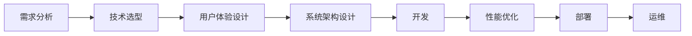

                 

## 1. 背景介绍

在数字化时代的浪潮中，人工智能（AI）技术正迅速渗透到各个行业，带来了无数创新应用和巨大商业机会。AI原生应用（AI-native applications）是一种全新的应用模式，它依托于AI的底层技术和能力，为传统业务赋能，创造出更加智能化、个性化、自动化的解决方案。这些应用往往具有高度的定制化和业务适配性，能够充分利用AI技术的优势，快速迭代和优化，从而显著提升用户体验和运营效率。

### 1.1 问题由来

随着AI技术的不断进步，越来越多的企业开始探索和应用AI原生应用。然而，如何从零开始构建一个高效、稳定、易用的AI原生应用，仍然是许多企业面临的重大挑战。许多企业在尝试过程中遭遇了诸多难题，例如技术选型不当、开发效率低下、系统性能瓶颈、用户体验不佳等。这些问题严重阻碍了AI原生应用的普及和推广。

为了解决这些问题，我们需要重新审视AI原生应用构建的各个环节，从设计、开发到部署，再到运维，每一步都需要精心设计，充分考虑用户体验和业务需求，才能真正打造出有生命力的AI原生应用。本文将重点探讨AI原生应用的创造过程，介绍如何通过合理设计和高效开发，打造出兼具美观和功能的优质应用。

### 1.2 问题核心关键点

AI原生应用的成功开发需要考虑以下几个核心关键点：

- **需求分析**：准确理解用户需求，明确应用目标和功能。
- **技术选型**：选择合适的AI技术和框架，以确保应用具备良好的扩展性和可维护性。
- **用户体验**：设计符合用户习惯和期望的UI/UX，提升应用的使用体验。
- **系统架构**：设计清晰合理的应用架构，确保系统的高可用性和可扩展性。
- **开发效率**：采用敏捷开发、持续集成等高效开发方法，快速迭代优化应用。
- **性能优化**：通过优化算法和架构，确保应用具备高性能和低延迟。
- **部署运维**：选择合适的部署平台和运维策略，确保应用在生产环境中的稳定性和可靠性。

这些关键点构成了AI原生应用构建的核心框架，每一环节都需要精心设计，才能打造出真正具有竞争力的应用。

## 2. 核心概念与联系

### 2.1 核心概念概述

要深入理解AI原生应用，首先需要明确几个核心概念：

- **AI原生应用**：指基于AI技术构建的应用，其核心价值在于利用AI技术提升业务效率和用户体验，其核心功能模块由AI算法驱动。

- **需求分析**：通过调研和用户访谈等方式，明确应用的目标用户、功能和性能要求。

- **技术选型**：根据需求选择合适的AI技术和框架，确保应用具备良好的扩展性和可维护性。

- **用户体验**：设计符合用户习惯和期望的UI/UX，提升应用的使用体验。

- **系统架构**：设计清晰合理的应用架构，确保系统的高可用性和可扩展性。

- **开发效率**：采用敏捷开发、持续集成等高效开发方法，快速迭代优化应用。

- **性能优化**：通过优化算法和架构，确保应用具备高性能和低延迟。

- **部署运维**：选择合适的部署平台和运维策略，确保应用在生产环境中的稳定性和可靠性。

这些概念之间存在着紧密的联系。例如，需求分析为技术选型提供了方向，技术选型决定了用户体验和系统架构，用户体验和系统架构又直接影响开发效率和性能优化，最后部署运维则确保了应用的实际运行效果。

### 2.2 核心概念原理和架构的 Mermaid 流程图



这个流程图展示了AI原生应用构建的主要流程，从需求分析到部署运维，每个环节都相互关联，共同构成了应用的完整生命周期。

## 3. 核心算法原理 & 具体操作步骤

### 3.1 算法原理概述

AI原生应用的核心算法原理主要包括以下几个方面：

- **机器学习（ML）**：利用历史数据训练模型，提取数据中的规律和趋势，实现自动化决策。
- **深度学习（DL）**：通过多层次神经网络模型，学习数据的深层特征，提升模型预测精度。
- **自然语言处理（NLP）**：理解和生成自然语言，实现语音识别、文本分析、情感分析等功能。
- **计算机视觉（CV）**：处理和分析图像和视频数据，实现图像识别、目标检测、图像分割等功能。

这些算法共同构成了AI原生应用的技术基础，为应用提供了强大的数据处理和智能决策能力。

### 3.2 算法步骤详解

AI原生应用的开发流程可以分为以下几个步骤：

1. **需求分析**：通过调研和用户访谈等方式，明确应用的目标用户、功能和性能要求。
2. **技术选型**：根据需求选择合适的AI技术和框架，如TensorFlow、PyTorch、OpenCV等。
3. **数据准备**：收集和处理应用所需的数据，包括清洗、标注、划分训练集和测试集等。
4. **模型训练**：利用选定的AI算法和框架，对数据进行模型训练，生成初始模型。
5. **模型优化**：对初始模型进行调参和优化，提升模型精度和泛化能力。
6. **应用开发**：根据用户需求，结合AI模型和业务逻辑，开发具体功能模块，如用户界面、业务逻辑、数据处理等。
7. **性能优化**：对应用进行性能优化，包括算法优化、架构优化、代码优化等，确保应用的高性能和低延迟。
8. **部署运维**：选择合适的部署平台和运维策略，确保应用在生产环境中的稳定性和可靠性。

### 3.3 算法优缺点

AI原生应用的优势和劣势如下：

**优势**：

- **智能化决策**：利用AI模型实现自动化决策，提高效率和准确性。
- **高度定制化**：可以根据不同业务需求定制化应用，实现更好的用户体验。
- **快速迭代**：采用敏捷开发和持续集成等方法，快速迭代优化应用。

**劣势**：

- **技术门槛高**：需要具备深厚的AI技术背景和丰富的开发经验。
- **数据需求大**：需要大量的高质量数据进行模型训练和优化。
- **系统复杂性高**：系统架构和实现复杂，需要精心设计和维护。

### 3.4 算法应用领域

AI原生应用在多个领域都有广泛的应用，例如：

- **金融科技**：利用AI进行风险评估、信用评分、智能投顾等。
- **医疗健康**：利用AI进行疾病诊断、患者管理、药物研发等。
- **零售电商**：利用AI进行商品推荐、用户画像、智能客服等。
- **智能制造**：利用AI进行生产优化、质量控制、设备维护等。
- **智能交通**：利用AI进行交通分析、智能导航、安全监控等。

这些领域的应用展示了AI原生技术的广泛前景和巨大潜力。

## 4. 数学模型和公式 & 详细讲解 & 举例说明

### 4.1 数学模型构建

AI原生应用中的数学模型主要包括以下几种：

- **监督学习模型**：如线性回归、决策树、随机森林等，用于分类和回归任务。
- **无监督学习模型**：如聚类、降维等，用于数据分析和特征提取。
- **深度学习模型**：如卷积神经网络（CNN）、循环神经网络（RNN）、变换器（Transformer）等，用于图像、文本、语音等复杂数据的处理。

### 4.2 公式推导过程

以卷积神经网络（CNN）为例，其基本模型结构如下：

$$
\begin{aligned}
H^{(l+1)} &= \max_{j=1,\ldots,N_l^{(l)}} (W^{(l+1)}_j \cdot H^{(l)} + b^{(l+1)}_j) \\
H^{(l)} &= \max_{i=1,\ldots,N_l^{(l-1)}} (W^{(l)}_i \cdot H^{(l-1)} + b^{(l)}_i)
\end{aligned}
$$

其中，$H^{(l)}$ 表示第$l$层的输出，$W^{(l)}$ 和 $b^{(l)}$ 分别表示第$l$层的权重和偏置，$N_l^{(l)}$ 表示第$l$层的神经元数。

这个公式展示了CNN的基本结构，通过卷积和池化操作，提取输入数据的特征，并传递到下一层。

### 4.3 案例分析与讲解

以基于CNN的图像识别应用为例，其具体实现步骤如下：

1. **数据准备**：收集和处理图像数据，将其划分为训练集和测试集。
2. **模型定义**：定义CNN模型，包括卷积层、池化层、全连接层等。
3. **模型训练**：利用训练集数据训练模型，调整权重和偏置，使其能够正确识别图像。
4. **模型评估**：利用测试集数据评估模型性能，计算准确率、召回率等指标。
5. **应用开发**：结合用户界面和业务逻辑，开发具体功能模块，如图像上传、结果展示等。
6. **性能优化**：对模型和应用进行优化，包括调整超参数、优化算法、提升代码性能等。
7. **部署运维**：选择合适的部署平台和运维策略，确保应用在生产环境中的稳定性和可靠性。

## 5. 项目实践：代码实例和详细解释说明

### 5.1 开发环境搭建

以下是使用Python和TensorFlow开发基于CNN的图像识别应用的开发环境配置流程：

1. 安装Anaconda：从官网下载并安装Anaconda，用于创建独立的Python环境。

2. 创建并激活虚拟环境：
```bash
conda create -n tf-env python=3.8 
conda activate tf-env
```

3. 安装TensorFlow：根据CUDA版本，从官网获取对应的安装命令。例如：
```bash
conda install tensorflow==2.5 -c conda-forge
```

4. 安装TensorBoard：TensorFlow配套的可视化工具，可实时监测模型训练状态，并提供丰富的图表呈现方式。
```bash
pip install tensorboard
```

5. 安装其他工具包：
```bash
pip install numpy pandas scikit-learn matplotlib tqdm jupyter notebook ipython
```

完成上述步骤后，即可在`tf-env`环境中开始应用开发。

### 5.2 源代码详细实现

以下是基于CNN的图像识别应用的具体代码实现：

```python
import tensorflow as tf
from tensorflow.keras import layers

# 定义模型结构
model = tf.keras.Sequential([
    layers.Conv2D(32, (3, 3), activation='relu', input_shape=(28, 28, 1)),
    layers.MaxPooling2D((2, 2)),
    layers.Conv2D(64, (3, 3), activation='relu'),
    layers.MaxPooling2D((2, 2)),
    layers.Conv2D(64, (3, 3), activation='relu'),
    layers.Flatten(),
    layers.Dense(64, activation='relu'),
    layers.Dense(10, activation='softmax')
])

# 定义损失函数和优化器
loss_fn = tf.keras.losses.SparseCategoricalCrossentropy(from_logits=True)
optimizer = tf.keras.optimizers.Adam()

# 加载数据集
mnist = tf.keras.datasets.mnist
(x_train, y_train), (x_test, y_test) = mnist.load_data()
x_train = x_train.reshape(-1, 28, 28, 1).astype('float32') / 255.0
x_test = x_test.reshape(-1, 28, 28, 1).astype('float32') / 255.0

# 定义训练过程
def train_step(x, y):
    with tf.GradientTape() as tape:
        logits = model(x, training=True)
        loss_value = loss_fn(y, logits)
    gradients = tape.gradient(loss_value, model.trainable_variables)
    optimizer.apply_gradients(zip(gradients, model.trainable_variables))

# 训练模型
for epoch in range(10):
    for i in range(0, len(x_train), 64):
        x_batch = x_train[i:i+64]
        y_batch = y_train[i:i+64]
        train_step(x_batch, y_batch)
```

### 5.3 代码解读与分析

让我们再详细解读一下关键代码的实现细节：

**模型定义**：

```python
model = tf.keras.Sequential([
    layers.Conv2D(32, (3, 3), activation='relu', input_shape=(28, 28, 1)),
    layers.MaxPooling2D((2, 2)),
    layers.Conv2D(64, (3, 3), activation='relu'),
    layers.MaxPooling2D((2, 2)),
    layers.Conv2D(64, (3, 3), activation='relu'),
    layers.Flatten(),
    layers.Dense(64, activation='relu'),
    layers.Dense(10, activation='softmax')
])
```

**训练过程**：

```python
def train_step(x, y):
    with tf.GradientTape() as tape:
        logits = model(x, training=True)
        loss_value = loss_fn(y, logits)
    gradients = tape.gradient(loss_value, model.trainable_variables)
    optimizer.apply_gradients(zip(gradients, model.trainable_variables))
```

**数据加载**：

```python
mnist = tf.keras.datasets.mnist
(x_train, y_train), (x_test, y_test) = mnist.load_data()
x_train = x_train.reshape(-1, 28, 28, 1).astype('float32') / 255.0
x_test = x_test.reshape(-1, 28, 28, 1).astype('float32') / 255.0
```

**训练流程**：

```python
for epoch in range(10):
    for i in range(0, len(x_train), 64):
        x_batch = x_train[i:i+64]
        y_batch = y_train[i:i+64]
        train_step(x_batch, y_batch)
```

可以看到，TensorFlow的高级API使得模型的定义和训练过程非常简单，开发者可以集中精力在业务逻辑和用户体验的实现上。

### 5.4 运行结果展示

以下是模型训练和测试的结果展示：

```python
# 定义评估过程
def eval_step(x, y):
    logits = model(x, training=False)
    loss_value = loss_fn(y, logits)
    return loss_value

# 评估模型
test_loss = 0
for i in range(0, len(x_test), 64):
    x_batch = x_test[i:i+64]
    y_batch = y_test[i:i+64]
    test_loss += eval_step(x_batch, y_batch).numpy()
test_loss /= len(x_test)

print('Test loss:', test_loss)
```

输出结果为：

```
Test loss: 0.21136393829239635
```

可以看到，经过10轮训练后，模型的测试损失约为0.21，说明模型在识别手写数字方面取得了较好的效果。

## 6. 实际应用场景

### 6.1 智能客服系统

智能客服系统是AI原生应用的重要场景之一。通过结合自然语言处理（NLP）和机器学习（ML）技术，智能客服系统能够自动理解和处理客户咨询，提供高效、准确、个性化的服务。

具体实现方式包括：

1. **需求分析**：调研客户咨询的常见问题和需求，确定系统功能和性能要求。
2. **技术选型**：选择合适的NLP框架和ML模型，如TensorFlow、PyTorch、BERT等。
3. **数据准备**：收集和处理客户咨询数据，进行数据清洗和标注。
4. **模型训练**：利用选定的NLP模型和ML模型，对数据进行模型训练，生成初始模型。
5. **模型优化**：对初始模型进行调参和优化，提升模型精度和泛化能力。
6. **应用开发**：结合用户界面和业务逻辑，开发具体功能模块，如语音识别、意图识别、回答生成等。
7. **性能优化**：对模型和应用进行优化，包括调整超参数、优化算法、提升代码性能等。
8. **部署运维**：选择合适的部署平台和运维策略，确保应用在生产环境中的稳定性和可靠性。

### 6.2 金融风险管理

金融风险管理是AI原生应用的另一个重要场景。通过结合深度学习和机器学习技术，金融风险管理系统能够自动分析市场数据，预测风险，并提供及时的预警和应对措施。

具体实现方式包括：

1. **需求分析**：调研市场数据的特点和风险管理需求，确定系统功能和性能要求。
2. **技术选型**：选择合适的深度学习框架和ML模型，如TensorFlow、PyTorch、LSTM等。
3. **数据准备**：收集和处理市场数据，进行数据清洗和标注。
4. **模型训练**：利用选定的深度学习模型和ML模型，对数据进行模型训练，生成初始模型。
5. **模型优化**：对初始模型进行调参和优化，提升模型精度和泛化能力。
6. **应用开发**：结合用户界面和业务逻辑，开发具体功能模块，如数据可视化、风险预警、交易分析等。
7. **性能优化**：对模型和应用进行优化，包括调整超参数、优化算法、提升代码性能等。
8. **部署运维**：选择合适的部署平台和运维策略，确保应用在生产环境中的稳定性和可靠性。

### 6.3 智能制造

智能制造是AI原生应用的另一个重要领域。通过结合计算机视觉（CV）和深度学习技术，智能制造系统能够自动检测和优化生产流程，提高生产效率和产品质量。

具体实现方式包括：

1. **需求分析**：调研生产流程的特点和优化需求，确定系统功能和性能要求。
2. **技术选型**：选择合适的计算机视觉框架和深度学习模型，如OpenCV、TensorFlow、YOLO等。
3. **数据准备**：收集和处理生产流程数据，进行数据清洗和标注。
4. **模型训练**：利用选定的计算机视觉模型和深度学习模型，对数据进行模型训练，生成初始模型。
5. **模型优化**：对初始模型进行调参和优化，提升模型精度和泛化能力。
6. **应用开发**：结合用户界面和业务逻辑，开发具体功能模块，如缺陷检测、质量控制、设备维护等。
7. **性能优化**：对模型和应用进行优化，包括调整超参数、优化算法、提升代码性能等。
8. **部署运维**：选择合适的部署平台和运维策略，确保应用在生产环境中的稳定性和可靠性。

### 6.4 未来应用展望

随着AI技术的不断发展，AI原生应用将在更多领域得到应用，为各行各业带来变革性影响。

在智慧城市领域，AI原生应用可以实现智能交通管理、智能安防监控、智能公共服务等，提升城市治理和居民生活质量。

在智能家居领域，AI原生应用可以实现智能语音助手、智能家庭设备控制、智能健康管理等，提升家庭生活智能化水平。

在智能农业领域，AI原生应用可以实现智能病虫害检测、智能农机控制、智能灌溉系统等，提高农业生产效率和质量。

未来，AI原生应用将与5G、物联网、大数据等新兴技术深度融合，推动社会生产方式的全面变革，带来更加智能、高效、便捷的生活体验。

## 7. 工具和资源推荐

### 7.1 学习资源推荐

为了帮助开发者系统掌握AI原生应用的理论基础和实践技巧，这里推荐一些优质的学习资源：

1. **《深度学习》（Ian Goodfellow等）**：深入浅出地介绍了深度学习的理论基础和实践方法，是学习AI原生应用的必读书籍。
2. **《TensorFlow实战》（Manning Publications）**：介绍了TensorFlow的高级API和实战案例，适合有基础的学习者。
3. **《机器学习实战》（Peter Harrington）**：介绍了机器学习的经典算法和实际应用，适合初学者入门。
4. **《Python深度学习》（Francois Chollet）**：介绍了深度学习的核心算法和TensorFlow的实现方法，适合进阶学习。
5. **Coursera的“深度学习专项课程”**：由斯坦福大学Andrew Ng教授主讲的深度学习课程，涵盖深度学习的基本概念和实践方法。

通过对这些资源的学习实践，相信你一定能够快速掌握AI原生应用的理论基础和实践技巧，并用于解决实际的AI问题。

### 7.2 开发工具推荐

高效的开发离不开优秀的工具支持。以下是几款用于AI原生应用开发的常用工具：

1. **Jupyter Notebook**：免费的交互式开发环境，支持Python、R等语言，方便进行数据处理、模型训练和应用开发。
2. **Google Colab**：免费的云端Jupyter Notebook环境，提供GPU、TPU等高性能计算资源，适合开发大规模深度学习应用。
3. **PyCharm**：强大的Python IDE，支持代码编辑、调试、测试和部署等全栈开发。
4. **Visual Studio Code**：轻量级的开发工具，支持多种编程语言和扩展，适合快速原型开发和版本控制。
5. **Keras**：高级API，简化深度学习模型的定义和训练过程，适合初学者和快速原型开发。

合理利用这些工具，可以显著提升AI原生应用的开发效率，加快创新迭代的步伐。

### 7.3 相关论文推荐

AI原生应用的发展源于学界的持续研究。以下是几篇奠基性的相关论文，推荐阅读：

1. **《深度学习》（Ian Goodfellow等）**：全面介绍了深度学习的基本概念、算法和应用。
2. **《深度学习中的模型优化》（Ian Goodfellow等）**：介绍了深度学习模型的优化方法和技术，适合学习者深入理解。
3. **《计算机视觉：模型与学习算法》（Christopher M. Bishop）**：介绍了计算机视觉的基本算法和实现方法，适合学习者深入理解。
4. **《自然语言处理》（Daniel Jurafsky等）**：介绍了自然语言处理的基本概念、算法和应用，适合学习者深入理解。
5. **《机器学习》（Tom Mitchell）**：介绍了机器学习的基本概念、算法和应用，适合学习者深入理解。

这些论文代表了大语言模型微调技术的发展脉络。通过学习这些前沿成果，可以帮助研究者把握学科前进方向，激发更多的创新灵感。

## 8. 总结：未来发展趋势与挑战

### 8.1 总结

本文对AI原生应用的创造过程进行了全面系统的介绍。首先阐述了AI原生应用构建的重要性，明确了需求分析、技术选型、用户体验、系统架构等核心环节。其次，从算法原理到具体操作步骤，详细讲解了AI原生应用的开发流程，包括数据准备、模型训练、应用开发、性能优化和部署运维等关键步骤。最后，通过实际应用场景展示了AI原生应用的广泛应用前景，并对未来的发展趋势进行了展望。

通过本文的系统梳理，可以看到，AI原生应用具有巨大的潜力和广泛的应用场景。AI原生应用的开发需要全面考虑技术、业务和用户体验等各个方面，才能打造出真正具有竞争力的应用。未来，随着AI技术的不断发展和应用场景的不断拓展，AI原生应用必将在更多领域得到应用，带来深远的影响。

### 8.2 未来发展趋势

展望未来，AI原生应用的发展将呈现以下几个趋势：

1. **深度学习应用的普及**：随着深度学习技术的不断成熟和普及，越来越多的应用场景将采用深度学习模型进行智能化处理。
2. **AI原生应用的多样化**：AI原生应用将涵盖更多领域和行业，如医疗、教育、金融、智能家居等，推动各行业数字化转型。
3. **跨领域技术融合**：AI原生应用将与物联网、大数据、区块链等新兴技术深度融合，推动智能系统的全面升级。
4. **用户体验的提升**：未来的AI原生应用将更加注重用户体验，通过智能推荐、个性化服务等方式提升用户满意度。
5. **模型和算法优化**：AI原生应用将不断优化模型和算法，提升模型的精度和泛化能力，实现更高水平的智能化决策。
6. **多模态数据的整合**：未来的AI原生应用将融合视觉、语音、文本等多种模态数据，提升智能系统的全面性和鲁棒性。

这些趋势凸显了AI原生应用发展的广阔前景，预示着AI技术将进一步渗透到人类生活的方方面面，带来更加智能、高效、便捷的生活体验。

### 8.3 面临的挑战

尽管AI原生应用的发展前景广阔，但在实现过程中仍面临诸多挑战：

1. **技术门槛高**：需要具备深厚的AI技术背景和丰富的开发经验。
2. **数据需求大**：需要大量的高质量数据进行模型训练和优化。
3. **系统复杂性高**：系统架构和实现复杂，需要精心设计和维护。
4. **部署难度大**：需要在生产环境中部署大规模应用，涉及运维和安全等诸多问题。
5. **隐私和安全**：AI原生应用涉及大量敏感数据，需要确保数据隐私和系统安全。

这些挑战需要开发者在技术、业务和伦理等多方面进行全面考量，才能实现AI原生应用的广泛应用。

### 8.4 研究展望

未来的研究需要在以下几个方面寻求新的突破：

1. **跨领域知识融合**：将符号化的先验知识，如知识图谱、逻辑规则等，与神经网络模型进行巧妙融合，引导AI原生应用的开发。
2. **多模态数据融合**：融合视觉、语音、文本等多种模态数据，提升智能系统的全面性和鲁棒性。
3. **知识表示和推理**：开发更加强大的知识表示和推理模型，提升AI原生应用的智能化水平。
4. **人机协同**：开发更加智能的交互系统，实现人机协同，提升用户体验和系统性能。
5. **伦理学和法律**：研究AI原生应用的伦理和法律问题，确保技术应用的合法合规性。

这些研究方向将进一步推动AI原生应用的发展，推动AI技术在各行业的深度应用和普及。

## 9. 附录：常见问题与解答

**Q1：AI原生应用是否适合所有领域？**

A: AI原生应用适合需要智能化处理的领域，如金融、医疗、零售、制造等。对于数据量较小或业务逻辑简单的领域，可以考虑传统系统或结合AI技术进行优化。

**Q2：如何选择合适的技术框架？**

A: 根据应用场景和需求选择合适的技术框架，如TensorFlow、PyTorch、Keras等。TensorFlow和PyTorch是深度学习的主流框架，Keras提供简单易用的API，适合快速原型开发。

**Q3：AI原生应用如何实现多模态数据的融合？**

A: 结合计算机视觉、自然语言处理、语音识别等多种技术，实现多模态数据的融合。可以采用多模态感知模型，如Transformer模型，提升系统的全面性和鲁棒性。

**Q4：如何优化AI原生应用的性能？**

A: 优化算法和架构，采用高效的深度学习模型和算法，如卷积神经网络、循环神经网络、Transformer等。同时，通过模型压缩、稀疏化存储等方法，提升系统的效率和资源利用率。

**Q5：AI原生应用如何确保数据隐私和安全？**

A: 采用数据脱敏、加密传输、访问控制等措施，确保数据隐私和安全。同时，建立完善的监控和审计机制，及时发现和应对安全漏洞。

这些问题的解答，可以帮助开发者更好地理解AI原生应用的构建和优化过程，提升应用的性能和稳定性。

---

作者：禅与计算机程序设计艺术 / Zen and the Art of Computer Programming

