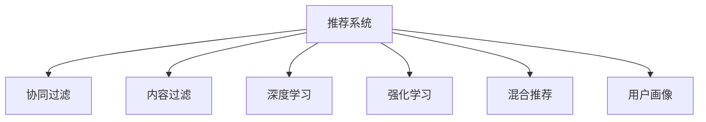

                 

# AI在产品推荐系统中的应用

> 关键词：产品推荐系统, 推荐算法, 深度学习, 协同过滤, 内容过滤, 交叉验证, 强化学习, 用户行为分析, 实时推荐, 用户画像, 模型评估

## 1. 背景介绍

随着互联网的迅猛发展和电子商务的兴起，海量的商品信息与用户数据构成了电商平台的庞大知识图谱。如何精准地为用户推荐感兴趣的物品，提高用户满意度，提升转化率，已经成为电商网站和内容平台亟需解决的难题。

传统推荐算法，如协同过滤、基于内容的过滤、混合过滤等，均依赖于用户历史行为数据进行推荐。但随着用户行为的多样化和数据隐私保护的呼声，这类算法逐渐面临数据稀疏、模型公平性和隐私保护的挑战。

近年来，AI和大数据技术的快速发展，为推荐系统提供了新的解决方案。通过利用深度学习和协同过滤技术，构建出更加智能、个性化和泛化的推荐模型，显著提升了推荐系统的准确性和覆盖面。AI推荐系统已经成为互联网应用的核心驱动力之一。

## 2. 核心概念与联系

### 2.1 核心概念概述

为更好地理解AI在推荐系统中的应用，本节将介绍几个关键概念：

- **推荐系统**：通过分析用户行为数据，为用户推荐其感兴趣的商品或内容的系统。推荐系统的目标是通过推荐引擎对用户提供个性化、满足用户需求的服务。
- **协同过滤**：基于用户-物品交互矩阵进行推荐的一种方式，通过分析用户的行为和物品的属性，进行隐式和显式特征的协同计算，找到相似用户或相似物品，以此进行推荐。
- **基于内容的推荐**：通过提取物品的描述、属性等特征，构建用户兴趣与物品特征之间的相似度矩阵，实现推荐。
- **深度学习**：利用神经网络对用户行为数据进行建模，发现高维空间中的特征关系，从而提升推荐系统的性能。
- **强化学习**：利用奖励机制，让推荐系统通过不断试错，调整策略，最大化用户满意度，从而提升推荐效果。
- **混合推荐**：将协同过滤、内容推荐、深度学习、强化学习等多种推荐算法进行组合，发挥各自优势，提供更全面、准确的推荐服务。
- **用户画像**：对用户基本信息、行为特征、社交属性、购买偏好等进行全面分析，构建用户全面画像，指导推荐系统的个性化策略。

这些核心概念之间的逻辑关系可以通过以下Mermaid流程图来展示：



这个流程图展示了两类核心推荐算法和模型：

1. 协同过滤、内容过滤、深度学习和强化学习。它们分别从不同角度对推荐系统进行建模和优化。
2. 用户画像，通过构建全面的用户特征，为推荐系统提供个性化的指导。

## 3. 核心算法原理 & 具体操作步骤
### 3.1 算法原理概述

AI在推荐系统中的应用，本质上是通过深度学习和协同过滤算法，对用户行为数据进行建模，从而为用户推荐感兴趣的商品或内容。

形式化地，假设用户集合为 $U$，物品集合为 $I$，用户对物品的评分矩阵为 $R \in \mathbb{R}^{m \times n}$，其中 $m$ 为物品数量，$n$ 为用户数量。推荐系统的目标是通过模型 $f$，预测用户对物品的评分 $\hat{R}$，即：

$$
\hat{R}=f(X)
$$

其中 $X$ 为用户的特征向量。推荐模型需要最小化预测评分与实际评分之间的差异，即最小化均方误差：

$$
\min_{f}\mathbb{E}_{(x,y)\sim R}[(\hat{R}(x) - y)^2]
$$

通过优化上述目标，模型 $f$ 学习到用户-物品评分的关系，从而为每个用户推荐评分较高的物品。

### 3.2 算法步骤详解

基于深度学习的推荐系统，一般包括数据准备、模型训练、推荐推理等关键步骤：

**Step 1: 准备训练数据**
- 收集用户行为数据，如点击、浏览、评分、购买等，形成用户-物品评分矩阵 $R$。
- 对用户特征和物品特征进行编码，形成特征矩阵 $X$。

**Step 2: 设计推荐模型**
- 选择合适的深度学习框架和模型架构，如TensorFlow、PyTorch等。
- 定义模型的输入和输出，选择合适的损失函数和优化器。

**Step 3: 训练模型**
- 使用交叉验证、小批量梯度下降等技术，训练模型参数。
- 在验证集上评估模型性能，根据评价指标（如MAE、RMSE等）调整超参数。

**Step 4: 推荐推理**
- 根据用户输入的特征，对物品评分进行预测。
- 根据评分排序，推荐评分最高的物品给用户。

**Step 5: 模型优化与上线部署**
- 根据线上反馈，对模型进行持续迭代优化。
- 部署模型到线上系统，提供推荐服务。

### 3.3 算法优缺点

基于深度学习的推荐系统，相比传统算法，具有以下优点：
1. 可解释性较强。深度学习模型通过可视化特征图、热力图等工具，能够清楚地解释推荐结果的生成过程。
2. 推荐效果显著。深度学习模型能够捕捉高维数据中的复杂关系，生成更加多样化的推荐结果。
3. 实时性较好。通过模型预测和排序，推荐系统能够实时提供推荐结果，提升用户体验。

同时，该方法也存在一定的局限性：
1. 对数据质量要求高。深度学习模型需要大量高质量的用户行为数据进行训练，否则效果不理想。
2. 模型复杂度高。深度学习模型通常包含多个层，计算复杂度高，训练时间长。
3. 容易过拟合。由于模型参数多，如果训练数据较少，容易出现过拟合现象。
4. 泛化能力不足。如果新用户行为数据较少，推荐系统难以有效推荐。

尽管存在这些局限性，但就目前而言，基于深度学习的推荐系统仍然是大数据推荐的主要范式。未来相关研究的重点在于如何进一步降低模型复杂度、提高泛化能力和实时性，同时兼顾推荐效果和可解释性等因素。

### 3.4 算法应用领域

基于深度学习的推荐系统，在电子商务、新闻推荐、社交网络、视频平台等多个领域均有广泛应用，具体包括：

1. 电商平台：如Amazon、淘宝等，通过推荐系统提高用户购买转化率和满意度。
2. 新闻网站：如今日头条、腾讯新闻等，通过推荐系统提供个性化新闻订阅和内容推荐。
3. 社交网络：如Facebook、微信等，通过推荐系统提供个性化朋友圈和动态新闻推送。
4. 视频平台：如YouTube、爱奇艺等，通过推荐系统提供个性化视频内容推荐。
5. 数字广告：通过推荐系统进行精准广告投放，提升广告点击率和转化率。

这些应用场景展示了AI推荐系统的强大能力，能够在不同领域提供个性化、精准的推荐服务。

## 4. 数学模型和公式 & 详细讲解 & 举例说明

### 4.1 数学模型构建

在深度学习推荐系统中，常用的模型架构包括矩阵分解、神经网络等。这里我们以矩阵分解为例，讲解推荐系统的数学模型构建。

假设用户-物品评分矩阵 $R$ 可以表示为一个低秩矩阵的乘积形式：

$$
R = \hat{P}\hat{Q}^T + B
$$

其中 $\hat{P} \in \mathbb{R}^{m \times k}, \hat{Q} \in \mathbb{R}^{k \times n}$ 为潜在因子矩阵，$B$ 为均值矩阵。通过最小化均方误差，训练得到 $\hat{P}$ 和 $\hat{Q}$：

$$
\min_{\hat{P},\hat{Q}} \frac{1}{2N}\sum_{i,j}(R_{ij}-(\hat{P}_i\hat{Q}_j^T+b_{ij})^2
$$

**公式推导过程**

通过对矩阵分解模型的最小二乘解进行求解，可以得到 $\hat{P}$ 和 $\hat{Q}$ 的表达式：

$$
\hat{P} = U \Sigma V^T, \hat{Q} = V \Sigma U^T
$$

其中 $U \in \mathbb{R}^{m \times k}, V \in \mathbb{R}^{k \times n}$ 为左、右潜在因子矩阵，$\Sigma$ 为对角矩阵。通过求解 $U, V, \Sigma$，即完成了推荐模型的训练。

### 4.2 公式推导过程

通过对矩阵分解模型的最小二乘解进行求解，可以得到 $\hat{P}$ 和 $\hat{Q}$ 的表达式：

$$
\hat{P} = U \Sigma V^T, \hat{Q} = V \Sigma U^T
$$

其中 $U \in \mathbb{R}^{m \times k}, V \in \mathbb{R}^{k \times n}$ 为左、右潜在因子矩阵，$\Sigma$ 为对角矩阵。通过求解 $U, V, \Sigma$，即完成了推荐模型的训练。

**案例分析与讲解**

以电商平台商品推荐为例，通过深度学习推荐系统，能够捕捉用户行为数据中的复杂关系，生成个性化推荐结果。

假设用户对商品的评分矩阵为 $R \in \mathbb{R}^{100 \times 10}$，其中行表示商品，列表示用户。使用矩阵分解模型，将 $R$ 表示为两个低秩矩阵的乘积：

$$
R = \hat{P}\hat{Q}^T + B
$$

其中 $\hat{P} \in \mathbb{R}^{100 \times 5}, \hat{Q} \in \mathbb{R}^{5 \times 10}$。训练过程中，最小化均方误差，得到 $\hat{P}$ 和 $\hat{Q}$，从而生成推荐结果。

## 5. 项目实践：代码实例和详细解释说明
### 5.1 开发环境搭建

在进行推荐系统开发前，我们需要准备好开发环境。以下是使用Python进行TensorFlow开发的环境配置流程：

1. 安装Anaconda：从官网下载并安装Anaconda，用于创建独立的Python环境。

2. 创建并激活虚拟环境：
```bash
conda create -n tf-env python=3.8 
conda activate tf-env
```

3. 安装TensorFlow：根据CUDA版本，从官网获取对应的安装命令。例如：
```bash
conda install tensorflow=2.8 -c tf
```

4. 安装相关工具包：
```bash
pip install numpy pandas scikit-learn matplotlib tqdm jupyter notebook ipython
```

完成上述步骤后，即可在`tf-env`环境中开始推荐系统开发。

### 5.2 源代码详细实现

下面以电商平台商品推荐为例，使用TensorFlow实现推荐系统的代码实现。

首先，定义推荐模型的输入输出和损失函数：

```python
import tensorflow as tf

class Recommender(tf.keras.Model):
    def __init__(self, num_users, num_items, latent_factors=10):
        super().__init__()
        self.num_users = num_users
        self.num_items = num_items
        self.latent_factors = latent_factors
        
        # 用户潜在因子矩阵
        self.user_factor = tf.Variable(tf.random.normal([num_users, latent_factors]))
        # 物品潜在因子矩阵
        self.item_factor = tf.Variable(tf.random.normal([num_items, latent_factors]))
        # 均值矩阵
        self.mean_matrix = tf.Variable(tf.zeros([num_users, num_items]))
        
        self.beta = 1.0
        
    def call(self, user_idx, item_idx):
        user_factor = tf.nn.embedding_lookup(self.user_factor, user_idx)
        item_factor = tf.nn.embedding_lookup(self.item_factor, item_idx)
        user_item_score = tf.matmul(user_factor, item_factor, transpose_b=True)
        return user_item_score + self.mean_matrix
    
    def loss(self, y_true, y_pred):
        return tf.reduce_mean((y_true - y_pred)**2) + tf.reduce_mean(tf.square(self.mean_matrix))
```

接着，定义训练函数和评估函数：

```python
@tf.function
def train_step(user_idx, item_idx, y_true):
    with tf.GradientTape() as tape:
        y_pred = self(user_idx, item_idx)
        loss = self.loss(y_true, y_pred)
    gradients = tape.gradient(loss, self.trainable_variables)
    optimizer.apply_gradients(zip(gradients, self.trainable_variables))
    
@tf.function
def evaluate_step(user_idx, item_idx, y_true):
    y_pred = self(user_idx, item_idx)
    return y_pred, tf.reduce_mean((y_true - y_pred)**2)
```

最后，启动训练流程并在测试集上评估：

```python
epochs = 10
batch_size = 512
num_users = 1000
num_items = 10000

# 加载训练集和测试集
train_dataset = tf.data.Dataset.from_tensor_slices((train_user_idx, train_item_idx, train_y_true))
train_dataset = train_dataset.shuffle(buffer_size=10000).batch(batch_size)
test_dataset = tf.data.Dataset.from_tensor_slices((test_user_idx, test_item_idx, test_y_true))
test_dataset = test_dataset.batch(batch_size)

# 定义优化器
optimizer = tf.keras.optimizers.Adam(learning_rate=0.01)

# 训练模型
for epoch in range(epochs):
    for user_idx, item_idx, y_true in train_dataset:
        train_step(user_idx, item_idx, y_true)
    
    # 在测试集上评估
    y_pred, loss = evaluate_step(test_user_idx, test_item_idx, test_y_true)
    print(f"Epoch {epoch+1}, loss: {loss:.4f}")
    
print("Model training complete.")
```

以上就是使用TensorFlow实现电商平台商品推荐的完整代码实现。可以看到，TensorFlow提供了便捷高效的计算图机制，使得模型训练和推理过程变得简单直观。

### 5.3 代码解读与分析

让我们再详细解读一下关键代码的实现细节：

**Recommender类**：
- `__init__`方法：初始化模型参数，包括用户潜在因子矩阵、物品潜在因子矩阵和均值矩阵。
- `call`方法：实现模型的前向传播，计算用户和物品的潜在因子矩阵乘积，并加上均值矩阵。
- `loss`方法：定义损失函数，最小化预测评分与实际评分之间的均方误差，并加入均值矩阵的L2正则化。

**训练函数train_step**：
- 使用`tf.GradientTape`自动求导，计算梯度并更新模型参数。

**评估函数evaluate_step**：
- 同样使用`tf.GradientTape`自动求导，计算损失，返回预测评分和均方误差。

**训练流程**：
- 定义总的epoch数和批大小，开始循环迭代
- 每个epoch内，在训练集上训练，输出平均loss
- 在测试集上评估，输出预测评分和均方误差

可以看到，TensorFlow配合自定义的推荐模型，使得商品推荐系统的开发变得相对简单。

## 6. 实际应用场景
### 6.1 电商商品推荐

电商平台的商品推荐系统，通过AI技术对用户行为数据进行建模，生成个性化推荐结果。推荐系统能够精准地识别用户偏好，推荐用户可能感兴趣的物品，提高用户购买转化率和满意度。

在技术实现上，可以收集用户浏览、点击、评分、购买等行为数据，构建用户-物品评分矩阵。使用深度学习模型，如矩阵分解、神经网络等，对评分矩阵进行建模，生成推荐结果。

电商推荐系统已经成为电商平台的重要组成部分，用户行为数据驱动的推荐算法，为用户提供了便捷的购物体验。

### 6.2 视频平台内容推荐

视频平台如YouTube、爱奇艺等，利用AI推荐技术，为用户推荐其感兴趣的视频内容。推荐系统能够根据用户历史观看行为，预测用户可能喜欢的视频，显著提升用户黏性和平台活跃度。

在技术实现上，可以收集用户观看历史、点击、收藏、评分等数据，构建用户-视频评分矩阵。使用深度学习模型，如协同过滤、内容过滤等，对评分矩阵进行建模，生成推荐结果。

视频推荐系统已经成为视频平台的核心驱动力，用户行为数据驱动的推荐算法，为用户提供了丰富的内容体验。

### 6.3 新闻网站内容推荐

新闻网站如今日头条、腾讯新闻等，通过AI推荐技术，为用户推荐其感兴趣的新闻内容。推荐系统能够根据用户历史阅读行为，预测用户可能感兴趣的新闻，提高用户阅读量和平台曝光度。

在技术实现上，可以收集用户阅读历史、点击、收藏、分享等数据，构建用户-新闻评分矩阵。使用深度学习模型，如协同过滤、内容过滤等，对评分矩阵进行建模，生成推荐结果。

新闻推荐系统已经成为新闻网站的重要组成部分，用户行为数据驱动的推荐算法，为用户提供了个性化的新闻阅读体验。

### 6.4 社交网络好友推荐

社交网络如Facebook、微信等，利用AI推荐技术，为用户推荐其感兴趣的好友。推荐系统能够根据用户好友互动行为，预测用户可能感兴趣的新好友，提升用户社交体验和平台活跃度。

在技术实现上，可以收集用户好友互动、消息、评论等数据，构建用户-好友互动矩阵。使用深度学习模型，如协同过滤、内容过滤等，对互动矩阵进行建模，生成推荐结果。

社交推荐系统已经成为社交网络的重要组成部分，用户行为数据驱动的推荐算法，为用户提供了丰富的社交体验。

## 7. 工具和资源推荐
### 7.1 学习资源推荐

为了帮助开发者系统掌握推荐系统的理论基础和实践技巧，这里推荐一些优质的学习资源：

1. **《Recommender Systems》书籍**：斯坦福大学教授Jian Liu等人所著，全面介绍了推荐系统的理论和算法。

2. **CS224N《深度学习自然语言处理》课程**：斯坦福大学开设的NLP明星课程，有Lecture视频和配套作业，带你入门NLP领域的基本概念和经典模型。

3. **Kaggle推荐系统竞赛**：Kaggle平台提供了多个推荐系统竞赛，通过实践能够更好地理解推荐系统的应用场景和数据处理。

4. **Recommender Systems Conference (RecSys)**：全球顶级推荐系统学术会议，定期发布最新研究成果，推荐关注相关论文和视频。

5. **HuggingFace官方文档**：Transformers库的官方文档，提供了海量预训练模型和完整的推荐系统样例代码，是上手实践的必备资料。

通过对这些资源的学习实践，相信你一定能够快速掌握推荐系统的精髓，并用于解决实际的推荐问题。

### 7.2 开发工具推荐

高效的开发离不开优秀的工具支持。以下是几款用于推荐系统开发的常用工具：

1. **TensorFlow**：由Google主导开发的开源深度学习框架，生产部署方便，适合大规模工程应用。推荐用于构建复杂的深度学习推荐模型。

2. **PyTorch**：基于Python的开源深度学习框架，灵活动态的计算图，适合快速迭代研究。推荐用于构建深度学习推荐模型和进行模型调试。

3. **Surprise**：开源推荐系统库，提供多种推荐算法实现，适合快速开发推荐系统原型。

4. **Scikit-learn**：基于Python的科学计算库，提供丰富的机器学习工具，适合进行数据处理和模型评估。

5. **TorchServe**：TensorFlow模型部署工具，提供模型API服务，适合构建推荐系统服务。

6. **Amazon SageMaker**：AWS提供的AI平台，提供便捷的模型部署、A/B测试等功能，适合进行大规模推荐系统实验。

合理利用这些工具，可以显著提升推荐系统的开发效率，加快创新迭代的步伐。

### 7.3 相关论文推荐

推荐系统领域的研究非常活跃，以下是几篇奠基性的相关论文，推荐阅读：

1. **《TensorFlow Recommenders》论文**：Google开源的推荐系统框架，详细介绍了TensorFlow Recommenders的设计和应用。

2. **《Deep Collaborative Filtering with Matrix Factorization》论文**：Facebook提出的深度协同过滤算法，使用了神经网络对用户行为数据进行建模。

3. **《Neural Collaborative Filtering》论文**：Amazon提出的深度协同过滤算法，使用了多层神经网络对用户行为数据进行建模。

4. **《AutoRec: Automated Recommu-inder Generation with Recurrent Neural Networks》论文**：Amazon提出的基于LSTM的协同过滤算法，利用深度学习模型对用户行为数据进行建模。

5. **《Hybrid Deep Neural Network and SVM for Recommendation System》论文**：华为提出的混合推荐算法，结合了深度学习和传统机器学习算法，提高了推荐系统的性能。

这些论文代表了大规模推荐系统的研究进展，通过学习这些前沿成果，可以帮助研究者把握推荐系统的最新动态，激发更多的创新灵感。

## 8. 总结：未来发展趋势与挑战

### 8.1 总结

本文对基于深度学习的推荐系统进行了全面系统的介绍。首先阐述了推荐系统的背景和意义，明确了AI推荐系统的应用场景和潜在价值。其次，从原理到实践，详细讲解了推荐系统的数学模型和关键步骤，给出了推荐系统开发的完整代码实例。同时，本文还广泛探讨了推荐系统在电商、视频、新闻、社交等多个领域的应用前景，展示了AI推荐系统的强大能力。

通过本文的系统梳理，可以看到，基于深度学习的推荐系统已经成为互联网应用的核心驱动力之一。AI推荐系统通过深度学习技术，对用户行为数据进行建模，生成个性化推荐结果，显著提升了用户体验和平台价值。未来，伴随AI技术的进一步发展和应用，推荐系统必将在更多领域发挥更加重要的作用。

### 8.2 未来发展趋势

展望未来，推荐系统的发展趋势主要体现在以下几个方面：

1. **深度学习推荐算法**：深度学习推荐算法将不断演进，从单一的协同过滤、内容过滤等，到混合推荐、强化学习等，将更加全面、准确地为用户推荐商品或内容。

2. **个性化推荐**：基于用户画像和行为数据的个性化推荐算法，将不断提升推荐系统的性能，推荐结果将更加贴合用户兴趣和需求。

3. **实时推荐**：通过构建实时推荐系统，能够及时响应用户需求，提升推荐系统的时间和精度。

4. **跨模态推荐**：利用视觉、语音、文本等多模态数据，构建更加丰富、全面的推荐系统。

5. **在线学习推荐**：通过在线学习算法，不断更新推荐模型，适应数据分布的变化，提升推荐系统泛化能力。

6. **可解释性推荐**：通过可视化工具和解释性算法，提升推荐系统的透明性和可信度，满足用户对推荐结果的解释需求。

这些趋势将引领推荐系统向更加智能化、个性化、实时化的方向发展，为AI技术在更多领域的应用提供新的突破。

### 8.3 面临的挑战

尽管AI推荐系统已经取得了显著的成果，但在迈向更加智能化、普适化应用的过程中，它仍面临着诸多挑战：

1. **数据质量瓶颈**：推荐系统需要大量高质量的用户行为数据进行训练，但数据采集和处理成本高昂，数据质量难以保证。如何降低数据采集成本，提高数据质量，是一个重要挑战。

2. **模型泛化能力**：推荐模型面临冷启动和长尾问题，新用户和新物品的推荐效果往往不理想。如何提升模型泛化能力，对新用户和新物品进行有效推荐，需要进一步研究。

3. **计算资源消耗**：深度学习推荐模型通常包含多个层，计算复杂度高，训练时间长。如何优化模型结构，提高推理速度，降低计算资源消耗，是一个重要挑战。

4. **模型公平性**：推荐系统容易出现偏差，导致特定用户或特定物品的推荐效果不佳。如何保证推荐系统的公平性，是一个重要挑战。

5. **用户隐私保护**：推荐系统需要收集大量用户行为数据，如何保护用户隐私，防止数据泄露，是一个重要挑战。

6. **推荐系统透明度**：推荐系统的决策过程缺乏透明度，难以解释和调试。如何提升推荐系统的透明度，是一个重要挑战。

这些挑战将需要在算法设计、数据处理、模型训练等方面进行综合考虑，才能实现推荐系统的可持续发展。

### 8.4 研究展望

面向未来，推荐系统的研究将需要在以下几个方面寻求新的突破：

1. **多模态推荐**：利用视觉、语音、文本等多模态数据，构建更加全面、丰富的推荐系统。

2. **在线学习推荐**：通过在线学习算法，不断更新推荐模型，适应数据分布的变化，提升推荐系统泛化能力。

3. **个性化推荐**：基于用户画像和行为数据的个性化推荐算法，将不断提升推荐系统的性能，推荐结果将更加贴合用户兴趣和需求。

4. **深度学习推荐算法**：深度学习推荐算法将不断演进，从单一的协同过滤、内容过滤等，到混合推荐、强化学习等，将更加全面、准确地为用户推荐商品或内容。

5. **可解释性推荐**：通过可视化工具和解释性算法，提升推荐系统的透明性和可信度，满足用户对推荐结果的解释需求。

6. **推荐系统公平性**：如何保证推荐系统的公平性，对新用户和新物品进行有效推荐，需要进一步研究。

7. **冷启动和长尾问题**：如何提升模型泛化能力，对新用户和新物品进行有效推荐，需要进一步研究。

这些研究方向的探索，必将引领推荐系统技术迈向更高的台阶，为构建安全、可靠、可解释、可控的智能系统铺平道路。面向未来，推荐系统还需要与其他AI技术进行更深入的融合，如知识表示、因果推理、强化学习等，多路径协同发力，共同推动推荐系统的进步。

## 9. 附录：常见问题与解答

**Q1：推荐系统如何处理冷启动问题？**

A: 冷启动问题是指新用户或新物品没有历史行为数据，推荐系统无法进行有效推荐。常用的方法包括：

1. **基于内容的推荐**：利用物品属性和描述信息，构建推荐模型。

2. **协同过滤推荐**：利用已存在用户的历史行为数据，推测新用户的行为，进行推荐。

3. **混合推荐**：将基于内容的推荐和协同过滤推荐结合，提升推荐效果。

4. **社交网络推荐**：利用用户的社交网络关系，推荐新物品。

**Q2：推荐系统如何应对数据稀疏问题？**

A: 数据稀疏问题是指用户行为数据较少，推荐系统无法进行有效推荐。常用的方法包括：

1. **矩阵分解推荐**：利用矩阵分解模型，对数据进行低秩逼近，填补缺失数据。

2. **基于深度学习的推荐**：利用深度学习模型，对高维数据进行建模，填补缺失数据。

3. **用户画像**：通过收集用户基本信息、社交属性等，构建用户画像，提升推荐效果。

4. **社交网络推荐**：利用用户的社交网络关系，推荐新物品。

**Q3：推荐系统如何提高推荐效果？**

A: 提高推荐效果的方法包括：

1. **数据采集和处理**：收集更多高质量的用户行为数据，对数据进行清洗和预处理，提高数据质量。

2. **模型优化**：选择合适的推荐算法，进行参数调优，提升模型性能。

3. **特征工程**：对用户行为数据和物品属性进行特征工程，提升特征表示能力。

4. **多模型融合**：将多个推荐模型进行融合，提升推荐系统的泛化能力和鲁棒性。

5. **实时推荐**：构建实时推荐系统，及时响应用户需求，提升推荐系统的时间和精度。

6. **用户画像**：通过收集用户基本信息、行为数据、社交属性等，构建用户画像，提升推荐效果。

这些方法需要在数据、算法、工程等多个维度进行综合考虑，才能实现推荐系统的可持续发展。

**Q4：推荐系统如何保护用户隐私？**

A: 保护用户隐私的方法包括：

1. **数据匿名化**：对用户行为数据进行匿名化处理，保护用户隐私。

2. **差分隐私**：在数据采集和处理过程中，引入差分隐私技术，保护用户隐私。

3. **数据加密**：对用户数据进行加密处理，保护数据安全。

4. **隐私保护算法**：使用隐私保护算法，保护用户隐私。

5. **合规性管理**：遵循相关法律法规，保护用户隐私。

这些方法需要在数据处理、算法设计、合规性管理等多个方面进行综合考虑，才能实现推荐系统的隐私保护。

---

作者：禅与计算机程序设计艺术 / Zen and the Art of Computer Programming

