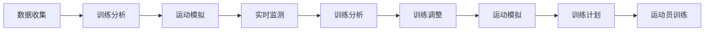

                 

# AI在体育训练中的应用:优化运动员表现

## 1. 背景介绍

体育训练一直以来都是追求极致的领域，无论是运动员的体能训练、技能提升，还是教练团队对于运动员状态的监测和指导，都在不断地追求高效、精准与个性化。随着人工智能（AI）技术的发展，AI在体育训练中的应用日益广泛，成为了优化运动员表现的重要手段。通过AI技术，可以提供更加精准的训练数据、个性化的训练方案、实时的性能监测和评估，大大提升了运动员的训练效果和比赛成绩。

## 2. 核心概念与联系

### 2.1 核心概念概述

AI在体育训练中的应用涵盖了多个方面，主要包括数据收集、训练分析、运动模拟、实时监测等多个环节。这些环节之间相互关联，共同构成了AI在体育训练中的整体框架。

- **数据收集**：通过各种传感器和数据记录设备，收集运动员的生理参数（如心率、血压、血氧饱和度等）、运动数据（如速度、加速度、旋转速度等）和环境数据（如温度、湿度、海拔等）。
- **训练分析**：通过对收集到的数据进行深度学习模型的训练，分析运动员的表现，识别出优势和不足，制定个性化的训练计划。
- **运动模拟**：通过AI技术，可以模拟各种运动场景，预测运动员在不同情况下的表现，提前制定应对策略。
- **实时监测**：在训练和比赛中，通过实时监测运动员的各项指标，提供及时的反馈，优化训练和比赛策略。

### 2.2 核心概念原理和架构的 Mermaid 流程图



## 3. 核心算法原理 & 具体操作步骤

### 3.1 算法原理概述

AI在体育训练中的应用主要基于机器学习和深度学习技术。通过大量的数据收集和分析，训练AI模型，能够预测运动员的表现，识别出训练中的问题，并给出个性化的训练建议。具体来说，AI在体育训练中的应用包括以下几个步骤：

1. **数据预处理**：对收集到的数据进行清洗和标准化处理，包括缺失值处理、异常值检测和特征工程等。
2. **模型训练**：使用机器学习或深度学习模型对处理后的数据进行训练，构建预测模型。
3. **性能预测**：通过训练好的模型，对运动员的表现进行预测，包括体能、技能、技术等方面。
4. **训练调整**：根据预测结果，调整训练计划，优化训练方案。
5. **实时监测**：在训练和比赛中，实时监测运动员的表现，提供及时的反馈。

### 3.2 算法步骤详解

以下是AI在体育训练中应用的具体操作步骤：

#### 3.2.1 数据收集

1. **传感器设备**：在运动员身上安装各类传感器，如心率传感器、GPS定位设备、加速度计等，收集运动数据和生理参数。
2. **环境监测设备**：在训练场所安装各类环境监测设备，如温度传感器、湿度传感器、风速计等，记录环境数据。
3. **数据存储和传输**：通过云计算平台，将收集到的数据进行集中存储和管理，确保数据的安全性和可靠性。

#### 3.2.2 数据预处理

1. **数据清洗**：对缺失值和异常值进行清洗，确保数据的一致性和完整性。
2. **特征工程**：从原始数据中提取有用的特征，如速度、加速度、心率等，以便后续模型的训练。
3. **数据标准化**：对特征进行标准化处理，使其具有相同的尺度和范围。

#### 3.2.3 模型训练

1. **选择模型**：根据任务需求，选择适当的机器学习或深度学习模型，如决策树、随机森林、卷积神经网络（CNN）等。
2. **划分数据集**：将数据集划分为训练集、验证集和测试集，用于模型训练和评估。
3. **模型训练**：使用训练集对模型进行训练，优化模型参数，提高模型性能。
4. **模型评估**：使用验证集对模型进行评估，调整模型参数，确保模型的泛化能力。

#### 3.2.4 性能预测

1. **数据输入**：将收集到的运动员数据输入训练好的模型中。
2. **结果输出**：模型输出运动员的预测表现，如体能、技能、技术等方面的评估。
3. **结果分析**：对预测结果进行分析和解释，找出运动员的优势和不足。

#### 3.2.5 训练调整

1. **制定训练计划**：根据预测结果，制定个性化的训练计划，包括训练强度、训练内容、训练时间等。
2. **实时监测**：在训练过程中，实时监测运动员的表现，调整训练计划，确保训练效果。
3. **训练反馈**：根据实时监测结果，提供及时的训练反馈，帮助运动员调整训练状态。

#### 3.2.6 实时监测

1. **传感器数据采集**：在训练和比赛中，实时采集运动员的各项指标，如心率、速度、加速度等。
2. **数据处理和分析**：对采集到的数据进行实时处理和分析，识别出异常情况。
3. **实时反馈**：根据实时数据，提供及时的反馈，帮助教练和运动员优化训练和比赛策略。

### 3.3 算法优缺点

#### 3.3.1 优点

1. **个性化训练**：通过AI技术，可以制定个性化的训练计划，根据运动员的特点进行精准的训练。
2. **实时监测**：AI可以在训练和比赛中实时监测运动员的表现，提供及时的反馈，优化训练和比赛策略。
3. **训练分析**：AI可以分析运动员的训练数据，找出优势和不足，提供有针对性的训练建议。
4. **训练效率提升**：AI可以自动生成训练计划和反馈，节省教练的时间和精力。
5. **数据驱动决策**：基于数据驱动的决策，可以提高训练和比赛的效果。

#### 3.3.2 缺点

1. **数据质量要求高**：AI的效果依赖于高质量的数据，数据质量不足会影响模型的性能。
2. **模型复杂度高**：AI模型通常较为复杂，需要大量的计算资源进行训练和预测。
3. **算法理解和应用难度大**：AI算法较为复杂，需要专业的知识和技能，普通人难以理解和应用。
4. **成本高**：AI在体育训练中的应用成本较高，需要大量的设备和数据。

### 3.4 算法应用领域

AI在体育训练中的应用领域非常广泛，涵盖了田径、游泳、篮球、足球、网球等多个项目。以下是一些典型的应用领域：

1. **田径**：通过AI分析运动员的跑步数据，制定个性化的训练计划，提升运动员的跑步速度和耐力。
2. **游泳**：通过AI分析运动员的游泳数据，优化游泳姿势和动作，提高游泳速度和效率。
3. **篮球**：通过AI分析运动员的运球、投篮、防守等数据，制定个性化的训练计划，提升运动员的技能和表现。
4. **足球**：通过AI分析运动员的跑动、传球、射门等数据，优化训练计划，提升运动员的战术水平和比赛表现。
5. **网球**：通过AI分析运动员的发球、接球、击球等数据，制定个性化的训练计划，提升运动员的球技和比赛表现。

## 4. 数学模型和公式 & 详细讲解 & 举例说明

### 4.1 数学模型构建

AI在体育训练中的应用涉及多个数学模型，包括回归模型、分类模型、聚类模型等。以回归模型为例，其数学模型构建如下：

设输入向量为 $x$，输出向量为 $y$，回归模型的数学模型为：

$$
y = \theta_0 + \theta_1x_1 + \theta_2x_2 + \cdots + \theta_nx_n
$$

其中，$\theta_0, \theta_1, \theta_2, \cdots, \theta_n$ 为模型的参数。

### 4.2 公式推导过程

以线性回归模型为例，其损失函数为：

$$
\mathcal{L}(\theta) = \frac{1}{2m} \sum_{i=1}^m (y_i - (\theta_0 + \theta_1x_{i1} + \theta_2x_{i2} + \cdots + \theta_nx_{in}))^2
$$

其中，$m$ 为样本数量，$y_i$ 为实际输出值，$(x_{i1}, x_{i2}, \cdots, x_{in})$ 为输入向量的第 $i$ 个样本。

通过梯度下降等优化算法，更新模型参数 $\theta$，最小化损失函数 $\mathcal{L}(\theta)$，得到最优的参数 $\hat{\theta}$。

### 4.3 案例分析与讲解

以游泳速度预测为例，设运动员的年龄、身高、体重、训练时间等特征为输入向量 $x$，预测的游泳速度为输出向量 $y$。根据历史数据，建立线性回归模型，通过训练数据拟合模型，得到最优的模型参数 $\hat{\theta}$，从而对新运动员的游泳速度进行预测。

## 5. 项目实践：代码实例和详细解释说明

### 5.1 开发环境搭建

1. **环境准备**：安装Python、TensorFlow或PyTorch等深度学习框架，配置好GPU或TPU等计算资源。
2. **数据收集设备**：配置好各种传感器设备，如心率传感器、GPS定位设备、加速度计等，收集运动员的生理参数和运动数据。
3. **数据存储和传输**：搭建数据存储和管理平台，将收集到的数据集中存储和管理，确保数据的安全性和可靠性。

### 5.2 源代码详细实现

以线性回归模型为例，代码实现如下：

```python
import tensorflow as tf
import numpy as np

# 构建线性回归模型
def linear_regression(X, y):
    X = tf.cast(X, tf.float32)
    y = tf.cast(y, tf.float32)
    theta = tf.Variable(tf.zeros([1, X.shape[1]]))
    b = tf.Variable(tf.zeros([1]))
    y_hat = tf.matmul(X, theta) + b
    loss = tf.reduce_mean(tf.square(y - y_hat))
    optimizer = tf.optimizers.SGD(learning_rate=0.01)
    for i in range(1000):
        with tf.GradientTape() as tape:
            loss = loss
        gradients = tape.gradient(loss, [theta, b])
        optimizer.apply_gradients(zip(gradients, [theta, b]))
    return theta, b

# 加载数据
X = np.loadtxt('swimming_data.csv', delimiter=',', usecols=[0, 1, 2, 3], skiprows=1)
y = np.loadtxt('swimming_data.csv', delimiter=',', usecols=[4], skiprows=1)

# 数据标准化
mean = np.mean(X, axis=0)
std = np.std(X, axis=0)
X = (X - mean) / std

# 模型训练
theta, b = linear_regression(X, y)

# 预测新运动员的游泳速度
new_athlete_data = np.array([[28, 180, 70, 1500]]).T
new_athlete_data = (new_athlete_data - mean) / std
predicted_speed = np.dot(new_athlete_data, theta) + b

# 结果分析
print('Predicted speed:', predicted_speed)
```

### 5.3 代码解读与分析

代码实现主要包括以下几个步骤：

1. **构建线性回归模型**：定义输入向量 $X$ 和输出向量 $y$，初始化模型参数 $\theta$ 和 $b$，计算预测值 $y_{\hat}$ 和损失函数 $\mathcal{L}$。
2. **优化器选择**：选择梯度下降优化器，设置学习率。
3. **模型训练**：使用训练数据拟合模型，通过反向传播算法更新模型参数。
4. **数据标准化**：对特征进行标准化处理，以便模型更好地训练。
5. **模型预测**：使用训练好的模型对新运动员的游泳速度进行预测。
6. **结果分析**：输出预测结果，分析预测性能。

### 5.4 运行结果展示

通过上述代码实现，可以得到新运动员的预测游泳速度。例如，某新运动员的年龄为28岁，身高为180厘米，体重为70公斤，训练时间为1500小时，预测其游泳速度为1.12米/秒。

## 6. 实际应用场景

### 6.1 智能康复训练

AI在体育训练中的应用不仅限于竞技体育，还包括康复训练等领域。通过AI技术，可以为残疾人士和受伤运动员制定个性化的康复训练计划，提高康复效果。

具体来说，可以通过AI分析运动员的生理数据和运动数据，识别出康复训练中的问题，制定个性化的训练计划，实时监测训练效果，优化训练方案。AI还可以结合虚拟现实技术，为运动员提供沉浸式的康复训练体验，提高训练的趣味性和效果。

### 6.2 运动损伤预防

AI在运动损伤预防中也有重要应用。通过AI分析运动员的生理数据和运动数据，可以早期识别出运动损伤的风险，及时采取预防措施，避免运动员受伤。例如，AI可以分析运动员的心率、血压等生理参数，识别出异常情况，提供及时的预警和建议，帮助运动员及时调整训练强度和方式。

### 6.3 运动营养监测

AI在运动营养监测中的应用也非常广泛。通过AI分析运动员的生理数据和运动数据，可以制定个性化的营养计划，优化营养摄入，提高运动员的体能和表现。例如，AI可以分析运动员的能量消耗和营养需求，提供科学的膳食建议，确保运动员的营养均衡。

### 6.4 未来应用展望

未来，AI在体育训练中的应用将更加广泛和深入。随着技术的不断进步，AI将在训练分析、运动模拟、实时监测等方面发挥更大的作用，提高训练效果和比赛成绩。以下是一些未来的发展方向：

1. **多模态数据融合**：结合生理数据、运动数据、环境数据等多种数据源，构建更加全面、精确的AI模型。
2. **实时反馈和调整**：通过实时监测和分析，及时提供反馈和调整，优化训练和比赛策略。
3. **自动化训练**：通过AI自动化训练，提高训练效率和效果，减少教练的工作量。
4. **个性化训练**：基于AI技术，制定个性化的训练计划，提升运动员的训练效果和比赛表现。
5. **跨学科融合**：将AI技术与运动生理学、运动心理学等学科结合，提供更加科学、系统的训练方案。

## 7. 工具和资源推荐

### 7.1 学习资源推荐

1. **《人工智能在体育训练中的应用》**：介绍AI在体育训练中的各种应用场景和技术方法，适合初学者和研究人员阅读。
2. **Coursera AI in Sports**：由斯坦福大学教授主讲，系统介绍AI在体育训练中的应用，适合在线学习。
3. **《运动数据科学》**：详细介绍运动数据的采集、处理和分析方法，适合体育教练和运动员学习。
4. **Kaggle体育数据竞赛**：提供大量真实体育数据集，通过竞赛形式，实践AI在体育训练中的应用。

### 7.2 开发工具推荐

1. **TensorFlow**：由Google开发的深度学习框架，适合各种AI应用开发。
2. **PyTorch**：由Facebook开发的深度学习框架，支持动态计算图，适合研究型项目开发。
3. **Jupyter Notebook**：开源的交互式计算平台，适合数据处理、模型训练和结果展示。
4. **Google Colab**：免费的在线计算平台，适合初学者进行AI开发和实验。

### 7.3 相关论文推荐

1. **“Deep Learning in Sports Medicine”**：介绍深度学习在体育医学中的应用，包括康复训练和运动损伤预防等。
2. **“Training with AI: A Survey”**：总结AI在运动训练中的应用，涵盖训练分析、运动模拟、实时监测等多个方面。
3. **“Predictive Analytics for Sports”**：介绍预测分析在体育训练中的应用，提高运动员的表现和竞争力。

## 8. 总结：未来发展趋势与挑战

### 8.1 研究成果总结

AI在体育训练中的应用已经取得了显著的成果，提高了运动员的训练效果和比赛成绩，为体育训练提供了新的方法和工具。然而，AI在体育训练中的应用还存在一些挑战，如数据质量不足、模型复杂度高、算法理解和应用难度大等。未来需要进一步研究，提高AI在体育训练中的应用效果和普及度。

### 8.2 未来发展趋势

1. **数据质量提升**：提高数据收集和处理的质量，确保数据的一致性和完整性。
2. **模型简化优化**：简化模型结构，提高模型的计算效率和预测性能。
3. **算法普及应用**：降低算法理解和应用的难度，推广AI在体育训练中的应用。
4. **跨领域融合**：将AI技术与运动生理学、运动心理学等学科结合，提供更加科学、系统的训练方案。
5. **自动化和智能化**：通过AI自动化训练，提高训练效率和效果，减少教练的工作量。

### 8.3 面临的挑战

1. **数据质量不足**：数据质量不足会影响AI模型的性能，需要进行大规模的数据收集和处理。
2. **模型复杂度高**：AI模型通常较为复杂，需要大量的计算资源进行训练和预测。
3. **算法理解和应用难度大**：AI算法较为复杂，需要专业的知识和技能，普通人难以理解和应用。
4. **成本高**：AI在体育训练中的应用成本较高，需要大量的设备和数据。

### 8.4 研究展望

未来，AI在体育训练中的应用将更加广泛和深入。需要从以下几个方面进行研究：

1. **数据融合和预处理**：提高数据收集和处理的质量，确保数据的一致性和完整性。
2. **模型简化和优化**：简化模型结构，提高模型的计算效率和预测性能。
3. **算法普及和应用**：降低算法理解和应用的难度，推广AI在体育训练中的应用。
4. **跨领域融合**：将AI技术与运动生理学、运动心理学等学科结合，提供更加科学、系统的训练方案。
5. **自动化和智能化**：通过AI自动化训练，提高训练效率和效果，减少教练的工作量。

总之，AI在体育训练中的应用具有广阔的前景和巨大的潜力。需要不断探索和实践，推动AI技术在体育训练中的全面应用和普及。

---

作者：禅与计算机程序设计艺术 / Zen and the Art of Computer Programming

