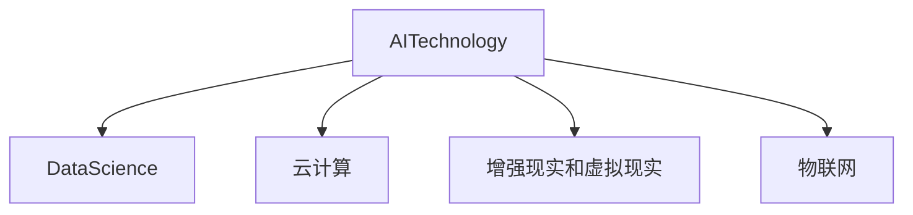

                 

# AI在各领域中的实际应用

## 1. 背景介绍

### 1.1 问题由来

随着人工智能(AI)技术的快速发展，AI在各行各业的应用已经成为了一种常态。从早期的专家系统、机器视觉、自然语言处理(NLP)到近年来的深度学习、强化学习、增强现实(AR)、虚拟现实(VR)等，AI正在深刻改变我们的生产生活方式。本文章将从AI在各领域中的实际应用，深入探讨其技术和应用价值。

### 1.2 问题核心关键点

AI技术的核心关键点在于其强大的数据处理和智能决策能力，能够高效地从大量数据中提取有用信息，并在特定任务中做出智能决策。AI在医疗、金融、教育、制造业、零售、交通等多个领域展现出巨大的应用潜力，为各行各业带来了巨大的价值提升。

## 2. 核心概念与联系

### 2.1 核心概念概述

为更好地理解AI在各领域中的实际应用，本节将介绍几个密切相关的核心概念：

- **AI技术**：包括机器学习、深度学习、自然语言处理、计算机视觉等技术，是实现AI应用的基础。
- **数据科学**：数据收集、清洗、预处理、分析等技术，是AI应用的前提。
- **云计算**：提供高性能计算资源、存储资源，是AI应用的必要条件。
- **增强现实(AR)和虚拟现实(VR)**：增强现实和虚拟现实技术为AI应用提供了新的交互界面，提供了沉浸式、互动式体验。
- **物联网(IoT)**：通过连接各种设备，实时收集数据，为AI应用提供真实世界的实时数据。

这些核心概念之间的逻辑关系可以通过以下Mermaid流程图来展示：



这个流程图展示了一系列的AI技术如何通过数据科学、云计算、增强现实和虚拟现实、物联网等技术手段，实现AI在各领域的实际应用。

## 3. 核心算法原理 & 具体操作步骤
### 3.1 算法原理概述

AI在各领域中的实际应用，本质上是一个跨学科的融合过程，涉及到数据科学、算法优化、模型训练、部署等多个环节。其核心算法原理如下：

1. **数据收集与预处理**：从各个领域收集数据，并进行清洗和预处理，为后续的模型训练提供高质量的数据。
2. **算法选择与优化**：选择合适的算法，并在训练数据集上进行训练，优化算法参数，以达到最佳的性能。
3. **模型训练与验证**：使用训练集训练模型，并在验证集上评估模型性能，调整参数，提高模型泛化能力。
4. **模型部署与优化**：将训练好的模型部署到实际应用环境中，并根据实时数据进行优化，以提高模型效率和准确性。

### 3.2 算法步骤详解

**Step 1: 数据收集与预处理**

- 收集领域内的数据，如医疗数据、金融数据、教育数据、工业数据等。
- 清洗数据，去除重复、异常、无关的数据，确保数据质量。
- 进行数据预处理，如归一化、标准化、特征选择、特征工程等，为后续的模型训练提供支持。

**Step 2: 算法选择与优化**

- 根据问题类型选择适合的算法，如分类、回归、聚类、异常检测等。
- 在训练集上训练模型，并使用交叉验证等技术优化模型参数。
- 根据模型性能在验证集上进行调参，提高模型泛化能力。

**Step 3: 模型训练与验证**

- 使用训练集训练模型，并在验证集上评估模型性能。
- 根据模型表现，调整算法参数、特征工程、正则化等，进一步优化模型。
- 使用测试集对模型进行最终评估，确保模型在新数据上的表现。

**Step 4: 模型部署与优化**

- 将训练好的模型部署到实际应用环境中，如云端服务器、移动设备、嵌入式系统等。
- 根据实时数据，进行在线学习和模型更新，提高模型效率和准确性。
- 使用监控工具，跟踪模型性能，及时发现问题并进行修复。

### 3.3 算法优缺点

AI在各领域中的实际应用，具有以下优点：

1. **高效性**：AI技术能够高效地从大量数据中提取有用信息，自动化处理和分析数据，大大提高了生产效率。
2. **准确性**：通过机器学习、深度学习等技术，AI模型能够实现高精度的预测和分类，提高决策的准确性。
3. **可扩展性**：AI技术可以应用于各种规模的问题，从小型实验到大规模生产系统，具有广泛的应用前景。
4. **实时性**：通过实时数据处理和在线学习，AI模型能够快速响应环境变化，提高系统反应速度。

同时，AI在各领域中应用也存在以下缺点：

1. **数据依赖**：AI应用依赖于高质量的数据，数据收集和预处理难度较大。
2. **算法复杂性**：AI模型训练复杂，需要大量的计算资源和时间。
3. **伦理风险**：AI应用可能存在偏见、歧视等问题，需要严格伦理审查。
4. **可解释性不足**：AI模型通常是“黑箱”，缺乏可解释性，难以理解其内部机制。
5. **安全风险**：AI应用可能存在安全漏洞，被攻击者利用，带来潜在风险。

### 3.4 算法应用领域

AI在各领域中的应用涵盖了以下几个方面：

1. **医疗健康**：AI在医疗健康领域的应用包括疾病诊断、药物研发、个性化医疗等。通过大数据分析和深度学习技术，AI模型能够在大量病例中学习疾病的特征，提高诊断准确性，加速新药研发，提供个性化治疗方案。
2. **金融服务**：AI在金融领域的应用包括信用评估、欺诈检测、投资管理等。通过机器学习和自然语言处理技术，AI模型能够处理海量金融数据，预测市场趋势，识别欺诈行为，优化投资策略。
3. **教育培训**：AI在教育领域的应用包括智能辅导、智能推荐、学习分析等。通过数据分析和深度学习技术，AI模型能够个性化推荐学习资源，智能评估学习效果，提供个性化辅导。
4. **制造业**：AI在制造业的应用包括预测性维护、生产调度、质量控制等。通过物联网和大数据分析技术，AI模型能够实时监控设备状态，预测设备故障，优化生产流程，提高产品质量。
5. **零售电商**：AI在零售电商领域的应用包括客户推荐、库存管理、价格优化等。通过数据分析和深度学习技术，AI模型能够精准推荐商品，优化库存管理，预测销售趋势，提高客户满意度。
6. **交通出行**：AI在交通出行领域的应用包括智能导航、自动驾驶、交通监控等。通过传感器数据和大数据分析技术，AI模型能够实时优化交通路线，提高驾驶安全性，提升交通管理效率。

## 4. 数学模型和公式 & 详细讲解 & 举例说明

### 4.1 数学模型构建

本节将使用数学语言对AI在各领域中的应用进行更加严格的刻画。

设问题数据集为 $\mathcal{D}=\{(x_i,y_i)\}_{i=1}^N$，其中 $x_i$ 为输入特征，$y_i$ 为标签。假设选择的模型为 $M_{\theta}:\mathcal{X} \rightarrow \mathcal{Y}$，其中 $\mathcal{X}$ 为输入空间，$\mathcal{Y}$ 为输出空间，$\theta$ 为模型参数。

定义模型 $M_{\theta}$ 在输入 $x$ 上的损失函数为 $\ell(M_{\theta}(x),y)$，则在数据集 $\mathcal{D}$ 上的经验风险为：

$$
\mathcal{L}(\theta) = \frac{1}{N} \sum_{i=1}^N \ell(M_{\theta}(x_i),y_i)
$$

模型的目标是最小化经验风险，即找到最优参数：

$$
\theta^* = \mathop{\arg\min}_{\theta} \mathcal{L}(\theta)
$$

在实践中，我们通常使用基于梯度的优化算法（如SGD、Adam等）来近似求解上述最优化问题。设 $\eta$ 为学习率，$\lambda$ 为正则化系数，则参数的更新公式为：

$$
\theta \leftarrow \theta - \eta \nabla_{\theta}\mathcal{L}(\theta) - \eta\lambda\theta
$$

其中 $\nabla_{\theta}\mathcal{L}(\theta)$ 为损失函数对参数 $\theta$ 的梯度，可通过反向传播算法高效计算。

### 4.2 公式推导过程

以下我们以医疗健康领域的疾病预测为例，推导随机森林模型的损失函数及其梯度的计算公式。

假设模型 $M_{\theta}$ 在输入 $x$ 上的输出为 $\hat{y}=M_{\theta}(x) \in [0,1]$，表示样本属于某疾病的概率。真实标签 $y \in \{0,1\}$。则二分类交叉熵损失函数定义为：

$$
\ell(M_{\theta}(x),y) = -[y\log \hat{y} + (1-y)\log (1-\hat{y})]
$$

将其代入经验风险公式，得：

$$
\mathcal{L}(\theta) = -\frac{1}{N}\sum_{i=1}^N [y_i\log M_{\theta}(x_i)+(1-y_i)\log(1-M_{\theta}(x_i))]
$$

根据链式法则，损失函数对参数 $\theta_k$ 的梯度为：

$$
\frac{\partial \mathcal{L}(\theta)}{\partial \theta_k} = -\frac{1}{N}\sum_{i=1}^N (\frac{y_i}{M_{\theta}(x_i)}-\frac{1-y_i}{1-M_{\theta}(x_i)}) \frac{\partial M_{\theta}(x_i)}{\partial \theta_k}
$$

其中 $\frac{\partial M_{\theta}(x_i)}{\partial \theta_k}$ 可进一步递归展开，利用自动微分技术完成计算。

在得到损失函数的梯度后，即可带入参数更新公式，完成模型的迭代优化。重复上述过程直至收敛，最终得到适应医疗健康领域的最优模型参数 $\theta^*$。

### 4.3 案例分析与讲解

以下我们将以医疗健康领域的疾病预测为例，详细讲解AI在实际应用中的数学模型构建和公式推导过程。

在医疗健康领域，疾病预测是一个典型的二分类问题。给定患者的临床数据和历史病例数据，使用随机森林模型进行预测，预测结果为该患者是否可能患有某疾病。模型的输入特征为 $x$，输出为 $y$，其中 $x$ 包括患者的年龄、性别、病史、检验结果等。

设模型 $M_{\theta}$ 在输入 $x$ 上的输出为 $\hat{y}=M_{\theta}(x) \in [0,1]$，表示样本属于某疾病的概率。真实标签 $y \in \{0,1\}$。

**随机森林模型构建**：
- 使用随机森林算法构建模型 $M_{\theta}$，设定决策树的深度、叶节点数、特征选择策略等参数。
- 使用训练集 $\mathcal{D}=\{(x_i,y_i)\}_{i=1}^N$ 训练模型，计算每个决策树的分裂点、叶节点等参数。
- 使用测试集对模型进行验证，计算模型的准确率、召回率、F1值等指标。

**随机森林模型训练**：
- 在训练集 $\mathcal{D}$ 上，使用交叉验证等技术优化模型参数。
- 在验证集上评估模型性能，调整参数，提高模型泛化能力。
- 在测试集上对模型进行最终评估，确保模型在新数据上的表现。

**随机森林模型应用**：
- 将训练好的随机森林模型部署到实际应用环境中，如云端服务器、移动设备等。
- 根据实时数据，进行在线学习和模型更新，提高模型效率和准确性。
- 使用监控工具，跟踪模型性能，及时发现问题并进行修复。

## 5. 项目实践：代码实例和详细解释说明
### 5.1 开发环境搭建

在进行AI项目实践前，我们需要准备好开发环境。以下是使用Python进行TensorFlow和Scikit-learn开发的环境配置流程：

1. 安装Anaconda：从官网下载并安装Anaconda，用于创建独立的Python环境。

2. 创建并激活虚拟环境：
```bash
conda create -n ai-env python=3.8 
conda activate ai-env
```

3. 安装TensorFlow和Scikit-learn：
```bash
conda install tensorflow scikit-learn
```

4. 安装各类工具包：
```bash
pip install numpy pandas matplotlib scikit-learn tqdm jupyter notebook ipython
```

完成上述步骤后，即可在`ai-env`环境中开始AI项目实践。

### 5.2 源代码详细实现

下面我们以医疗健康领域的疾病预测为例，给出使用Scikit-learn库进行随机森林模型训练的Python代码实现。

首先，定义疾病预测任务的数据处理函数：

```python
import pandas as pd
import numpy as np
from sklearn.model_selection import train_test_split
from sklearn.ensemble import RandomForestClassifier

def load_data(file_path):
    data = pd.read_csv(file_path)
    data.dropna(inplace=True)
    features = data.drop('disease', axis=1)
    labels = data['disease']
    return features, labels

# 加载数据集
features, labels = load_data('disease_data.csv')

# 数据标准化
from sklearn.preprocessing import StandardScaler
scaler = StandardScaler()
features = scaler.fit_transform(features)

# 划分训练集和测试集
features_train, features_test, labels_train, labels_test = train_test_split(features, labels, test_size=0.2, random_state=42)

# 定义随机森林模型
model = RandomForestClassifier(n_estimators=100, max_depth=5, random_state=42)

# 训练模型
model.fit(features_train, labels_train)

# 预测测试集
predictions = model.predict(features_test)

# 评估模型性能
from sklearn.metrics import classification_report
print(classification_report(labels_test, predictions))
```

然后，定义模型和优化器：

```python
from sklearn.metrics import accuracy_score, precision_score, recall_score, f1_score

# 定义评估函数
def evaluate(model, features_test, labels_test):
    predictions = model.predict(features_test)
    accuracy = accuracy_score(labels_test, predictions)
    precision = precision_score(labels_test, predictions)
    recall = recall_score(labels_test, predictions)
    f1 = f1_score(labels_test, predictions)
    print(f'Accuracy: {accuracy:.2f}, Precision: {precision:.2f}, Recall: {recall:.2f}, F1: {f1:.2f}')

# 评估模型性能
evaluate(model, features_test, labels_test)
```

最后，启动训练流程并在测试集上评估：

```python
from sklearn.model_selection import cross_val_score

# 交叉验证评估模型性能
scores = cross_val_score(model, features, labels, cv=5, scoring='accuracy')
mean_score = np.mean(scores)
print(f'Cross-validation accuracy: {mean_score:.2f}')
```

以上就是使用Scikit-learn库进行随机森林模型训练的完整代码实现。可以看到，得益于Scikit-learn库的强大封装，我们可以用相对简洁的代码完成模型训练和评估。

### 5.3 代码解读与分析

让我们再详细解读一下关键代码的实现细节：

**load_data函数**：
- 加载数据集，并进行清洗，去除缺失值。
- 分离特征和标签，并返回。

**StandardScaler类**：
- 数据标准化，将数据转化为均值为0、方差为1的分布，提高模型训练效果。

**train_test_split函数**：
- 划分训练集和测试集，设定比例为80%训练，20%测试。

**RandomForestClassifier类**：
- 定义随机森林模型，设置决策树的个数、深度等参数。
- 训练模型，使用训练集进行模型拟合。

**evaluate函数**：
- 定义评估函数，计算模型的准确率、精度、召回率和F1值。
- 使用测试集进行模型评估，输出各项指标。

**cross_val_score函数**：
- 进行交叉验证，评估模型在不同数据子集上的性能，计算平均准确率。

通过这些代码的实现，我们可以全面了解随机森林模型在医疗健康领域的疾病预测中的应用。开发者可以将更多精力放在模型改进、参数调优等高层逻辑上，而不必过多关注底层的实现细节。

当然，工业级的系统实现还需考虑更多因素，如模型的保存和部署、超参数的自动搜索、更多的评估指标等。但核心的模型训练流程基本与此类似。

## 6. 实际应用场景
### 6.1 智能客服系统

AI在智能客服系统中的应用，通过自然语言处理和机器学习技术，使机器人能够理解用户的问题，并提供精准的解决方案。智能客服系统已经成为银行、电商、运营商等客户服务的重要组成部分，提升了客户满意度，降低了服务成本。

在技术实现上，可以使用自然语言处理技术对用户输入的问题进行理解和分析，使用机器学习技术训练预测模型，提供个性化的服务。智能客服系统可以自动记录用户的历史问题，不断优化模型的知识库，提升服务质量。

### 6.2 金融风险控制

AI在金融风险控制中的应用，通过机器学习和大数据分析技术，对金融市场进行实时监控，预测金融风险。金融风控系统已经成为银行、保险公司等金融机构的重要工具，提高了风险管理的效率和精度。

在技术实现上，可以使用机器学习技术训练风险预测模型，使用自然语言处理技术对金融新闻和公告进行情感分析，及时发现潜在的金融风险。金融风控系统可以实时监控交易数据，识别异常交易，保障金融安全。

### 6.3 智慧城市管理

AI在智慧城市管理中的应用，通过机器学习和大数据分析技术，对城市数据进行实时监控和分析，提升城市管理效率。智慧城市管理系统已经成为城市管理的重要工具，提升了城市治理水平。

在技术实现上，可以使用机器学习技术训练交通流量预测模型，使用自然语言处理技术对城市舆情进行情感分析，及时发现城市问题，制定应急方案。智慧城市管理系统可以实时监控城市设施，优化资源配置，提升城市生活质量。

### 6.4 未来应用展望

随着AI技术的不断发展，AI在各领域中的应用前景将更加广阔。未来，AI将深入到各个行业的核心业务中，实现智能化、自动化的服务。

在医疗健康领域，AI将广泛应用于疾病预测、个性化治疗、远程医疗等领域，提高医疗服务质量。在金融领域，AI将广泛应用于信用评估、风险控制、投资管理等领域，提升金融服务效率。在教育领域，AI将广泛应用于智能辅导、学习分析、个性化推荐等领域，提升教育服务质量。在制造业领域，AI将广泛应用于预测性维护、智能制造、质量控制等领域，提升制造业生产效率。在零售电商领域，AI将广泛应用于客户推荐、库存管理、价格优化等领域，提升零售电商服务质量。在交通出行领域，AI将广泛应用于智能导航、自动驾驶、交通监控等领域，提升交通出行效率。

未来，AI将与各行业深度融合，实现全行业的智能化转型，为经济社会发展注入新的动力。

## 7. 工具和资源推荐
### 7.1 学习资源推荐

为了帮助开发者系统掌握AI在各领域中的应用，这里推荐一些优质的学习资源：

1. 《深度学习》书籍：Ian Goodfellow等著，全面介绍了深度学习的基本原理和应用，是深度学习领域的经典教材。
2. 《Python数据科学手册》书籍：Jake VanderPlas等著，介绍了Python在数据科学和机器学习中的应用，适合初学者入门。
3. 《TensorFlow官方文档》：TensorFlow官方文档，提供了完整的API文档和代码示例，是TensorFlow学习的必备资源。
4. 《Scikit-learn官方文档》：Scikit-learn官方文档，提供了丰富的机器学习算法和工具，是Scikit-learn学习的必备资源。
5. 《自然语言处理综述》文章：Yoav Goldberg等著，全面介绍了自然语言处理的基本概念和前沿技术，是自然语言处理学习的必备资源。

通过对这些资源的学习实践，相信你一定能够快速掌握AI在各领域的应用，并用于解决实际的AI问题。

### 7.2 开发工具推荐

高效的开发离不开优秀的工具支持。以下是几款用于AI应用开发的常用工具：

1. TensorFlow：由Google主导开发的开源深度学习框架，生产部署方便，适合大规模工程应用。
2. PyTorch：由Facebook主导开发的开源深度学习框架，灵活高效，适合研究和原型开发。
3. Scikit-learn：Python的机器学习库，提供丰富的算法和工具，适合快速原型开发。
4. Keras：基于TensorFlow和Theano的深度学习库，简单易用，适合快速原型开发。
5. Jupyter Notebook：Python的交互式开发工具，适合快速原型开发和共享。

合理利用这些工具，可以显著提升AI应用开发的效率，加快创新迭代的步伐。

### 7.3 相关论文推荐

AI在各领域中的应用源于学界的持续研究。以下是几篇奠基性的相关论文，推荐阅读：

1. Deep Learning：Ian Goodfellow等著，全面介绍了深度学习的基本原理和应用，是深度学习领域的经典教材。
2. Natural Language Processing with Python：Steven Bird等著，介绍了自然语言处理的基本概念和应用，适合初学者入门。
3. ImageNet Classification with Deep Convolutional Neural Networks：Alex Krizhevsky等著，介绍了卷积神经网络在图像分类中的应用，是计算机视觉领域的经典论文。
4. AlphaGo Zero：David Silver等著，介绍了深度强化学习在围棋中的应用，是强化学习领域的经典论文。
5. Language Models are Unsupervised Multitask Learners：Alexander M. Rush等著，介绍了语言模型在无监督学习中的应用，是自然语言处理领域的经典论文。

这些论文代表了大AI应用的发展脉络。通过学习这些前沿成果，可以帮助研究者把握学科前进方向，激发更多的创新灵感。

## 8. 总结：未来发展趋势与挑战
### 8.1 总结

本文对AI在各领域中的应用进行了全面系统的介绍。首先阐述了AI在医疗、金融、教育、制造业、零售、交通等多个领域的应用，明确了AI在各行各业中的重要价值。其次，从原理到实践，详细讲解了AI应用的技术实现流程，给出了AI应用开发和部署的完整代码实例。同时，本文还广泛探讨了AI在实际应用中的各种场景和应用前景，展示了AI技术的广阔前景。

通过本文的系统梳理，可以看到，AI在各领域中的应用正在逐渐深入到各个行业的核心业务中，提升了服务效率和质量，带来了巨大的经济和社会效益。未来，随着AI技术的不断进步，AI将在更多领域得到应用，为人类生产生活方式带来深远影响。

### 8.2 未来发展趋势

展望未来，AI在各领域中的应用将呈现以下几个发展趋势：

1. 智能化程度不断提高。随着AI技术的不断发展，智能化程度将不断提高，能够更好地理解用户需求，提供更加个性化的服务。
2. 跨领域融合更加深入。AI将与其他技术深度融合，实现跨领域智能化，提升各领域的业务水平。
3. 自动化水平逐步提高。AI将逐步实现自动化，自动完成数据处理、模型训练、业务执行等任务，提高业务效率。
4. 实时性不断提升。AI将实现实时数据处理和在线学习，提升业务响应速度和决策速度。
5. 伦理和安全问题得到重视。AI应用将更加注重伦理和安全问题，确保技术应用符合人类价值观和法律法规。

以上趋势凸显了AI在各领域中的广阔前景。这些方向的探索发展，必将进一步提升AI应用的智能化水平，为经济社会发展注入新的动力。

### 8.3 面临的挑战

尽管AI在各领域中的应用已经取得了显著成果，但在迈向更加智能化、自动化的应用过程中，它仍面临着诸多挑战：

1. 数据质量瓶颈。AI应用依赖于高质量的数据，数据收集和预处理难度较大。
2. 算法复杂性。AI算法复杂，需要大量的计算资源和时间。
3. 伦理风险。AI应用可能存在偏见、歧视等问题，需要严格伦理审查。
4. 可解释性不足。AI模型通常是“黑箱”，缺乏可解释性，难以理解其内部机制。
5. 安全风险。AI应用可能存在安全漏洞，被攻击者利用，带来潜在风险。

这些挑战需要我们在技术、伦理、社会等多个维度进行全面探索和应对，才能真正实现AI技术的广泛应用。

### 8.4 研究展望

面对AI在各领域中的各种挑战，未来的研究需要在以下几个方面寻求新的突破：

1. 探索无监督和半监督学习范式。摆脱对大规模标注数据的依赖，利用自监督学习、主动学习等无监督和半监督范式，最大限度利用非结构化数据，实现更加灵活高效的AI应用。
2. 研究参数高效和计算高效的AI范式。开发更加参数高效的AI方法，在固定大部分预训练参数的同时，只更新极少量的任务相关参数。同时优化AI算法的计算图，减少前向传播和反向传播的资源消耗，实现更加轻量级、实时性的部署。
3. 引入更多先验知识。将符号化的先验知识，如知识图谱、逻辑规则等，与神经网络模型进行巧妙融合，引导AI应用学习更准确、合理的知识表示。同时加强不同模态数据的整合，实现视觉、语音等多模态信息与文本信息的协同建模。
4. 纳入伦理道德约束。在AI应用目标中引入伦理导向的评估指标，过滤和惩罚有偏见、有害的输出倾向。同时加强人工干预和审核，建立AI应用的监管机制，确保输出符合人类价值观和伦理道德。
5. 结合因果分析和博弈论工具。将因果分析方法引入AI应用，识别出应用决策的关键特征，增强输出解释的因果性和逻辑性。借助博弈论工具刻画人机交互过程，主动探索并规避AI应用的脆弱点，提高系统稳定性。

这些研究方向的探索，必将引领AI在各领域中的应用不断突破，为构建安全、可靠、可解释、可控的AI系统铺平道路。面向未来，AI在各领域中的应用还需要与其他人工智能技术进行更深入的融合，如知识表示、因果推理、强化学习等，多路径协同发力，共同推动AI技术的进步。

## 9. 附录：常见问题与解答

**Q1: AI在医疗健康领域的应用有哪些？**

A: AI在医疗健康领域的应用包括疾病预测、个性化治疗、远程医疗等。通过深度学习和大数据分析技术，AI模型能够在大量病例中学习疾病的特征，提高诊断准确性，加速新药研发，提供个性化治疗方案。

**Q2: AI在金融领域的应用有哪些？**

A: AI在金融领域的应用包括信用评估、欺诈检测、投资管理等。通过机器学习和自然语言处理技术，AI模型能够处理海量金融数据，预测市场趋势，识别欺诈行为，优化投资策略。

**Q3: AI在教育领域的应用有哪些？**

A: AI在教育领域的应用包括智能辅导、智能推荐、学习分析等。通过数据分析和深度学习技术，AI模型能够个性化推荐学习资源，智能评估学习效果，提供个性化辅导。

**Q4: AI在制造业领域的应用有哪些？**

A: AI在制造业领域的应用包括预测性维护、智能制造、质量控制等。通过物联网和大数据分析技术，AI模型能够实时监控设备状态，预测设备故障，优化生产流程，提高产品质量。

**Q5: AI在零售电商领域的应用有哪些？**

A: AI在零售电商领域的应用包括客户推荐、库存管理、价格优化等。通过数据分析和深度学习技术，AI模型能够精准推荐商品，优化库存管理，预测销售趋势，提高客户满意度。

**Q6: AI在交通出行领域的应用有哪些？**

A: AI在交通出行领域的应用包括智能导航、自动驾驶、交通监控等。通过传感器数据和大数据分析技术，AI模型能够实时优化交通路线，提高驾驶安全性，提升交通管理效率。

**Q7: AI在智慧城市管理中的应用有哪些？**

A: AI在智慧城市管理中的应用包括交通流量预测、城市舆情分析、应急方案制定等。通过机器学习和大数据分析技术，AI模型能够实时监控城市数据，优化资源配置，提升城市治理水平。

通过这些问题和解答，可以看出AI在各领域中的广泛应用和巨大潜力。未来，随着AI技术的不断进步，AI将在更多领域得到应用，为经济社会发展注入新的动力。

---

作者：禅与计算机程序设计艺术 / Zen and the Art of Computer Programming

