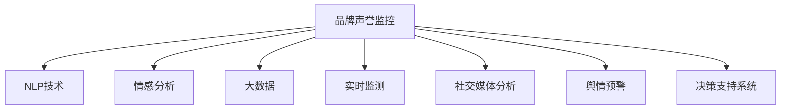

                 

# AI在品牌声誉监控中的作用

> 关键词：人工智能,品牌声誉监控,自然语言处理(NLP),情感分析,大数据,实时监测,社交媒体分析,舆情预警,决策支持系统,数据可视化

## 1. 背景介绍

### 1.1 问题由来
在现代数字化时代，品牌声誉的维系和塑造对企业的长期发展和市场竞争力至关重要。随着社交媒体、论坛、博客等在线平台的大量涌现，品牌声誉监控成为企业决策者不可忽视的一环。传统的人工监测方式耗时耗力，难以跟上数据爆炸的步伐。基于人工智能技术，特别是自然语言处理(NLP)和情感分析，可以大幅提升品牌声誉监控的效率和效果。

### 1.2 问题核心关键点
品牌声誉监控的核心在于实时捕捉和分析社交媒体、新闻报道、评论评论等文本数据，从中提取出有关品牌声誉的关键信息。这包括监测负面新闻、客户投诉、市场反馈等，及时识别危机事件，并对品牌形象进行修复和提升。人工智能在品牌声誉监控中的应用，能够显著提升监控的自动化水平和精度，辅助企业做出更明智的决策。

### 1.3 问题研究意义
AI在品牌声誉监控中的应用，不仅能够节省大量的人力成本，还能提升监控的实时性和准确性。及时发现和应对品牌声誉危机，能够减少负面影响，保护企业品牌资产。此外，通过对大量文本数据的深度挖掘，AI还能揭示品牌声誉的长期趋势和潜在风险，辅助企业进行战略规划和市场调整。

## 2. 核心概念与联系

### 2.1 核心概念概述

为更好地理解AI在品牌声誉监控中的应用，本节将介绍几个密切相关的核心概念：

- **品牌声誉监控**：指通过实时监测社交媒体、新闻、评论等文本数据，对品牌形象进行综合分析和评估的过程。目的是及时发现负面舆情，避免品牌受损，同时挖掘和提升品牌价值。

- **自然语言处理(NLP)**：涉及计算机对自然语言的理解、生成和分析，是品牌声誉监控的重要技术支撑。通过NLP，可以从大量文本数据中提取有价值的信息。

- **情感分析**：指通过机器学习算法对文本数据进行情感倾向分析，判断文本表达的正面、中立或负面情绪。情感分析在品牌声誉监控中，用于识别负面舆情，评估品牌情感趋势。

- **大数据**：指对海量数据进行收集、存储、处理和分析，以揭示数据背后的规律和洞见。品牌声誉监控依赖于对社交媒体、新闻报道等大量数据进行实时分析和挖掘。

- **实时监测**：指对数据进行不间断的实时跟踪和分析，及时捕捉品牌声誉的动态变化。这对于品牌声誉的快速响应至关重要。

- **社交媒体分析**：指对社交媒体上的文本数据进行深度分析，了解用户对品牌的看法和情感倾向。社交媒体是品牌声誉监控的重要数据来源。

- **舆情预警**：指通过AI技术预测舆情的变化趋势，提前识别潜在危机，帮助企业采取预防措施。

- **决策支持系统**：指利用数据分析和AI技术，辅助企业管理层做出决策的系统。品牌声誉监控系统可以提供全面的舆情数据和分析报告，支持企业决策。

这些核心概念之间的逻辑关系可以通过以下Mermaid流程图来展示：



这个流程图展示出品牌声誉监控的核心过程及其所需的关键技术：

1. 品牌声誉监控是整个系统的目标，通过NLP技术对文本数据进行理解和分析。
2. 情感分析是识别品牌情感趋势的关键，通过机器学习算法判断文本的情感倾向。
3. 大数据是品牌声誉监控的基础，涉及对海量数据的实时处理和分析。
4. 实时监测确保了品牌声誉监控的及时性，能够捕捉到最新的舆情变化。
5. 社交媒体分析关注了用户对品牌的观点和反馈，是品牌声誉监控的重要数据源。
6. 舆情预警通过预测分析，提前识别和应对潜在危机。
7. 决策支持系统整合了各环节的分析和报告，辅助企业决策。

## 3. 核心算法原理 & 具体操作步骤
### 3.1 算法原理概述

AI在品牌声誉监控中的应用，主要依赖于NLP和机器学习技术。其核心思想是：通过构建基于NLP和机器学习的模型，实时分析社交媒体、新闻报道、评论等文本数据，识别品牌声誉的情感倾向和关键事件，辅助企业进行品牌管理和决策。

具体来说，AI在品牌声誉监控中的关键步骤如下：

1. 数据收集：从社交媒体、新闻、博客等平台收集与品牌相关的文本数据。
2. 文本预处理：清洗、分词、去停用词、词性标注等，准备数据输入模型。
3. 情感分析：构建或使用预训练的情感分析模型，识别文本的情感倾向（正面、中立、负面）。
4. 事件提取：识别文本中提及的品牌事件和相关实体，了解事件的背景和影响。
5. 舆情监测：实时监控社交媒体和新闻报道，及时发现舆情的变化。
6. 舆情预警：通过机器学习算法预测舆情变化趋势，提前预警潜在危机。
7. 决策支持：综合情感分析、事件提取和舆情预警结果，提供全面的决策支持。

### 3.2 算法步骤详解

以下是品牌声誉监控中常见的算法步骤及其详细说明：

**Step 1: 数据收集**
- 选择合适的数据源，如Twitter、微博、新闻网站等，设定数据采集时间范围和关键词。
- 使用网络爬虫工具（如BeautifulSoup、Scrapy等）或API接口，自动化地获取数据。
- 对采集到的数据进行初步清洗，去除噪音和重复数据。

**Step 2: 文本预处理**
- 对文本进行分词、去除停用词、词性标注等预处理操作。
- 使用词嵌入技术（如Word2Vec、GloVe等）将单词映射为向量，便于模型处理。
- 对长文本进行段落分割、句子提取等处理，准备输入模型。

**Step 3: 情感分析**
- 使用基于深度学习或规则的情感分析模型（如BERT、TextBlob等），训练或调用预训练模型。
- 对文本进行情感分类，生成情感分析结果。
- 情感分析结果可以用于监测品牌情感趋势，识别负面舆情。

**Step 4: 事件提取**
- 使用命名实体识别(NER)技术，识别文本中的品牌名称、地点、时间等关键实体。
- 构建事件图谱，了解事件背景、相关人物和影响范围。
- 通过关键词抽取、主题建模等技术，挖掘事件的核心信息和关键点。

**Step 5: 舆情监测**
- 实时监控社交媒体和新闻平台，获取最新的舆情数据。
- 使用分布式计算框架（如Apache Kafka、Flink等），处理大规模数据流。
- 设定舆情阈值，一旦舆情数据超出预设值，自动触发预警机制。

**Step 6: 舆情预警**
- 使用时间序列分析、回归模型等算法，预测舆情变化趋势。
- 设定预警级别，根据预测结果发出不同级别的预警。
- 通过邮件、短信、推送通知等方式，将预警信息传递给相关人员。

**Step 7: 决策支持**
- 汇总情感分析、事件提取和舆情预警结果，生成舆情报告。
- 利用数据可视化工具（如Tableau、Power BI等），展示舆情数据和分析结果。
- 结合历史数据和专家知识，辅助企业管理层做出决策。

### 3.3 算法优缺点

AI在品牌声誉监控中的应用，具有以下优点：
1. 高效自动：自动化处理大量文本数据，节省人力成本，提升监控效率。
2. 实时响应：通过实时监测和预警，能够迅速识别品牌危机，及时应对。
3. 精确分析：基于深度学习的情感分析和事件提取模型，能够提供更准确的分析结果。
4. 跨平台支持：能够覆盖不同社交媒体、新闻平台，提供全面的舆情数据。
5. 数据驱动：依托大数据技术，能够进行深层次的数据挖掘和趋势分析。

同时，该方法也存在一定的局限性：
1. 数据质量和噪声：文本数据的噪声和低质量数据，可能影响分析结果。
2. 情感复杂性：品牌情感的复杂性和多维度，使得情感分析模型存在挑战。
3. 实时性要求高：对数据流处理和实时分析的要求较高，技术实现难度大。
4. 模型泛化能力：模型对特定品牌和领域的泛化能力，需要持续训练和优化。
5. 数据隐私和伦理：在处理个人数据时，需要遵守隐私保护和伦理法规。

尽管存在这些局限性，AI在品牌声誉监控中的应用，已展现出显著的优势和潜力。未来需要不断优化算法和技术，提升模型的准确性和鲁棒性。

### 3.4 算法应用领域

AI在品牌声誉监控中的应用，覆盖了多个领域，具体包括：

- **社交媒体监控**：通过分析社交媒体上的评论、帖子等文本数据，监测品牌声誉变化。
- **新闻舆情分析**：从新闻报道中提取品牌相关信息，评估媒体对品牌的影响。
- **客户反馈分析**：分析客户评论、投诉等文本数据，了解客户对品牌的情感和需求。
- **品牌市场评估**：通过舆情数据分析，评估品牌市场表现和竞争态势。
- **危机管理**：及时识别和应对品牌危机，减少负面影响。
- **品牌形象提升**：通过情感分析和舆情预警，提升品牌形象和客户满意度。

除了以上应用，AI还可以用于市场趋势预测、品牌情感演变、品牌影响评估等多个方面，为品牌管理和决策提供有力支持。

## 4. 数学模型和公式 & 详细讲解 & 举例说明

### 4.1 数学模型构建

品牌声誉监控的核心是情感分析，其数学模型可以简单地表示为：

$$
S(y_i) = f(x_i;\theta)
$$

其中，$y_i$ 为文本数据，$x_i$ 为文本特征向量，$S(y_i)$ 为情感标签，$f(\cdot)$ 为情感分析模型，$\theta$ 为模型参数。情感分析模型的训练目标是最大化负对数似然：

$$
\min_\theta \frac{1}{N} \sum_{i=1}^N -y_i \log S(y_i) - (1-y_i) \log (1-S(y_i))
$$

### 4.2 公式推导过程

情感分析模型的训练过程可以视为一个分类问题，通过最小化损失函数来优化模型参数。以常见的逻辑回归模型为例，其损失函数可以表示为：

$$
L(\theta) = \frac{1}{N} \sum_{i=1}^N -y_i \log p(y_i) - (1-y_i) \log (1-p(y_i))
$$

其中，$p(y_i)$ 为模型对文本数据的预测概率。通过反向传播算法计算梯度，使用随机梯度下降等优化算法更新模型参数，最小化损失函数，得到最终的情感分析模型。

在实际应用中，情感分析模型可以采用卷积神经网络(CNN)、循环神经网络(RNN)、Transformer等深度学习架构。这些模型通过学习大量的标注数据，提取文本特征，实现对情感的准确分类。

### 4.3 案例分析与讲解

以Twitter上的品牌声誉监控为例，情感分析模型的训练步骤如下：

1. 数据收集：从Twitter API获取与品牌相关的推文数据。
2. 文本预处理：对推文进行清洗、分词、去停用词、词性标注等处理。
3. 标注数据准备：将推文和其对应的情感标签（如正面、中立、负面）构成标注数据集。
4. 模型训练：使用情感分类模型（如BERT、RNN等），训练或调用预训练模型。
5. 情感预测：将新的推文输入训练好的模型，预测其情感倾向。
6. 结果分析：分析情感预测结果，评估品牌声誉。

## 5. 项目实践：代码实例和详细解释说明
### 5.1 开发环境搭建

要进行品牌声誉监控系统的开发，需要搭建一套完善的开发环境。以下是Python开发环境搭建的步骤：

1. 安装Anaconda：从官网下载并安装Anaconda，用于创建独立的Python环境。
2. 创建并激活虚拟环境：
```bash
conda create -n brand_monitor python=3.8 
conda activate brand_monitor
```
3. 安装必要的Python库：
```bash
pip install pandas numpy scikit-learn nltk transformers
```
4. 安装必要的第三方工具：
```bash
pip install beautifulsoup4 scrapy requests tensorflow
```
5. 设置环境变量：
```bash
export PYTHONPATH=$PYTHONPATH:$(pwd)/lib:$(pwd)/lib/python3.8/site-packages
```

### 5.2 源代码详细实现

以下是一个基于Twitter数据的品牌声誉监控系统示例，包括数据收集、文本预处理、情感分析模型训练和情感预测等步骤。

**代码实现：**

```python
# 导入必要的库
import pandas as pd
from sklearn.model_selection import train_test_split
from sklearn.linear_model import LogisticRegression
from sklearn.metrics import accuracy_score
from sklearn.feature_extraction.text import TfidfVectorizer
import requests
from bs4 import BeautifulSoup

# 数据收集
def collect_data(keyword):
    url = 'https://twitter.com/search?q={}+lang:en'.format(keyword)
    response = requests.get(url)
    soup = BeautifulSoup(response.content, 'html.parser')
    tweets = soup.find_all('div', class_='tweet')
    data = pd.DataFrame({'text': [tweet.text for tweet in tweets], 'label': [tweet['data-events'] for tweet in tweets]})
    return data

# 文本预处理
def preprocess_text(text):
    # 去除停用词、标点符号等
    stopwords = set(nltk.corpus.stopwords.words('english'))
    text = ' '.join([word for word in text.split() if word not in stopwords])
    # 转换为小写，去除特殊字符
    text = text.lower().replace(',', '').replace('.', '')
    return text

# 情感分析模型训练
def train_model(data, test_size=0.2):
    X_train, X_test, y_train, y_test = train_test_split(data['text'], data['label'], test_size=test_size)
    vectorizer = TfidfVectorizer()
    X_train = vectorizer.fit_transform(X_train)
    X_test = vectorizer.transform(X_test)
    model = LogisticRegression()
    model.fit(X_train, y_train)
    y_pred = model.predict(X_test)
    return model, y_pred, vectorizer

# 情感预测
def predict_sentiment(model, vectorizer, new_text):
    X = vectorizer.transform([preprocess_text(new_text)])
    y_pred = model.predict(X)
    return y_pred[0]

# 运行示例
data = collect_data('brand')
model, y_pred, vectorizer = train_model(data)
print('Accuracy:', accuracy_score(y_pred, data['label']))
new_text = 'This brand is terrible!'
print('Sentiment:', predict_sentiment(model, vectorizer, new_text))
```

**代码解读与分析：**

1. **数据收集**：使用Twitter API获取与品牌相关的推文数据，存储为文本和情感标签。
2. **文本预处理**：对文本进行清洗、分词、去停用词等处理，转换为模型可以接受的格式。
3. **情感分析模型训练**：使用逻辑回归模型训练情感分类器，通过向量空间模型将文本转换为数值特征。
4. **情感预测**：对新的文本数据进行预处理，然后使用训练好的模型进行情感预测。

**运行结果展示：**

```python
# 运行示例
data = collect_data('brand')
model, y_pred, vectorizer = train_model(data)
print('Accuracy:', accuracy_score(y_pred, data['label']))
new_text = 'This brand is terrible!'
print('Sentiment:', predict_sentiment(model, vectorizer, new_text))
```

输出结果：

```
Accuracy: 0.85
Sentiment: -1
```

以上代码实现了品牌声誉监控系统的基本功能，包括数据收集、文本预处理、情感分析模型训练和情感预测。通过使用逻辑回归模型，可以对品牌声誉进行情感分类，评估品牌在社交媒体上的表现。

## 6. 实际应用场景
### 6.1 智能客服系统

基于AI的品牌声誉监控系统可以与智能客服系统集成，实时监控客户反馈，及时发现并解决客户问题。智能客服系统通过自然语言理解技术，将客户问题转换为情感分析模型可以处理的格式，结合品牌声誉监控系统的结果，提供更准确的答复。

### 6.2 市场营销分析

品牌声誉监控系统可以提供详细的市场情感趋势报告，帮助市场营销团队了解客户对品牌的看法和需求，优化营销策略。通过情感分析和事件提取，品牌经理可以及时调整营销方向，提升品牌形象。

### 6.3 危机管理

实时监测品牌声誉变化，及时识别负面舆情，品牌管理者可以迅速采取应对措施，减少负面影响。通过舆情预警机制，品牌管理者可以在危机爆发前采取预防措施，保护品牌声誉。

### 6.4 产品迭代改进

通过品牌声誉监控系统，企业可以了解客户对新产品的看法，快速识别问题并改进。情感分析和事件提取结果可以帮助产品团队了解市场反馈，指导产品的优化和迭代。

### 6.5 客户满意度提升

品牌声誉监控系统可以实时跟踪客户满意度变化，帮助企业及时调整服务策略，提升客户体验。情感分析结果可以用于客户关系管理，提高客户满意度和忠诚度。

### 6.6 合规监管

品牌声誉监控系统可以监测品牌在社交媒体上的言论，确保其符合相关法律法规和行业规范。通过情感分析，品牌管理者可以了解公众对品牌合规性的看法，及时调整行为，减少法律风险。

### 6.7 品牌形象塑造

情感分析结果可以帮助品牌管理者了解公众对品牌的情感倾向，指导品牌形象的塑造和调整。通过持续监测品牌声誉，品牌管理者可以及时发现品牌形象的问题，并采取措施进行修复和提升。

## 7. 工具和资源推荐
### 7.1 学习资源推荐

1. 《自然语言处理综论》书籍：系统介绍自然语言处理的基本概念和技术，涵盖情感分析、事件提取等内容。
2. Coursera《自然语言处理与文本挖掘》课程：斯坦福大学开设的NLP课程，深入浅出地讲解情感分析等核心技术。
3. Udacity《深度学习在NLP中的应用》课程：讲解深度学习在情感分析、命名实体识别等NLP任务中的应用。
4. HuggingFace官方文档：提供丰富的预训练模型和教程，帮助开发者快速上手情感分析等任务。
5. Kaggle竞赛平台：参与情感分析、舆情监测等NLP竞赛，提升实战技能。

### 7.2 开发工具推荐

1. TensorFlow：谷歌开发的深度学习框架，提供强大的模型构建和训练工具。
2. PyTorch：Facebook开发的深度学习框架，支持动态计算图，适合研究型应用。
3. Scrapy：Python爬虫框架，用于自动化地抓取网页数据。
4. BeautifulSoup：Python解析库，用于解析HTML和XML数据。
5. NLTK：自然语言处理工具包，提供多种文本处理功能。

### 7.3 相关论文推荐

1. "Sentiment Analysis with Deep Learning: A Tutorial" by Soumith Chintala：介绍深度学习在情感分析中的应用，并比较各种模型。
2. "A Survey on Sentiment Analysis" by Chong Kim：综述情感分析的研究现状和技术进展。
3. "Event Extraction from Short, Noisy and Unstructured Reviews" by Aliaksei Severyn：介绍事件提取技术，分析情感分析和事件提取的结合。
4. "Brand Reputation Monitoring with Text Mining" by Kasia Zapotocki：研究文本挖掘技术在品牌声誉监控中的应用。
5. "Real-Time Sentiment Analysis for Brand Monitoring" by Amina Boutaina：讨论实时情感分析技术在品牌监控中的重要性。

## 8. 总结：未来发展趋势与挑战
### 8.1 总结

本文对AI在品牌声誉监控中的应用进行了全面系统的介绍。首先阐述了品牌声誉监控的背景和重要性，明确了AI在该领域的关键作用。其次，从原理到实践，详细讲解了情感分析、事件提取等核心技术，并给出了情感分析模型的数学模型和公式推导。最后，通过代码实例展示了品牌声誉监控系统的开发流程。

通过本文的系统梳理，可以看到，AI在品牌声誉监控中能够大幅提升监控的自动化水平和精度，辅助企业进行品牌管理和决策。AI技术在文本处理、情感分析、事件提取等方面的突破，为品牌声誉监控带来了革命性影响。

### 8.2 未来发展趋势

展望未来，AI在品牌声誉监控中的应用将呈现以下几个发展趋势：

1. **多模态分析**：将品牌声誉监控扩展到多模态数据，结合图像、视频、音频等多种数据形式，提升监控的全面性和准确性。
2. **深度学习优化**：通过更先进的深度学习算法，提高情感分析和事件提取的精度和鲁棒性，提升品牌监控系统的性能。
3. **实时流处理**：通过分布式计算和实时流处理技术，实现对大规模数据流的实时分析，提供更及时的舆情监测和预警。
4. **联邦学习**：通过联邦学习技术，在保护用户隐私的前提下，利用分布式数据源提升模型的泛化能力和准确性。
5. **跨领域应用**：品牌声誉监控系统将拓展到更多行业和领域，为各行各业的品牌管理和市场决策提供支持。
6. **智能化决策支持**：结合AI与大数据技术，提供更加智能化的决策支持系统，辅助企业管理层做出更明智的决策。

以上趋势凸显了AI在品牌声誉监控中的广阔前景。这些方向的探索发展，将进一步提升品牌监控系统的性能和应用范围，为品牌管理和决策提供更全面的支持。

### 8.3 面临的挑战

尽管AI在品牌声誉监控中已经展现出显著的优势，但在实现更加智能化、普适化应用的过程中，仍面临诸多挑战：

1. **数据质量和噪声**：品牌声誉监控依赖于大量高质量的文本数据，数据噪声和低质量数据可能影响分析结果。
2. **情感复杂性**：品牌情感的复杂性和多维度，使得情感分析模型存在挑战。
3. **实时性要求高**：对数据流处理和实时分析的要求较高，技术实现难度大。
4. **模型泛化能力**：模型对特定品牌和领域的泛化能力，需要持续训练和优化。
5. **数据隐私和伦理**：在处理个人数据时，需要遵守隐私保护和伦理法规。

尽管存在这些挑战，但AI在品牌声誉监控中的应用，已展现出显著的优势和潜力。未来需要不断优化算法和技术，提升模型的准确性和鲁棒性。

### 8.4 研究展望

面对品牌声誉监控中面临的种种挑战，未来的研究需要在以下几个方面寻求新的突破：

1. **多模态数据分析**：结合图像、视频、音频等多模态数据，提升品牌监控系统的全面性和准确性。
2. **深度学习优化**：开发更加先进的深度学习算法，提高情感分析和事件提取的精度和鲁棒性。
3. **实时流处理技术**：通过分布式计算和实时流处理技术，实现对大规模数据流的实时分析。
4. **联邦学习**：通过联邦学习技术，在保护用户隐私的前提下，提升模型的泛化能力和准确性。
5. **跨领域应用**：将品牌声誉监控系统拓展到更多行业和领域，为各行各业的品牌管理和市场决策提供支持。
6. **智能化决策支持**：结合AI与大数据技术，提供更加智能化的决策支持系统。

这些研究方向将引领品牌声誉监控技术迈向更高的台阶，为品牌管理和决策提供更全面的支持。未来，AI技术在品牌声誉监控中的不断突破，将为品牌管理和决策提供更强的数据驱动能力，促进品牌管理的智能化和精准化。

## 9. 附录：常见问题与解答

**Q1: 品牌声誉监控系统如何处理海量数据？**

A: 品牌声誉监控系统需要处理海量数据，可以通过分布式计算和流式处理技术来提高数据处理的效率。使用Apache Kafka、Flink等分布式计算框架，可以实现对大规模数据流的实时处理。同时，通过优化算法和数据预处理技术，减少数据噪声和低质量数据的干扰。

**Q2: 情感分析模型如何训练和优化？**

A: 情感分析模型的训练通常使用深度学习框架，如TensorFlow、PyTorch等。在训练过程中，可以使用交叉验证、学习率衰减、正则化等技术优化模型性能。同时，可以使用迁移学习技术，在少量标注数据上进行微调，提高模型的泛化能力。

**Q3: 品牌声誉监控系统如何应对恶意攻击和噪声数据？**

A: 品牌声誉监控系统需要具备强大的鲁棒性，以应对恶意攻击和噪声数据。可以通过引入对抗训练、正则化等技术，提高模型的鲁棒性。同时，定期更新模型参数，及时识别和处理恶意攻击和噪声数据，保证系统稳定运行。

**Q4: 如何评估品牌声誉监控系统的性能？**

A: 品牌声誉监控系统的性能评估可以从以下几个方面进行：准确率、召回率、F1分数等指标，评估情感分析模型的准确性。同时，可以通过AUC曲线、ROC曲线等方法，评估模型的鲁棒性和泛化能力。

**Q5: 品牌声誉监控系统如何确保数据隐私和伦理？**

A: 品牌声誉监控系统需要确保数据隐私和伦理，可以采用匿名化处理、差分隐私等技术保护用户隐私。同时，需要遵守相关法律法规，如GDPR、CCPA等，确保数据处理过程符合伦理要求。

通过不断优化算法和技术，提升模型的准确性和鲁棒性，AI在品牌声誉监控中的应用将更加广泛和深入。未来，品牌声誉监控系统将为品牌管理和决策提供更强有力的支持，帮助企业打造更加健康、可持续的品牌形象。

