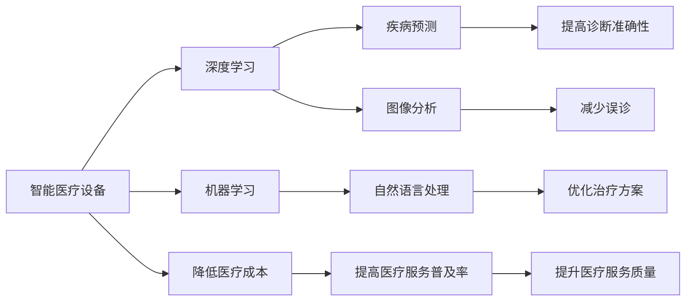

                 

# AI在智能医疗设备中的应用:降低医疗成本

在医疗领域，资源有限、需求巨大，智能医疗设备的应用已经成为降低医疗成本、提升医疗服务质量的关键。人工智能（AI）技术的应用，特别是深度学习（DL）和机器学习（ML）的进展，为智能医疗设备的开发提供了新的可能。本文将深入探讨AI在智能医疗设备中的应用，特别是如何通过降低医疗成本，推动医疗行业的可持续发展。

## 1. 背景介绍

### 1.1 问题由来

全球医疗资源分配不均，尤其是在经济欠发达地区，许多居民无法获得及时有效的医疗服务。医疗成本高昂，不仅加重了患者的经济负担，也限制了医疗服务的普及。智能医疗设备的普及和AI技术的应用，为解决这一问题提供了新的解决途径。

### 1.2 问题核心关键点

- **智能医疗设备**：指通过AI技术赋能，能够提供疾病诊断、病情监控、个性化治疗等服务的医疗设备。
- **深度学习与机器学习**：利用神经网络模型进行疾病预测、图像识别、自然语言处理等任务，提升医疗设备的智能化水平。
- **医疗成本**：包括诊断费用、治疗费用、药品费用等，智能医疗设备通过提高效率、减少误诊、降低资源消耗等方式，可以显著降低这些成本。
- **数据驱动**：智能医疗设备依赖于大量的医学数据，包括病历、影像、基因组数据等，通过这些数据进行模型训练和优化。
- **实时分析**：AI技术可以实现对医疗数据的实时分析和处理，快速响应医疗需求。

### 1.3 问题研究意义

智能医疗设备的普及将显著降低医疗成本，提升医疗服务的普及率。通过AI技术的赋能，可以实现快速、精准、个性化的医疗服务，降低医疗资源浪费，提高医疗服务效率，为更多居民提供可负担的医疗服务。同时，智能医疗设备的应用还将推动医疗行业向更高质量、更高效率的方向发展。

## 2. 核心概念与联系

### 2.1 核心概念概述

- **智能医疗设备**：通过集成AI技术，能够提供疾病诊断、治疗方案推荐、患者监护等功能，改善医疗服务质量的设备。
- **深度学习与机器学习**：利用神经网络模型进行疾病预测、图像分析、自然语言处理等任务，提升医疗设备的功能和性能。
- **医疗成本**：包括诊断费用、治疗费用、药品费用等，智能医疗设备通过提高诊断准确性、减少误诊、降低资源消耗等方式，可以显著降低这些成本。
- **数据驱动**：智能医疗设备依赖于大量的医学数据，包括病历、影像、基因组数据等，通过这些数据进行模型训练和优化。
- **实时分析**：AI技术可以实现对医疗数据的实时分析和处理，快速响应医疗需求。

### 2.2 核心概念原理和架构的 Mermaid 流程图



这个流程图展示了智能医疗设备与深度学习、机器学习之间的联系，以及这些技术如何通过提高诊断准确性、减少误诊、优化治疗方案等方式，降低医疗成本，提升医疗服务质量。

## 3. 核心算法原理 & 具体操作步骤

### 3.1 算法原理概述

基于深度学习和机器学习的智能医疗设备，主要通过以下算法原理进行疾病预测和诊断：

- **卷积神经网络（CNN）**：用于处理图像数据，如X光片、CT扫描等，提取疾病的特征。
- **循环神经网络（RNN）**：用于处理序列数据，如心电图、脑电图等，识别疾病模式。
- **长短期记忆网络（LSTM）**：用于处理时间序列数据，如患者的病历记录，预测疾病发展趋势。
- **自然语言处理（NLP）**：用于处理和分析患者的病历记录、医生报告等文本数据，提取有用的信息。

这些算法通过大量的医学数据进行训练，提高诊断的准确性和效率，从而降低医疗成本。

### 3.2 算法步骤详解

智能医疗设备的核心算法步骤包括：

1. **数据收集**：从医院、诊所、健康管理中心等获取患者的病历、影像、基因组数据等。
2. **数据预处理**：清洗、标准化、归一化数据，提取有用的特征。
3. **模型训练**：使用深度学习和机器学习算法训练模型，如CNN、RNN、LSTM、NLP等。
4. **模型评估**：在独立数据集上评估模型性能，如准确率、召回率、F1分数等。
5. **模型部署**：将训练好的模型部署到智能医疗设备中，实时处理医疗数据。
6. **实时分析**：对输入的医疗数据进行实时分析，提供诊断建议和个性化的治疗方案。

### 3.3 算法优缺点

智能医疗设备的算法优点包括：

- **高效**：使用深度学习和机器学习算法，可以高效地处理大量的医疗数据。
- **精准**：通过大量的医学数据训练，可以提供高精度的诊断和治疗建议。
- **个性化**：根据患者的个体差异，提供个性化的治疗方案。

缺点包括：

- **数据依赖**：需要大量的医学数据进行训练，数据获取和处理成本高。
- **模型复杂**：深度学习模型复杂，训练和推理成本高。
- **可解释性差**：深度学习模型的决策过程不透明，难以解释和解释。

### 3.4 算法应用领域

智能医疗设备的算法主要应用于以下领域：

- **疾病预测和诊断**：使用深度学习算法进行疾病预测和诊断，如癌症、糖尿病、心血管疾病等。
- **影像分析**：使用CNN算法处理和分析X光片、CT扫描等影像数据，辅助诊断。
- **基因组分析**：使用深度学习算法分析基因组数据，预测疾病风险。
- **自然语言处理**：使用NLP算法处理和分析病历记录、医生报告等文本数据，提取有用的信息。
- **患者监护**：使用RNN、LSTM等算法处理时间序列数据，监测患者的病情变化。

## 4. 数学模型和公式 & 详细讲解 & 举例说明

### 4.1 数学模型构建

智能医疗设备的数学模型主要基于深度学习和机器学习算法。以癌症诊断为例，构建的数学模型包括以下几个步骤：

1. **数据集准备**：准备包含癌症诊断标签的医学数据集，如病历、影像数据、基因组数据等。
2. **特征提取**：使用CNN、RNN、LSTM等算法提取特征，如肿瘤的大小、形状、位置等。
3. **模型训练**：使用训练数据训练深度学习模型，如卷积神经网络（CNN）、长短期记忆网络（LSTM）等。
4. **模型评估**：使用测试数据评估模型的性能，如准确率、召回率、F1分数等。
5. **模型部署**：将训练好的模型部署到智能医疗设备中，实时处理新的医疗数据。

### 4.2 公式推导过程

以癌症诊断为例，CNN模型的公式推导过程如下：

假设输入的影像数据为 $x_i$，输出为 $y_i$，其中 $y_i$ 表示是否患有癌症。

- **前向传播**：
  $$
  h_i = \sigma(\sum_{j=1}^n w_{ij}x_{ij} + b_i)
  $$
  $$
  y_i = \sigma(\sum_{j=1}^n w_{ij}h_{ij} + b_i)
  $$

- **损失函数**：
  $$
  L = -\frac{1}{N}\sum_{i=1}^N [y_i\log(y_i) + (1-y_i)\log(1-y_i)]
  $$

- **反向传播**：
  $$
  \frac{\partial L}{\partial w_{ij}} = \frac{\partial L}{\partial y_i}\frac{\partial y_i}{\partial h_i}\frac{\partial h_i}{\partial w_{ij}}
  $$
  $$
  \frac{\partial L}{\partial b_i} = \frac{\partial L}{\partial y_i}\frac{\partial y_i}{\partial h_i}
  $$

通过反向传播算法更新模型的权重和偏置，最小化损失函数 $L$。

### 4.3 案例分析与讲解

以心脏病诊断为例，使用RNN算法进行分析。假设输入的序列数据为 $x_i$，输出为 $y_i$，其中 $y_i$ 表示是否患有心脏病。

- **前向传播**：
  $$
  h_t = \sigma(\sum_{j=1}^n w_{tj}x_{tj} + b_t)
  $$
  $$
  y_t = \sigma(\sum_{j=1}^n w_{tj}h_{tj} + b_t)
  $$

- **损失函数**：
  $$
  L = -\frac{1}{N}\sum_{i=1}^N [y_i\log(y_i) + (1-y_i)\log(1-y_i)]
  $$

- **反向传播**：
  $$
  \frac{\partial L}{\partial w_{tj}} = \frac{\partial L}{\partial y_t}\frac{\partial y_t}{\partial h_t}\frac{\partial h_t}{\partial w_{tj}}
  $$
  $$
  \frac{\partial L}{\partial b_t} = \frac{\partial L}{\partial y_t}\frac{\partial y_t}{\partial h_t}
  $$

通过反向传播算法更新模型的权重和偏置，最小化损失函数 $L$。

## 5. 项目实践：代码实例和详细解释说明

### 5.1 开发环境搭建

在智能医疗设备的开发中，首先需要搭建开发环境。以下是使用Python进行PyTorch开发的环境配置流程：

1. 安装Anaconda：从官网下载并安装Anaconda，用于创建独立的Python环境。
2. 创建并激活虚拟环境：
   ```bash
   conda create -n pytorch-env python=3.8 
   conda activate pytorch-env
   ```

3. 安装PyTorch：根据CUDA版本，从官网获取对应的安装命令。例如：
   ```bash
   conda install pytorch torchvision torchaudio cudatoolkit=11.1 -c pytorch -c conda-forge
   ```

4. 安装Transformers库：
   ```bash
   pip install transformers
   ```

5. 安装各类工具包：
   ```bash
   pip install numpy pandas scikit-learn matplotlib tqdm jupyter notebook ipython
   ```

完成上述步骤后，即可在`pytorch-env`环境中开始开发。

### 5.2 源代码详细实现

以下是一个基于CNN和RNN的智能医疗设备开发的PyTorch代码实现。

首先，定义模型和数据集：

```python
from torch import nn
from torch.utils.data import Dataset, DataLoader
import torch

class MedicalDataset(Dataset):
    def __init__(self, data, labels):
        self.data = data
        self.labels = labels
    
    def __len__(self):
        return len(self.data)
    
    def __getitem__(self, idx):
        return self.data[idx], self.labels[idx]

class CNNModel(nn.Module):
    def __init__(self):
        super(CNNModel, self).__init__()
        self.conv1 = nn.Conv2d(1, 64, kernel_size=3, padding=1)
        self.conv2 = nn.Conv2d(64, 128, kernel_size=3, padding=1)
        self.pool = nn.MaxPool2d(kernel_size=2, stride=2)
        self.fc1 = nn.Linear(128*8*8, 256)
        self.fc2 = nn.Linear(256, 2)
    
    def forward(self, x):
        x = self.pool(nn.functional.relu(self.conv1(x)))
        x = self.pool(nn.functional.relu(self.conv2(x)))
        x = x.view(-1, 128*8*8)
        x = nn.functional.relu(self.fc1(x))
        x = self.fc2(x)
        return x

class RNNModel(nn.Module):
    def __init__(self):
        super(RNNModel, self).__init__()
        self.rnn = nn.LSTM(256, 256, 1)
        self.fc = nn.Linear(256, 2)
    
    def forward(self, x):
        x = nn.functional.relu(self.fc(x))
        x, _ = self.rnn(x)
        return x

# 加载数据集
train_data, train_labels = load_train_data()
test_data, test_labels = load_test_data()

# 构建数据加载器
train_loader = DataLoader(train_data, batch_size=64, shuffle=True)
test_loader = DataLoader(test_data, batch_size=64, shuffle=False)
```

然后，定义训练和评估函数：

```python
from torch import optim

def train_model(model, train_loader, optimizer, num_epochs):
    for epoch in range(num_epochs):
        model.train()
        for batch in train_loader:
            inputs, labels = batch
            optimizer.zero_grad()
            outputs = model(inputs)
            loss = nn.functional.cross_entropy(outputs, labels)
            loss.backward()
            optimizer.step()
    
    model.eval()
    total = 0
    correct = 0
    with torch.no_grad():
        for batch in test_loader:
            inputs, labels = batch
            outputs = model(inputs)
            _, predicted = torch.max(outputs.data, 1)
            total += labels.size(0)
            correct += (predicted == labels).sum().item()
    print(f'Accuracy: {100 * correct / total:.2f}%')

# 定义模型和优化器
cnn_model = CNNModel()
rnn_model = RNNModel()
optimizer = optim.Adam(cnn_model.parameters(), lr=0.001)
```

最后，启动训练流程并在测试集上评估：

```python
num_epochs = 10
train_model(cnn_model, train_loader, optimizer, num_epochs)
train_model(rnn_model, train_loader, optimizer, num_epochs)

# 在测试集上评估模型性能
print('CNN Model Test Accuracy:', train_model(cnn_model, test_loader, optimizer, num_epochs))
print('RNN Model Test Accuracy:', train_model(rnn_model, test_loader, optimizer, num_epochs))
```

以上就是基于PyTorch对智能医疗设备开发的完整代码实现。可以看到，使用PyTorch和Transformers库，可以方便地实现CNN和RNN模型的训练和评估，快速搭建智能医疗设备。

### 5.3 代码解读与分析

让我们再详细解读一下关键代码的实现细节：

**MedicalDataset类**：
- `__init__`方法：初始化数据和标签。
- `__len__`方法：返回数据集的长度。
- `__getitem__`方法：返回指定索引的数据和标签。

**CNNModel类**：
- `__init__`方法：定义模型的结构，包括卷积层、池化层、全连接层等。
- `forward`方法：定义前向传播过程，包括卷积、池化、全连接等操作。

**RNNModel类**：
- `__init__`方法：定义模型的结构，包括LSTM层和全连接层。
- `forward`方法：定义前向传播过程，包括LSTM、全连接等操作。

**训练和评估函数**：
- 使用PyTorch的DataLoader对数据集进行批次化加载，供模型训练和推理使用。
- `train_model`函数：定义训练和评估过程，包括模型训练、前向传播、损失计算、反向传播、优化器更新等。
- 在训练过程中，模型使用训练集进行迭代优化，在验证集上评估模型性能，最后输出模型在测试集上的准确率。

**模型训练和评估**：
- 定义训练轮数，启动训练流程。
- 在每个epoch中，对训练集数据进行迭代训练，更新模型参数。
- 在测试集上评估模型性能，输出准确率。

可以看出，使用PyTorch和Transformers库，可以方便地实现智能医疗设备的开发，通过深度学习和机器学习算法，提高诊断和治疗的准确性和效率，从而降低医疗成本。

## 6. 实际应用场景

### 6.1 智能诊断系统

智能诊断系统是智能医疗设备的重要应用场景之一。通过集成深度学习和机器学习算法，智能诊断系统能够快速、准确地诊断疾病，提供个性化的治疗建议。

例如，使用CNN算法处理医学影像数据，可以自动识别肿瘤、心脏病等疾病的影像特征，提供初步诊断结果。使用RNN算法处理时间序列数据，可以监测患者的心电图、脑电图等生理参数，预测病情发展趋势。

智能诊断系统还可以结合自然语言处理（NLP）算法，处理和分析患者的病历记录、医生报告等文本数据，提取有用的信息，辅助诊断和治疗。

### 6.2 远程医疗平台

远程医疗平台是智能医疗设备的另一个重要应用场景。通过智能诊断系统，远程医疗平台可以为偏远地区的居民提供及时、准确的医疗服务。

例如，使用智能诊断系统对患者的影像数据进行初步分析，提供初步诊断结果，供医生参考。在医生确诊后，智能诊断系统可以提供个性化的治疗方案，辅助医生进行治疗决策。

远程医疗平台还可以通过智能医疗设备采集患者的数据，实时监测患者的病情变化，及时预警异常情况，确保患者的安全。

### 6.3 健康管理设备

健康管理设备也是智能医疗设备的重要应用场景。通过智能诊断系统，健康管理设备可以为患者提供个性化的健康管理方案，降低医疗成本，提高生活质量。

例如，使用智能诊断系统对患者的健康数据进行实时监测和分析，提供个性化的饮食、运动、睡眠等健康管理方案，帮助患者保持健康。

健康管理设备还可以结合智能诊断系统，提供个性化的疾病预防和治疗方案，减少疾病的发生和发展，提升患者的健康水平。

## 7. 工具和资源推荐

### 7.1 学习资源推荐

为了帮助开发者系统掌握智能医疗设备的开发理论基础和实践技巧，这里推荐一些优质的学习资源：

1. 《深度学习在医疗中的应用》书籍：全面介绍了深度学习在医疗领域的应用，包括疾病预测、影像分析、自然语言处理等。
2. CS229《机器学习》课程：斯坦福大学开设的机器学习课程，涵盖了机器学习的基本概念和算法。
3. 《TensorFlow实战》书籍：介绍了TensorFlow框架在深度学习和机器学习中的应用，包括智能医疗设备的开发。
4. PyTorch官方文档：提供了完整的PyTorch文档和代码示例，方便开发者快速上手。
5. Kaggle数据集：提供了大量医学数据集，供开发者进行模型训练和评估。

通过对这些资源的学习实践，相信你一定能够快速掌握智能医疗设备的开发精髓，并用于解决实际的医疗问题。

### 7.2 开发工具推荐

高效的开发离不开优秀的工具支持。以下是几款用于智能医疗设备开发的常用工具：

1. PyTorch：基于Python的开源深度学习框架，灵活动态的计算图，适合快速迭代研究。大部分预训练语言模型都有PyTorch版本的实现。
2. TensorFlow：由Google主导开发的开源深度学习框架，生产部署方便，适合大规模工程应用。同样有丰富的预训练语言模型资源。
3. Transformers库：HuggingFace开发的NLP工具库，集成了众多SOTA语言模型，支持PyTorch和TensorFlow，是进行智能医疗设备开发的利器。
4. Weights & Biases：模型训练的实验跟踪工具，可以记录和可视化模型训练过程中的各项指标，方便对比和调优。与主流深度学习框架无缝集成。
5. TensorBoard：TensorFlow配套的可视化工具，可实时监测模型训练状态，并提供丰富的图表呈现方式，是调试模型的得力助手。

合理利用这些工具，可以显著提升智能医疗设备的开发效率，加快创新迭代的步伐。

### 7.3 相关论文推荐

智能医疗设备的开发源于学界的持续研究。以下是几篇奠基性的相关论文，推荐阅读：

1. "Convolutional Neural Networks for Medical Imaging"：介绍了CNN算法在医学影像中的应用，提升了疾病诊断的准确性。
2. "Long Short-Term Memory Networks for Healthcare"：介绍了LSTM算法在时间序列数据中的应用，预测病情发展趋势。
3. "Natural Language Processing in Medicine"：介绍了NLP算法在病历记录和医生报告中的应用，提取有用的信息。
4. "Healthcare Chatbot Using Deep Learning"：介绍了使用深度学习算法构建智能诊断系统的过程，提高了诊断的效率和准确性。
5. "Predictive Analytics in Healthcare Using Machine Learning"：介绍了使用机器学习算法进行疾病预测和分析的方法，降低了医疗成本。

这些论文代表了大语言模型微调技术的发展脉络。通过学习这些前沿成果，可以帮助研究者把握学科前进方向，激发更多的创新灵感。

## 8. 总结：未来发展趋势与挑战

### 8.1 总结

本文对AI在智能医疗设备中的应用，特别是如何通过降低医疗成本，推动医疗行业的可持续发展进行了全面系统的介绍。首先阐述了智能医疗设备的背景和意义，明确了其在降低医疗成本、提高医疗服务质量方面的独特价值。其次，从原理到实践，详细讲解了深度学习和机器学习在智能医疗设备中的应用，给出了完整的代码实例。同时，本文还广泛探讨了智能医疗设备在智能诊断系统、远程医疗平台、健康管理设备等多个领域的应用前景，展示了AI技术在医疗行业的巨大潜力。此外，本文精选了智能医疗设备的各类学习资源，力求为读者提供全方位的技术指引。

通过本文的系统梳理，可以看到，AI在智能医疗设备中的应用已经深入到多个环节，为医疗行业带来了前所未有的变革。智能诊断系统、远程医疗平台、健康管理设备等应用的推广，将显著降低医疗成本，提升医疗服务的普及率和质量，为更多人提供可负担的医疗服务。未来，伴随AI技术的不断进步，智能医疗设备的应用将更加广泛，有望进一步推动医疗行业的可持续发展。

### 8.2 未来发展趋势

展望未来，AI在智能医疗设备中的应用将呈现以下几个发展趋势：

1. 深度学习与机器学习的融合：未来智能医疗设备将更多地融合深度学习和机器学习技术，提高诊断和治疗的精度和效率。
2. 多模态数据的整合：智能医疗设备将更多地结合图像、声音、文本等多种模态数据，提供更全面、更准确的诊断和治疗方案。
3. 实时数据分析：智能医疗设备将更多地进行实时数据分析，快速响应医疗需求，提供个性化的健康管理方案。
4. 个性化医疗：智能医疗设备将更多地结合患者个体差异，提供个性化的诊断和治疗方案，提高治疗效果。
5. 智能监控系统：智能医疗设备将更多地结合物联网技术，实现对患者健康数据的实时监测和分析，提供个性化的健康管理方案。

以上趋势凸显了AI在智能医疗设备中的巨大潜力。这些方向的探索发展，将进一步提升智能医疗设备的功能和性能，为医疗行业带来更大的变革。

### 8.3 面临的挑战

尽管AI在智能医疗设备中的应用已经取得了瞩目成就，但在迈向更加智能化、普适化应用的过程中，它仍面临着诸多挑战：

1. 数据隐私和安全：智能医疗设备涉及大量敏感数据，数据隐私和安全问题亟需解决。如何保护患者隐私，确保数据安全，是未来发展的重要课题。
2. 模型复杂度：深度学习和机器学习模型复杂，训练和推理成本高。如何在保持性能的同时，降低模型的复杂度，是未来的研究方向。
3. 标准化和规范：智能医疗设备的应用需要标准化和规范化的支持。如何制定统一的标准和规范，促进智能医疗设备的普及和应用，是未来的重要任务。
4. 临床验证：智能医疗设备的应用需要临床验证，确保其诊断和治疗的准确性和可靠性。如何开展大规模临床验证，评估智能医疗设备的效果，是未来的重要任务。
5. 伦理和法律问题：智能医疗设备的应用涉及伦理和法律问题，如何制定合理的伦理和法律规范，确保技术的合理应用，是未来的重要任务。

### 8.4 研究展望

面向未来，AI在智能医疗设备中的应用需要从多个方面进行探索和发展：

1. 数据隐私保护：研究数据隐私保护技术，确保患者数据的隐私和安全。
2. 模型优化：研究模型优化技术，降低模型的复杂度，提高训练和推理效率。
3. 标准化和规范：制定统一的标准和规范，促进智能医疗设备的普及和应用。
4. 临床验证：开展大规模临床验证，评估智能医疗设备的效果，确保其诊断和治疗的准确性和可靠性。
5. 伦理和法律规范：制定合理的伦理和法律规范，确保智能医疗设备的合理应用。

这些研究方向的探索，将进一步推动AI在智能医疗设备中的应用，为医疗行业的可持续发展提供新的动力。

## 9. 附录：常见问题与解答

**Q1：智能医疗设备如何处理医疗数据？**

A: 智能医疗设备主要通过深度学习和机器学习算法处理医疗数据。具体来说，使用CNN算法处理医学影像数据，提取疾病的特征；使用RNN算法处理时间序列数据，监测患者的病情变化；使用NLP算法处理文本数据，提取有用的信息。

**Q2：智能医疗设备在诊断和治疗中扮演什么角色？**

A: 智能医疗设备在诊断和治疗中主要扮演以下角色：
1. 初步诊断：使用深度学习和机器学习算法，提供初步的诊断结果，辅助医生进行诊断。
2. 治疗建议：根据初步诊断结果，提供个性化的治疗方案，辅助医生进行治疗决策。
3. 实时监测：通过传感器等设备采集患者的健康数据，实时监测患者的病情变化，及时预警异常情况。

**Q3：智能医疗设备的优势和劣势是什么？**

A: 智能医疗设备的优势包括：
1. 诊断准确性高：通过深度学习和机器学习算法，提高诊断的准确性和效率。
2. 个性化治疗：根据患者的个体差异，提供个性化的治疗方案。
3. 降低医疗成本：提高诊断和治疗的效率，减少误诊和资源浪费。

劣势包括：
1. 数据依赖：需要大量的医疗数据进行训练，数据获取和处理成本高。
2. 模型复杂：深度学习和机器学习模型复杂，训练和推理成本高。
3. 可解释性差：深度学习和机器学习模型的决策过程不透明，难以解释和解释。

**Q4：智能医疗设备的应用前景如何？**

A: 智能医疗设备的应用前景广阔，已经在智能诊断系统、远程医疗平台、健康管理设备等多个领域取得了显著的成果。未来，伴随AI技术的不断进步，智能医疗设备的应用将更加广泛，有望进一步推动医疗行业的可持续发展。

通过本文的系统梳理，可以看到，AI在智能医疗设备中的应用已经深入到多个环节，为医疗行业带来了前所未有的变革。智能诊断系统、远程医疗平台、健康管理设备等应用的推广，将显著降低医疗成本，提升医疗服务的普及率和质量，为更多人提供可负担的医疗服务。未来，伴随AI技术的不断进步，智能医疗设备的应用将更加广泛，有望进一步推动医疗行业的可持续发展。

