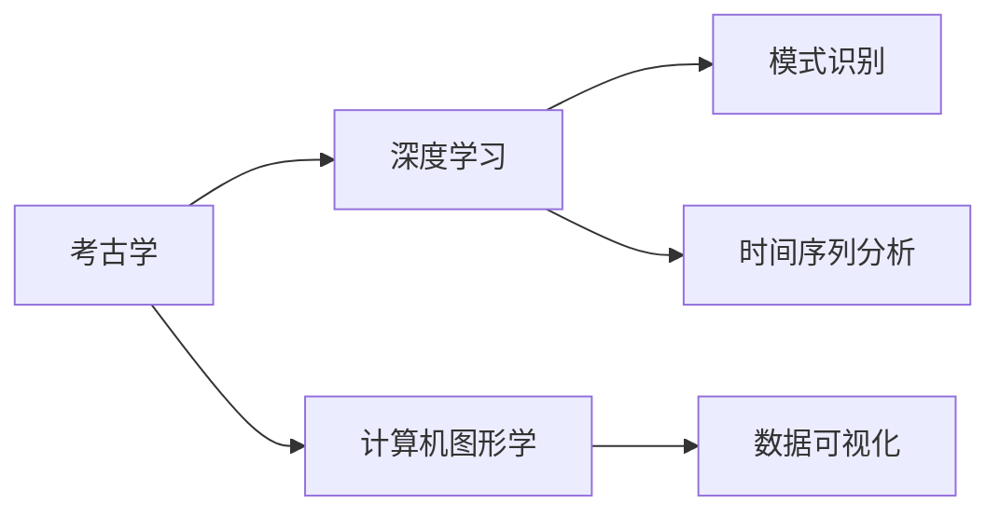

                 

## 1. 背景介绍

### 1.1 问题由来
随着科技的进步，人工智能(AI)技术正在改变各个行业的研究方式。考古学，作为研究人类古代文明和历史的关键学科，也在逐渐采用这些新兴技术，尤其是AI，来加速研究进程。通过AI在考古学中的应用，可以挖掘出更多的历史线索，解决传统考古方法难以处理的问题。

### 1.2 问题核心关键点
AI在考古学中的应用主要集中在以下几个关键领域：

- **数据分析与处理**：利用机器学习模型处理和分析考古数据，提取有用的信息。
- **模式识别与分类**：通过深度学习模型识别不同的历史遗物和遗迹，并进行分类。
- **时间序列分析**：使用时间序列分析技术，研究不同历史时期的变迁规律。
- **数据可视化**：利用计算机图形学，将考古数据和研究成果可视化，增强研究者的理解能力。

这些应用极大地提高了考古研究的效率和精度，使得研究人员能够更好地理解历史事件和古代文明的发展。

### 1.3 问题研究意义
AI技术在考古学中的应用具有重要意义：

1. **数据处理能力**：AI可以处理大量复杂的考古数据，包括图像、文本、音频等多种类型，极大地提高了数据处理效率。
2. **模式识别精度**：通过深度学习模型，AI能够更准确地识别和分类考古发现，减少误判。
3. **时间序列分析**：利用AI技术分析时间序列数据，揭示历史变迁的规律，为历史研究提供新的视角。
4. **数据可视化**：将复杂的数据和研究成果可视化，使研究过程更直观、易懂，便于研究者和公众理解。

通过AI技术的应用，考古学研究能够更快地揭示古代文明的秘密，为历史学和文化研究提供更多的支持。

## 2. 核心概念与联系

### 2.1 核心概念概述

为更好地理解AI在考古学中的应用，我们需要掌握几个核心概念：

- **人工智能(AI)**：一种模拟人类智能的技术，包括机器学习、深度学习、自然语言处理等。
- **考古学**：研究人类古代文明和历史的科学，涉及遗址发掘、文物鉴定、历史事件分析等多个方面。
- **深度学习**：一种基于人工神经网络的机器学习方法，能够处理复杂的数据，进行模式识别和分类。
- **计算机图形学**：研究如何利用计算机生成图像和动画，将考古数据和研究成果可视化。

这些概念之间的联系可以通过以下Mermaid流程图来展示：



这个流程图展示了AI技术在考古学中的主要应用领域：

1. 考古学利用深度学习进行模式识别和分类。
2. 计算机图形学用于数据可视化，使研究成果更直观。
3. 时间序列分析用于揭示历史变迁规律。

## 3. 核心算法原理 & 具体操作步骤
### 3.1 算法原理概述

AI在考古学中的应用主要基于机器学习和深度学习的算法原理，具体来说：

- **监督学习**：利用标注好的历史遗物和遗迹数据，训练模型进行分类和识别。
- **无监督学习**：在缺少标注数据的情况下，利用数据的内在结构和规律进行特征提取和模式识别。
- **强化学习**：通过模拟考古挖掘和分析的过程，优化AI模型的决策策略。

这些算法原理使得AI能够在考古学中发挥重要作用，尤其是在处理大量复杂数据时，表现出显著优势。

### 3.2 算法步骤详解

以下详细介绍AI在考古学中的具体应用步骤：

**Step 1: 数据准备与预处理**
- 收集考古现场的数据，包括图像、文本、音频等。
- 对数据进行清洗和预处理，如去除噪音、归一化、标准化等。

**Step 2: 模型选择与训练**
- 根据考古学的具体需求，选择合适的深度学习模型（如卷积神经网络CNN、循环神经网络RNN等）。
- 利用标注好的数据集对模型进行训练，调整超参数，优化模型性能。

**Step 3: 数据标注与分类**
- 利用标注工具对历史遗物和遗迹进行标注，生成标注数据集。
- 使用训练好的模型对考古数据进行分类，标注不同的历史遗物和遗迹类型。

**Step 4: 时间序列分析**
- 收集考古现场的时间序列数据（如挖掘过程、文物年代等）。
- 使用时间序列分析技术（如ARIMA、LSTM等）进行历史变迁分析。

**Step 5: 结果可视化**
- 将考古数据和研究结果通过计算机图形学进行可视化，生成图表和动画。
- 利用交互式可视化工具（如Tableau、Plotly等）展示研究成果，便于研究者和公众理解。

### 3.3 算法优缺点

AI在考古学中的应用具有以下优点：

1. **处理大数据**：AI可以处理海量考古数据，极大地提高了数据处理效率。
2. **识别精度高**：通过深度学习模型，AI能够更准确地识别和分类考古发现。
3. **自动化程度高**：AI能够自动进行数据分析和处理，减少了人工操作的误差。
4. **多模态融合**：结合图像、文本、音频等多种模态数据，提高考古研究的全面性和准确性。

同时，AI在考古学中也存在一些局限性：

1. **数据标注成本高**：高质量的数据标注需要大量人工和时间投入，成本较高。
2. **模型复杂度**：深度学习模型复杂度高，训练和优化难度大，需要较强的计算资源支持。
3. **可解释性差**：AI模型的决策过程和推理逻辑难以解释，缺乏透明性。
4. **数据质量依赖**：AI模型的性能依赖于数据质量，低质量数据可能导致误判。

### 3.4 算法应用领域

AI在考古学中的应用主要包括以下几个领域：

1. **遗址发掘与保护**：利用AI进行遗址发掘的规划和保护，提高发掘效率和保护效果。
2. **文物鉴定与修复**：通过AI技术进行文物的鉴定和修复，提升文物保存质量。
3. **历史事件分析**：利用时间序列分析技术，研究历史事件的演变过程，揭示历史变迁规律。
4. **数据可视化**：将考古数据和研究成果通过计算机图形学进行可视化，增强研究成果的可理解性。

此外，AI在考古学中的应用还包括文化遗产保护、古代文明研究、历史地理研究等多个方面。

## 4. 数学模型和公式 & 详细讲解 & 举例说明

### 4.1 数学模型构建

AI在考古学中的应用通常基于以下数学模型：

1. **卷积神经网络(CNN)**：用于图像识别和分类。
2. **循环神经网络(RNN)**：用于序列数据的建模和时间序列分析。
3. **深度学习模型**：用于特征提取和模式识别。
4. **计算机图形学**：用于数据可视化。

### 4.2 公式推导过程

以卷积神经网络为例，其基本公式如下：

$$
\mathbf{H} = \mathbf{W} * \mathbf{I} + \mathbf{b}
$$

其中，$\mathbf{H}$ 为输出特征图，$\mathbf{W}$ 为卷积核，$\mathbf{I}$ 为输入图像，$\mathbf{b}$ 为偏置项。通过卷积操作，CNN可以提取图像的局部特征，实现高效的图像分类。

### 4.3 案例分析与讲解

以下以一个考古现场的图像数据分类为例，详细讲解AI的实际应用过程：

1. **数据准备**：收集考古现场的图像数据，并进行预处理。
2. **模型选择**：选择卷积神经网络模型作为分类器。
3. **训练模型**：利用标注好的数据集对模型进行训练，调整超参数。
4. **数据标注**：对考古图像进行标注，生成标注数据集。
5. **分类预测**：使用训练好的模型对考古图像进行分类，预测出不同的历史遗物类型。
6. **结果评估**：通过准确率、召回率等指标评估分类模型的性能。

## 5. 项目实践：代码实例和详细解释说明
### 5.1 开发环境搭建

在进行AI在考古学中的应用实践前，我们需要准备好开发环境。以下是Python开发环境的搭建步骤：

1. 安装Anaconda：从官网下载并安装Anaconda，用于创建独立的Python环境。

2. 创建并激活虚拟环境：
```bash
conda create -n archaeology-env python=3.8 
conda activate archaeology-env
```

3. 安装相关库：
```bash
pip install torch torchvision transformers numpy matplotlib scikit-learn tqdm jupyter notebook ipython
```

4. 安装考古学相关的数据处理工具：
```bash
pip install pandas numpy scikit-learn
```

5. 安装计算机图形学相关的库：
```bash
pip install matplotlib seaborn plotly
```

### 5.2 源代码详细实现

以下是一个考古图像分类的示例代码，详细实现步骤如下：

```python
import torch
import torchvision
import torchvision.transforms as transforms
from torchvision.models import resnet18
from torch.utils.data import DataLoader, Dataset
from torch.nn import CrossEntropyLoss
from torch.optim import Adam
from sklearn.metrics import accuracy_score

# 定义数据集类
class ArchaeologyDataset(Dataset):
    def __init__(self, data_dir, transform=None):
        self.data_dir = data_dir
        self.transform = transform
        self.filenames = list(sorted(os.listdir(data_dir)))
        self.labels = {}
        for filename in self.filenames:
            if 'label' in filename:
                with open(os.path.join(data_dir, filename), 'r') as f:
                    self.labels[filename] = int(f.read())
        self.image_files = [os.path.join(data_dir, filename) for filename in self.filenames if 'image' in filename]
    
    def __len__(self):
        return len(self.image_files)
    
    def __getitem__(self, idx):
        img = Image.open(self.image_files[idx])
        if self.transform:
            img = self.transform(img)
        label = self.labels[self.filenames[idx].split('.')[0]]
        return img, label

# 定义数据加载器
transform = transforms.Compose([
    transforms.Resize(256),
    transforms.CenterCrop(224),
    transforms.ToTensor(),
    transforms.Normalize(mean=[0.485, 0.456, 0.406], std=[0.229, 0.224, 0.225])
])

train_dataset = ArchaeologyDataset('/path/to/train/data', transform=transform)
test_dataset = ArchaeologyDataset('/path/to/test/data', transform=transform)
train_loader = DataLoader(train_dataset, batch_size=32, shuffle=True)
test_loader = DataLoader(test_dataset, batch_size=32)

# 定义模型
model = resnet18(pretrained=False)
model.fc = torch.nn.Linear(512, len(train_dataset.labels))

# 定义损失函数和优化器
criterion = CrossEntropyLoss()
optimizer = Adam(model.parameters(), lr=0.001)

# 训练模型
for epoch in range(10):
    model.train()
    for images, labels in train_loader:
        optimizer.zero_grad()
        outputs = model(images)
        loss = criterion(outputs, labels)
        loss.backward()
        optimizer.step()
    
    model.eval()
    with torch.no_grad():
        correct = 0
        total = 0
        for images, labels in test_loader:
            outputs = model(images)
            _, predicted = torch.max(outputs.data, 1)
            total += labels.size(0)
            correct += (predicted == labels).sum().item()
        accuracy = 100 * correct / total
        print('Epoch %d, Accuracy: %.2f%%' % (epoch+1, accuracy))

# 保存模型
torch.save(model.state_dict(), '/path/to/saved/model')
```

### 5.3 代码解读与分析

以下是关键代码的实现细节：

**ArchaeologyDataset类**：
- `__init__`方法：初始化数据集，包括图像和标签路径。
- `__len__`方法：返回数据集的大小。
- `__getitem__`方法：获取单个样本的图像和标签。

**数据加载器**：
- 使用`torchvision.transforms`进行数据预处理，包括图像缩放、裁剪、归一化等。
- 通过`DataLoader`对数据集进行批处理，并设置训练时的随机打乱和测试时的固定顺序。

**模型定义**：
- 定义卷积神经网络模型，并进行一些自定义化的处理。
- 将最后一层全连接层替换为对应类别数量的输出层。

**损失函数和优化器**：
- 选择交叉熵损失函数，并使用Adam优化器进行参数优化。

**训练和评估**：
- 使用训练数据集进行训练，并在每个epoch结束后在测试数据集上评估模型性能。
- 保存训练好的模型，以便后续使用。

**注意**：以上代码仅为示例，实际应用中需要根据具体情况进行修改和优化。

## 6. 实际应用场景

### 6.1 遗址发掘与保护

AI在遗址发掘和保护中的应用主要包括：

1. **考古挖掘规划**：利用AI对考古现场进行规划，确定挖掘区域和顺序，提高挖掘效率。
2. **文物保护**：通过AI进行文物损伤检测和修复，提高文物保护质量。
3. **遗址环境监测**：利用AI进行遗址环境监测，防止文物受到自然和人为的破坏。

**案例**：某考古现场利用AI进行挖掘规划，结合卫星遥感数据和地面探测数据，生成最优挖掘路径，提高挖掘效率。

### 6.2 文物鉴定与修复

AI在文物鉴定与修复中的应用主要包括：

1. **文物识别**：利用AI对文物进行识别和分类，确定文物的类型和年代。
2. **文物损伤检测**：通过AI进行文物损伤检测，及时发现文物损伤区域，进行修复。
3. **修复方案优化**：利用AI优化文物修复方案，提高修复效果和效率。

**案例**：某博物馆利用AI对馆藏文物进行损伤检测和修复，通过图像识别技术确定文物损伤区域，并生成修复方案，提高了文物保护的效率和精度。

### 6.3 历史事件分析

AI在历史事件分析中的应用主要包括：

1. **历史事件时间序列分析**：利用AI进行历史事件的年代分析，揭示历史变迁规律。
2. **历史事件关系分析**：利用AI进行历史事件的因果关系分析，揭示事件之间的内在联系。
3. **历史事件推理**：利用AI进行历史事件的推理和解释，提升历史研究的深度和广度。

**案例**：某历史研究所利用AI进行古代战争事件的时间序列分析，通过历史文献和考古数据，揭示战争事件的演变规律，为历史研究提供了新的视角。

### 6.4 数据可视化

AI在数据可视化中的应用主要包括：

1. **考古数据可视化**：利用计算机图形学技术将考古数据和研究成果可视化，增强研究者的理解能力。
2. **历史地图绘制**：通过AI技术绘制历史地图，展示历史地理变迁和地理环境变化。
3. **文物三维重构**：利用AI技术对文物进行三维重构，生成虚拟文物，便于研究和展示。

**案例**：某考古研究所利用AI技术对考古现场进行数据可视化，生成三维考古地图，直观展示考古现场的地形和文物分布情况，为现场勘探和研究提供了便利。

## 7. 工具和资源推荐

### 7.1 学习资源推荐

为了帮助开发者系统掌握AI在考古学中的应用，这里推荐一些优质的学习资源：

1. **《深度学习》书籍**：斯坦福大学Andrew Ng教授的入门书籍，详细介绍了深度学习的基本原理和应用。
2. **《计算机图形学》书籍**：计算机图形学领域的经典教材，介绍了计算机图形学的基本概念和应用。
3. **Coursera《深度学习专项课程》**：由Andrew Ng教授主讲，涵盖深度学习的基本理论和应用实践。
4. **Udacity《计算机图形学》课程**：Udacity推出的计算机图形学课程，结合实例讲解计算机图形学的基本概念和实践。
5. **Kaggle考古数据集**：Kaggle上提供的考古数据集，包括图像、文本、音频等多种类型，适合用于AI模型的训练和评估。

通过对这些资源的学习实践，相信你一定能够快速掌握AI在考古学中的应用，并用于解决实际的考古问题。

### 7.2 开发工具推荐

高效的开发离不开优秀的工具支持。以下是几款用于AI在考古学应用开发的常用工具：

1. **PyTorch**：基于Python的开源深度学习框架，灵活动态的计算图，适合快速迭代研究。
2. **TensorFlow**：由Google主导开发的开源深度学习框架，生产部署方便，适合大规模工程应用。
3. **Keras**：高层次的深度学习框架，简单易用，适合初学者快速上手。
4. **Jupyter Notebook**：用于编写和分享研究笔记的工具，支持Python、R等多种编程语言。
5. **Tableau**：用于数据可视化的工具，支持多种数据源和图表类型，易于使用。

合理利用这些工具，可以显著提升AI在考古学应用的开发效率，加快创新迭代的步伐。

### 7.3 相关论文推荐

AI在考古学中的应用源于学界的持续研究。以下是几篇奠基性的相关论文，推荐阅读：

1. **《利用深度学习进行考古文物分类》**：介绍了一种基于卷积神经网络的考古文物分类方法，取得了良好的效果。
2. **《考古遗址时间序列分析》**：提出了一种基于LSTM的时间序列分析方法，用于考古遗址的年代分析。
3. **《计算机图形学在考古数据可视化中的应用》**：探讨了计算机图形学在考古数据可视化中的重要作用，介绍了多种可视化技术。
4. **《AI在历史事件关系分析中的应用》**：介绍了一种基于深度学习的历史事件关系分析方法，揭示了历史事件之间的内在联系。
5. **《AI在考古数据处理中的应用》**：详细介绍了AI在考古数据处理中的应用，包括图像识别、文本分析等。

这些论文代表了大数据在考古学中的最新进展，通过学习这些前沿成果，可以帮助研究者把握学科前进方向，激发更多的创新灵感。

## 8. 总结：未来发展趋势与挑战

### 8.1 总结

本文对AI在考古学中的应用进行了全面系统的介绍。首先阐述了AI在考古学中的应用背景和意义，明确了AI在考古学中的主要作用和应用领域。其次，从原理到实践，详细讲解了AI在考古学中的具体应用步骤，给出了AI在考古学应用的完整代码实例。同时，本文还广泛探讨了AI在考古学中的未来发展趋势和面临的挑战，提供了系统的技术指引。

通过本文的系统梳理，可以看到，AI在考古学中的应用已经取得了显著成果，并逐渐成为考古研究的重要手段。AI技术为考古学带来了新的研究思路和方法，极大地提高了考古研究的效率和精度。未来，随着AI技术的不断进步，考古学研究将更加深入，研究者将能够更好地理解人类古代文明和历史。

### 8.2 未来发展趋势

展望未来，AI在考古学中的应用将呈现以下几个发展趋势：

1. **多模态数据融合**：结合图像、文本、音频等多种模态数据，提高考古研究的全面性和准确性。
2. **知识图谱应用**：利用知识图谱技术，将考古知识进行结构化表示，提升考古研究的系统性和可解释性。
3. **深度学习模型的优化**：优化深度学习模型，提高模型的泛化能力和鲁棒性，减少过拟合和误判。
4. **可解释性和可解释性**：提高AI模型的可解释性，使得研究者能够更好地理解模型的决策过程和推理逻辑。
5. **跨学科融合**：与其他学科进行更深层次的融合，如与计算机科学、物理学等结合，提升考古研究的深度和广度。

以上趋势凸显了AI在考古学中的广阔前景。这些方向的探索发展，将进一步提升考古学的研究水平，为历史学和文化研究提供更多的支持。

### 8.3 面临的挑战

尽管AI在考古学中的应用已经取得了瞩目成就，但在迈向更加智能化、普适化应用的过程中，它仍面临着诸多挑战：

1. **数据标注成本高**：高质量的数据标注需要大量人工和时间投入，成本较高。如何降低标注成本，提高标注效率，将是未来研究的一个重要方向。
2. **模型复杂度**：深度学习模型复杂度高，训练和优化难度大，需要较强的计算资源支持。如何优化模型结构和计算效率，将是重要的优化方向。
3. **数据质量依赖**：AI模型的性能依赖于数据质量，低质量数据可能导致误判。如何提高数据质量，确保数据的多样性和代表性，将是重要的研究方向。
4. **可解释性差**：AI模型的决策过程和推理逻辑难以解释，缺乏透明性。如何提高模型的可解释性，使得研究者能够更好地理解模型的决策过程和推理逻辑，将是亟待解决的问题。

### 8.4 研究展望

面对AI在考古学应用所面临的挑战，未来的研究需要在以下几个方面寻求新的突破：

1. **无监督学习和半监督学习**：摆脱对大规模标注数据的依赖，利用无监督学习和半监督学习范式，最大限度利用非结构化数据，实现更加灵活高效的考古研究。
2. **知识图谱与AI结合**：利用知识图谱技术，将考古知识进行结构化表示，提升考古研究的系统性和可解释性。
3. **跨学科融合**：与其他学科进行更深层次的融合，如与计算机科学、物理学等结合，提升考古研究的深度和广度。
4. **多模态数据融合**：结合图像、文本、音频等多种模态数据，提高考古研究的全面性和准确性。
5. **模型优化与计算效率提升**：优化深度学习模型，提高模型的泛化能力和鲁棒性，减少过拟合和误判。
6. **数据质量提升**：提高数据质量，确保数据的多样性和代表性，减少数据标注成本。

这些研究方向的探索，将进一步推动AI在考古学中的应用，为考古学研究提供更加高效、精准、全面的技术支持。

## 9. 附录：常见问题与解答

**Q1：AI在考古学中的应用有哪些局限性？**

A: AI在考古学中的应用虽然取得了显著成果，但也存在一些局限性：

1. **数据标注成本高**：高质量的数据标注需要大量人工和时间投入，成本较高。
2. **模型复杂度**：深度学习模型复杂度高，训练和优化难度大，需要较强的计算资源支持。
3. **数据质量依赖**：AI模型的性能依赖于数据质量，低质量数据可能导致误判。
4. **可解释性差**：AI模型的决策过程和推理逻辑难以解释，缺乏透明性。

这些问题需要通过进一步的研究和优化来解决。

**Q2：AI在考古学中的应用有哪些优点？**

A: AI在考古学中的应用具有以下优点：

1. **处理大数据**：AI可以处理海量考古数据，极大地提高了数据处理效率。
2. **识别精度高**：通过深度学习模型，AI能够更准确地识别和分类考古发现。
3. **自动化程度高**：AI能够自动进行数据分析和处理，减少了人工操作的误差。
4. **多模态融合**：结合图像、文本、音频等多种模态数据，提高考古研究的全面性和准确性。

这些优点使得AI在考古学中具有广阔的应用前景。

**Q3：AI在考古学中的未来发展趋势是什么？**

A: AI在考古学中的未来发展趋势包括：

1. **多模态数据融合**：结合图像、文本、音频等多种模态数据，提高考古研究的全面性和准确性。
2. **知识图谱应用**：利用知识图谱技术，将考古知识进行结构化表示，提升考古研究的系统性和可解释性。
3. **深度学习模型的优化**：优化深度学习模型，提高模型的泛化能力和鲁棒性，减少过拟合和误判。
4. **可解释性和可解释性**：提高AI模型的可解释性，使得研究者能够更好地理解模型的决策过程和推理逻辑。
5. **跨学科融合**：与其他学科进行更深层次的融合，如与计算机科学、物理学等结合，提升考古研究的深度和广度。

这些发展趋势将进一步推动AI在考古学中的应用，为考古学研究提供更加高效、精准、全面的技术支持。

---

作者：禅与计算机程序设计艺术 / Zen and the Art of Computer Programming

