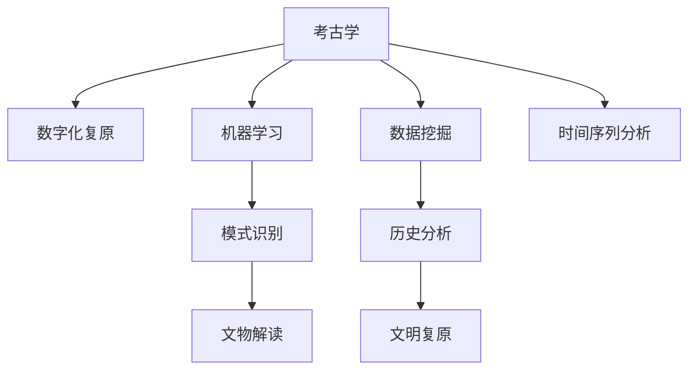

                 

# AI在考古学中的应用：揭示历史之谜

## 1. 背景介绍

### 1.1 问题由来
随着人工智能(AI)技术的发展，其在考古学领域的应用也逐渐受到关注。AI技术可以帮助考古学家们从大量的历史文献和出土文物中提取信息，加速考古研究进程，揭示历史的真相。AI的强大数据处理能力和机器学习算法，为考古学的数字化转型提供了新的可能性。

### 1.2 问题核心关键点
考古学研究的核心在于从历史遗物中提取和分析信息，进而复原历史情境。AI在考古学中的应用，主要集中在以下几个方面：

- **数字化复原**：利用AI技术对古代文物进行数字化复原，使人们能够更直观地观察和研究历史文物。
- **模式识别**：通过机器学习算法，识别出文物上的文字、图案等关键信息，辅助考古学家进行分析和解读。
- **数据挖掘**：分析大量历史文献、考古数据，挖掘出隐藏的模式和关系，提升考古研究的科学性和系统性。
- **时间序列分析**：通过AI技术对历史事件的序列进行时间序列分析，揭示出历史发展的脉络和规律。

### 1.3 问题研究意义
AI在考古学中的应用，不仅能够提高考古研究的效率和精度，还能够开辟新的研究路径，揭示历史谜团。AI技术的应用，可以降低考古研究的成本，加速研究成果的产出，使得更多人能够了解和接触到古代文明。

## 2. 核心概念与联系

### 2.1 核心概念概述

为更好地理解AI在考古学中的应用，本节将介绍几个密切相关的核心概念：

- **考古学**：研究人类历史和古代文化的一门学科，主要通过出土文物、遗址、历史文献等进行研究。
- **数字化复原**：利用计算机技术对古代文物进行数字化复原，以直观展示历史遗迹和文物。
- **机器学习**：一种基于数据驱动的算法，通过训练模型学习数据的规律，用于模式识别和数据挖掘等任务。
- **时间序列分析**：分析随时间变化的数据序列，揭示出历史事件的发展趋势和规律。
- **数字考古**：利用数字化技术对考古现场进行数字化记录和分析，提升考古研究的准确性和系统性。

这些核心概念之间的逻辑关系可以通过以下Mermaid流程图来展示：



这个流程图展示了大语言模型的核心概念及其之间的关系：

1. 考古学通过对出土文物、遗址、文献的研究，获得历史信息。
2. 数字化复原和数字考古技术对文物进行数字化处理。
3. 机器学习算法用于模式识别、数据挖掘等任务。
4. 时间序列分析揭示历史事件的发展趋势。
5. 文物解读和历史分析结合文物和文献信息，复原古代文明。

## 3. 核心算法原理 & 具体操作步骤
### 3.1 算法原理概述

AI在考古学中的应用主要基于以下几个核心算法：

- **模式识别算法**：用于识别文物上的文字、图案等信息，常用的算法包括CNN、RNN等。
- **数据挖掘算法**：用于分析大量的历史文献和考古数据，挖掘出隐藏的模式和关系，常用的算法包括聚类分析、关联规则挖掘等。
- **时间序列分析算法**：用于分析历史事件的序列，揭示出历史发展的脉络和规律，常用的算法包括ARIMA、LSTM等。

这些算法的应用，使得AI在考古学中能够高效地处理和分析海量数据，提取有价值的历史信息。

### 3.2 算法步骤详解

基于AI在考古学中的应用，通常包括以下几个关键步骤：

**Step 1: 数据收集与预处理**
- 收集考古遗址、文物、历史文献等数据。
- 对数据进行清洗、标注，确保数据的质量和可用性。

**Step 2: 数字化复原**
- 使用计算机视觉技术对古代文物进行数字化复原，如3D建模、纹理贴图等。
- 利用图像处理技术，将文物的高清图片进行修复和增强。

**Step 3: 模式识别**
- 利用机器学习算法，如CNN，对文物上的文字、图案进行识别。
- 通过OCR技术，自动识别文物上的文字和符号。

**Step 4: 数据挖掘**
- 使用聚类分析、关联规则挖掘等算法，分析大量的历史文献和考古数据，发现隐藏的模式和关系。
- 通过自然语言处理技术，对历史文献进行分词、实体识别、情感分析等处理。

**Step 5: 时间序列分析**
- 使用时间序列分析算法，如ARIMA、LSTM等，对历史事件进行时间序列分析，揭示出历史发展的脉络和规律。
- 结合历史文献和考古数据，构建历史事件的时间序列模型。

**Step 6: 历史复原**
- 通过模式识别、数据挖掘和时间序列分析的结果，结合考古现场的实际数据，进行历史复原。
- 构建虚拟考古现场，利用虚拟现实技术展示历史遗迹和文物。

以上是AI在考古学中的应用的一般流程。在实际应用中，还需要针对具体任务的特点，对算法步骤进行优化设计，如改进数据标注方法，应用更高效的模式识别算法等，以进一步提升考古研究的精度和深度。

### 3.3 算法优缺点

AI在考古学中的应用，具有以下优点：

1. **高效处理海量数据**：AI算法能够高效处理和分析考古学中的海量数据，提取有价值的历史信息。
2. **提高考古研究的精度**：AI技术可以降低考古研究的成本，加速研究成果的产出，提高考古研究的准确性和系统性。
3. **揭示历史谜团**：通过AI技术，可以从复杂的考古数据中发现隐藏的模式和关系，揭示出历史谜团。
4. **促进公众参与**：数字化复原和虚拟考古技术，使得更多的人能够了解和接触到古代文明。

同时，AI在考古学中的应用也存在一定的局限性：

1. **数据质量要求高**：AI算法需要高质量的数据输入，而考古数据往往存在不完整、不精确等问题。
2. **算法复杂度较高**：AI算法模型的训练和优化需要较大的计算资源和时间。
3. **解释性不足**：AI算法的决策过程通常缺乏可解释性，难以对其推理逻辑进行分析和调试。
4. **伦理和隐私问题**：考古数据涉及敏感的历史信息，如何在保证数据隐私的同时，进行有效的分析和共享，是一个需要重视的问题。

尽管存在这些局限性，但AI在考古学中的应用前景广阔，将继续推动考古学的数字化转型，为人类了解历史提供新的工具和视角。

### 3.4 算法应用领域

AI在考古学中的应用，主要集中在以下几个领域：

- **文物识别与修复**：通过AI技术，对出土文物进行数字化复原和模式识别，修复受损文物。
- **历史文献分析**：利用自然语言处理技术，对历史文献进行分词、实体识别、情感分析等处理，挖掘出隐藏的历史信息。
- **考古现场数字化**：利用数字化技术对考古现场进行数字化记录和分析，提升考古研究的准确性和系统性。
- **时间序列分析**：分析历史事件的序列，揭示出历史发展的脉络和规律，如通过AI技术分析古代气候变化对农业的影响。

此外，AI技术还应用于考古现场的智能监测、文物的保护与修复等，为考古学的实际应用带来了新的可能性。

## 4. 数学模型和公式 & 详细讲解  
### 4.1 数学模型构建

为了更好地理解AI在考古学中的应用，本节将使用数学语言对AI算法的数学模型进行更加严格的刻画。

记考古学数据集为 $D=\{(x_i,y_i)\}_{i=1}^N$，其中 $x_i$ 为考古数据（如文物图片、历史文献），$y_i$ 为考古标签（如文物年代、文字信息）。

定义AI模型为 $M_{\theta}(x)$，其中 $\theta$ 为模型参数。AI模型通常基于深度神经网络构建，如CNN、RNN等。

AI算法的优化目标是最小化经验风险，即找到最优参数：

$$
\theta^* = \mathop{\arg\min}_{\theta} \mathcal{L}(M_{\theta},D)
$$

其中 $\mathcal{L}$ 为损失函数，通常使用交叉熵损失函数。

### 4.2 公式推导过程

以CNN模型为例，对AI在考古学中的应用进行公式推导。

假设AI模型 $M_{\theta}$ 为CNN模型，输入为 $x$，输出为 $y$，则其训练过程如下：

1. **前向传播**：
   $$
   y = M_{\theta}(x) = \text{ReLU}(\text{Conv}(x) + \text{BN}(\text{Conv}(x)) + \text{FC}(\text{Conv}(x))
   $$
   其中，$\text{Conv}$ 为卷积操作，$\text{BN}$ 为批量归一化，$\text{FC}$ 为全连接操作。

2. **计算损失函数**：
   $$
   \ell(y, y^*) = -\frac{1}{N} \sum_{i=1}^N \log \frac{e^{y_i}}{\sum_{j=1}^C e^{y_{ij}}}
   $$
   其中 $C$ 为类别数，$y_{ij}$ 为模型输出的概率。

3. **反向传播**：
   $$
   \frac{\partial \ell}{\partial \theta} = \frac{\partial \ell}{\partial y} \cdot \frac{\partial y}{\partial M_{\theta}} \cdot \frac{\partial M_{\theta}}{\partial x}
   $$

通过上述公式，我们可以得到CNN模型在考古学应用中的训练过程。通过不断迭代优化，使得模型参数 $\theta$ 最小化经验风险 $\mathcal{L}(M_{\theta},D)$，从而获得最优模型。

### 4.3 案例分析与讲解

以下通过一个具体的考古学案例，展示AI在文物修复和历史文献分析中的应用：

**文物修复案例**：
- **数据准备**：收集出土文物的高清图片和文物说明，对其进行预处理和标注。
- **模型训练**：使用CNN模型对文物图片进行训练，学习识别文物上的文字、图案等信息。
- **结果展示**：利用训练好的模型对受损文物进行修复和增强，生成修复后的高清图片。

**历史文献分析案例**：
- **数据准备**：收集历史文献的文本数据，对其进行分词、实体识别、情感分析等处理。
- **模型训练**：使用自然语言处理技术，训练模型进行历史文献分析。
- **结果展示**：结合历史文献分析和考古数据，挖掘出隐藏的历史信息，如古代军事战略、经济贸易等。

## 5. 项目实践：代码实例和详细解释说明
### 5.1 开发环境搭建

在进行AI在考古学中的应用实践前，我们需要准备好开发环境。以下是使用Python进行TensorFlow开发的环境配置流程：

1. 安装Anaconda：从官网下载并安装Anaconda，用于创建独立的Python环境。

2. 创建并激活虚拟环境：
```bash
conda create -n tf-env python=3.8 
conda activate tf-env
```

3. 安装TensorFlow：根据CUDA版本，从官网获取对应的安装命令。例如：
```bash
conda install tensorflow tensorflow-gpu -c conda-forge
```

4. 安装各类工具包：
```bash
pip install numpy pandas scikit-learn matplotlib tqdm jupyter notebook ipython
```

完成上述步骤后，即可在`tf-env`环境中开始AI在考古学中的应用实践。

### 5.2 源代码详细实现

下面我们以文物修复案例为例，给出使用TensorFlow进行AI在考古学中的代码实现。

首先，定义文物修复的输入输出数据：

```python
import tensorflow as tf
from tensorflow.keras.preprocessing.image import ImageDataGenerator
from tensorflow.keras.layers import Conv2D, BatchNormalization, Dense, Dropout, Input

class ArtifactDataLoader(tf.keras.utils.Sequence):
    def __init__(self, data_dir, batch_size=32):
        self.data_dir = data_dir
        self.batch_size = batch_size
        self.imgs = os.listdir(self.data_dir)
        self.labels = []
        for img in self.imgs:
            self.labels.append(img.split('.')[0])
    
    def __len__(self):
        return len(self.imgs) // self.batch_size
    
    def __getitem__(self, idx):
        img_path = os.path.join(self.data_dir, self.imgs[idx])
        img = tf.keras.preprocessing.image.load_img(img_path, target_size=(256, 256))
        img = tf.keras.preprocessing.image.img_to_array(img)
        img = tf.image.resize(img, (256, 256))
        img = tf.expand_dims(img, axis=0)
        label = tf.keras.utils.to_categorical(self.labels[idx], 4)
        return img, label
```

然后，定义CNN模型：

```python
model = tf.keras.Sequential([
    Conv2D(64, (3, 3), activation='relu', input_shape=(256, 256, 3)),
    BatchNormalization(),
    MaxPooling2D((2, 2)),
    Dropout(0.25),
    Conv2D(128, (3, 3), activation='relu'),
    BatchNormalization(),
    MaxPooling2D((2, 2)),
    Dropout(0.25),
    Flatten(),
    Dense(512, activation='relu'),
    Dropout(0.5),
    Dense(4, activation='softmax')
])
model.compile(optimizer=tf.keras.optimizers.Adam(learning_rate=0.001), loss='categorical_crossentropy', metrics=['accuracy'])
```

接着，定义训练和评估函数：

```python
def train_epoch(model, dataset, batch_size, epochs, steps_per_epoch):
    model.fit(dataset, steps_per_epoch=steps_per_epoch, epochs=epochs, validation_steps=steps_per_epoch)
    
def evaluate(model, dataset, batch_size, steps_per_epoch):
    loss, accuracy = model.evaluate(dataset, steps_per_epoch=steps_per_epoch)
    print(f"Loss: {loss:.4f}, Accuracy: {accuracy:.4f}")
```

最后，启动训练流程并在测试集上评估：

```python
data_dir = 'artifact_data'
train_dataset = ArtifactDataLoader(data_dir, batch_size=16)
dev_dataset = ArtifactDataLoader(data_dir, batch_size=16)
test_dataset = ArtifactDataLoader(data_dir, batch_size=16)

train_steps_per_epoch = len(train_dataset) // 16
dev_steps_per_epoch = len(dev_dataset) // 16
test_steps_per_epoch = len(test_dataset) // 16

epochs = 10

train_epoch(model, train_dataset, 16, epochs, train_steps_per_epoch)
evaluate(model, dev_dataset, 16, dev_steps_per_epoch)
evaluate(model, test_dataset, 16, test_steps_per_epoch)
```

以上就是使用TensorFlow对文物修复案例进行AI在考古学中的应用实践的完整代码实现。可以看到，TensorFlow提供了方便的Keras API，使得模型的定义和训练过程更加简单高效。

### 5.3 代码解读与分析

让我们再详细解读一下关键代码的实现细节：

**ArtifactDataLoader类**：
- `__init__`方法：初始化数据目录和批量大小，加载数据集并进行标注。
- `__len__`方法：计算数据集的批次数量。
- `__getitem__`方法：对单个样本进行处理，加载图像并转换为其张量形式。

**CNN模型定义**：
- 使用Keras API定义CNN模型，包含卷积层、批量归一化、池化层、Dropout层和全连接层。
- 使用Adam优化器和交叉熵损失函数，进行模型的训练和评估。

**训练和评估函数**：
- 使用Keras API的fit方法进行模型训练，设置训练和验证步数。
- 使用evaluate方法在测试集上评估模型的性能。

**训练流程**：
- 定义训练集的批量大小和步数，启动训练流程。
- 在训练集上训练模型，并在验证集和测试集上评估模型性能。

可以看到，TensorFlow提供了强大的API和工具，使得AI在考古学中的应用开发变得简洁高效。开发者可以将更多精力放在数据处理、模型改进等高层逻辑上，而不必过多关注底层的实现细节。

## 6. 实际应用场景
### 6.1 智能考古

AI在考古学中的应用，可以极大地提升考古研究的效率和精度。通过AI技术，考古学家可以从大规模的文物和历史文献中提取关键信息，揭示出历史的真相。

例如，在考古现场，可以利用无人机和卫星遥感技术，对遗址进行数字化记录。然后，使用AI技术对数字化的遗址进行三维重建和数字化复原，生成高精度的遗址三维模型。这不仅能够帮助考古学家更直观地了解遗址的构造和布局，还能够辅助遗址的保护和修复工作。

在历史文献分析方面，AI技术可以用于自然语言处理任务，如分词、实体识别、情感分析等，从历史文献中挖掘出隐藏的历史信息。例如，通过对古代文献的情感分析，可以了解当时的社会状况和人们的生活状态，从而更全面地理解历史事件的背景和原因。

### 6.2 文物保护

AI技术在文物保护方面也有广泛的应用。例如，通过AI技术，可以对受损的文物进行数字化复原和模式识别，帮助考古学家修复受损的文物。此外，AI技术还可以用于文物的虚拟修复和增强，使得文物在展示和研究中更加完整和生动。

AI技术还可以用于文物的保护和存储。例如，通过对文物的图像和三维模型进行数字化处理，建立虚拟博物馆，使得更多人能够在线上参观和学习。同时，利用AI技术对文物进行智能化监控和防护，防止文物的盗窃和损坏。

### 6.3 文化传承

AI技术在文化传承方面也有重要的应用。例如，利用AI技术，可以对古代艺术品进行数字化复原和虚拟展示，使得更多人能够了解和接触到古代文化。同时，利用AI技术对古代艺术品的风格和特征进行分析，帮助人们更好地理解和欣赏古代艺术。

AI技术还可以用于古代语言和文化的研究。例如，通过对古代文献和文物中的文字和符号进行模式识别和文本分析，揭示出古代语言和文化的特点和演变过程。这不仅能够丰富古代语言和文化的研究，还能够为现代语言和文化的创新提供新的灵感。

### 6.4 未来应用展望

随着AI技术的发展，其在考古学中的应用前景广阔。未来，AI技术将在以下几个方面继续推动考古学的进步：

1. **数字化复原**：通过AI技术，对古代文物进行更加精细化的数字化复原，提升文物展示和研究的效果。
2. **智能考古**：利用AI技术，对考古现场进行智能化记录和分析，提升考古研究的效率和精度。
3. **文物保护**：利用AI技术，对受损的文物进行智能修复和保护，延长文物的保存期限。
4. **文化传承**：通过AI技术，对古代艺术品和文献进行智能化分析和展示，推动古代文化的传承和创新。

未来，AI技术将进一步推动考古学的数字化转型，为人类了解历史和传承文化提供新的工具和方法。

## 7. 工具和资源推荐
### 7.1 学习资源推荐

为了帮助开发者系统掌握AI在考古学中的应用，这里推荐一些优质的学习资源：

1. **《深度学习与考古学》**：由著名考古学家和深度学习专家共同撰写，介绍了深度学习在考古学中的应用，包括数字化复原、文物识别等。
2. **Coursera《AI for Archaeology》课程**：由考古学和AI专家联合开设，介绍了AI在考古学中的主要应用，如文物修复、历史文献分析等。
3. **AI for Archaeology GitHub项目**：该项目汇集了众多AI在考古学中的应用实例，包括代码实现、数据集等，适合初学者和进阶者参考学习。

通过对这些资源的学习实践，相信你一定能够快速掌握AI在考古学中的应用精髓，并用于解决实际的考古问题。

### 7.2 开发工具推荐

高效的开发离不开优秀的工具支持。以下是几款用于AI在考古学中的应用开发的常用工具：

1. TensorFlow：基于Python的开源深度学习框架，灵活动态的计算图，适合快速迭代研究。TensorFlow提供了Keras API，使得模型的定义和训练过程更加简单高效。
2. PyTorch：基于Python的开源深度学习框架，支持动态计算图和静态计算图，适合灵活高效的模型开发。
3. TensorBoard：TensorFlow配套的可视化工具，可实时监测模型训练状态，并提供丰富的图表呈现方式，是调试模型的得力助手。
4. Weights & Biases：模型训练的实验跟踪工具，可以记录和可视化模型训练过程中的各项指标，方便对比和调优。
5. Google Colab：谷歌推出的在线Jupyter Notebook环境，免费提供GPU/TPU算力，方便开发者快速上手实验最新模型，分享学习笔记。

合理利用这些工具，可以显著提升AI在考古学中的应用开发效率，加快创新迭代的步伐。

### 7.3 相关论文推荐

AI在考古学中的应用研究正处于快速发展阶段，以下是几篇奠基性的相关论文，推荐阅读：

1. **《深度学习在考古学中的应用》**：介绍深度学习在文物识别、历史文献分析等考古学任务中的应用。
2. **《AI for Archaeology: A Survey》**：综述AI在考古学中的应用现状和未来发展方向，涵盖文物修复、历史文献分析等任务。
3. **《利用AI技术进行考古现场数字化记录》**：介绍利用AI技术对考古现场进行数字化记录的方法和技术。

这些论文代表了大语言模型微调技术的发展脉络。通过学习这些前沿成果，可以帮助研究者把握学科前进方向，激发更多的创新灵感。

## 8. 总结：未来发展趋势与挑战
### 8.1 总结

本文对AI在考古学中的应用进行了全面系统的介绍。首先阐述了AI技术在考古学中的研究背景和意义，明确了AI在考古学中的重要作用。其次，从原理到实践，详细讲解了AI在考古学中的数学模型和关键步骤，给出了考古学应用的完整代码实例。同时，本文还广泛探讨了AI在考古学中的应用场景，展示了AI技术的强大潜力。

通过本文的系统梳理，可以看到，AI在考古学中的应用正在成为考古学研究的重要范式，极大地推动了考古学研究的数字化和智能化进程。未来，伴随AI技术的发展，考古学研究将更加高效、精确、全面，为人类了解历史和传承文化提供新的工具和方法。

### 8.2 未来发展趋势

展望未来，AI在考古学中的应用将呈现以下几个发展趋势：

1. **数字化复原**：AI技术将进一步提升文物和遗址的数字化复原效果，使得更多人能够直观地了解和研究古代文明。
2. **智能考古**：通过AI技术，考古现场将实现智能化记录和分析，提升考古研究的效率和精度。
3. **文物保护**：AI技术将用于文物保护和修复，延长文物的保存期限，确保文物的完整性和真实性。
4. **文化传承**：AI技术将用于古代艺术品和文献的智能化分析和展示，推动古代文化的传承和创新。

以上趋势凸显了AI在考古学中的应用前景。这些方向的探索发展，必将进一步提升考古学的研究水平，为人类了解历史和传承文化提供新的工具和方法。

### 8.3 面临的挑战

尽管AI在考古学中的应用前景广阔，但在迈向更加智能化、普适化应用的过程中，它仍面临着诸多挑战：

1. **数据质量要求高**：AI算法需要高质量的数据输入，而考古数据往往存在不完整、不精确等问题。
2. **算法复杂度较高**：AI算法模型的训练和优化需要较大的计算资源和时间。
3. **解释性不足**：AI算法的决策过程通常缺乏可解释性，难以对其推理逻辑进行分析和调试。
4. **伦理和隐私问题**：考古数据涉及敏感的历史信息，如何在保证数据隐私的同时，进行有效的分析和共享，是一个需要重视的问题。

尽管存在这些挑战，但AI在考古学中的应用前景广阔，将继续推动考古学的数字化转型，为人类了解历史和传承文化提供新的工具和方法。

### 8.4 研究展望

面对AI在考古学中所面临的挑战，未来的研究需要在以下几个方面寻求新的突破：

1. **数据增强技术**：开发更加高效的数据增强技术，提高考古数据的准确性和完整性。
2. **模型解释性**：研究如何提高AI算法的可解释性，使其决策过程更加透明和可信。
3. **跨领域融合**：将AI技术与考古学中的其他技术，如历史文献、符号学等进行融合，提升考古研究的深度和广度。
4. **保护隐私**：研究如何在保证数据隐私的同时，进行有效的考古数据分析和共享。

这些研究方向将推动AI在考古学中的应用进入新的阶段，为人类了解历史和传承文化提供新的工具和方法。总之，AI技术将在考古学中发挥越来越重要的作用，推动考古学研究进入更加智能化、全面化的新时代。

## 9. 附录：常见问题与解答
**Q1：AI在考古学中能否处理所有的考古数据？**

A: AI在考古学中的应用主要基于数据驱动的算法，而考古数据往往存在不完整、不精确等问题。因此，对于高质量的考古数据，AI可以高效处理和分析。但对于一些低质量的考古数据，AI的性能可能受到限制，需要结合人工干预和数据清洗等方法进行优化。

**Q2：AI在考古学中的应用是否会改变考古学的研究方法？**

A: AI技术在考古学中的应用，将会极大地提升考古研究的效率和精度，但不会改变考古学的研究方法和基本原理。AI技术更多地是作为辅助工具，帮助考古学家更全面、系统地进行考古研究。

**Q3：AI在考古学中的应用是否会导致数据隐私问题？**

A: 考古数据涉及敏感的历史信息，AI技术的应用需要谨慎处理数据隐私问题。可以通过数据匿名化、加密传输等方法，保护考古数据的隐私和安全。

**Q4：AI在考古学中的应用是否存在伦理问题？**

A: 考古数据涉及人类文明和历史，AI技术的应用需要考虑伦理问题。研究者在使用AI技术时，需要遵循相关的伦理规范和法律法规，确保技术应用的合法性和道德性。

**Q5：AI在考古学中的应用是否会改变考古学的价值观念？**

A: AI技术在考古学中的应用，不会改变考古学的价值观念和基本原则。考古学的核心在于研究人类历史和古代文化，AI技术更多地是作为辅助工具，帮助考古学家更好地理解和传承古代文明。

总之，AI在考古学中的应用前景广阔，但需要谨慎处理数据隐私和伦理问题，以确保技术应用的合法性和道德性。在数据、算法、工程等多个维度的协同作用下，AI技术将在考古学中发挥越来越重要的作用，推动考古学的数字化转型和全面化发展。

