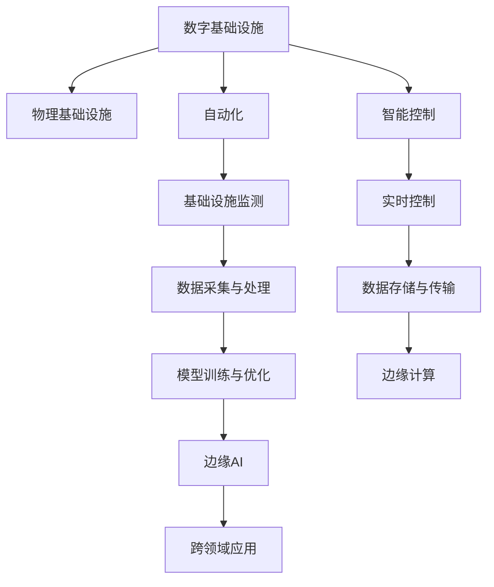

                 

# AI在自动化数字和物理基础设施中的应用

> 关键词：自动化,数字基础设施,物理基础设施,人工智能,机器学习,物联网,边缘计算,实时数据分析,智能控制,边缘AI,跨领域应用

## 1. 背景介绍

### 1.1 问题由来
在过去的几年里，随着互联网和物联网(IoT)技术的发展，数字基础设施和物理基础设施之间的界限变得越来越模糊。大量的传感器、智能设备、通信系统和数据中心构成了复杂且互联互通的基础设施网络。这不仅极大地提升了生产力和效率，也为许多新的应用场景和技术进步提供了可能。然而，这也使得管理和维护这些基础设施变得更加复杂和困难。

与此同时，人工智能(AI)技术，特别是机器学习、深度学习、自然语言处理(NLP)、计算机视觉等技术，正在迅速发展，为自动化数字和物理基础设施的运营提供了强有力的技术支持。AI技术可以实时监测、预测和优化基础设施的运行状况，同时能够提高决策的速度和准确性。

本文将深入探讨AI在自动化数字和物理基础设施中的应用，涵盖从基础设施监测到智能控制的多个方面，详细介绍其核心概念和实际操作流程。

### 1.2 问题核心关键点
AI在自动化数字和物理基础设施中的应用主要围绕以下几个关键点展开：

- **基础设施监测与预测**：利用传感器和智能设备实时收集基础设施的运行数据，并使用AI技术进行数据分析和预测，及时发现问题并采取应对措施。
- **实时控制与优化**：基于AI的实时数据分析，动态调整基础设施的运行参数，实现高效、低成本的运营。
- **跨领域应用**：AI技术能够应用于从能源管理、交通物流到环境保护的各个领域，推动基础设施向智能化、自动化方向发展。
- **边缘计算与边缘AI**：在数据产生地进行数据处理和分析，减少数据传输开销，提高响应速度和安全性。

## 2. 核心概念与联系

### 2.1 核心概念概述

为更好地理解AI在自动化数字和物理基础设施中的应用，本节将介绍几个密切相关的核心概念：

- **数字基础设施**：包括互联网、数据中心、云服务、边缘计算设施等，为各类应用提供计算、存储和网络支持。
- **物理基础设施**：如电网、交通系统、供水系统等，构成实际世界的物理实体网络，是数字化转型的基础。
- **自动化**：通过机器学习和AI技术，实现基础设施运行状态的自动监测、预测和优化。
- **智能控制**：利用AI进行实时决策和控制，提升基础设施的自动化水平和响应速度。
- **边缘计算**：在基础设施节点上进行数据处理和分析，减少数据传输，提高响应速度。
- **边缘AI**：在数据产生地进行AI模型的训练和推理，提高数据处理效率和隐私保护。

这些核心概念之间的逻辑关系可以通过以下Mermaid流程图来展示：



这个流程图展示了大语言模型的核心概念及其之间的关系：

1. 数字基础设施和物理基础设施构成了整体的基础设施网络。
2. 自动化技术使得基础设施的运行状态可以被实时监测和预测。
3. 智能控制技术基于AI模型进行实时决策和控制。
4. 数据采集与处理、模型训练与优化、边缘计算和边缘AI等技术，是实现自动化和智能控制的重要手段。
5. 跨领域应用展示了AI技术在多个领域的具体应用，如智慧能源、智能交通等。

这些概念共同构成了AI在自动化数字和物理基础设施中的应用框架，使得基础设施的自动化和智能化得以实现。通过理解这些核心概念，我们可以更好地把握AI技术的工作原理和优化方向。

## 3. 核心算法原理 & 具体操作步骤
### 3.1 算法原理概述

AI在自动化数字和物理基础设施中的应用，本质上是一个基于数据驱动的决策支持系统。其核心思想是：利用AI技术对基础设施运行数据进行实时分析和预测，辅助决策者做出最优化的控制决策。

具体来说，通过传感器和智能设备实时采集基础设施的运行数据，如温度、湿度、能耗、流量等，然后利用机器学习模型进行数据分析和预测。预测结果可以作为决策的依据，帮助管理者调整基础设施的运行参数，实现高效、低成本的运营。

形式化地，设基础设施的运行数据为 $X_t = (x_1, x_2, ..., x_n)$，其中 $x_i$ 表示基础设施在时间 $t$ 的某项指标，如温度、流量等。假设 $Y_t = (y_1, y_2, ..., y_m)$ 为对应的标签数据，表示期望的运行状态，如最佳温度、最小能耗等。则基于监督学习的预测模型为：

$$
\hat{Y}_t = f(X_t; \theta)
$$

其中，$f$ 为预测模型，$\theta$ 为模型参数。

### 3.2 算法步骤详解

AI在自动化数字和物理基础设施中的应用一般包括以下几个关键步骤：

**Step 1: 数据采集与预处理**
- 安装传感器和智能设备，实时采集基础设施的运行数据。
- 清洗和预处理数据，包括去噪、缺失值处理、归一化等，确保数据质量。

**Step 2: 选择和训练模型**
- 选择合适的机器学习或深度学习模型，如线性回归、决策树、支持向量机、神经网络等。
- 利用历史数据训练模型，并使用交叉验证等技术评估模型性能。
- 调整模型参数，如学习率、正则化强度等，进行超参数优化。

**Step 3: 实时监测与预测**
- 将实时采集的数据输入训练好的模型，计算预测结果。
- 基于预测结果，辅助决策者调整基础设施的运行参数，如温度、能耗、流量等。

**Step 4: 评估与优化**
- 定期在历史数据上评估模型性能，检查是否出现过拟合或欠拟合等问题。
- 根据反馈结果，调整模型结构和参数，进行持续优化。

**Step 5: 部署与维护**
- 将模型部署到实际的生产环境中，进行实时监测和预测。
- 定期更新模型，加入新的数据和优化算法，保持模型的适应性。

以上是AI在自动化数字和物理基础设施中的应用的一般流程。在实际应用中，还需要针对具体任务的特点，对各环节进行优化设计，如改进数据采集方法、选择更适合的模型等，以进一步提升模型性能。

### 3.3 算法优缺点

AI在自动化数字和物理基础设施中的应用方法具有以下优点：
1. 实时性高。基于实时数据进行预测和控制，响应速度快。
2. 数据驱动。决策过程依赖于数据分析和模型预测，避免主观偏见。
3. 成本低。通过优化运行参数，实现低成本运营。
4. 可扩展性强。可以应用于多种基础设施，具有广泛的应用场景。

同时，该方法也存在一定的局限性：
1. 数据质量依赖。预测模型的性能很大程度上取决于数据的质量和数量。
2. 模型复杂度要求高。构建高性能的预测模型，需要较复杂的算法和大量的计算资源。
3. 模型可解释性不足。AI模型往往缺乏可解释性，难以理解其决策过程。
4. 需要持续优化。基础设施的环境和需求不断变化，模型需要定期更新和优化。

尽管存在这些局限性，但就目前而言，基于数据驱动的AI方法仍是基础设施自动化和智能化的重要手段。未来相关研究的重点在于如何进一步降低数据采集和模型训练的成本，提高模型的可解释性和适应性，以及如何更好地与现有系统进行融合。

### 3.4 算法应用领域

AI在自动化数字和物理基础设施中的应用已经得到了广泛的应用，涵盖了以下多个领域：

- **智慧能源**：利用AI进行电力负荷预测、电网故障检测、能耗优化等，提升能源利用效率。
- **智能交通**：通过AI进行交通流量预测、智能信号控制、车辆路径规划等，缓解交通拥堵。
- **智能制造**：使用AI进行设备状态监测、生产过程优化、供应链管理等，提高生产效率。
- **智慧城市**：基于AI进行城市环境监测、应急管理、公共安全等，提升城市管理水平。
- **智能农业**：利用AI进行农田监测、农作物识别、灌溉管理等，提高农业生产效率。
- **智慧医疗**：通过AI进行患者健康监测、疾病预测、个性化治疗等，提升医疗服务质量。

除了上述这些典型应用外，AI技术还被创新性地应用到更多领域中，如智能建筑、智能家居、智能物流等，为基础设施的智能化和自动化提供了新的技术路径。随着AI技术的不断发展，相信AI在基础设施中的应用将不断拓展，为各行业带来更高效、更智能的解决方案。

## 4. 数学模型和公式 & 详细讲解  
### 4.1 数学模型构建

本节将使用数学语言对AI在自动化数字和物理基础设施中的应用进行更加严格的刻画。

设基础设施的运行数据为 $X_t = (x_1, x_2, ..., x_n)$，其中 $x_i$ 表示基础设施在时间 $t$ 的某项指标，如温度、流量等。假设 $Y_t = (y_1, y_2, ..., y_m)$ 为对应的标签数据，表示期望的运行状态，如最佳温度、最小能耗等。

定义模型 $f$ 在数据集 $D = \{(X_1, Y_1), (X_2, Y_2), ..., (X_N, Y_N)\}$ 上的损失函数为 $\mathcal{L}(f; D)$，用于衡量模型的预测结果与真实标签之间的差异。常见的损失函数包括均方误差损失、交叉熵损失等。

模型的优化目标是最小化损失函数，即找到最优模型参数 $\theta$：

$$
\theta^* = \mathop{\arg\min}_{\theta} \mathcal{L}(f; D)
$$

在实践中，我们通常使用基于梯度的优化算法（如SGD、Adam等）来近似求解上述最优化问题。设 $\eta$ 为学习率，则参数的更新公式为：

$$
\theta \leftarrow \theta - \eta \nabla_{\theta}\mathcal{L}(f; D)
$$

其中 $\nabla_{\theta}\mathcal{L}(f; D)$ 为损失函数对模型参数的梯度，可通过反向传播算法高效计算。

### 4.2 公式推导过程

以下我们以电力负荷预测为例，推导线性回归模型的损失函数及其梯度的计算公式。

设电力负荷 $Y$ 与多个因素 $X_1, X_2, ..., X_n$ 之间存在线性关系，假设：

$$
Y = \beta_0 + \beta_1X_1 + \beta_2X_2 + ... + \beta_nX_n + \epsilon
$$

其中 $\beta_i$ 为回归系数，$\epsilon$ 为随机误差。

基于上述模型，我们可以构建均方误差损失函数：

$$
\mathcal{L}(f; D) = \frac{1}{N}\sum_{i=1}^N (Y_i - f(X_i; \theta))^2
$$

其中 $f(X_i; \theta) = \hat{Y}_i = \beta_0 + \sum_{j=1}^n \beta_j X_{ij}$，$\theta = (\beta_0, \beta_1, ..., \beta_n)$。

利用梯度下降算法更新模型参数，则参数的更新公式为：

$$
\theta \leftarrow \theta - \eta \nabla_{\theta}\mathcal{L}(f; D)
$$

其中 $\nabla_{\theta}\mathcal{L}(f; D) = \nabla_{\beta}\mathcal{L}(f; D) = \frac{1}{N}\sum_{i=1}^N 2(Y_i - f(X_i; \theta)) \times X_i$。

通过上述公式，我们可以利用历史电力负荷数据和对应的影响因素数据，训练线性回归模型，用于实时电力负荷预测，进而实现基础设施的智能控制。

## 5. 项目实践：代码实例和详细解释说明
### 5.1 开发环境搭建

在进行AI在自动化数字和物理基础设施中的应用实践前，我们需要准备好开发环境。以下是使用Python进行TensorFlow开发的环境配置流程：

1. 安装Anaconda：从官网下载并安装Anaconda，用于创建独立的Python环境。

2. 创建并激活虚拟环境：
```bash
conda create -n tf-env python=3.8 
conda activate tf-env
```

3. 安装TensorFlow：根据CUDA版本，从官网获取对应的安装命令。例如：
```bash
conda install tensorflow -c conda-forge
```

4. 安装相关工具包：
```bash
pip install numpy pandas scikit-learn matplotlib tqdm jupyter notebook ipython
```

完成上述步骤后，即可在`tf-env`环境中开始AI在基础设施自动化中的应用实践。

### 5.2 源代码详细实现

下面我们以智能交通流量预测为例，给出使用TensorFlow进行模型训练和推理的PyTorch代码实现。

首先，定义模型和优化器：

```python
import tensorflow as tf
from tensorflow.keras.layers import Dense, LSTM
from tensorflow.keras.models import Sequential

model = Sequential([
    LSTM(50, input_shape=(X_train.shape[1], 1)),
    Dense(1)
])

optimizer = tf.keras.optimizers.Adam(learning_rate=0.001)
```

然后，定义训练和评估函数：

```python
from sklearn.metrics import mean_squared_error

def train_epoch(model, X_train, y_train, X_val, y_val, batch_size, optimizer):
    model.compile(loss='mse', optimizer=optimizer)
    model.fit(X_train, y_train, batch_size=batch_size, epochs=100, validation_data=(X_val, y_val))

def evaluate(model, X_test, y_test, batch_size):
    y_pred = model.predict(X_test)
    mse = mean_squared_error(y_test, y_pred)
    return mse

```

最后，启动训练流程并在测试集上评估：

```python
epochs = 10
batch_size = 64

X_train, y_train = ... # 从实际应用中获取训练集
X_test, y_test = ... # 从实际应用中获取测试集

train_epoch(model, X_train, y_train, X_test, y_test, batch_size, optimizer)

mse = evaluate(model, X_test, y_test, batch_size)
print(f"MSE on test set: {mse:.3f}")
```

以上就是使用TensorFlow对智能交通流量预测模型进行训练和评估的完整代码实现。可以看到，TensorFlow提供了强大的高层次API，使得模型构建和训练过程非常简单高效。

### 5.3 代码解读与分析

让我们再详细解读一下关键代码的实现细节：

**模型定义**：
- `Sequential`模型：按照顺序堆叠多层神经网络。
- `LSTM`层：用于处理时间序列数据，捕获时间相关的特征。
- `Dense`层：用于预测流量值。

**训练函数**：
- `compile`方法：配置模型的优化器和损失函数。
- `fit`方法：在训练集上进行模型训练，并在验证集上评估模型性能。

**评估函数**：
- `predict`方法：对测试集进行预测。
- `mean_squared_error`方法：计算预测结果与真实标签之间的均方误差。

**训练流程**：
- 定义总的epoch数和batch size，开始循环迭代。
- 每个epoch内，先在训练集上训练，输出平均损失。
- 在验证集上评估，记录MSE指标。
- 所有epoch结束后，在测试集上评估，给出最终的MSE值。

可以看到，TensorFlow的高级API使得模型构建和训练过程非常简单，开发者可以将更多精力放在数据处理和业务逻辑上。

当然，工业级的系统实现还需考虑更多因素，如模型的保存和部署、超参数的自动搜索、更灵活的任务适配层等。但核心的AI在基础设施自动化中的应用范式基本与此类似。

## 6. 实际应用场景
### 6.1 智慧能源

AI在智慧能源领域的应用主要包括电力负荷预测、电网故障检测、能耗优化等方面。通过AI技术，可以实时监测电力系统的运行状态，提前预测负荷变化，优化电力调度，减少能耗损失。

在技术实现上，可以收集历史电力负荷数据、气象数据、设备状态数据等，将其作为模型的输入。利用深度学习模型（如RNN、LSTM等）进行负荷预测，并结合实时天气数据进行校正。在预测结果的基础上，智能调度系统可以动态调整发电和输电策略，提高电力系统的稳定性和效率。

### 6.2 智能交通

AI在智能交通中的应用主要包括交通流量预测、智能信号控制、车辆路径规划等。通过AI技术，可以实现交通管理的自动化和智能化，提升交通效率和安全性。

在技术实现上，可以收集历史交通流量数据、车辆位置数据、交通信号灯状态等，利用深度学习模型（如CNN、RNN等）进行流量预测和路径规划。基于预测结果，智能信号控制系统可以实时调整交通信号灯，优化交通流量。同时，路径规划系统可以引导车辆避开拥堵路段，提升出行效率。

### 6.3 智能制造

AI在智能制造中的应用主要包括设备状态监测、生产过程优化、供应链管理等。通过AI技术，可以实现生产过程的自动化和智能化，提高生产效率和产品质量。

在技术实现上，可以收集设备状态数据、生产过程数据、供应链数据等，利用深度学习模型（如CNN、RNN等）进行状态监测和过程优化。基于监测结果，智能控制系统可以自动调整生产参数，优化生产流程。同时，供应链管理系统可以实时监控供应链状态，预测潜在的供应链问题，进行预防性调整。

### 6.4 智慧城市

AI在智慧城市中的应用主要包括城市环境监测、应急管理、公共安全等。通过AI技术，可以实现城市管理的自动化和智能化，提升城市运行效率和居民生活质量。

在技术实现上，可以收集城市环境数据、公共安全数据、交通数据等，利用深度学习模型（如CNN、RNN等）进行环境监测和安全预警。基于监测结果，应急管理系统可以及时响应突发事件，进行灾情评估和资源调配。同时，公共安全系统可以实时监测犯罪动态，提升公共安全水平。

### 6.5 智能农业

AI在智能农业中的应用主要包括农田监测、农作物识别、灌溉管理等。通过AI技术，可以实现农业生产的自动化和智能化，提高农业生产效率和质量。

在技术实现上，可以收集农田数据、气象数据、农作物数据等，利用深度学习模型（如CNN、RNN等）进行农田监测和农作物识别。基于识别结果，智能灌溉系统可以动态调整灌溉策略，优化水分利用。同时，病虫害管理系统可以实时监测农田状况，进行病虫害预测和防治。

### 6.6 智慧医疗

AI在智慧医疗中的应用主要包括患者健康监测、疾病预测、个性化治疗等。通过AI技术，可以实现医疗服务的自动化和智能化，提升医疗服务质量和效率。

在技术实现上，可以收集患者健康数据、医疗记录数据、基因数据等，利用深度学习模型（如CNN、RNN等）进行健康监测和疾病预测。基于预测结果，智能诊疗系统可以提供个性化的治疗方案，提升诊疗效果。同时，智能诊断系统可以实时监测病情变化，进行早期预警和治疗建议。

## 7. 工具和资源推荐
### 7.1 学习资源推荐

为了帮助开发者系统掌握AI在自动化数字和物理基础设施中的应用理论基础和实践技巧，这里推荐一些优质的学习资源：

1. **《深度学习》系列书籍**：由Ian Goodfellow、Yoshua Bengio和Aaron Courville三位深度学习领域知名学者联合撰写，详细介绍了深度学习的基本原理和应用。

2. **CS231n《深度学习应用于计算机视觉》课程**：斯坦福大学开设的计算机视觉经典课程，涵盖了图像处理、目标检测、图像生成等前沿内容。

3. **TensorFlow官方文档**：TensorFlow的详细文档，提供了丰富的API和使用示例，是学习TensorFlow的最佳资源。

4. **PyTorch官方文档**：PyTorch的详细文档，提供了丰富的API和使用示例，是学习PyTorch的最佳资源。

5. **Kaggle竞赛平台**：全球最大的数据科学竞赛平台，汇集了众多数据集和模型，可以实战练习AI技术。

6. **Coursera在线课程**：提供来自全球顶尖大学和机构的在线课程，涵盖深度学习、机器学习、AI等领域。

通过对这些资源的学习实践，相信你一定能够快速掌握AI在基础设施自动化中的应用精髓，并用于解决实际的AI问题。

### 7.2 开发工具推荐

高效的开发离不开优秀的工具支持。以下是几款用于AI在基础设施自动化中应用开发的常用工具：

1. **TensorFlow**：由Google主导开发的开源深度学习框架，生产部署方便，适合大规模工程应用。

2. **PyTorch**：由Facebook开发的深度学习框架，灵活易用，适合快速迭代研究。

3. **MXNet**：由亚马逊开发的深度学习框架，支持多种编程语言，具有高度的可扩展性和性能优化能力。

4. **Scikit-learn**：Python中的机器学习库，提供了丰富的算法和工具，适合快速搭建原型。

5. **Jupyter Notebook**：Python交互式开发环境，支持代码编写、执行和展示，适合进行实验和教学。

6. **Git**：版本控制系统，适合多人协作开发，可以管理代码版本和历史记录。

合理利用这些工具，可以显著提升AI在基础设施自动化中的开发效率，加快创新迭代的步伐。

### 7.3 相关论文推荐

AI在自动化数字和物理基础设施中的应用源于学界的持续研究。以下是几篇奠基性的相关论文，推荐阅读：

1. **《深度学习在电力负荷预测中的应用》**：提出基于LSTM的电力负荷预测模型，并通过实际数据验证了其有效性。

2. **《基于深度学习的智能交通系统》**：介绍深度学习在交通流量预测和智能信号控制中的应用，提升了交通管理的智能化水平。

3. **《深度学习在智能制造中的应用》**：探讨深度学习在设备状态监测、生产过程优化和供应链管理中的应用，提升了制造过程的自动化水平。

4. **《基于深度学习的智慧城市管理》**：提出深度学习在城市环境监测、应急管理和公共安全中的应用，提升了城市管理的智能化水平。

5. **《深度学习在智能农业中的应用》**：介绍深度学习在农田监测、农作物识别和灌溉管理中的应用，提升了农业生产的自动化水平。

6. **《深度学习在智慧医疗中的应用》**：提出深度学习在患者健康监测、疾病预测和个性化治疗中的应用，提升了医疗服务的智能化水平。

这些论文代表了大语言模型微调技术的发展脉络。通过学习这些前沿成果，可以帮助研究者把握学科前进方向，激发更多的创新灵感。

## 8. 总结：未来发展趋势与挑战
### 8.1 总结

本文对AI在自动化数字和物理基础设施中的应用进行了全面系统的介绍。首先阐述了AI在基础设施自动化中的应用背景和意义，明确了AI技术在提升基础设施自动化和智能化水平方面的独特价值。其次，从原理到实践，详细讲解了AI在基础设施自动化中的数学模型和核心算法，给出了完整的代码实例和详细解释说明。同时，本文还广泛探讨了AI在智慧能源、智能交通、智能制造等多个领域的应用前景，展示了AI技术在基础设施自动化中的应用潜力。此外，本文精选了AI在基础设施自动化中的学习资源、开发工具和相关论文，力求为读者提供全方位的技术指引。

通过本文的系统梳理，可以看到，AI在基础设施自动化中的应用已经取得了显著的进展，并在多个行业领域展现了强大的技术实力。未来，伴随AI技术的持续演进，基础设施的自动化和智能化水平将进一步提升，为各行业带来更加高效、智能的解决方案。

### 8.2 未来发展趋势

展望未来，AI在自动化数字和物理基础设施中的应用将呈现以下几个发展趋势：

1. **AI模型的多样化和泛化能力提升**：随着AI模型的不断优化和改进，模型的泛化能力和适应性将进一步提升，可以更好地适应不同类型和规模的基础设施应用场景。

2. **边缘计算和边缘AI的普及**：随着5G等通信技术的发展，边缘计算技术将更加普及，AI模型将在数据产生地进行推理和优化，减少数据传输开销，提升响应速度和效率。

3. **跨领域融合与协同优化**：AI技术将在数字和物理基础设施之间进行更深层次的融合，形成协同优化的机制，提升整体系统性能。

4. **实时数据处理与分析**：随着实时数据采集技术的进步，AI技术将实时处理和分析基础设施数据，及时发现和解决问题，实现更高效的运营。

5. **可解释性和透明度**：AI模型的可解释性将成为未来研究的重要方向，需要开发更易于理解和调试的模型，增强模型的透明性和可信度。

6. **隐私保护与数据安全**：随着AI技术在基础设施中的应用，数据隐私和安全问题将更加突出，需要在模型设计和应用部署中考虑隐私保护和数据安全问题。

以上趋势凸显了AI技术在基础设施自动化中的广阔前景。这些方向的探索发展，必将进一步提升基础设施的智能化和自动化水平，为各行业带来更高效、更智能的解决方案。

### 8.3 面临的挑战

尽管AI在自动化数字和物理基础设施中的应用已经取得了不小的进展，但在迈向更加智能化、自动化应用的过程中，仍然面临诸多挑战：

1. **数据获取与质量**：基础设施数据的采集和预处理是一个复杂且昂贵的过程，数据的准确性和完整性对模型的性能有很大影响。如何高效、低成本地获取高质量数据，将是未来研究的重要方向。

2. **模型训练与优化**：AI模型通常需要大量数据和计算资源进行训练，模型参数量庞大，训练和优化过程耗时且成本高。如何在降低成本的同时提高模型性能，仍需进一步优化。

3. **系统集成与互联互通**：AI技术需要与现有系统进行深度集成，实现数据的互联互通。如何在不同的系统之间进行无缝对接和协同优化，将是未来研究的难点。

4. **可靠性与稳定性**：AI模型在实际应用中需要具备高度的可靠性与稳定性，避免因模型波动导致系统故障。如何在复杂环境下保证模型的稳定性和鲁棒性，仍需深入研究。

5. **隐私与伦理**：AI技术在处理基础设施数据时，涉及隐私和伦理问题。如何在数据使用和共享中平衡隐私保护和应用需求，将是未来研究的重要课题。

6. **跨学科知识融合**：AI技术需要在不同学科之间进行融合，涉及物理、工程、计算机科学等多个领域。如何在跨学科背景下进行知识的协同创新，将是未来研究的关键。

这些挑战需要我们持续探索和创新，才能使AI技术在基础设施自动化中发挥更大的作用，推动社会和经济的可持续发展。

### 8.4 研究展望

面对AI在基础设施自动化中面临的诸多挑战，未来的研究需要在以下几个方面寻求新的突破：

1. **高效数据采集与预处理**：开发新的数据采集技术和数据预处理算法，降低数据获取成本，提升数据质量。

2. **参数高效的AI模型**：开发更加参数高效的AI模型，减少模型训练和优化的时间和成本，提高模型适应性。

3. **跨学科知识融合**：在AI技术与其他学科知识的融合中寻找新的突破点，推动跨学科的协同创新。

4. **实时数据处理与分析**：开发实时数据处理和分析技术，提升AI模型的响应速度和准确性。

5. **数据隐私与安全**：研究和开发数据隐私保护和安全技术，确保AI模型在处理敏感数据时的安全性和合规性。

6. **可解释性与透明度**：开发可解释性强的AI模型，增强模型的透明性和可信度，便于用户理解和信任。

这些研究方向将推动AI在基础设施自动化中的应用向更深层次发展，带来更高效、更智能的解决方案，为各行业带来新的发展机遇。

## 9. 附录：常见问题与解答

**Q1：AI在基础设施自动化中的应用是否需要大规模的标注数据？**

A: 大规模标注数据是AI模型训练的基础，但对于基础设施自动化应用，并不是必须的。一些领域的标注数据非常难以获取，可以通过半监督学习和无监督学习技术，利用未标注数据进行模型训练。

**Q2：AI在基础设施自动化中的应用是否依赖于复杂的算法？**

A: AI在基础设施自动化中的应用需要高质量的数据和强大的算法支持，但并不一定需要复杂的算法。选择合适的算法并确保数据质量，可以取得良好的效果。例如，线性回归模型在预测电力负荷时，表现良好。

**Q3：AI在基础设施自动化中的应用是否需要大量的计算资源？**

A: AI模型通常需要大量的计算资源进行训练和优化，但通过分布式训练和模型压缩技术，可以在不增加计算资源的前提下，提高模型的性能和效率。例如，使用分布式TensorFlow可以显著提升模型训练的速度和效率。

**Q4：AI在基础设施自动化中的应用是否需要高精度的模型？**

A: AI在基础设施自动化中的应用需要高精度的模型以确保决策的准确性和稳定性。但高精度模型需要更多的计算资源和时间成本，如何在保证精度的同时，降低成本，是一个重要的研究方向。

**Q5：AI在基础设施自动化中的应用是否需要跨领域知识？**

A: AI在基础设施自动化中的应用需要跨领域知识的融合，才能更好地适应不同应用场景的需求。例如，智慧能源和智能交通需要结合电力学、交通工程等领域的知识，才能实现高效、安全的运营。

通过以上问题的解答，可以更好地理解AI在基础设施自动化中的应用，掌握其核心技术和实际应用方法。未来，随着AI技术的不断进步，AI在基础设施自动化中的应用将越来越广泛，为各行业带来更高效、更智能的解决方案。

---

作者：禅与计算机程序设计艺术 / Zen and the Art of Computer Programming

