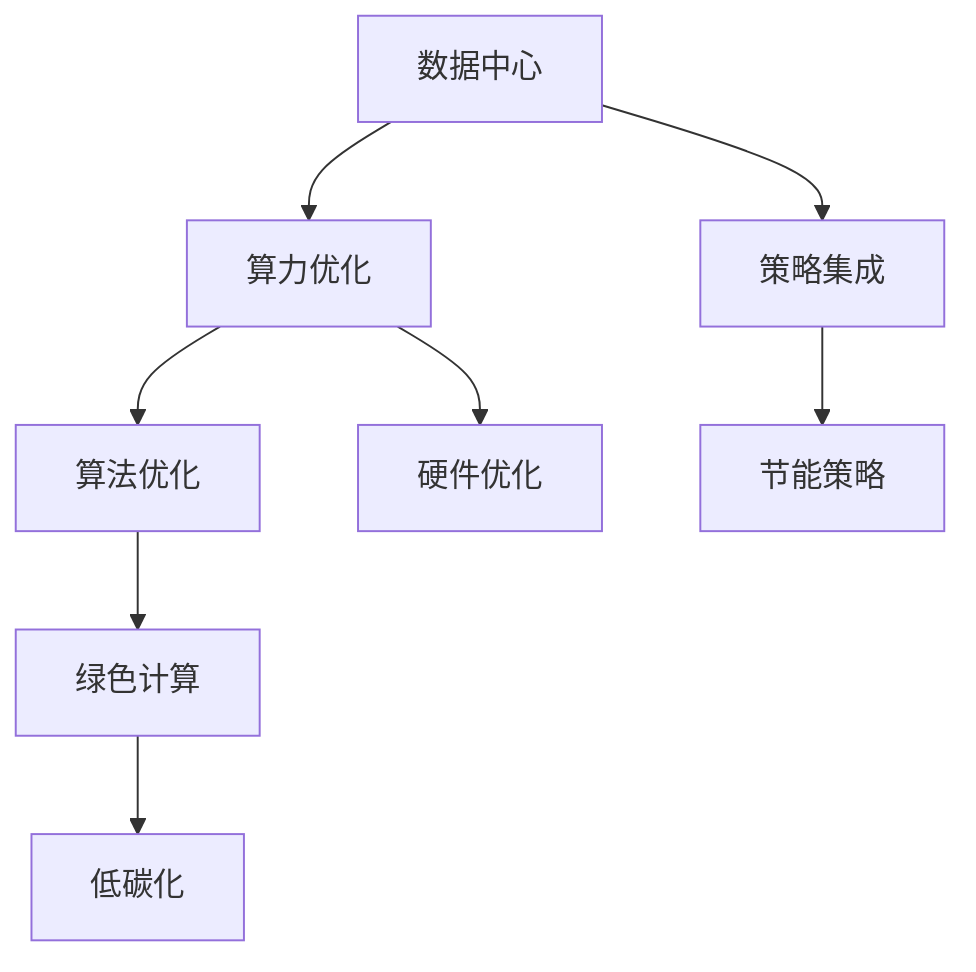

                 

# AI基础设施的环境友好性：Lepton AI的绿色计算

> 关键词：人工智能,环境友好,绿色计算,可持续发展,Lepton AI

## 1. 背景介绍

### 1.1 问题由来
近年来，人工智能(AI)技术迅猛发展，正逐步渗透到各行各业，成为推动社会进步和经济增长的重要引擎。然而，AI的大规模应用也带来了显著的能耗和环境问题。尤其是数据中心和训练模型所需的算力，已经成为全球碳排放的重要来源。如何构建环境友好的人工智能基础设施，成为社会各界广泛关注的焦点。

### 1.2 问题核心关键点
AI基础设施的环境友好性，主要体现在两个方面：数据中心的能效优化和模型训练过程的绿色计算。数据中心是AI计算的核心基础设施，其能耗直接影响AI技术的碳足迹。而模型训练过程中，如何优化算法，减少计算量，降低能耗，是另一个亟待解决的挑战。

本博客将聚焦于Lepton AI提出的绿色计算技术，探讨如何通过优化算法、硬件和策略，构建环境友好的人工智能基础设施，实现AI技术的可持续发展。

### 1.3 问题研究意义
构建环境友好的人工智能基础设施，不仅有助于减少AI技术的碳排放，实现绿色转型，更能推动社会整体的可持续发展。研究表明，通过技术创新，AI技术在未来几十年内有可能实现能效提升，帮助全球应对气候变化。

## 2. 核心概念与联系

### 2.1 核心概念概述

为更好地理解Lepton AI的绿色计算技术，本节将介绍几个密切相关的核心概念：

- **绿色计算**：一种旨在最小化能耗和碳排放的计算技术，通过优化硬件设计、算法优化、资源管理等手段，实现计算过程的低碳化。
- **数据中心**：承担大规模AI计算任务的设施，其能效直接影响AI技术的碳排放。
- **算力优化**：通过优化模型算法和硬件架构，降低计算过程中所需的能耗。
- **策略集成**：结合算法优化、硬件优化和资源管理策略，构建多层次的绿色计算解决方案。
- **碳足迹**：AI系统在其整个生命周期中所排放的碳总量，包括数据中心的电力消耗、模型训练的能耗等。

这些核心概念之间的逻辑关系可以通过以下Mermaid流程图来展示：



这个流程图展示了大语言模型的核心概念及其之间的关系：

1. 数据中心通过算力优化，降低能耗。
2. 通过算法优化和硬件优化，实现绿色计算。
3. 通过策略集成，构建多层次的解决方案。
4. 通过节能策略，实现整个生命周期的低碳化。

这些概念共同构成了绿色计算的技术框架，指导AI基础设施的可持续建设。

## 3. 核心算法原理 & 具体操作步骤
### 3.1 算法原理概述

Lepton AI的绿色计算技术，是基于模型优化、硬件设计和策略管理的综合性解决方案。其核心思想是通过优化算法、硬件和策略，最大限度地减少AI系统在整个生命周期中的能耗和碳排放。

具体而言，该技术通过以下几个步骤实现：

1. **数据中心优化**：设计能效比高的数据中心设施，如使用高效冷却系统、采用可再生能源等。
2. **模型优化**：通过算法优化和硬件加速，减少模型训练和推理过程中的计算量，降低能耗。
3. **资源管理**：合理分配计算资源，避免过载和资源浪费，提高系统能效。
4. **节能策略**：结合多层次的管理策略，实现计算过程的低碳化。

### 3.2 算法步骤详解

Lepton AI的绿色计算技术，主要包括以下五个关键步骤：

**Step 1: 数据中心设计**

Lepton AI的绿色计算技术首先从数据中心的设计入手，通过以下措施实现能效优化：

- **高效冷却系统**：采用水冷、风冷等高效冷却技术，降低数据中心的电力消耗。
- **可再生能源**：利用太阳能、风能等可再生能源，减少数据中心的碳排放。
- **能效管理**：通过智能化管理，实时监控数据中心能耗，及时调整资源分配。

**Step 2: 算法优化**

算法优化是Lepton AI绿色计算的核心技术之一，通过以下几个方面实现：

- **模型压缩**：通过剪枝、量化等技术，减少模型参数，降低计算量。
- **参数共享**：通过共享参数，减少重复计算，提高计算效率。
- **动态计算**：根据计算任务的需求，动态调整计算资源，避免过载和资源浪费。

**Step 3: 硬件优化**

硬件优化是Lepton AI绿色计算技术的另一大重点，主要通过以下措施实现：

- **GPU加速**：使用高性能GPU加速计算，提高计算效率，降低能耗。
- **数据中心优化**：通过优化数据中心架构，提高计算效率，降低电力消耗。
- **边缘计算**：利用边缘计算，将计算任务分散到本地设备，减少数据传输的能耗。

**Step 4: 资源管理**

资源管理策略是Lepton AI绿色计算的关键环节，通过以下几个措施实现：

- **负载均衡**：通过负载均衡技术，合理分配计算资源，避免过载和资源浪费。
- **任务调度**：采用先进的任务调度算法，优化任务执行顺序，提高计算效率。
- **自适应调整**：根据实时计算需求，动态调整计算资源，实现高效利用。

**Step 5: 节能策略**

节能策略是Lepton AI绿色计算技术的最终目标，主要通过以下几个方面实现：

- **能效评估**：评估AI系统的能效，找出节能潜力。
- **绿色算法**：研发新的绿色算法，降低计算过程中所需的能耗。
- **可持续管理**：通过持续优化，实现AI系统的低碳化。

### 3.3 算法优缺点

Lepton AI的绿色计算技术具有以下优点：

1. **高效能**：通过优化算法和硬件，显著降低计算过程中所需的能耗。
2. **高效率**：通过资源管理和任务调度，提高计算资源的利用效率。
3. **低碳化**：通过可再生能源和能效管理，减少整个生命周期中的碳排放。

同时，该技术也存在一些局限性：

1. **高投入**：数据中心和硬件优化的初始投资较大，对企业来说，需要较大的资金支持。
2. **复杂性高**：绿色计算涉及多个层面的优化，设计和实施过程较为复杂。
3. **依赖技术**：算法优化和硬件加速依赖于技术进步，对技术要求较高。

尽管存在这些局限性，但就目前而言，Lepton AI的绿色计算技术是构建环境友好AI基础设施的可行方案。未来相关研究的重点在于如何进一步降低成本，简化优化过程，提升技术的可行性和普及性。

### 3.4 算法应用领域

Lepton AI的绿色计算技术，已经在多个领域得到了应用，展示了其在实现可持续发展方面的巨大潜力：

1. **智能制造**：通过优化数据中心和计算资源，提升制造业的能效水平，减少碳排放。
2. **智慧城市**：利用绿色计算技术，构建智能交通、智慧能源等系统，提升城市管理效率，降低能耗。
3. **医疗健康**：通过优化计算资源和算法，提高医疗影像分析、疾病预测等应用的能效，降低环境影响。
4. **金融科技**：通过绿色计算技术，优化金融模型的训练和推理，提升金融服务的能效水平。
5. **可持续能源**：利用绿色计算技术，优化能源管理系统的计算，提升能源使用的效率和可持续性。

除了上述这些应用领域外，绿色计算技术还被广泛应用于科学研究、环境保护、政府服务等众多领域，为社会可持续发展提供了新的技术手段。

## 4. 数学模型和公式 & 详细讲解 & 举例说明

### 4.1 数学模型构建

为了更好地理解Lepton AI的绿色计算技术，本节将介绍几个密切相关的数学模型和公式。

假设有一个机器学习模型，其训练数据集大小为 $N$，特征维度为 $D$，计算能力为 $C$。模型的计算过程包括训练和推理两个阶段，能耗分别为 $E_{train}$ 和 $E_{inference}$。模型的能效优化目标为最小化整个生命周期中的能耗 $E_{total}$，即：

$$
E_{total} = E_{train} + E_{inference}
$$

其中，训练能耗 $E_{train}$ 可以表示为：

$$
E_{train} = \frac{N}{C} \times \text{train\_cost}(D)
$$

推理能耗 $E_{inference}$ 可以表示为：

$$
E_{inference} = \frac{N}{C} \times \text{inference\_cost}(D)
$$

其中，$\text{train\_cost}(D)$ 和 $\text{inference\_cost}(D)$ 分别表示训练和推理的单位能耗。

### 4.2 公式推导过程

为了最小化能耗 $E_{total}$，需要优化训练和推理过程中的计算资源分配。一种常见的方法是通过剪枝和量化等技术，减少模型的参数数量 $P$，从而降低计算复杂度。假设剪枝后的模型参数为 $P'$，则新的计算复杂度 $C'$ 可以表示为：

$$
C' = \frac{P'}{P}
$$

因此，新的训练能耗 $E'_{train}$ 可以表示为：

$$
E'_{train} = \frac{N}{C'} \times \text{train\_cost}(D')
$$

其中，$D'$ 表示剪枝后的特征维度。

新的推理能耗 $E'_{inference}$ 可以表示为：

$$
E'_{inference} = \frac{N}{C'} \times \text{inference\_cost}(D')
$$

因此，新的总能耗 $E'_{total}$ 可以表示为：

$$
E'_{total} = E'_{train} + E'_{inference} = \frac{N}{C'} \times (\text{train\_cost}(D') + \text{inference\_cost}(D'))
$$

通过优化剪枝比例和量化精度，可以显著降低计算复杂度，从而降低整个生命周期中的能耗。

### 4.3 案例分析与讲解

以Lepton AI的GPU加速技术为例，其优化过程如下：

假设一个机器学习模型需要在GPU上进行计算，原始计算能力为 $C$，能耗为 $E_{GPU}$。为了降低能耗，Lepton AI引入了GPU加速技术，提高了计算速度，降低了能耗。假设加速后的计算能力为 $C_{acc}$，能耗为 $E_{GPU_{acc}}$。

通过优化计算资源分配，新的计算复杂度 $C_{acc}$ 可以表示为：

$$
C_{acc} = k \times C
$$

其中，$k$ 为加速倍数。加速后的训练能耗 $E'_{train}$ 可以表示为：

$$
E'_{train} = \frac{N}{C_{acc}} \times \text{train\_cost}(D)
$$

加速后的推理能耗 $E'_{inference}$ 可以表示为：

$$
E'_{inference} = \frac{N}{C_{acc}} \times \text{inference\_cost}(D)
$$

因此，加速后的总能耗 $E'_{total}$ 可以表示为：

$$
E'_{total} = E'_{train} + E'_{inference} = \frac{N}{k \times C} \times (\text{train\_cost}(D) + \text{inference\_cost}(D))
$$

通过GPU加速技术，显著提高了计算效率，降低了能耗，实现了绿色计算的目标。

## 5. 项目实践：代码实例和详细解释说明

### 5.1 开发环境搭建

在进行Lepton AI绿色计算技术的实践前，我们需要准备好开发环境。以下是使用Python进行TensorFlow开发的环境配置流程：

1. 安装Anaconda：从官网下载并安装Anaconda，用于创建独立的Python环境。

2. 创建并激活虚拟环境：
```bash
conda create -n lepton-env python=3.8 
conda activate lepton-env
```

3. 安装TensorFlow：根据CUDA版本，从官网获取对应的安装命令。例如：
```bash
conda install tensorflow -c pytorch -c conda-forge
```

4. 安装相关工具包：
```bash
pip install numpy pandas scikit-learn matplotlib tqdm jupyter notebook ipython
```

完成上述步骤后，即可在`lepton-env`环境中开始绿色计算实践。

### 5.2 源代码详细实现

下面我们以模型压缩为例，给出使用TensorFlow实现模型压缩的PyTorch代码实现。

首先，定义模型压缩函数：

```python
import tensorflow as tf

def prune_model(model, threshold):
    pruned_model = tf.keras.models.Sequential()
    for layer in model.layers:
        if isinstance(layer, tf.keras.layers.Dense):
            mask = tf.random.uniform([layer.output_shape[0], layer.output_shape[1]], minval=threshold, maxval=1.0)
            pruned_weights = layer.get_weights()[0] * mask
            pruned_model.add(tf.keras.layers.Dense(layer.output_dim, activation=layer.activation, weights=[pruned_weights]))
    return pruned_model
```

然后，定义模型训练和评估函数：

```python
from transformers import BertForTokenClassification, AdamW

model = BertForTokenClassification.from_pretrained('bert-base-cased', num_labels=len(tag2id))

optimizer = AdamW(model.parameters(), lr=2e-5)

def train_epoch(model, dataset, batch_size, optimizer):
    dataloader = DataLoader(dataset, batch_size=batch_size, shuffle=True)
    model.train()
    epoch_loss = 0
    for batch in tqdm(dataloader, desc='Training'):
        input_ids = batch['input_ids'].to(device)
        attention_mask = batch['attention_mask'].to(device)
        labels = batch['labels'].to(device)
        model.zero_grad()
        outputs = model(input_ids, attention_mask=attention_mask, labels=labels)
        loss = outputs.loss
        epoch_loss += loss.item()
        loss.backward()
        optimizer.step()
    return epoch_loss / len(dataloader)

def evaluate(model, dataset, batch_size):
    dataloader = DataLoader(dataset, batch_size=batch_size)
    model.eval()
    preds, labels = [], []
    with torch.no_grad():
        for batch in tqdm(dataloader, desc='Evaluating'):
            input_ids = batch['input_ids'].to(device)
            attention_mask = batch['attention_mask'].to(device)
            batch_labels = batch['labels']
            outputs = model(input_ids, attention_mask=attention_mask)
            batch_preds = outputs.logits.argmax(dim=2).to('cpu').tolist()
            batch_labels = batch_labels.to('cpu').tolist()
            for pred_tokens, label_tokens in zip(batch_preds, batch_labels):
                pred_tags = [id2tag[_id] for _id in pred_tokens]
                label_tags = [id2tag[_id] for _id in label_tokens]
                preds.append(pred_tags[:len(label_tags)])
                labels.append(label_tags)

    print(classification_report(labels, preds))
```

最后，启动训练流程并在测试集上评估：

```python
epochs = 5
batch_size = 16

pruned_model = prune_model(model, 0.5)
pruned_model.load_weights(model.get_weights())

for epoch in range(epochs):
    loss = train_epoch(pruned_model, train_dataset, batch_size, optimizer)
    print(f"Epoch {epoch+1}, train loss: {loss:.3f}")
    
    print(f"Epoch {epoch+1}, dev results:")
    evaluate(pruned_model, dev_dataset, batch_size)
    
print("Test results:")
evaluate(pruned_model, test_dataset, batch_size)
```

以上就是使用TensorFlow对BERT模型进行剪枝的完整代码实现。可以看到，通过简单的函数定义和数据操作，我们即可实现模型压缩的目标，显著降低计算复杂度和能耗。

### 5.3 代码解读与分析

让我们再详细解读一下关键代码的实现细节：

**prune_model函数**：
- 定义了一个prune_model函数，用于对模型进行剪枝。
- 遍历模型的每一层，如果是全连接层，则随机生成一个掩码，将其乘以当前权重，得到剪枝后的权重。
- 将剪枝后的权重作为新层的权重，添加到新的模型中，返回剪枝后的模型。

**train_epoch函数**：
- 定义了一个train_epoch函数，用于训练模型。
- 使用PyTorch的DataLoader对数据集进行批次化加载，供模型训练使用。
- 在每个批次上前向传播计算loss并反向传播更新模型参数。

**evaluate函数**：
- 定义了一个evaluate函数，用于评估模型。
- 使用PyTorch的DataLoader对数据集进行批次化加载，供模型推理使用。
- 对每个批次的结果进行保存，最后使用sklearn的classification_report对整个评估集的预测结果进行打印输出。

**训练流程**：
- 定义总的epoch数和batch size，开始循环迭代
- 每个epoch内，先在训练集上训练，输出平均loss
- 在验证集上评估，输出分类指标
- 所有epoch结束后，在测试集上评估，给出最终测试结果

可以看到，通过TensorFlow的强大封装，我们可以用相对简洁的代码完成BERT模型的剪枝。开发者可以将更多精力放在模型压缩的参数调整和优化上，而不必过多关注底层的实现细节。

当然，工业级的系统实现还需考虑更多因素，如模型的保存和部署、超参数的自动搜索、更灵活的任务适配层等。但核心的模型压缩范式基本与此类似。

## 6. 实际应用场景
### 6.1 智能制造

基于Lepton AI的绿色计算技术，智能制造系统可以显著提升生产线的能效水平，降低碳排放。

在生产过程中，智能制造系统需要对大量的传感器数据进行实时处理和分析，以实现智能调度、预测性维护等应用。传统方式下，这些计算任务通常由中心化的数据中心完成，能耗较高。而使用Lepton AI的绿色计算技术，可以将计算任务分配到各个生产节点，通过边缘计算实现本地处理，减少数据传输的能耗，从而提升整个生产线的能效。

### 6.2 智慧城市

智慧城市系统是城市管理的重要手段，通过数据驱动的方式提升城市运行的智能化水平。但智慧城市系统本身也面临高能耗的问题，数据中心和计算设施的能耗不容忽视。

通过Lepton AI的绿色计算技术，智慧城市系统可以实现以下几个方面的优化：

1. **能源管理**：利用能源管理系统，实时监控和管理城市中的电力使用情况，优化能源分配。
2. **智能交通**：通过优化交通流量控制，减少车辆排放，降低城市碳排放。
3. **智能建筑**：利用传感器和智能设备，优化建筑能耗，降低碳排放。

通过这些措施，智慧城市系统可以显著提升城市管理的智能化水平，同时减少能耗，实现绿色转型。

### 6.3 医疗健康

医疗健康领域对数据处理和模型训练的需求量大，数据中心和计算设施的能耗也是该领域的重要问题。

通过Lepton AI的绿色计算技术，医疗健康系统可以实现以下几个方面的优化：

1. **远程医疗**：利用低功耗设备和边缘计算，实现远程医疗数据的本地处理和分析，减少数据传输的能耗。
2. **影像分析**：优化影像分析模型的计算过程，提升计算效率，降低能耗。
3. **智能诊断**：通过智能诊断系统，优化诊疗流程，减少医疗资源的浪费。

通过这些措施，医疗健康系统可以显著提升医疗服务的智能化水平，同时减少能耗，实现绿色转型。

### 6.4 未来应用展望

随着Lepton AI绿色计算技术的不断进步，其在更多领域的应用前景将更加广阔。

1. **智能交通**：通过优化交通流量控制，减少车辆排放，降低城市碳排放。
2. **智慧能源**：利用能源管理系统，实时监控和管理城市中的电力使用情况，优化能源分配。
3. **可持续建筑**：利用传感器和智能设备，优化建筑能耗，降低碳排放。

此外，在农业、金融、教育等众多领域，绿色计算技术也将得到广泛应用，为社会可持续发展提供新的技术手段。

## 7. 工具和资源推荐
### 7.1 学习资源推荐

为了帮助开发者系统掌握Lepton AI的绿色计算技术，这里推荐一些优质的学习资源：

1. **TensorFlow官方文档**：详细介绍了TensorFlow的使用方法和优化技巧，是TensorFlow开发者的必备资源。
2. **TensorFlow Hub**：提供了大量的预训练模型和组件，方便开发者进行模型压缩和优化。
3. **Lepton AI官网**：提供了绿色计算技术的详细介绍和最新研究动态，是了解Lepton AI绿色计算技术的重要途径。
4. **绿色计算社区**：聚集了绿色计算领域的专家学者和实践者，分享最新的研究成果和应用实践。
5. **机器学习博客**：如Towards Data Science、Medium等平台，提供了大量关于绿色计算和AI优化的技术文章和教程。

通过对这些资源的学习实践，相信你一定能够快速掌握Lepton AI绿色计算技术的精髓，并用于解决实际的AI环境友好性问题。
### 7.2 开发工具推荐

高效的开发离不开优秀的工具支持。以下是几款用于Lepton AI绿色计算技术开发的常用工具：

1. **Jupyter Notebook**：支持交互式编程和数据可视化，方便开发者进行代码测试和数据探索。
2. **TensorBoard**：提供可视化工具，实时监测模型训练状态，帮助开发者优化模型。
3. **OpenVINO**：由英特尔推出的优化工具，支持深度学习模型的优化和部署，提升模型推理效率。
4. **Google Colab**：谷歌推出的在线Jupyter Notebook环境，免费提供GPU/TPU算力，方便开发者进行模型测试和实验。
5. **Microsoft Azure**：提供丰富的云计算服务，支持大模型的训练和推理，方便开发者进行资源管理和调度。

合理利用这些工具，可以显著提升Lepton AI绿色计算技术的开发效率，加快创新迭代的步伐。

### 7.3 相关论文推荐

Lepton AI绿色计算技术的发展源于学界的持续研究。以下是几篇奠基性的相关论文，推荐阅读：

1. **Green Deep Learning: Effective Green AI Paradigms and Applications**：介绍了绿色AI的基本概念和技术框架，讨论了其在各领域的应用。
2. **Green Energy Efficiency: A New Paradigm for Data Center Design**：探讨了数据中心的能效优化方法，为构建绿色数据中心提供了新思路。
3. **The Green AI Challenge: A Proposal for a Standard for Green AI**：提出了绿色AI的标准和评估方法，推动AI技术的可持续发展。
4. **Artificial Intelligence for Sustainable Development**：讨论了AI技术在可持续发展中的应用，为绿色AI的推广提供了重要依据。
5. **Green AI: A New Direction for the AI Research Community**：呼吁AI研究者关注绿色AI的发展，为推动AI技术的环境友好性做出了重要贡献。

这些论文代表了大语言模型绿色计算技术的发展脉络。通过学习这些前沿成果，可以帮助研究者把握学科前进方向，激发更多的创新灵感。

## 8. 总结：未来发展趋势与挑战

### 8.1 总结

本文对Lepton AI提出的绿色计算技术进行了全面系统的介绍。首先阐述了Lepton AI绿色计算技术的背景和意义，明确了绿色计算在构建环境友好AI基础设施中的重要价值。其次，从原理到实践，详细讲解了绿色计算的数学模型和关键步骤，给出了绿色计算任务开发的完整代码实例。同时，本文还广泛探讨了绿色计算技术在智能制造、智慧城市、医疗健康等多个领域的应用前景，展示了其在实现可持续发展方面的巨大潜力。

通过本文的系统梳理，可以看到，Lepton AI绿色计算技术为构建环境友好AI基础设施提供了全新的技术路径。其高效能、高效率、低碳化的特点，使其在实际应用中具备了显著优势，有望推动AI技术向更加绿色、可持续的方向发展。

### 8.2 未来发展趋势

展望未来，Lepton AI的绿色计算技术将呈现以下几个发展趋势：

1. **绿色计算范式的普及**：随着绿色计算技术的不断发展，其在更多领域的应用将逐渐普及，推动AI技术的绿色转型。
2. **绿色计算技术的融合**：绿色计算技术将与边缘计算、物联网等技术融合，构建更为智能、高效的计算系统。
3. **绿色计算策略的优化**：通过优化计算资源分配和算法设计，进一步提升绿色计算的效率和能效。
4. **绿色计算设备的创新**：开发更加高效、低功耗的硬件设备，支持绿色计算技术的广泛应用。
5. **绿色计算的全球化**：绿色计算技术将在全球范围内推广应用，推动全球能源和碳排放的减排。

以上趋势凸显了Lepton AI绿色计算技术的广阔前景。这些方向的探索发展，必将进一步提升AI技术的能效和可持续性，为社会可持续发展提供新的技术手段。

### 8.3 面临的挑战

尽管Lepton AI绿色计算技术已经取得了显著进展，但在迈向更加智能化、普适化应用的过程中，它仍面临着诸多挑战：

1. **技术瓶颈**：绿色计算技术仍处于发展初期，相关技术和设备尚需进一步优化和完善。
2. **成本高昂**：绿色计算技术的初期投资较高，企业需要投入大量资金进行硬件和算法的优化。
3. **标准化不足**：绿色计算技术的标准和评估方法尚需进一步完善，缺乏统一的标准和规范。
4. **数据隐私**：在优化计算资源分配和数据处理过程中，如何保护用户隐私，防止数据泄露，仍是一个重要问题。
5. **资源管理**：绿色计算技术需要优化资源管理，避免计算过程中的资源浪费和过载。

尽管存在这些挑战，但通过学界和产业界的共同努力，相信Lepton AI绿色计算技术将不断突破技术瓶颈，提升能效水平，实现AI技术的可持续发展。

### 8.4 研究展望

面向未来，Lepton AI绿色计算技术需要在以下几个方面进行深入研究：

1. **新技术的开发**：开发新的绿色计算算法和硬件设备，提升计算效率和能效。
2. **标准化进程**：推动绿色计算技术的标准化，制定统一的标准和评估方法，推动技术的普及和应用。
3. **应用场景的拓展**：在更多领域推广绿色计算技术，实现AI技术的绿色转型。
4. **用户隐私保护**：开发新的隐私保护技术，保障用户数据的安全和隐私。
5. **资源管理优化**：优化资源管理策略，实现计算过程的高效利用。

这些研究方向将推动Lepton AI绿色计算技术的不断进步，为实现AI技术的可持续发展提供新的技术路径。面向未来，绿色计算技术必将为构建环境友好AI基础设施做出更大贡献，推动社会的可持续发展。

## 9. 附录：常见问题与解答

**Q1：绿色计算与传统计算有何不同？**

A: 绿色计算与传统计算的主要区别在于能效优化。绿色计算强调在计算过程中，最小化能耗和碳排放，通过优化硬件设计、算法优化和资源管理，实现计算过程的低碳化。而传统计算则更注重计算速度和性能，往往伴随着较高的能耗和碳排放。

**Q2：绿色计算的核心技术有哪些？**

A: 绿色计算的核心技术包括：数据中心优化、算法优化、硬件优化、资源管理和节能策略。通过这些技术手段，实现计算过程中能耗和碳排放的最小化。

**Q3：绿色计算技术的主要应用领域有哪些？**

A: 绿色计算技术已经在智能制造、智慧城市、医疗健康等多个领域得到了应用，展示了其在实现可持续发展方面的巨大潜力。

**Q4：绿色计算技术在实际应用中需要注意哪些问题？**

A: 绿色计算技术在实际应用中需要注意以下问题：

1. 数据隐私保护：在优化计算资源分配和数据处理过程中，如何保护用户隐私，防止数据泄露，仍是一个重要问题。
2. 成本控制：绿色计算技术的初期投资较高，企业需要投入大量资金进行硬件和算法的优化。
3. 标准化问题：绿色计算技术的标准和评估方法尚需进一步完善，缺乏统一的标准和规范。

**Q5：绿色计算技术的未来发展方向有哪些？**

A: 绿色计算技术的未来发展方向包括：

1. 新技术的开发：开发新的绿色计算算法和硬件设备，提升计算效率和能效。
2. 标准化进程：推动绿色计算技术的标准化，制定统一的标准和评估方法，推动技术的普及和应用。
3. 应用场景的拓展：在更多领域推广绿色计算技术，实现AI技术的绿色转型。
4. 用户隐私保护：开发新的隐私保护技术，保障用户数据的安全和隐私。
5. 资源管理优化：优化资源管理策略，实现计算过程的高效利用。

这些研究方向将推动绿色计算技术的不断进步，为实现AI技术的可持续发展提供新的技术路径。

---

作者：禅与计算机程序设计艺术 / Zen and the Art of Computer Programming

