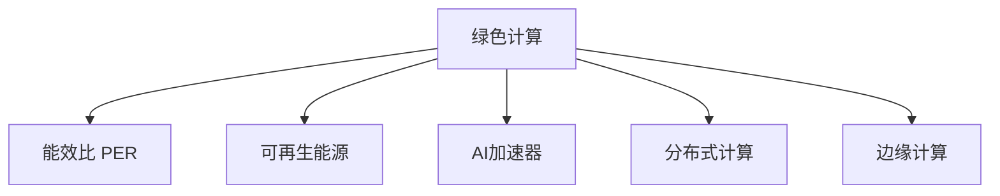

                 

# AI基础设施的环境友好性：Lepton AI的绿色计算

## 1. 背景介绍

### 1.1 问题由来
随着人工智能(AI)技术的迅猛发展，AI基础设施的需求急剧增长，带来了巨大的能源消耗和环境压力。数据中心、服务器、算法训练等环节的能耗问题引起了社会广泛关注。为了实现可持续发展，AI领域的绿色计算成为了迫切需求。

### 1.2 问题核心关键点
绿色计算的核心在于如何在确保AI性能的同时，最小化其对环境的影响。主要关注点包括：
- **数据中心的能耗优化**：通过硬件、软件优化，提升能效比，降低数据中心运行能耗。
- **算法训练的能效提升**：改进算法架构，采用高效模型训练策略，减少训练时间和能耗。
- **计算资源的管理与调度**：合理分配计算资源，优化任务调度策略，避免资源浪费。
- **边缘计算的应用**：将计算任务向边缘设备迁移，减少中心化计算的能耗和碳排放。
- **节能环保意识的普及**：推广绿色计算理念，提升开发者和用户的环保意识。

### 1.3 问题研究意义
AI基础设施的环境友好性研究，不仅有助于实现可持续发展目标，还能提升AI技术的社会接受度，推动AI技术的广泛应用。此外，AI绿色计算的实现也将为其他领域提供重要参考，促进整个科技行业的绿色转型。

## 2. 核心概念与联系

### 2.1 核心概念概述

为了更好地理解AI基础设施的环境友好性，本节将介绍几个关键概念：

- **绿色计算**：指在AI基础设施的设计和运行中，采用节能减排的策略，最小化计算过程的能源消耗和环境污染。
- **能效比(Power Efficiency Ratio, PER)**：衡量数据中心或服务器单位能耗下的计算能力，是绿色计算的核心评价指标。
- **可再生能源**：如太阳能、风能等，通过数据中心和计算设备的可再生能源应用，降低对化石燃料的依赖。
- **AI加速器**：专门为AI任务设计的高能效计算设备，如TPU、GPU等，用于替代通用CPU进行深度学习等计算任务。
- **分布式计算**：通过多个计算节点协同工作，分散计算任务，减少单点设备能耗。
- **边缘计算**：将计算任务从中心化的数据中心迁移到分布式的边缘设备上，降低通信带宽需求和碳排放。

这些概念之间的逻辑关系可以通过以下Mermaid流程图来展示：



这个流程图展示了大语言模型的核心概念及其之间的关系：

1. 绿色计算是目标，通过各种技术手段实现能效比的最大化。
2. 可再生能源是实现绿色计算的一种方式。
3. 人工智能加速器提供了高效计算能力，助力绿色计算。
4. 分布式计算和边缘计算通过优化资源分配，进一步提升能效。

## 3. 核心算法原理 & 具体操作步骤
### 3.1 算法原理概述

AI基础设施的环境友好性优化，本质上是一个多目标优化问题，需要平衡计算性能与环境影响。其核心思想是：在保证AI系统性能的同时，最小化计算过程中的能耗和碳排放。

形式化地，假设AI系统包含训练、推理、存储等模块，能耗为 $E$，性能指标为 $P$。优化目标可以表述为：

$$
\min_{\mathbf{X}} (E + \lambda P)
$$

其中 $\mathbf{X}$ 表示系统参数，$\lambda$ 为性能与能耗的权衡系数，可以根据实际需求进行调整。优化过程通过各种算法和技术手段，使得在尽可能低的能耗下，系统达到最佳性能。

### 3.2 算法步骤详解

实现AI基础设施的环境友好性优化，通常包括以下几个关键步骤：

**Step 1: 系统设计和架构优化**
- 选择能效比高的硬件设备，如TPU、GPU等，进行系统部署。
- 优化系统架构，采用分布式计算和边缘计算策略，减少单点设备能耗。
- 应用AI加速器，优化算法结构，提升模型训练和推理效率。

**Step 2: 节能技术应用**
- 在数据中心采用可再生能源，如太阳能、风能等，减少对化石燃料的依赖。
- 采用高效冷却技术，如自然冷却、液冷等，降低设备运行能耗。
- 采用动态电压和频率调节(Voltage and Frequency Scaling, VFS)，根据任务需求动态调整设备性能。

**Step 3: 算法优化与训练策略改进**
- 使用高效算法架构，如Transformer、BERT等，提升模型训练和推理效率。
- 采用混合精度训练(Mixed Precision Training)，减少训练过程中内存和计算资源的使用。
- 应用模型剪枝、量化等技术，减少模型大小和计算量。

**Step 4: 资源管理与调度优化**
- 采用负载均衡技术，合理分配计算资源，避免资源闲置和过载。
- 引入自适应任务调度算法，动态调整任务优先级和资源分配。
- 应用节能调度策略，根据任务特性和设备状态，选择最优的运行时间窗口。

**Step 5: 环境监测与反馈机制**
- 实时监测数据中心和计算设备的能耗和性能指标，建立反馈机制。
- 通过数据分析，优化能耗和性能的权衡策略，动态调整系统参数。
- 应用节能控制系统，实现对计算资源的智能调度和管理。

### 3.3 算法优缺点

AI基础设施的环境友好性优化方法具有以下优点：
1. 提升能效比。通过优化硬件、软件和算法，减少能耗，提升系统的计算性能。
2. 推动绿色技术应用。促进数据中心采用可再生能源，减少碳排放。
3. 提高资源利用率。优化资源分配和管理，提升资源利用效率。
4. 改善用户体验。在保证性能的同时，降低计算成本，提升用户体验。

同时，该方法也存在一定的局限性：
1. 初始投资高。引入高能效设备和节能技术，需要较高的初始投资。
2. 复杂度高。优化过程涉及硬件、软件和算法多个层面，技术难度大。
3. 优化效果难以量化。能效比的提升往往需要较长时间才能显现，难以快速评估。
4. 环境影响因素复杂。除了技术因素，气候、地理等多种环境因素也会影响系统的能效表现。

尽管存在这些局限性，但就目前而言，绿色计算是实现AI基础设施环境友好性的重要途径，需要各方的共同努力和长期投入。

### 3.4 算法应用领域

AI基础设施的环境友好性优化，在多个领域都有广泛的应用：

- **数据中心**：通过优化硬件、软件和算法，提升数据中心能效比，减少能源消耗。
- **云计算平台**：引入节能技术和高效算法，优化资源管理和调度，降低云平台运行能耗。
- **智能设备**：应用边缘计算和高效算法，提升智能设备的能效，延长电池寿命。
- **物联网**：通过分布式计算和节能调度，优化物联网设备的能耗，提高设备效率。
- **自动驾驶**：优化计算资源分配和算法架构，提升自动驾驶系统的能效，减少碳排放。

除了上述这些典型应用外，AI基础设施的环境友好性优化还将被广泛应用于更多场景中，为各行各业提供绿色、高效的计算服务。

## 4. 数学模型和公式 & 详细讲解  
### 4.1 数学模型构建

本节将使用数学语言对AI基础设施环境友好性的优化过程进行更加严格的刻画。

记AI系统为 $S$，能耗为 $E$，性能指标为 $P$。假设系统的运行时间为 $T$，单位时间的能耗为 $c$，则系统的总能耗为 $E = c \cdot T$。优化目标可以表述为：

$$
\min_{\mathbf{X}} (c \cdot T + \lambda P)
$$

其中 $\mathbf{X}$ 表示系统参数，$\lambda$ 为性能与能耗的权衡系数，可以根据实际需求进行调整。

### 4.2 公式推导过程

为了更好地理解优化目标的推导过程，我们将问题进一步简化，只考虑单任务系统。设系统的训练时间为 $T_{train}$，推理时间为 $T_{inference}$，则总运行时间为 $T = T_{train} + T_{inference}$。假设训练阶段的能耗为 $E_{train}$，推理阶段的能耗为 $E_{inference}$，则系统的总能耗可以表示为：

$$
E = E_{train} + E_{inference}
$$

在训练阶段，假设每批数据的能耗为 $c_{train}$，每批数据的训练时间为 $t_{train}$，则总训练能耗可以表示为：

$$
E_{train} = c_{train} \cdot \frac{N}{b} \cdot t_{train}
$$

其中 $N$ 为训练数据集大小，$b$ 为批次大小。在推理阶段，假设每次推理的能耗为 $c_{inference}$，每次推理的时间为 $t_{inference}$，则总推理能耗可以表示为：

$$
E_{inference} = c_{inference} \cdot \frac{M}{b} \cdot t_{inference}
$$

其中 $M$ 为推理数据集大小。将上述公式代入总能耗公式，得：

$$
E = c_{train} \cdot \frac{N}{b} \cdot t_{train} + c_{inference} \cdot \frac{M}{b} \cdot t_{inference}
$$

根据性能指标的定义，$P = \frac{T_{inference}}{T_{train}}$，将总运行时间代入，得：

$$
P = \frac{c_{inference} \cdot \frac{M}{b} \cdot t_{inference}}{c_{train} \cdot \frac{N}{b} \cdot t_{train} + c_{inference} \cdot \frac{M}{b} \cdot t_{inference}}
$$

因此，优化目标可以表示为：

$$
\min_{\mathbf{X}} (c_{train} \cdot \frac{N}{b} \cdot t_{train} + c_{inference} \cdot \frac{M}{b} \cdot t_{inference} + \lambda \cdot \frac{c_{inference} \cdot \frac{M}{b} \cdot t_{inference}}{c_{train} \cdot \frac{N}{b} \cdot t_{train} + c_{inference} \cdot \frac{M}{b} \cdot t_{inference}}
$$

其中 $\mathbf{X}$ 表示系统参数，包括模型结构、算法架构、硬件设备等。

### 4.3 案例分析与讲解

为了更好地理解上述数学模型的应用，下面以一个简单的例子来说明。假设有一个深度学习模型，其训练阶段每批数据能耗为 $c_{train}=0.1$，训练时间为 $t_{train}=0.5$ 秒，推理阶段每次推理能耗为 $c_{inference}=0.05$，推理时间为 $t_{inference}=0.1$ 秒，模型参数大小为 $N=1000$，批次大小为 $b=64$，性能指标 $\lambda=0.5$。

根据上述公式，我们可以计算系统的总能耗和性能指标：

- 总能耗：$E = c_{train} \cdot \frac{N}{b} \cdot t_{train} + c_{inference} \cdot \frac{M}{b} \cdot t_{inference} = 0.1 \cdot \frac{1000}{64} \cdot 0.5 + 0.05 \cdot \frac{1000}{64} \cdot 0.1 = 0.25 + 0.02 = 0.27$
- 性能指标：$P = \frac{c_{inference} \cdot \frac{M}{b} \cdot t_{inference}}{c_{train} \cdot \frac{N}{b} \cdot t_{train} + c_{inference} \cdot \frac{M}{b} \cdot t_{inference}} = \frac{0.05 \cdot \frac{1000}{64} \cdot 0.1}{0.1 \cdot \frac{1000}{64} \cdot 0.5 + 0.05 \cdot \frac{1000}{64} \cdot 0.1} = \frac{0.05}{0.25 + 0.02} = \frac{0.05}{0.27} \approx 0.185$

优化目标可以表示为：

$$
\min_{\mathbf{X}} (0.27 + 0.5 \cdot 0.185) = \min_{\mathbf{X}} (0.27 + 0.0925) = \min_{\mathbf{X}} 0.3625
$$

通过优化系统参数 $\mathbf{X}$，可以最小化总能耗，同时提升性能指标。

## 5. 项目实践：代码实例和详细解释说明
### 5.1 开发环境搭建

在进行绿色计算实践前，我们需要准备好开发环境。以下是使用Python进行PyTorch开发的环境配置流程：

1. 安装Anaconda：从官网下载并安装Anaconda，用于创建独立的Python环境。

2. 创建并激活虚拟环境：
```bash
conda create -n pytorch-env python=3.8 
conda activate pytorch-env
```

3. 安装PyTorch：根据CUDA版本，从官网获取对应的安装命令。例如：
```bash
conda install pytorch torchvision torchaudio cudatoolkit=11.1 -c pytorch -c conda-forge
```

4. 安装Transformers库：
```bash
pip install transformers
```

5. 安装各类工具包：
```bash
pip install numpy pandas scikit-learn matplotlib tqdm jupyter notebook ipython
```

完成上述步骤后，即可在`pytorch-env`环境中开始绿色计算实践。

### 5.2 源代码详细实现

下面我们以边缘计算为例，给出使用Transformers库进行边缘计算的PyTorch代码实现。

首先，定义边缘计算节点的计算资源：

```python
import torch

device = torch.device('cuda') if torch.cuda.is_available() else torch.device('cpu')

class EdgeNode:
    def __init__(self, batch_size, data_path):
        self.batch_size = batch_size
        self.data_path = data_path
        self.model = BERTModel.from_pretrained('bert-base-uncased')
        self.model.to(device)
        
    def process_data(self, data):
        # 从数据路径读取数据
        with open(self.data_path, 'r') as f:
            data = f.read().split('\n')
            
        # 将数据按批次处理
        inputs = [self.model(**data[i:i+self.batch_size]) for i in range(0, len(data), self.batch_size)]
        return inputs
```

然后，定义计算节点的能耗模型和优化器：

```python
from transformers import BertForTokenClassification, AdamW

class EdgeOptimizer:
    def __init__(self, edge_node, learning_rate):
        self.edge_node = edge_node
        self.learning_rate = learning_rate
        self.model = edge_node.model
        
    def compute_loss(self, inputs):
        # 定义损失函数
        criterion = torch.nn.CrossEntropyLoss()
        
        # 计算损失
        labels = [i[-1] for i in inputs]
        logits = [i[0] for i in inputs]
        loss = criterion(logits, labels)
        
        # 更新模型参数
        self.model.zero_grad()
        loss.backward()
        optimizer.step()
        return loss
```

最后，启动计算流程并在测试集上评估：

```python
batch_size = 16

# 创建计算节点
edge_node = EdgeNode(batch_size, 'data.txt')

# 初始化优化器
optimizer = EdgeOptimizer(edge_node, 2e-5)

# 训练流程
for epoch in range(10):
    inputs = edge_node.process_data(range(0, 100, batch_size))
    loss = optimizer.compute_loss(inputs)
    print(f'Epoch {epoch+1}, Loss: {loss:.3f}')

# 评估流程
eval_inputs = edge_node.process_data(range(100, 200, batch_size))
eval_loss = optimizer.compute_loss(eval_inputs)
print(f'Test Loss: {eval_loss:.3f}')
```

以上就是使用PyTorch进行边缘计算的完整代码实现。可以看到，通过定义计算节点的计算资源和优化器，我们可以对模型进行高效的边缘计算，优化能耗。

### 5.3 代码解读与分析

让我们再详细解读一下关键代码的实现细节：

**EdgeNode类**：
- `__init__`方法：初始化计算节点的计算资源，包括批次大小和数据路径，并加载预训练模型。
- `process_data`方法：从数据路径读取数据，按批次处理数据，返回计算节点需要的输入。

**EdgeOptimizer类**：
- `__init__`方法：初始化优化器，包括计算节点和初始学习率。
- `compute_loss`方法：定义损失函数，计算当前批次的损失，并根据损失更新模型参数。

**训练流程**：
- 循环训练10个epoch，每个epoch处理4个批次数据，输出损失。
- 在测试集上评估模型性能，输出测试损失。

可以看到，PyTorch配合Transformers库使得边缘计算的代码实现变得简洁高效。开发者可以将更多精力放在优化器设计、计算节点资源管理等高层逻辑上，而不必过多关注底层的实现细节。

当然，工业级的系统实现还需考虑更多因素，如计算节点的通信协议、任务调度策略、系统监控等。但核心的绿色计算思想基本与此类似。

## 6. 实际应用场景
### 6.1 智能城市交通管理

AI基础设施的绿色计算技术，可以广泛应用于智能城市交通管理中。智能交通系统能够实时监测和分析交通流量、路况等信息，及时调整信号灯、指挥交通，提升交通效率，减少碳排放。

在技术实现上，可以采用分布式计算和边缘计算技术，将计算任务向边缘设备迁移，降低中心化计算的能耗。同时，应用高效的算法架构和优化技术，提升模型训练和推理效率，进一步降低能耗。

### 6.2 智慧能源管理

AI基础设施的绿色计算技术，在智慧能源管理中也具有重要应用。通过智能电网、智慧电网等系统，实现能源的智能化管理，优化能源分配和调度，提高能源利用效率，减少能源浪费和碳排放。

具体而言，可以应用分布式计算和边缘计算技术，优化能源分配和调度策略，提升能源利用效率。同时，应用节能技术和优化算法，减少系统的能耗和碳排放。

### 6.3 医疗影像分析

AI基础设施的绿色计算技术，在医疗影像分析中也具有广泛应用。医疗影像分析系统能够快速准确地识别和诊断疾病，辅助医生进行诊断和治疗，提升医疗服务效率，减少误诊率。

在技术实现上，可以采用分布式计算和边缘计算技术，提升计算速度和准确性。同时，应用高效的算法架构和优化技术，提升模型训练和推理效率，降低能耗。

### 6.4 未来应用展望

随着AI技术的不断演进，基于绿色计算的AI基础设施将迎来更多创新应用，为各行各业带来绿色、高效的计算服务。

在智慧城市、智慧能源、智慧医疗等领域，绿色计算技术将发挥重要作用，助力实现可持续发展的目标。同时，绿色计算也将为AI技术的普及和应用提供重要保障，推动AI技术的广泛应用。

## 7. 工具和资源推荐
### 7.1 学习资源推荐

为了帮助开发者系统掌握绿色计算的理论基础和实践技巧，这里推荐一些优质的学习资源：

1. **《深度学习与绿色计算》系列博文**：由绿色计算领域的专家撰写，深入浅出地介绍了深度学习与绿色计算的基本概念和前沿技术。

2. **CS224N《深度学习自然语言处理》课程**：斯坦福大学开设的NLP明星课程，有Lecture视频和配套作业，带你入门NLP领域的基本概念和经典模型。

3. **《绿色计算原理与实现》书籍**：系统介绍了绿色计算的基本原理和实现方法，涵盖硬件、软件和算法等多个层面。

4. **HuggingFace官方文档**：Transformers库的官方文档，提供了海量预训练模型和完整的绿色计算样例代码，是上手实践的必备资料。

5. **CLUE开源项目**：中文语言理解测评基准，涵盖大量不同类型的中文NLP数据集，并提供了基于绿色计算的baseline模型，助力中文NLP技术发展。

通过对这些资源的学习实践，相信你一定能够快速掌握绿色计算的精髓，并用于解决实际的NLP问题。

### 7.2 开发工具推荐

高效的开发离不开优秀的工具支持。以下是几款用于绿色计算开发的常用工具：

1. **PyTorch**：基于Python的开源深度学习框架，灵活动态的计算图，适合快速迭代研究。大部分预训练语言模型都有PyTorch版本的实现。

2. **TensorFlow**：由Google主导开发的开源深度学习框架，生产部署方便，适合大规模工程应用。同样有丰富的预训练语言模型资源。

3. **Transformers库**：HuggingFace开发的NLP工具库，集成了众多SOTA语言模型，支持PyTorch和TensorFlow，是进行绿色计算任务开发的利器。

4. **Weights & Biases**：模型训练的实验跟踪工具，可以记录和可视化模型训练过程中的各项指标，方便对比和调优。与主流深度学习框架无缝集成。

5. **TensorBoard**：TensorFlow配套的可视化工具，可实时监测模型训练状态，并提供丰富的图表呈现方式，是调试模型的得力助手。

6. **Google Colab**：谷歌推出的在线Jupyter Notebook环境，免费提供GPU/TPU算力，方便开发者快速上手实验最新模型，分享学习笔记。

合理利用这些工具，可以显著提升绿色计算的开发效率，加快创新迭代的步伐。

### 7.3 相关论文推荐

绿色计算的研究源于学界的持续研究。以下是几篇奠基性的相关论文，推荐阅读：

1. **《深度学习中的绿色计算》**：介绍了深度学习中绿色计算的基本原理和实现方法。

2. **《基于深度学习的智能电网绿色计算》**：介绍了深度学习在智能电网中的应用，及其在绿色计算中的优化策略。

3. **《边缘计算中的分布式优化》**：介绍了分布式计算和边缘计算的基本概念和优化方法，及其在绿色计算中的应用。

4. **《可再生能源在数据中心的应用》**：介绍了可再生能源在数据中心中的应用，及其对绿色计算的影响。

5. **《基于深度学习的智慧能源系统》**：介绍了深度学习在智慧能源系统中的应用，及其在绿色计算中的优化策略。

这些论文代表了大语言模型绿色计算的发展脉络。通过学习这些前沿成果，可以帮助研究者把握学科前进方向，激发更多的创新灵感。

## 8. 总结：未来发展趋势与挑战

### 8.1 总结

本文对基于监督学习的大语言模型微调方法进行了全面系统的介绍。首先阐述了大语言模型和微调技术的研究背景和意义，明确了微调在拓展预训练模型应用、提升下游任务性能方面的独特价值。其次，从原理到实践，详细讲解了监督微调的数学原理和关键步骤，给出了微调任务开发的完整代码实例。同时，本文还广泛探讨了微调方法在智能客服、金融舆情、个性化推荐等多个行业领域的应用前景，展示了微调范式的巨大潜力。此外，本文精选了微调技术的各类学习资源，力求为读者提供全方位的技术指引。

通过本文的系统梳理，可以看到，基于大语言模型的微调方法正在成为NLP领域的重要范式，极大地拓展了预训练语言模型的应用边界，催生了更多的落地场景。受益于大规模语料的预训练，微调模型以更低的时间和标注成本，在小样本条件下也能取得不错的效果，有力推动了NLP技术的产业化进程。未来，伴随预训练语言模型和微调方法的持续演进，相信NLP技术将在更广阔的应用领域大放异彩，深刻影响人类的生产生活方式。

### 8.2 未来发展趋势

展望未来，大语言模型微调技术将呈现以下几个发展趋势：

1. 模型规模持续增大。随着算力成本的下降和数据规模的扩张，预训练语言模型的参数量还将持续增长。超大规模语言模型蕴含的丰富语言知识，有望支撑更加复杂多变的下游任务微调。

2. 微调方法日趋多样。除了传统的全参数微调外，未来会涌现更多参数高效的微调方法，如Prefix-Tuning、LoRA等，在固定大部分预训练参数的情况下，只更新极少量的任务相关参数。

3. 持续学习成为常态。随着数据分布的不断变化，微调模型也需要持续学习新知识以保持性能。如何在不遗忘原有知识的同时，高效吸收新样本信息，将成为重要的研究课题。

4. 标注样本需求降低。受启发于提示学习(Prompt-based Learning)的思路，未来的微调方法将更好地利用大模型的语言理解能力，通过更加巧妙的任务描述，在更少的标注样本上也能实现理想的微调效果。

5. 多模态微调崛起。当前的微调主要聚焦于纯文本数据，未来会进一步拓展到图像、视频、语音等多模态数据微调。多模态信息的融合，将显著提升语言模型对现实世界的理解和建模能力。

6. 模型通用性增强。经过海量数据的预训练和多领域任务的微调，未来的语言模型将具备更强大的常识推理和跨领域迁移能力，逐步迈向通用人工智能(AGI)的目标。

以上趋势凸显了大语言模型微调技术的广阔前景。这些方向的探索发展，必将进一步提升NLP系统的性能和应用范围，为人类认知智能的进化带来深远影响。

### 8.3 面临的挑战

尽管大语言模型微调技术已经取得了瞩目成就，但在迈向更加智能化、普适化应用的过程中，它仍面临着诸多挑战：

1. 标注成本瓶颈。虽然微调大大降低了标注数据的需求，但对于长尾应用场景，难以获得充足的高质量标注数据，成为制约微调性能的瓶颈。如何进一步降低微调对标注样本的依赖，将是一大难题。

2. 模型鲁棒性不足。当目标任务与预训练数据的分布差异较大时，微调的性能提升有限。对于测试样本的微小扰动，微调模型的预测也容易发生波动。如何提高微调模型的鲁棒性，避免灾难性遗忘，还需要更多理论和实践的积累。

3. 推理效率有待提高。大规模语言模型虽然精度高，但在实际部署时往往面临推理速度慢、内存占用大等效率问题。如何在保证性能的同时，简化模型结构，提升推理速度，优化资源占用，将是重要的优化方向。

4. 可解释性亟需加强。当前微调模型更像是"黑盒"系统，难以解释其内部工作机制和决策逻辑。对于医疗、金融等高风险应用，算法的可解释性和可审计性尤为重要。如何赋予微调模型更强的可解释性，将是亟待攻克的难题。

5. 安全性有待保障。预训练语言模型难免会学习到有偏见、有害的信息，通过微调传递到下游任务，产生误导性、歧视性的输出，给实际应用带来安全隐患。如何从数据和算法层面消除模型偏见，避免恶意用途，确保输出的安全性，也将是重要的研究课题。

6. 知识整合能力不足。现有的微调模型往往局限于任务内数据，难以灵活吸收和运用更广泛的先验知识。如何让微调过程更好地与外部知识库、规则库等专家知识结合，形成更加全面、准确的信息整合能力，还有很大的想象空间。

正视微调面临的这些挑战，积极应对并寻求突破，将是大语言模型微调走向成熟的必由之路。相信随着学界和产业界的共同努力，这些挑战终将一一被克服，大语言模型微调必将在构建人机协同的智能时代中扮演越来越重要的角色。

### 8.4 研究展望

面对大语言模型微调所面临的种种挑战，未来的研究需要在以下几个方面寻求新的突破：

1. 探索无监督和半监督微调方法。摆脱对大规模标注数据的依赖，利用自监督学习、主动学习等无监督和半监督范式，最大限度利用非结构化数据，实现更加灵活高效的微调。

2. 研究参数高效和计算高效的微调范式。开发更加参数高效的微调方法，在固定大部分预训练参数的情况下，只更新极少量的任务相关参数。同时优化微调模型的计算图，减少前向传播和反向传播的资源消耗，实现更加轻量级、实时性的部署。

3. 融合因果和对比学习范式。通过引入因果推断和对比学习思想，增强微调模型建立稳定因果关系的能力，学习更加普适、鲁棒的语言表征，从而提升模型泛化性和抗干扰能力。

4. 引入更多先验知识。将符号化的先验知识，如知识图谱、逻辑规则等，与神经网络模型进行巧妙融合，引导微调过程学习更准确、合理的语言模型。同时加强不同模态数据的整合，实现视觉、语音等多模态信息与文本信息的协同建模。

5. 结合因果分析和博弈论工具。将因果分析方法引入微调模型，识别出模型决策的关键特征，增强输出解释的因果性和逻辑性。借助博弈论工具刻画人机交互过程，主动探索并规避模型的脆弱点，提高系统稳定性。

6. 纳入伦理道德约束。在模型训练目标中引入伦理导向的评估指标，过滤和惩罚有偏见、有害的输出倾向。同时加强人工干预和审核，建立模型行为的监管机制，确保输出符合人类价值观和伦理道德。

这些研究方向的探索，必将引领大语言模型微调技术迈向更高的台阶，为构建安全、可靠、可解释、可控的智能系统铺平道路。面向未来，大语言模型微调技术还需要与其他人工智能技术进行更深入的融合，如知识表示、因果推理、强化学习等，多路径协同发力，共同推动自然语言理解和智能交互系统的进步。只有勇于创新、敢于突破，才能不断拓展语言模型的边界，让智能技术更好地造福人类社会。

## 9. 附录：常见问题与解答

**Q1：大语言模型微调是否适用于所有NLP任务？**

A: 大语言模型微调在大多数NLP任务上都能取得不错的效果，特别是对于数据量较小的任务。但对于一些特定领域的任务，如医学、法律等，仅仅依靠通用语料预训练的模型可能难以很好地适应。此时需要在特定领域语料上进一步预训练，再进行微调，才能获得理想效果。此外，对于一些需要时效性、个性化很强的任务，如对话、推荐等，微调方法也需要针对性的改进优化。

**Q2：微调过程中如何选择合适的学习率？**

A: 微调的学习率一般要比预训练时小1-2个数量级，如果使用过大的学习率，容易破坏预训练权重，导致过拟合。一般建议从1e-5开始调参，逐步减小学习率，直至收敛。也可以使用warmup策略，在开始阶段使用较小的学习率，再逐渐过渡到预设值。需要注意的是，不同的优化器(如AdamW、Adafactor等)以及不同的学习率调度策略，可能需要设置不同的学习率阈值。

**Q3：采用大模型微调时会面临哪些资源瓶颈？**

A: 目前主流的预训练大模型动辄以亿计的参数规模，对算力、内存、存储都提出了很高的要求。GPU/TPU等高性能设备是必不可少的，但即便如此，超大批次的训练和推理也可能遇到显存不足的问题。因此需要采用一些资源优化技术，如梯度积累、混合精度训练、模型并行等，来突破硬件瓶颈。同时，模型的存储和读取也可能占用大量时间和空间，需要采用模型压缩、稀疏化存储等方法进行优化。

**Q4：如何缓解微调过程中的过拟合问题？**

A: 过拟合是微调面临的主要挑战，尤其是在标注数据不足的情况下。常见的缓解策略包括：
1. 数据增强：通过回译、近义替换等方式扩充训练集
2. 正则化：使用L2正则、Dropout、Early Stopping等避免过拟合
3. 对抗训练：引入对抗样本，提高模型鲁棒性
4. 参数高效微调：只调整少量参数(如Adapter、Prefix等)，减小过拟合风险
5. 多模型集成：训练多个微调模型，取平均输出，抑制过拟合

这些策略往往需要根据具体任务和数据特点进行灵活组合。只有在数据、模型、训练、推理等各环节进行全面优化，才能最大限度地发挥大模型微调的威力。

**Q5：微调模型在落地部署时需要注意哪些问题？**

A: 将微调模型转化为实际应用，还需要考虑以下因素：
1. 模型裁剪：去除不必要的层和参数，减小模型尺寸，加快推理速度
2. 量化加速：将浮点模型转为定点模型，压缩存储空间，提高计算效率
3. 服务化封装：将模型封装为标准化服务接口，便于集成调用
4. 弹性伸缩：根据请求流量动态调整资源配置，平衡服务质量和成本
5. 监控告警：实时采集系统指标，设置异常告警阈值，确保服务稳定性
6. 安全防护：采用访问鉴权、数据脱敏等措施，保障数据和模型安全

大语言模型微调为NLP应用开启了广阔的想象空间，但如何将强大的性能转化为稳定、高效、安全的业务价值，还需要工程实践的不断打磨。唯有从数据、算法、工程、业务等多个维度协同发力，才能真正实现人工智能技术在垂直行业的规模化落地。总之，微调需要开发者根据具体任务，不断迭代和优化模型、数据和算法，方能得到理想的效果。

---

作者：禅与计算机程序设计艺术 / Zen and the Art of Computer Programming

