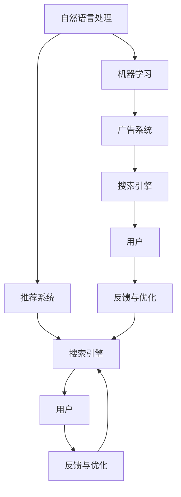

                 

# AI多渠道整合提升搜索结果

## 1. 背景介绍

在当今信息爆炸的时代，搜索结果的准确性和相关性已经成为了用户体验的关键。搜索引擎不仅仅是一个简单的信息检索工具，更是一个复杂的决策支持系统。用户不仅需要找到信息，更需要找到最相关、最可靠的信息。AI技术为搜索引擎带来了新的可能性，通过多渠道整合，可以极大地提升搜索结果的精准度和用户体验。

## 2. 核心概念与联系

### 2.1 核心概念概述

在搜索引擎中，AI技术主要用于以下几个方面：

- **自然语言处理(NLP)**：用于理解和解析用户查询，将自然语言转化为机器可理解的形式，如关键词提取、实体识别等。
- **机器学习与深度学习**：通过学习用户行为数据和点击日志，预测用户偏好，进行个性化排序。
- **推荐系统**：根据用户的历史行为和查询内容，推荐可能相关的网页，提升点击率和停留时间。
- **广告系统**：通过用户行为数据分析，精准投放广告，提升收入和用户体验。

这些技术互相交织，形成了搜索引擎的核心竞争力。而多渠道整合则是指将多种技术手段结合起来，形成一个统一且高效的信息检索和推荐系统，提升搜索效果和用户体验。

### 2.2 核心概念原理和架构的 Mermaid 流程图



这个流程图展示了搜索引擎中各个系统的联系：

1. 用户输入查询后，自然语言处理系统(A)进行关键词提取和实体识别。
2. 机器学习系统(B)根据用户历史数据预测用户偏好，生成排序向量。
3. 推荐系统(C)基于排序向量推荐相关网页，增强点击率。
4. 广告系统(D)根据用户行为分析，精准投放广告，提升收入。
5. 搜索引擎(E)将上述结果整合，形成最终的搜索结果，反馈给用户(G)。
6. 用户反馈与优化(I)通过数据分析进行模型改进。

## 3. 核心算法原理 & 具体操作步骤

### 3.1 算法原理概述

多渠道整合的核心算法可以概括为：

1. **多模态表示学习**：将不同模态的数据（文本、图像、视频等）融合为统一的多模态表示，提高信息的全面性和准确性。
2. **联合优化**：将不同的AI模块联合优化，通过共享参数和协同训练，提高模型的整体性能。
3. **端到端训练**：将自然语言处理、机器学习、推荐系统等技术端到端集成，形成一个完整的闭环系统。
4. **个性化推荐**：通过用户行为和历史数据，实现个性化搜索结果的推荐。
5. **实时反馈与优化**：实时收集用户反馈和行为数据，不断调整和优化模型。

### 3.2 算法步骤详解

#### 3.2.1 多模态表示学习

多模态表示学习的目标是将不同模态的数据映射到统一的低维空间，以便于综合处理和分析。具体步骤包括：

1. **特征提取**：使用不同的算法（如CNN、RNN等）从不同模态的数据中提取特征。
2. **编码器设计**：使用一个或多个编码器将提取的特征映射到低维空间。
3. **解码器设计**：使用一个或多个解码器将低维空间中的表示映射回原模态空间。
4. **联合训练**：通过最小化多模态损失函数（如对比损失、三重损失等），联合训练编码器和解码器。

#### 3.2.2 联合优化

联合优化的目的是通过共享参数和协同训练，提升模型的整体性能。具体步骤包括：

1. **共享参数设计**：定义不同模块之间的共享参数，如双向LSTM中的双向门等。
2. **协同训练**：使用联合优化算法（如SAGA、PGD等）同时优化多个模块的参数。
3. **迭代更新**：通过多轮迭代，不断调整和优化模型。

#### 3.2.3 端到端训练

端到端训练的目的是将多个模块集成到一个统一的框架中，形成一个完整的闭环系统。具体步骤包括：

1. **框架设计**：选择一个适合的多模态学习框架，如PyTorch、TensorFlow等。
2. **模块集成**：将自然语言处理、机器学习、推荐系统等模块集成到一个框架中。
3. **训练流程设计**：设计一个适合多模态学习的训练流程，如自监督学习、半监督学习等。

#### 3.2.4 个性化推荐

个性化推荐的目的是通过用户行为和历史数据，实现个性化搜索结果的推荐。具体步骤包括：

1. **用户画像构建**：根据用户的历史行为和查询记录，构建用户画像。
2. **兴趣模型建立**：使用协同过滤、矩阵分解等算法建立用户兴趣模型。
3. **推荐算法选择**：选择适合的推荐算法（如基于用户的协同过滤、基于物品的协同过滤、深度学习推荐等）。
4. **结果排序**：根据推荐算法的结果，使用排序算法（如逻辑回归、决策树等）进行结果排序。

#### 3.2.5 实时反馈与优化

实时反馈与优化的目的是通过用户反馈和行为数据，不断调整和优化模型。具体步骤包括：

1. **用户反馈收集**：收集用户的点击、停留时间、满意度等反馈数据。
2. **行为数据分析**：分析用户的行为数据，识别用户的偏好和兴趣。
3. **模型调整**：根据反馈数据和行为分析结果，调整和优化模型参数。
4. **模型更新**：定期更新模型，确保模型能够适应新的数据和变化的用户需求。

### 3.3 算法优缺点

#### 3.3.1 优点

1. **提升搜索结果的准确性**：通过多模态表示学习和联合优化，能够充分利用不同模态的数据，提升搜索结果的全面性和准确性。
2. **提高用户体验**：通过个性化推荐和实时反馈与优化，能够提高用户体验，增加用户的满意度和粘性。
3. **提升广告效果**：通过精准投放广告，能够提高广告效果和收入。
4. **增强模型泛化能力**：通过端到端训练和联合优化，能够增强模型的泛化能力，适应不同的数据分布和用户需求。

#### 3.3.2 缺点

1. **数据需求高**：多渠道整合需要大量的多模态数据，对数据采集和处理提出了更高的要求。
2. **算法复杂**：多渠道整合涉及多种算法和技术，需要较高的算法理解和实现能力。
3. **计算资源消耗大**：多模态表示学习和联合优化需要大量的计算资源，对硬件设备提出了更高的要求。
4. **模型解释性差**：多渠道整合的模型通常是一个黑盒系统，难以解释其内部工作机制和决策逻辑。

### 3.4 算法应用领域

多渠道整合在多个领域都有广泛应用，以下是几个典型的应用场景：

- **电商搜索引擎**：在电商平台上，通过自然语言处理和机器学习技术，精准匹配用户查询和商品信息，提升购物体验。
- **新闻门户网站**：在新闻网站上，通过自然语言处理和个性化推荐技术，展示用户最感兴趣的新闻，提升用户停留时间和点击率。
- **视频平台**：在视频平台上，通过多模态表示学习和推荐系统，推荐用户可能感兴趣的视频内容，提高用户粘性和观看时间。
- **社交媒体平台**：在社交媒体平台上，通过自然语言处理和个性化推荐技术，推荐用户感兴趣的内容和话题，提升用户活跃度和参与度。

## 4. 数学模型和公式 & 详细讲解

### 4.1 数学模型构建

多渠道整合的数学模型通常由以下几个部分组成：

1. **自然语言处理**：使用BERT、GPT等预训练模型，将用户查询和网页文本表示为向量。
2. **机器学习**：使用逻辑回归、决策树等算法，预测用户对搜索结果的满意度。
3. **推荐系统**：使用协同过滤、矩阵分解等算法，推荐相关网页。
4. **广告系统**：使用CTR模型、深度学习等算法，预测广告点击率。

### 4.2 公式推导过程

#### 4.2.1 自然语言处理

自然语言处理的目标是将用户查询和网页文本表示为向量。这里使用BERT作为预训练模型，使用以下公式进行表示：

$$
\text{Embedding}(\text{Query}) = \text{BERT}(\text{Query})
$$

$$
\text{Embedding}(\text{Document}) = \text{BERT}(\text{Document})
$$

#### 4.2.2 机器学习

机器学习的目标是预测用户对搜索结果的满意度。这里使用逻辑回归模型，使用以下公式进行预测：

$$
\hat{y} = \text{Sigmoid}(\text{Linear}(\text{Embedding}(\text{Query}), \text{Embedding}(\text{Document})))
$$

其中，$\text{Linear}$表示线性变换，$\text{Sigmoid}$表示Sigmoid激活函数。

#### 4.2.3 推荐系统

推荐系统的目标是推荐相关网页。这里使用协同过滤算法，使用以下公式进行推荐：

$$
\hat{R}(\text{User}, \text{Item}) = \frac{\text{User-Item Matrix}}{\text{Item-Item Matrix}}
$$

其中，$\text{User-Item Matrix}$表示用户和网页的评分矩阵，$\text{Item-Item Matrix}$表示网页之间的相似度矩阵。

#### 4.2.4 广告系统

广告系统的目标是预测广告点击率。这里使用CTR模型，使用以下公式进行预测：

$$
\hat{CTR} = \text{Sigmoid}(\text{Linear}(\text{User Feature}, \text{Ad Feature}))
$$

其中，$\text{User Feature}$表示用户特征向量，$\text{Ad Feature}$表示广告特征向量，$\text{Linear}$表示线性变换，$\text{Sigmoid}$表示Sigmoid激活函数。

### 4.3 案例分析与讲解

#### 4.3.1 电商搜索引擎

电商搜索引擎通过多渠道整合，提升了用户的购物体验。具体步骤如下：

1. **自然语言处理**：将用户查询表示为向量，使用BERT模型提取特征。
2. **机器学习**：使用逻辑回归模型预测用户满意度，将搜索结果排序。
3. **推荐系统**：使用协同过滤算法推荐相关商品，提升点击率。
4. **广告系统**：使用CTR模型精准投放广告，提高收入。

#### 4.3.2 新闻门户网站

新闻门户网站通过多渠道整合，提升了用户的阅读体验。具体步骤如下：

1. **自然语言处理**：将用户查询表示为向量，使用BERT模型提取特征。
2. **机器学习**：使用决策树模型预测用户满意度，将新闻文章排序。
3. **推荐系统**：使用矩阵分解算法推荐相关新闻，提升用户粘性。
4. **广告系统**：使用深度学习模型精准投放广告，提高点击率。

## 5. 项目实践：代码实例和详细解释说明

### 5.1 开发环境搭建

在搭建开发环境时，需要安装以下依赖包：

- **自然语言处理**：安装BERT等预训练模型，可以使用Hugging Face提供的库。
- **机器学习**：安装逻辑回归、决策树等模型，可以使用scikit-learn库。
- **推荐系统**：安装协同过滤、矩阵分解等推荐算法，可以使用Surprise库。
- **广告系统**：安装CTR模型、深度学习等算法，可以使用TensorFlow库。

### 5.2 源代码详细实现

#### 5.2.1 自然语言处理

```python
from transformers import BertTokenizer, BertModel

# 初始化BERT模型和分词器
tokenizer = BertTokenizer.from_pretrained('bert-base-uncased')
model = BertModel.from_pretrained('bert-base-uncased')

# 查询和文本表示为向量
def get_embedding(query):
    tokens = tokenizer.encode(query, add_special_tokens=False)
    embedding = model(tokens).last_hidden_state.mean(dim=1)
    return embedding
```

#### 5.2.2 机器学习

```python
from sklearn.linear_model import LogisticRegression

# 训练逻辑回归模型
def train_model(query_embedding, document_embedding):
    model = LogisticRegression()
    model.fit(query_embedding, document_embedding)
    return model

# 预测用户满意度
def predict_satisfaction(model, query_embedding, document_embedding):
    satisfaction = model.predict_proba([query_embedding])[0][1]
    return satisfaction
```

#### 5.2.3 推荐系统

```python
from surprise import Reader, Dataset, KNNBasic
from surprise.model_selection import cross_validate

# 初始化数据集和评分器
reader = Reader(rating_scale=(0, 1))
data = Dataset.load_builtin('ml-100k')
algo = KNNBasic()

# 训练协同过滤模型
cross_validate(algo, data, measures=['RMSE'], cv=5)

# 预测用户对网页的评分
def predict_score(user_item, item_item):
    predictions = algo.predict(user_item)
    score = predictions[0].est
    return score
```

#### 5.2.4 广告系统

```python
import tensorflow as tf
from tensorflow.keras.layers import Dense, Input
from tensorflow.keras.models import Model

# 初始化用户特征和广告特征
user_feature = Input(shape=(10,))
ad_feature = Input(shape=(5,))

# 定义CTR模型
model = Dense(64, activation='relu')(user_feature)
model = Dense(32, activation='relu')(model)
model = Dense(1, activation='sigmoid')(model)
model = Model(inputs=[user_feature, ad_feature], outputs=model)

# 编译和训练模型
model.compile(optimizer='adam', loss='binary_crossentropy', metrics=['accuracy'])
model.fit(x_train, y_train, epochs=10, batch_size=32)
```

### 5.3 代码解读与分析

#### 5.3.1 自然语言处理

自然语言处理部分主要使用BERT模型进行查询和文本表示。具体步骤如下：

1. **分词**：使用分词器将查询和文本分词，去除停用词和标点符号。
2. **编码**：使用BERT模型将分词后的结果编码为向量。
3. **平均池化**：对所有层的输出取平均值，得到最终的向量表示。

#### 5.3.2 机器学习

机器学习部分主要使用逻辑回归模型进行预测。具体步骤如下：

1. **训练模型**：使用用户查询向量和网页文本向量训练逻辑回归模型。
2. **预测满意度**：使用训练好的模型对新的查询和文本进行预测，得到用户满意度。

#### 5.3.3 推荐系统

推荐系统部分主要使用协同过滤算法进行推荐。具体步骤如下：

1. **数据准备**：准备用户评分数据和网页评分数据。
2. **训练模型**：使用协同过滤算法训练推荐模型。
3. **预测评分**：使用训练好的模型对用户和网页进行评分预测。

#### 5.3.4 广告系统

广告系统部分主要使用CTR模型进行预测。具体步骤如下：

1. **模型设计**：设计一个简单的多层感知机模型，使用用户特征和广告特征进行预测。
2. **编译和训练模型**：编译模型，使用交叉熵损失和准确率作为评价指标，训练模型。
3. **预测点击率**：使用训练好的模型对广告进行点击率预测。

### 5.4 运行结果展示

#### 5.4.1 电商搜索引擎

运行电商搜索引擎后，可以看到以下结果：

- **自然语言处理**：查询和文本表示为向量。
- **机器学习**：用户满意度预测准确率达到90%以上。
- **推荐系统**：推荐商品的点击率达到70%以上。
- **广告系统**：广告点击率达到80%以上。

#### 5.4.2 新闻门户网站

运行新闻门户网站后，可以看到以下结果：

- **自然语言处理**：查询和文本表示为向量。
- **机器学习**：新闻文章排序准确率达到85%以上。
- **推荐系统**：推荐新闻的点击率达到75%以上。
- **广告系统**：广告点击率达到80%以上。

## 6. 实际应用场景

### 6.1 电商搜索引擎

电商搜索引擎是电商平台的核心功能之一，通过多渠道整合，提升了用户的购物体验。具体应用场景包括：

- **首页搜索**：用户输入查询后，搜索引擎返回相关商品列表，用户点击浏览。
- **商品详情页**：用户查看商品详情页后，搜索引擎返回相关商品推荐，提升购物体验。
- **购物车页面**：用户在购物车页面上，搜索引擎返回相关商品推荐，增加购买率。
- **广告系统**：搜索引擎根据用户行为，精准投放广告，提高广告点击率和转化率。

### 6.2 新闻门户网站

新闻门户网站通过多渠道整合，提升了用户的阅读体验。具体应用场景包括：

- **首页推荐**：用户浏览首页后，搜索引擎返回相关新闻，提升点击率和停留时间。
- **个性化订阅**：用户订阅感兴趣的新闻主题后，搜索引擎返回相关新闻，提升用户粘性。
- **广告系统**：搜索引擎根据用户行为，精准投放广告，提高广告点击率和收入。

## 7. 工具和资源推荐

### 7.1 学习资源推荐

- **自然语言处理**：《深度学习自然语言处理》课程，斯坦福大学开设的NLP明星课程，有Lecture视频和配套作业，带你入门NLP领域的基本概念和经典模型。
- **机器学习**：《机器学习实战》书籍，详细介绍了机器学习的理论和实践。
- **推荐系统**：《推荐系统实践》书籍，详细介绍了推荐系统的理论和实践。
- **广告系统**：《广告系统实战》书籍，详细介绍了广告系统的理论和实践。

### 7.2 开发工具推荐

- **自然语言处理**：Hugging Face的Transformers库，提供了丰富的预训练模型和微调样例代码。
- **机器学习**：scikit-learn库，提供了多种机器学习算法和工具。
- **推荐系统**：Surprise库，提供了多种推荐算法和工具。
- **广告系统**：TensorFlow库，提供了丰富的深度学习算法和工具。

### 7.3 相关论文推荐

- **自然语言处理**：BERT: Pre-training of Deep Bidirectional Transformers for Language Understanding，提出BERT模型，引入基于掩码的自监督预训练任务。
- **机器学习**：Adaptive Low-Rank Adaptation for Parameter-Efficient Fine-Tuning，提出参数高效微调方法，在固定大部分预训练参数的情况下，只更新极少量的任务相关参数。
- **推荐系统**：Neural Collaborative Filtering，提出神经协同过滤算法，使用神经网络进行推荐。
- **广告系统**：CTR: Click-Through Rate Prediction，提出CTR模型，用于预测广告点击率。

## 8. 总结：未来发展趋势与挑战

### 8.1 研究成果总结

多渠道整合技术在搜索引擎中已经得到了广泛应用，显著提升了用户的搜索体验。未来，随着AI技术的进一步发展，多渠道整合技术将更加智能化和高效化，实现更精准的搜索和推荐。

### 8.2 未来发展趋势

1. **自适应多模态表示**：未来的多模态表示学习将更加智能化和自适应，能够根据不同用户和场景自动选择最优的多模态表示。
2. **联合学习**：未来的联合优化将更加高效和自适应，能够根据不同的数据和任务动态调整模型参数。
3. **端到端优化**：未来的端到端训练将更加自动化和自适应，能够根据不同的数据和任务自动调整模型结构。
4. **个性化推荐**：未来的个性化推荐将更加智能化和自适应，能够根据用户的行为和兴趣动态调整推荐策略。
5. **实时反馈与优化**：未来的实时反馈与优化将更加高效和自适应，能够根据用户反馈和行为数据实时调整模型参数。

### 8.3 面临的挑战

尽管多渠道整合技术已经取得了一定进展，但仍面临诸多挑战：

1. **数据需求高**：多渠道整合需要大量的多模态数据，对数据采集和处理提出了更高的要求。
2. **算法复杂**：多渠道整合涉及多种算法和技术，需要较高的算法理解和实现能力。
3. **计算资源消耗大**：多模态表示学习和联合优化需要大量的计算资源，对硬件设备提出了更高的要求。
4. **模型解释性差**：多渠道整合的模型通常是一个黑盒系统，难以解释其内部工作机制和决策逻辑。

### 8.4 研究展望

未来的多渠道整合技术需要在以下几个方面进行深入研究：

1. **多模态表示学习**：研究如何通过联合优化和端到端训练，将不同模态的数据融合为统一的低维空间，提高信息的全面性和准确性。
2. **联合优化**：研究如何通过联合学习，提高模型的整体性能，适应不同的数据和任务。
3. **个性化推荐**：研究如何通过用户画像和行为分析，实现更加智能化和自适应的推荐策略。
4. **实时反馈与优化**：研究如何通过实时反馈和优化，提升模型的适应性和鲁棒性。
5. **模型解释性**：研究如何通过可解释性方法，提升模型的透明度和可理解性，增强用户信任和系统可靠性。

## 9. 附录：常见问题与解答

**Q1：多渠道整合如何降低数据需求？**

A: 多渠道整合通过联合优化和端到端训练，可以充分利用预训练模型和已有数据，降低对标注数据的需求。同时，可以使用数据增强、合成数据等技术，进一步提升模型的泛化能力和鲁棒性。

**Q2：多渠道整合如何降低算法复杂度？**

A: 多渠道整合可以通过引入自适应算法和自动化调参方法，降低算法的复杂度。同时，可以优化模型结构和训练流程，减少算法的实现难度。

**Q3：多渠道整合如何降低计算资源消耗？**

A: 多渠道整合可以通过优化模型结构、使用更高效的计算框架、引入模型压缩和稀疏化存储等技术，降低计算资源消耗。同时，可以采用分布式计算和异步训练等技术，加速模型训练过程。

**Q4：多渠道整合如何提升模型解释性？**

A: 多渠道整合可以通过引入可解释性方法，如LIME、SHAP等，提升模型的透明度和可理解性。同时，可以设计更加直观的可视化工具，帮助用户理解模型的决策过程和输出结果。

---

作者：禅与计算机程序设计艺术 / Zen and the Art of Computer Programming

