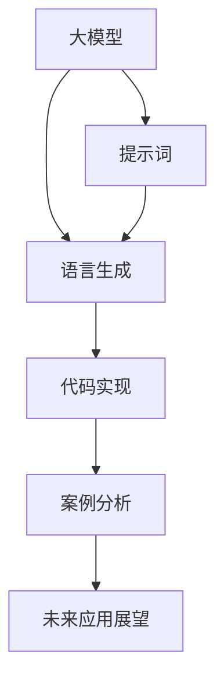

                 

# AI大模型Prompt提示词最佳实践：用简单的英文写文本

> 关键词：Prompt词,大模型,自然语言处理(NLP),语言生成,代码实现,案例分析

## 1. 背景介绍

### 1.1 问题由来

随着深度学习和大模型技术的发展，大模型在自然语言处理(NLP)领域展现出了强大的生成能力和通用性。这些模型通过大量无监督数据的预训练，学习到了丰富的语言知识，并在各种下游任务中表现优异。

然而，预训练模型在应用于特定任务时，往往需要重新训练或微调，才能达到理想的效果。这一过程不仅需要大量的标注数据和计算资源，而且可能存在过拟合和数据稀疏等问题。为了解决这些问题，大模型提示词(Prompt)技术应运而生。提示词是一种通过精心设计的输入文本，引导模型生成期望的输出，从而在不更新模型参数的情况下，实现快速适应新任务的目标。

### 1.2 问题核心关键点

提示词技术在大模型中的应用，是通过在输入文本中加入特定格式的信息，如任务类型、关键词等，以引导模型生成符合要求的输出。这不仅降低了微调模型的成本，还提高了模型的泛化能力和鲁棒性。

提示词的关键点包括：
1. 任务适配：选择适合特定任务的提示词格式。
2. 输入结构：设计合理的输入文本结构，使模型能够准确理解任务需求。
3. 生成效果：优化提示词，提高模型生成文本的质量和相关性。
4. 自动化处理：使用工具和技术简化提示词的生成和处理流程。

### 1.3 问题研究意义

提示词技术为大模型在特定任务上的快速适配提供了新的途径，显著降低了模型训练和微调的复杂度，提高了应用效率和效果。其应用领域包括但不限于以下几个方面：

- 自动摘要：生成简短而精炼的文本摘要。
- 机器翻译：自动翻译文本，支持多语言间的互译。
- 对话系统：构建智能对话机器人，提供自然的对话体验。
- 文本生成：生成各种形式的文本内容，如新闻报道、科技文章等。
- 情感分析：分析文本情感倾向，进行舆情监测和情绪管理。

提示词技术不仅在学术界受到广泛关注，也被广泛应用于工业界，成为推动NLP技术落地的重要手段之一。

## 2. 核心概念与联系

### 2.1 核心概念概述

提示词技术基于大模型的预训练能力，通过在输入中嵌入特定任务的信息，引导模型生成目标输出。其核心概念包括：

- **大模型**：通过大规模无监督数据预训练得到的语言模型，如GPT、BERT等。
- **提示词**：在输入文本中嵌入的任务信息，如任务类型、关键词等。
- **语言生成**：使用大模型生成自然语言文本的能力。
- **代码实现**：将提示词技术应用于实际项目中，包括提示词设计、输入构建、模型调用的全过程。
- **案例分析**：通过具体应用场景的展示，说明提示词技术的实际效果和应用价值。

这些概念之间的逻辑关系可以通过以下Mermaid流程图来展示：



这个流程图展示了提示词技术的基本流程：

1. 大模型通过预训练获得强大的语言表示能力。
2. 提示词在输入文本中嵌入任务信息。
3. 大模型生成符合任务要求的文本。
4. 代码实现将提示词技术应用于具体任务。
5. 案例分析展示提示词技术的应用效果。
6. 未来应用展望探讨提示词技术的更多应用场景。

## 3. 核心算法原理 & 具体操作步骤

### 3.1 算法原理概述

提示词技术的核心思想是利用大模型的语言生成能力，通过输入文本中的信息引导模型生成目标输出。其基本原理如下：

- 选择适合特定任务的提示词格式，如[task, input]，其中task为任务类型，input为输入文本。
- 将提示词与原始文本拼接，形成新的输入。
- 将新的输入输入大模型，生成目标输出。

形式化地，设大模型为 $M_{\theta}$，提示词为 $p$，原始文本为 $x$，则生成过程可以表示为：

$$
\text{output} = M_{\theta}([p, x])
$$

其中，$[p, x]$ 表示将提示词 $p$ 与原始文本 $x$ 拼接形成的输入文本。

### 3.2 算法步骤详解

基于上述原理，提示词技术的操作主要包括以下几个步骤：

**Step 1: 确定提示词格式**
- 根据任务类型选择合适的提示词格式，如任务名、关键词、问题等。
- 确定提示词的插入位置和拼接方式。

**Step 2: 构建输入文本**
- 将提示词与原始文本拼接，形成新的输入文本。
- 对输入文本进行预处理，如分词、去除停用词等。

**Step 3: 生成输出文本**
- 将输入文本输入大模型，生成目标输出。
- 对输出文本进行后处理，如去噪、截断等。

**Step 4: 优化提示词**
- 通过调整提示词的格式和内容，优化生成效果。
- 使用模型评估指标，如BLEU、ROUGE等，评估生成文本的质量和相关性。

**Step 5: 应用提示词技术**
- 将提示词技术应用于具体任务，如文本摘要、机器翻译、对话系统等。
- 根据应用场景，选择合适的大模型和提示词格式。

### 3.3 算法优缺点

提示词技术具有以下优点：
1. 简单高效：提示词技术不需要大量的标注数据和计算资源，可以在短时间内实现快速适配。
2. 泛化能力强：提示词技术可以通过调整提示词格式和内容，适应不同任务的需求。
3. 鲁棒性好：提示词技术适用于各种NLP任务，具有较强的鲁棒性和抗干扰能力。
4. 可解释性强：提示词技术通过输入文本的引导，使得模型的输出更加可解释。

同时，提示词技术也存在一些局限性：
1. 对输入文本的要求高：提示词格式和内容的优化需要丰富的经验和知识。
2. 生成文本质量依赖于提示词质量：提示词设计不当可能导致生成文本质量低下。
3. 难以处理复杂任务：提示词技术在处理复杂任务时，可能需要更多的设计和优化。

### 3.4 算法应用领域

提示词技术在大模型的应用领域非常广泛，涵盖NLP的多个分支。以下是几个典型的应用场景：

- **自动摘要**：通过设计合适的提示词，引导模型生成简短精炼的摘要。
- **机器翻译**：设计问题提示词，自动翻译不同语言的文本。
- **对话系统**：构建智能对话机器人，提供自然流畅的对话体验。
- **文本生成**：生成各种形式的文本内容，如新闻报道、科技文章等。
- **情感分析**：分析文本情感倾向，进行舆情监测和情绪管理。

提示词技术的应用不仅丰富了NLP技术的实现形式，还促进了NLP技术在各个领域的应用，提升了模型的实用性和智能化水平。

## 4. 数学模型和公式 & 详细讲解 & 举例说明

### 4.1 数学模型构建

提示词技术的数学模型构建相对简单，主要涉及提示词设计和模型评估两个部分。

**提示词设计**：
- 设提示词为 $p$，原始文本为 $x$，拼接后的输入文本为 $[x', p]$。
- 设大模型的输出为 $y$，则生成过程可以表示为：
$$
y = M_{\theta}([x', p])
$$

**模型评估**：
- 使用BLEU、ROUGE等指标评估生成文本的质量和相关性。
- 设生成文本为 $y'$，则评估过程可以表示为：
$$
\text{score} = \text{BLEU}(y', y) = \frac{1}{n} \sum_{i=1}^{n} \max(0, \text{BLEU}(y'_i, y_i))
$$

其中，$y_i$ 为原始文本中的第 $i$ 个句子，$y'_i$ 为生成文本中的第 $i$ 个句子。

### 4.2 公式推导过程

设原始文本为 $x$，提示词为 $p$，拼接后的输入文本为 $[x', p]$。生成过程可以表示为：

$$
y = M_{\theta}([x', p])
$$

其中，$M_{\theta}$ 为预训练语言模型，$\theta$ 为模型参数。

假设原始文本长度为 $L_x$，提示词长度为 $L_p$，则拼接后的输入文本长度为 $L_{x'} = L_x + L_p$。

模型输出的概率分布可以表示为：

$$
P(y|[x', p]) = \frac{e^{M_{\theta}([x', p])}}{\sum_{y'} e^{M_{\theta}([x', y'])}}
$$

其中，$M_{\theta}([x', p])$ 为模型在输入文本 $[x', p]$ 上的输出。

生成文本的质量和相关性可以使用BLEU、ROUGE等指标进行评估。以BLEU指标为例，设生成文本为 $y'$，原始文本为 $y$，则：

$$
\text{BLEU}(y', y) = \frac{1}{n} \sum_{i=1}^{n} \max(0, \text{BLEU}(y'_i, y_i))
$$

其中，$n$ 为比较的句子数，$\text{BLEU}(y'_i, y_i)$ 表示生成文本 $y'_i$ 与原始文本 $y_i$ 之间的匹配度。

### 4.3 案例分析与讲解

以自动摘要为例，分析提示词技术的应用。

假设需要为一段新闻文本生成摘要，原始文本为：

```
The World Health Organization (WHO) has announced a new global initiative to combat the spread of the novel coronavirus (COVID-19). The initiative aims to strengthen global cooperation and accelerate the development of vaccines and treatments. The WHO has called on all countries to work together to overcome this global health crisis.
```

可以选择“摘要”作为提示词，拼接后的输入文本为：

```
摘要：The World Health Organization (WHO) has announced a new global initiative to combat the spread of the novel coronavirus (COVID-19). The initiative aims to strengthen global cooperation and accelerate the development of vaccines and treatments. The WHO has called on all countries to work together to overcome this global health crisis.
```

将输入文本输入到预训练的GPT模型中，生成摘要文本。生成过程可以表示为：

$$
y = M_{\theta}([摘要：The World Health Organization (WHO) has announced a new global initiative to combat the spread of the novel coronavirus (COVID-19). The initiative aims to strengthen global cooperation and accelerate the development of vaccines and treatments. The WHO has called on all countries to work together to overcome this global health crisis.])
$$

生成文本的质量和相关性可以使用BLEU指标进行评估。

## 5. 项目实践：代码实例和详细解释说明

### 5.1 开发环境搭建

在进行提示词技术实践前，我们需要准备好开发环境。以下是使用Python进行提示词技术开发的环境配置流程：

1. 安装Anaconda：从官网下载并安装Anaconda，用于创建独立的Python环境。

2. 创建并激活虚拟环境：
```bash
conda create -n prompt-env python=3.8 
conda activate prompt-env
```

3. 安装必要的库：
```bash
pip install transformers sentencepiece sacremoses
```

其中，`transformers`库用于加载预训练语言模型，`sentencepiece`用于分词，`sacremoses`用于处理中文文本。

完成上述步骤后，即可在`prompt-env`环境中开始提示词技术实践。

### 5.2 源代码详细实现

下面我们以使用GPT-3模型生成新闻摘要为例，给出完整的代码实现。

```python
from transformers import pipeline
import sacremoses

# 初始化GPT-3模型
summarizer = pipeline("summarization", model="gpt3", max_length=100, min_length=30)

# 原始文本
text = "The World Health Organization (WHO) has announced a new global initiative to combat the spread of the novel coronavirus (COVID-19). The initiative aims to strengthen global cooperation and accelerate the development of vaccines and treatments. The WHO has called on all countries to work together to overcome this global health crisis."

# 提示词
prompt = "摘要："

# 拼接输入文本
input_text = prompt + text

# 生成摘要
summary = summarizer(input_text)

print(summary[0]["summary_text"])
```

代码解释：

- `transformers`库提供了易于使用的预训练模型和管道，可以方便地加载和应用模型。
- `pipeline`函数用于加载预训练的GPT-3模型，并初始化摘要生成器。
- `sacremoses`库用于中文文本分词，方便处理中文提示词。
- `input_text`变量将提示词与原始文本拼接，形成新的输入文本。
- `summarizer`调用管道进行摘要生成，输出结果包含摘要文本。
- 打印生成的摘要文本。

### 5.3 代码解读与分析

代码实现相对简单，主要包含以下几个步骤：

1. 加载预训练的GPT-3模型。
2. 准备原始文本。
3. 设计提示词。
4. 拼接输入文本。
5. 调用管道进行摘要生成。
6. 输出生成文本。

提示词技术的应用非常灵活，可以根据具体任务调整提示词的设计。在本例中，通过添加“摘要”作为提示词，可以引导模型生成精炼的摘要文本。

## 6. 实际应用场景

### 6.1 智能客服系统

智能客服系统通过自动生成响应文本，提升客户服务效率和体验。提示词技术可以用于对话生成，使系统能够根据用户意图生成符合预期的回答。

具体而言，可以设计问题提示词，引导系统生成针对常见问题的回答。例如：

```
问题：我忘记了我的密码，该怎么办？
回答：请访问我们的帮助页面，根据步骤重置密码。
```

系统通过自动生成类似上述格式的回答，能够快速响应用户的查询，提高服务效率。

### 6.2 金融舆情监测

金融舆情监测需要实时监测市场舆论动向，及时应对负面信息传播。提示词技术可以用于生成实时舆情摘要，帮助分析市场情绪变化。

例如，可以设计“市场分析”作为提示词，生成每日的市场分析报告。例如：

```
市场分析：今日股市表现如何？
摘要：今日股市整体下跌，主要受到……影响。
```

系统通过自动生成市场分析摘要，能够快速获取市场信息，帮助决策者及时调整投资策略。

### 6.3 个性化推荐系统

个性化推荐系统需要根据用户偏好生成推荐内容。提示词技术可以用于生成推荐摘要，提升推荐内容的相关性和多样性。

例如，可以设计“推荐摘要”作为提示词，生成推荐内容摘要。例如：

```
推荐摘要：为您推荐以下商品：
1. 商品A，折扣价……
2. 商品B，热销排行榜……
```

系统通过自动生成推荐摘要，能够快速生成个性化的推荐内容，提高用户满意度。

### 6.4 未来应用展望

随着提示词技术的不断发展，未来将在更多领域得到应用，为各行各业带来变革性影响。

在智慧医疗领域，提示词技术可用于生成医疗问答、病历分析、治疗建议等，提升医疗服务的智能化水平，辅助医生诊疗。

在智能教育领域，提示词技术可用于生成学习材料、作业批改、智能辅导等，因材施教，促进教育公平，提高教学质量。

在智慧城市治理中，提示词技术可用于城市事件监测、舆情分析、应急指挥等环节，提高城市管理的自动化和智能化水平，构建更安全、高效的未来城市。

此外，在企业生产、社会治理、文娱传媒等众多领域，提示词技术也将不断涌现，为传统行业数字化转型升级提供新的技术路径。相信随着技术的日益成熟，提示词技术将成为推动NLP技术落地的重要手段，推动人工智能技术的发展和应用。

## 7. 工具和资源推荐

### 7.1 学习资源推荐

为了帮助开发者系统掌握提示词技术，这里推荐一些优质的学习资源：

1. 《Prompt Engineering for Transformers》系列博文：由大模型技术专家撰写，深入浅出地介绍了提示词技术的基本原理和实际应用。

2. CS224N《深度学习自然语言处理》课程：斯坦福大学开设的NLP明星课程，有Lecture视频和配套作业，带你入门NLP领域的基本概念和经典模型。

3. 《Natural Language Generation with Transformers》书籍：介绍使用Transformers库进行自然语言生成的技术和方法，包括提示词技术在内的诸多范式。

4. HuggingFace官方文档：Transformer库的官方文档，提供了海量预训练模型和完整的提示词样例代码，是上手实践的必备资料。

5. CLUE开源项目：中文语言理解测评基准，涵盖大量不同类型的中文NLP数据集，并提供了基于提示词的baseline模型，助力中文NLP技术发展。

通过对这些资源的学习实践，相信你一定能够快速掌握提示词技术的精髓，并用于解决实际的NLP问题。

### 7.2 开发工具推荐

高效的开发离不开优秀的工具支持。以下是几款用于提示词技术开发的常用工具：

1. PyTorch：基于Python的开源深度学习框架，灵活动态的计算图，适合快速迭代研究。大部分预训练语言模型都有PyTorch版本的实现。

2. TensorFlow：由Google主导开发的开源深度学习框架，生产部署方便，适合大规模工程应用。同样有丰富的预训练语言模型资源。

3. Transformers库：HuggingFace开发的NLP工具库，集成了众多SOTA语言模型，支持PyTorch和TensorFlow，是进行提示词技术开发的利器。

4. Weights & Biases：模型训练的实验跟踪工具，可以记录和可视化模型训练过程中的各项指标，方便对比和调优。与主流深度学习框架无缝集成。

5. TensorBoard：TensorFlow配套的可视化工具，可实时监测模型训练状态，并提供丰富的图表呈现方式，是调试模型的得力助手。

6. Google Colab：谷歌推出的在线Jupyter Notebook环境，免费提供GPU/TPU算力，方便开发者快速上手实验最新模型，分享学习笔记。

合理利用这些工具，可以显著提升提示词技术的开发效率，加快创新迭代的步伐。

### 7.3 相关论文推荐

提示词技术在大模型中的应用源于学界的持续研究。以下是几篇奠基性的相关论文，推荐阅读：

1. Few-shot Learning with Pretrained Checkpoints：提出了在预训练模型上进行少样本学习的技术，通过设计合适的提示词，在少数标注样本上也能取得良好的效果。

2. Adapting GPT-3 to generate news articles: Methodology and evaluation：研究了使用GPT-3生成新闻文章的生成效果，通过调整提示词格式和内容，提升了生成文本的相关性和准确性。

3. Multi-modal Few-shot learning with prompt engineering：探讨了多模态提示词技术，通过结合文本和图像信息，提高了生成效果的多样性和鲁棒性。

4. Prompt Engineering for Generative Pretrained Transformers: Discovering Compound Prompt Phrases for Proxy Datasets：研究了使用提示词技术进行无监督学习的方法，通过设计复合提示词，提高了模型对未标注数据的学习能力。

这些论文代表了大模型提示词技术的发展脉络。通过学习这些前沿成果，可以帮助研究者把握学科前进方向，激发更多的创新灵感。

## 8. 总结：未来发展趋势与挑战

### 8.1 总结

本文对基于提示词技术的大模型应用进行了全面系统的介绍。首先阐述了提示词技术的研究背景和意义，明确了提示词在大模型微调中的独特价值。其次，从原理到实践，详细讲解了提示词技术的数学原理和关键步骤，给出了提示词技术开发的全流程代码实例。同时，本文还广泛探讨了提示词技术在智能客服、金融舆情、个性化推荐等多个行业领域的应用前景，展示了提示词技术的巨大潜力。此外，本文精选了提示词技术的各类学习资源，力求为读者提供全方位的技术指引。

通过本文的系统梳理，可以看到，提示词技术为大模型在特定任务上的快速适配提供了新的途径，显著降低了模型训练和微调的复杂度，提高了应用效率和效果。未来，伴随提示词技术的持续演进，大语言模型微调必将在构建人机协同的智能时代中扮演越来越重要的角色。

### 8.2 未来发展趋势

展望未来，提示词技术将呈现以下几个发展趋势：

1. 技术创新加速：提示词技术将不断融合更多先进的深度学习技术，如因果推理、生成对抗网络等，提升生成文本的质量和多样性。

2. 自动化设计提升：通过引入自动提示词生成工具，如GPT-neo、Promptfuser等，将提示词设计自动化，降低开发门槛。

3. 多模态应用拓展：提示词技术将逐步拓展到图像、语音、视频等多模态数据生成中，实现跨模态交互。

4. 零样本和少样本学习：通过精妙设计的提示词，使模型在不依赖标注样本的情况下，也能生成高质量的输出，提升模型的泛化能力。

5. 通用化提升：提示词技术将在更多领域和任务中得到应用，实现更加通用化的语言生成。

以上趋势凸显了提示词技术的广阔前景。这些方向的探索发展，必将进一步提升大语言模型微调的效果和应用范围，为人类认知智能的进化带来深远影响。

### 8.3 面临的挑战

尽管提示词技术已经取得了瞩目成就，但在迈向更加智能化、普适化应用的过程中，它仍面临着诸多挑战：

1. 提示词设计困难：提示词设计需要丰富的经验和知识，如何设计出高效、通用的提示词，仍然是一个难题。

2. 生成文本质量不稳定：提示词设计不当可能导致生成文本质量低下，甚至出现误导性信息。

3. 计算资源消耗大：大模型的生成过程需要大量的计算资源，如何降低计算成本，提高生成效率，仍然是一个重要的研究方向。

4. 知识整合能力不足：提示词技术在处理复杂任务时，可能需要更多的设计和优化，如何有效整合知识图谱、逻辑规则等专家知识，还有很大的想象空间。

正视提示词技术面临的这些挑战，积极应对并寻求突破，将是大模型提示词技术迈向成熟的必由之路。相信随着学界和产业界的共同努力，这些挑战终将一一被克服，提示词技术必将在构建人机协同的智能时代中扮演越来越重要的角色。

### 8.4 研究展望

面对提示词技术面临的种种挑战，未来的研究需要在以下几个方面寻求新的突破：

1. 探索自动提示词生成方法：引入自动生成工具，通过机器学习模型自动设计高效、通用的提示词。

2. 研究多模态提示词技术：将文本、图像、语音等多种模态信息进行融合，提升生成效果的多样性和鲁棒性。

3. 开发知识整合技术：将符号化的先验知识与神经网络模型进行融合，引导提示词技术学习更准确、合理的语言模型。

4. 引入生成对抗网络(GAN)：通过生成对抗网络技术，提升生成文本的质量和多样性，增强模型的泛化能力。

5. 优化模型结构：通过模型压缩、稀疏化存储等技术，优化提示词技术在大模型中的应用，提升推理速度和资源利用效率。

这些研究方向的探索，必将引领提示词技术迈向更高的台阶，为构建安全、可靠、可解释、可控的智能系统铺平道路。面向未来，提示词技术还需要与其他人工智能技术进行更深入的融合，如知识表示、因果推理、强化学习等，多路径协同发力，共同推动自然语言理解和智能交互系统的进步。只有勇于创新、敢于突破，才能不断拓展语言模型的边界，让智能技术更好地造福人类社会。

## 9. 附录：常见问题与解答

**Q1：提示词技术与微调技术有什么区别？**

A: 提示词技术是一种基于输入文本的引导方法，不更新模型参数，直接使用预训练模型生成目标输出。而微调技术需要更新模型参数，以适应特定的下游任务。

**Q2：提示词技术在处理中文文本时需要注意哪些问题？**

A: 提示词技术在处理中文文本时，需要注意以下几点：
1. 中文分词：使用合适的中文分词工具，如jieba、THULAC等，确保分词的准确性。
2. 中英文混合：提示词设计时，需考虑中英文混合的情况，保持输入格式的一致性。
3. 字符编码：确保中文文本和提示词的字符编码一致，避免编码错误导致的生成文本乱码。

**Q3：提示词技术如何处理长文本？**

A: 提示词技术处理长文本时，需要注意以下几点：
1. 分块处理：将长文本分块处理，每个块单独生成提示词和摘要。
2. 逐步生成：逐步生成提示词和摘要，避免一次性生成过长文本导致的内存不足问题。
3. 去噪处理：对生成的文本进行去噪处理，去除无关信息，提升生成文本的简洁性。

**Q4：提示词技术在多模态数据生成中的应用场景有哪些？**

A: 提示词技术在多模态数据生成中的应用场景包括：
1. 图片生成：通过添加图片描述提示词，生成具有特定语义的图片。
2. 语音生成：通过添加语音提示词，生成符合语义要求的语音内容。
3. 视频生成：通过添加视频描述提示词，生成具有特定情节的视频片段。

提示词技术在多模态数据生成中，可以实现更加丰富、多样化的生成效果，为NLP技术带来更多应用场景。

---

作者：禅与计算机程序设计艺术 / Zen and the Art of Computer Programming

