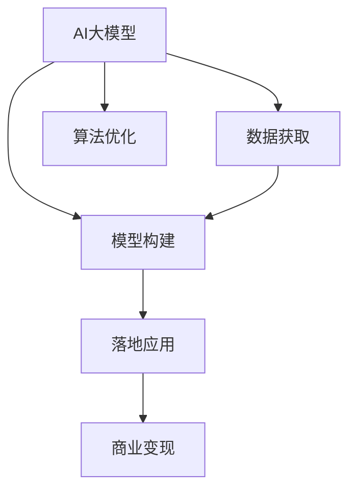

                 

# AI大模型创业：如何实现未来盈利？

在当今数据驱动的互联网时代，AI大模型技术正逐渐成为各个行业竞争的关键。无论是搜索引擎优化、智能推荐、机器人客服，还是医疗诊断、自动驾驶、金融风控等领域，大模型技术都展现出巨大潜力。然而，如何实现AI大模型的商业化，让这些技术真正落地，实现未来盈利，成为众多创业者和企业家的重大挑战。本文将从大模型创业的现状、核心概念与联系、核心算法原理、实际应用场景等多个角度，深入剖析AI大模型创业的关键路径和方法，帮助读者更好地理解这一前沿技术，探索未来盈利模式。

## 1. 背景介绍

### 1.1 问题由来

近年来，随着深度学习和大数据技术的不断发展，AI大模型逐渐成为企业获取竞争优势的重要手段。特别是在NLP、图像处理、推荐系统等领域，大模型表现出色，广泛应用于搜索引擎优化、个性化推荐、机器人客服等业务场景，提升了用户体验，优化了业务流程。然而，随着技术的广泛应用，许多企业开始思考如何通过大模型技术实现盈利，实现技术变现。

尽管大模型技术带来了显著的商业价值，但由于其开发成本高、技术门槛高、数据需求大等问题，普通创业团队和企业难以快速复制和推广。同时，由于大模型训练需要大量计算资源和数据资源，企业往往需要承担高昂的成本，因此如何通过商业化手段回收成本，实现可持续发展，是所有企业面临的共同挑战。

### 1.2 问题核心关键点

大模型创业的关键在于：如何高效构建模型、高效获取数据、高效优化算法、高效推广应用、高效营销变现，最终实现商业盈利。在构建大模型的过程中，需要考虑模型复杂度、数据质量、算法性能、计算资源、落地场景等因素。在推广应用时，需要考虑用户需求、市场竞争、业务场景、合作伙伴等多方面因素。

## 2. 核心概念与联系

### 2.1 核心概念概述

为更好地理解AI大模型创业，本节将介绍几个密切相关的核心概念：

- **AI大模型（AI Large Model）**：以深度神经网络为基础，通过大规模数据集训练得到的大规模参数模型，如BERT、GPT、DALL·E等。大模型通常具有强大的表示能力，能够处理复杂的任务，如图像识别、文本生成、自然语言处理等。

- **模型构建（Model Construction）**：选择合适的模型架构、损失函数、优化算法等，进行模型的构建和训练。大模型的构建过程复杂，涉及数据预处理、模型定义、训练流程、评估指标等多个环节。

- **数据获取（Data Acquisition）**：获取高质量的数据集，是构建高性能大模型的基础。数据集的获取方式包括标注数据集购买、公开数据集下载、数据爬取、数据生成等。

- **算法优化（Algorithm Optimization）**：通过优化算法，提升模型训练速度和性能。常用的优化算法包括Adam、SGD、Adagrad等。

- **落地应用（Application Deployment）**：将训练好的大模型应用到实际业务场景中，通过API接口等方式提供服务，实现商业变现。

- **商业变现（Commercialization）**：通过提供模型API、授权使用、定制化解决方案等方式，将大模型的商业价值变现。

这些核心概念之间的逻辑关系可以通过以下Mermaid流程图来展示：



这个流程图展示了大模型创业的各个环节：

1. 大模型的构建过程。
2. 数据获取，构建模型所需的基础。
3. 算法优化，提升模型训练效率和性能。
4. 模型落地，实现商业化应用。
5. 商业变现，获取收入，实现可持续发展。

这些概念共同构成了AI大模型创业的核心框架，使其能够顺利实施并取得商业成功。

## 3. 核心算法原理 & 具体操作步骤

### 3.1 算法原理概述

AI大模型的商业化变现，本质上是利用大模型的核心技术，通过构建优质的服务，吸引更多的用户和客户，实现盈利。因此，大模型创业的核心在于如何将技术优势转化为商业优势，以下将详细介绍算法原理和具体操作步骤：

- **模型训练与优化**：选择合适的模型架构和算法，通过大规模数据集进行训练，并不断优化模型，提升性能和效率。
- **服务构建与部署**：将训练好的模型封装为API接口，提供给不同的业务场景和用户使用。通过云平台、私有部署等方式实现模型的落地应用。
- **市场推广与营销**：通过市场调研、产品演示、客户反馈等方式，推广大模型的服务和应用场景，吸引潜在用户和客户。
- **收益分析与调整**：通过数据分析、客户反馈等方式，对服务进行持续优化，调整定价策略，实现盈利目标。

### 3.2 算法步骤详解

AI大模型创业的具体操作步骤包括：

1. **需求分析**：明确大模型的商业应用场景，如搜索优化、推荐系统、客服机器人等。
2. **数据准备**：获取和预处理数据集，确保数据集的高质量和多样性。
3. **模型构建**：选择合适的模型架构，如Transformer、BERT等，并使用优化算法进行训练。
4. **服务部署**：将模型封装为API接口，并部署在云平台、服务器或移动设备上。
5. **市场推广**：通过SEO、广告、社交媒体等方式推广服务，吸引用户和客户。
6. **收益分析**：通过数据分析、用户反馈等方式，分析服务效果，优化定价策略，实现盈利目标。

### 3.3 算法优缺点

AI大模型创业具有以下优点：

- **高壁垒**：大模型技术涉及深度学习、计算机视觉、自然语言处理等多个领域，具有较高的技术门槛。
- **高收益**：大模型技术能够带来显著的商业价值，如搜索优化、个性化推荐、自然语言处理等，可以实现较高的盈利。
- **高附加值**：大模型技术可以不断优化和升级，提升服务质量和用户满意度。

同时，AI大模型创业也存在以下缺点：

- **高成本**：大模型的构建和训练需要大量计算资源和数据资源，成本较高。
- **高风险**：大模型技术复杂，容易面临技术风险和数据风险。
- **高竞争**：大模型技术容易复制，市场竞争激烈。

### 3.4 算法应用领域

AI大模型技术已经在多个领域展现出显著的应用价值，以下是几个典型的应用场景：

- **搜索引擎优化（SEO）**：利用大模型进行关键词分析、内容推荐、搜索结果排序等，提升搜索引擎效果。
- **个性化推荐系统**：根据用户行为和偏好，推荐个性化商品或内容，提升用户体验和转化率。
- **自然语言处理（NLP）**：利用大模型进行文本分类、情感分析、命名实体识别等，提升自然语言处理效果。
- **机器人客服**：利用大模型构建聊天机器人，提供24/7全天候服务，提升客户满意度。
- **图像识别**：利用大模型进行图像分类、物体检测、人脸识别等，提升图像识别准确率。

这些应用场景展示了AI大模型技术的广泛应用和巨大商业潜力，未来将有更多领域受益于大模型技术，实现产业升级和创新。

## 4. 数学模型和公式 & 详细讲解 & 举例说明

### 4.1 数学模型构建

在大模型创业过程中，构建高效的数学模型至关重要。以下以推荐系统为例，详细介绍数学模型的构建过程：

1. **用户行为建模**：构建用户行为模型，如用户兴趣模型、行为序列模型等，捕捉用户行为特征。
2. **物品特征建模**：构建物品特征模型，如物品属性模型、物品评分模型等，捕捉物品属性特征。
3. **协同过滤模型**：构建协同过滤模型，如基于用户的协同过滤、基于物品的协同过滤等，捕捉用户和物品之间的关系。
4. **优化目标函数**：构建优化目标函数，如均方误差、交叉熵等，优化模型参数。

### 4.2 公式推导过程

以协同过滤模型为例，推导其优化目标函数：

设用户集合为 $U$，物品集合为 $V$，用户行为矩阵为 $R \in \mathbb{R}^{m \times n}$，其中 $m$ 为用户数，$n$ 为物品数。设用户 $i$ 对物品 $j$ 的评分向量为 $r_{i \cdot}$，物品 $j$ 的属性向量为 $a_j$，用户 $i$ 的兴趣向量为 $u_i$，物品 $j$ 的评分向量为 $t_j$。

协同过滤模型的目标是最小化预测误差，即：

$$
\min_{R, a, t} \frac{1}{2} \sum_{i,j} (R_{i \cdot} u_i^T a_j - t_j)^2
$$

其中 $R_{i \cdot} u_i^T a_j$ 表示用户 $i$ 对物品 $j$ 的预测评分。

### 4.3 案例分析与讲解

以Amazon推荐系统为例，分析其协同过滤模型的构建过程：

1. **用户行为数据**：获取用户行为数据，如点击、浏览、购买等行为。
2. **物品属性数据**：获取物品属性数据，如价格、分类、品牌等属性。
3. **协同过滤模型**：利用协同过滤算法，构建用户兴趣模型和物品属性模型，捕捉用户和物品之间的关系。
4. **推荐算法**：利用协同过滤模型和用户行为数据，计算用户对物品的预测评分，并进行排序推荐。

## 5. 项目实践：代码实例和详细解释说明

### 5.1 开发环境搭建

AI大模型创业需要搭建完善的开发环境，以下是基本搭建流程：

1. **选择平台**：选择合适的开发平台，如AWS、Google Cloud、Azure等，支持模型训练、部署和API接口。
2. **配置资源**：根据项目需求，配置计算资源、存储资源、网络资源等。
3. **安装软件**：安装Python、TensorFlow、PyTorch等软件，并配置好环境变量。

### 5.2 源代码详细实现

以下以推荐系统为例，介绍AI大模型的代码实现：

```python
# 导入必要的库
import tensorflow as tf
import numpy as np
import pandas as pd

# 构建协同过滤模型
class CollaborativeFilteringModel(tf.keras.Model):
    def __init__(self, num_users, num_items, embed_dim):
        super(CollaborativeFilteringModel, self).__init__()
        self.user_embeddings = tf.keras.layers.Embedding(num_users, embed_dim, name='user_embeddings')
        self.item_embeddings = tf.keras.layers.Embedding(num_items, embed_dim, name='item_embeddings')
        self.dot_product = tf.keras.layers.Dot(axes=[1, 1], normalize=True, name='dot_product')
        self.dense = tf.keras.layers.Dense(1, activation='linear', name='dense')
    
    def call(self, inputs):
        user_idx, item_idx = inputs
        user_embeddings = self.user_embeddings(user_idx)
        item_embeddings = self.item_embeddings(item_idx)
        dot_product = self.dot_product([user_embeddings, item_embeddings])
        predictions = self.dense(dot_product)
        return predictions

# 训练协同过滤模型
model = CollaborativeFilteringModel(num_users=1000, num_items=1000, embed_dim=64)
model.compile(optimizer=tf.keras.optimizers.Adam(learning_rate=0.001), loss='mean_squared_error')

# 准备数据
data = pd.read_csv('user_item_data.csv')
user_idx = data['user_id'].values
item_idx = data['item_id'].values
ratings = data['rating'].values

# 训练模型
model.fit([user_idx, item_idx], ratings, epochs=10, batch_size=32)

# 使用模型进行推荐
test_user_idx = np.array([0])
test_item_idx = np.array([0])
test_predictions = model.predict([test_user_idx, test_item_idx])
```

### 5.3 代码解读与分析

以上代码实现了协同过滤模型的基本流程，包括模型构建、数据准备、模型训练和推荐。

1. **模型构建**：定义协同过滤模型，包含用户嵌入层、物品嵌入层和预测层。
2. **数据准备**：从CSV文件中读取用户ID、物品ID和评分数据。
3. **模型训练**：使用Adam优化器和均方误差损失函数训练模型。
4. **推荐系统**：使用训练好的模型对测试用户和物品进行预测，返回推荐评分。

## 6. 实际应用场景

### 6.1 搜索引擎优化

AI大模型在搜索引擎优化（SEO）领域具有显著的应用价值。大模型可以用于关键词分析、内容推荐、搜索结果排序等，提升搜索引擎效果。以下是具体的实施流程：

1. **关键词分析**：利用大模型对用户查询进行分析，识别出相关的关键词和短语。
2. **内容推荐**：根据关键词和用户行为，推荐相关的搜索结果，提升用户体验。
3. **结果排序**：利用大模型对搜索结果进行排序，提升检索效率和准确率。

### 6.2 个性化推荐系统

个性化推荐系统是大模型应用的重要场景。通过大模型，可以实现精准推荐，提升用户满意度。以下是具体的实施流程：

1. **用户行为数据**：获取用户行为数据，如点击、浏览、购买等行为。
2. **物品属性数据**：获取物品属性数据，如价格、分类、品牌等属性。
3. **协同过滤模型**：利用协同过滤算法，构建用户兴趣模型和物品属性模型，捕捉用户和物品之间的关系。
4. **推荐算法**：利用协同过滤模型和用户行为数据，计算用户对物品的预测评分，并进行排序推荐。

### 6.3 自然语言处理

自然语言处理（NLP）是大模型应用的另一重要领域。利用大模型，可以实现文本分类、情感分析、命名实体识别等任务，提升NLP效果。以下是具体的实施流程：

1. **文本数据准备**：获取文本数据，进行分词、去除停用词等预处理。
2. **模型训练**：利用大模型对文本数据进行训练，构建文本分类、情感分析、命名实体识别等模型。
3. **文本分析**：利用训练好的模型对文本进行分类、情感分析和命名实体识别，提升分析效果。

### 6.4 机器人客服

机器人客服是大模型应用的重要场景之一。利用大模型，可以实现24/7全天候服务，提升客户满意度。以下是具体的实施流程：

1. **对话数据准备**：获取对话数据，进行预处理。
2. **模型训练**：利用大模型对对话数据进行训练，构建对话生成模型。
3. **对话生成**：利用训练好的模型生成对话回复，提升客服效率。

## 7. 工具和资源推荐

### 7.1 学习资源推荐

为了帮助开发者掌握AI大模型技术，以下是几个推荐的学习资源：

1. **《深度学习》书籍**：吴恩达等合著，详细讲解深度学习的基本概念和算法。
2. **《TensorFlow官方文档》**：TensorFlow官方文档，提供了丰富的API接口和示例代码。
3. **《PyTorch官方文档》**：PyTorch官方文档，提供了丰富的API接口和示例代码。
4. **《自然语言处理综述》**：斯坦福大学NLP课程，提供了全面的自然语言处理课程和资源。
5. **Kaggle数据集**：Kaggle提供丰富的数据集和竞赛，可以帮助开发者练习和提升技能。

### 7.2 开发工具推荐

以下推荐的开发工具，可以帮助开发者高效地开发AI大模型应用：

1. **Jupyter Notebook**：Jupyter Notebook提供了交互式的编程环境，方便开发者进行模型训练和实验。
2. **AWS SageMaker**：AWS SageMaker提供了云端机器学习平台，支持模型训练、部署和API接口。
3. **Google Cloud AI Platform**：Google Cloud AI Platform提供了云端机器学习平台，支持模型训练、部署和API接口。
4. **Azure Machine Learning**：Azure Machine Learning提供了云端机器学习平台，支持模型训练、部署和API接口。

### 7.3 相关论文推荐

为了深入理解AI大模型技术，以下是几篇推荐的相关论文：

1. **《深度学习》**：Goodfellow等合著，详细讲解深度学习的基本概念和算法。
2. **《大规模深度学习训练：方法、技术及应用》**：Goodfellow等合著，详细讲解大规模深度学习的训练方法和技术。
3. **《基于深度学习的推荐系统》**：Pang等合著，详细讲解基于深度学习的推荐系统。
4. **《大规模协同过滤模型》**：Liu等合著，详细讲解大规模协同过滤模型的构建和优化。

## 8. 总结：未来发展趋势与挑战

### 8.1 研究成果总结

AI大模型技术在多个领域取得了显著的进展，特别是在NLP、推荐系统、搜索引擎优化等领域，展示了巨大的应用潜力和商业价值。未来，随着技术的不断成熟，AI大模型将带来更多的应用场景和商业机会。

### 8.2 未来发展趋势

AI大模型技术的发展趋势包括：

1. **模型规模不断增大**：随着算力成本的下降和数据规模的扩大，大模型的参数量将持续增长，带来更强大的表示能力和应用潜力。
2. **算法优化不断提升**：新的优化算法和技术不断涌现，如自适应优化算法、混合精度训练等，提升了模型训练效率和性能。
3. **应用场景不断扩展**：AI大模型技术将逐步应用到更多领域，如医疗、金融、制造等，带来更广泛的市场需求和商业机会。
4. **商业化模式不断创新**：AI大模型技术将与云计算、人工智能平台等技术结合，形成更丰富的商业化模式，如API接口、SaaS服务等。

### 8.3 面临的挑战

AI大模型技术的发展也面临着诸多挑战，包括：

1. **高成本问题**：大模型的构建和训练需要大量计算资源和数据资源，成本较高。
2. **高风险问题**：大模型技术复杂，容易面临技术风险和数据风险。
3. **高竞争问题**：大模型技术容易复制，市场竞争激烈。
4. **高监管问题**：大模型技术涉及数据隐私、伦理道德等监管问题，需要多方协调和监管。

### 8.4 研究展望

为了克服挑战，推动AI大模型技术的发展，未来的研究方向包括：

1. **优化算法和模型结构**：开发更高效、更稳定的大模型训练和优化算法，提升模型性能和训练效率。
2. **数据资源获取和处理**：探索数据获取和处理的新方法，如数据生成、数据标注等，降低数据获取成本。
3. **多模态信息融合**：将文本、图像、语音等多模态信息进行融合，提升模型的泛化能力和应用范围。
4. **技术规范和伦理道德**：制定技术规范和伦理道德标准，保障数据隐私和模型安全，提升用户信任度。

综上所述，AI大模型技术具有广阔的发展前景和应用潜力。通过不断优化算法、提高数据质量、拓展应用场景、推动商业化进程，将能够实现AI大模型的可持续发展，创造更大的商业价值和社会价值。

---

作者：禅与计算机程序设计艺术 / Zen and the Art of Computer Programming

