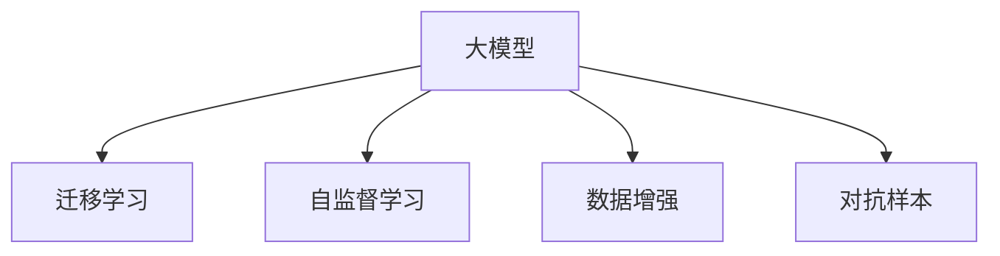

                 

# AI大模型创业：如何应对未来数据挑战？

在大模型、人工智能（AI）与深度学习迅猛发展的时代，如何开发和部署这些技术，为创业公司带来竞争优势？在当前的AI大模型市场，数据成为了创业公司面临的核心挑战之一。本文将深入探讨这一问题，从数据的重要性出发，总结并分享面对未来数据挑战的应对策略与优化方法。

## 1. 背景介绍

### 1.1 数据的重要性
数据是AI大模型的“基石”，其质量与规模直接影响模型性能与应用的可行性。高质量的数据集不仅需要具有广泛的代表性，还需对模型进行充分标注，以便于模型的有效训练与调优。对于AI创业公司来说，获取并高效利用数据，是构建高性能模型的关键步骤。

### 1.2 未来数据挑战
随着AI技术的快速发展，未来数据挑战主要集中在以下几个方面：
1. **数据量的爆发式增长**：随着数据的产生速度不断加快，如何在海量数据中筛选出有价值的数据成为难题。
2. **数据质量的不确定性**：数据中的噪声、缺失值、错误标注等问题会影响模型训练，导致性能下降。
3. **数据隐私与安全**：在收集与处理数据时，如何保护用户隐私，防止数据泄露，成为一大挑战。
4. **多模态数据的融合**：在许多实际应用场景中，数据是多模态的（如图像、文本、音频等），如何将不同类型的数据有效融合，提升模型的整体表现，是一大难点。

## 2. 核心概念与联系

### 2.1 核心概念概述

为了更深入地理解AI大模型与数据挑战，我们需要关注以下几个关键概念：

- **大模型（Large Model）**：即包含大量参数的深度神经网络，用于处理复杂且大规模的数据集，并在特定任务上表现出色。
- **迁移学习（Transfer Learning）**：利用预训练模型在特定任务上进行微调，以提高模型性能。
- **自监督学习（Self-Supervised Learning）**：通过无监督的方式，利用数据自身的特性进行模型训练，以减少对人工标注数据的依赖。
- **数据增强（Data Augmentation）**：通过对原始数据进行变换，生成新的训练样本，以丰富数据集。
- **对抗样本（Adversarial Examples）**：人为构造的误导性样本，用于测试模型的鲁棒性。

### 2.2 核心概念原理和架构的 Mermaid 流程图



## 3. 核心算法原理 & 具体操作步骤

### 3.1 算法原理概述

AI大模型的训练通常依赖于大规模、高质量的数据集。数据的重要性不言而喻，对于创业公司来说，如何高效获取与利用数据，是构建高性能模型的关键。本文将介绍几种重要的数据处理与优化策略。

### 3.2 算法步骤详解

#### 3.2.1 数据收集与预处理

数据收集与预处理是模型训练的基础步骤。具体步骤如下：

1. **数据收集**：从公开数据集、第三方API、众包平台等渠道收集数据。
2. **数据清洗**：去除噪声、缺失值和异常值，确保数据的质量。
3. **数据标注**：对数据进行标注，尤其是对于训练模型时使用的监督学习任务。

#### 3.2.2 数据增强

数据增强是通过对原始数据进行变换，生成新的训练样本，以丰富数据集。常见的方法包括：

1. **图像数据增强**：旋转、翻转、缩放、裁剪等操作，以增加图像数据的多样性。
2. **文本数据增强**：同义词替换、词序打乱、句子扩展等，以增强文本数据的表达能力。

#### 3.2.3 迁移学习

迁移学习通过利用预训练模型在特定任务上进行微调，可以显著提高模型的性能。具体步骤如下：

1. **选择预训练模型**：如BERT、GPT等通用模型，或针对特定领域预训练的模型。
2. **微调参数**：在预训练模型的基础上，利用特定任务的数据集，调整模型参数，提高模型在特定任务上的表现。

#### 3.2.4 对抗样本

对抗样本用于测试模型的鲁棒性，通过构造误导性样本，使模型在面对噪声干扰时仍能准确预测。具体步骤如下：

1. **生成对抗样本**：使用对抗样本生成算法（如FGSM、PGD等），生成误导性样本。
2. **测试模型鲁棒性**：将对抗样本输入模型，评估模型的鲁棒性。

### 3.3 算法优缺点

#### 3.3.1 数据增强的优缺点

**优点**：
1. **增加数据多样性**：通过数据增强，模型能够接触更广泛的数据，提高泛化能力。
2. **减少过拟合**：丰富多样的数据有助于减少模型对训练集的过拟合。

**缺点**：
1. **数据生成成本**：数据增强需要消耗大量计算资源，可能不适合所有场景。
2. **增强数据质量**：增强过程中可能引入新的噪声或错误。

#### 3.3.2 迁移学习的优缺点

**优点**：
1. **快速提高性能**：通过迁移学习，可以利用预训练模型知识，快速提升模型在特定任务上的表现。
2. **减少数据需求**：迁移学习需要少量标注数据，降低数据收集成本。

**缺点**：
1. **模型泛化性**：预训练模型在不同领域和任务上的泛化能力有限。
2. **参数更新**：迁移学习需要对模型参数进行更新，可能引入新的问题。

#### 3.3.3 对抗样本的优缺点

**优点**：
1. **测试鲁棒性**：通过对抗样本测试，可以评估模型的鲁棒性，提高模型的安全性。
2. **提升模型泛化能力**：对抗样本训练可以使模型更好地处理噪声和干扰。

**缺点**：
1. **生成成本高**：对抗样本生成算法复杂，计算资源消耗大。
2. **安全性问题**：对抗样本可能被恶意利用，对模型和系统带来安全风险。

### 3.4 算法应用领域

AI大模型与数据处理技术广泛应用于以下几个领域：

- **自然语言处理（NLP）**：如机器翻译、文本分类、问答系统等。
- **计算机视觉（CV）**：如图像识别、人脸识别、图像分割等。
- **语音识别与处理**：如语音转文本、自动语音识别、语音情感分析等。
- **推荐系统**：如商品推荐、内容推荐等。
- **智能控制**：如智能家居、智能驾驶等。

## 4. 数学模型和公式 & 详细讲解 & 举例说明

### 4.1 数学模型构建

在大模型训练中，数据处理与模型训练的数学模型构建非常重要。本文将介绍一种典型的数学模型，以自然语言处理（NLP）任务为例：

1. **输入层（Input Layer）**：将原始数据转换为模型可以处理的格式，如将文本转换为词向量表示。
2. **隐藏层（Hidden Layer）**：进行特征提取与处理，产生中间表示。
3. **输出层（Output Layer）**：根据任务类型，输出预测结果，如分类任务输出类别概率，回归任务输出预测值。

### 4.2 公式推导过程

假设我们的任务是文本分类，输入为文本序列 $x=(x_1, x_2, ..., x_n)$，输出为类别 $y \in [1, C]$，其中 $C$ 为类别数。我们的目标是最小化交叉熵损失函数：

$$
L = -\frac{1}{N}\sum_{i=1}^N \sum_{j=1}^C y_j\log p_j
$$

其中 $p_j$ 为模型输出第 $j$ 类别的概率。

### 4.3 案例分析与讲解

以BERT模型为例，BERT通过自监督学习方式预训练，利用大规模无标签文本数据进行训练，生成高质量的语言表示。在微调时，可以使用标记好的训练集，调整模型参数，提高模型在特定任务上的表现。

## 5. 项目实践：代码实例和详细解释说明

### 5.1 开发环境搭建

在搭建开发环境前，我们需要准备好所需的软硬件资源。具体步骤如下：

1. **安装Python与相关库**：如TensorFlow、PyTorch、Scikit-learn等。
2. **准备数据集**：收集并标注相关数据集，以备后续模型训练与微调使用。
3. **设置计算环境**：选择合适的计算资源，如CPU、GPU、TPU等。

### 5.2 源代码详细实现

以下是一个简单的代码实例，展示了如何使用TensorFlow实现BERT模型在文本分类任务上的微调：

```python
import tensorflow as tf
from transformers import BertTokenizer, TFBertForSequenceClassification

# 加载BERT模型与分词器
tokenizer = BertTokenizer.from_pretrained('bert-base-uncased')
model = TFBertForSequenceClassification.from_pretrained('bert-base-uncased', num_labels=2)

# 准备数据集
train_data = # 训练集
test_data = # 测试集

# 定义模型结构与损失函数
input_ids = tf.keras.layers.Input(shape=(128,), dtype=tf.int32)
attention_mask = tf.keras.layers.Input(shape=(128,), dtype=tf.int32)
labels = tf.keras.layers.Input(shape=(1,), dtype=tf.int32)

# 模型输出
outputs = model(input_ids, attention_mask=attention_mask, labels=labels)

# 定义损失函数
loss = tf.keras.losses.SparseCategoricalCrossentropy()(labels, outputs)

# 模型编译
model.compile(optimizer=tf.keras.optimizers.Adam(learning_rate=2e-5),
              loss=loss,
              metrics=[tf.keras.metrics.SparseCategoricalAccuracy()])

# 训练模型
model.fit(train_data, epochs=3, batch_size=16, validation_data=test_data)
```

### 5.3 代码解读与分析

上述代码中，我们使用了TensorFlow与BERT模型的结合，展示了模型构建、损失定义、模型编译与训练的全过程。通过这种方式，可以高效地实现模型微调，提升模型在特定任务上的性能。

## 6. 实际应用场景

### 6.1 智能客服系统

智能客服系统在AI大模型的应用中占据重要地位。通过微调BERT模型，可以实现高效、智能的客户服务。具体步骤如下：

1. **数据收集**：收集客户与客服的历史对话记录，标注客户的意图与问题。
2. **数据增强**：对对话数据进行预处理，增强数据多样性。
3. **模型微调**：利用微调技术，训练BERT模型，生成智能客服系统。

### 6.2 金融舆情监测

金融舆情监测是另一个重要的应用场景。利用AI大模型与数据处理技术，可以实现实时、精准的舆情分析与风险预警。具体步骤如下：

1. **数据收集**：收集金融市场的新闻、报道、评论等文本数据。
2. **数据清洗**：去除噪声与错误，确保数据质量。
3. **模型微调**：利用BERT模型，进行情感分析与舆情监测。

### 6.3 推荐系统

推荐系统是AI大模型应用中的一个热门方向。通过微调BERT模型，可以提升推荐系统的精度与效果。具体步骤如下：

1. **数据收集**：收集用户行为数据、商品描述、评论等文本数据。
2. **数据增强**：对数据进行预处理，增强数据多样性。
3. **模型微调**：利用微调技术，训练BERT模型，生成推荐系统。

### 6.4 未来应用展望

未来，随着AI技术的不断发展，AI大模型与数据处理技术将拓展到更多领域。可以预见，AI大模型将在医疗、教育、农业、物流等多个领域发挥重要作用。具体应用场景包括：

1. **医疗诊断**：通过微调BERT模型，实现疾病预测、病历分析等。
2. **教育辅助**：通过微调BERT模型，生成智能教学系统，提供个性化学习建议。
3. **农业管理**：利用AI大模型与数据处理技术，实现智能农业管理与精准农业。
4. **物流配送**：通过微调BERT模型，优化物流配送路径与资源分配。

## 7. 工具和资源推荐

### 7.1 学习资源推荐

为了更好地掌握AI大模型与数据处理技术，以下是一些推荐的学习资源：

1. **《深度学习》（Ian Goodfellow等著）**：系统介绍深度学习的基本概念与算法。
2. **《自然语言处理综论》（Daniel Jurafsky等著）**：涵盖自然语言处理的基本理论与实践。
3. **TensorFlow官方文档**：详细介绍了TensorFlow的各个组件与API。
4. **PyTorch官方文档**：全面介绍了PyTorch的深度学习模型与算法。
5. **Kaggle平台**：提供丰富的数据集与竞赛，助力数据处理与模型训练。

### 7.2 开发工具推荐

以下是一些常用的开发工具，推荐给需要高效实现AI大模型的创业者：

1. **TensorFlow**：开源的深度学习框架，支持多种平台与模型。
2. **PyTorch**：动态计算图的深度学习框架，适合快速原型开发。
3. **Scikit-learn**：机器学习算法库，提供丰富的模型与工具。
4. **Keras**：高层次的神经网络API，简单易用。
5. **Jupyter Notebook**：交互式开发环境，适合快速迭代实验。

### 7.3 相关论文推荐

以下是一些推荐的相关论文，有助于深入理解AI大模型与数据处理技术：

1. **Attention is All You Need**：介绍Transformer架构的基本原理与实现。
2. **BERT: Pre-training of Deep Bidirectional Transformers for Language Understanding**：介绍BERT模型的预训练与微调方法。
3. **ImageNet Classification with Deep Convolutional Neural Networks**：介绍深度卷积神经网络在图像识别中的应用。
4. **Natural Language Processing (almost) from Scratch**：介绍自监督学习在自然语言处理中的应用。
5. **Deep Residual Learning for Image Recognition**：介绍深度残差网络在图像识别中的应用。

## 8. 总结：未来发展趋势与挑战

### 8.1 研究成果总结

本文总结了AI大模型与数据处理技术的现状与未来发展方向。具体来说，数据在AI大模型中的应用尤为重要，高质量的数据集能够显著提升模型性能。此外，数据增强、迁移学习、对抗样本等技术，进一步提升了模型鲁棒性与泛化能力。

### 8.2 未来发展趋势

未来，AI大模型与数据处理技术将呈现以下几个发展趋势：

1. **数据规模的持续增长**：随着数据的生成速度不断加快，未来数据规模将呈现爆发式增长。
2. **数据处理的自动化**：通过自动化数据增强、预处理等技术，降低人工成本，提升数据质量。
3. **数据隐私与安全性**：随着数据应用的广泛化，数据隐私与安全问题将更加重要，亟需进一步解决。
4. **多模态数据的融合**：在实际应用中，多模态数据融合技术将得到进一步发展，提升模型的整体表现。
5. **对抗样本的广泛应用**：通过对抗样本测试，提升模型的鲁棒性与安全性。

### 8.3 面临的挑战

尽管AI大模型与数据处理技术取得了显著进展，但在实际应用中，仍面临一些挑战：

1. **数据获取难度**：高质量的数据集往往难以获得，特别是在特定领域。
2. **数据标注成本**：标注数据需要消耗大量人力与资源，成本较高。
3. **数据隐私问题**：如何保护用户隐私，防止数据泄露，是一大难题。
4. **计算资源消耗**：大规模数据集的处理与模型训练，需要大量的计算资源。

### 8.4 研究展望

面对未来数据处理技术的挑战，需从以下几个方向进行深入研究：

1. **无监督学习与半监督学习**：通过无监督或半监督学习方式，降低对标注数据的需求。
2. **数据增强与数据生成**：开发新的数据增强技术，提升数据质量与多样性。
3. **多模态数据融合**：实现不同类型数据的高效融合，提升模型的整体表现。
4. **对抗样本生成**：开发高效、安全的对抗样本生成算法，提升模型的鲁棒性。

## 9. 附录：常见问题与解答

### Q1: 数据增强对模型训练有何影响？

**A**：数据增强可以有效提升模型的泛化能力，通过生成更多训练样本，减少模型对训练集的过拟合，从而提高模型在测试集上的表现。

### Q2: 如何提高数据隐私与安全性？

**A**：在数据收集与处理过程中，可以采用数据匿名化、加密传输、访问控制等技术，确保用户隐私与数据安全。

### Q3: 如何优化多模态数据融合？

**A**：可以通过特征映射、信息融合等技术，实现不同模态数据的高效融合，提升模型的整体表现。

### Q4: 对抗样本如何生成？

**A**：可以使用生成对抗网络（GAN）、快速梯度符号方法（FGSM）等算法，生成对抗样本，测试模型的鲁棒性。

### Q5: 如何处理无监督学习与半监督学习？

**A**：通过自监督学习方式，利用数据自身的特性进行模型训练，减少对人工标注数据的依赖。

---

作者：禅与计算机程序设计艺术 / Zen and the Art of Computer Programming

