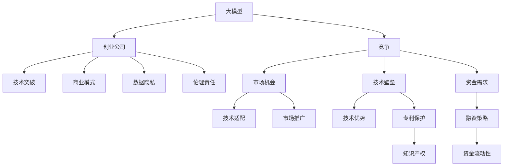

                 

# AI大模型创业：如何应对未来竞争对手？

> 关键词：大模型,创业,竞争,技术突破,商业模式,数据隐私,伦理责任

## 1. 背景介绍

### 1.1 问题由来
随着人工智能技术的飞速发展，大模型已经成为了新一轮科技竞争的焦点。从谷歌的BERT到OpenAI的GPT-3，再到如今的ChatGPT，大模型在自然语言处理、图像识别、语音识别等领域展现出了强大的潜力和能力，吸引了众多创业公司、学术机构和企业投入其中。然而，如何在激烈的市场竞争中保持领先优势，成为当下各大模型开发者共同面临的巨大挑战。

### 1.2 问题核心关键点
在AI大模型的创业过程中，如何应对未来竞争对手，构建可持续发展的竞争力，是创业者和投资者们最关心的问题。本文将从技术、商业模式、数据隐私、伦理责任等多个维度，详细探讨构建强大AI大模型创业公司的关键策略。

## 2. 核心概念与联系

### 2.1 核心概念概述

为更好地理解构建AI大模型创业公司所需的关键要素，本节将介绍几个密切相关的核心概念：

- 大模型(Large Model)：指那些拥有数十亿甚至数百亿参数的深度学习模型，如BERT、GPT-3、DALL·E等。通过大规模预训练和微调，大模型能够进行复杂的推理和生成，广泛应用于自然语言处理、计算机视觉、语音识别等领域。

- 创业公司(Startup)：以创新为核心驱动力的新兴公司，通常在技术、市场、商业模式等方面具有独特优势和竞争力。

- 竞争(Competition)：指同领域内不同公司或组织之间的竞争关系，涉及技术、市场、资金等多个方面。

- 技术突破(Technical Breakthrough)：指通过研发新技术或改进现有技术，使产品或服务在某一技术指标上取得重大进展的行为。

- 商业模式(Business Model)：指公司提供的产品或服务、盈利方式和成本结构，是公司可持续发展的基石。

- 数据隐私(Data Privacy)：指在数据收集、存储、传输、处理过程中，保障个人隐私不受侵害的法律法规和最佳实践。

- 伦理责任(Ethical Responsibility)：指公司在技术开发、产品应用、市场推广等方面应遵循的道德规范和社会责任。

这些核心概念之间的逻辑关系可以通过以下Mermaid流程图来展示：



这个流程图展示了大模型和创业公司、竞争、技术突破、商业模式、数据隐私、伦理责任等核心概念之间的相互联系。

## 3. 核心算法原理 & 具体操作步骤

### 3.1 算法原理概述

在构建AI大模型创业公司的过程中，技术是最核心的要素之一。本文将重点介绍如何通过技术突破，提升模型的性能和可靠性，从而在竞争中占据优势。

AI大模型创业的核心算法原理包括以下几个方面：

- **预训练与微调**：通过在大规模无标签数据上进行预训练，学习通用的语言知识，再通过下游任务的少量标注数据进行微调，提升模型在特定任务上的表现。

- **模型压缩与加速**：通过模型裁剪、量化、剪枝等方法，减少模型参数，提升推理速度和资源利用效率。

- **对抗训练与鲁棒性增强**：通过加入对抗样本训练，提高模型的鲁棒性和泛化能力，抵御对抗攻击和噪声干扰。

- **自监督学习与无监督学习**：通过自监督和无监督学习任务，如语言模型、掩码语言模型等，进一步提升模型的泛化能力和数据利用率。

- **多模态融合与跨领域迁移**：通过结合视觉、语音、文本等多模态信息，实现跨领域的模型迁移和适应能力。

### 3.2 算法步骤详解

构建AI大模型创业公司涉及以下关键步骤：

**Step 1: 选择技术路径**

- 根据业务需求和资源限制，选择合适的预训练模型（如BERT、GPT系列、ViT等），并确定微调任务。

**Step 2: 数据准备**

- 收集高质量的数据集，确保标注数据的多样性和代表性。
- 使用数据增强技术，如回译、翻泽、语料混合等，提升训练数据的多样性。

**Step 3: 模型设计与优化**

- 设计适合任务的模型结构，如Transformer、LSTM等。
- 选择合适的优化算法，如Adam、SGD等，并设置合适的学习率、批大小、迭代轮数等超参数。
- 使用正则化技术，如L2正则、Dropout等，防止过拟合。

**Step 4: 模型训练与评估**

- 在分布式集群上训练模型，利用GPU、TPU等高性能硬件加速。
- 周期性在验证集上评估模型性能，根据性能指标决定是否触发Early Stopping。
- 重复上述步骤直至满足预设的迭代轮数或Early Stopping条件。

**Step 5: 模型部署与优化**

- 将训练好的模型部署到生产环境，如云平台、服务器等。
- 使用模型压缩、量化等技术，减小模型大小，提升推理速度。
- 进行模型性能监控和调优，确保模型在实际应用中稳定运行。

### 3.3 算法优缺点

AI大模型创业公司的技术优势：

- **强大的泛化能力**：大模型通过大规模预训练和微调，能够处理复杂任务，具有较强的泛化能力。
- **高效率的开发**：通过开源工具和技术，可以快速构建和迭代模型，缩短开发周期。
- **广泛的应用场景**：大模型在自然语言处理、计算机视觉、语音识别等多个领域具有广泛的应用前景。

同时，技术也存在一定的局限性：

- **高昂的资源成本**：大模型训练和部署需要大量的计算资源和存储资源，成本较高。
- **对抗攻击的脆弱性**：大模型容易受到对抗攻击，生成模型输出不准确。
- **过拟合风险**：在数据量有限的情况下，大模型容易出现过拟合现象。

### 3.4 算法应用领域

AI大模型创业公司在多个领域都有应用潜力：

- **自然语言处理(NLP)**：如问答系统、文本分类、机器翻译、情感分析等。
- **计算机视觉(CV)**：如图像分类、目标检测、人脸识别等。
- **语音识别(Speech Recognition)**：如自动语音识别、语音合成等。
- **推荐系统(Recommendation System)**：如电商推荐、新闻推荐等。
- **医疗健康(Healthcare)**：如医学影像分析、患者诊断等。
- **金融服务(Financial Services)**：如欺诈检测、信用评分等。

这些领域的大模型应用，能够显著提升相关行业的效率和智能化水平，带来巨大的商业价值。

## 4. 数学模型和公式 & 详细讲解 & 举例说明

### 4.1 数学模型构建

本节将使用数学语言对构建AI大模型创业公司的技术过程进行更加严格的刻画。

记预训练语言模型为 $M_{\theta}$，其中 $\theta$ 为预训练得到的模型参数。假设微调任务的训练集为 $D=\{(x_i,y_i)\}_{i=1}^N$，其中 $x_i$ 为输入，$y_i$ 为输出标签。

定义模型 $M_{\theta}$ 在数据样本 $(x,y)$ 上的损失函数为 $\ell(M_{\theta}(x),y)$，则在数据集 $D$ 上的经验风险为：

$$
\mathcal{L}(\theta) = \frac{1}{N}\sum_{i=1}^N \ell(M_{\theta}(x_i),y_i)
$$

微调的优化目标是最小化经验风险，即找到最优参数：

$$
\theta^* = \mathop{\arg\min}_{\theta} \mathcal{L}(\theta)
$$

在实践中，我们通常使用基于梯度的优化算法（如Adam、SGD等）来近似求解上述最优化问题。设 $\eta$ 为学习率，则参数的更新公式为：

$$
\theta \leftarrow \theta - \eta \nabla_{\theta}\mathcal{L}(\theta)
$$

其中 $\nabla_{\theta}\mathcal{L}(\theta)$ 为损失函数对参数 $\theta$ 的梯度，可通过反向传播算法高效计算。

### 4.2 公式推导过程

以下我们以二分类任务为例，推导交叉熵损失函数及其梯度的计算公式。

假设模型 $M_{\theta}$ 在输入 $x$ 上的输出为 $\hat{y}=M_{\theta}(x) \in [0,1]$，表示样本属于正类的概率。真实标签 $y \in \{0,1\}$。则二分类交叉熵损失函数定义为：

$$
\ell(M_{\theta}(x),y) = -[y\log \hat{y} + (1-y)\log (1-\hat{y})]
$$

将其代入经验风险公式，得：

$$
\mathcal{L}(\theta) = -\frac{1}{N}\sum_{i=1}^N [y_i\log M_{\theta}(x_i)+(1-y_i)\log(1-M_{\theta}(x_i))]
$$

根据链式法则，损失函数对参数 $\theta_k$ 的梯度为：

$$
\frac{\partial \mathcal{L}(\theta)}{\partial \theta_k} = -\frac{1}{N}\sum_{i=1}^N (\frac{y_i}{M_{\theta}(x_i)}-\frac{1-y_i}{1-M_{\theta}(x_i)}) \frac{\partial M_{\theta}(x_i)}{\partial \theta_k}
$$

其中 $\frac{\partial M_{\theta}(x_i)}{\partial \theta_k}$ 可进一步递归展开，利用自动微分技术完成计算。

### 4.3 案例分析与讲解

假设我们正在构建一个用于医疗影像分类的AI大模型创业公司，使用模型 $M_{\theta}$ 进行微调。具体步骤如下：

1. **数据准备**：收集数千张标注有正常和异常类别的医疗影像数据，并进行数据增强，如旋转、缩放、加噪声等。

2. **模型设计与优化**：使用Transformer作为基础模型结构，添加一层线性分类器和交叉熵损失函数。设定学习率为 $2e-5$，批大小为 $16$。

3. **模型训练与评估**：使用4个GPU并行训练模型，每2000批次评估一次模型性能。在 $20$ 个epoch后停止训练，并使用测试集评估模型性能。

4. **模型部署与优化**：将模型导出为ONNX格式，部署到云服务器上。使用混合精度量化技术，将模型压缩为 $30$ MB，提升推理速度。

通过上述步骤，我们构建了一个高效、稳定的医疗影像分类系统，并能够在实际应用中快速响应和准确识别医疗影像。

## 5. 项目实践：代码实例和详细解释说明

### 5.1 开发环境搭建

在进行AI大模型创业公司的技术实现前，我们需要准备好开发环境。以下是使用Python进行PyTorch开发的环境配置流程：

1. 安装Anaconda：从官网下载并安装Anaconda，用于创建独立的Python环境。

2. 创建并激活虚拟环境：
```bash
conda create -n pytorch-env python=3.8 
conda activate pytorch-env
```

3. 安装PyTorch：根据CUDA版本，从官网获取对应的安装命令。例如：
```bash
conda install pytorch torchvision torchaudio cudatoolkit=11.1 -c pytorch -c conda-forge
```

4. 安装Transformer库：
```bash
pip install transformers
```

5. 安装各类工具包：
```bash
pip install numpy pandas scikit-learn matplotlib tqdm jupyter notebook ipython
```

完成上述步骤后，即可在`pytorch-env`环境中开始AI大模型创业公司的技术实现。

### 5.2 源代码详细实现

这里我们以医疗影像分类为例，给出使用Transformers库对BERT模型进行微调的PyTorch代码实现。

首先，定义医疗影像分类任务的数据处理函数：

```python
from transformers import BertTokenizer
from torch.utils.data import Dataset
import torch

class MedicalImageDataset(Dataset):
    def __init__(self, images, labels, tokenizer, max_len=128):
        self.images = images
        self.labels = labels
        self.tokenizer = tokenizer
        self.max_len = max_len
        
    def __len__(self):
        return len(self.images)
    
    def __getitem__(self, item):
        image = self.images[item]
        label = self.labels[item]
        
        encoding = self.tokenizer(image, return_tensors='pt', max_length=self.max_len, padding='max_length', truncation=True)
        input_ids = encoding['input_ids'][0]
        attention_mask = encoding['attention_mask'][0]
        
        # 将标签编码为数字
        label = label2id[label]
        
        return {'input_ids': input_ids, 
                'attention_mask': attention_mask,
                'labels': label}

# 标签与id的映射
label2id = {'normal': 0, 'abnormal': 1}

# 创建dataset
tokenizer = BertTokenizer.from_pretrained('bert-base-cased')

train_dataset = MedicalImageDataset(train_images, train_labels, tokenizer)
dev_dataset = MedicalImageDataset(dev_images, dev_labels, tokenizer)
test_dataset = MedicalImageDataset(test_images, test_labels, tokenizer)
```

然后，定义模型和优化器：

```python
from transformers import BertForTokenClassification, AdamW

model = BertForTokenClassification.from_pretrained('bert-base-cased', num_labels=len(label2id))

optimizer = AdamW(model.parameters(), lr=2e-5)
```

接着，定义训练和评估函数：

```python
from torch.utils.data import DataLoader
from tqdm import tqdm
from sklearn.metrics import classification_report

device = torch.device('cuda') if torch.cuda.is_available() else torch.device('cpu')
model.to(device)

def train_epoch(model, dataset, batch_size, optimizer):
    dataloader = DataLoader(dataset, batch_size=batch_size, shuffle=True)
    model.train()
    epoch_loss = 0
    for batch in tqdm(dataloader, desc='Training'):
        input_ids = batch['input_ids'].to(device)
        attention_mask = batch['attention_mask'].to(device)
        labels = batch['labels'].to(device)
        model.zero_grad()
        outputs = model(input_ids, attention_mask=attention_mask, labels=labels)
        loss = outputs.loss
        epoch_loss += loss.item()
        loss.backward()
        optimizer.step()
    return epoch_loss / len(dataloader)

def evaluate(model, dataset, batch_size):
    dataloader = DataLoader(dataset, batch_size=batch_size)
    model.eval()
    preds, labels = [], []
    with torch.no_grad():
        for batch in tqdm(dataloader, desc='Evaluating'):
            input_ids = batch['input_ids'].to(device)
            attention_mask = batch['attention_mask'].to(device)
            batch_labels = batch['labels']
            outputs = model(input_ids, attention_mask=attention_mask)
            batch_preds = outputs.logits.argmax(dim=2).to('cpu').tolist()
            batch_labels = batch_labels.to('cpu').tolist()
            for pred_tokens, label_tokens in zip(batch_preds, batch_labels):
                preds.append(pred_tokens)
                labels.append(label_tokens)
                
    print(classification_report(labels, preds))
```

最后，启动训练流程并在测试集上评估：

```python
epochs = 5
batch_size = 16

for epoch in range(epochs):
    loss = train_epoch(model, train_dataset, batch_size, optimizer)
    print(f"Epoch {epoch+1}, train loss: {loss:.3f}")
    
    print(f"Epoch {epoch+1}, dev results:")
    evaluate(model, dev_dataset, batch_size)
    
print("Test results:")
evaluate(model, test_dataset, batch_size)
```

以上就是使用PyTorch对BERT进行医疗影像分类任务微调的完整代码实现。可以看到，得益于Transformers库的强大封装，我们可以用相对简洁的代码完成BERT模型的加载和微调。

### 5.3 代码解读与分析

让我们再详细解读一下关键代码的实现细节：

**MedicalImageDataset类**：
- `__init__`方法：初始化医疗影像、标签、分词器等关键组件。
- `__len__`方法：返回数据集的样本数量。
- `__getitem__`方法：对单个样本进行处理，将影像输入编码为token ids，将标签编码为数字，并对其进行定长padding，最终返回模型所需的输入。

**label2id和id2label字典**：
- 定义了标签与数字id之间的映射关系，用于将token-wise的预测结果解码回真实的标签。

**训练和评估函数**：
- 使用PyTorch的DataLoader对数据集进行批次化加载，供模型训练和推理使用。
- 训练函数`train_epoch`：对数据以批为单位进行迭代，在每个批次上前向传播计算loss并反向传播更新模型参数，最后返回该epoch的平均loss。
- 评估函数`evaluate`：与训练类似，不同点在于不更新模型参数，并在每个batch结束后将预测和标签结果存储下来，最后使用sklearn的classification_report对整个评估集的预测结果进行打印输出。

**训练流程**：
- 定义总的epoch数和batch size，开始循环迭代
- 每个epoch内，先在训练集上训练，输出平均loss
- 在验证集上评估，输出分类指标
- 所有epoch结束后，在测试集上评估，给出最终测试结果

可以看到，PyTorch配合Transformers库使得BERT微调的代码实现变得简洁高效。开发者可以将更多精力放在数据处理、模型改进等高层逻辑上，而不必过多关注底层的实现细节。

当然，工业级的系统实现还需考虑更多因素，如模型的保存和部署、超参数的自动搜索、更灵活的任务适配层等。但核心的微调范式基本与此类似。

## 6. 实际应用场景

### 6.1 智能客服系统

基于AI大模型创业公司的对话技术，可以广泛应用于智能客服系统的构建。传统客服往往需要配备大量人力，高峰期响应缓慢，且一致性和专业性难以保证。而使用微调后的对话模型，可以7x24小时不间断服务，快速响应客户咨询，用自然流畅的语言解答各类常见问题。

在技术实现上，可以收集企业内部的历史客服对话记录，将问题和最佳答复构建成监督数据，在此基础上对预训练对话模型进行微调。微调后的对话模型能够自动理解用户意图，匹配最合适的答案模板进行回复。对于客户提出的新问题，还可以接入检索系统实时搜索相关内容，动态组织生成回答。如此构建的智能客服系统，能大幅提升客户咨询体验和问题解决效率。

### 6.2 金融舆情监测

金融机构需要实时监测市场舆论动向，以便及时应对负面信息传播，规避金融风险。传统的人工监测方式成本高、效率低，难以应对网络时代海量信息爆发的挑战。基于AI大模型创业公司的文本分类和情感分析技术，为金融舆情监测提供了新的解决方案。

具体而言，可以收集金融领域相关的新闻、报道、评论等文本数据，并对其进行主题标注和情感标注。在此基础上对预训练语言模型进行微调，使其能够自动判断文本属于何种主题，情感倾向是正面、中性还是负面。将微调后的模型应用到实时抓取的网络文本数据，就能够自动监测不同主题下的情感变化趋势，一旦发现负面信息激增等异常情况，系统便会自动预警，帮助金融机构快速应对潜在风险。

### 6.3 个性化推荐系统

当前的推荐系统往往只依赖用户的历史行为数据进行物品推荐，无法深入理解用户的真实兴趣偏好。基于AI大模型创业公司的个性化推荐系统，可以更好地挖掘用户行为背后的语义信息，从而提供更精准、多样的推荐内容。

在实践中，可以收集用户浏览、点击、评论、分享等行为数据，提取和用户交互的物品标题、描述、标签等文本内容。将文本内容作为模型输入，用户的后续行为（如是否点击、购买等）作为监督信号，在此基础上微调预训练语言模型。微调后的模型能够从文本内容中准确把握用户的兴趣点。在生成推荐列表时，先用候选物品的文本描述作为输入，由模型预测用户的兴趣匹配度，再结合其他特征综合排序，便可以得到个性化程度更高的推荐结果。

### 6.4 未来应用展望

随着AI大模型创业公司的技术不断发展，基于微调范式将在更多领域得到应用，为传统行业带来变革性影响。

在智慧医疗领域，基于微调的医学影像分类、患者诊断等应用将提升医疗服务的智能化水平，辅助医生诊疗，加速新药开发进程。

在智能教育领域，微调技术可应用于作业批改、学情分析、知识推荐等方面，因材施教，促进教育公平，提高教学质量。

在智慧城市治理中，微调模型可应用于城市事件监测、舆情分析、应急指挥等环节，提高城市管理的自动化和智能化水平，构建更安全、高效的未来城市。

此外，在企业生产、社会治理、文娱传媒等众多领域，基于大模型微调的人工智能应用也将不断涌现，为NLP技术带来新的突破。相信随着预训练模型和微调方法的不断进步，基于微调范式必将在构建人机协同的智能时代中扮演越来越重要的角色。

## 7. 工具和资源推荐

### 7.1 学习资源推荐

为了帮助开发者系统掌握AI大模型创业公司的技术基础和实践技巧，这里推荐一些优质的学习资源：

1. 《深度学习》系列课程：斯坦福大学、Coursera等平台提供的深度学习基础课程，涵盖深度学习的基本原理和应用场景。

2. 《Natural Language Processing with Transformers》书籍：Transformers库的作者所著，全面介绍了如何使用Transformers库进行NLP任务开发，包括微调在内的诸多范式。

3. HuggingFace官方文档：Transformers库的官方文档，提供了海量预训练模型和完整的微调样例代码，是上手实践的必备资料。

4. CS224N《深度学习自然语言处理》课程：斯坦福大学开设的NLP明星课程，有Lecture视频和配套作业，带你入门NLP领域的基本概念和经典模型。

5. Kaggle竞赛平台：数据科学竞赛平台，提供大量真实世界的数据集和问题，可进行微调技术实践。

通过对这些资源的学习实践，相信你一定能够快速掌握AI大模型创业公司的技术精髓，并用于解决实际的AI大模型创业问题。

### 7.2 开发工具推荐

高效的开发离不开优秀的工具支持。以下是几款用于AI大模型创业公司开发的常用工具：

1. PyTorch：基于Python的开源深度学习框架，灵活动态的计算图，适合快速迭代研究。大部分预训练语言模型都有PyTorch版本的实现。

2. TensorFlow：由Google主导开发的开源深度学习框架，生产部署方便，适合大规模工程应用。同样有丰富的预训练语言模型资源。

3. Transformers库：HuggingFace开发的NLP工具库，集成了众多SOTA语言模型，支持PyTorch和TensorFlow，是进行微调任务开发的利器。

4. Weights & Biases：模型训练的实验跟踪工具，可以记录和可视化模型训练过程中的各项指标，方便对比和调优。与主流深度学习框架无缝集成。

5. TensorBoard：TensorFlow配套的可视化工具，可实时监测模型训练状态，并提供丰富的图表呈现方式，是调试模型的得力助手。

6. Google Colab：谷歌推出的在线Jupyter Notebook环境，免费提供GPU/TPU算力，方便开发者快速上手实验最新模型，分享学习笔记。

合理利用这些工具，可以显著提升AI大模型创业公司的开发效率，加快创新迭代的步伐。

### 7.3 相关论文推荐

AI大模型创业公司的技术发展源于学界的持续研究。以下是几篇奠基性的相关论文，推荐阅读：

1. Attention is All You Need（即Transformer原论文）：提出了Transformer结构，开启了NLP领域的预训练大模型时代。

2. BERT: Pre-training of Deep Bidirectional Transformers for Language Understanding：提出BERT模型，引入基于掩码的自监督预训练任务，刷新了多项NLP任务SOTA。

3. Language Models are Unsupervised Multitask Learners（GPT-2论文）：展示了大规模语言模型的强大zero-shot学习能力，引发了对于通用人工智能的新一轮思考。

4. Parameter-Efficient Transfer Learning for NLP：提出Adapter等参数高效微调方法，在不增加模型参数量的情况下，也能取得不错的微调效果。

5. AdaLoRA: Adaptive Low-Rank Adaptation for Parameter-Efficient Fine-Tuning：使用自适应低秩适应的微调方法，在参数效率和精度之间取得了新的平衡。

这些论文代表了大模型创业公司的技术发展脉络。通过学习这些前沿成果，可以帮助研究者把握学科前进方向，激发更多的创新灵感。

## 8. 总结：未来发展趋势与挑战

### 8.1 总结

本文对构建AI大模型创业公司的关键技术要素进行了全面系统的介绍。首先阐述了AI大模型创业公司构建的背景和意义，明确了技术突破在构建竞争优势中的核心作用。其次，从原理到实践，详细讲解了AI大模型创业公司的技术实现过程，包括预训练与微调、模型压缩与加速、对抗训练与鲁棒性增强、自监督学习与无监督学习、多模态融合与跨领域迁移等内容。同时，本文还广泛探讨了AI大模型创业公司在多个行业领域的应用前景，展示了其广泛的应用潜力。

通过本文的系统梳理，可以看到，AI大模型创业公司在构建AI大模型过程中，通过技术突破，能够在多个领域提供高效率、高性能的解决方案，带来巨大的商业价值。未来，伴随预训练模型和微调方法的持续演进，AI大模型创业公司必将在构建人机协同的智能时代中扮演越来越重要的角色。

### 8.2 未来发展趋势

展望未来，AI大模型创业公司的技术发展将呈现以下几个趋势：

1. **技术迭代加速**：得益于大数据、高性能算力、强大科研团队的支持，AI大模型创业公司将不断推出更加高效、强大的技术方案。预训练大模型的参数量、训练规模、推理速度等指标将持续提升。

2. **跨领域融合**：未来AI大模型创业公司将更多地探索跨领域融合技术，如多模态融合、知识图谱与语言模型的结合等，实现更加全面、深入的智能理解。

3. **开源与生态建设**：更多的AI大模型创业公司将选择开源路线，通过共享技术、数据、代码等资源，构建完善的生态系统，推动整个AI领域的共同进步。

4. **智能化运营**：AI大模型创业公司将更加重视业务与技术的结合，通过智能化运营，提升用户体验和市场响应速度。

5. **普惠化应用**：AI大模型创业公司将更多地关注普惠化应用，提供成本低、易用的解决方案，使AI技术更好地服务于各行各业，提升社会整体智能化水平。

6. **伦理与隐私保护**：随着AI技术的广泛应用，AI大模型创业公司将更加重视伦理与隐私保护，遵循相关法律法规，构建安全可信的AI生态。

这些趋势凸显了AI大模型创业公司的广阔前景。技术创新、跨领域融合、开源与生态建设、智能化运营、普惠化应用、伦理与隐私保护等方向，将成为未来AI大模型创业公司竞争的核心要素。

### 8.3 面临的挑战

尽管AI大模型创业公司在技术上取得了一系列突破，但在迈向更加智能化、普适化应用的过程中，仍面临诸多挑战：

1. **技术壁垒高**：AI大模型创业公司需要具备强大的技术实力和丰富的数据资源，才能在激烈的竞争中保持领先。技术壁垒的提高，使得新兴公司难以迅速进入市场。

2. **数据隐私与安全**：AI大模型创业公司处理海量数据，需要确保数据隐私和安全。如何在保障数据隐私的前提下，充分利用数据提升模型性能，是一个重要难题。

3. **商业化挑战**：AI大模型创业公司需要将技术转化为实际应用，并实现商业化。如何构建合理的商业模式，获取足够的用户和市场份额，是一个重要的实践挑战。

4. **伦理与责任**：AI大模型创业公司需要承担更多的社会责任，确保其技术应用的伦理性和公平性。如何在技术开发、产品应用、市场推广等方面，遵循伦理导向，是一个重要的道德课题。

5. **资源需求高**：AI大模型创业公司需要大量计算资源和数据资源，在资源配置和成本控制方面，需要寻找平衡点。

6. **持续创新**：AI大模型创业公司需要持续进行技术创新，避免技术落伍和市场饱和，持续提升竞争力和市场份额。

面对这些挑战，AI大模型创业公司需要从技术、市场、伦理等多个维度进行全面布局，才能在激烈的市场竞争中脱颖而出，实现可持续发展。

### 8.4 研究展望

面向未来，AI大模型创业公司需要在以下几个方面进行深入探索：

1. **持续技术创新**：AI大模型创业公司应持续关注前沿技术，如因果推理、跨领域迁移、参数高效微调等，推动技术不断突破。

2. **构建强大生态**：AI大模型创业公司应构建完善的生态系统，包括技术开源、数据共享、社区合作等，推动整个AI领域的共同进步。

3. **重视伦理与隐私保护**：AI大模型创业公司应高度重视伦理与隐私保护，确保技术应用的公平性和透明度。

4. **探索普惠化应用**：AI大模型创业公司应更多关注普惠化应用，提供低成本、易用的解决方案，使AI技术更好地服务于各行各业。

5. **加强智能化运营**：AI大模型创业公司应加强智能化运营，提升用户体验和市场响应速度，构建良性循环的商业生态。

6. **聚焦跨领域融合**：AI大模型创业公司应聚焦跨领域融合技术，如多模态融合、知识图谱与语言模型的结合等，实现更加全面、深入的智能理解。

这些方向的研究探索，必将引领AI大模型创业公司迈向更高的台阶，为构建安全、可靠、可解释、可控的智能系统铺平道路。面向未来，AI大模型创业公司需要从技术、市场、伦理等多个维度进行全面布局，才能在激烈的市场竞争中脱颖而出，实现可持续发展。

## 9. 附录：常见问题与解答

**Q1：AI大模型创业公司的核心竞争力是什么？**

A: AI大模型创业公司的核心竞争力在于强大的技术实力和广泛的数据资源。通过预训练和微调技术，能够提供高性能、高效率的AI解决方案，满足不同领域的需求。同时，强大的技术实力和完善的生态系统，能够使公司保持技术领先，不断推出创新的解决方案。

**Q2：AI大模型创业公司如何应对技术迭代加速的趋势？**

A: AI大模型创业公司应持续进行技术研发和创新，保持技术领先。同时，构建强大的技术团队和高效的研发流程，确保技术迭代的速度和质量。与学术界、科研机构、开源社区等进行紧密合作，获取最新的技术资源和成果。

**Q3：AI大模型创业公司在处理海量数据时，如何保障数据隐私和安全？**

A: AI大模型创业公司应采用先进的数据加密、匿名化、去标识化等技术，确保数据隐私和安全。同时，遵循相关的法律法规和伦理标准，构建透明的数据使用机制和隐私保护措施。

**Q4：AI大模型创业公司如何进行智能化运营？**

A: AI大模型创业公司应构建智能化的运营体系，包括智能客服、智能推荐、智能监控等，提升用户体验和市场响应速度。同时，通过数据分析和反馈机制，持续优化产品和运营策略，实现业务与技术的良性互动。

**Q5：AI大模型创业公司如何应对伦理与责任的挑战？**

A: AI大模型创业公司应高度重视伦理与责任，确保技术应用的公平性和透明度。遵循相关的法律法规和伦理标准，构建透明的数据使用机制和隐私保护措施。同时，建立伦理委员会和合规审核机制，确保技术应用的道德性和合法性。

**Q6：AI大模型创业公司如何在资源有限的情况下，实现高效运营？**

A: AI大模型创业公司应采用高效的资源管理策略，如云资源共享、模型压缩、量化、混合精度训练等，减小资源需求，提升运营效率。同时，通过业务外包、技术合作等方式，降低资源成本，实现可持续运营。

这些回答展示了AI大模型创业公司在不同技术、市场、伦理等方面面临的挑战和解决方案，为未来的技术发展和应用提供了重要的参考。

---

作者：禅与计算机程序设计艺术 / Zen and the Art of Computer Programming

