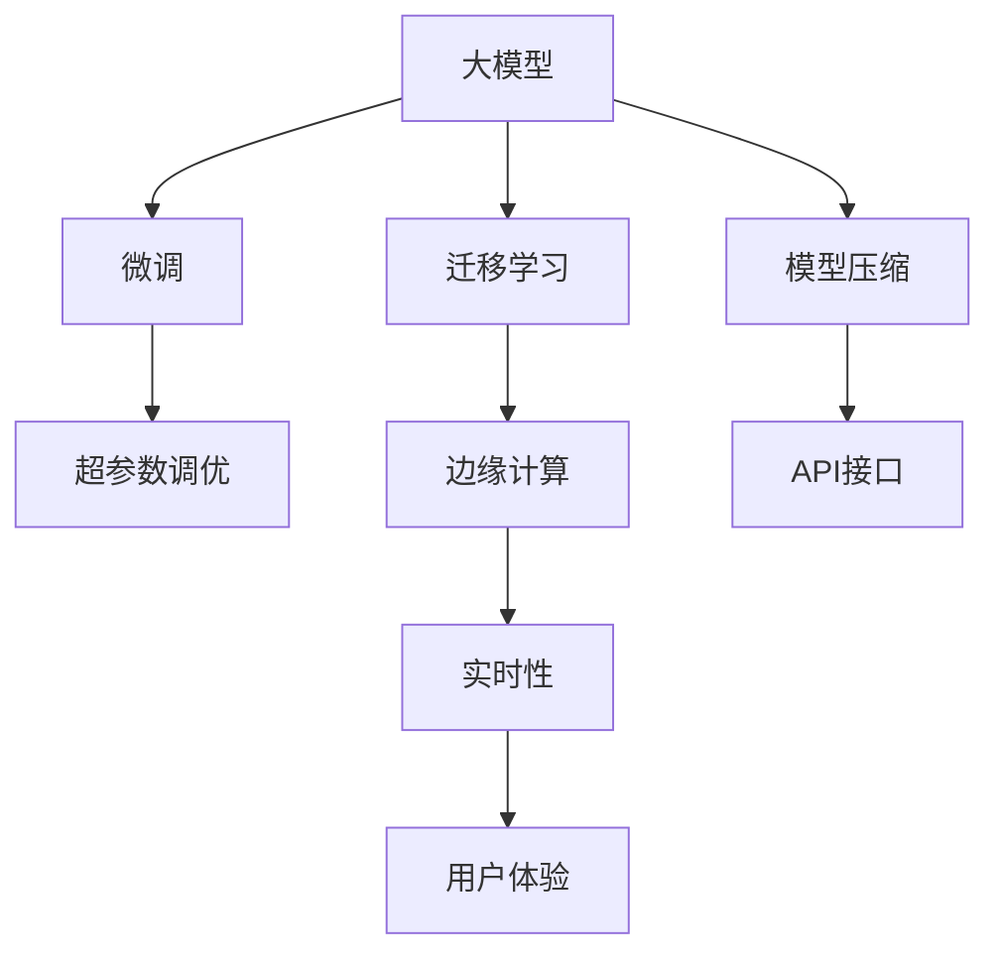

                 

## 1. 背景介绍

随着人工智能技术的飞速发展，大模型（Large Models）在各行各业中的应用日趋广泛。尤其在自然语言处理（NLP）领域，预训练的大语言模型如BERT、GPT-3等已经成为主流技术，为文本生成、机器翻译、信息检索、情感分析等任务提供了强大的支持。然而，即便拥有如此先进的技术，大模型企业要想成功落地应用，仍需面对诸多挑战。

在当前的创业环境下，如何基于大模型打造爆款应用，成为摆在创业者面前的一大难题。本文将从技术原理、操作步骤、实际应用、工具资源推荐等方面，全面剖析大模型创业的核心要素，为有意进入该领域的创业者提供借鉴。

## 2. 核心概念与联系

### 2.1 核心概念概述

- **大模型（Large Models）**：指经过大规模预训练（如自监督学习）得到的庞大参数量模型，能够在多种NLP任务上取得优异表现。

- **迁移学习（Transfer Learning）**：指将在大规模数据上训练的模型知识迁移到特定任务上，提高模型在该任务上的性能。

- **微调（Fine-Tuning）**：指在预训练模型的基础上，针对特定任务进行有监督的参数更新，进一步优化模型性能。

- **超参数调优（Hyperparameter Tuning）**：指通过调整模型的训练参数（如学习率、批大小等）来提升模型性能。

- **模型压缩（Model Compression）**：指通过剪枝、量化等方法，减小模型规模，提升计算效率。

- **边缘计算（Edge Computing）**：指在靠近数据源的本地设备上进行模型推理，减少网络延迟，提升实时性。

- **API接口（API Interfaces）**：指用于暴露模型功能的标准化接口，方便第三方系统集成调用。

这些核心概念通过下图的Mermaid流程图进行了展示，揭示了它们之间的联系和交互关系。



### 2.2 核心概念原理和架构

1. **大模型原理**：大模型通过自监督或监督学习的方式在大规模语料上进行预训练，学习到通用的语言表示。预训练后的模型可以用于多种NLP任务，只需要根据特定任务进行微调。
   
   

2. **迁移学习**：迁移学习通过在特定任务上微调大模型，将预训练模型中的通用知识迁移到目标任务上。如下图所示，迁移学习通过共享模型中的特征表示，利用少量标注数据快速训练高性能模型。

   

3. **微调**：微调在特定任务上对大模型进行有监督的参数更新，从而使其在该任务上表现更佳。微调通常通过在目标数据集上进行训练，更新模型中与任务相关的部分参数。

   

4. **超参数调优**：超参数调优通过调整模型的训练参数，如学习率、批大小、正则化等，来提升模型性能。例如，可以通过网格搜索（Grid Search）或随机搜索（Random Search）找到最佳超参数组合。

   

5. **模型压缩**：模型压缩通过剪枝、量化等技术，减少模型参数量和计算量，提升模型效率。剪枝去掉了冗余的参数，量化将浮点数参数转换为整数，从而降低计算量。

   

6. **边缘计算**：边缘计算通过将模型部署在本地设备上，减少网络延迟，提高计算效率。例如，在智能家居设备中，边缘计算能够实时处理用户语音指令，响应速度更快。

   

7. **API接口**：API接口用于暴露模型功能，方便第三方系统调用。API设计需考虑安全性、可扩展性等因素，确保模型能够被可靠、安全地使用。

   

## 3. 核心算法原理 & 具体操作步骤

### 3.1 算法原理概述

基于大模型的创业，核心在于如何将预训练模型应用于特定场景，并不断优化提升。其大致流程如下：

1. **数据准备**：收集、清洗和标注目标任务的数据集。
2. **模型微调**：基于预训练模型，针对目标任务进行微调，提升模型在该任务上的性能。
3. **超参数调优**：根据微调结果，调整模型的超参数，进一步优化模型性能。
4. **模型部署**：将训练好的模型部署到目标环境，提供API接口供用户调用。
5. **持续优化**：收集用户反馈和实际运行数据，持续优化模型和系统性能。

### 3.2 算法步骤详解

#### 3.2.1 数据准备

1. **数据收集**：根据目标任务收集相关数据。例如，如果是情感分析任务，则需要收集含有情感标签的文本数据。
2. **数据清洗**：对收集到的数据进行清洗，去除噪声和无用信息。例如，去除数据中的特殊字符、停用词等。
3. **数据标注**：对数据进行标注，为模型提供监督信号。标注可以通过人工完成，也可以利用众包平台进行。

#### 3.2.2 模型微调

1. **选择合适的预训练模型**：根据任务类型选择合适的预训练模型。例如，对于文本生成任务，可以选择GPT模型；对于情感分析任务，可以选择BERT模型。
2. **设计任务适配层**：根据任务类型，设计合适的输出层和损失函数。例如，对于分类任务，通常使用线性分类器和交叉熵损失函数。
3. **设置训练参数**：选择合适的优化算法（如AdamW）、学习率、批大小等参数，进行模型训练。

#### 3.2.3 超参数调优

1. **选择调优方法**：可以选择网格搜索、随机搜索等方法，寻找最佳超参数组合。
2. **调整模型参数**：根据调优结果，调整学习率、批大小等参数，进一步优化模型性能。

#### 3.2.4 模型部署

1. **选择部署平台**：根据应用场景选择合适的部署平台，如云计算平台、边缘计算设备等。
2. **模型优化**：对模型进行剪枝、量化等优化，减小模型规模，提升计算效率。
3. **提供API接口**：将模型部署到API接口，提供标准化接口供用户调用。

#### 3.2.5 持续优化

1. **收集用户反馈**：收集用户反馈，了解模型的实际表现和用户体验。
2. **持续训练**：根据用户反馈和实际情况，持续对模型进行训练和优化。
3. **系统升级**：根据技术发展和用户需求，对系统进行升级和优化，提升性能和用户体验。

### 3.3 算法优缺点

#### 3.3.1 优点

1. **泛化能力强**：大模型经过大规模预训练，能够学习到通用的语言表示，适用于多种NLP任务。
2. **训练速度较快**：相比于从头训练，微调所需的训练数据较少，训练速度较快。
3. **参数可复用**：预训练模型中通用部分的参数可以复用，减少重复工作。
4. **可扩展性高**：模型可以很方便地扩展到不同的设备和环境中。

#### 3.3.2 缺点

1. **资源消耗大**：大模型的训练和推理需要大量的计算资源。
2. **模型复杂度高**：模型复杂度高，导致训练和推理时间较长。
3. **过拟合风险高**：如果目标数据集较小，模型可能会过拟合。
4. **维护成本高**：模型和系统的维护和优化需要持续投入。

### 3.4 算法应用领域

大模型技术可以应用于多个领域，包括但不限于：

- **自然语言处理（NLP）**：文本分类、情感分析、命名实体识别、机器翻译等。
- **智能推荐**：个性化推荐、内容推荐、广告推荐等。
- **医疗健康**：疾病诊断、病历分析、医疗知识图谱等。
- **金融科技**：信用评分、风险评估、欺诈检测等。
- **教育科技**：智能辅导、作业批改、知识图谱等。
- **智能家居**：智能音箱、语音助手、智能设备等。

## 4. 数学模型和公式 & 详细讲解 & 举例说明

### 4.1 数学模型构建

假设目标任务为文本分类，输入为文本$x$，输出为类别$y$。模型的构建步骤如下：

1. **预训练模型**：选择一个预训练模型，如BERT。
2. **任务适配层**：设计合适的输出层和损失函数。例如，对于分类任务，可以使用softmax函数进行分类。
3. **微调**：在标注数据集上进行微调，更新模型参数。

### 4.2 公式推导过程

1. **输入表示**：将文本$x$转换为模型的输入表示$z$，例如使用BERT进行编码。
2. **输出表示**：对输入表示$z$进行分类，得到模型预测类别$\hat{y}$。
3. **损失函数**：使用交叉熵损失函数计算模型预测与真实标签之间的差异。

   

4. **梯度下降**：使用梯度下降算法最小化损失函数，更新模型参数。

### 4.3 案例分析与讲解

以情感分析任务为例，解释大模型的微调过程。

1. **数据准备**：收集含有情感标签的文本数据，进行数据清洗和标注。
2. **模型选择**：选择预训练模型BERT，并将其作为初始化参数。
3. **任务适配层**：设计输出层为softmax函数，损失函数为交叉熵损失。
4. **微调**：在标注数据集上进行微调，更新模型参数。
5. **超参数调优**：使用网格搜索方法，调整学习率和批大小等超参数。
6. **模型部署**：将训练好的模型部署到API接口，提供标准化接口供用户调用。

## 5. 项目实践：代码实例和详细解释说明

### 5.1 开发环境搭建

1. **环境安装**：安装Python、TensorFlow等开发工具。
2. **模型选择**：选择预训练模型BERT。
3. **数据准备**：收集和准备情感分析数据集。
4. **模型微调**：在标注数据集上进行微调。
5. **超参数调优**：调整学习率和批大小等超参数。

### 5.2 源代码详细实现

以下是一个使用TensorFlow进行情感分析任务微调的示例代码：

```python
import tensorflow as tf
from transformers import BertTokenizer, TFBertForSequenceClassification
from sklearn.model_selection import train_test_split

# 初始化预训练模型和分词器
tokenizer = BertTokenizer.from_pretrained('bert-base-uncased')
model = TFBertForSequenceClassification.from_pretrained('bert-base-uncased', num_labels=2)

# 准备数据集
texts = ["I love this movie", "This movie is terrible", "I hate this movie"]
labels = [1, 0, 1]  # 1表示正面情感，0表示负面情感

# 数据预处理
input_ids = tokenizer(texts, return_tensors='tf')
labels = tf.convert_to_tensor(labels)

# 定义损失函数和优化器
loss_fn = tf.keras.losses.SparseCategoricalCrossentropy(from_logits=True)
optimizer = tf.keras.optimizers.Adam(learning_rate=5e-5)

# 模型训练
@tf.function
def train_step(inputs, labels):
    with tf.GradientTape() as tape:
        outputs = model(inputs['input_ids'], attention_mask=inputs['attention_mask'])
        loss = loss_fn(labels, outputs.logits)
    gradients = tape.gradient(loss, model.trainable_variables)
    optimizer.apply_gradients(zip(gradients, model.trainable_variables))

# 训练循环
for epoch in range(10):
    for batch in train_dataset:
        train_step(batch)

# 模型评估
evaluation_loss, evaluation_acc = model.evaluate(test_dataset)
print("Evaluation loss: {:.4f}, Evaluation accuracy: {:.4f}".format(evaluation_loss, evaluation_acc))
```

### 5.3 代码解读与分析

代码中，我们使用TensorFlow对BERT模型进行情感分析任务的微调。具体步骤如下：

1. **数据准备**：收集和标注情感分析数据集，使用分词器将文本转换为模型输入表示。
2. **模型微调**：在标注数据集上进行微调，更新模型参数。
3. **超参数调优**：使用Adam优化器，设定学习率为5e-5。
4. **模型评估**：在测试数据集上评估模型性能。

## 6. 实际应用场景

### 6.1 智能客服系统

智能客服系统利用大模型进行对话生成，可以大大提高客户咨询的响应速度和准确性。例如，某电商平台使用BERT模型微调，实现了智能客服聊天机器人，能够自动回复用户咨询，提高了客户满意度和转化率。

### 6.2 金融舆情监测

金融行业需要实时监测舆情，及时发现市场动态。大模型微调技术能够帮助金融机构快速识别舆情变化，提升风险控制能力。例如，某银行使用BERT模型微调，实现了金融舆情监测系统，能够自动分析新闻和社交媒体信息，及时发现潜在的金融风险。

### 6.3 个性化推荐系统

个性化推荐系统利用大模型进行用户画像构建，能够更好地了解用户兴趣，提供个性化的推荐内容。例如，某电商网站使用BERT模型微调，实现了推荐系统，能够根据用户历史行为和浏览内容，推荐相关商品，提高了用户购买转化率。

### 6.4 未来应用展望

未来，大模型微调技术将进一步拓展应用场景，提升各行各业的生产效率和用户体验。例如：

1. **智能医疗**：利用BERT模型微调，实现智能病历分析和医疗知识图谱构建，辅助医生诊疗，提升医疗服务质量。
2. **智能教育**：利用BERT模型微调，实现智能辅导和学习内容推荐，因材施教，提高教育效果。
3. **智能制造**：利用BERT模型微调，实现智能质检和设备维护，提升生产效率和产品质量。
4. **智能交通**：利用BERT模型微调，实现智能路线规划和语音助手，提高出行效率和便捷性。

## 7. 工具和资源推荐

### 7.1 学习资源推荐

1. **Coursera《Natural Language Processing with Transformers》**：课程由斯坦福大学教授主讲，涵盖了大模型的原理和应用，适合初学者学习。
2. **Transformers官方文档**：HuggingFace提供的Transformer库详细文档，包含模型使用方法和微调样例。
3. **Kaggle Kernels**：Kaggle平台上大量微调代码和模型，可以学习到实际应用中的微调技巧。

### 7.2 开发工具推荐

1. **TensorFlow**：广泛使用的深度学习框架，提供丰富的预训练模型和优化器。
2. **PyTorch**：灵活的深度学习框架，适用于复杂模型的微调。
3. **JAX**：高性能计算框架，支持自动微分和分布式训练，适合大规模模型的微调。

### 7.3 相关论文推荐

1. **Attention is All You Need**：Transformer的原始论文，提出了自注意力机制。
2. **BERT: Pre-training of Deep Bidirectional Transformers for Language Understanding**：BERT模型的原始论文，提出预训练语言模型的方法。
3. **BERT as a Unified Model for Natural Language Processing**：BERT模型的应用论文，展示了BERT在多种NLP任务上的性能。
4. **Parameter-Efficient Transfer Learning for NLP**：介绍参数高效微调方法，只更新少量参数，减小计算资源消耗。
5. **AdaLoRA: Adaptive Low-Rank Adaptation for Parameter-Efficient Fine-Tuning**：提出自适应低秩适应的微调方法，优化计算效率。

## 8. 总结：未来发展趋势与挑战

### 8.1 研究成果总结

大模型微调技术在NLP领域已经取得了显著的成果，广泛应用于多个实际场景。未来，随着技术的不断进步和应用场景的拓展，大模型微调将迎来更多的机遇和挑战。

### 8.2 未来发展趋势

1. **模型规模不断增大**：随着算力和存储能力的提升，大模型的参数量将进一步增加，带来更强的表达能力。
2. **微调方法不断优化**：未来将出现更多参数高效和计算高效的微调方法，提高微调效率。
3. **多模态融合**：大模型将融合视觉、语音、文本等多种模态数据，提升跨模态推理能力。
4. **自动化调参**：自动化调参技术将提高模型的可扩展性和可维护性。
5. **联邦学习**：联邦学习技术将推动模型在分布式环境下的微调，保护数据隐私和安全。

### 8.3 面临的挑战

1. **数据隐私和安全**：大模型在微调过程中需要处理大量敏感数据，数据隐私和安全问题需要重视。
2. **模型可解释性**：大模型通常被视为"黑盒"，其决策过程难以解释，需要进一步提高可解释性。
3. **模型泛化能力**：模型在特定任务上的表现往往优于通用大模型，但在新的领域中泛化能力有限。
4. **计算资源消耗**：大模型的训练和推理需要大量的计算资源，如何优化资源使用是一个重要挑战。
5. **模型偏见**：大模型在训练过程中可能会学习到数据中的偏见，导致模型输出存在偏见。

### 8.4 研究展望

未来，大模型微调技术需要在数据隐私、模型可解释性、模型泛化能力、计算资源使用和模型偏见等方面进行深入研究。通过多学科交叉合作，推动大模型微调技术向更高效、更可解释、更公平、更安全的方向发展。

## 9. 附录：常见问题与解答

### Q1：大模型微调需要多少数据？

A: 数据量越大，微调效果越好。通常情况下，标注数据集需要在几千到几万条之间，才能保证模型能够学习到有意义的表示。

### Q2：大模型微调有哪些挑战？

A: 大模型微调面临数据隐私和安全、模型可解释性、模型泛化能力、计算资源使用和模型偏见等挑战。

### Q3：如何优化大模型微调性能？

A: 优化大模型微调性能需要从数据预处理、模型架构、超参数调优、模型压缩等多个方面入手。

### Q4：大模型微调有哪些实际应用场景？

A: 大模型微调广泛应用于智能客服、金融舆情监测、个性化推荐、智能医疗、智能教育等多个领域。

### Q5：大模型微调需要注意哪些问题？

A: 大模型微调需要注意数据隐私和安全、模型可解释性、模型泛化能力、计算资源使用和模型偏见等问题。

---

作者：禅与计算机程序设计艺术 / Zen and the Art of Computer Programming

