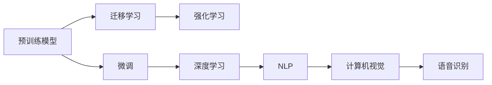

                 

# AI大模型创业：如何抓住未来机遇？

> 关键词：AI大模型, 创业, 深度学习, 自然语言处理, 应用场景, 技术优势, 商业模式, 投资回报

## 1. 背景介绍

在过去几年中，人工智能（AI）领域迎来了快速发展，AI大模型作为其核心技术之一，也逐渐成为热门话题。AI大模型通过大规模数据训练，具备强大的学习和推理能力，可以在诸如自然语言处理（NLP）、计算机视觉、语音识别等多个领域提供高效、智能的解决方案。面对这一蓬勃发展的趋势，越来越多的创业者希望能够在AI大模型领域寻找机会，抓住未来发展的机遇。然而，要想在这片快速发展的市场中脱颖而出，创业者需要对AI大模型的技术原理、应用场景、商业模式以及面临的挑战有深入的了解。

### 1.1 问题由来

AI大模型之所以受到广泛关注，主要有以下几个原因：

1. **强大的学习能力**：通过大规模数据预训练，AI大模型可以学习到丰富的知识，并具备强大的泛化能力，能够在新任务上进行微调，迅速适应新场景。
2. **应用广泛**：从智能客服、医疗诊断、自动驾驶到智能家居，AI大模型已经展现出其在众多领域的潜力，为各行各业带来创新和效率提升。
3. **技术成熟**：经过多年的研究和实践，AI大模型的技术已经趋于成熟，越来越多的开源模型和工具支持，降低了创业者的技术门槛。
4. **市场前景**：随着技术进步和市场需求增长，AI大模型的商业应用前景广阔，吸引了大量资本和人才进入该领域。

### 1.2 问题核心关键点

在AI大模型的创业中，以下几个关键点需要特别关注：

1. **技术选型**：选择合适的AI大模型，并根据具体应用场景进行微调，确保模型能够提供高效、准确的解决方案。
2. **数据获取**：获取高质量、大规模的数据集，这是训练高质量模型的基础。
3. **模型部署**：将训练好的模型部署到实际应用环境中，并实现高效、稳定的推理服务。
4. **用户需求理解**：深入了解目标用户群体的需求，开发出真正满足用户需求的AI应用。
5. **商业模式设计**：构建可行的商业模式，确保AI大模型应用能够实现盈利。
6. **市场推广**：有效推广AI大模型应用，提升市场认知度和用户接受度。
7. **法律合规**：确保AI大模型的应用符合相关法律法规，避免法律风险。

本文将围绕这些核心关键点，对AI大模型的创业进行深入分析，并提出一些实用的建议。

## 2. 核心概念与联系

### 2.1 核心概念概述

在AI大模型的创业过程中，以下几个核心概念是不可或缺的：

1. **AI大模型**：指通过大规模数据预训练得到的、具备强大学习能力的模型，如BERT、GPT-3、DALL·E等。
2. **微调(Fine-Tuning)**：在预训练模型的基础上，使用特定任务的数据集对其进行微调，提升模型在该任务上的表现。
3. **迁移学习(Transfer Learning)**：通过将一个领域的知识迁移到另一个领域，加速新任务的训练过程，提高模型泛化能力。
4. **强化学习(Reinforcement Learning)**：通过与环境交互，模型通过不断试错优化自身策略，适用于需要实时反馈的任务。
5. **深度学习(Deep Learning)**：一种基于神经网络的机器学习技术，能够处理高维、非线性数据。
6. **自然语言处理(NLP)**：通过计算机处理、理解和生成自然语言的技术，包括文本分类、情感分析、机器翻译等任务。
7. **计算机视觉(Computer Vision)**：使计算机能够理解和分析图像和视频内容的技术，如图像识别、物体检测等。
8. **语音识别(Speech Recognition)**：将人类语音转换成计算机可识别的文字或命令，广泛应用于智能助手、语音助手等应用。

### 2.2 核心概念原理和架构的 Mermaid 流程图



## 3. 核心算法原理 & 具体操作步骤

### 3.1 算法原理概述

AI大模型的核心算法原理主要基于深度学习和神经网络，通过大量数据预训练得到具有强大表征能力的模型，然后在特定任务上进行微调，提升模型在该任务上的性能。

AI大模型的预训练过程通常包括以下几个步骤：

1. **数据收集**：收集大量无标签的数据，如大规模文本、图像、音频等。
2. **数据预处理**：对数据进行清洗、归一化等预处理，确保数据质量。
3. **构建模型**：选择合适的深度学习架构，如Transformer、卷积神经网络等，构建预训练模型。
4. **预训练**：使用大规模无标签数据对模型进行预训练，学习通用语言或图像表示。
5. **微调**：在特定任务上使用少量标注数据对模型进行微调，提升模型在该任务上的性能。
6. **评估与优化**：使用验证集和测试集对模型进行评估，不断优化模型参数，直到达到最佳性能。

### 3.2 算法步骤详解

下面详细介绍AI大模型创业中常用的算法步骤：

**Step 1: 选择合适的AI大模型**

在创业初期，选择合适的AI大模型是至关重要的。目前市场上已经有许多成熟的AI大模型，如BERT、GPT-3、DALL·E等。选择合适的模型需要考虑以下几个因素：

- **模型能力**：模型的语言理解、生成能力，以及其在特定任务上的表现。
- **模型大小**：模型参数量、内存占用等，需要根据应用场景和硬件条件进行选择。
- **开源性与社区支持**：模型的开源程度、社区活跃度等，能够快速获取资源和帮助。
- **技术支持与维护**：提供的技术支持和维护服务，确保模型能够长期稳定运行。

**Step 2: 数据准备**

数据准备是AI大模型创业中的关键步骤。高质量、大规模的数据集是训练高质量模型的基础。数据准备包括：

- **数据收集**：从互联网、公开数据集、用户提供等渠道收集数据。
- **数据清洗**：去除噪声数据、处理缺失值等，确保数据质量。
- **数据标注**：对数据进行标注，生成标注数据集。

**Step 3: 模型训练**

模型训练是AI大模型创业中的核心环节。通过预训练和微调，模型能够学习到特定任务的知识，提升性能。模型训练包括：

- **预训练**：使用大规模无标签数据对模型进行预训练，学习通用语言或图像表示。
- **微调**：在特定任务上使用少量标注数据对模型进行微调，提升模型在该任务上的性能。
- **优化**：使用优化器（如Adam、SGD等）和正则化技术（如L2正则、Dropout等）优化模型，防止过拟合。

**Step 4: 模型评估**

模型评估是确保模型性能的重要步骤。通过评估，可以验证模型的效果，发现问题并进行改进。模型评估包括：

- **验证集评估**：在验证集上对模型进行评估，计算损失函数、精度、召回率等指标。
- **测试集评估**：在测试集上对模型进行最终评估，确保模型在新数据上的泛化能力。

**Step 5: 模型部署**

模型部署是AI大模型创业中的最后一步。将训练好的模型部署到实际应用环境中，实现高效、稳定的推理服务。模型部署包括：

- **模型保存**：将训练好的模型保存为文件，便于后续使用。
- **推理引擎**：选择合适的推理引擎，实现高效的推理服务。
- **接口设计**：设计接口，方便外部系统调用模型。
- **性能优化**：对模型进行优化，提高推理速度和效率。

### 3.3 算法优缺点

AI大模型创业中使用的算法具有以下优点：

- **泛化能力强**：通过大规模数据预训练，模型具备强大的泛化能力，能够适应不同任务。
- **灵活性高**：通过微调和迁移学习，模型能够快速适应新任务，灵活性高。
- **易用性高**：许多开源模型和工具支持，降低了创业者的技术门槛。

同时，AI大模型创业中也面临一些挑战：

- **数据获取困难**：高质量、大规模的数据集获取成本高、难度大。
- **计算资源需求高**：AI大模型需要大量的计算资源进行训练和推理，硬件成本高。
- **算法复杂度高**：深度学习和神经网络的算法复杂度高，需要专业团队进行开发和维护。
- **商业应用落地难**：如何将AI大模型应用到实际业务中，实现商业价值，是创业者的主要挑战。

### 3.4 算法应用领域

AI大模型创业涉及的领域非常广泛，以下是几个典型的应用领域：

1. **自然语言处理（NLP）**：文本分类、情感分析、机器翻译、问答系统等。
2. **计算机视觉（CV）**：图像识别、物体检测、人脸识别、图像生成等。
3. **语音识别（SR）**：语音识别、语音合成、语音情感分析等。
4. **智能推荐系统**：个性化推荐、推荐引擎优化等。
5. **医疗健康**：智能诊断、医学影像分析等。
6. **金融科技**：信用评估、风险控制、智能投顾等。
7. **智能制造**：工业质检、智能调度等。
8. **智能家居**：语音助手、智能设备控制等。

## 4. 数学模型和公式 & 详细讲解 & 举例说明

### 4.1 数学模型构建

假设有一个文本分类任务，目标是判断一个文本属于正面或负面的情感。模型的输入是文本$x$，输出是情感标签$y \in \{+1, -1\}$。模型的数学模型如下：

- **输入层**：将文本转换为向量表示，记为$x \in \mathbb{R}^n$。
- **隐藏层**：通过多层神经网络对输入进行编码，记为$h \in \mathbb{R}^m$。
- **输出层**：将隐藏层输出映射到情感标签，记为$s \in \mathbb{R}$。

模型的损失函数为交叉熵损失函数，目标是最小化预测值与真实标签之间的差异：

$$
\mathcal{L}(y, s) = -(y \log s + (1-y) \log(1-s))
$$

### 4.2 公式推导过程

在训练过程中，使用反向传播算法计算损失函数对模型参数的梯度，并使用优化器进行更新。假设模型的参数为$\theta$，则模型参数的更新公式为：

$$
\theta \leftarrow \theta - \eta \nabla_{\theta}\mathcal{L}(\theta)
$$

其中$\eta$为学习率，$\nabla_{\theta}\mathcal{L}(\theta)$为损失函数对模型参数的梯度。通过不断迭代更新参数，模型能够逐步逼近真实标签。

### 4.3 案例分析与讲解

以下是一个简单的文本分类模型案例，使用TensorFlow实现：

```python
import tensorflow as tf

# 定义模型
model = tf.keras.Sequential([
    tf.keras.layers.Embedding(input_dim=10000, output_dim=64),
    tf.keras.layers.LSTM(64),
    tf.keras.layers.Dense(1, activation='sigmoid')
])

# 编译模型
model.compile(optimizer=tf.keras.optimizers.Adam(learning_rate=0.001),
              loss='binary_crossentropy',
              metrics=['accuracy'])

# 训练模型
model.fit(train_x, train_y, epochs=10, batch_size=32, validation_data=(val_x, val_y))

# 评估模型
test_loss, test_acc = model.evaluate(test_x, test_y)
print('Test accuracy:', test_acc)
```

在上述代码中，我们使用了一个简单的LSTM模型进行文本分类。模型输入为词嵌入（Embedding），隐藏层为LSTM，输出层为Sigmoid激活函数。通过Adam优化器和交叉熵损失函数，模型能够在训练集上逐步提升准确率，并在测试集上评估性能。

## 5. 项目实践：代码实例和详细解释说明

### 5.1 开发环境搭建

为了进行AI大模型的创业项目开发，需要搭建一个适合的环境。以下是一个简单的Python开发环境搭建流程：

1. **安装Python**：从官网下载并安装Python，建议使用Anaconda进行环境管理。
2. **安装TensorFlow**：使用pip命令安装TensorFlow和其他依赖库。
3. **配置开发环境**：使用Jupyter Notebook、PyCharm等IDE进行开发。

### 5.2 源代码详细实现

以下是一个简单的图像分类模型的代码实现，使用TensorFlow和Keras实现：

```python
import tensorflow as tf
from tensorflow.keras import layers, models

# 定义模型
model = models.Sequential([
    layers.Conv2D(32, (3, 3), activation='relu', input_shape=(224, 224, 3)),
    layers.MaxPooling2D((2, 2)),
    layers.Conv2D(64, (3, 3), activation='relu'),
    layers.MaxPooling2D((2, 2)),
    layers.Conv2D(128, (3, 3), activation='relu'),
    layers.MaxPooling2D((2, 2)),
    layers.Flatten(),
    layers.Dense(128, activation='relu'),
    layers.Dense(1, activation='sigmoid')
])

# 编译模型
model.compile(optimizer=tf.keras.optimizers.Adam(learning_rate=0.001),
              loss='binary_crossentropy',
              metrics=['accuracy'])

# 训练模型
model.fit(train_x, train_y, epochs=10, batch_size=32, validation_data=(val_x, val_y))

# 评估模型
test_loss, test_acc = model.evaluate(test_x, test_y)
print('Test accuracy:', test_acc)
```

在上述代码中，我们使用了一个简单的卷积神经网络（CNN）模型进行图像分类。模型输入为图像，输出为二分类结果。通过Adam优化器和交叉熵损失函数，模型能够在训练集上逐步提升准确率，并在测试集上评估性能。

### 5.3 代码解读与分析

上述代码实现了图像分类的基本流程，包括模型定义、编译、训练和评估。以下是一些关键点的解读：

- **模型定义**：使用Keras Sequential模型定义多层神经网络，包括卷积层、池化层和全连接层。
- **编译模型**：指定优化器、损失函数和评估指标，编译模型。
- **训练模型**：使用训练集数据训练模型，并使用验证集数据评估模型性能。
- **评估模型**：使用测试集数据评估模型性能，并输出测试准确率。

## 6. 实际应用场景

### 6.1 智能客服系统

AI大模型在智能客服系统中的应用非常广泛。通过微调，模型能够理解用户意图，提供个性化、智能化的服务。以下是一个简单的智能客服系统实现，使用TensorFlow和BERT模型：

```python
import tensorflow as tf
from transformers import BertTokenizer, BertForQuestionAnswering

# 初始化BERT模型
tokenizer = BertTokenizer.from_pretrained('bert-base-cased')
model = BertForQuestionAnswering.from_pretrained('bert-base-cased')

# 预处理输入数据
input_ids = tokenizer.encode(input_text, add_special_tokens=True)
segment_ids = [0] * len(input_ids)

# 进行问答预测
result = model(input_ids=input_ids, attention_mask=segment_ids, start_position=None, end_position=None)
start_position = result.start_logits.argmax()
end_position = result.end_logits.argmax()
answer = tokenizer.decode(input_ids[start_position:end_position + 1], skip_special_tokens=True)

# 输出结果
print('Answer:', answer)
```

在上述代码中，我们使用BERT模型进行问答预测。模型输入为用户的提问，输出为问题的答案。通过微调，模型能够理解用户的意图，并从知识库中检索相关答案，提供智能回复。

### 6.2 金融舆情监测

在金融领域，舆情监测是一个非常重要的任务。通过AI大模型，能够实时监测舆情变化，预测市场趋势，为投资者提供参考。以下是一个简单的金融舆情监测系统实现，使用TensorFlow和BERT模型：

```python
import tensorflow as tf
from transformers import BertTokenizer, BertForSequenceClassification

# 初始化BERT模型
tokenizer = BertTokenizer.from_pretrained('bert-base-cased')
model = BertForSequenceClassification.from_pretrained('bert-base-cased', num_labels=2)

# 预处理输入数据
input_ids = tokenizer.encode(input_text, add_special_tokens=True)
attention_mask = [1] * len(input_ids)

# 进行分类预测
result = model(input_ids=input_ids, attention_mask=attention_mask, labels=label)
probability = result.logits.argmax()
print('Predicted Label:', probability)
```

在上述代码中，我们使用BERT模型进行情感分类。模型输入为文本，输出为正面或负面的情感。通过微调，模型能够学习文本情感，预测舆情变化趋势，为投资者提供参考。

### 6.3 个性化推荐系统

在电商、视频等平台，个性化推荐系统是一个重要应用。通过AI大模型，能够根据用户行为和兴趣，推荐个性化的商品或内容。以下是一个简单的个性化推荐系统实现，使用TensorFlow和TensorBoard：

```python
import tensorflow as tf
from tensorflow.keras.layers import Embedding, Dense

# 定义模型
model = tf.keras.Sequential([
    Embedding(input_dim=10000, output_dim=64),
    Dense(64, activation='relu'),
    Dense(1, activation='sigmoid')
])

# 编译模型
model.compile(optimizer=tf.keras.optimizers.Adam(learning_rate=0.001),
              loss='binary_crossentropy',
              metrics=['accuracy'])

# 训练模型
model.fit(train_x, train_y, epochs=10, batch_size=32, validation_data=(val_x, val_y))

# 评估模型
test_loss, test_acc = model.evaluate(test_x, test_y)
print('Test accuracy:', test_acc)

# 可视化模型性能
tensorboard_callback = tf.keras.callbacks.TensorBoard(log_dir='logs')
model.fit(train_x, train_y, epochs=10, batch_size=32, validation_data=(val_x, val_y), callbacks=[tensorboard_callback])
```

在上述代码中，我们使用一个简单的神经网络模型进行个性化推荐。模型输入为用户行为数据，输出为推荐结果。通过Adam优化器和交叉熵损失函数，模型能够在训练集上逐步提升准确率，并在测试集上评估性能。

## 7. 工具和资源推荐

### 7.1 学习资源推荐

为了帮助创业者深入了解AI大模型的创业，以下是一些优质的学习资源：

1. **《深度学习》课程**：由吴恩达教授开设的深度学习课程，系统介绍了深度学习的基本概念和算法。
2. **《TensorFlow实战》书籍**：由王海峰等作者编写，详细介绍了TensorFlow的使用方法和应用案例。
3. **《自然语言处理》课程**：由斯坦福大学开设的NLP课程，介绍了自然语言处理的基本概念和经典模型。
4. **《计算机视觉》课程**：由斯坦福大学开设的计算机视觉课程，介绍了计算机视觉的基本概念和经典算法。
5. **《强化学习》课程**：由David Silver教授开设的强化学习课程，系统介绍了强化学习的基本概念和算法。

### 7.2 开发工具推荐

以下是在AI大模型创业中常用的开发工具：

1. **PyTorch**：一个灵活的深度学习框架，支持动态计算图，适用于研究和大规模模型开发。
2. **TensorFlow**：一个强大的深度学习框架，支持静态计算图和分布式训练，适用于大规模工程应用。
3. **Keras**：一个高级深度学习框架，易于使用，适用于快速原型开发和模型实验。
4. **Jupyter Notebook**：一个交互式的开发环境，支持Python、R等语言，适用于数据探索和模型实验。
5. **PyCharm**：一个强大的IDE，支持Python、Java等语言，适用于开发和调试。

### 7.3 相关论文推荐

以下是在AI大模型领域具有重要影响的论文：

1. **《Attention is All You Need》**：提出Transformer模型，开启了大模型预训练时代。
2. **《BERT: Pre-training of Deep Bidirectional Transformers for Language Understanding》**：提出BERT模型，引入掩码语言模型任务，刷新了多项NLP任务SOTA。
3. **《GPT-3: Language Models are Unsupervised Multitask Learners》**：提出GPT-3模型，展示了大模型的强大零样本学习能力。
4. **《LoRA: Low-Rank Adaptation of Pretrained Language Models》**：提出LoRA方法，实现了参数高效微调，提高了模型推理效率。
5. **《AdaLoRA: Adaptive Low-Rank Adaptation for Parameter-Efficient Fine-Tuning》**：提出AdaLoRA方法，进一步提高了参数高效微调的效率和效果。

## 8. 总结：未来发展趋势与挑战

### 8.1 研究成果总结

AI大模型的创业已经取得了显著的成果，广泛应用于自然语言处理、计算机视觉、语音识别等多个领域。通过微调和迁移学习，模型能够在特定任务上快速适应，提高性能。同时，AI大模型创业也面临着数据获取、计算资源、算法复杂度等挑战，需要不断优化和改进。

### 8.2 未来发展趋势

未来，AI大模型创业将呈现以下几个发展趋势：

1. **多模态融合**：将视觉、语音、文本等多种模态信息融合，提高模型的综合能力。
2. **联邦学习**：通过分布式计算和隐私保护技术，实现数据隐私保护和模型协同训练。
3. **边缘计算**：将模型部署在边缘设备上，实现低延迟、高带宽的实时推理。
4. **自适应学习**：通过实时数据反馈，实现模型的自适应学习，提高模型的灵活性和鲁棒性。
5. **可解释性**：提高模型的可解释性，增强用户信任和接受度。

### 8.3 面临的挑战

尽管AI大模型创业取得了显著成果，但仍面临以下挑战：

1. **数据隐私和安全**：如何保护用户数据隐私和安全，防止数据泄露和滥用。
2. **计算资源成本**：AI大模型需要大量计算资源，如何降低成本，提高效率。
3. **算法复杂度**：深度学习和神经网络的算法复杂度高，如何简化模型，提高推理速度。
4. **模型泛化能力**：如何提高模型的泛化能力，避免过拟合和灾难性遗忘。

### 8.4 研究展望

未来，AI大模型创业需要在以下几个方面进行深入研究：

1. **数据隐私保护**：开发数据隐私保护技术，实现数据隐私和安全保护。
2. **计算资源优化**：优化计算资源配置，降低成本，提高效率。
3. **算法简化**：简化模型结构，提高推理速度和效率。
4. **模型泛化能力提升**：提高模型的泛化能力，避免过拟合和灾难性遗忘。
5. **可解释性增强**：提高模型的可解释性，增强用户信任和接受度。

## 9. 附录：常见问题与解答

**Q1: AI大模型是否适用于所有NLP任务？**

A: AI大模型在大多数NLP任务上都能取得不错的效果，特别是对于数据量较小的任务。但对于一些特定领域的任务，如医学、法律等，仅仅依靠通用语料预训练的模型可能难以很好地适应。此时需要在特定领域语料上进一步预训练，再进行微调，才能获得理想效果。

**Q2: 如何选择合适的AI大模型？**

A: 选择合适的AI大模型需要考虑以下几个因素：模型能力、模型大小、开源性与社区支持、技术支持与维护。

**Q3: 如何进行有效的数据预处理？**

A: 数据预处理包括数据收集、数据清洗、数据标注等步骤。高质量、大规模的数据集是训练高质量模型的基础。

**Q4: 如何降低AI大模型的计算资源需求？**

A: 通过优化模型结构、采用分布式训练、使用量化加速等技术，降低AI大模型的计算资源需求。

**Q5: 如何提高AI大模型的泛化能力？**

A: 通过更多的数据训练、使用正则化技术、引入对比学习等方法，提高AI大模型的泛化能力。

总之，AI大模型创业是一个充满挑战和机遇的领域。通过深入理解技术原理、选择合适的模型和工具、不断优化模型和算法，相信创业者能够在这一领域取得成功，为AI大模型应用带来新的突破和创新。

---

作者：禅与计算机程序设计艺术 / Zen and the Art of Computer Programming

