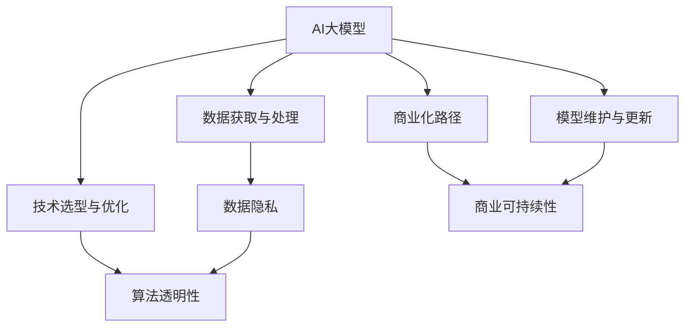

                 

# AI大模型创业：如何构建未来可持续的商业模式？

> 关键词：AI大模型,创业,商业模式,可持续性,商业化路径,数据伦理,用户隐私保护

## 1. 背景介绍

在人工智能技术迅猛发展的今天，AI大模型正成为各领域智能化转型的关键工具。从自然语言处理到计算机视觉，从医疗诊断到金融风控，大模型已经展示了其强大的应用潜力。然而，如何构建基于AI大模型的可持续商业模式，将先进的AI技术转化为商业价值，成为了众多创业公司面临的共同挑战。

### 1.1 问题由来
AI大模型的应用虽然前景广阔，但其商业模式的设计却非易事。由于其技术复杂、开发成本高，且需要庞大的数据集和计算资源支持，许多创业公司难以在短时间内快速复制成功。同时，大模型在数据隐私、算法透明性和伦理责任等方面也面临诸多挑战。如何平衡技术创新与商业模式可持续性，成为了当下AI创业领域的热点话题。

### 1.2 问题核心关键点
1. **数据获取与处理**：高质量数据集是大模型训练的基石。如何高效获取、处理和保护数据，是构建AI大模型商业模式的首要难题。
2. **技术选型与优化**：大模型的技术实现复杂，如何选择合适的技术框架和优化算法，是决定模型性能和可扩展性的关键。
3. **商业变现路径**：如何将AI大模型商业化，实现收入增长和成本控制，是创业公司需要解决的核心问题。
4. **数据隐私与伦理**：如何保证用户数据隐私和算法透明性，避免伦理风险，是保障企业长期发展的必要措施。

## 2. 核心概念与联系

### 2.1 核心概念概述

为了深入理解如何构建基于AI大模型的可持续商业模式，本文将介绍几个核心概念：

- **AI大模型**：指使用深度学习模型，在大规模数据集上进行预训练，并针对特定任务进行微调的大型语言模型或视觉模型。例如GPT-3、BERT等。
- **商业化路径**：指将AI大模型转化为产品或服务，创造商业价值的过程，包括但不限于API服务、行业应用定制、智能设备集成等。
- **数据隐私**：指保护用户数据不受未授权访问、使用和泄露，确保用户信息安全。
- **算法透明性**：指AI模型的决策过程可被理解和解释，避免"黑盒"问题。
- **商业可持续性**：指企业在追求商业利润的同时，能够实现长期发展和良性循环。

这些概念之间存在紧密联系，共同构成了构建AI大模型商业模式的框架。

### 2.2 核心概念原理和架构的 Mermaid 流程图



这个流程图展示了AI大模型商业模式的核心概念及其相互关系：

1. AI大模型的构建依赖于高质量的数据集，同时需要不断优化技术框架。
2. 数据隐私和算法透明性是大模型商业模式的基础保障。
3. 商业化路径将AI大模型转化为实际应用，创造商业价值。
4. 商业可持续性是整个商业模式的核心目标，需要通过合理的商业模式设计实现。
5. 模型维护与更新是保证商业可持续性的关键，需要持续投入资源进行模型优化。

## 3. 核心算法原理 & 具体操作步骤

### 3.1 算法原理概述

构建基于AI大模型的商业模式，其核心在于如何将模型转化为可商业化的产品或服务。这不仅需要高质量的数据和先进的算法，还需要系统的商业化策略和合理的成本控制。

### 3.2 算法步骤详解

1. **数据获取与处理**：
   - **数据来源**：从公共数据集（如ImageNet、Wikipedia等）或合作伙伴（如医疗机构、电商平台等）获取数据。
   - **数据清洗**：对获取的数据进行去重、清洗、标注等预处理，确保数据质量。
   - **数据隐私保护**：采用数据匿名化、加密等技术，确保数据在存储和传输过程中的安全性。

2. **技术选型与优化**：
   - **框架选择**：选择TensorFlow、PyTorch等主流深度学习框架，根据需求进行模型构建和优化。
   - **算法优化**：采用GPU加速、分布式训练、模型压缩等技术，提升模型性能和训练效率。

3. **商业化路径设计**：
   - **API服务**：将模型封装为API接口，供开发者调用，提供模型预测服务。
   - **行业应用定制**：针对特定行业需求，定制化开发行业应用，如医疗影像分析、金融风险评估等。
   - **智能设备集成**：将大模型嵌入智能设备，如智能音箱、自动驾驶车辆等，实现实时响应和决策。

4. **商业可持续性考量**：
   - **收入模式**：采用订阅模式、按需服务模式、定制服务模式等多元化的收入方式。
   - **成本控制**：优化运营成本，如降低硬件成本、提高模型复用性、优化服务流程等。
   - **长期规划**：制定长期发展战略，确保企业持续成长和盈利。

### 3.3 算法优缺点

构建基于AI大模型的商业模式，具有以下优点：

1. **高效性**：AI大模型能够在短时间内处理大量数据，提升决策效率。
2. **准确性**：通过深度学习算法训练，模型能够提供高精度的预测和分析结果。
3. **可扩展性**：大模型可以针对不同行业和任务进行微调，具有广泛的应用前景。

同时，也存在以下缺点：

1. **高成本**：初始数据收集、模型训练和维护成本较高，中小企业难以负担。
2. **技术门槛高**：需要专业的AI团队和数据科学家，对技术要求较高。
3. **隐私风险**：数据隐私保护压力大，需采取严格措施。

### 3.4 算法应用领域

基于AI大模型的商业模式，已成功应用于以下几个领域：

- **医疗健康**：利用大模型进行医学影像分析、疾病诊断、个性化治疗等，提高医疗服务效率和质量。
- **金融服务**：应用于信用评分、风险评估、欺诈检测等领域，提升金融风险管理能力。
- **零售电商**：通过推荐系统、价格优化、库存管理等，提升零售商的客户体验和运营效率。
- **智能制造**：应用于设备预测维护、生产过程优化、质量控制等领域，提升制造业的智能化水平。
- **智能客服**：通过自然语言处理和对话系统，提供7x24小时无间断的客户服务，提升客户满意度。

## 4. 数学模型和公式 & 详细讲解 & 举例说明

### 4.1 数学模型构建

构建基于AI大模型的商业模式，其数学模型主要涉及数据预处理、模型训练和商业化服务等方面。

### 4.2 公式推导过程

以推荐系统为例，其推荐算法可以表示为：

$$
y = f(x; \theta)
$$

其中，$x$ 为用户的历史行为数据，$\theta$ 为模型参数，$f(\cdot)$ 为推荐函数。

### 4.3 案例分析与讲解

假设我们有一个电商平台的推荐系统，采用深度学习模型进行推荐。其推荐算法可以表示为：

1. **数据预处理**：收集用户的历史浏览、购买、评价等行为数据，进行清洗和标注。
2. **模型训练**：使用深度学习模型（如CNN、RNN等），在大规模数据集上进行训练，优化模型参数$\theta$。
3. **商业化服务**：将训练好的模型封装为API服务，提供推荐结果，并根据用户反馈不断优化模型。

## 5. 项目实践：代码实例和详细解释说明

### 5.1 开发环境搭建

- **环境准备**：安装Python、PyTorch、TensorFlow等深度学习框架。
- **数据准备**：收集并清洗推荐系统的用户行为数据，进行标注。
- **模型搭建**：使用PyTorch搭建推荐模型，并进行训练。
- **服务部署**：将训练好的模型部署为API服务，提供推荐结果。

### 5.2 源代码详细实现

```python
import torch
import torch.nn as nn
import torch.optim as optim

# 定义推荐模型
class RecommendationModel(nn.Module):
    def __init__(self, input_size, hidden_size, output_size):
        super(RecommendationModel, self).__init__()
        self.hidden = nn.Linear(input_size, hidden_size)
        self.output = nn.Linear(hidden_size, output_size)

    def forward(self, x):
        x = torch.relu(self.hidden(x))
        x = self.output(x)
        return x

# 加载数据
def load_data():
    # 此处省略数据加载代码
    pass

# 训练模型
def train_model(model, optimizer, criterion, train_loader, device):
    model.train()
    for data, target in train_loader:
        data, target = data.to(device), target.to(device)
        optimizer.zero_grad()
        output = model(data)
        loss = criterion(output, target)
        loss.backward()
        optimizer.step()

# 测试模型
def test_model(model, criterion, test_loader, device):
    model.eval()
    with torch.no_grad():
        correct = 0
        total = 0
        for data, target in test_loader:
            data, target = data.to(device), target.to(device)
            output = model(data)
            _, predicted = torch.max(output.data, 1)
            total += target.size(0)
            correct += (predicted == target).sum().item()
        print('Accuracy: {:.2f} %'.format(100 * correct / total))

# 部署模型
def deploy_model(model, serving_port):
    # 此处省略模型部署代码
    pass
```

### 5.3 代码解读与分析

- **模型定义**：定义了一个简单的推荐模型，包含两个线性层和一个ReLU激活函数。
- **数据加载**：实现了数据加载函数，将用户行为数据转换为模型训练所需的格式。
- **模型训练**：使用PyTorch训练模型，采用Adam优化器进行参数优化，交叉熵损失函数作为评价标准。
- **模型测试**：在测试集上评估模型性能，输出准确率。
- **模型部署**：使用Flask等框架将模型封装为API服务，提供推荐接口。

## 6. 实际应用场景

### 6.1 智能客服系统

智能客服系统通过自然语言处理和对话系统，提供7x24小时无间断的客户服务。利用AI大模型进行意图识别和对话生成，可以大幅提升客户体验和问题解决效率。

### 6.2 金融舆情监测

金融机构需要实时监测市场舆论动向，以便及时应对负面信息传播，规避金融风险。利用AI大模型进行情感分析和文本分类，能够自动识别负面舆情，快速响应风险。

### 6.3 个性化推荐系统

个性化推荐系统通过推荐算法，提高客户体验和运营效率。利用AI大模型进行用户行为分析，生成个性化的推荐内容，可以提升用户的满意度和转化率。

### 6.4 未来应用展望

随着AI大模型的不断进步，未来将在更多领域得到应用，为传统行业带来变革性影响。

- **智慧医疗**：利用大模型进行医学影像分析、疾病诊断、个性化治疗等，提高医疗服务效率和质量。
- **智能制造**：应用于设备预测维护、生产过程优化、质量控制等领域，提升制造业的智能化水平。
- **智能家居**：通过语音识别和对话系统，提升家居设备的智能化和人性化。
- **智慧城市**：应用于城市交通管理、公共安全、环境监测等领域，提高城市管理的智能化水平。

## 7. 工具和资源推荐

### 7.1 学习资源推荐

1. **《Deep Learning with PyTorch》**：是一本系统介绍PyTorch深度学习框架的书籍，适合初学者学习。
2. **《TensorFlow官方文档》**：提供了TensorFlow的详细教程和示例，适合进阶学习。
3. **《自然语言处理综述》**：介绍了自然语言处理的基础知识和前沿技术，适合深入学习。
4. **《推荐系统实践》**：讲解了推荐系统的设计、实现和优化，适合实际应用。
5. **Kaggle竞赛平台**：提供了大量数据集和竞赛项目，适合实践和创新。

### 7.2 开发工具推荐

1. **PyTorch**：基于Python的深度学习框架，灵活易用，适用于复杂模型的开发。
2. **TensorFlow**：由Google主导开发的深度学习框架，生产部署方便，适用于大规模工程应用。
3. **Jupyter Notebook**：开源的交互式笔记本，支持Python代码编写和可视化展示。
4. **Flask**：轻量级的Web框架，适合快速搭建API服务。
5. **Docker**：容器化技术，方便模型的部署和管理。

### 7.3 相关论文推荐

1. **《Attention is All You Need》**：Transformer模型的原论文，奠定了自注意力机制在NLP中的基础。
2. **《BERT: Pre-training of Deep Bidirectional Transformers for Language Understanding》**：介绍了BERT模型及其预训练方法，提升了NLP任务的性能。
3. **《GPT-3: Language Models are Unsupervised Multitask Learners》**：展示了GPT-3的强大zero-shot学习能力，推动了通用AI的发展。
4. **《Parameter-Efficient Transfer Learning for NLP》**：提出了Adapter等参数高效微调方法，提升了模型的泛化性和可扩展性。
5. **《AdaLoRA: Adaptive Low-Rank Adaptation for Parameter-Efficient Fine-Tuning》**：使用自适应低秩适应的微调方法，提升了模型效率和性能。

## 8. 总结：未来发展趋势与挑战

### 8.1 总结

本文对构建基于AI大模型的商业模式进行了全面系统的介绍。首先阐述了AI大模型的重要性和构建商业模式的必要性，然后详细讲解了数据获取与处理、技术选型与优化、商业化路径设计等关键步骤，最后对未来发展趋势和挑战进行了展望。

通过本文的系统梳理，可以看到，构建基于AI大模型的商业模式需要多方面的协同努力，从技术、数据到商业化，每个环节都至关重要。只有全面优化和精心设计，才能在激烈的市场竞争中脱颖而出。

### 8.2 未来发展趋势

未来AI大模型的商业模式将呈现以下几个发展趋势：

1. **模型规模增大**：随着计算资源的提升和算法优化的进步，AI大模型的参数量将持续增加，带来更强的表达能力和更广泛的应用场景。
2. **技术融合加速**：AI大模型将与其他AI技术如强化学习、知识图谱等融合，提升智能系统的全面性和实用性。
3. **数据多样化**：AI大模型将吸收更多类型的数据，如视频、音频、图像等，实现跨模态应用。
4. **算法透明性增强**：为了增强用户信任，AI大模型的决策过程将更加透明和可解释。
5. **商业化模式多元化**：从单一的API服务到全面的解决方案，AI大模型将提供更加多样化的商业变现方式。
6. **数据隐私保护加强**：随着数据泄露事件的增多，AI大模型的数据隐私保护将更加严格。

### 8.3 面临的挑战

尽管AI大模型具有广阔的应用前景，但在构建商业模式的过程中，仍面临以下挑战：

1. **数据获取困难**：高质量数据集的获取成本高，且需遵守隐私保护法规。
2. **技术门槛高**：深度学习算法复杂，需要专业的AI团队和数据科学家。
3. **成本控制难度大**：初始数据收集、模型训练和维护成本高，且需持续投入。
4. **算法透明性问题**：AI大模型的决策过程难以解释，可能影响用户信任。
5. **商业化路径狭窄**：单一的API服务难以满足市场需求，需多渠道多模式推广。

### 8.4 研究展望

未来AI大模型商业模式的研究方向包括：

1. **跨领域应用**：将AI大模型应用于更多垂直行业，实现产业升级。
2. **多模态融合**：探索跨模态数据融合技术，提升AI大模型的通用性和实用性。
3. **知识图谱结合**：将AI大模型与知识图谱等专家知识结合，提升模型的知识整合能力。
4. **数据隐私保护**：研究数据匿名化、加密等技术，确保数据隐私和安全。
5. **算法透明性提升**：开发可解释的AI模型，提高决策过程的透明性和可信度。

## 9. 附录：常见问题与解答

**Q1：如何高效获取高质量数据集？**

A: 可以采用数据共享平台如Kaggle、公共数据集如ImageNet等获取数据。同时，可以与相关行业合作，获得有价值的行业数据。

**Q2：如何降低模型的初始成本？**

A: 可以利用开源模型和框架，减少开发成本。同时，可以使用云平台进行分布式训练，降低硬件成本。

**Q3：如何提升模型的可解释性？**

A: 可以采用模型可视化、特征解释等技术，提高模型的可解释性。同时，可以引入专家知识，解释模型决策过程。

**Q4：如何设计合理的商业模式？**

A: 可以采用多元化的收入模式，如订阅服务、按需服务、定制服务等。同时，可以通过建立合作伙伴关系，快速推广产品。

**Q5：如何应对数据隐私风险？**

A: 可以采用数据匿名化、加密等技术，确保数据隐私和安全。同时，需要制定严格的数据使用政策和合规标准。

通过上述问题和解答，可以看出构建基于AI大模型的商业模式需要从多个方面进行优化和改进。只有全面考虑数据、技术、商业化等多个因素，才能实现可持续的商业模式。

---

作者：禅与计算机程序设计艺术 / Zen and the Art of Computer Programming

