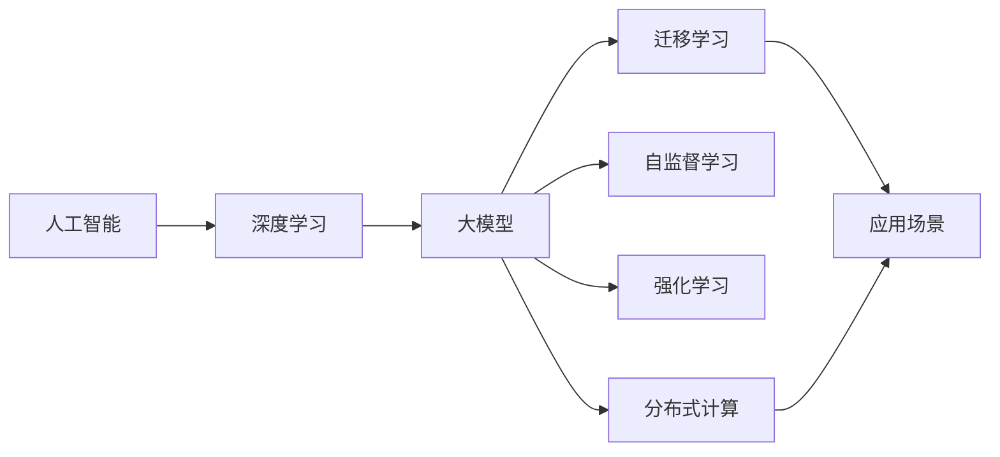

                 

## 1. 背景介绍

### 1.1 问题由来

近年来，人工智能(AI)技术发展迅猛，大模型（Giant Models）以其强大的计算能力、丰富的数据量和先进的深度学习算法，逐渐成为推动AI发展的主要力量。这些模型在自然语言处理、计算机视觉、语音识别、推荐系统等领域展现出卓越的性能。大模型如BERT、GPT-3、T5等，在学术界和工业界都取得了广泛的应用和认可。

人工智能的强大，不仅体现在其高超的计算能力上，更在于其可以模拟人类思维，解决实际问题。面对复杂多变的生活场景，AI大模型开始向各个领域渗透，从医疗、教育、金融到制造、农业，无一幸免。

### 1.2 问题核心关键点

AI大模型距离改变人类生活有多远，主要围绕以下几个关键问题展开讨论：

- **模型能力**：当前AI大模型的技术水平、应用场景和未来可能拓展的领域。
- **应用前景**：AI大模型在不同行业的应用潜力，特别是对日常生活的改变。
- **技术挑战**：AI大模型面临的难点，如数据隐私、模型偏见、算法透明性等。
- **伦理与社会影响**：AI大模型在社会层面的影响，如就业、公平、隐私等方面。

## 2. 核心概念与联系

### 2.1 核心概念概述

为更好地理解AI大模型对人类生活的改变，我们需先了解以下核心概念：

- **人工智能**（AI）：利用计算机技术和算法，使机器模拟人类智能进行信息处理和决策的领域。
- **深度学习**（Deep Learning）：一种机器学习算法，通过多层次的神经网络结构进行特征提取和模式识别。
- **大模型**（Giant Models）：包含数十亿或更多参数的深度学习模型，能处理海量数据，具有广泛的知识和能力。
- **迁移学习**（Transfer Learning）：将一个领域的知识迁移到另一个领域，提升新任务的学习效率。
- **自监督学习**（Self-Supervised Learning）：无需标注数据，通过自构建的伪标签进行学习，训练模型。
- **强化学习**（Reinforcement Learning）：通过与环境互动，模型通过试错不断优化策略，以最大化某种奖励信号。
- **分布式计算**（Distributed Computing）：通过网络将计算任务分布到多台计算机上进行并行计算，提升计算效率。

这些核心概念之间紧密相连，共同构成了AI大模型应用的基础。通过理解这些概念，我们可以更好地把握AI大模型对人类生活的影响。

### 2.2 核心概念联系（Mermaid 流程图）



这个流程图展示了人工智能和深度学习之间的联系，以及大模型如何通过迁移学习、自监督学习、强化学习和分布式计算等技术，拓展其应用场景，改变人类生活的各个方面。

## 3. 核心算法原理 & 具体操作步骤

### 3.1 算法原理概述

AI大模型是通过在大规模数据上训练得到的深度神经网络模型。这些模型在预训练阶段，利用大规模无标签数据进行学习，获取广泛的常识和知识。随后，通过迁移学习等方法，将这些知识迁移到特定任务中，从而进行微调。

以自然语言处理（NLP）为例，大模型通过在大规模文本数据上预训练，学习到语言的结构、语义和句法知识。随后，通过微调，大模型可以在诸如语言生成、文本分类、信息检索等NLP任务上，显著提升性能。

### 3.2 算法步骤详解

1. **数据准备**：收集大规模的未标注数据，作为大模型的预训练数据。
2. **模型预训练**：利用预训练算法（如掩码语言模型、自回归语言模型），在大规模数据上训练大模型。
3. **任务适配**：根据特定任务，选择适当的任务适配层，如分类头、解码器等，进行微调。
4. **微调训练**：使用少量标注数据进行微调，更新模型参数以适应特定任务。
5. **模型评估**：在验证集和测试集上评估模型性能，调整超参数和模型结构，直至达到最优。
6. **模型部署**：将训练好的模型部署到生产环境，进行实时推理和预测。

### 3.3 算法优缺点

**优点**：
- **高效性**：通过预训练和微调，可以在少数据的情况下快速提升模型性能。
- **广泛性**：大模型能够处理各种类型的数据，并应用于不同领域。
- **可扩展性**：通过迁移学习和自监督学习，模型可以适应新任务，拓展应用场景。

**缺点**：
- **资源消耗**：大模型训练需要大量计算资源，对硬件设备要求高。
- **数据隐私**：模型训练需使用大量数据，可能涉及隐私保护问题。
- **模型偏见**：模型在训练过程中可能学习到数据中的偏见，导致输出结果不公。

### 3.4 算法应用领域

AI大模型在多个领域都有广泛应用：

- **自然语言处理**：如机器翻译、文本分类、情感分析、语言生成等。
- **计算机视觉**：如图像识别、目标检测、视频分析等。
- **医疗健康**：如疾病预测、药物发现、基因组分析等。
- **金融科技**：如风险评估、股票分析、信贷审批等。
- **自动驾驶**：如环境感知、路径规划、行为决策等。

## 4. 数学模型和公式 & 详细讲解 & 举例说明

### 4.1 数学模型构建

以一个简单的文本分类任务为例，构建大模型进行微调的数学模型。

设训练数据集为 $\{(x_i, y_i)\}_{i=1}^N$，其中 $x_i$ 为输入文本，$y_i$ 为对应的分类标签。假设大模型为 $M_{\theta}$，其输出为 $M_{\theta}(x)$。

目标函数为交叉熵损失函数：

$$
\mathcal{L}(\theta) = -\frac{1}{N}\sum_{i=1}^N \sum_{j=1}^C y_{ij} \log M_{\theta}(x_i)
$$

其中，$y_{ij}$ 为第 $i$ 个样本属于第 $j$ 类的标签。

### 4.2 公式推导过程

通过反向传播算法，求得模型参数 $\theta$ 的梯度：

$$
\nabla_{\theta}\mathcal{L}(\theta) = -\frac{1}{N}\sum_{i=1}^N \nabla_{\theta}(\log M_{\theta}(x_i)) y_i
$$

其中，$\nabla_{\theta}(\log M_{\theta}(x_i))$ 为模型输出的对数导数，即雅各比矩阵。

通过梯度下降等优化算法，迭代更新模型参数：

$$
\theta \leftarrow \theta - \eta \nabla_{\theta}\mathcal{L}(\theta)
$$

其中，$\eta$ 为学习率。

### 4.3 案例分析与讲解

以图像识别任务为例，介绍大模型微调的具体流程。

1. **数据准备**：收集图像数据集，如ImageNet，进行预处理和划分。
2. **模型预训练**：使用自回归语言模型（如GPT-3）在大量文本数据上预训练，学习语言结构和知识。
3. **任务适配**：在模型顶部添加适当的分类头，进行图像分类任务的微调。
4. **微调训练**：在图像数据集上进行微调训练，调整模型参数。
5. **模型评估**：在验证集和测试集上评估模型性能，选择最佳模型。
6. **模型部署**：将模型部署到生产环境，进行实时推理和预测。

## 5. 项目实践：代码实例和详细解释说明

### 5.1 开发环境搭建

搭建AI大模型开发环境，需要以下步骤：

1. 安装Python：选择合适的Python版本，如3.7或以上。
2. 安装TensorFlow和PyTorch：安装TensorFlow和PyTorch，如：
```bash
pip install tensorflow==2.6
pip install torch==1.11
```
3. 安装Numpy和Pandas：
```bash
pip install numpy pandas
```
4. 安装TensorBoard：用于可视化模型训练过程：
```bash
pip install tensorboard
```
5. 安装Keras：基于TensorFlow和PyTorch的高级API：
```bash
pip install keras
```

### 5.2 源代码详细实现

以使用TensorFlow进行文本分类任务为例，展示大模型微调的代码实现。

```python
import tensorflow as tf
from tensorflow.keras.layers import Dense, Flatten, Input
from tensorflow.keras.models import Model
from tensorflow.keras.optimizers import Adam

# 定义模型结构
input_layer = Input(shape=(256,))
hidden_layer = Dense(128, activation='relu')(input_layer)
output_layer = Dense(10, activation='softmax')(hidden_layer)
model = Model(inputs=input_layer, outputs=output_layer)

# 定义损失函数和优化器
loss_function = tf.keras.losses.CategoricalCrossentropy()
optimizer = Adam(learning_rate=0.001)

# 编译模型
model.compile(optimizer=optimizer, loss=loss_function, metrics=['accuracy'])

# 加载训练数据
train_data = ...
val_data = ...

# 训练模型
model.fit(train_data, epochs=10, validation_data=val_data)
```

### 5.3 代码解读与分析

- `Input`层：定义输入数据的形状，如文本序列。
- `Dense`层：添加全连接层，进行特征提取。
- `softmax`激活函数：输出概率分布，表示不同分类的概率。
- `Model`模型：将输入层、隐藏层、输出层组合成完整模型。
- `CategoricalCrossentropy`损失函数：用于多分类任务。
- `Adam`优化器：自适应学习率，加速模型收敛。
- `compile`方法：编译模型，指定损失函数、优化器和评价指标。
- `fit`方法：训练模型，设置训练轮数和验证集。

通过上述代码，展示了使用TensorFlow构建和训练大模型进行文本分类任务的过程。

### 5.4 运行结果展示

训练完成后，可以使用以下代码进行模型评估和预测：

```python
# 加载测试数据
test_data = ...

# 评估模型
loss, accuracy = model.evaluate(test_data)
print('Test accuracy:', accuracy)

# 进行预测
predictions = model.predict(test_data)
```

## 6. 实际应用场景

### 6.1 医疗健康

AI大模型在医疗健康领域的应用潜力巨大。通过深度学习算法，大模型能够处理和分析大量的医疗数据，如电子病历、影像数据等，提升疾病诊断和治疗效率。

- **疾病预测**：基于病历数据，大模型能够预测患者的疾病风险，提前预防和干预。
- **影像诊断**：利用图像识别技术，自动诊断X光、CT、MRI等影像，提高诊断速度和准确性。
- **药物发现**：通过分析生物分子结构，发现新药物和治疗方法，加速研发进程。
- **基因组分析**：分析基因序列数据，发现与疾病相关的基因变异，为个性化治疗提供依据。

### 6.2 金融科技

AI大模型在金融科技领域的应用同样广泛。通过处理和分析金融数据，大模型能够提升风险评估、投资决策和客户服务水平。

- **风险评估**：通过分析信用记录、交易行为等数据，预测信贷风险和违约概率。
- **股票分析**：基于新闻、财务数据等，进行股票价格预测和投资组合优化。
- **客户服务**：通过智能客服机器人，提供24小时在线客服，提高客户满意度。
- **欺诈检测**：通过分析交易行为，检测异常交易和欺诈行为，保障金融安全。

### 6.3 自动驾驶

AI大模型在自动驾驶领域的应用也逐渐普及。通过处理和分析传感器数据，大模型能够实现环境感知、路径规划和行为决策等功能。

- **环境感知**：通过图像识别技术，识别道路、车辆、行人等物体。
- **路径规划**：通过优化算法，规划最佳行驶路径，避开障碍物。
- **行为决策**：根据道路情况和交通规则，自动驾驶车辆做出安全驾驶决策。
- **实时监控**：通过视频分析技术，实时监控车辆周围环境，保障行车安全。

## 7. 工具和资源推荐

### 7.1 学习资源推荐

1. **Coursera**和**edX**：提供深度学习和AI相关的在线课程，涵盖从基础到高级的多个层次。
2. **Udacity**：提供AI和大数据相关的专业课程，注重实践和项目实战。
3. **Kaggle**：数据科学和机器学习竞赛平台，提供大量数据集和模型，方便学习和研究。
4. **arXiv**和**Google Scholar**：收录大量前沿学术论文，了解最新研究进展。
5. **AI 和 ML 书籍**：如《深度学习》（Ian Goodfellow 著）、《Python机器学习》（Sebastian Raschka 著）、《Hands-On Machine Learning with Scikit-Learn, Keras, and TensorFlow》（Aurélien Géron 著）。

### 7.2 开发工具推荐

1. **Jupyter Notebook**：强大的交互式编程环境，方便实验和开发。
2. **TensorFlow**和**PyTorch**：流行的深度学习框架，支持大规模模型训练和部署。
3. **TensorBoard**：可视化工具，监控模型训练过程，提供丰富的图表。
4. **Keras**：高级API，简化模型搭建和训练过程。
5. **Git**和**GitHub**：版本控制和代码托管平台，方便协作和迭代。

### 7.3 相关论文推荐

1. **《Attention is All You Need》**（NeurIPS 2017）：介绍Transformer架构，奠定大模型的基础。
2. **《BERT: Pre-training of Deep Bidirectional Transformers for Language Understanding》**（NAACL 2019）：提出BERT模型，基于掩码语言模型进行预训练。
3. **《GPT-3: Language Models are Unsupervised Multitask Learners》**（AAAI 2020）：介绍GPT-3模型，展示大模型的零样本学习能力。
4. **《AdaLoRA: Adaptive Low-Rank Adaptation for Parameter-Efficient Fine-Tuning》**（EMNLP 2020）：提出AdaLoRA方法，提高微调效率。
5. **《Towards a General Intelligence with Language Models》**（AAAI 2021）：探讨大模型在通用人工智能中的应用和前景。

## 8. 总结：未来发展趋势与挑战

### 8.1 研究成果总结

AI大模型在多个领域取得了显著进展，显示出巨大的应用潜力。未来，AI大模型将在医疗健康、金融科技、自动驾驶等更多领域发挥重要作用，改变人类生活。

### 8.2 未来发展趋势

1. **模型规模扩大**：随着硬件计算能力的提升，大模型参数量将进一步增加，模型性能将得到进一步提升。
2. **多模态融合**：结合视觉、语音和文本等多模态数据，提升模型对复杂场景的理解能力。
3. **自监督学习**：利用无标注数据进行预训练，减少对标注数据的依赖。
4. **强化学习**：结合强化学习，提升模型在动态环境中的适应能力。
5. **分布式计算**：利用分布式计算技术，提高模型训练和推理效率。

### 8.3 面临的挑战

1. **数据隐私**：大模型训练需大量数据，可能涉及用户隐私保护问题。
2. **模型偏见**：大模型可能学习到数据中的偏见，导致输出结果不公。
3. **计算资源**：大模型训练需大量计算资源，对硬件设备要求高。
4. **模型透明性**：大模型决策过程不透明，难以理解和解释。
5. **伦理与社会影响**：AI大模型可能带来就业、公平等社会问题，需注意伦理约束。

### 8.4 研究展望

未来，需重点解决以下问题：

1. **数据隐私保护**：开发隐私保护技术，保护用户隐私。
2. **模型公平性**：引入公平性约束，消除模型偏见。
3. **模型透明性**：开发透明性技术，提升模型解释能力。
4. **资源优化**：优化模型结构，提升计算效率。
5. **伦理与社会约束**：建立伦理约束机制，确保模型应用符合社会规范。

## 9. 附录：常见问题与解答

### Q1：AI大模型为何能改变人类生活？

A：AI大模型具有强大的计算能力和广泛的知识，能够处理海量数据，并应用于多个领域，提升效率和精度。通过自然语言处理、计算机视觉、推荐系统等技术，AI大模型能够改变人类生活的各个方面。

### Q2：AI大模型训练需要多少数据？

A：AI大模型训练需要大量的数据，如自然语言处理领域，需几十亿到上百亿个文本数据。数据量越大，模型性能越好。

### Q3：AI大模型训练有哪些优化技术？

A：AI大模型训练有多个优化技术，如梯度累积、混合精度训练、分布式计算等。这些技术可以显著提升训练效率，缩短训练时间。

### Q4：AI大模型在医疗健康领域的应用有哪些？

A：AI大模型在医疗健康领域的应用包括疾病预测、影像诊断、药物发现、基因组分析等。通过处理和分析医疗数据，提升疾病诊断和治疗效率。

### Q5：AI大模型在金融科技领域的应用有哪些？

A：AI大模型在金融科技领域的应用包括风险评估、股票分析、客户服务、欺诈检测等。通过处理和分析金融数据，提升金融服务的质量和效率。

### Q6：AI大模型在自动驾驶领域的应用有哪些？

A：AI大模型在自动驾驶领域的应用包括环境感知、路径规划、行为决策、实时监控等。通过处理和分析传感器数据，提升自动驾驶的安全性和可靠性。

作者：禅与计算机程序设计艺术 / Zen and the Art of Computer Programming

