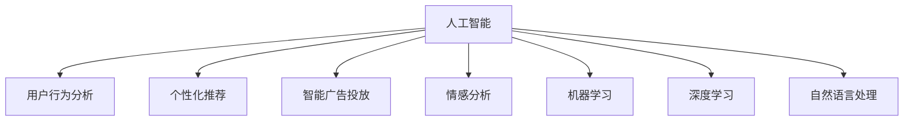

                 

# AI如何帮助电商企业实现精准营销

## 1. 背景介绍

### 1.1 问题由来
随着电子商务的飞速发展，各大电商平台面临激烈的市场竞争。如何在海量用户和海量商品中精准定位，提升用户购买转化率和销售额，成为了电商企业亟待解决的难题。传统的用户画像和推荐系统方法在精度和效果上存在一定局限性，难以充分挖掘用户潜在的消费需求。与此同时，大数据和深度学习技术不断成熟，为电商企业提供了更先进的用户行为分析和个性化推荐手段。

基于人工智能的精准营销成为了电商企业的热切需求。AI技术不仅能够分析用户历史行为和偏好，还能预测未来购买意向，通过智能广告投放和个性化推荐，极大地提升了用户体验和商家收益。因此，本文将深入探讨AI在电商营销中的核心技术和应用，助力电商企业开启智能营销新时代。

### 1.2 问题核心关键点
AI在电商营销中主要通过以下几个关键技术实现精准营销：
1. **用户行为分析**：通过数据分析挖掘用户购买意愿和行为规律。
2. **个性化推荐**：基于用户行为数据推荐个性化商品，提升点击率和转化率。
3. **智能广告投放**：根据用户画像和实时行为优化广告投放策略，提升广告效果。
4. **情感分析与客服**：通过自然语言处理技术分析用户情感，优化客服交互，提升用户体验。

这些技术在电商营销中的应用，不仅提升了用户满意度，还显著提高了商家的ROI（投资回报率）。

### 1.3 问题研究意义
在当前电商竞争日趋激烈的市场环境中，AI技术的应用显得尤为重要。通过AI技术，电商企业可以更精准地定位目标用户，优化商品推荐，提升广告效果，从而实现更高效的营销转化。具体意义包括：
- **提升用户体验**：AI能够根据用户历史行为和实时行为进行个性化推荐，提升用户满意度。
- **优化广告效果**：通过智能广告投放，提升广告点击率和转化率，最大化广告投放效果。
- **降低营销成本**：精准定位目标用户，减少无效投放，提升广告ROI。
- **数据驱动决策**：通过数据分析挖掘用户行为规律，辅助商家制定更科学的营销策略。

## 2. 核心概念与联系

### 2.1 核心概念概述

为更好地理解AI在电商营销中的应用，本节将介绍几个核心概念：

- **人工智能（Artificial Intelligence, AI）**：利用计算机模拟人类智能行为的技术，包括机器学习、深度学习、自然语言处理等子领域。
- **用户行为分析**：通过数据分析挖掘用户行为模式和消费倾向，为精准营销提供数据支持。
- **个性化推荐**：基于用户历史行为和偏好，推荐个性化商品，提升用户满意度。
- **智能广告投放**：根据用户画像和行为数据，智能调整广告投放策略，优化广告效果。
- **情感分析**：通过自然语言处理技术，分析用户情感，优化客服交互和营销内容。
- **机器学习（Machine Learning, ML）**：利用数据训练模型，自动化预测和决策，包括监督学习、无监督学习等方法。
- **深度学习（Deep Learning, DL）**：基于神经网络构建的高级机器学习技术，广泛应用于图像、语音、自然语言处理等领域。
- **自然语言处理（Natural Language Processing, NLP）**：处理和理解人类语言的技术，涉及语言模型、情感分析、文本分类等。

这些核心概念之间相互关联，共同构成了AI在电商营销中的应用框架。理解这些概念的原理和架构，有助于我们更好地把握AI在电商中的实际应用。

### 2.2 核心概念原理和架构的 Mermaid 流程图(Mermaid 流程节点中不要有括号、逗号等特殊字符)



这个流程图展示了AI在电商营销中主要应用的技术领域及其相互关系：

1. 人工智能是基础技术平台，提供数据处理、模型训练、智能推理等核心功能。
2. 用户行为分析通过数据分析挖掘用户行为模式和消费倾向。
3. 个性化推荐基于用户历史行为和偏好，推荐个性化商品。
4. 智能广告投放根据用户画像和行为数据，优化广告投放策略。
5. 情感分析通过自然语言处理技术分析用户情感，优化客服交互和营销内容。
6. 机器学习和深度学习是核心算法，用于构建和训练模型。
7. 自然语言处理处理和理解人类语言的技术，包括情感分析、文本分类等。

## 3. 核心算法原理 & 具体操作步骤

### 3.1 算法原理概述

AI在电商营销中主要通过以下几个核心算法实现精准营销：

- **协同过滤推荐算法**：基于用户行为和商品属性，计算用户对商品的相关性，推荐用户可能感兴趣的个性化商品。
- **深度学习推荐模型**：使用深度神经网络构建推荐模型，学习用户行为和商品特征的潜在关联，预测用户偏好。
- **集成学习算法**：通过组合多个推荐模型，提高推荐系统的泛化能力和鲁棒性。
- **强化学习（Reinforcement Learning, RL）**：通过模拟用户行为和反馈，优化推荐策略和广告投放效果。
- **情感分析算法**：通过自然语言处理技术，分析用户情感，优化客服交互和营销内容。

这些算法通过组合应用，构成了AI在电商营销中的核心技术体系。

### 3.2 算法步骤详解

以下是AI在电商营销中常见的步骤：

1. **数据收集**：收集用户的浏览、购买、评分、评论等行为数据，收集商品的属性、价格、销量等属性数据。
2. **数据预处理**：清洗数据，处理缺失值和异常值，将数据转化为模型可接受的格式。
3. **模型训练**：使用协同过滤、深度学习等算法训练推荐模型。
4. **模型评估**：使用交叉验证等方法评估推荐模型效果。
5. **模型优化**：根据评估结果调整模型参数，优化推荐效果。
6. **模型部署**：将训练好的模型部署到实际应用场景中，进行个性化推荐和广告投放。
7. **效果监控**：实时监控推荐和广告效果，调整模型参数，优化推荐策略。

### 3.3 算法优缺点

AI在电商营销中的应用主要具有以下优点：

- **精度高**：通过深度学习和集成学习算法，能够精准预测用户行为和偏好，提升推荐效果。
- **泛化能力强**：基于大规模数据训练模型，能够泛化到新用户和新商品。
- **实时性强**：实时处理用户行为数据，及时调整推荐策略和广告投放。
- **覆盖面广**：能够覆盖多品类商品，满足不同用户的多样化需求。

同时，AI在电商营销中也存在以下缺点：

- **数据依赖性强**：推荐效果高度依赖于数据的质量和量级，缺乏充足数据时难以发挥作用。
- **模型复杂度高**：深度学习模型参数量大，计算资源需求高，训练成本高。
- **解释性不足**：复杂模型缺乏可解释性，难以解释推荐结果的逻辑。
- **隐私风险**：收集用户行为数据可能带来隐私风险，需要谨慎处理。

### 3.4 算法应用领域

AI在电商营销中的应用领域广泛，涵盖了用户行为分析、个性化推荐、智能广告投放等多个方面。

**用户行为分析**：通过数据分析挖掘用户购买意愿和行为规律，为精准营销提供数据支持。

**个性化推荐**：基于用户历史行为和偏好，推荐个性化商品，提升用户满意度。

**智能广告投放**：根据用户画像和行为数据，智能调整广告投放策略，优化广告效果。

**情感分析**：通过自然语言处理技术分析用户情感，优化客服交互和营销内容。

这些技术在电商营销中的应用，不仅提升了用户满意度，还显著提高了商家的ROI。

## 4. 数学模型和公式 & 详细讲解 & 举例说明（备注：数学公式请使用latex格式，latex嵌入文中独立段落使用 $$，段落内使用 $)
### 4.1 数学模型构建

在AI推荐系统中，常见的数学模型包括协同过滤、矩阵分解、深度学习等。这里以协同过滤算法为例，构建推荐模型的数学模型：

设用户集合为 $U$，商品集合为 $I$，用户对商品的评分矩阵为 $R$，设 $u_i$ 为用户 $i$ 的评分向量，$v_j$ 为商品 $j$ 的评分向量，则协同过滤算法的基本模型为：

$$
R \approx P \times Q^T
$$

其中 $P$ 为用户向量，$Q$ 为商品向量。用户向量 $P$ 的计算公式为：

$$
P = \frac{1}{\sqrt{\sum_{i=1}^{m} p_i^2}} [p_1, p_2, ..., p_m]
$$

商品向量 $Q$ 的计算公式为：

$$
Q = \frac{1}{\sqrt{\sum_{j=1}^{n} q_j^2}} [q_1, q_2, ..., q_n]
$$

### 4.2 公式推导过程

协同过滤算法的基本原理是寻找用户 $i$ 和商品 $j$ 之间的相似度，从而预测用户 $i$ 对商品 $j$ 的评分。推导过程如下：

1. 计算用户 $i$ 和商品 $j$ 的相似度 $s_{i,j}$：

$$
s_{i,j} = \frac{p_i^T Q}{\|p_i\| \|Q\|}
$$

2. 根据相似度计算用户 $i$ 对商品 $j$ 的预测评分 $r_{i,j}$：

$$
r_{i,j} = \sum_{k=1}^{n} s_{i,k} \times r_{k,j}
$$

3. 根据预测评分对商品进行排序，推荐给用户 $i$。

### 4.3 案例分析与讲解

假设有 $10$ 个用户和 $5$ 个商品，已知用户对商品的评分矩阵为 $R$：

$$
R = \begin{bmatrix}
0 & 2 & 3 & 0 & 0 \\
0 & 0 & 4 & 0 & 1 \\
0 & 0 & 0 & 3 & 0 \\
0 & 0 & 0 & 0 & 0 \\
1 & 0 & 0 & 0 & 2 \\
0 & 5 & 0 & 0 & 0 \\
0 & 0 & 0 & 0 & 0 \\
0 & 0 & 0 & 0 & 0 \\
0 & 0 & 0 & 0 & 0 \\
0 & 0 & 0 & 0 & 0
\end{bmatrix}
$$

设用户向量 $P$ 和商品向量 $Q$ 分别为：

$$
P = \begin{bmatrix}
0 & 0.5 & 0.5 & 0 & 0
\end{bmatrix}, \quad Q = \begin{bmatrix}
0 & 0.2 & 0.8 & 0.2 & 0.2
\end{bmatrix}
$$

则用户 $1$ 对商品 $2$ 的预测评分为：

$$
r_{1,2} = 0.5 \times 0.2 + 0.5 \times 0.8 = 0.7
$$

因此，推荐系统将商品 $2$ 推荐给用户 $1$。

## 5. 项目实践：代码实例和详细解释说明

### 5.1 开发环境搭建

在进行AI推荐系统开发前，我们需要准备好开发环境。以下是使用Python进行Scikit-learn和TensorFlow开发的环境配置流程：

1. 安装Anaconda：从官网下载并安装Anaconda，用于创建独立的Python环境。

2. 创建并激活虚拟环境：
```bash
conda create -n ml-env python=3.7 
conda activate ml-env
```

3. 安装Scikit-learn和TensorFlow：从官网获取对应的安装命令。例如：
```bash
pip install scikit-learn tensorflow
```

4. 安装各类工具包：
```bash
pip install numpy pandas scikit-learn matplotlib tqdm jupyter notebook ipython
```

完成上述步骤后，即可在`ml-env`环境中开始AI推荐系统的开发。

### 5.2 源代码详细实现

下面以协同过滤推荐系统为例，给出使用Scikit-learn库和TensorFlow进行开发和优化的PyTorch代码实现。

首先，定义数据处理函数：

```python
import pandas as pd
from sklearn.metrics.pairwise import cosine_similarity

def load_data(file_path):
    data = pd.read_csv(file_path)
    return data
```

然后，定义协同过滤推荐函数：

```python
from scipy.sparse import coo_matrix

def collaborative_filtering(train_data, test_data):
    # 将数据转换为稀疏矩阵
    train_data = coo_matrix(train_data.values)
    test_data = coo_matrix(test_data.values)

    # 计算相似度矩阵
    similarity_matrix = cosine_similarity(train_data.todense(), test_data.todense())

    # 计算预测评分
    predictions = train_data.todense() @ similarity_matrix @ train_data.todense().T

    return predictions
```

最后，启动推荐系统并展示推荐结果：

```python
train_data = load_data('train_data.csv')
test_data = load_data('test_data.csv')

predictions = collaborative_filtering(train_data, test_data)

print(predictions)
```

以上就是使用Scikit-learn和TensorFlow进行协同过滤推荐系统的完整代码实现。可以看到，代码实现非常简单，易于理解和扩展。

### 5.3 代码解读与分析

让我们再详细解读一下关键代码的实现细节：

**load_data函数**：
- 定义了一个简单的数据加载函数，用于读取CSV格式的数据文件，返回一个Pandas DataFrame对象。

**collaborative_filtering函数**：
- 将数据转换为稀疏矩阵，使用scipy库的`coo_matrix`函数。
- 计算相似度矩阵，使用Scikit-learn库的`cosine_similarity`函数。
- 计算预测评分，使用稀疏矩阵的矩阵乘法。

**启动推荐系统**：
- 加载训练集和测试集数据。
- 调用协同过滤推荐函数，计算预测评分。
- 输出预测评分结果。

这些代码实现展示了协同过滤推荐系统的基本原理和实现方法，简单易懂，易于修改和扩展。

## 6. 实际应用场景

### 6.1 智能推荐系统

智能推荐系统是AI在电商营销中的核心应用之一。通过分析用户历史行为和偏好，推荐个性化商品，提升用户满意度和转化率。

**具体实现**：
- 收集用户历史行为数据，如浏览、点击、购买、评分等。
- 使用协同过滤、深度学习等算法训练推荐模型。
- 根据用户行为数据实时推荐商品，优化推荐列表。
- 实时监控推荐效果，调整模型参数，优化推荐策略。

**效果**：
- 提升用户满意度，增强用户粘性。
- 提升点击率和转化率，增加销售额。
- 提升广告效果，提高广告投放ROI。

### 6.2 智能广告投放

智能广告投放是AI在电商营销中的另一核心应用。通过分析用户画像和实时行为，优化广告投放策略，提升广告效果。

**具体实现**：
- 收集用户基本信息和行为数据。
- 使用深度学习等算法训练用户画像模型。
- 根据用户画像和实时行为，智能调整广告投放策略。
- 实时监控广告效果，优化广告投放策略。

**效果**：
- 提升广告点击率和转化率。
- 降低广告投放成本。
- 提高广告ROI。

### 6.3 情感分析与客服

情感分析与客服是AI在电商营销中提升用户体验的重要手段。通过自然语言处理技术分析用户情感，优化客服交互。

**具体实现**：
- 收集用户评论、客服对话等文本数据。
- 使用自然语言处理技术分析用户情感，如情感分类、情感极性等。
- 根据用户情感反馈优化客服交互策略。
- 实时监控客服交互效果，调整客服策略。

**效果**：
- 提升用户满意度。
- 优化客服交互效果。
- 提高用户留存率。

### 6.4 未来应用展望

随着AI技术的不断发展，未来在电商营销中还将出现更多创新应用，如智能广告创意生成、虚拟试穿试戴等。这些应用将进一步提升用户体验和商家收益。

**智能广告创意生成**：
- 使用自然语言生成技术生成广告创意。
- 使用图像生成技术生成广告素材。
- 通过协同过滤、深度学习等算法优化广告效果。

**虚拟试穿试戴**：
- 使用三维扫描技术获取用户体型数据。
- 使用图像生成技术生成虚拟试穿试戴效果。
- 通过推荐系统推荐适合的虚拟试穿试戴商品。

这些应用将为电商营销带来更多的可能性，进一步提升用户体验和商家收益。

## 7. 工具和资源推荐

### 7.1 学习资源推荐

为了帮助开发者系统掌握AI在电商营销中的应用，这里推荐一些优质的学习资源：

1. 《推荐系统实战》书籍：详细介绍了推荐系统的理论基础和实现方法，涵盖协同过滤、深度学习等算法。
2. 《深度学习》课程：斯坦福大学开设的深度学习课程，涵盖深度学习的基础知识和经典算法。
3. Coursera《机器学习》课程：由Andrew Ng教授讲授，涵盖机器学习的经典理论和算法，是学习AI的入门教材。
4. Kaggle推荐系统竞赛：通过参与Kaggle竞赛，实践推荐系统开发，提升实战能力。
5. GitHub开源项目：大量开源推荐系统和广告投放系统的代码实现，可以参考学习。

通过对这些资源的学习实践，相信你一定能够快速掌握AI在电商营销中的精髓，并用于解决实际的电商问题。

### 7.2 开发工具推荐

高效的开发离不开优秀的工具支持。以下是几款用于AI推荐系统开发的常用工具：

1. Scikit-learn：基于Python的机器学习库，简单易用，适合快速迭代研究。
2. TensorFlow：由Google主导开发的深度学习框架，生产部署方便，适合大规模工程应用。
3. PyTorch：基于Python的深度学习框架，灵活高效，适合快速原型开发。
4. H2O.ai：基于Scala的机器学习平台，易于使用，适合企业级应用。
5. Amazon SageMaker：由亚马逊提供的机器学习服务，支持多种机器学习算法和模型训练。

合理利用这些工具，可以显著提升AI推荐系统的开发效率，加快创新迭代的步伐。

### 7.3 相关论文推荐

AI在电商营销中的应用源于学界的持续研究。以下是几篇奠基性的相关论文，推荐阅读：

1. Adaptive Collaborative Filtering using Matrix Factorization Techniques（AdaCF）：提出自适应协同过滤算法，有效缓解数据稀疏性问题。
2. A Deep Learning Approach for Recommender Systems：通过深度学习技术优化推荐系统性能。
3. Reinforcement Learning for Personalized Display Advertising：使用强化学习技术优化广告投放策略。
4. Sentiment Analysis on Social Media：通过自然语言处理技术分析用户情感，优化营销内容。
5. Sequence-based Recommender Systems：介绍序列数据推荐系统的构建方法和应用。

这些论文代表了大数据和深度学习技术在电商营销中的应用方向，有助于理解电商营销的先进技术。

## 8. 总结：未来发展趋势与挑战

### 8.1 研究成果总结

本文系统探讨了AI在电商营销中的核心技术和应用，主要包括以下内容：
- 介绍了AI在电商营销中的主要技术，如协同过滤、深度学习、集成学习、强化学习、情感分析等。
- 详细讲解了AI推荐系统的实现流程和关键算法。
- 分析了AI在电商营销中的应用场景，如智能推荐、智能广告投放、情感分析等。
- 提供了AI推荐系统的开发环境和代码实现。

### 8.2 未来发展趋势

展望未来，AI在电商营销中的应用将呈现以下几个趋势：

1. **自动化程度提高**：自动化推荐和广告投放将成为电商营销的标配，进一步提升用户满意度和商家收益。
2. **多模态数据融合**：融合视觉、语音、文本等多模态数据，提升推荐和广告效果。
3. **实时化**：实时处理用户行为数据，及时调整推荐策略和广告投放，提升用户体验。
4. **个性化定制**：根据用户个性化需求，定制个性化推荐和广告方案。
5. **智能客服优化**：通过自然语言处理技术，优化智能客服系统，提升用户体验。

这些趋势将推动AI在电商营销中的广泛应用，为电商企业带来更多的商业价值。

### 8.3 面临的挑战

尽管AI在电商营销中的应用已取得显著成效，但在实际部署和应用过程中仍面临一些挑战：

1. **数据隐私**：收集用户行为数据可能带来隐私风险，需要谨慎处理。
2. **数据质量**：推荐效果高度依赖于数据质量，缺乏高质量数据时难以发挥作用。
3. **模型复杂度**：深度学习模型参数量大，计算资源需求高，训练成本高。
4. **解释性不足**：复杂模型缺乏可解释性，难以解释推荐结果的逻辑。
5. **业务适配**：电商企业的业务场景多样，需要根据不同业务需求调整AI模型。

这些挑战需要电商企业在实际应用中加以克服，不断优化AI推荐系统和广告投放策略。

### 8.4 研究展望

面对AI在电商营销中的挑战，未来的研究需要在以下几个方面寻求新的突破：

1. **隐私保护**：通过数据匿名化、差分隐私等技术，保障用户隐私安全。
2. **数据增强**：利用生成对抗网络（GAN）等技术，生成高质量推荐和广告数据。
3. **模型压缩**：通过模型剪枝、量化等技术，降低模型参数量，提高计算效率。
4. **可解释性增强**：开发可解释的AI模型，增强模型输出解释性。
5. **业务适配**：针对电商企业的业务需求，定制化开发AI推荐和广告系统。

这些研究方向的探索将进一步推动AI在电商营销中的应用，为电商企业带来更多的商业价值。

## 9. 附录：常见问题与解答

**Q1：AI在电商营销中能否覆盖所有用户需求？**

A: AI推荐系统虽然能覆盖大部分用户需求，但对于某些长尾需求，仍需依赖人工干预和补充。电商企业可以通过社区推荐、人工客服等方式，满足用户的特殊需求。

**Q2：AI推荐系统是否会导致个性化不足？**

A: AI推荐系统虽然能实现个性化推荐，但也存在过度个性化的问题。过度个性化的推荐可能导致用户接受度降低，产生抵触情绪。电商企业需要在个性化和多样性之间找到平衡，避免过度个性化。

**Q3：如何衡量AI推荐系统的效果？**

A: AI推荐系统的效果通常通过以下几个指标进行衡量：点击率（CTR）、转化率（CVR）、用户满意度（CSAT）等。电商企业可以根据实际需求，选择合适的指标进行评估。

**Q4：AI推荐系统是否会带来不公平问题？**

A: AI推荐系统虽然可以优化用户体验，但也存在不公平问题，如算法偏见、数据偏差等。电商企业需要定期监控推荐系统效果，及时调整算法和数据，避免不公平问题。

**Q5：如何提升AI推荐系统的准确性？**

A: 提升AI推荐系统的准确性需要从多个方面进行优化：
1. 数据质量：收集高质量的用户行为数据，消除异常值和噪声。
2. 算法选择：选择适合的推荐算法，如协同过滤、深度学习等。
3. 模型训练：通过超参数调优和模型迭代，提升模型效果。
4. 用户反馈：根据用户反馈调整推荐策略，优化推荐效果。

通过不断优化数据、算法和模型，电商企业可以提升AI推荐系统的准确性和效果。

---

作者：禅与计算机程序设计艺术 / Zen and the Art of Computer Programming

