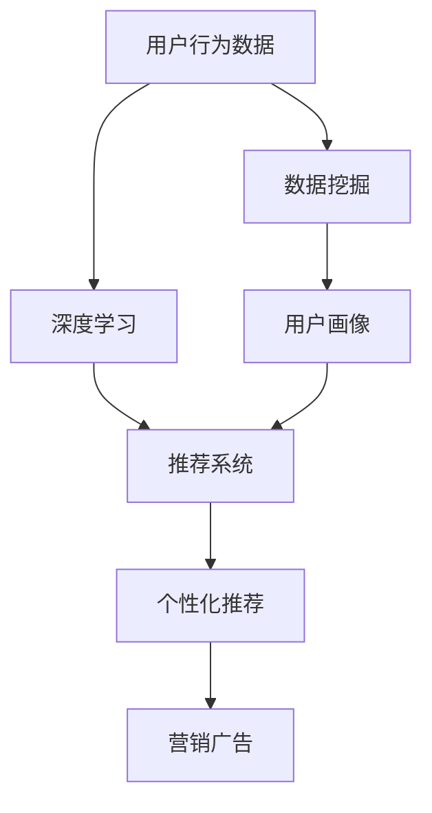

                 

# AI如何帮助电商企业进行用户行为分析

> 关键词：用户行为分析,电商企业,人工智能,深度学习,机器学习,数据挖掘,用户画像

## 1. 背景介绍

### 1.1 问题由来
电商行业作为互联网时代的重要组成部分，用户行为分析已经成为电商企业优化产品、提升用户体验、驱动业务增长不可或缺的环节。传统用户行为分析主要依靠人工统计和处理数据，成本高、效率低，难以应对用户数据量的爆炸式增长。而AI技术的崛起，特别是深度学习和数据挖掘技术的广泛应用，为电商企业进行高效、精准的用户行为分析提供了新的可能。

### 1.2 问题核心关键点
AI在电商企业用户行为分析中的应用，主要体现在以下几个方面：
- 数据处理与特征工程：大规模数据集的存储与处理、特征提取与工程化。
- 深度学习与机器学习：利用神经网络、决策树、聚类算法等模型进行用户行为模式识别。
- 推荐系统与个性化推荐：基于用户行为数据进行个性化商品推荐。
- 用户画像构建：通过机器学习技术对用户行为数据进行建模，构建精准用户画像。
- 预测与决策支持：基于历史行为数据，预测用户未来行为，辅助企业决策。

AI技术的应用，不仅能大幅提升电商企业对用户行为的分析能力，还能为个性化推荐、营销、广告投放等业务环节提供有力支持，从而提升用户满意度和企业业绩。

### 1.3 问题研究意义
AI在电商企业用户行为分析中的应用，具有以下重要意义：
- 提高决策效率：通过自动化分析技术，电商企业可以更快地获得用户行为洞察，优化产品策略和营销方案。
- 提升用户体验：精准的用户画像和个性化推荐系统，能够更好地满足用户需求，提升购物体验。
- 降低运营成本：自动化数据分析和智能推荐系统，减少了人工干预和运营成本。
- 推动业务创新：AI技术能够识别新的用户需求和市场趋势，推动电商企业业务创新和模式转型。
- 增强市场竞争力：准确的用户行为分析能够帮助电商企业在激烈的市场竞争中脱颖而出，占据更有利的位置。

## 2. 核心概念与联系

### 2.1 核心概念概述

为更好地理解AI在电商企业用户行为分析中的应用，本节将介绍几个关键概念：

- **用户行为分析**：通过对用户在线行为数据的收集和分析，识别用户行为模式、需求偏好和消费习惯，从而为个性化推荐、广告投放等提供数据支持。

- **深度学习**：一种模拟人脑神经网络结构的机器学习算法，通过多层神经网络进行特征提取与模式识别，在处理复杂数据方面具有显著优势。

- **推荐系统**：根据用户历史行为数据，推荐可能感兴趣的商品或内容，提升用户体验和商家转化率。

- **用户画像**：通过数据挖掘技术，从用户行为数据中提取关键信息，构建一个详细的用户标签体系，帮助企业更好地了解用户。

- **数据挖掘**：从大量数据中挖掘出有用信息和知识，帮助企业进行决策和优化。

这些概念之间的逻辑关系可以通过以下Mermaid流程图来展示：



这个流程图展示了用户行为数据如何通过深度学习、数据挖掘等技术进行处理，最终应用于推荐系统、用户画像构建，并指导营销广告等业务决策。

## 3. 核心算法原理 & 具体操作步骤
### 3.1 算法原理概述

AI在电商企业用户行为分析中的应用，主要基于以下算法原理：

1. **数据预处理**：对原始用户行为数据进行清洗、去重、归一化等预处理，以保证数据质量。
2. **特征提取**：利用文本处理、数值计算等技术，将用户行为数据转化为模型可以处理的数值特征。
3. **深度学习模型**：使用神经网络模型，如卷积神经网络(CNN)、循环神经网络(RNN)、长短期记忆网络(LSTM)等，对用户行为进行建模。
4. **推荐算法**：利用协同过滤、基于内容的推荐、矩阵分解等算法，为用户推荐商品或内容。
5. **用户画像构建**：通过聚类、分类、关联规则等算法，对用户行为数据进行建模，生成用户画像。
6. **预测模型**：利用时间序列分析、回归分析等方法，预测用户行为和需求。

### 3.2 算法步骤详解

AI在电商企业用户行为分析的应用流程，可以分为以下几个步骤：

**Step 1: 数据收集与清洗**
- 收集电商平台的订单、浏览、点击、评价等用户行为数据。
- 清洗数据，去除无效记录、重复数据，填补缺失值。

**Step 2: 特征工程**
- 提取用户行为数据中的关键特征，如用户ID、商品ID、浏览时间、购买金额等。
- 对特征进行归一化、编码等处理，生成可供模型训练的特征集。

**Step 3: 模型训练与评估**
- 选择合适的深度学习模型或推荐算法，如CNN、RNN、协同过滤等，训练模型。
- 使用验证集评估模型性能，调整超参数，优化模型。

**Step 4: 用户画像构建**
- 利用聚类算法、分类算法等对用户行为数据进行建模，生成用户标签。
- 将用户画像整合到推荐系统和营销广告策略中。

**Step 5: 预测与决策支持**
- 利用时间序列预测、回归分析等方法，预测用户未来行为，如购买意向、复购概率等。
- 根据预测结果，优化产品策略和营销方案，提升用户满意度和企业业绩。

### 3.3 算法优缺点

AI在电商企业用户行为分析中的应用，具有以下优点：
- 高效性：自动化数据分析和模型训练，大幅提升分析效率。
- 精准性：深度学习和数据挖掘技术能够挖掘出深层次的用户行为模式和偏好，提高分析精度。
- 实时性：通过实时数据流处理，能够及时获取用户行为数据，快速响应市场变化。
- 可扩展性：AI算法可灵活应用于多种场景，如推荐系统、营销策略、广告投放等。

同时，该方法也存在一些局限性：
- 数据依赖：模型的训练和优化高度依赖高质量的数据，数据缺失或噪声过多会影响分析结果。
- 模型复杂性：深度学习和推荐算法的模型复杂度较高，需要较多的计算资源和训练时间。
- 用户隐私：用户行为数据涉及隐私保护，需要制定合理的隐私政策和数据管理策略。
- 模型解释性：AI模型往往是"黑箱"系统，缺乏可解释性，难以满足某些业务需求。

尽管存在这些局限性，但AI在电商企业用户行为分析中的应用仍然具有不可替代的优势，成为电商企业数字化转型和智能升级的重要手段。

### 3.4 算法应用领域

AI在电商企业用户行为分析的应用，主要体现在以下几个领域：

- **个性化推荐系统**：通过深度学习模型，基于用户历史行为数据，为用户推荐个性化商品或内容。
- **营销广告优化**：利用用户画像和行为分析结果，制定精准的营销广告策略，提升广告投放效果。
- **库存管理与补货**：预测用户购买意向和需求趋势，辅助企业进行库存管理和补货决策。
- **客户流失预警**：通过用户行为数据分析，预测高流失风险用户，及时采取挽留措施。
- **风险控制**：基于用户行为数据，识别欺诈行为和异常交易，降低风险损失。

## 4. 数学模型和公式 & 详细讲解  
### 4.1 数学模型构建

本节将使用数学语言对AI在电商企业用户行为分析中的应用进行更加严格的刻画。

假设电商平台的订单数据为 $D=\{(x_i,y_i)\}_{i=1}^N, x_i \in X, y_i \in Y$，其中 $x_i$ 表示订单行为，$y_i$ 表示订单类别（如购买、浏览等）。记用户ID为 $u$，商品ID为 $p$，行为时间为 $t$，订单金额为 $v$。则用户行为数据可以表示为：

$$
X = \{ (u, p, t, v) \}
$$

其中 $u$ 表示用户ID，$p$ 表示商品ID，$t$ 表示行为时间戳，$v$ 表示订单金额。

定义用户行为数据集的平均订单金额为 $m$，标准差为 $\sigma$，则用户行为数据的分布可以表示为：

$$
P(X) = \frac{1}{N} \sum_{i=1}^N \delta(x_i - m, t - \mu, v - \sigma)
$$

其中 $\delta$ 表示高斯分布的密度函数，$\mu$ 表示均值，$\sigma$ 表示标准差。

### 4.2 公式推导过程

以下我们以个性化推荐系统为例，推导深度学习模型在电商企业用户行为分析中的应用。

假设推荐系统使用了基于深度神经网络的用户行为分析模型 $M_{\theta}$，其中 $\theta$ 为模型参数。给定用户ID $u$，商品ID $p$ 和时间戳 $t$，推荐模型输出的推荐分数为 $f_{M_{\theta}}(u,p,t)$。推荐系统会根据推荐分数从商品库中选取一定数量的商品进行推荐。

定义推荐系统的损失函数为：

$$
\mathcal{L}(\theta) = \sum_{(u,p,t) \in D} \ell(f_{M_{\theta}}(u,p,t), y)
$$

其中 $\ell$ 表示损失函数，通常为交叉熵损失或均方误差损失。推荐系统的目标是最小化损失函数，即：

$$
\theta^* = \mathop{\arg\min}_{\theta} \mathcal{L}(\theta)
$$

通过梯度下降等优化算法，不断更新模型参数 $\theta$，使得推荐系统输出的推荐分数逼近真实标签 $y$。在实际应用中，通常使用Adam优化器进行模型训练，设置合适的学习率 $\eta$，迭代的次数 $n$ 等超参数。

### 4.3 案例分析与讲解

考虑一个电商平台的个性化推荐系统，使用基于深度学习模型进行用户行为分析。该平台收集了大量用户订单数据，包括用户ID、商品ID、订单金额和订单时间等信息。为了构建个性化推荐系统，需要对用户行为数据进行以下处理：

1. 数据清洗与预处理：去除无效记录、重复数据，填补缺失值，确保数据质量。
2. 特征工程：提取关键特征，如用户ID、商品ID、订单金额等，对特征进行编码和归一化处理。
3. 模型训练：使用深度学习模型，如神经网络、卷积神经网络等，对用户行为数据进行建模。
4. 用户画像构建：通过聚类算法、分类算法等，对用户行为数据进行建模，生成用户标签。
5. 个性化推荐：根据用户画像和推荐模型，为用户推荐个性化商品或内容。

## 5. 项目实践：代码实例和详细解释说明
### 5.1 开发环境搭建

在进行AI在电商企业用户行为分析的实践前，我们需要准备好开发环境。以下是使用Python进行PyTorch开发的环境配置流程：

1. 安装Anaconda：从官网下载并安装Anaconda，用于创建独立的Python环境。

2. 创建并激活虚拟环境：
```bash
conda create -n ai-env python=3.8 
conda activate ai-env
```

3. 安装PyTorch：根据CUDA版本，从官网获取对应的安装命令。例如：
```bash
conda install pytorch torchvision torchaudio cudatoolkit=11.1 -c pytorch -c conda-forge
```

4. 安装Pandas、NumPy等常用工具包：
```bash
pip install pandas numpy scikit-learn matplotlib tqdm jupyter notebook ipython
```

完成上述步骤后，即可在`ai-env`环境中开始AI在电商企业用户行为分析的实践。

### 5.2 源代码详细实现

这里我们以一个基于深度学习模型的个性化推荐系统为例，给出使用PyTorch实现的代码示例。

```python
import torch
import torch.nn as nn
import torch.optim as optim
from torch.utils.data import DataLoader
from sklearn.model_selection import train_test_split
from sklearn.metrics import mean_absolute_error
from sklearn.preprocessing import StandardScaler

# 定义模型
class RecommendationModel(nn.Module):
    def __init__(self):
        super(RecommendationModel, self).__init__()
        self.fc1 = nn.Linear(10, 128)
        self.fc2 = nn.Linear(128, 64)
        self.fc3 = nn.Linear(64, 1)
        self.relu = nn.ReLU()

    def forward(self, x):
        x = self.fc1(x)
        x = self.relu(x)
        x = self.fc2(x)
        x = self.relu(x)
        x = self.fc3(x)
        return x

# 数据加载器
def load_data():
    # 从文件中读取数据
    data = pd.read_csv('data.csv')
    # 提取用户ID、商品ID、订单金额等特征
    features = data[['user_id', 'product_id', 'order_amount', 'order_time']]
    # 标准化特征
    scaler = StandardScaler()
    features = scaler.fit_transform(features)
    # 定义目标变量
    labels = data['is_purchased']
    # 划分为训练集和测试集
    train, test = train_test_split(features, labels, test_size=0.2)
    return train, test

# 模型训练与评估
def train_model(model, optimizer, train_loader, test_loader, num_epochs):
    criterion = nn.MSELoss()
    for epoch in range(num_epochs):
        model.train()
        running_loss = 0.0
        for inputs, labels in train_loader:
            optimizer.zero_grad()
            outputs = model(inputs)
            loss = criterion(outputs, labels)
            loss.backward()
            optimizer.step()
            running_loss += loss.item()
        print(f'Epoch {epoch+1}, loss: {running_loss/len(train_loader):.4f}')
        
        model.eval()
        running_loss = 0.0
        for inputs, labels in test_loader:
            with torch.no_grad():
                outputs = model(inputs)
                loss = criterion(outputs, labels)
                running_loss += loss.item()
        print(f'Epoch {epoch+1}, test loss: {running_loss/len(test_loader):.4f}')

# 主函数
if __name__ == '__main__':
    # 加载数据
    train, test = load_data()
    
    # 构建模型
    model = RecommendationModel()
    
    # 定义优化器和损失函数
    optimizer = optim.Adam(model.parameters(), lr=0.001)
    criterion = nn.MSELoss()
    
    # 训练模型
    train_loader = DataLoader(train, batch_size=32, shuffle=True)
    test_loader = DataLoader(test, batch_size=32)
    train_model(model, optimizer, train_loader, test_loader, num_epochs=10)
```

这里我们定义了一个简单的神经网络模型，用于预测用户是否购买商品。代码中使用了Pandas和Scikit-learn库进行数据处理，PyTorch库进行模型定义和训练，以及常用的数据加载和评估函数。通过这些代码，我们可以快速搭建一个基于深度学习模型的个性化推荐系统。

### 5.3 代码解读与分析

这里我们详细解读一下关键代码的实现细节：

**load_data函数**：
- 读取用户行为数据文件，提取关键特征和目标变量。
- 对特征进行标准化处理，确保模型训练的稳定性。
- 使用train_test_split函数将数据划分为训练集和测试集。

**RecommendationModel模型**：
- 定义了一个包含三个全连接层的神经网络模型。
- 使用ReLU激活函数进行非线性变换。
- 最后的输出层使用线性激活函数，输出推荐分数。

**train_model函数**：
- 定义了损失函数为均方误差损失。
- 在每个epoch中，先进行模型训练，后进行模型评估。
- 使用Adam优化器进行参数更新。

通过这些代码，我们可以看到，PyTorch提供了高度灵活和易用的API，使得构建AI在电商企业用户行为分析的模型和系统变得简单直观。

## 6. 实际应用场景

### 6.1 智能推荐

AI在电商企业用户行为分析中的主要应用场景之一是智能推荐。通过深度学习模型，电商企业可以根据用户历史行为数据，生成个性化推荐列表，提升用户满意度和购买转化率。

在实践中，电商企业可以收集用户的浏览历史、购买记录、评分记录等数据，构建用户画像，并根据用户画像和商品特征进行推荐。推荐系统可以使用基于协同过滤、基于内容的推荐、矩阵分解等算法，生成推荐列表。例如，基于协同过滤的推荐系统，可以通过用户行为数据构建用户-商品矩阵，根据用户的历史行为和偏好，找到相似的商品进行推荐。

### 6.2 营销广告优化

AI在电商企业用户行为分析中的另一个重要应用是营销广告优化。通过用户行为数据，电商企业可以识别出高价值用户，针对性地进行营销广告投放，提高广告投放效果。

在实践中，电商企业可以收集用户的浏览时间、点击率、转化率等行为数据，构建用户画像，并根据用户画像进行精准投放。例如，基于人群分层的广告投放策略，可以根据用户行为数据将用户分为不同的群体，针对性地投放广告。通过A/B测试等方法，电商企业可以优化广告内容、投放时间和频率，提升广告效果。

### 6.3 库存管理与补货

AI在电商企业用户行为分析中的应用还包括库存管理与补货。通过用户行为数据，电商企业可以预测用户需求趋势，优化库存管理和补货策略，降低库存积压和缺货风险。

在实践中，电商企业可以收集用户的浏览次数、购买频率等行为数据，使用时间序列预测模型进行需求预测。例如，基于季节性分析和趋势预测的库存管理策略，可以根据用户历史行为数据，预测未来的需求量和销售趋势，优化库存补货计划。通过库存管理系统，电商企业可以实时监控库存状态，快速响应市场变化，提高库存管理效率。

### 6.4 未来应用展望

未来，AI在电商企业用户行为分析中的应用将进一步扩展，迎来新的发展机遇。

1. **跨平台数据整合**：随着电商企业扩展到不同的平台和渠道，如何整合和统一跨平台的用户行为数据，将是未来的一个重要方向。AI技术可以帮助电商企业实现跨平台数据整合和实时分析，提升数据利用率。

2. **实时数据分析**：电商企业的用户行为数据往往是实时的，如何实现实时数据分析和处理，及时响应市场变化，将是未来的一个重要趋势。AI技术可以支持电商企业构建实时数据流处理系统，实现实时用户行为分析和推荐。

3. **个性化内容生成**：除了个性化推荐，电商企业还可以利用AI技术生成个性化的营销内容，提升用户购物体验。例如，基于用户画像和行为数据，自动生成个性化的广告文案和推荐语，提高广告投放效果。

4. **用户体验优化**：AI技术可以结合自然语言处理、计算机视觉等技术，提升用户体验。例如，基于用户行为数据，构建智能客服系统，实现实时客户服务，提高客户满意度。

5. **多模态数据分析**：除了用户行为数据，电商企业还可以结合图像、视频等多模态数据，提升分析效果。例如，基于用户浏览的图像数据，使用图像识别技术，识别商品类别和特征，进行精准推荐。

综上所述，AI在电商企业用户行为分析中的应用前景广阔，未来将带来更多的业务创新和价值提升。

## 7. 工具和资源推荐
### 7.1 学习资源推荐

为了帮助开发者系统掌握AI在电商企业用户行为分析的理论基础和实践技巧，这里推荐一些优质的学习资源：

1. **深度学习与推荐系统课程**：如斯坦福大学的CS229课程，涵盖深度学习和推荐系统的基本概念和算法。
2. **数据科学与机器学习工具**：如Scikit-learn、Pandas等，用于数据预处理和特征工程。
3. **深度学习框架**：如TensorFlow、PyTorch等，用于构建深度学习模型和推荐系统。
4. **在线学习平台**：如Coursera、edX等，提供丰富的AI和电商相关的课程。
5. **技术博客与社区**：如Medium、Github等，分享前沿技术和实践经验。

通过对这些资源的学习实践，相信你一定能够快速掌握AI在电商企业用户行为分析的精髓，并用于解决实际的电商问题。

### 7.2 开发工具推荐

高效的开发离不开优秀的工具支持。以下是几款用于AI在电商企业用户行为分析开发的常用工具：

1. **PyTorch**：基于Python的开源深度学习框架，灵活的计算图设计，支持动态图和静态图模式，适合快速迭代研究。
2. **TensorFlow**：由Google主导开发的开源深度学习框架，适合大规模工程应用，提供丰富的API和工具。
3. **Scikit-learn**：基于Python的机器学习库，提供了多种常用的算法和模型，适合数据预处理和特征工程。
4. **Jupyter Notebook**：开源的交互式笔记本环境，支持Python、R等语言，适合数据探索和模型训练。
5. **Google Colab**：Google推出的在线Jupyter Notebook环境，免费提供GPU/TPU算力，适合快速实验。

合理利用这些工具，可以显著提升AI在电商企业用户行为分析的开发效率，加快创新迭代的步伐。

### 7.3 相关论文推荐

AI在电商企业用户行为分析的研究，源于学界的持续探索。以下是几篇奠基性的相关论文，推荐阅读：

1. **Deep Learning for Recommendation Systems**：Wu等人提出的深度学习推荐系统，介绍了深度神经网络在推荐系统中的应用。
2. **Collaborative Filtering for Implicit Feedback Datasets**：Koren等人提出的协同过滤推荐算法，介绍了一种基于矩阵分解的推荐方法。
3. **Practical Recommendation Systems**：Seki等人提出的推荐系统，涵盖多种推荐算法和应用场景。
4. **User-Item Collaborative Filtering via Matrix Factorization**：Hu等人提出的基于矩阵分解的推荐方法，介绍了多种矩阵分解算法。
5. **Personalized Recommendation with Deep Ranking**：He等人提出的深度学习推荐方法，介绍了一种基于深度神经网络的推荐系统。

这些论文代表了大规模电商企业用户行为分析的研究脉络，通过学习这些前沿成果，可以帮助研究者把握学科前进方向，激发更多的创新灵感。

## 8. 总结：未来发展趋势与挑战

### 8.1 总结

本文对AI在电商企业用户行为分析的应用进行了全面系统的介绍。首先阐述了AI在电商企业用户行为分析的应用背景和研究意义，明确了AI技术在电商企业数字化转型和智能升级中的重要作用。其次，从原理到实践，详细讲解了AI在电商企业用户行为分析中的数学模型和算法实现，给出了具体的代码实例。同时，本文还广泛探讨了AI在电商企业用户行为分析的实际应用场景，展示了AI技术在电商领域的应用前景。

通过本文的系统梳理，可以看到，AI在电商企业用户行为分析中的应用，不仅能够提升电商企业的数据分析和决策能力，还能够推动电商企业业务创新和模式转型。未来，随着AI技术的不断进步，AI在电商企业用户行为分析中的应用将进一步深化，带来更多的业务价值和市场竞争力。

### 8.2 未来发展趋势

展望未来，AI在电商企业用户行为分析的应用将呈现以下几个发展趋势：

1. **数据量与数据质量提升**：电商企业的用户行为数据将进一步丰富和多样化，数据质量也将得到大幅提升。AI技术将更好地利用这些数据，提升分析效果。
2. **实时性提升**：AI技术将支持电商企业构建实时数据分析和处理系统，实时响应市场变化，优化业务决策。
3. **跨平台数据整合**：AI技术将帮助电商企业实现跨平台数据整合和统一分析，提升数据利用率。
4. **多模态数据分析**：AI技术将结合图像、视频等多模态数据，提升分析效果。
5. **个性化内容生成**：AI技术将结合自然语言处理、计算机视觉等技术，生成个性化的营销内容和推荐语，提升用户体验。
6. **用户体验优化**：AI技术将结合智能客服、实时客户服务等技术，提升用户体验。

### 8.3 面临的挑战

尽管AI在电商企业用户行为分析中的应用已经取得显著成效，但在迈向更加智能化、普适化应用的过程中，它仍面临着诸多挑战：

1. **数据隐私与保护**：电商企业用户行为数据涉及用户隐私，需要制定合理的隐私政策和数据管理策略，确保数据安全。
2. **模型复杂性与可解释性**：AI模型往往是"黑箱"系统，缺乏可解释性，难以满足某些业务需求。
3. **计算资源与成本**：AI模型需要大量的计算资源和训练时间，如何降低计算成本，提高模型训练效率，将是重要的研究方向。
4. **跨领域适应性**：AI模型在特定领域的适应性仍需进一步提升，避免在不同场景下表现不稳定。
5. **业务融合与优化**：AI技术需要与业务场景深度融合，优化业务流程，提升业务效率和效果。

尽管存在这些挑战，但AI在电商企业用户行为分析中的应用前景仍然广阔，未来将带来更多的业务创新和价值提升。

### 8.4 研究展望

面向未来，AI在电商企业用户行为分析的研究，需要在以下几个方面寻求新的突破：

1. **数据隐私保护**：开发隐私保护算法，确保用户行为数据的隐私和安全。
2. **模型可解释性**：开发可解释性AI模型，提升模型透明度，满足业务需求。
3. **多模态融合**：结合图像、视频等多模态数据，提升用户行为分析效果。
4. **实时性优化**：优化实时数据分析和处理系统，提升实时响应能力。
5. **跨领域适应性**：提升AI模型在不同场景下的适应性，避免在不同领域下表现不稳定。
6. **业务融合与优化**：结合AI技术与电商企业业务场景，优化业务流程，提升业务效率和效果。

通过这些研究方向的探索，相信AI在电商企业用户行为分析中将迎来新的发展机遇，为电商企业数字化转型和智能升级提供更强的技术支撑。

## 9. 附录：常见问题与解答

**Q1：AI在电商企业用户行为分析中的应用范围有哪些？**

A: AI在电商企业用户行为分析中的应用范围非常广泛，主要包括以下几个方面：
1. 个性化推荐系统：根据用户历史行为数据，为用户推荐个性化商品或内容。
2. 营销广告优化：利用用户行为数据，制定精准的营销广告策略，提高广告投放效果。
3. 库存管理与补货：预测用户需求趋势，优化库存管理和补货策略，降低库存积压和缺货风险。
4. 客户流失预警：识别高流失风险用户，及时采取挽留措施。
5. 风险控制：识别欺诈行为和异常交易，降低风险损失。

**Q2：AI在电商企业用户行为分析中如何平衡推荐效果与用户隐私？**

A: AI在电商企业用户行为分析中，推荐效果与用户隐私是一对矛盾。为了平衡这两者，可以采取以下措施：
1. 数据匿名化：对用户数据进行匿名化处理，确保用户隐私安全。
2. 数据加密：对用户数据进行加密处理，防止数据泄露。
3. 隐私保护算法：开发隐私保护算法，如差分隐私、联邦学习等，确保用户隐私安全。
4. 用户同意机制：在数据收集和使用过程中，获得用户同意，确保数据使用的合法性。
5. 透明度与控制权：提供透明的隐私政策，让用户了解数据使用情况，并有权选择退出数据使用。

**Q3：AI在电商企业用户行为分析中如何实现实时分析与响应？**

A: 实现AI在电商企业用户行为分析的实时分析与响应，可以采取以下措施：
1. 实时数据流处理：使用实时数据流处理技术，如Apache Kafka、Apache Flink等，处理实时数据。
2. 分布式计算框架：使用分布式计算框架，如Apache Spark、Hadoop等，处理大规模数据。
3. 微服务架构：采用微服务架构，实现组件化、模块化、服务化的数据处理系统，提升响应速度。
4. 缓存技术：使用缓存技术，如Redis、Memcached等，提高数据访问速度，减少延迟。
5. 云计算平台：利用云计算平台，如AWS、Google Cloud等，提供弹性的计算和存储资源，支持实时数据分析与响应。

通过这些措施，电商企业可以实现实时用户行为分析，快速响应市场变化，提升业务效率和效果。

**Q4：AI在电商企业用户行为分析中如何实现多模态数据的整合与应用？**

A: 实现AI在电商企业用户行为分析中的多模态数据整合与应用，可以采取以下措施：
1. 数据格式转换：将不同模态的数据转换为统一的格式，方便整合与分析。
2. 特征提取与融合：使用特征提取技术，如文本处理、图像识别等，将多模态数据转化为模型可处理的数值特征，并进行特征融合。
3. 多模态融合算法：使用多模态融合算法，如加权融合、多任务学习等，将不同模态的数据整合起来，提升分析效果。
4. 模型训练与优化：使用多模态数据训练模型，并进行优化，提升模型性能。
5. 实时数据分析：使用实时数据流处理技术，处理多模态数据，支持实时分析与响应。

通过这些措施，电商企业可以实现多模态数据的整合与应用，提升用户行为分析效果，推动业务创新和模式转型。

**Q5：AI在电商企业用户行为分析中如何提升模型的可解释性？**

A: 提升AI在电商企业用户行为分析的模型可解释性，可以采取以下措施：
1. 模型简化：使用简单的模型结构，减少模型的复杂度，提升模型的可解释性。
2. 特征可解释：使用可解释性特征提取技术，如SHAP、LIME等，解释模型的决策过程。
3. 可视化技术：使用可视化技术，如热力图、特征重要性分析等，帮助理解模型的决策过程。
4. 模型开源：将模型开源，提供详细的模型参数和决策过程，提升模型的透明度。
5. 业务协同：将AI技术与业务场景深度融合，提供业务解释，提升模型的可解释性。

通过这些措施，电商企业可以提升AI模型的可解释性，确保模型的决策过程透明、可信，满足业务需求。

---

作者：禅与计算机程序设计艺术 / Zen and the Art of Computer Programming

