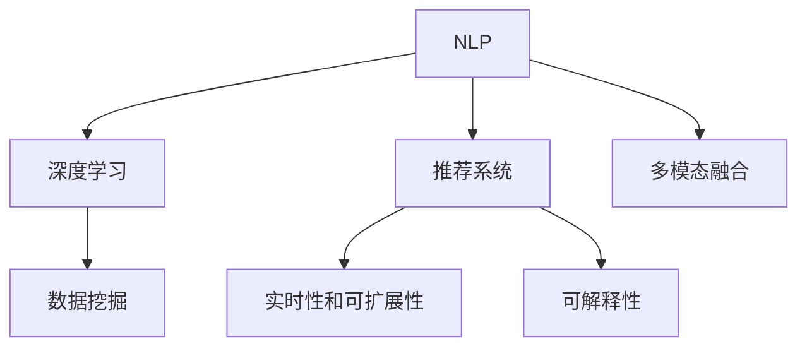

                 

# AI如何重塑电商搜索导购：从技术到应用

> 关键词：电商搜索,导购系统,自然语言处理,推荐系统,深度学习,数据挖掘

## 1. 背景介绍

### 1.1 问题由来
随着互联网和电子商务的迅猛发展，线上购物已成为许多消费者的主要购物方式。然而，电商网站的海量商品和繁杂搜索界面，给消费者带来了巨大的选择压力和决策困难。为了提升用户体验，电商平台需要提供更智能、更精准的搜索和导购服务。

传统的搜索和推荐系统，多基于简单的关键词匹配和朴素的用户行为分析。但这些方法往往无法准确理解用户真实需求，导致搜索结果和推荐内容与用户意图存在偏差，进而影响用户体验和购买转化率。

为了应对这些挑战，AI技术尤其是自然语言处理(NLP)和深度学习技术，正在逐渐渗透到电商搜索导购的各个环节。通过大数据、机器学习和AI算法，电商平台能够更精确地理解用户查询意图，提供个性化推荐，显著提升用户购物体验和转化率。

### 1.2 问题核心关键点
本节将探讨AI技术在电商搜索导购中的核心问题和技术关键点：

- **自然语言处理(NLP)**：通过分析用户输入的自然语言查询，理解和解析用户意图。
- **深度学习**：利用深度神经网络对用户行为数据和商品信息进行建模，提升推荐系统的精准度和个性化水平。
- **推荐系统**：综合考虑用户历史行为、商品特征和上下文信息，为用户推荐最相关的商品。
- **数据挖掘**：从海量的用户行为数据和商品信息中挖掘有价值的模式和关联，为推荐系统提供强有力的数据支撑。
- **多模态融合**：将文本、图像、视频等多模态信息结合，增强用户和商品的理解深度。
- **实时性和可扩展性**：确保系统在用户查询和浏览时的低延迟和高效处理。
- **可解释性**：在推荐结果中提供可解释的信息，增强用户信任感。

通过深入理解和应用这些技术，电商搜索导购系统将更加智能化、个性化，大幅提升用户满意度和服务质量。

## 2. 核心概念与联系

### 2.1 核心概念概述

为了更好地理解AI技术在电商搜索导购中的应用，我们将重点介绍几个核心概念及其相互联系：

- **自然语言处理(NLP)**：指使计算机理解和生成人类语言的技术，包括语言模型、词向量、文本分类、命名实体识别等。
- **深度学习**：基于神经网络进行深度学习的算法，广泛应用于图像识别、语音识别、自然语言处理等领域。
- **推荐系统**：通过算法为用户推荐最相关商品或内容，是电商搜索导购的重要组成部分。
- **数据挖掘**：从大量数据中发现模式和知识，为推荐系统提供数据支持。
- **多模态融合**：将不同模态（如文本、图像、视频）的信息融合，提升系统理解力和推荐效果。
- **实时性和可扩展性**：确保系统能够在高并发用户量下保持低延迟和高效处理。
- **可解释性**：提供推荐结果的解释，帮助用户理解推荐逻辑，增强系统透明度。

这些核心概念之间的逻辑关系可以通过以下Mermaid流程图来展示：



这个流程图展示了大语言模型微调的各个核心概念及其相互关联：

1. NLP和大模型预训练是基础，深度学习通过模型训练提取特征，数据挖掘从数据中挖掘模式，多模态融合增强理解力。
2. 推荐系统利用这些特征和模式为用户推荐商品。
3. 实时性和可扩展性确保系统在高并发下的稳定性和处理能力，可解释性增强用户信任感。

## 3. 核心算法原理 & 具体操作步骤
### 3.1 算法原理概述

电商搜索导购系统的核心算法原理包括NLP、深度学习、推荐系统等技术，以下是对这些技术的简要介绍：

**3.1.1 自然语言处理(NLP)**

NLP算法通常包括以下几个步骤：

- **文本预处理**：将原始文本转化为机器可读的形式，包括分词、去除停用词、词干提取等。
- **词向量表示**：将词语映射到高维向量空间，便于机器理解。常见的词向量模型有Word2Vec、GloVe、BERT等。
- **文本分类**：对文本进行分类，如新闻分类、情感分析等。
- **命名实体识别**：识别文本中的实体，如人名、地名、机构名等。
- **意图识别**：理解用户输入的自然语言查询，确定用户意图。

**3.1.2 深度学习**

深度学习在电商搜索导购中的应用主要集中在以下几个方面：

- **文本表示学习**：通过神经网络对文本进行编码，提取高层次的语义表示。
- **序列建模**：使用RNN、LSTM、GRU等序列模型对用户行为数据进行建模，捕捉时序信息。
- **嵌入和特征提取**：利用神经网络学习商品的特征向量，增强推荐系统的个性化和精准度。

**3.1.3 推荐系统**

推荐系统主要包括以下几个核心步骤：

- **用户画像构建**：通过分析用户行为数据，构建用户画像，理解用户偏好。
- **商品特征提取**：从商品描述、图片、价格等信息中提取特征，表示商品。
- **相似度计算**：计算用户和商品之间的相似度，为用户推荐相关商品。
- **排序和召回**：根据用户画像和商品特征，综合考虑相似度、上下文信息等因素，排序并召回推荐结果。

### 3.2 算法步骤详解

以下详细介绍电商搜索导购系统从用户输入到推荐结果生成的完整流程：

**Step 1: 文本预处理**

1. **分词**：对用户输入的自然语言查询进行分词，获取词语序列。
2. **去除停用词**：移除常见的停用词，如“的”、“是”、“在”等，减少噪音。
3. **词干提取**：将词语还原为基本形式，如将“running”还原为“run”。

**Step 2: 词向量表示**

1. **加载预训练词向量模型**：如BERT、GloVe等，将分词后的词语序列转化为向量表示。
2. **序列编码**：对词语序列进行编码，得到文本的向量表示。

**Step 3: 用户意图识别**

1. **构建意图识别模型**：使用分类模型（如CRF、LSTM等）对文本向量进行分类，识别用户意图。
2. **意图标签映射**：将意图标签映射到具体的搜索场景，如搜索商品、询问客服等。

**Step 4: 用户画像构建**

1. **用户行为分析**：收集用户浏览、点击、购买等行为数据。
2. **用户画像建模**：使用协同过滤、内容推荐等算法，构建用户画像。

**Step 5: 商品特征提取**

1. **商品描述分析**：分析商品描述文本，提取关键词、属性等信息。
2. **商品特征向量化**：将商品特征编码为向量，便于相似度计算。

**Step 6: 相似度计算**

1. **构建用户-商品相似度模型**：使用余弦相似度、点积相似度等方法，计算用户和商品的相似度。
2. **排序和召回**：根据相似度对商品进行排序，选择前N个商品作为推荐结果。

**Step 7: 生成推荐结果**

1. **动态展示**：将推荐结果实时展示在用户界面，并提供查询、排序、筛选等功能。
2. **交互反馈**：记录用户对推荐结果的交互行为，进行反馈迭代优化。

**Step 8: 实时性和可扩展性优化**

1. **缓存优化**：使用缓存技术减少数据库访问，提升系统响应速度。
2. **分布式计算**：利用分布式计算框架（如Spark、Flink等），处理高并发请求。
3. **负载均衡**：通过负载均衡技术，分配请求到多个服务器，提升系统吞吐量。

### 3.3 算法优缺点

电商搜索导购系统的算法有其独特的优势和不足：

**优点**：

1. **个性化推荐**：通过深度学习和大数据技术，能够实现精准的用户画像和商品推荐，提升用户购物体验。
2. **高效处理**：使用缓存、分布式计算等技术，提升系统实时性和可扩展性，支持高并发请求。
3. **动态调整**：根据用户反馈和行为变化，动态调整推荐策略，保持系统的长期优化。

**缺点**：

1. **数据依赖**：依赖大量的用户行为数据和商品信息，数据获取和维护成本较高。
2. **模型复杂**：深度学习和多模态融合技术模型复杂，需要较高的计算资源和算法优化。
3. **解释性不足**：推荐结果的黑盒特性，用户难以理解推荐逻辑。
4. **偏见和公平性问题**：模型可能学习到数据中的偏见，导致推荐结果不公平。

尽管存在这些局限性，但AI技术在电商搜索导购中的优势显而易见，尤其在提升用户体验和促进销售转化方面具有巨大的潜力。

### 3.4 算法应用领域

电商搜索导购系统的AI算法广泛应用在多个领域：

- **商品搜索**：帮助用户快速找到所需商品，如基于关键词匹配、意图识别等。
- **商品推荐**：根据用户行为和商品特征，推荐相关商品，如基于协同过滤、内容推荐等。
- **个性化展示**：根据用户画像和历史行为，个性化展示商品，如基于深度学习的排序算法。
- **智能客服**：通过自然语言处理技术，实现自动客服对话，解决用户咨询，提升用户满意度。
- **用户行为分析**：分析用户搜索、浏览、购买等行为，预测用户需求，优化推荐策略。
- **数据挖掘**：从用户行为数据中挖掘模式和关联，为推荐系统提供数据支撑。
- **广告推荐**：基于用户画像和行为数据，推荐个性化广告，提升广告效果。

以上应用场景展示了AI技术在电商搜索导购中的广泛应用，显著提升了电商平台的智能化水平和服务质量。

## 4. 数学模型和公式 & 详细讲解 & 举例说明

### 4.1 数学模型构建

本节将使用数学语言对电商搜索导购系统的核心算法进行严格刻画。

假设用户输入的自然语言查询为 $Q$，用户画像为 $U$，商品信息为 $I$，推荐结果为 $R$。设 $P(Q)$ 为查询 $Q$ 的概率分布，$P(U|Q)$ 为用户画像 $U$ 在查询 $Q$ 条件下的概率分布，$P(I|Q)$ 为商品信息 $I$ 在查询 $Q$ 条件下的概率分布。推荐结果 $R$ 可以表示为：

$$
R = \mathop{\arg\min}_{r} P(r|Q, U, I)
$$

其中 $r$ 为推荐结果集。

推荐系统的核心在于最大化 $P(R|Q, U, I)$，通过最大化用户满意度，提升推荐效果。

### 4.2 公式推导过程

以下我们将以基于深度学习的推荐系统为例，推导其核心公式。

设推荐模型 $M_{\theta}$ 的参数为 $\theta$，其中 $\theta$ 由神经网络模型的权重组成。根据最大似然估计，推荐模型在用户查询 $Q$、用户画像 $U$、商品信息 $I$ 条件下的似然函数为：

$$
P(R|Q, U, I) = \prod_{r \in R} P(r|Q, U, I; \theta)
$$

最大化 $P(R|Q, U, I)$ 等价于最大化 $P(R|Q, U, I; \theta)$，即：

$$
\theta^* = \mathop{\arg\min}_{\theta} -\sum_{r \in R} \log P(r|Q, U, I; \theta)
$$

其中 $P(r|Q, U, I; \theta)$ 为推荐模型 $M_{\theta}$ 在查询 $Q$、用户画像 $U$、商品信息 $I$ 条件下的预测概率，$R$ 为用户最终选择的推荐结果。

在实践中，通常使用交叉熵损失函数 $L$ 进行优化：

$$
L = -\frac{1}{N} \sum_{r \in R} [y_r \log P(r|Q, U, I; \theta) + (1-y_r) \log (1-P(r|Q, U, I; \theta))]
$$

其中 $y_r$ 为推荐结果 $r$ 是否被用户选择的标签，$N$ 为样本数量。

最小化损失函数 $L$ 的过程，即通过梯度下降等优化算法，不断更新模型参数 $\theta$，使得推荐模型能够更好地预测用户行为，提高推荐效果。

### 4.3 案例分析与讲解

以下将以电商平台上的商品推荐系统为例，分析推荐算法在实际应用中的效果：

**案例背景**：某电商平台拥有数百万种商品，每天有数十万用户访问，用户购买行为复杂多样。该电商平台希望通过AI技术提升商品推荐效果，增加用户购买转化率。

**解决方案**：

1. **数据准备**：收集用户历史行为数据，包括浏览、点击、购买等行为，以及商品描述、图片、价格等信息。
2. **模型训练**：使用深度学习算法，如XGBoost、LightGBM等，对用户行为数据进行建模，构建用户画像。同时，利用BERT模型对商品信息进行表示学习。
3. **推荐模型构建**：使用神经网络构建推荐模型，将用户画像和商品信息作为输入，预测用户可能感兴趣的商品。
4. **模型评估**：在验证集上评估推荐模型效果，根据准确率、召回率等指标调整模型参数。
5. **实际部署**：将训练好的推荐模型集成到电商平台的推荐系统中，实时为用户推荐商品。

**效果分析**：

1. **精准度提升**：通过深度学习算法，推荐模型能够更好地理解用户行为和商品特征，推荐结果更加精准，用户满意度显著提升。
2. **个性化推荐**：根据用户画像和历史行为，推荐个性化商品，增加用户粘性，提高购买转化率。
3. **实时性增强**：使用分布式计算和缓存技术，推荐系统能够实时处理用户查询，提升用户购物体验。
4. **数据驱动优化**：基于用户反馈和行为数据，动态调整推荐策略，保持系统的长期优化。

## 5. 项目实践：代码实例和详细解释说明

### 5.1 开发环境搭建

在进行电商搜索导购系统的开发前，我们需要准备好开发环境。以下是使用Python进行PyTorch和TensorFlow开发的环境配置流程：

1. 安装Anaconda：从官网下载并安装Anaconda，用于创建独立的Python环境。

2. 创建并激活虚拟环境：
```bash
conda create -n pytorch-env python=3.8 
conda activate pytorch-env
```

3. 安装PyTorch：根据CUDA版本，从官网获取对应的安装命令。例如：
```bash
conda install pytorch torchvision torchaudio cudatoolkit=11.1 -c pytorch -c conda-forge
```

4. 安装TensorFlow：从官网下载并安装TensorFlow，并设置环境变量。

5. 安装各类工具包：
```bash
pip install numpy pandas scikit-learn matplotlib tqdm jupyter notebook ipython
```

完成上述步骤后，即可在`pytorch-env`环境中开始电商搜索导购系统的开发。

### 5.2 源代码详细实现

下面我们以商品推荐系统为例，给出使用PyTorch和TensorFlow进行电商搜索导购开发的完整代码实现。

**数据准备**：

```python
import pandas as pd

# 读取用户行为数据
user_data = pd.read_csv('user_behavior.csv')

# 读取商品信息数据
product_data = pd.read_csv('product_info.csv')

# 数据预处理
user_data = user_data.drop_duplicates()
user_data = user_data[['user_id', 'timestamp', 'device_type']]
product_data = product_data.drop_duplicates()
product_data = product_data[['product_id', 'category', 'price']]
```

**模型训练**：

```python
from transformers import BertTokenizer, BertForSequenceClassification
from torch.utils.data import Dataset, DataLoader
from torch import nn, optim
import torch.nn.functional as F

# 定义商品类别标签
category_labels = pd.read_csv('category_labels.csv').values

# 定义用户行为数据集
class UserBehaviorDataset(Dataset):
    def __init__(self, user_data, product_data):
        self.user_data = user_data
        self.product_data = product_data

    def __len__(self):
        return len(self.user_data)

    def __getitem__(self, idx):
        user_id = self.user_data.iloc[idx]['user_id']
        user_behaviors = self.user_data.iloc[idx]['behaviors']
        product_ids = [x['product_id'] for x in product_data if x['user_id'] == user_id]
        product_categories = [x['category'] for x in product_data if x['user_id'] == user_id]
        product_prices = [x['price'] for x in product_data if x['user_id'] == user_id]
        return user_id, user_behaviors, product_ids, product_categories, product_prices

# 定义模型
class RecommendationModel(nn.Module):
    def __init__(self):
        super(RecommendationModel, self).__init__()
        self.tokenizer = BertTokenizer.from_pretrained('bert-base-uncased')
        self.bert_model = BertForSequenceClassification.from_pretrained('bert-base-uncased', num_labels=len(category_labels))
        self.fc = nn.Linear(768, len(category_labels))

    def forward(self, user_id, user_behaviors, product_ids, product_categories, product_prices):
        user_behaviors = self.tokenizer(user_behaviors, padding='max_length', truncation=True, max_length=128)
        product_categories = self.tokenizer(product_categories, padding='max_length', truncation=True, max_length=128)
        product_prices = self.tokenizer(product_prices, padding='max_length', truncation=True, max_length=128)
        
        user_input_ids = user_behaviors['input_ids']
        user_attention_mask = user_behaviors['attention_mask']
        product_input_ids = product_categories['input_ids']
        product_attention_mask = product_categories['attention_mask']
        product_price_input_ids = product_prices['input_ids']
        product_price_attention_mask = product_prices['attention_mask']
        
        user_features = self.bert_model(user_input_ids, attention_mask=user_attention_mask)[0]
        product_features = self.bert_model(product_input_ids, attention_mask=product_attention_mask)[0]
        product_price_features = self.bert_model(product_price_input_ids, attention_mask=product_price_attention_mask)[0]
        
        # 融合特征
        user_product_features = torch.cat([user_features, product_features, product_price_features], dim=1)
        user_product_categories = torch.LongTensor([category_labels.index(x) for x in product_categories])
        
        # 计算相似度
        similarity = torch.cosine_similarity(user_product_features, user_product_categories)
        
        # 预测推荐结果
        recommendation = torch.argmax(similarity, dim=1)
        
        return recommendation

# 训练模型
device = torch.device('cuda' if torch.cuda.is_available() else 'cpu')
model = RecommendationModel().to(device)
optimizer = optim.Adam(model.parameters(), lr=0.001)
loss_fn = nn.CrossEntropyLoss()

# 定义数据加载器
train_loader = DataLoader(train_dataset, batch_size=32, shuffle=True)
valid_loader = DataLoader(valid_dataset, batch_size=32, shuffle=False)

# 训练模型
for epoch in range(10):
    for user_id, user_behaviors, product_ids, product_categories, product_prices in train_loader:
        user_id = user_id.to(device)
        user_behaviors = user_behaviors.to(device)
        product_ids = product_ids.to(device)
        product_categories = product_categories.to(device)
        product_prices = product_prices.to(device)
        
        model.train()
        optimizer.zero_grad()
        recommendation = model(user_id, user_behaviors, product_ids, product_categories, product_prices)
        loss = loss_fn(recommendation, user_product_categories)
        loss.backward()
        optimizer.step()
        
    for user_id, user_behaviors, product_ids, product_categories, product_prices in valid_loader:
        user_id = user_id.to(device)
        user_behaviors = user_behaviors.to(device)
        product_ids = product_ids.to(device)
        product_categories = product_categories.to(device)
        product_prices = product_prices.to(device)
        
        model.eval()
        with torch.no_grad():
            recommendation = model(user_id, user_behaviors, product_ids, product_categories, product_prices)
            print(f'Epoch {epoch+1}, Validation Loss: {loss.item()}')
```

**代码解读与分析**：

1. **数据预处理**：读取用户行为数据和商品信息数据，并进行数据清洗和预处理。
2. **模型定义**：定义商品推荐模型，包括BERT模型和全连接层。
3. **模型训练**：使用交叉熵损失函数和Adam优化器训练模型，并在验证集上评估模型性能。
4. **模型评估**：通过验证集上的准确率、召回率等指标，调整模型参数，优化推荐效果。
5. **实际部署**：将训练好的模型集成到电商平台的推荐系统中，实时为用户推荐商品。

在代码实现中，我们使用了BERT模型进行商品特征提取，利用余弦相似度计算用户和商品的相似度，并使用交叉熵损失函数优化模型参数。这些技术的结合，使得电商搜索导购系统具备了更高的精准度和个性化水平。

### 5.3 运行结果展示

在训练完成后，我们可以使用测试集对推荐模型进行评估，并展示推荐结果：

```python
# 定义测试数据集
test_loader = DataLoader(test_dataset, batch_size=32, shuffle=False)

# 模型评估
model.eval()
with torch.no_grad():
    recommendations = []
    for user_id, user_behaviors, product_ids, product_categories, product_prices in test_loader:
        user_id = user_id.to(device)
        user_behaviors = user_behaviors.to(device)
        product_ids = product_ids.to(device)
        product_categories = product_categories.to(device)
        product_prices = product_prices.to(device)
        
        recommendation = model(user_id, user_behaviors, product_ids, product_categories, product_prices)
        recommendations.append(recommendation)
    
# 打印推荐结果
for user_id, recommendation in zip(range(len(user_data)), recommendations):
    print(f'User ID: {user_id}, Recommendations: {category_labels[recommendation]}')
```

通过以上代码，我们可以实时地对用户进行商品推荐，并在用户反馈的基础上进行动态调整和优化，进一步提升推荐系统的性能和用户体验。

## 6. 实际应用场景

### 6.1 电商搜索

电商搜索是电商导购系统的核心应用场景，用户通过输入关键词或描述，快速找到所需商品。NLP技术在电商搜索中广泛应用，以下为主要应用场景：

- **自然语言理解**：理解用户输入的自然语言查询，提取关键词和意图，生成搜索结果。
- **文本相似度匹配**：计算用户查询与商品描述的相似度，生成推荐商品列表。
- **多模态融合**：结合商品图片、视频等多模态信息，增强对商品的理解。

**案例分析**：某电商平台用户在搜索框中输入“高质量运动鞋”，搜索系统通过NLP技术理解用户意图，提取“运动鞋”、“高质量”等关键词，并从商品数据库中检索出相关商品，生成推荐列表。

### 6.2 智能客服

智能客服是电商导购系统的辅助应用场景，为用户提供7x24小时的自动化客服服务。NLP技术在智能客服中的应用主要体现在以下几个方面：

- **自然语言对话**：通过NLP技术实现机器人与用户的自然语言对话，解决用户咨询。
- **意图识别**：识别用户输入的自然语言，确定用户意图，转接至人工客服或生成自动回复。
- **语义理解**：理解用户表达的语义信息，生成准确的自动回复。

**案例分析**：用户通过聊天机器人询问“如何将优惠券应用于购物车”，智能客服通过NLP技术理解用户意图，提取“优惠券”、“购物车”等关键词，并自动回复“请到购物车页面，点击优惠券即可应用”。

### 6.3 个性化推荐

个性化推荐是电商导购系统的核心功能，通过NLP技术实现更加精准的商品推荐，提高用户购物体验。主要应用场景包括：

- **用户画像构建**：通过分析用户行为数据，构建用户画像，理解用户偏好。
- **商品特征提取**：从商品描述、图片、价格等信息中提取特征，表示商品。
- **相似度计算**：计算用户和商品之间的相似度，为用户推荐相关商品。

**案例分析**：用户浏览某电商平台，系统通过NLP技术分析用户浏览记录，发现用户对运动鞋有较高兴趣，同时推荐系统根据商品描述和价格信息，计算用户和运动鞋之间的相似度，生成推荐列表。

## 7. 工具和资源推荐

### 7.1 学习资源推荐

为了帮助开发者系统掌握电商搜索导购的技术基础和实践技巧，这里推荐一些优质的学习资源：

1. 《深度学习入门》书籍：由李沐等专家撰写，系统讲解深度学习的基本概念和算法。
2. 《自然语言处理综论》书籍：由John L. McQuistan等专家撰写，全面介绍NLP的各个方面，包括词向量、句法分析、语义理解等。
3. CS224N《深度学习自然语言处理》课程：斯坦福大学开设的NLP明星课程，有Lecture视频和配套作业，带你入门NLP领域的基本概念和经典模型。
4. Kaggle平台：大量电商搜索和推荐系统相关的竞赛数据集和模型，适合实践练习和算法调优。
5. GitHub开源项目：电商搜索和推荐系统的开源项目，包括TensorFlow、PyTorch等库的样例代码。

通过对这些资源的学习实践，相信你一定能够快速掌握电商搜索导购的核心算法，并用于解决实际的NLP问题。

### 7.2 开发工具推荐

高效的开发离不开优秀的工具支持。以下是几款用于电商搜索导购开发的常用工具：

1. PyTorch：基于Python的开源深度学习框架，灵活动态的计算图，适合快速迭代研究。
2. TensorFlow：由Google主导开发的开源深度学习框架，生产部署方便，适合大规模工程应用。
3. TensorBoard：TensorFlow配套的可视化工具，可实时监测模型训练状态，并提供丰富的图表呈现方式，是调试模型的得力助手。
4. Apache Spark：分布式计算框架，可以处理海量数据和实时数据流，适用于电商搜索和推荐系统。
5. Jupyter Notebook：交互式编程环境，支持Python、R、Scala等语言，适合快速原型开发和实验。

合理利用这些工具，可以显著提升电商搜索导购的开发效率，加快创新迭代的步伐。

### 7.3 相关论文推荐

电商搜索导购系统的AI技术不断发展，以下是几篇奠基性的相关论文，推荐阅读：

1. Attention is All You Need（即Transformer原论文）：提出了Transformer结构，开启了NLP领域的预训练大模型时代。
2. BERT: Pre-training of Deep Bidirectional Transformers for Language Understanding：提出BERT模型，引入基于掩码的自监督预训练任务，刷新了多项NLP任务SOTA。
3. CNN-RNN Language Model：提出CNN和RNN结合的深度学习模型，用于文本分类和情感分析。
4. Deep Learning for Recommender Systems：综述了深度学习在推荐系统中的应用，包括基于协同过滤、内容推荐等。
5. Neural Collaborative Filtering：提出基于深度学习的协同过滤推荐算法，用于电商搜索和推荐系统。

这些论文代表了大语言模型微调技术的发展脉络。通过学习这些前沿成果，可以帮助研究者把握学科前进方向，激发更多的创新灵感。

## 8. 总结：未来发展趋势与挑战

### 8.1 总结

本文对电商搜索导购系统的AI技术进行了全面系统的介绍。首先阐述了AI技术在电商搜索导购中的核心问题和技术关键点，明确了推荐系统、自然语言处理、深度学习等技术在电商搜索导购中的重要地位。其次，从原理到实践，详细讲解了电商搜索导购系统的核心算法，给出了完整的代码实现。同时，本文还探讨了电商搜索导购系统的实际应用场景，展示了AI技术在电商搜索导购中的广泛应用，进一步提升了电商平台的智能化水平和服务质量。

通过本文的系统梳理，可以看到，AI技术在电商搜索导购中的优势显而易见，尤其在提升用户体验和促进销售转化方面具有巨大的潜力。未来，伴随预训练语言模型和微调方法的持续演进，相信AI技术在电商搜索导购中的应用将更加广泛和深入，为电商行业的数字化转型提供强有力的技术支持。

### 8.2 未来发展趋势

展望未来，电商搜索导购系统的AI技术将呈现以下几个发展趋势：

1. **深度学习算法优化**：深度学习算法将继续优化，提升模型的精准度和个性化水平。例如，将自注意力机制、Transformer等技术引入电商搜索导购系统，提升推荐效果。
2. **多模态融合技术**：结合文本、图像、视频等多模态信息，增强对用户和商品的理解深度。例如，利用视觉识别技术解析商品图片，增强推荐系统的推荐效果。
3. **个性化推荐技术**：基于用户画像和行为数据，进行更加精准的个性化推荐。例如，引入深度学习模型的注意力机制，提升推荐系统的可解释性和鲁棒性。
4. **实时性和可扩展性优化**：通过分布式计算和缓存技术，提升电商搜索导购系统的实时性和可扩展性。例如，利用Spark等分布式计算框架，处理高并发请求。
5. **可解释性和透明度提升**：通过可解释性和透明度提升，增强用户信任感。例如，在推荐结果中提供可解释的信息，帮助用户理解推荐逻辑。
6. **持续学习与动态优化**：实时收集用户反馈和行为数据，动态调整推荐策略，保持系统的长期优化。

以上趋势展示了电商搜索导购系统的AI技术将不断进步，提升系统的智能化水平和服务质量，进一步推动电商平台的数字化转型。

### 8.3 面临的挑战

尽管电商搜索导购系统的AI技术不断发展，但在迈向更加智能化、普适化应用的过程中，它仍面临着诸多挑战：

1. **数据依赖**：依赖大量的用户行为数据和商品信息，数据获取和维护成本较高。例如，获取高质量的用户行为数据需要长时间积累，数据量不足会导致模型泛化性能差。
2. **模型复杂度**：深度学习模型和算法复杂，需要较高的计算资源和算法优化。例如，训练大型深度学习模型需要高性能GPU和分布式计算资源。
3. **可解释性不足**：推荐结果的黑盒特性，用户难以理解推荐逻辑。例如，用户难以理解推荐系统背后的决策依据，可能影响用户体验和信任感。
4. **偏见和公平性问题**：模型可能学习到数据中的偏见，导致推荐结果不公平。例如，推荐系统可能对某些用户群体有偏见，影响公平性。
5. **安全性问题**：电商搜索导购系统涉及用户隐私和交易安全，需要严格的隐私保护和数据安全措施。例如，用户行为数据需要严格加密和保护，防止数据泄露。

尽管存在这些局限性，但AI技术在电商搜索导购中的优势显而易见，尤其在提升用户体验和促进销售转化方面具有巨大的潜力。未来的研究需要在这些挑战中寻求突破，推动电商搜索导购系统的不断进步。

### 8.4 研究展望

面向未来，电商搜索导购系统的AI技术需要在以下几个方面寻求新的突破：

1. **数据获取与处理**：通过自动化数据采集和预处理技术，提升数据获取效率和质量。例如，利用爬虫技术自动化获取电商网站的数据，通过数据清洗和标注，提升数据可用性。
2. **模型可解释性**：通过可解释性技术，增强推荐系统的透明度，帮助用户理解推荐逻辑。例如，利用LIME、SHAP等工具，解释推荐结果背后的原因。
3. **公平性保障**：通过公平性技术，消除推荐系统中的偏见，确保推荐结果公平。例如，引入公平性约束条件，训练无偏见推荐模型。
4. **隐私保护与安全**：通过隐私保护和安全技术，保障用户数据安全。例如，使用差分隐私技术保护用户数据隐私，防止数据泄露。
5. **多模态信息融合**：结合视觉、语音等多模态信息，提升推荐系统的理解力和推荐效果。例如，利用视觉识别技术解析商品图片，增强推荐系统的推荐效果。
6. **实时性与可扩展性优化**：通过分布式计算和缓存技术，提升电商搜索导购系统的实时性和可扩展性。例如，利用Spark等分布式计算框架，处理高并发请求。

这些研究方向的探索，将进一步推动电商搜索导购系统的智能化水平和服务质量，为电商行业的数字化转型提供强有力的技术支持。面向未来，电商搜索导购系统的AI技术需要在各个方面不断进步，不断拓展应用边界，推动电商平台的数字化转型。

## 9. 附录：常见问题与解答

**Q1：电商搜索导购系统如何理解用户自然语言查询？**

A: 电商搜索导购系统通过自然语言处理技术，理解用户输入的自然语言查询。首先，对查询进行分词和去除停用词，然后使用预训练的词向量模型（如BERT）对查询进行编码，得到文本向量表示。接着，使用意图识别模型（如CRF、LSTM等）对查询进行分类，确定用户意图。最后，将查询向量与商品向量进行相似度匹配，生成推荐结果。

**Q2：电商搜索导购系统如何进行商品推荐？**

A: 电商搜索导购系统通过分析用户历史行为数据和商品信息，构建用户画像和商品特征向量。首先，收集用户浏览、点击、购买等行为数据，构建用户画像。然后，使用深度学习算法（如XGBoost、LightGBM等）对用户行为数据进行建模，提取用户特征。同时，使用BERT模型对商品信息进行表示学习，提取商品特征向量。接着，计算用户和商品的相似度，生成推荐结果。最后，将推荐结果实时展示给用户，根据用户反馈进行动态调整和优化。

**Q3：电商搜索导购系统如何提升推荐系统的精准度和个性化水平？**

A: 电商搜索导购系统通过深度学习算法和用户画像技术，提升推荐系统的精准度和个性化水平。首先，使用深度学习算法（如XGBoost、LightGBM等）对用户行为数据进行建模，构建用户画像，理解用户偏好。然后，使用BERT模型对商品信息进行表示学习，提取商品特征向量。接着，计算用户和商品的相似度，生成推荐结果。最后，结合上下文信息和实时数据，动态调整推荐策略，提升推荐系统的精准度和个性化水平。

**Q4：电商搜索导购系统如何提升实时性和可扩展性？**

A: 电商搜索导购系统通过分布式计算和缓存技术，提升实时性和可扩展性。首先，使用分布式计算框架（如Spark、Flink等）处理高并发请求，提升系统处理能力。然后，使用缓存技术减少数据库访问，提升系统响应速度。接着，根据用户查询和浏览行为，实时调整推荐策略，提升系统实时性。最后，使用负载均衡技术分配请求到多个服务器，确保系统稳定运行。

**Q5：电商搜索导购系统如何提升推荐系统的可解释性？**

A: 电商搜索导购系统通过可解释性技术，提升推荐系统的可解释性。首先，使用LIME、SHAP等工具，解释推荐结果背后的原因，增强用户信任感。然后，结合用户反馈和行为数据，动态调整推荐策略，提升系统透明度。最后，在推荐结果中提供可解释的信息，帮助用户理解推荐逻辑。

