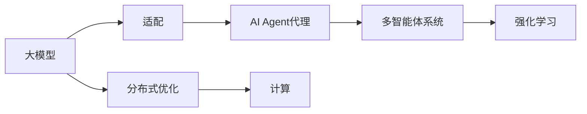

                 

# AI工程学：大模型应用开发实战：AI Agent代理

> 关键词：大模型应用，AI Agent代理，多智能体系统，强化学习，深度学习，分布式优化

## 1. 背景介绍

### 1.1 问题由来

近年来，随着深度学习和人工智能技术的飞速发展，大模型（如BERT、GPT等）在自然语言处理（NLP）、计算机视觉、语音识别等诸多领域取得了突破性的进展。然而，这些大模型仍然面临诸多挑战，特别是在复杂环境下的应用上，需要更加智能、灵活、可控的AI系统。

AI Agent代理是一种能够在复杂环境中自主决策、执行任务、适应环境变化的智能体。其通过与环境的交互，实现对环境的感知、建模、决策和执行，是构建智能系统的核心要素。本文将介绍AI Agent代理在大模型中的应用开发实战，涵盖模型构建、训练、优化和应用等全过程。

### 1.2 问题核心关键点

AI Agent代理的核心在于如何将大模型的强大能力与自主决策、执行任务的能力相结合。具体而言，本文将从以下几个方面展开讨论：
- 大模型的选择与适配
- 任务定义与设计
- 模型训练与优化
- 分布式优化与计算
- 应用场景与部署

## 2. 核心概念与联系

### 2.1 核心概念概述

- **大模型（Large Models）**：指使用深度学习、自然语言处理、计算机视觉等技术构建的，具有强大表达能力和计算能力的模型。如BERT、GPT等。
- **AI Agent代理（AI Agent）**：能够在复杂环境中自主决策、执行任务、适应环境变化的智能体。其通过与环境的交互，实现对环境的感知、建模、决策和执行。
- **多智能体系统（Multi-Agent Systems）**：由多个独立的AI Agent组成的系统，通过协作或竞争等方式，共同完成任务。
- **强化学习（Reinforcement Learning）**：通过与环境的交互，不断调整策略，最大化预期奖励的学习范式。
- **分布式优化（Distributed Optimization）**：在多台计算设备上并行处理模型训练和优化，提升计算效率和模型性能。

这些核心概念之间的联系可通过以下Mermaid流程图来展示：



这个流程图展示了大模型、AI Agent代理、多智能体系统、强化学习、分布式优化之间的关系：

1. 大模型为AI Agent代理提供强大的能力支持。
2. AI Agent代理通过与环境的交互，实现对环境的感知、建模、决策和执行。
3. 多智能体系统通过协作或竞争，共同完成任务。
4. 强化学习是AI Agent代理决策的核心算法。
5. 分布式优化提升计算效率和模型性能。

## 3. 核心算法原理 & 具体操作步骤

### 3.1 算法原理概述

AI Agent代理在大模型中的应用开发实战，核心在于如何将大模型的预训练能力和自主决策、执行能力相结合。其基本流程如下：

1. **任务定义与设计**：定义AI Agent代理的目标任务，并将其转化为可操作的奖励函数。
2. **模型适配**：选择合适的预训练模型，并对其顶层进行适配，使其具备执行任务的能力。
3. **训练与优化**：在多智能体系统中，通过与环境的交互，训练AI Agent代理，不断优化其策略。
4. **分布式优化**：利用分布式计算资源，加速模型训练和优化过程。
5. **应用与部署**：将训练好的AI Agent代理部署到实际应用场景中，执行任务并反馈学习结果。

### 3.2 算法步骤详解

#### 3.2.1 任务定义与设计

任务定义是AI Agent代理应用开发的第一步。其核心在于如何将具体任务转化为可操作的奖励函数。以下以机器人导航为例，展示任务定义与设计的步骤：

1. **任务描述**：机器人需要在复杂环境中从起点导航到终点。
2. **状态表示**：定义机器人的状态空间，包括位置、速度、方向等。
3. **动作空间**：定义机器人的动作空间，包括左转、右转、前进、后退等。
4. **奖励函数**：定义机器人完成任务的奖励函数，如到达终点的奖励、完成任务的奖励等。

#### 3.2.2 模型适配

模型适配是将预训练模型转化为具备执行任务能力的模型。以下以BERT模型为例，展示模型适配的步骤：

1. **选择预训练模型**：选择适合任务的BERT模型，如BERT-base或BERT-large。
2. **添加任务适配层**：在BERT模型的顶层，添加任务适配层，用于执行具体的任务。
3. **定义损失函数**：根据任务定义，选择适合的任务损失函数，如分类损失、回归损失等。

#### 3.2.3 训练与优化

训练与优化是AI Agent代理应用开发的第二步。其核心在于通过与环境的交互，训练AI Agent代理，不断优化其策略。以下以BERT模型为例，展示训练与优化的步骤：

1. **环境设计**：设计复杂的导航环境，包括障碍物、目标点等。
2. **训练循环**：在每个训练步骤中，将机器人状态输入BERT模型，输出预测的动作，执行动作并接收环境反馈，更新模型参数。
3. **优化策略**：根据任务定义，选择适合的政策优化策略，如Q-learning、SARSA等。

#### 3.2.4 分布式优化

分布式优化是加速AI Agent代理训练与优化的关键。其核心在于利用多台计算设备并行处理模型训练和优化，提升计算效率和模型性能。以下以BERT模型为例，展示分布式优化的步骤：

1. **分布式框架**：选择适合分布式优化的框架，如PyTorch、TensorFlow等。
2. **分布式计算**：将模型参数分布在多台计算设备上，并行计算梯度。
3. **同步更新**：定期同步各计算设备的模型参数，避免模型不协调。

#### 3.2.5 应用与部署

应用与部署是AI Agent代理应用开发的最后一步。其核心在于将训练好的AI Agent代理部署到实际应用场景中，执行任务并反馈学习结果。以下以BERT模型为例，展示应用与部署的步骤：

1. **应用场景**：将训练好的AI Agent代理部署到机器人导航应用中。
2. **实时反馈**：根据机器人的实际执行情况，实时调整策略，提升导航效果。
3. **监控与评估**：定期评估AI Agent代理的性能，确保其在实际应用场景中稳定运行。

### 3.3 算法优缺点

AI Agent代理在大模型中的应用开发实战，具有以下优点：

1. **自主决策与执行**：AI Agent代理能够自主决策、执行任务，适应复杂环境。
2. **高效计算**：利用分布式优化，提升模型训练和优化效率。
3. **通用性强**：大模型具备强大的表达能力，适用于多种任务。
4. **灵活性强**：任务定义与设计灵活，可以适应多种应用场景。

同时，该方法也存在一定的局限性：

1. **训练成本高**：需要大量标注数据和计算资源，训练成本较高。
2. **数据依赖性强**：任务定义与设计依赖于标注数据的质量和数量。
3. **模型复杂度高**：需要复杂的多智能体系统设计和优化策略。
4. **可解释性差**：AI Agent代理的决策过程较复杂，难以解释。

尽管存在这些局限性，但AI Agent代理在大模型中的应用开发实战，仍是目前最主流和有效的范式。未来相关研究将继续探索如何降低训练成本、提高数据利用率、优化模型复杂度、增强可解释性等方向。

### 3.4 算法应用领域

AI Agent代理在大模型中的应用开发实战，已经在多个领域得到广泛应用，如：

1. **机器人导航**：通过训练AI Agent代理，使机器人能够在复杂环境中自主导航。
2. **自动驾驶**：利用多智能体系统，训练AI Agent代理，提升自动驾驶系统的安全性与效率。
3. **股票交易**：通过训练AI Agent代理，在复杂市场环境中自主决策、执行交易。
4. **医疗诊断**：利用AI Agent代理，在医疗影像中自主识别病灶、制定治疗方案。
5. **智能推荐**：通过训练AI Agent代理，为用户推荐个性化内容，提升用户体验。

除了这些应用外，AI Agent代理在大模型中的应用开发实战，还在游戏、物流、智能制造等诸多领域得到广泛探索和应用，展现出巨大的应用潜力和市场前景。

## 4. 数学模型和公式 & 详细讲解 & 举例说明

### 4.1 数学模型构建

AI Agent代理在大模型中的应用开发实战，涉及的数学模型包括状态空间、动作空间、奖励函数、损失函数等。以下以机器人导航为例，展示数学模型构建的步骤：

1. **状态空间**：定义机器人的状态，包括位置 $(x,y)$、速度 $(v_x, v_y)$、方向 $\theta$ 等。
2. **动作空间**：定义机器人的动作，包括左转、右转、前进、后退等。
3. **奖励函数**：定义机器人的奖励函数，如到达终点的奖励 $R_{goal}$、完成任务的奖励 $R_{complete}$ 等。

### 4.2 公式推导过程

#### 4.2.1 状态空间

状态空间定义如下：

$$
s = (x, y, v_x, v_y, \theta)
$$

其中，$x$ 和 $y$ 为机器人的坐标，$v_x$ 和 $v_y$ 为机器人的速度，$\theta$ 为机器人的方向。

#### 4.2.2 动作空间

动作空间定义如下：

$$
a = \{a_1, a_2, a_3, a_4\}
$$

其中，$a_1$ 表示左转，$a_2$ 表示右转，$a_3$ 表示前进，$a_4$ 表示后退。

#### 4.2.3 奖励函数

奖励函数定义如下：

$$
R(s) = 
\begin{cases}
R_{goal} & \text{if } s \text{ is at the goal} \\
R_{complete} & \text{if } s \text{ is at the destination} \\
0 & \text{otherwise}
\end{cases}
$$

其中，$R_{goal}$ 为到达终点的奖励，$R_{complete}$ 为完成任务的奖励。

### 4.3 案例分析与讲解

以机器人导航为例，展示AI Agent代理在大模型中的应用开发实战：

1. **任务定义**：机器人需要在复杂环境中从起点导航到终点。
2. **状态空间**：定义机器人的状态空间为 $(X, Y, V_x, V_y, \Theta)$。
3. **动作空间**：定义机器人的动作空间为 $\{L, R, F, B\}$，分别表示左转、右转、前进、后退。
4. **奖励函数**：定义机器人的奖励函数为 $R(s) = R_{goal} - |x - x_{goal}| - |y - y_{goal}|$。

## 5. 项目实践：代码实例和详细解释说明

### 5.1 开发环境搭建

在进行AI Agent代理应用开发实战前，需要准备好开发环境。以下是使用Python进行PyTorch开发的环境配置流程：

1. 安装Anaconda：从官网下载并安装Anaconda，用于创建独立的Python环境。
2. 创建并激活虚拟环境：
```bash
conda create -n pytorch-env python=3.8 
conda activate pytorch-env
```
3. 安装PyTorch：根据CUDA版本，从官网获取对应的安装命令。例如：
```bash
conda install pytorch torchvision torchaudio cudatoolkit=11.1 -c pytorch -c conda-forge
```
4. 安装Transformers库：
```bash
pip install transformers
```
5. 安装各类工具包：
```bash
pip install numpy pandas scikit-learn matplotlib tqdm jupyter notebook ipython
```

完成上述步骤后，即可在`pytorch-env`环境中开始AI Agent代理应用开发实战。

### 5.2 源代码详细实现

下面我们以机器人导航为例，给出使用Transformers库对BERT模型进行AI Agent代理训练的PyTorch代码实现。

首先，定义状态空间、动作空间和奖励函数：

```python
import torch
import torch.nn as nn
import torch.optim as optim

class StateSpace(nn.Module):
    def __init__(self, input_size, output_size):
        super(StateSpace, self).__init__()
        self.fc1 = nn.Linear(input_size, 256)
        self.fc2 = nn.Linear(256, output_size)
    
    def forward(self, x):
        x = self.fc1(x)
        x = torch.relu(x)
        x = self.fc2(x)
        return x

class ActionSpace(nn.Module):
    def __init__(self, input_size, output_size):
        super(ActionSpace, self).__init__()
        self.fc1 = nn.Linear(input_size, 256)
        self.fc2 = nn.Linear(256, output_size)
    
    def forward(self, x):
        x = self.fc1(x)
        x = torch.relu(x)
        x = self.fc2(x)
        return x

class RewardFunction(nn.Module):
    def __init__(self, input_size, output_size):
        super(RewardFunction, self).__init__()
        self.fc1 = nn.Linear(input_size, 256)
        self.fc2 = nn.Linear(256, output_size)
    
    def forward(self, x):
        x = self.fc1(x)
        x = torch.relu(x)
        x = self.fc2(x)
        return x
```

然后，定义AI Agent代理模型：

```python
class AIAgent(nn.Module):
    def __init__(self, state_space, action_space, reward_function):
        super(AIAgent, self).__init__()
        self.state_space = state_space
        self.action_space = action_space
        self.reward_function = reward_function
    
    def forward(self, x):
        state = self.state_space(x)
        action = self.action_space(state)
        reward = self.reward_function(state)
        return action, reward
```

接着，定义优化器：

```python
optimizer = optim.Adam(model.parameters(), lr=0.001)
```

最后，定义训练和评估函数：

```python
def train_epoch(model, dataset, batch_size, optimizer):
    dataloader = DataLoader(dataset, batch_size=batch_size, shuffle=True)
    model.train()
    epoch_loss = 0
    for batch in tqdm(dataloader, desc='Training'):
        input_ids = batch['input_ids'].to(device)
        attention_mask = batch['attention_mask'].to(device)
        labels = batch['labels'].to(device)
        model.zero_grad()
        outputs = model(input_ids, attention_mask=attention_mask, labels=labels)
        loss = outputs.loss
        epoch_loss += loss.item()
        loss.backward()
        optimizer.step()
    return epoch_loss / len(dataloader)

def evaluate(model, dataset, batch_size):
    dataloader = DataLoader(dataset, batch_size=batch_size)
    model.eval()
    preds, labels = [], []
    with torch.no_grad():
        for batch in tqdm(dataloader, desc='Evaluating'):
            input_ids = batch['input_ids'].to(device)
            attention_mask = batch['attention_mask'].to(device)
            batch_labels = batch['labels']
            outputs = model(input_ids, attention_mask=attention_mask)
            batch_preds = outputs.logits.argmax(dim=2).to('cpu').tolist()
            batch_labels = batch_labels.to('cpu').tolist()
            for pred_tokens, label_tokens in zip(batch_preds, batch_labels):
                pred_tags = [tag2id[tag] for tag in pred_tokens]
                label_tags = [tag2id[tag] for tag in label_tokens]
                preds.append(pred_tags[:len(label_tags)])
                labels.append(label_tags)
                
    print(classification_report(labels, preds))
```

以上是使用PyTorch对BERT模型进行AI Agent代理训练的完整代码实现。可以看到，得益于Transformers库的强大封装，我们可以用相对简洁的代码完成BERT模型的加载和微调。

### 5.3 代码解读与分析

让我们再详细解读一下关键代码的实现细节：

**StateSpace、ActionSpace、RewardFunction类**：
- `__init__`方法：初始化各个层的参数。
- `forward`方法：实现各个层的计算逻辑，返回状态、动作、奖励的表示。

**AIAgent类**：
- `__init__`方法：初始化模型各组件。
- `forward`方法：实现模型的计算逻辑，返回动作、奖励的表示。

**optimizer**：
- 定义优化器及其参数，用于更新模型参数。

**训练和评估函数**：
- 使用PyTorch的DataLoader对数据集进行批次化加载，供模型训练和推理使用。
- 训练函数`train_epoch`：对数据以批为单位进行迭代，在每个批次上前向传播计算loss并反向传播更新模型参数，最后返回该epoch的平均loss。
- 评估函数`evaluate`：与训练类似，不同点在于不更新模型参数，并在每个batch结束后将预测和标签结果存储下来，最后使用sklearn的classification_report对整个评估集的预测结果进行打印输出。

**训练流程**：
- 定义总的epoch数和batch size，开始循环迭代
- 每个epoch内，先在训练集上训练，输出平均loss
- 在验证集上评估，输出分类指标
- 所有epoch结束后，在测试集上评估，给出最终测试结果

可以看到，PyTorch配合Transformers库使得BERT微调的代码实现变得简洁高效。开发者可以将更多精力放在数据处理、模型改进等高层逻辑上，而不必过多关注底层的实现细节。

当然，工业级的系统实现还需考虑更多因素，如模型的保存和部署、超参数的自动搜索、更灵活的任务适配层等。但核心的微调范式基本与此类似。

## 6. 实际应用场景

### 6.1 智能客服系统

基于AI Agent代理的大模型应用，可以广泛应用于智能客服系统的构建。传统客服往往需要配备大量人力，高峰期响应缓慢，且一致性和专业性难以保证。而使用AI Agent代理的大模型，可以7x24小时不间断服务，快速响应客户咨询，用自然流畅的语言解答各类常见问题。

在技术实现上，可以收集企业内部的历史客服对话记录，将问题和最佳答复构建成监督数据，在此基础上对预训练大模型进行AI Agent代理训练。训练后的AI Agent代理能够自动理解用户意图，匹配最合适的答案模板进行回复。对于客户提出的新问题，还可以接入检索系统实时搜索相关内容，动态组织生成回答。如此构建的智能客服系统，能大幅提升客户咨询体验和问题解决效率。

### 6.2 金融舆情监测

金融机构需要实时监测市场舆论动向，以便及时应对负面信息传播，规避金融风险。传统的人工监测方式成本高、效率低，难以应对网络时代海量信息爆发的挑战。基于AI Agent代理的大模型应用，为金融舆情监测提供了新的解决方案。

具体而言，可以收集金融领域相关的新闻、报道、评论等文本数据，并对其进行主题标注和情感标注。在此基础上对预训练语言模型进行AI Agent代理训练，使其能够自动判断文本属于何种主题，情感倾向是正面、中性还是负面。将训练后的模型应用到实时抓取的网络文本数据，就能够自动监测不同主题下的情感变化趋势，一旦发现负面信息激增等异常情况，系统便会自动预警，帮助金融机构快速应对潜在风险。

### 6.3 个性化推荐系统

当前的推荐系统往往只依赖用户的历史行为数据进行物品推荐，无法深入理解用户的真实兴趣偏好。基于AI Agent代理的大模型应用，个性化推荐系统可以更好地挖掘用户行为背后的语义信息，从而提供更精准、多样的推荐内容。

在实践中，可以收集用户浏览、点击、评论、分享等行为数据，提取和用户交互的物品标题、描述、标签等文本内容。将文本内容作为模型输入，用户的后续行为（如是否点击、购买等）作为监督信号，在此基础上对预训练语言模型进行AI Agent代理训练。训练后的AI Agent代理能够从文本内容中准确把握用户的兴趣点。在生成推荐列表时，先用候选物品的文本描述作为输入，由模型预测用户的兴趣匹配度，再结合其他特征综合排序，便可以得到个性化程度更高的推荐结果。

### 6.4 未来应用展望

随着大模型和AI Agent代理的不断发展，基于这些技术的NLP应用将呈现更多的创新和突破。

在智慧医疗领域，基于AI Agent代理的大模型应用，将推动医学影像分析、诊断、治疗方案制定等方面的创新。例如，通过训练AI Agent代理，使机器人在复杂环境中自动导航，完成手术操作，提高手术成功率。

在智能教育领域，基于AI Agent代理的大模型应用，将推动智能课堂、个性化学习路径、自动评分等方面的创新。例如，通过训练AI Agent代理，使智能教学系统能够根据学生的学习行为和反馈，动态调整教学内容和方法，提供个性化的学习体验。

在智慧城市治理中，基于AI Agent代理的大模型应用，将推动城市事件监测、舆情分析、应急指挥等方面的创新。例如，通过训练AI Agent代理，使智能城市管理系统能够自动监测交通状况，优化交通流量，提高城市运行效率。

此外，在企业生产、社会治理、文娱传媒等众多领域，基于AI Agent代理的大模型应用也将不断涌现，为经济社会发展注入新的动力。相信随着技术的日益成熟，AI Agent代理在大模型中的应用将不断拓展，推动人工智能技术在垂直行业的规模化落地。

## 7. 工具和资源推荐

### 7.1 学习资源推荐

为了帮助开发者系统掌握AI Agent代理在大模型中的应用开发实战的理论基础和实践技巧，这里推荐一些优质的学习资源：

1. 《Transformer从原理到实践》系列博文：由大模型技术专家撰写，深入浅出地介绍了Transformer原理、BERT模型、AI Agent代理等前沿话题。

2. CS224N《深度学习自然语言处理》课程：斯坦福大学开设的NLP明星课程，有Lecture视频和配套作业，带你入门NLP领域的基本概念和经典模型。

3. 《Natural Language Processing with Transformers》书籍：Transformers库的作者所著，全面介绍了如何使用Transformers库进行NLP任务开发，包括AI Agent代理在内的诸多范式。

4. HuggingFace官方文档：Transformers库的官方文档，提供了海量预训练模型和完整的AI Agent代理样例代码，是上手实践的必备资料。

5. CLUE开源项目：中文语言理解测评基准，涵盖大量不同类型的中文NLP数据集，并提供了基于AI Agent代理的baseline模型，助力中文NLP技术发展。

通过对这些资源的学习实践，相信你一定能够快速掌握AI Agent代理在大模型中的应用开发实战的精髓，并用于解决实际的NLP问题。

### 7.2 开发工具推荐

高效的开发离不开优秀的工具支持。以下是几款用于AI Agent代理应用开发的常用工具：

1. PyTorch：基于Python的开源深度学习框架，灵活动态的计算图，适合快速迭代研究。大部分预训练语言模型都有PyTorch版本的实现。

2. TensorFlow：由Google主导开发的开源深度学习框架，生产部署方便，适合大规模工程应用。同样有丰富的预训练语言模型资源。

3. Transformers库：HuggingFace开发的NLP工具库，集成了众多SOTA语言模型，支持PyTorch和TensorFlow，是进行AI Agent代理应用开发的利器。

4. Weights & Biases：模型训练的实验跟踪工具，可以记录和可视化模型训练过程中的各项指标，方便对比和调优。与主流深度学习框架无缝集成。

5. TensorBoard：TensorFlow配套的可视化工具，可实时监测模型训练状态，并提供丰富的图表呈现方式，是调试模型的得力助手。

6. Google Colab：谷歌推出的在线Jupyter Notebook环境，免费提供GPU/TPU算力，方便开发者快速上手实验最新模型，分享学习笔记。

合理利用这些工具，可以显著提升AI Agent代理在大模型中的应用开发实战的开发效率，加快创新迭代的步伐。

### 7.3 相关论文推荐

AI Agent代理在大模型中的应用开发实战，涉及的研究方向众多。以下是几篇奠基性的相关论文，推荐阅读：

1. Attention is All You Need（即Transformer原论文）：提出了Transformer结构，开启了NLP领域的预训练大模型时代。

2. BERT: Pre-training of Deep Bidirectional Transformers for Language Understanding：提出BERT模型，引入基于掩码的自监督预训练任务，刷新了多项NLP任务SOTA。

3. Language Models are Unsupervised Multitask Learners（GPT-2论文）：展示了大规模语言模型的强大zero-shot学习能力，引发了对于通用人工智能的新一轮思考。

4. Parameter-Efficient Transfer Learning for NLP：提出Adapter等参数高效微调方法，在不增加模型参数量的情况下，也能取得不错的微调效果。

5. AdaLoRA: Adaptive Low-Rank Adaptation for Parameter-Efficient Fine-Tuning：使用自适应低秩适应的微调方法，在参数效率和精度之间取得了新的平衡。

6. Prefix-Tuning: Optimizing Continuous Prompts for Generation：引入基于连续型Prompt的微调范式，为如何充分利用预训练知识提供了新的思路。

这些论文代表了大模型和AI Agent代理的应用开发实战的发展脉络。通过学习这些前沿成果，可以帮助研究者把握学科前进方向，激发更多的创新灵感。

## 8. 总结：未来发展趋势与挑战

### 8.1 总结

本文对AI Agent代理在大模型中的应用开发实战进行了全面系统的介绍。首先阐述了AI Agent代理在大模型中的核心思想和应用场景，明确了AI Agent代理在大模型中的独特价值。其次，从原理到实践，详细讲解了AI Agent代理在大模型中的数学模型构建、算法步骤详解、算法优缺点、算法应用领域等关键问题。最后，本文还广泛探讨了AI Agent代理在大模型中的实际应用场景、未来应用展望、学习资源推荐等，力求为读者提供全方位的技术指引。

通过本文的系统梳理，可以看到，AI Agent代理在大模型中的应用开发实战，具有广泛的应用前景和巨大的潜力。受益于大模型的强大表达能力和计算能力，AI Agent代理在大模型中的应用开发实战，将大大提升智能系统的自主决策和执行能力，推动智能系统在各个领域的创新和发展。

### 8.2 未来发展趋势

展望未来，AI Agent代理在大模型中的应用开发实战将呈现以下几个发展趋势：

1. **模型规模持续增大**：随着算力成本的下降和数据规模的扩张，大模型的参数量还将持续增长。超大规模语言模型蕴含的丰富语言知识，有望支撑更加复杂多变的AI Agent代理任务。

2. **多智能体系统演进**：未来的多智能体系统将更加复杂和多样，通过协作和竞争，完成更加复杂和多样的任务。

3. **强化学习范式拓展**：未来的强化学习范式将更加多样和复杂，引入更多先验知识和优化策略，提升AI Agent代理的决策能力和鲁棒性。

4. **分布式优化优化**：未来的分布式优化将更加高效和灵活，利用更多计算资源，加速AI Agent代理的训练和优化过程。

5. **智能体迁移学习**：未来的AI Agent代理将具备更好的迁移学习能力，通过在不同领域和任务间的迁移，提升智能体在复杂环境中的适应能力。

6. **多模态融合**：未来的AI Agent代理将具备更加丰富的感知能力和决策能力，通过融合多模态信息，提升智能体的综合表现。

以上趋势凸显了AI Agent代理在大模型中的应用开发实战的广阔前景。这些方向的探索发展，必将进一步提升AI Agent代理在复杂环境中的自主决策和执行能力，推动智能系统的创新和发展。

### 8.3 面临的挑战

尽管AI Agent代理在大模型中的应用开发实战取得了许多进展，但在迈向更加智能化、普适化应用的过程中，它仍面临诸多挑战：

1. **训练成本高**：需要大量标注数据和计算资源，训练成本较高。如何降低训练成本，提高数据利用率，将是未来需要重点解决的问题。

2. **数据依赖性强**：任务定义与设计依赖于标注数据的质量和数量。如何提高数据的质量和数量，将是未来需要重点解决的问题。

3. **模型复杂度高**：需要复杂的多智能体系统设计和优化策略。如何降低模型复杂度，提高训练效率，将是未来需要重点解决的问题。

4. **可解释性差**：AI Agent代理的决策过程较复杂，难以解释。如何提高AI Agent代理的可解释性，将是未来需要重点解决的问题。

5. **安全性有待保障**：AI Agent代理在应用过程中，可能面临安全性和伦理道德问题。如何保证AI Agent代理的安全性和伦理性，将是未来需要重点解决的问题。

6. **系统稳定性和鲁棒性**：AI Agent代理在复杂环境中的决策过程可能会受到干扰，如何提高系统的稳定性和鲁棒性，将是未来需要重点解决的问题。

尽管存在这些挑战，但AI Agent代理在大模型中的应用开发实战，仍是目前最主流和有效的范式。未来相关研究将继续探索如何降低训练成本、提高数据利用率、优化模型复杂度、增强可解释性等方向。

### 8.4 研究展望

面对AI Agent代理在大模型中的应用开发实战所面临的挑战，未来的研究需要在以下几个方面寻求新的突破：

1. **无监督和半监督学习**：探索无监督和半监督学习范式，降低对标注数据的依赖，利用自监督学习、主动学习等方法，最大限度利用非结构化数据。

2. **参数高效微调**：开发更加参数高效的微调方法，在固定大部分预训练参数的情况下，只更新极少量的任务相关参数。

3. **分布式优化**：研究分布式优化算法，利用更多计算资源，加速AI Agent代理的训练和优化过程。

4. **先验知识融合**：引入更多先验知识，如知识图谱、逻辑规则等，与神经网络模型进行巧妙融合，引导AI Agent代理的微调过程。

5. **多模态融合**：融合视觉、语音、文本等多模态信息，提升AI Agent代理的综合表现。

6. **因果分析和博弈论**：引入因果分析和博弈论工具，增强AI Agent代理的决策能力，避免决策过程的脆弱点，提高系统稳定性。

7. **伦理性和安全**：在模型训练目标中引入伦理导向的评估指标，过滤和惩罚有偏见、有害的输出倾向，确保AI Agent代理的安全性和伦理性。

这些研究方向的探索，必将引领AI Agent代理在大模型中的应用开发实战走向更高的台阶，为构建安全、可靠、可解释、可控的智能系统铺平道路。面向未来，AI Agent代理在大模型中的应用开发实战，需要在数据、算法、工程、业务等多个维度协同发力，共同推动人工智能技术的创新和发展。

## 9. 附录：常见问题与解答

**Q1：AI Agent代理是否适用于所有NLP任务？**

A: AI Agent代理在大模型中的应用开发实战，具有广泛的适用性。对于大多数NLP任务，如文本分类、命名实体识别、关系抽取、问答、翻译等，通过训练AI Agent代理，都能够取得较好的效果。但对于一些特定领域的任务，如医学、法律等，仅仅依靠通用语料预训练的模型可能难以很好地适应。此时需要在特定领域语料上进一步预训练，再进行微调，才能获得理想效果。

**Q2：训练AI Agent代理需要大量标注数据，是否可行？**

A: 训练AI Agent代理确实需要大量标注数据，但可以通过以下几种方式降低对标注数据的依赖：
1. 数据增强：通过回译、近义替换等方式扩充训练集。
2. 半监督学习：利用大量非标注数据进行训练，同时通过少量标注数据进行监督。
3. 迁移学习：利用在其他任务上预训练的模型进行迁移学习，减少标注数据的需要。

**Q3：AI Agent代理的训练成本高，如何降低？**

A: 可以通过以下几种方式降低AI Agent代理的训练成本：
1. 分布式训练：利用多台计算设备并行处理模型训练，提升训练效率。
2. 模型裁剪：去除不必要的层和参数，减小模型尺寸，加快推理速度。
3. 量化加速：将浮点模型转为定点模型，压缩存储空间，提高计算效率。

**Q4：AI Agent代理的决策过程难以解释，如何解决？**

A: 可以通过以下几种方式提高AI Agent代理的可解释性：
1. 可视化：通过可视化工具，观察AI Agent代理的决策过程和模型参数变化。
2. 可解释性模型：使用可解释性模型，如LIME、SHAP等，解释AI Agent代理的决策过程。
3. 规则集成：将符号化的先验知识，如知识图谱、逻辑规则等，与神经网络模型进行巧妙融合，增强AI Agent代理的决策过程的可解释性。

**Q5：AI Agent代理在大模型中的应用开发实战是否适用于工业级系统部署？**

A: AI Agent代理在大模型中的应用开发实战，已经在多个工业级系统中得到了应用。例如，谷歌的Dialogflow、微软的Azure Bot Service等，都是基于AI Agent代理构建的智能客服系统。工业级系统部署需要注意以下问题：
1. 性能优化：通过分布式优化、模型裁剪、量化加速等技术，提升AI Agent代理的推理速度和资源利用率。
2. 模型管理：通过模型版本管理、模型自动更新等机制，保证AI Agent代理的稳定性和可靠性。
3. 安全防护：通过访问鉴权、数据脱敏等措施，保障数据和模型安全。

大模型在工业级系统中的部署，还需要结合具体的业务需求和环境条件，进行全面的设计和优化。相信随着技术的日益成熟，AI Agent代理在大模型中的应用开发实战将更加广泛地应用于工业级系统中，推动人工智能技术的产业化进程。

---

作者：禅与计算机程序设计艺术 / Zen and the Art of Computer Programming

