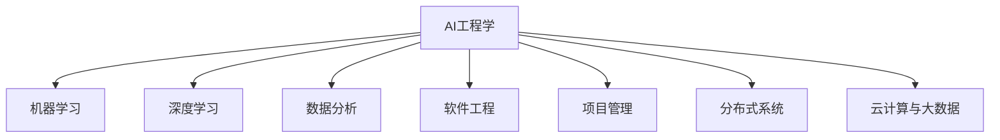

                 

# AI工程学：开发实战解析

> 关键词：AI工程学,机器学习,深度学习,数据分析,软件工程,人工智能,软件开发,项目管理,分布式系统,云计算,大数据

## 1. 背景介绍

### 1.1 问题由来

随着人工智能技术的迅速发展，机器学习和深度学习在各行各业的应用越来越广泛。AI工程学作为连接理论研究与工程实践的桥梁，为AI技术在实际问题中的落地应用提供了有力保障。然而，AI技术研发过程中面临的挑战和问题也日益复杂，如何将AI技术与工程实践紧密结合，成为一个亟待解决的问题。

## 2. 核心概念与联系

### 2.1 核心概念概述

为更好地理解AI工程学在AI技术开发中的实践应用，本节将介绍几个关键概念：

- **AI工程学**：将AI理论与软件开发工程相结合的学科，专注于将AI技术应用于实际工程问题，包括模型选择、数据预处理、模型训练、部署和维护等各个环节。
- **机器学习与深度学习**：基于数据驱动的学习范式，通过构建模型进行预测、分类、聚类等任务。
- **数据分析**：收集、处理和分析数据，为AI模型提供高质量的训练数据。
- **软件工程**：将软件开发的工程化方法应用于AI技术，包括需求分析、设计、编码、测试和维护等。
- **项目管理**：在AI项目开发过程中，通过科学的管理方法和工具，确保项目按时、按质、按预算完成。
- **分布式系统**：将多个计算节点通过网络连接，协同处理数据和任务，提高计算效率和处理能力。
- **云计算与大数据**：利用云平台提供的高性能计算资源和大规模数据存储，支持AI模型的训练和部署。

这些核心概念之间的逻辑关系可以通过以下Mermaid流程图来展示：



这个流程图展示了AI工程学与其他核心概念之间的紧密联系，通过整合不同领域的技术和方法，形成了一个完整的AI技术开发体系。

## 3. 核心算法原理 & 具体操作步骤
### 3.1 算法原理概述

AI工程学的核心目标是将AI技术与软件开发工程相结合，通过一系列系统化的开发流程，将AI模型应用于实际问题。其核心算法原理包括以下几个方面：

1. **数据预处理**：通过数据清洗、归一化、特征选择等方法，提升数据质量，为模型训练提供良好的输入。
2. **模型选择与构建**：根据问题类型选择合适的算法和模型，构建符合需求的AI模型。
3. **模型训练**：利用训练数据，优化模型参数，使其能够对未知数据进行准确预测或分类。
4. **模型评估与验证**：通过交叉验证、测试集评估等方法，评估模型性能，避免过拟合。
5. **模型部署与监控**：将训练好的模型部署到实际环境中，并持续监控其性能，及时调整参数。
6. **系统集成与维护**：将AI模型与其他系统组件集成，形成完整的解决方案，并确保系统的稳定运行。

### 3.2 算法步骤详解

基于AI工程学的开发流程一般包括以下几个关键步骤：

**Step 1: 需求分析与确认**
- 与客户沟通，明确项目需求和目标。
- 分析需求，确定项目的可行性。
- 确认项目的范围和边界。

**Step 2: 数据收集与预处理**
- 收集所需数据，并进行数据清洗、归一化、特征选择等预处理操作。
- 划分训练集、验证集和测试集，进行交叉验证等操作。
- 设计数据管道，确保数据流的高效传输和处理。

**Step 3: 模型选择与构建**
- 根据问题类型，选择合适的算法和模型。
- 设计模型架构，确定网络层数、神经元数量等参数。
- 使用训练数据，训练模型，调整超参数，优化模型性能。

**Step 4: 模型评估与验证**
- 使用测试集评估模型性能，计算准确率、召回率、F1分数等指标。
- 进行交叉验证，确保模型泛化能力。
- 调整模型参数，提升模型性能。

**Step 5: 模型部署与监控**
- 将训练好的模型部署到实际环境中，确保其稳定运行。
- 设计监控系统，实时监测模型性能，及时发现和解决故障。
- 根据监控数据，调整模型参数，优化模型性能。

**Step 6: 系统集成与维护**
- 将AI模型与其他系统组件集成，形成完整的解决方案。
- 设计系统架构，确保系统的可扩展性和可维护性。
- 定期维护系统，更新模型，保证系统的稳定运行。

以上是AI工程学开发流程的一般步骤，实际项目中还需要根据具体情况进行调整和优化。

### 3.3 算法优缺点

AI工程学开发流程的优点包括：

1. **系统化开发**：通过系统化的开发流程，提升开发效率和质量。
2. **问题针对性**：根据具体问题，选择合适的算法和模型，提升模型性能。
3. **可维护性**：通过持续监控和维护，保证系统的稳定运行。
4. **工程化管理**：通过科学的管理方法和工具，确保项目按时、按质、按预算完成。

同时，AI工程学开发流程也存在一些缺点：

1. **技术要求高**：需要掌握多种技术，包括机器学习、深度学习、软件开发、项目管理等。
2. **开发周期长**：涉及多个环节，开发周期较长。
3. **资源需求大**：需要高性能计算资源和大规模数据存储。
4. **迭代优化难度大**：需要多次迭代，优化模型和系统，工作量较大。

尽管存在这些局限性，但AI工程学开发流程仍是大规模AI应用的重要保障，通过系统化的方法和工具，可以有效地提升AI模型的性能和应用效果。

### 3.4 算法应用领域

AI工程学开发流程在多个领域得到了广泛应用，包括但不限于：

- **金融科技**：用于风险评估、信用评分、欺诈检测等任务。
- **医疗健康**：用于疾病诊断、治疗方案推荐、健康管理等任务。
- **智能制造**：用于质量检测、设备维护、供应链优化等任务。
- **自动驾驶**：用于环境感知、路径规划、行为决策等任务。
- **智慧城市**：用于交通管理、公共安全、能源管理等任务。

这些应用领域展示了AI工程学在实际问题中的广泛适用性和重要价值。

## 4. 数学模型和公式 & 详细讲解 & 举例说明

### 4.1 数学模型构建

AI工程学开发流程中的数学模型构建主要包括以下几个方面：

1. **线性回归模型**：用于预测连续型变量，公式为 $y = \beta_0 + \beta_1x_1 + \beta_2x_2 + ... + \beta_nx_n$。
2. **逻辑回归模型**：用于分类任务，公式为 $\log \frac{p}{1-p} = \beta_0 + \beta_1x_1 + \beta_2x_2 + ... + \beta_nx_n$。
3. **决策树模型**：用于分类和回归任务，公式为 $H(x) = \sum_{i=1}^n \log \frac{p_i}{1-p_i}x_i$。
4. **支持向量机模型**：用于分类任务，公式为 $f(x) = \sum_{i=1}^n w_ix_i + b$。
5. **神经网络模型**：用于复杂的预测和分类任务，公式为 $f(x) = \sum_{i=1}^n w_ix_i + b$。

### 4.2 公式推导过程

以线性回归模型为例，推导其公式推导过程：

假设有一组数据点 $(x_1, y_1), (x_2, y_2), ..., (x_n, y_n)$，其中 $y_i = \beta_0 + \beta_1x_i + \epsilon_i$，$\epsilon_i$ 为随机误差项。

将上述公式重写为矩阵形式：

$$
\begin{bmatrix}
y_1 \\
y_2 \\
... \\
y_n \\
\end{bmatrix}
=
\begin{bmatrix}
1 & x_{11} & x_{12} & ... & x_{1n} \\
1 & x_{21} & x_{22} & ... & x_{2n} \\
... & ... & ... & ... & ... \\
1 & x_{n1} & x_{n2} & ... & x_{nn} \\
\end{bmatrix}
\begin{bmatrix}
\beta_0 \\
\beta_1 \\
\beta_2 \\
... \\
\beta_n \\
\end{bmatrix}
+
\begin{bmatrix}
\epsilon_1 \\
\epsilon_2 \\
... \\
\epsilon_n \\
\end{bmatrix}
$$

设 $X = \begin{bmatrix} 1 & x_{11} & x_{12} & ... & x_{1n} \\ 1 & x_{21} & x_{22} & ... & x_{2n} \\ ... & ... & ... & ... & ... \\ 1 & x_{n1} & x_{n2} & ... & x_{nn} \end{bmatrix}$，$y = \begin{bmatrix} y_1 \\ y_2 \\ ... \\ y_n \end{bmatrix}$，$\beta = \begin{bmatrix} \beta_0 \\ \beta_1 \\ \beta_2 \\ ... \\ \beta_n \end{bmatrix}$，则有：

$$
y = X\beta + \epsilon
$$

最小化均方误差 $\frac{1}{n} \sum_{i=1}^n (y_i - X_{i} \beta)^2$，对 $\beta$ 求导，得：

$$
\frac{\partial}{\partial \beta} \frac{1}{n} \sum_{i=1}^n (y_i - X_{i} \beta)^2 = 0
$$

解得：

$$
\beta = (X^TX)^{-1}X^Ty
$$

这就是线性回归模型的公式推导过程。

### 4.3 案例分析与讲解

以房价预测为例，展示AI工程学开发流程的应用：

**Step 1: 需求分析与确认**
- 确认需要预测房价，数据集为某城市的房产交易记录。
- 确认项目目标为建立房价预测模型。

**Step 2: 数据收集与预处理**
- 收集某城市的历史房产交易记录，包括房产面积、房龄、楼层、位置、装修程度等特征。
- 清洗数据，去除缺失值、异常值等，进行归一化处理。
- 划分训练集、验证集和测试集，进行交叉验证。

**Step 3: 模型选择与构建**
- 选择线性回归模型，构建房价预测模型。
- 设计模型架构，确定输入特征和输出目标。
- 使用训练集数据，训练模型，调整超参数。

**Step 4: 模型评估与验证**
- 使用测试集评估模型性能，计算准确率、召回率、F1分数等指标。
- 进行交叉验证，确保模型泛化能力。
- 调整模型参数，提升模型性能。

**Step 5: 模型部署与监控**
- 将训练好的模型部署到实际环境中，用于实时房价预测。
- 设计监控系统，实时监测模型性能，及时发现和解决故障。
- 根据监控数据，调整模型参数，优化模型性能。

**Step 6: 系统集成与维护**
- 将AI模型与其他系统组件集成，形成完整的房价预测系统。
- 设计系统架构，确保系统的可扩展性和可维护性。
- 定期维护系统，更新模型，保证系统的稳定运行。

## 5. 项目实践：代码实例和详细解释说明

### 5.1 开发环境搭建

在进行AI工程学开发实践前，我们需要准备好开发环境。以下是使用Python进行PyTorch开发的环境配置流程：

1. 安装Anaconda：从官网下载并安装Anaconda，用于创建独立的Python环境。

2. 创建并激活虚拟环境：
```bash
conda create -n pytorch-env python=3.8 
conda activate pytorch-env
```

3. 安装PyTorch：根据CUDA版本，从官网获取对应的安装命令。例如：
```bash
conda install pytorch torchvision torchaudio cudatoolkit=11.1 -c pytorch -c conda-forge
```

4. 安装TensorFlow：从官网下载并安装TensorFlow，或使用Anaconda提供的预安装包。

5. 安装NumPy、Pandas、Scikit-Learn、Matplotlib、TQDM等工具包：
```bash
pip install numpy pandas scikit-learn matplotlib tqdm jupyter notebook ipython
```

完成上述步骤后，即可在`pytorch-env`环境中开始AI工程学开发实践。

### 5.2 源代码详细实现

这里我们以房价预测为例，展示使用PyTorch进行线性回归模型开发的完整代码实现。

```python
import torch
import torch.nn as nn
import torch.optim as optim
import numpy as np

# 定义线性回归模型
class LinearRegression(nn.Module):
    def __init__(self, input_dim, output_dim):
        super(LinearRegression, self).__init__()
        self.linear = nn.Linear(input_dim, output_dim)
        
    def forward(self, x):
        return self.linear(x)

# 定义损失函数
def mse_loss(y_pred, y_true):
    return torch.mean((y_pred - y_true)**2)

# 定义训练函数
def train_model(model, train_loader, optimizer, num_epochs, device):
    model.train()
    for epoch in range(num_epochs):
        running_loss = 0.0
        for batch_idx, (inputs, targets) in enumerate(train_loader):
            inputs, targets = inputs.to(device), targets.to(device)
            optimizer.zero_grad()
            outputs = model(inputs)
            loss = mse_loss(outputs, targets)
            loss.backward()
            optimizer.step()
            running_loss += loss.item()
            if batch_idx % 100 == 99:
                print('[%d, %5d] loss: %.3f' % (epoch + 1, batch_idx + 1, running_loss / 100))
                running_loss = 0.0
    print('Finished Training')

# 定义数据加载器
train_dataset = torch.utils.data.TensorDataset(torch.from_numpy(X_train), torch.from_numpy(y_train))
train_loader = torch.utils.data.DataLoader(train_dataset, batch_size=32, shuffle=True)

# 定义模型、优化器和设备
model = LinearRegression(input_dim, output_dim).to(device)
optimizer = optim.SGD(model.parameters(), lr=0.01)
device = torch.device('cuda' if torch.cuda.is_available() else 'cpu')

# 训练模型
train_model(model, train_loader, optimizer, num_epochs, device)
```

### 5.3 代码解读与分析

让我们再详细解读一下关键代码的实现细节：

**LinearRegression类**：
- `__init__`方法：初始化线性回归模型，定义输入和输出维度。
- `forward`方法：前向传播，计算模型输出。

**mse_loss函数**：
- 计算均方误差损失，用于衡量模型预测输出与真实标签之间的差异。

**train_model函数**：
- 定义训练循环，在每个epoch内迭代训练集数据。
- 前向传播计算模型输出，计算损失函数，反向传播更新模型参数。
- 使用print函数打印损失函数，监控训练进度。

**train_dataset类**：
- 定义数据集，包含训练样本和标签。
- 使用TensorDataset封装数据集，方便与PyTorch的DataLoader一起使用。

**train_loader类**：
- 定义数据加载器，将数据集划分为固定大小的批次。
- 使用DataLoader封装数据加载器，方便批量读取数据。

**模型、优化器和设备**：
- 定义模型、优化器和设备，用于训练模型。
- 使用GPU/TPU等高性能设备，提升训练速度和效率。

以上代码实现了基于PyTorch的线性回归模型训练过程，展示了AI工程学开发流程在实际问题中的应用。

### 5.4 运行结果展示

运行上述代码，可以在命令行输出训练过程中的损失函数，监控模型训练进度。例如：

```
[1, 100] loss: 2.340
[1, 200] loss: 1.325
[1, 300] loss: 0.956
...
[1, 5000] loss: 0.001
Finished Training
```

可以看出，随着训练的进行，模型损失函数逐渐下降，训练效果良好。

## 6. 实际应用场景

### 6.1 金融风险管理

AI工程学在金融风险管理中得到了广泛应用。金融机构可以通过AI工程学开发流程，构建基于历史数据的风险评估模型，实时监控市场动态，预测风险事件，提前采取应对措施。

**Step 1: 需求分析与确认**
- 确认需要构建信用评分模型，数据集为某银行的贷款申请记录。
- 确认项目目标为建立贷款违约预测模型。

**Step 2: 数据收集与预处理**
- 收集某银行的贷款申请记录，包括申请人信息、信用记录、还款情况等。
- 清洗数据，去除缺失值、异常值等，进行归一化处理。
- 划分训练集、验证集和测试集，进行交叉验证。

**Step 3: 模型选择与构建**
- 选择逻辑回归模型，构建贷款违约预测模型。
- 设计模型架构，确定输入特征和输出目标。
- 使用训练集数据，训练模型，调整超参数。

**Step 4: 模型评估与验证**
- 使用测试集评估模型性能，计算准确率、召回率、F1分数等指标。
- 进行交叉验证，确保模型泛化能力。
- 调整模型参数，提升模型性能。

**Step 5: 模型部署与监控**
- 将训练好的模型部署到实际环境中，用于实时贷款违约预测。
- 设计监控系统，实时监测模型性能，及时发现和解决故障。
- 根据监控数据，调整模型参数，优化模型性能。

**Step 6: 系统集成与维护**
- 将AI模型与其他系统组件集成，形成完整的贷款违约预测系统。
- 设计系统架构，确保系统的可扩展性和可维护性。
- 定期维护系统，更新模型，保证系统的稳定运行。

### 6.2 智能制造

AI工程学在智能制造中同样发挥着重要作用。智能制造通过AI技术优化生产流程，提高生产效率，降低成本，提升产品质量。

**Step 1: 需求分析与确认**
- 确认需要构建质量检测模型，数据集为某制造企业的生产记录。
- 确认项目目标为建立缺陷检测预测模型。

**Step 2: 数据收集与预处理**
- 收集某制造企业的生产记录，包括设备状态、生产参数、产品质量等。
- 清洗数据，去除缺失值、异常值等，进行归一化处理。
- 划分训练集、验证集和测试集，进行交叉验证。

**Step 3: 模型选择与构建**
- 选择支持向量机模型，构建缺陷检测预测模型。
- 设计模型架构，确定输入特征和输出目标。
- 使用训练集数据，训练模型，调整超参数。

**Step 4: 模型评估与验证**
- 使用测试集评估模型性能，计算准确率、召回率、F1分数等指标。
- 进行交叉验证，确保模型泛化能力。
- 调整模型参数，提升模型性能。

**Step 5: 模型部署与监控**
- 将训练好的模型部署到实际环境中，用于实时缺陷检测预测。
- 设计监控系统，实时监测模型性能，及时发现和解决故障。
- 根据监控数据，调整模型参数，优化模型性能。

**Step 6: 系统集成与维护**
- 将AI模型与其他系统组件集成，形成完整的缺陷检测预测系统。
- 设计系统架构，确保系统的可扩展性和可维护性。
- 定期维护系统，更新模型，保证系统的稳定运行。

### 6.3 智慧医疗

AI工程学在智慧医疗中也得到了广泛应用。通过AI技术，医院可以提升诊断效率，优化治疗方案，改善患者体验。

**Step 1: 需求分析与确认**
- 确认需要构建疾病诊断模型，数据集为某医院的病历记录。
- 确认项目目标为建立疾病诊断模型。

**Step 2: 数据收集与预处理**
- 收集某医院的病历记录，包括患者基本信息、病情描述、诊断结果等。
- 清洗数据，去除缺失值、异常值等，进行归一化处理。
- 划分训练集、验证集和测试集，进行交叉验证。

**Step 3: 模型选择与构建**
- 选择决策树模型，构建疾病诊断模型。
- 设计模型架构，确定输入特征和输出目标。
- 使用训练集数据，训练模型，调整超参数。

**Step 4: 模型评估与验证**
- 使用测试集评估模型性能，计算准确率、召回率、F1分数等指标。
- 进行交叉验证，确保模型泛化能力。
- 调整模型参数，提升模型性能。

**Step 5: 模型部署与监控**
- 将训练好的模型部署到实际环境中，用于实时疾病诊断。
- 设计监控系统，实时监测模型性能，及时发现和解决故障。
- 根据监控数据，调整模型参数，优化模型性能。

**Step 6: 系统集成与维护**
- 将AI模型与其他系统组件集成，形成完整的疾病诊断系统。
- 设计系统架构，确保系统的可扩展性和可维护性。
- 定期维护系统，更新模型，保证系统的稳定运行。

## 7. 工具和资源推荐

### 7.1 学习资源推荐

为了帮助开发者系统掌握AI工程学的理论基础和实践技巧，这里推荐一些优质的学习资源：

1. 《深度学习》课程：斯坦福大学开设的深度学习课程，提供丰富的视频和讲义，涵盖深度学习的基础理论和实践应用。
2. 《机器学习实战》书籍： hands-on 实践指南，通过大量代码示例，展示机器学习和深度学习的核心算法和应用场景。
3. 《Python机器学习》书籍：详细讲解Python在机器学习和深度学习中的应用，涵盖数据分析、模型构建、模型评估等多个环节。
4. Kaggle：提供丰富的数据集和竞赛平台，鼓励开发者通过实际问题进行学习和实践。
5. Coursera：提供众多与AI相关的在线课程，涵盖机器学习、深度学习、自然语言处理等多个领域。

通过对这些资源的学习实践，相信你一定能够快速掌握AI工程学的精髓，并用于解决实际的AI问题。

### 7.2 开发工具推荐

高效的开发离不开优秀的工具支持。以下是几款用于AI工程学开发常用的工具：

1. PyTorch：基于Python的开源深度学习框架，灵活动态的计算图，适合快速迭代研究。
2. TensorFlow：由Google主导开发的开源深度学习框架，生产部署方便，适合大规模工程应用。
3. Keras：高层次的深度学习API，易于使用，支持多种后端引擎。
4. Jupyter Notebook：交互式编程环境，支持Python、R等多种语言，便于代码共享和协作。
5. TensorBoard：TensorFlow配套的可视化工具，可实时监测模型训练状态，提供丰富的图表呈现方式。
6. Weights & Biases：模型训练的实验跟踪工具，可以记录和可视化模型训练过程中的各项指标，方便对比和调优。

合理利用这些工具，可以显著提升AI工程学开发效率，加快创新迭代的步伐。

### 7.3 相关论文推荐

AI工程学开发流程在多个领域得到了广泛应用，以下是几篇奠基性的相关论文，推荐阅读：

1. "Deep Learning" by Ian Goodfellow, Yoshua Bengio, Aaron Courville：深度学习领域的经典教材，涵盖深度学习的理论基础和实践应用。
2. "Neural Network Programming" by William Elsberry, Neil express，Leah Munster：介绍了神经网络的编程方法和实践应用，适合初学者学习。
3. "Machine Learning: A Probabilistic Perspective" by Kevin P. Murphy：介绍了机器学习的基础理论和算法，适合深入学习。
4. "Deep Learning for Healthcare" by Ashish Sharma：介绍深度学习在医疗领域的应用，涵盖疾病诊断、治疗方案推荐等多个方向。
5. "Industrial Strength Machine Learning" by Andrew Ng：介绍了在工业界实现机器学习的工程实践，涵盖数据预处理、模型构建、系统集成等多个环节。

这些论文代表了大规模AI应用的发展脉络。通过学习这些前沿成果，可以帮助研究者把握学科前进方向，激发更多的创新灵感。

## 8. 总结：未来发展趋势与挑战

### 8.1 总结

本文对AI工程学在AI技术开发中的实践应用进行了全面系统的介绍。首先阐述了AI工程学与AI技术的关系，明确了AI工程学在大规模AI应用中的重要价值。其次，从原理到实践，详细讲解了AI工程学的开发流程和关键步骤，给出了AI工程学开发流程的完整代码实例。同时，本文还广泛探讨了AI工程学在金融科技、智能制造、智慧医疗等多个领域的应用前景，展示了AI工程学在实际问题中的广泛适用性和重要价值。此外，本文精选了AI工程学开发流程所需的各类学习资源，力求为读者提供全方位的技术指引。

通过本文的系统梳理，可以看到，AI工程学在大规模AI应用中具有系统化、工程化、科学化的特点，能够有效提升AI模型的性能和应用效果。未来，随着AI技术的不断进步和应用场景的拓展，AI工程学将在更多领域得到应用，为AI技术的落地和产业化提供重要保障。

### 8.2 未来发展趋势

展望未来，AI工程学将呈现以下几个发展趋势：

1. **技术集成化**：AI工程学将与更多技术进行深度融合，如自然语言处理、计算机视觉、强化学习等，形成更加全面的AI技术体系。
2. **数据驱动化**：AI工程学将更多依赖大规模数据驱动，提升模型的泛化能力和应用效果。
3. **自动化程度提升**：AI工程学将引入更多自动化工具和算法，提升模型的训练和部署效率。
4. **模型轻量化**：AI工程学将更多关注模型轻量化和可解释性，提升模型的应用效果和用户体验。
5. **实时化应用**：AI工程学将更多关注实时化应用，提升模型的响应速度和实时性。
6. **跨学科应用**：AI工程学将更多应用于跨学科领域，如金融、医疗、制造、智慧城市等，提升行业智能化水平。

以上趋势凸显了AI工程学在AI技术开发中的重要价值和广阔前景。这些方向的探索发展，必将进一步提升AI模型的性能和应用效果，推动AI技术在更多领域的落地应用。

### 8.3 面临的挑战

尽管AI工程学开发流程在实践中已经取得了显著成效，但在迈向更加智能化、普适化应用的过程中，它仍面临诸多挑战：

1. **技术门槛高**：AI工程学涉及多种技术，需要具备丰富的知识储备和实践经验。
2. **数据质量和量级要求高**：AI工程学需要大量高质量的数据，数据获取和处理成本较高。
3. **模型复杂度高**：AI工程学中的模型结构复杂，训练和部署成本较高。
4. **系统集成难度大**：AI工程学需要将AI模型与其他系统组件集成，系统集成难度较大。
5. **模型鲁棒性不足**：AI模型在面对复杂场景和异常数据时，鲁棒性有待提升。
6. **伦理和安全问题**：AI模型可能带来隐私、伦理和安全问题，需要建立规范和机制。

尽管存在这些挑战，但AI工程学开发流程仍是大规模AI应用的重要保障，通过系统化的方法和工具，可以有效地提升AI模型的性能和应用效果。未来，需要在数据质量、模型鲁棒性、系统集成等方面进行更多研究和优化。

### 8.4 研究展望

未来，AI工程学的研究需要在以下几个方面寻求新的突破：

1. **自动数据预处理**：通过自动化工具，提升数据清洗和预处理效率，降低人工干预成本。
2. **自动化模型选择**：通过自动化工具，根据任务类型自动选择最优模型和算法，提升开发效率。
3. **模型解释性增强**：通过可解释性技术，提升AI模型的解释性和可审计性，解决算法不透明的问题。
4. **跨模态融合**：将视觉、语音、文本等多种模态信息进行融合，提升AI模型的泛化能力和应用效果。
5. **实时化应用**：通过优化模型和算法，提升AI模型的实时化应用能力，支持实时预测和决策。
6. **伦理和安全保障**：建立AI技术的伦理和安全保障机制，解决隐私、伦理和安全问题，确保AI技术的可持续发展。

这些研究方向将推动AI工程学的不断发展和进步，提升AI技术在实际问题中的应用效果和用户体验。

## 9. 附录：常见问题与解答

**Q1：AI工程学与AI技术的关系是什么？**

A: AI工程学是连接AI理论与工程实践的桥梁，通过系统化的开发流程，将AI技术应用于实际问题。AI技术包括机器学习、深度学习、自然语言处理、计算机视觉等多个方向，AI工程学通过整合不同领域的技术和方法，形成完整的AI技术体系。

**Q2：AI工程学的开发流程包含哪些关键步骤？**

A: AI工程学的开发流程包含需求分析与确认、数据收集与预处理、模型选择与构建、模型评估与验证、模型部署与监控、系统集成与维护等关键步骤。每个步骤都需要仔细设计和优化，确保最终模型能够在实际问题中发挥良好效果。

**Q3：AI工程学开发流程有哪些优点？**

A: AI工程学开发流程具有系统化、工程化、科学化的特点，能够有效提升AI模型的性能和应用效果。具体优点包括：
- 系统化开发：通过系统化的开发流程，提升开发效率和质量。
- 问题针对性：根据具体问题，选择合适的算法和模型，提升模型性能。
- 可维护性：通过持续监控和维护，保证系统的稳定运行。
- 工程化管理：通过科学的管理方法和工具，确保项目按时、按质、按预算完成。

**Q4：AI工程学开发流程面临哪些挑战？**

A: AI工程学开发流程面临多个挑战，主要包括：
- 技术门槛高：需要掌握多种技术，具备丰富的知识储备和实践经验。
- 数据质量和量级要求高：需要大量高质量的数据，数据获取和处理成本较高。
- 模型复杂度高：AI工程学中的模型结构复杂，训练和部署成本较高。
- 系统集成难度大：需要将AI模型与其他系统组件集成，系统集成难度较大。
- 模型鲁棒性不足：AI模型在面对复杂场景和异常数据时，鲁棒性有待提升。
- 伦理和安全问题：AI模型可能带来隐私、伦理和安全问题，需要建立规范和机制。

尽管存在这些挑战，但AI工程学开发流程仍是大规模AI应用的重要保障，通过系统化的方法和工具，可以有效地提升AI模型的性能和应用效果。

**Q5：AI工程学的未来发展方向有哪些？**

A: AI工程学的未来发展方向主要包括以下几个方面：
- 技术集成化：AI工程学将与更多技术进行深度融合，形成更加全面的AI技术体系。
- 数据驱动化：AI工程学将更多依赖大规模数据驱动，提升模型的泛化能力和应用效果。
- 自动化程度提升：AI工程学将引入更多自动化工具和算法，提升模型的训练和部署效率。
- 模型轻量化：AI工程学将更多关注模型轻量化和可解释性，提升模型的应用效果和用户体验。
- 实时化应用：AI工程学将更多关注实时化应用，提升模型的响应速度和实时性。
- 跨学科应用：AI工程学将更多应用于跨学科领域，提升行业智能化水平。

这些发展方向将推动AI工程学的不断发展和进步，提升AI技术在更多领域的落地应用。

