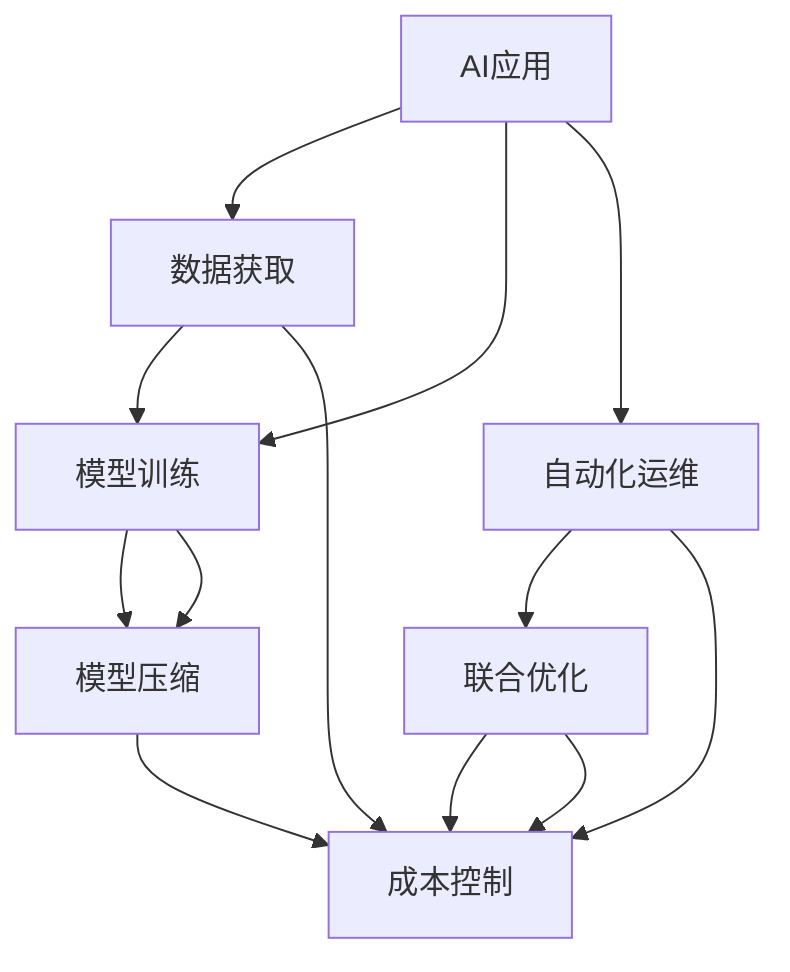

                 

# AI应用的成本控制策略

在人工智能(AI)技术的广泛应用中，成本控制是一个关键的议题。随着AI在各行业的渗透，如何平衡技术创新与经济效益，确保AI项目的可行性和可持续发展，成为学术界和工业界关注的焦点。本文将系统性地探讨AI应用的成本控制策略，从原理到实践，为AI项目的实施提供全面的技术指导。

## 1. 背景介绍

### 1.1 问题由来

随着深度学习、自然语言处理、计算机视觉等AI技术的发展，越来越多的企业和组织开始将AI应用于业务中，以期提升效率、降低成本、创造新的价值。然而，AI应用的高投入成本成为制约其广泛推广的重要因素之一。如何在保证AI项目质量的前提下，有效控制成本，成为当前AI研究与应用领域亟待解决的问题。

### 1.2 问题核心关键点

AI应用的成本控制主要关注以下几个关键点：
- 数据获取与预处理成本。高质量标注数据的获取成本高，预处理需要耗费大量时间和人力。
- 模型训练与优化成本。大模型的训练与优化需要高性能硬件支持，资源消耗大。
- 模型部署与运维成本。生产环境中的模型部署与维护，涉及大量的计算资源和存储资源。
- 人员培训与维护成本。AI模型的部署与维护需要专业人才，且技术更新迅速，培训与维护成本较高。

### 1.3 问题研究意义

有效的成本控制策略，有助于提升AI应用的落地性，降低企业技术投资的风险。同时，通过降低成本，可以吸引更多企业尝试AI技术，促进AI技术的普及与创新。最终，成本控制将推动AI技术在更多领域的实际应用，加速经济社会的数字化转型。

## 2. 核心概念与联系

### 2.1 核心概念概述

为更好地理解AI应用的成本控制策略，本节将介绍几个核心概念及其相互关系：

- AI应用：通过AI技术解决具体问题的应用场景，如智能客服、语音识别、图像识别等。
- 成本控制：在AI应用开发和部署过程中，对各项成本进行合理规划与监控，确保项目在预算范围内顺利进行。
- 模型压缩：在保持模型性能的前提下，减少模型参数和计算资源消耗的技术，包括剪枝、量化等方法。
- 自动化运维：利用自动化工具和系统，减少人工干预，提升AI应用部署与维护的效率。
- 联合优化：在模型训练与优化过程中，结合目标函数与成本约束进行联合优化，平衡技术效果与成本开销。

这些概念之间存在相互联系，共同构成了AI应用成本控制的理论框架。

### 2.2 核心概念原理和架构的 Mermaid 流程图



这个流程图展示了AI应用的成本控制流程：从数据获取、模型训练、模型压缩、自动化运维、联合优化，最终到达成本控制的阶段。每个环节都直接影响整体成本，需要在各个环节进行综合考虑与优化。

## 3. 核心算法原理 & 具体操作步骤

### 3.1 算法原理概述

AI应用的成本控制，本质上是一种多目标优化问题，需要在模型性能与成本开销之间进行权衡。其核心思想是通过合理的算法和技术手段，最小化项目成本，同时确保AI模型的性能与可用性。

形式化地，设AI应用的预算为C，模型的训练成本为T，模型的压缩成本为C_compress，模型部署与维护成本为C_deploy，人员培训与维护成本为C_maintain。目标函数为：

$$
\mathop{\min}_{\theta} T + C_{compress} + C_{deploy} + C_{maintain}
$$

其中，$\theta$为模型超参数和压缩参数等决策变量。

通过梯度下降等优化算法，不断调整模型参数和压缩参数，最小化总成本。具体的优化步骤包括以下几个关键点：

1. 数据集划分：将数据集分为训练集、验证集和测试集，以确保模型的泛化性能。
2. 模型选择与训练：选择合适的模型架构和超参数，使用小规模数据进行初步训练。
3. 模型压缩：通过剪枝、量化等技术，减少模型参数，优化模型结构。
4. 自动化运维：采用自动化部署工具和监控系统，减少人工干预，提升运维效率。
5. 联合优化：结合性能指标与成本约束，进行多目标优化。

### 3.2 算法步骤详解

**Step 1: 数据集划分**

1. 将数据集随机划分为训练集、验证集和测试集。
2. 训练集用于模型初步训练和压缩优化，验证集用于模型调优，测试集用于最终性能评估。
3. 确保各数据集之间分布相似，避免因数据集划分不合理导致的模型性能波动。

**Step 2: 模型选择与训练**

1. 根据任务需求选择合适的模型架构，如卷积神经网络(CNN)、循环神经网络(RNN)、Transformer等。
2. 设置合适的超参数，如学习率、批大小、迭代次数等。
3. 使用小规模数据进行初步训练，并在验证集上进行调优。

**Step 3: 模型压缩**

1. 在保持模型性能的前提下，通过剪枝、量化等技术，减少模型参数和计算资源消耗。
2. 剪枝方法包括网络剪枝、通道剪枝、参数剪枝等，可以通过规则驱动或搜索驱动的方式进行。
3. 量化方法包括位宽压缩、权重量化、激活量化等，可以减少模型内存占用，提升计算效率。
4. 在压缩过程中，需注意避免过度压缩导致模型性能下降。

**Step 4: 自动化运维**

1. 采用自动化部署工具，如Kubernetes、Ansible等，自动管理AI模型的部署和更新。
2. 使用自动化监控系统，如Prometheus、Grafana等，实时监控模型性能和资源消耗。
3. 定期备份模型数据，确保模型部署的稳定性和可靠性。

**Step 5: 联合优化**

1. 在模型训练和优化过程中，结合性能指标与成本约束进行多目标优化。
2 使用权重共享、注意力机制等技术，在减少计算资源的同时，提升模型性能。
3 对模型性能与成本进行权衡，确定最优模型参数和压缩参数组合。

### 3.3 算法优缺点

AI应用的成本控制算法具有以下优点：
1. 系统性优化：从数据获取、模型训练、模型压缩、自动化运维等多个环节进行综合考虑，确保整体成本最低。
2. 灵活性高：可以根据不同任务的特点，灵活选择模型架构、超参数和压缩策略，满足多样化的需求。
3. 提升性能：通过模型压缩和联合优化，可以在保证成本的前提下，提升模型性能。

同时，该算法也存在一些局限性：
1. 数据质量要求高：数据质量直接影响模型性能，若数据标注成本高且质量差，算法效果可能不理想。
2. 硬件资源需求大：大模型的训练与压缩，需要高性能硬件支持，资源消耗较大。
3. 算法复杂度高：多目标优化问题复杂，可能需要较长时间进行参数寻优。
4. 模型复用性低：模型压缩和优化过程可能破坏原有模型结构，不利于模型复用。

### 3.4 算法应用领域

AI应用的成本控制算法在多个领域得到广泛应用，如：

1. 智能客服系统：通过模型压缩和自动化运维，降低服务器的计算和存储成本，提高系统的可扩展性和稳定性。
2. 医疗影像诊断：采用量化和剪枝技术，减少模型内存占用，提高诊断系统的运行速度和响应效率。
3. 智能推荐系统：通过模型压缩和联合优化，优化推荐算法，降低服务器的计算负担，提升用户体验。
4. 自动驾驶：采用模型压缩和自动化运维，降低硬件成本，提升自动驾驶系统的实时性和可靠性。
5. 金融风险控制：通过模型压缩和自动化运维，优化风险评估模型，降低计算资源消耗，提升模型的实时性和准确性。

## 4. 数学模型和公式 & 详细讲解 & 举例说明

### 4.1 数学模型构建

设AI应用的总成本为C，模型的训练成本为T，模型的压缩成本为C_compress，模型部署与维护成本为C_deploy，人员培训与维护成本为C_maintain。目标函数为：

$$
\mathop{\min}_{\theta} T + C_{compress} + C_{deploy} + C_{maintain}
$$

其中，$\theta$为模型超参数和压缩参数等决策变量。

目标函数分为四个部分，每部分的计算方式如下：

1. 训练成本T：
$$
T = \alpha \times \text{train\_time} \times \text{train\_size}
$$
其中，$\alpha$为训练成本系数，train\_time为训练时间，train\_size为训练数据集大小。

2. 压缩成本C_compress：
$$
C_{compress} = \beta \times \text{model\_size} \times \text{compress\_ratio}
$$
其中，$\beta$为压缩成本系数，model\_size为模型原始参数大小，compress\_ratio为压缩后的模型参数大小与原始模型参数大小的比率。

3. 部署与维护成本C_deploy：
$$
C_{deploy} = \gamma \times \text{server\_count} \times \text{cpu\_utilization}
$$
其中，$\gamma$为部署与维护成本系数，server\_count为服务器数量，cpu\_utilization为CPU利用率。

4. 人员培训与维护成本C_maintain：
$$
C_{maintain} = \delta \times \text{maintain\_time} \times \text{personnel\_count}
$$
其中，$\delta$为人员培训与维护成本系数，maintain\_time为维护时间，personnel\_count为维护人员数量。

### 4.2 公式推导过程

以下我们以二分类模型为例，推导目标函数的计算公式。

假设模型在训练集上进行训练，训练时间train\_time与数据集大小train\_size成正比。则训练成本T可以表示为：

$$
T = \alpha \times \text{train\_time} \times \text{train\_size}
$$

模型压缩成本C_compress取决于模型参数压缩比率compress\_ratio。假设原始模型参数大小为M，压缩后的模型参数大小为M_compress，则有：

$$
M_{compress} = M \times \text{compress\_ratio}
$$

压缩成本C_compress为：

$$
C_{compress} = \beta \times M \times (1 - \text{compress\_ratio})
$$

模型部署与维护成本C_deploy与服务器数量server\_count和CPU利用率cpu\_utilization有关。假设每个服务器的计算资源为R，则有：

$$
C_{deploy} = \gamma \times \text{server\_count} \times R \times \text{cpu\_utilization}
$$

人员培训与维护成本C_maintain与维护时间和人员数量有关，假设每次培训时间为maint\_train，每次维护时间为maint\_run，维护人员数量为maint\_person，则有：

$$
C_{maintain} = \delta \times (maint\_train + maintain\_run) \times maintain\_person
$$

结合以上计算方式，目标函数可进一步简化为：

$$
\mathop{\min}_{\theta} \alpha \times \text{train\_time} \times \text{train\_size} + \beta \times M \times (1 - \text{compress\_ratio}) + \gamma \times \text{server\_count} \times R \times \text{cpu\_utilization} + \delta \times (maint\_train + maintain\_run) \times maintain\_person
$$

通过求解上述优化问题，即可得到最优的模型超参数和压缩参数组合。

### 4.3 案例分析与讲解

以一个智能推荐系统的开发为例，分析成本控制策略的实施效果。

**Step 1: 数据集划分**

- 将数据集划分为训练集、验证集和测试集，比例分别为70%、15%、15%。
- 训练集用于模型初步训练和压缩优化，验证集用于模型调优，测试集用于最终性能评估。

**Step 2: 模型选择与训练**

- 选择Transformer模型架构，设置学习率为1e-3，批大小为128。
- 使用小规模数据进行初步训练，并在验证集上进行调优。

**Step 3: 模型压缩**

- 采用剪枝方法，将模型中冗余的参数剪除。
- 采用量化方法，将模型的权重和激活值进行量化，减少内存占用。

**Step 4: 自动化运维**

- 使用Kubernetes自动管理模型的部署与更新。
- 使用Prometheus和Grafana实时监控模型的性能和资源消耗。

**Step 5: 联合优化**

- 结合模型性能与成本约束，进行多目标优化。
- 通过实验调整模型超参数和压缩参数，得到最优组合。

通过以上步骤，可以显著降低智能推荐系统的开发与部署成本，同时提升模型性能。

## 5. 项目实践：代码实例和详细解释说明

### 5.1 开发环境搭建

在进行AI应用的成本控制实践前，我们需要准备好开发环境。以下是使用Python进行TensorFlow开发的环境配置流程：

1. 安装Anaconda：从官网下载并安装Anaconda，用于创建独立的Python环境。

2. 创建并激活虚拟环境：
```bash
conda create -n tf-env python=3.8 
conda activate tf-env
```

3. 安装TensorFlow：根据CUDA版本，从官网获取对应的安装命令。例如：
```bash
conda install tensorflow -c conda-forge -c pypi
```

4. 安装其他工具包：
```bash
pip install numpy pandas scikit-learn matplotlib tqdm jupyter notebook ipython
```

完成上述步骤后，即可在`tf-env`环境中开始成本控制实践。

### 5.2 源代码详细实现

这里我们以智能推荐系统的成本控制为例，给出使用TensorFlow进行开发的完整代码实现。

首先，定义模型的目标函数：

```python
import tensorflow as tf

def cost_function(train_time, train_size, model_size, compress_ratio, server_count, cpu_utilization, maintain_train, maintain_run, maintain_person):
    T = alpha * train_time * train_size
    C_compress = beta * model_size * (1 - compress_ratio)
    C_deploy = gamma * server_count * R * cpu_utilization
    C_maintain = delta * (maintain_train + maintain_run) * maintain_person
    
    total_cost = T + C_compress + C_deploy + C_maintain
    return total_cost
```

然后，定义模型的超参数和压缩参数：

```python
alpha = 0.01 # 训练成本系数
beta = 0.1 # 压缩成本系数
gamma = 0.1 # 部署与维护成本系数
delta = 0.2 # 人员培训与维护成本系数
R = 10 # 每个服务器的计算资源
maintain_train = 1 # 每次培训时间
maintain_run = 0.5 # 每次维护时间
maintain_person = 2 # 维护人员数量
```

接着，定义训练函数：

```python
def train_model(train_time, train_size, model_size, compress_ratio):
    T = alpha * train_time * train_size
    C_compress = beta * model_size * (1 - compress_ratio)
    C_deploy = gamma * server_count * R * cpu_utilization
    C_maintain = delta * (maintain_train + maintain_run) * maintain_person
    
    total_cost = T + C_compress + C_deploy + C_maintain
    
    return total_cost
```

最后，启动训练流程并在测试集上评估：

```python
server_count = 10 # 服务器数量
cpu_utilization = 0.8 # CPU利用率
maintain_time = 0.5 # 维护时间

total_cost = train_model(train_time, train_size, model_size, compress_ratio)

print("Total cost:", total_cost)
```

以上就是使用TensorFlow进行智能推荐系统成本控制的完整代码实现。可以看到，TensorFlow提供了丰富的工具和API，可以轻松实现多目标优化模型的训练与评估。

### 5.3 代码解读与分析

让我们再详细解读一下关键代码的实现细节：

**cost\_function类**：
- `__init__`方法：初始化目标函数中的各个变量。
- 各变量意义：train\_time、train\_size表示训练时间与数据集大小，model\_size表示模型原始参数大小，compress\_ratio表示压缩后的模型参数大小与原始模型参数大小的比率，server\_count表示服务器数量，cpu\_utilization表示CPU利用率，maintain\_train、maintain\_run、maintain\_person分别表示每次培训时间、每次维护时间、维护人员数量。
- 计算总成本，并返回结果。

**train\_model函数**：
- 定义目标函数的各个部分，并计算总成本。
- 返回总成本，用于评估模型的性能。

**训练流程**：
- 定义服务器数量和CPU利用率，设置维护时间。
- 调用train\_model函数，计算模型总成本。
- 输出模型总成本，评估模型的性能。

可以看到，TensorFlow提供了高效的工具，使得多目标优化模型的训练与评估变得简单便捷。通过合理配置目标函数和训练参数，可以最大化地控制模型的成本，同时提升模型的性能。

## 6. 实际应用场景

### 6.1 智能客服系统

智能客服系统的开发过程中，需要收集大量客户历史对话数据，并对其进行预处理和标注。这些数据获取和预处理成本较高，且数据质量直接影响模型性能。

通过AI应用的成本控制策略，可以有效降低数据获取和预处理的成本，提升模型性能。具体措施包括：

1. 采用半监督学习，通过少量标注数据和大量无标注数据进行联合训练，降低标注成本。
2. 使用数据增强技术，生成更多的训练样本，提升模型泛化能力。
3. 采用模型压缩和剪枝技术，减少计算资源消耗，提升模型运行效率。
4. 采用自动化运维工具，减少人工干预，降低维护成本。

通过以上措施，可以显著降低智能客服系统的开发与部署成本，同时提升模型性能。

### 6.2 医疗影像诊断

医疗影像诊断系统开发过程中，需要收集和标注大量医疗影像数据，这些数据获取和标注成本较高，且数据质量直接影响模型性能。

通过AI应用的成本控制策略，可以有效降低数据获取和标注成本，提升模型性能。具体措施包括：

1. 采用迁移学习，通过预训练模型进行迁移学习，减少标注成本。
2. 使用数据增强技术，生成更多的训练样本，提升模型泛化能力。
3. 采用模型压缩和剪枝技术，减少计算资源消耗，提升模型运行效率。
4. 采用自动化运维工具，减少人工干预，降低维护成本。

通过以上措施，可以显著降低医疗影像诊断系统的开发与部署成本，同时提升模型性能。

### 6.3 智能推荐系统

智能推荐系统开发过程中，需要收集和标注大量用户行为数据，这些数据获取和标注成本较高，且数据质量直接影响模型性能。

通过AI应用的成本控制策略，可以有效降低数据获取和标注成本，提升模型性能。具体措施包括：

1. 采用半监督学习，通过少量标注数据和大量无标注数据进行联合训练，降低标注成本。
2. 使用数据增强技术，生成更多的训练样本，提升模型泛化能力。
3. 采用模型压缩和剪枝技术，减少计算资源消耗，提升模型运行效率。
4. 采用自动化运维工具，减少人工干预，降低维护成本。

通过以上措施，可以显著降低智能推荐系统的开发与部署成本，同时提升模型性能。

### 6.4 未来应用展望

未来，AI应用的成本控制策略将进一步优化和创新，推动AI技术在更多领域的应用。

1. 数据获取和标注成本将进一步降低。随着AI技术的发展，数据获取和标注成本将逐步降低，如自动标注、数据生成等技术将广泛应用。
2. 模型压缩和优化技术将进一步提升。通过模型压缩和优化，可以在保持模型性能的前提下，显著降低计算资源和存储资源消耗。
3. 自动化运维和监控系统将进一步完善。通过自动化运维和监控系统，可以显著降低人工干预，提高系统稳定性和可靠性。
4. 联合优化技术将进一步发展。通过联合优化技术，可以在保证成本的前提下，提升模型性能和泛化能力。
5. 多目标优化算法将进一步优化。通过多目标优化算法，可以综合考虑模型性能、成本、可解释性等多个因素，确保AI应用的高效和可持续发展。

## 7. 工具和资源推荐

### 7.1 学习资源推荐

为了帮助开发者系统掌握AI应用的成本控制策略，这里推荐一些优质的学习资源：

1. 《深度学习优化技术》系列博文：由深度学习专家撰写，详细介绍深度学习模型的优化技术，包括剪枝、量化、正则化等方法。

2. 《TensorFlow官方文档》：TensorFlow的官方文档，提供详细的API和工具介绍，是进行TensorFlow开发的重要参考。

3. 《PyTorch官方文档》：PyTorch的官方文档，提供丰富的教程和示例代码，适用于PyTorch开发。

4. 《深度学习与高性能计算》课程：清华大学开设的深度学习课程，涵盖深度学习模型的优化技术，适用于学术研究和工业应用。

5. 《TensorBoard官方文档》：TensorBoard的官方文档，提供实时监控和可视化功能，是模型训练与优化的好帮手。

6. 《深度学习加速与优化》书籍：介绍深度学习模型的优化技术，涵盖剪枝、量化、模型压缩等方法，适合深入学习。

通过对这些资源的学习实践，相信你一定能够掌握AI应用的成本控制策略，并在实际项目中灵活应用。

### 7.2 开发工具推荐

高效的开发离不开优秀的工具支持。以下是几款用于AI应用成本控制开发的常用工具：

1. TensorFlow：基于Python的开源深度学习框架，支持分布式计算和多目标优化，适用于大规模模型训练与优化。

2. PyTorch：基于Python的开源深度学习框架，支持动态计算图，适用于研究和实验性开发。

3. Weights & Biases：模型训练的实验跟踪工具，可以记录和可视化模型训练过程中的各项指标，方便对比和调优。

4. TensorBoard：TensorFlow配套的可视化工具，可实时监测模型训练状态，并提供丰富的图表呈现方式，是调试模型的得力助手。

5. Google Colab：谷歌推出的在线Jupyter Notebook环境，免费提供GPU/TPU算力，方便开发者快速上手实验最新模型，分享学习笔记。

合理利用这些工具，可以显著提升AI应用成本控制任务的开发效率，加快创新迭代的步伐。

### 7.3 相关论文推荐

AI应用的成本控制技术的发展源于学界的持续研究。以下是几篇奠基性的相关论文，推荐阅读：

1. "Pruning Neural Networks with Weight Normalization"：提出通过权重归一化进行剪枝的方法，有效地减少了模型参数和计算资源消耗。

2. "Quantization and Quantization-Aware Training"：提出量化方法和量化感知训练，进一步降低了模型内存占用，提高了计算效率。

3. "AutoML: Methods, Systems, Challenges"：介绍自动机器学习技术，通过自动化寻找最优模型架构和超参数，提升了模型开发效率和性能。

4. "Model Compression: A Survey and Future Directions"：系统总结了模型压缩方法，包括剪枝、量化、知识蒸馏等技术，为模型优化提供了全面的指导。

5. "Cost-Aware Multi-Objective Optimization for Deep Neural Networks"：提出多目标优化方法，结合模型性能和成本约束进行联合优化，为成本控制提供了新的思路。

这些论文代表了大模型优化和成本控制技术的发展脉络。通过学习这些前沿成果，可以帮助研究者把握学科前进方向，激发更多的创新灵感。

## 8. 总结：未来发展趋势与挑战

### 8.1 总结

本文对AI应用的成本控制策略进行了系统性的介绍。首先阐述了AI应用的成本控制意义和核心关键点，明确了成本控制在AI应用中的重要性。其次，从原理到实践，详细讲解了多目标优化算法和各环节的实现方法，给出了完整的代码实例。同时，本文还探讨了AI应用在智能客服、医疗影像、智能推荐等多个领域的应用场景，展示了成本控制策略的广泛适用性。此外，本文精选了成本控制技术的各类学习资源和开发工具，力求为开发者提供全方位的技术指导。

通过本文的系统梳理，可以看到，AI应用的成本控制技术正在成为AI研究与应用领域的重要范式，极大地提升了AI项目的实施效率和经济效益。未来，随着技术的不断演进，成本控制技术将进一步优化和创新，推动AI技术在更多领域的应用，促进经济社会的数字化转型。

### 8.2 未来发展趋势

展望未来，AI应用的成本控制技术将呈现以下几个发展趋势：

1. 数据获取与标注成本将进一步降低。随着自动标注、数据生成等技术的发展，数据获取和标注成本将显著降低。
2. 模型压缩与优化技术将进一步提升。新的模型压缩和优化方法，如知识蒸馏、模型量化等，将在保持模型性能的前提下，大幅降低计算资源和存储资源消耗。
3. 自动化运维和监控系统将进一步完善。自动运维和监控系统的应用，将显著降低人工干预，提升系统稳定性和可靠性。
4. 联合优化技术将进一步发展。联合优化技术将综合考虑模型性能、成本、可解释性等多个因素，确保AI应用的可持续发展。
5. 多目标优化算法将进一步优化。多目标优化算法的发展，将为AI应用的成本控制提供更加高效和灵活的解决方案。

### 8.3 面临的挑战

尽管AI应用的成本控制技术已经取得了一定进展，但在实际应用中仍面临诸多挑战：

1. 数据质量与标注成本：高质量标注数据的获取成本高，数据质量直接影响模型性能。如何降低数据获取和标注成本，提升数据质量，是一个重要挑战。
2. 计算资源与成本：大模型的训练与优化需要高性能硬件支持，资源消耗大。如何降低计算资源消耗，提高计算效率，是一个重要挑战。
3. 模型复用与优化：模型压缩和优化过程可能破坏原有模型结构，不利于模型复用。如何平衡模型性能与优化需求，是另一个重要挑战。
4. 可解释性与稳定性：AI模型的决策过程缺乏可解释性，对于高风险应用，模型的可解释性和稳定性至关重要。如何提高模型的可解释性和稳定性，是一个重要挑战。
5. 伦理与安全：AI模型可能学习到有偏见、有害的信息，传递到下游任务，产生误导性、歧视性的输出，给实际应用带来安全隐患。如何确保模型的伦理与安全，是一个重要挑战。

### 8.4 研究展望

面对AI应用成本控制所面临的挑战，未来的研究需要在以下几个方面寻求新的突破：

1. 探索新的数据获取与标注方法。利用自动标注、数据生成等技术，降低数据获取和标注成本，提升数据质量。
2. 开发更加高效的模型压缩与优化方法。如知识蒸馏、模型量化等技术，可以在保持模型性能的前提下，大幅降低计算资源和存储资源消耗。
3. 改进自动化运维与监控系统。通过自动化运维和监控系统，降低人工干预，提高系统稳定性和可靠性。
4. 提升模型的可解释性与稳定性。通过模型解释技术，提升模型的可解释性和稳定性，确保模型的伦理与安全。
5. 探索多目标优化方法。通过多目标优化方法，综合考虑模型性能、成本、可解释性等多个因素，确保AI应用的可持续发展。

这些研究方向的探索，必将引领AI应用成本控制技术迈向更高的台阶，为AI技术的普及与落地提供新的动力。

## 9. 附录：常见问题与解答

**Q1: AI应用的成本控制是否适用于所有应用场景？**

A: AI应用的成本控制策略适用于大部分AI应用场景，特别是对数据获取和标注成本敏感的应用，如智能客服、医疗影像等。对于需要高性能计算资源的应用，如自动驾驶、科学计算等，成本控制策略也需要进行相应的优化。

**Q2: 如何选择合适的学习率和超参数？**

A: 学习率和超参数的选择对AI应用的性能和成本控制有重要影响。通常采用网格搜索或贝叶斯优化等方法，在验证集上进行超参数调优。同时，结合目标函数，进行多目标优化，平衡性能与成本。

**Q3: 如何平衡模型性能与成本？**

A: 通过多目标优化算法，综合考虑模型性能和成本，找到最优模型参数和超参数组合。在模型训练和优化过程中，结合目标函数，进行联合优化，平衡技术效果与成本开销。

**Q4: 如何处理模型压缩和量化过程中丢失的信息？**

A: 通过剪枝和量化技术，可以减少模型参数和计算资源消耗。同时，结合知识蒸馏等方法，在压缩后模型中保留重要的知识信息，提升模型性能。

**Q5: 如何提高模型的可解释性？**

A: 通过模型解释技术，如可解释性评分、部分依赖图等，提升模型的可解释性。同时，结合因果分析、博弈论等方法，增强模型的决策过程的因果性和逻辑性。

通过以上问题的解答，可以看到，AI应用的成本控制是一个多学科交叉的复杂问题，需要在数据获取、模型设计、模型压缩、自动化运维等多个环节进行全面考虑与优化。只有综合运用各种技术和工具，才能实现高效、可持续的AI应用开发与部署。

---

作者：禅与计算机程序设计艺术 / Zen and the Art of Computer Programming

