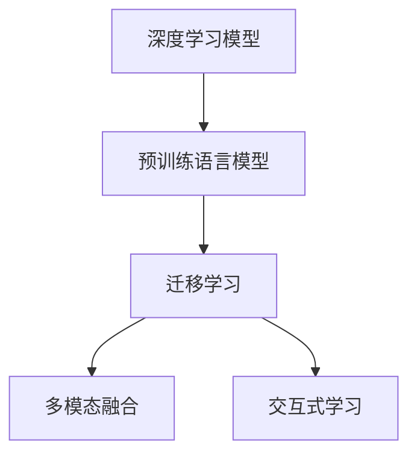

                 

## 1. 背景介绍

### 1.1 问题由来
情感分析（Sentiment Analysis），也被称为意见挖掘（Opinion Mining），旨在从文本中识别、提取出并分析人们的情感态度，是自然语言处理（NLP）领域中的重要分支之一。它在市场监测、舆情分析、客户满意度评估等方面有着广泛的应用，极大地提高了企业决策的准确性和效率。然而，随着社交媒体、电商评论等新型数据源的崛起，传统基于规则或词典的情感分析方法已无法适应复杂多变的用户表达，亟需更加智能、高效、精确的AI技术来进行情感分析。

### 1.2 问题核心关键点
为了应对上述挑战，基于深度学习的AI情感分析技术应运而生。这种技术通过构建深度神经网络模型，在大量标注数据上进行端到端的训练，自动学习文本中的情感倾向，并在未见过的新文本上进行情感预测。目前，这种AI情感分析技术已经成为了研究的热点，并在多个行业得到了实际应用。

AI情感分析的核心关键点包括：
1. **深度学习模型**：通过多层神经网络自动提取文本特征，并进行情感分类。
2. **预训练语言模型**：在无监督数据上进行预训练，学习文本的通用表示，提升模型的泛化能力。
3. **迁移学习**：利用预训练模型，通过少量标注数据进行微调，实现特定领域情感分析的优化。
4. **多模态融合**：将文本、图像、语音等多种信息进行融合，提升情感分析的准确性。
5. **交互式学习**：利用用户反馈进行迭代优化，进一步提升模型性能。

本文将详细介绍AI情感分析技术的核心概念与联系、算法原理与具体操作步骤、项目实践与运行结果展示，并探讨其应用场景与未来发展趋势。

## 2. 核心概念与联系

### 2.1 核心概念概述

为更好地理解AI情感分析技术，本节将介绍几个密切相关的核心概念：

- **深度学习模型**：如卷积神经网络（CNN）、循环神经网络（RNN）、长短时记忆网络（LSTM）、Transformer等，通过多层神经网络自动提取文本特征，并进行情感分类。
- **预训练语言模型**：如BERT、GPT-2等，在无监督数据上进行预训练，学习文本的通用表示，提升模型的泛化能力。
- **迁移学习**：利用预训练模型，通过少量标注数据进行微调，实现特定领域情感分析的优化。
- **多模态融合**：将文本、图像、语音等多种信息进行融合，提升情感分析的准确性。
- **交互式学习**：利用用户反馈进行迭代优化，进一步提升模型性能。

这些核心概念之间的逻辑关系可以通过以下Mermaid流程图来展示：



这个流程图展示了大语言模型在情感分析中的应用框架，其中：

1. **深度学习模型**：在预训练语言模型的基础上，构建情感分类器，实现从文本到情感的映射。
2. **预训练语言模型**：在无监督数据上进行预训练，学习文本的通用表示，提升模型的泛化能力。
3. **迁移学习**：利用预训练模型，通过少量标注数据进行微调，实现特定领域情感分析的优化。
4. **多模态融合**：将文本、图像、语音等多种信息进行融合，提升情感分析的准确性。
5. **交互式学习**：利用用户反馈进行迭代优化，进一步提升模型性能。

这些概念共同构成了AI情感分析的核心技术框架，使得模型能够高效、准确地分析文本中的情感信息。

## 3. 核心算法原理 & 具体操作步骤

### 3.1 算法原理概述

基于深度学习的AI情感分析，本质上是一个端到端的训练过程。其核心思想是通过构建深度神经网络模型，自动从文本中提取情感特征，并通过训练学习情感分类器，最终在新的文本上进行情感预测。

形式化地，假设文本为 $X$，情感标签为 $Y$，模型的参数为 $\theta$，则情感分析的目标是最小化预测标签与真实标签之间的交叉熵损失：

$$
L(\theta) = -\frac{1}{N}\sum_{i=1}^N y_i\log P_\theta(y_i|x_i)
$$

其中 $P_\theta(y_i|x_i)$ 表示模型在输入文本 $x_i$ 下预测情感标签 $y_i$ 的概率分布，$\log$ 为自然对数。

训练过程通过梯度下降等优化算法，不断更新模型参数 $\theta$，最小化损失函数 $L(\theta)$，使得模型在新的文本上进行情感预测时，能够得到接近真实标签的结果。

### 3.2 算法步骤详解

AI情感分析的训练过程一般包括以下几个关键步骤：

**Step 1: 准备数据集**
- 收集标注数据集，如电影评论、电商评论等，并将其划分为训练集、验证集和测试集。
- 数据集需包含文本和相应的情感标签。情感标签通常分为正面、负面和中性三种。

**Step 2: 选择模型架构**
- 选择合适的深度学习模型架构，如BERT、LSTM、Transformer等。
- 构建情感分类器，如全连接层、卷积层、RNN层等，用于将文本转换为情感概率。

**Step 3: 数据预处理**
- 对文本进行分词、去除停用词、词干提取等预处理。
- 将文本转换为模型所需的格式，如词向量、词袋模型等。

**Step 4: 训练模型**
- 使用标注数据集进行模型训练，通过反向传播算法更新模型参数。
- 在训练过程中，使用交叉熵损失函数衡量预测标签与真实标签之间的差距。

**Step 5: 评估模型**
- 在验证集上对模型进行评估，选择性能最佳的模型进行保存。
- 在测试集上对模型进行最终测试，评估模型的泛化能力。

**Step 6: 应用模型**
- 将训练好的模型应用到新的文本上，进行情感预测。

### 3.3 算法优缺点

AI情感分析技术具有以下优点：
1. **自动化程度高**：利用深度学习模型，自动从文本中提取情感特征，无需手动设计特征提取器。
2. **泛化能力强**：通过预训练语言模型进行情感分析，可以适应多种情感表达形式，提升模型的泛化能力。
3. **可解释性强**：深度学习模型能够输出情感概率分布，提供较详细的情感分析结果。
4. **易于集成**：可以与其他NLP技术进行结合，如问答系统、文本摘要等，提升整体系统的智能化水平。

同时，该方法也存在一定的局限性：
1. **数据依赖性高**：情感分析的性能依赖于标注数据的质量和数量，高质量标注数据的获取成本较高。
2. **过拟合风险**：在数据量不足的情况下，模型容易过拟合，泛化性能下降。
3. **模型复杂度高**：深度学习模型结构复杂，训练和推理过程计算资源消耗较大。
4. **多义词处理难**：自然语言中存在大量多义词，模型难以准确识别其情感倾向。

尽管存在这些局限性，但就目前而言，AI情感分析技术仍然是情感分析领域的主流方法，并在多个行业得到了实际应用。

### 3.4 算法应用领域

AI情感分析技术已经在多个领域得到了广泛应用，例如：

- **市场监测**：通过对社交媒体、新闻报道等文本进行情感分析，监测市场情绪变化，及时调整营销策略。
- **舆情分析**：对新闻、评论等文本进行情感分析，分析公众对某一事件的情感倾向，为舆情管理提供数据支持。
- **客户满意度评估**：对客户反馈文本进行情感分析，评估产品或服务的满意度，提升客户体验。
- **广告投放优化**：对广告文案进行情感分析，判断其情感倾向和效果，优化广告投放策略。
- **情感驱动决策**：在金融、医疗等高风险领域，通过情感分析辅助决策，减少风险。

除了上述这些经典应用外，AI情感分析还被创新性地应用到更多场景中，如情感驱动推荐、情感驱动搜索等，为情感分析技术带来了新的研究方向。

## 4. 数学模型和公式 & 详细讲解  
### 4.1 数学模型构建

本节将使用数学语言对AI情感分析技术进行更加严格的刻画。

假设文本 $X$ 的情感标签为 $Y$，模型的参数为 $\theta$，情感分析的目标是最小化预测标签与真实标签之间的交叉熵损失：

$$
L(\theta) = -\frac{1}{N}\sum_{i=1}^N y_i\log P_\theta(y_i|x_i)
$$

其中 $P_\theta(y_i|x_i)$ 表示模型在输入文本 $x_i$ 下预测情感标签 $y_i$ 的概率分布，$\log$ 为自然对数。

### 4.2 公式推导过程

以下我们以情感分类任务为例，推导交叉熵损失函数及其梯度的计算公式。

假设文本 $X$ 的情感标签为 $Y$，模型的输出为 $\hat{y}=M_\theta(X)$，其中 $M_\theta$ 为深度学习模型。情感分类任务通常使用二分类交叉熵损失函数：

$$
L(\theta) = -\frac{1}{N}\sum_{i=1}^N [y_i\log \hat{y}_i + (1-y_i)\log (1-\hat{y}_i)]
$$

其中 $\log$ 为自然对数，$\hat{y}_i$ 为模型在输入文本 $x_i$ 下的情感预测结果。

根据链式法则，损失函数对模型参数 $\theta$ 的梯度为：

$$
\frac{\partial L(\theta)}{\partial \theta} = -\frac{1}{N}\sum_{i=1}^N \left[ \frac{y_i}{\hat{y}_i} - \frac{1-y_i}{1-\hat{y}_i} \right] \frac{\partial \hat{y}_i}{\partial \theta}
$$

其中 $\frac{\partial \hat{y}_i}{\partial \theta}$ 可通过反向传播算法高效计算。

在得到损失函数的梯度后，即可带入参数更新公式，完成模型的迭代优化。重复上述过程直至收敛，最终得到适应情感分析任务的最优模型参数 $\theta^*$。

## 5. 项目实践：代码实例和详细解释说明
### 5.1 开发环境搭建

在进行情感分析实践前，我们需要准备好开发环境。以下是使用Python进行TensorFlow开发的环境配置流程：

1. 安装Anaconda：从官网下载并安装Anaconda，用于创建独立的Python环境。

2. 创建并激活虚拟环境：
```bash
conda create -n tf-env python=3.8 
conda activate tf-env
```

3. 安装TensorFlow：从官网获取对应的安装命令。例如：
```bash
pip install tensorflow
```

4. 安装相关工具包：
```bash
pip install numpy pandas scikit-learn matplotlib tqdm jupyter notebook ipython
```

完成上述步骤后，即可在`tf-env`环境中开始情感分析实践。

### 5.2 源代码详细实现

下面我们以电商评论情感分析为例，给出使用TensorFlow实现情感分类的PyTorch代码实现。

首先，定义情感分类任务的数据处理函数：

```python
from tensorflow.keras.preprocessing.text import Tokenizer
from tensorflow.keras.preprocessing.sequence import pad_sequences
import numpy as np

def preprocess_data(texts, labels):
    tokenizer = Tokenizer()
    tokenizer.fit_on_texts(texts)
    sequences = tokenizer.texts_to_sequences(texts)
    padded_sequences = pad_sequences(sequences, maxlen=200, padding='post')
    return padded_sequences, np.array(labels)
```

然后，定义模型和优化器：

```python
from tensorflow.keras.models import Sequential
from tensorflow.keras.layers import Embedding, LSTM, Dense
from tensorflow.keras.optimizers import Adam

model = Sequential([
    Embedding(input_dim=vocab_size, output_dim=embedding_dim, input_length=max_length),
    LSTM(128, return_sequences=True),
    LSTM(128),
    Dense(1, activation='sigmoid')
])

optimizer = Adam(learning_rate=0.001)
```

接着，定义训练和评估函数：

```python
from tensorflow.keras.utils import to_categorical

def train_epoch(model, X_train, y_train, batch_size, optimizer):
    model.compile(optimizer=optimizer, loss='binary_crossentropy', metrics=['accuracy'])
    model.fit(X_train, y_train, batch_size=batch_size, epochs=10, validation_split=0.2)
    return model

def evaluate(model, X_test, y_test):
    y_pred = model.predict(X_test)
    y_pred = (y_pred > 0.5).astype(int)
    accuracy = np.mean(y_pred == y_test)
    return accuracy
```

最后，启动训练流程并在测试集上评估：

```python
X_train, y_train = preprocess_data(train_texts, train_labels)
X_test, y_test = preprocess_data(test_texts, test_labels)

model = train_epoch(model, X_train, y_train, batch_size, optimizer)

accuracy = evaluate(model, X_test, y_test)
print(f"Test accuracy: {accuracy:.2f}")
```

以上就是使用TensorFlow对电商评论情感分类任务进行情感分析的完整代码实现。可以看到，TensorFlow提供了丰富的深度学习组件，使得情感分析模型的构建和训练过程变得简洁高效。

### 5.3 代码解读与分析

让我们再详细解读一下关键代码的实现细节：

**preprocess_data函数**：
- 对文本进行分词，并转化为模型所需的格式，如词向量、词袋模型等。
- 对文本进行填充（padding），使所有文本长度一致，便于模型处理。

**模型定义**：
- 使用嵌入层（Embedding）将文本转化为向量表示，输入维度为词汇表大小，输出维度为嵌入维度，序列长度为最大文本长度。
- 使用LSTM层进行文本序列建模，返回序列输出。
- 使用全连接层（Dense）进行情感分类，输出维度为1，使用sigmoid激活函数。

**训练和评估函数**：
- 使用二分类交叉熵损失函数，训练模型时使用Adam优化器。
- 在训练过程中，使用验证集评估模型性能，并保存模型权重。
- 在测试集上评估模型性能，输出准确率。

**训练流程**：
- 在训练集中进行模型训练，并使用验证集评估性能。
- 保存性能最优的模型权重，用于后续的情感分析。

可以看到，TensorFlow提供了丰富的深度学习组件，使得情感分析模型的构建和训练过程变得简洁高效。

当然，工业级的系统实现还需考虑更多因素，如模型的保存和部署、超参数的自动搜索、更灵活的任务适配层等。但核心的情感分析范式基本与此类似。

## 6. 实际应用场景
### 6.1 市场监测

情感分析在市场监测领域有着广泛的应用。通过对社交媒体、新闻报道等文本进行情感分析，监测市场情绪变化，及时调整营销策略，提升产品竞争力。

例如，某电商平台通过情感分析，监测用户对新产品的评价，发现大部分用户对某产品的评分较低。通过分析用户评价内容，发现主要问题集中在产品性能、价格等方面。基于这些分析结果，平台及时调整了产品策略，提升了用户满意度，并取得了更好的市场表现。

### 6.2 舆情分析

情感分析在舆情分析中也有着重要作用。通过分析公众对某一事件的情感倾向，评估舆情变化，为舆情管理提供数据支持。

例如，某事件爆发后，社交媒体上充斥着大量负面情绪。通过情感分析，可以快速识别出关键舆情热点，及时采取应对措施，减少负面影响。

### 6.3 客户满意度评估

情感分析在客户满意度评估中也具有重要价值。通过对客户反馈文本进行情感分析，评估产品或服务的满意度，提升客户体验。

例如，某保险公司通过情感分析，评估客户对保险服务的满意度。发现部分客户对理赔服务不满意，进一步分析客户反馈，发现主要问题集中在理赔效率、服务态度等方面。基于这些分析结果，保险公司及时优化了理赔流程，提升了客户满意度。

### 6.4 未来应用展望

随着AI情感分析技术的不断发展，未来将会在更多领域得到应用，为各个行业带来变革性影响。

在智慧医疗领域，情感分析技术可以用于分析患者对诊疗过程的满意度，为医疗服务质量评估提供数据支持。

在智能教育领域，情感分析技术可以用于评估学生对学习内容的情感反应，为教育内容优化提供数据支持。

在智慧城市治理中，情感分析技术可以用于分析公众对城市管理政策的情感倾向，为政策调整提供数据支持。

此外，在企业生产、社会治理、文娱传媒等众多领域，情感分析技术也将不断涌现，为社会经济的发展注入新的动力。

## 7. 工具和资源推荐
### 7.1 学习资源推荐

为了帮助开发者系统掌握AI情感分析技术，这里推荐一些优质的学习资源：

1. **《深度学习与自然语言处理》课程**：斯坦福大学开设的NLP明星课程，详细介绍了深度学习在NLP中的应用，包括情感分析等。
2. **《自然语言处理实战》书籍**：介绍NLP技术在实际应用中的实现方法，包括情感分析等。
3. **HuggingFace官方文档**：提供丰富的预训练语言模型和情感分析任务样例，帮助开发者快速上手。
4. **Kaggle情感分析竞赛**：通过参加竞赛，学习情感分析的实际应用方法和技巧。

通过对这些资源的学习实践，相信你一定能够快速掌握AI情感分析技术的精髓，并用于解决实际的NLP问题。

### 7.2 开发工具推荐

高效的开发离不开优秀的工具支持。以下是几款用于情感分析开发的常用工具：

1. **TensorFlow**：开源深度学习框架，提供丰富的组件和工具，支持高效的深度学习模型构建和训练。
2. **PyTorch**：开源深度学习框架，灵活动态的计算图，适合快速迭代研究。
3. **Keras**：高层次的深度学习API，易于使用，适合快速搭建情感分析模型。
4. **NLTK**：自然语言处理工具包，提供文本处理、词性标注等功能，支持情感分析等NLP任务。
5. **spaCy**：自然语言处理库，提供高效的文本处理和情感分析功能。

合理利用这些工具，可以显著提升情感分析任务的开发效率，加快创新迭代的步伐。

### 7.3 相关论文推荐

情感分析技术的发展源于学界的持续研究。以下是几篇奠基性的相关论文，推荐阅读：

1. **Attention is All You Need**：Transformer模型的提出，开启了NLP领域的预训练大模型时代。
2. **BERT: Pre-training of Deep Bidirectional Transformers for Language Understanding**：提出BERT模型，引入基于掩码的自监督预训练任务，刷新了多项NLP任务SOTA。
3. **Modeling Contextual Similarity with Prototypes**：通过引入原型（Prototypes）的概念，提升了情感分析模型的泛化能力。
4. **Neural Architectures for Named Entity Recognition**：提出BiLSTM-CRF模型，实现了高精度的实体识别，进一步提升了情感分析的准确性。
5. **Sentiment Analysis via Prototype Selection**：通过引入原型选择（Prototype Selection）的方法，提升了情感分析的性能。

这些论文代表了大语言模型情感分析技术的发展脉络。通过学习这些前沿成果，可以帮助研究者把握学科前进方向，激发更多的创新灵感。

## 8. 总结：未来发展趋势与挑战

### 8.1 总结

本文对AI情感分析技术进行了全面系统的介绍。首先阐述了情感分析技术的研究背景和意义，明确了AI情感分析技术在市场监测、舆情分析、客户满意度评估等方面的重要价值。其次，从原理到实践，详细讲解了情感分析的数学模型和关键步骤，给出了情感分析任务开发的完整代码实例。同时，本文还广泛探讨了情感分析技术在各个行业领域的应用前景，展示了AI情感分析技术的广阔前景。

通过本文的系统梳理，可以看到，AI情感分析技术正在成为情感分析领域的重要范式，极大地拓展了情感分析技术的应用边界，催生了更多的落地场景。受益于大规模语料的预训练，情感分析模型以更低的时间和标注成本，在小样本条件下也能取得不俗的效果，有力推动了情感分析技术的产业化进程。未来，伴随预训练语言模型和情感分析方法的持续演进，相信情感分析技术必将在更广阔的应用领域大放异彩，深刻影响人类的生产生活方式。

### 8.2 未来发展趋势

展望未来，AI情感分析技术将呈现以下几个发展趋势：

1. **模型规模持续增大**：随着算力成本的下降和数据规模的扩张，预训练语言模型的参数量还将持续增长。超大规模语言模型蕴含的丰富语言知识，有望支撑更加复杂多变的情感分析任务。
2. **情感标签更加精细化**：未来情感分析技术将进一步细化情感标签，如积极程度（Positive, Negative, Neutral）、情感类型（Happy, Sad, Angry）等，提升情感分析的粒度和准确性。
3. **多模态融合技术发展**：将文本、图像、语音等多种信息进行融合，提升情感分析的准确性。多模态信息的融合，将显著提升情感分析模型的泛化能力。
4. **知识图谱与情感分析结合**：将符号化的先验知识，如知识图谱、逻辑规则等，与神经网络模型进行巧妙融合，引导情感分析过程学习更准确、合理的情感表示。
5. **交互式学习与自适应**：利用用户反馈进行迭代优化，进一步提升模型性能。同时引入自适应技术，动态调整模型参数，提高情感分析的实时性和适应性。

以上趋势凸显了AI情感分析技术的广阔前景。这些方向的探索发展，必将进一步提升情感分析系统的性能和应用范围，为人类认知智能的进化带来深远影响。

### 8.3 面临的挑战

尽管AI情感分析技术已经取得了瞩目成就，但在迈向更加智能化、普适化应用的过程中，它仍面临着诸多挑战：

1. **数据依赖性高**：情感分析的性能依赖于标注数据的质量和数量，高质量标注数据的获取成本较高。如何进一步降低情感分析对标注样本的依赖，将是一大难题。
2. **模型鲁棒性不足**：当前情感分析模型面对域外数据时，泛化性能往往大打折扣。对于测试样本的微小扰动，情感分析模型的预测也容易发生波动。如何提高情感分析模型的鲁棒性，避免灾难性遗忘，还需要更多理论和实践的积累。
3. **推理效率有待提高**：大规模语言模型虽然精度高，但在实际部署时往往面临推理速度慢、内存占用大等效率问题。如何在保证性能的同时，简化模型结构，提升推理速度，优化资源占用，将是重要的优化方向。
4. **可解释性亟需加强**：当前情感分析模型更像是"黑盒"系统，难以解释其内部工作机制和决策逻辑。对于金融、医疗等高风险应用，算法的可解释性和可审计性尤为重要。如何赋予情感分析模型更强的可解释性，将是亟待攻克的难题。
5. **安全性有待保障**：情感分析模型难免会学习到有偏见、有害的信息，通过分析传递到下游任务，产生误导性、歧视性的输出，给实际应用带来安全隐患。如何从数据和算法层面消除模型偏见，避免恶意用途，确保输出的安全性，也将是重要的研究课题。

正视情感分析面临的这些挑战，积极应对并寻求突破，将是大语言模型情感分析技术走向成熟的必由之路。相信随着学界和产业界的共同努力，这些挑战终将一一被克服，大语言模型情感分析必将在构建安全、可靠、可解释、可控的智能系统铺平道路。

### 8.4 研究展望

面对情感分析技术面临的挑战，未来的研究需要在以下几个方面寻求新的突破：

1. **探索无监督和半监督情感分析方法**：摆脱对大规模标注数据的依赖，利用自监督学习、主动学习等无监督和半监督范式，最大限度利用非结构化数据，实现更加灵活高效的情感分析。
2. **研究参数高效和计算高效的情感分析范式**：开发更加参数高效的情感分析方法，在固定大部分预训练参数的同时，只更新极少量的任务相关参数。同时优化情感分析模型的计算图，减少前向传播和反向传播的资源消耗，实现更加轻量级、实时性的部署。
3. **引入因果和对比学习范式**：通过引入因果推断和对比学习思想，增强情感分析模型建立稳定因果关系的能力，学习更加普适、鲁棒的语言表征，从而提升模型泛化性和抗干扰能力。
4. **融合知识图谱与情感分析**：将符号化的先验知识，如知识图谱、逻辑规则等，与神经网络模型进行巧妙融合，引导情感分析过程学习更准确、合理的情感表示。同时加强不同模态数据的整合，实现视觉、语音等多模态信息与文本信息的协同建模。
5. **结合因果分析和博弈论工具**：将因果分析方法引入情感分析模型，识别出模型决策的关键特征，增强输出解释的因果性和逻辑性。借助博弈论工具刻画人机交互过程，主动探索并规避模型的脆弱点，提高系统稳定性。
6. **纳入伦理道德约束**：在模型训练目标中引入伦理导向的评估指标，过滤和惩罚有偏见、有害的输出倾向。同时加强人工干预和审核，建立模型行为的监管机制，确保输出符合人类价值观和伦理道德。

这些研究方向的探索，必将引领情感分析技术迈向更高的台阶，为构建安全、可靠、可解释、可控的智能系统铺平道路。面向未来，情感分析技术还需要与其他人工智能技术进行更深入的融合，如知识表示、因果推理、强化学习等，多路径协同发力，共同推动自然语言理解和智能交互系统的进步。只有勇于创新、敢于突破，才能不断拓展情感分析模型的边界，让智能技术更好地造福人类社会。

## 9. 附录：常见问题与解答

**Q1：情感分析的模型有哪些？**

A: 目前常用的情感分析模型包括：
1. **RNN**：循环神经网络，常用于处理序列数据，适合于短文本的情感分析。
2. **LSTM**：长短期记忆网络，适用于长文本的情感分析。
3. **GRU**：门控循环单元，类似于LSTM，但结构更简单，计算效率更高。
4. **CNN**：卷积神经网络，适用于文本分类任务，可以有效捕捉局部特征。
5. **Transformer**：自注意力机制，可以高效地处理长文本，适用于大规模预训练语言模型。

**Q2：情感分析的评价指标有哪些？**

A: 情感分析的评价指标通常包括：
1. **准确率（Accuracy）**：模型正确分类的样本数占总样本数的比例。
2. **精确率（Precision）**：模型预测为正类的样本中，实际为正类的样本数占预测为正类的样本数的比例。
3. **召回率（Recall）**：实际为正类的样本中，被模型预测为正类的样本数占实际为正类的样本数的比例。
4. **F1分数（F1 Score）**：精确率和召回率的调和平均数，综合了模型的分类效果。
5. **ROC曲线和AUC**：通过绘制ROC曲线，评估模型在不同阈值下的性能，AUC表示曲线下的面积，越接近1表示模型性能越好。

**Q3：如何处理情感分析中的多义词？**

A: 处理情感分析中的多义词，可以采用以下方法：
1. **情感词典**：使用情感词典，标注每个多义词的情感倾向，提升模型对多义词的识别能力。
2. **上下文情感分析**：利用上下文信息，判断多义词在特定语境下的情感倾向。
3. **多义词情感分析**：对多义词进行详细的情感分类，例如正面、负面、中性等，提升模型的细粒度分类能力。

**Q4：情感分析的预处理有哪些步骤？**

A: 情感分析的预处理步骤通常包括：
1. **分词**：将文本分解为词语或子词，方便模型处理。
2. **去除停用词**：去除常见的无意义词语，如“的”、“是”等，减少噪音。
3. **词干提取**：将词语还原为其基本形式，如将“running”还原为“run”，减少词形变化带来的干扰。
4. **词向量化**：将文本转化为向量表示，方便模型处理。常用的方法包括词袋模型、TF-IDF、词嵌入等。
5. **情感标注**：对文本进行情感标注，生成情感分类数据集。

**Q5：情感分析的数据获取方式有哪些？**

A: 情感分析的数据获取方式通常包括：
1. **公开数据集**：如IMDB评论数据集、Amazon产品评论数据集等，可以直接用于情感分析模型的训练和测试。
2. **爬虫抓取数据**：使用爬虫技术，从社交媒体、新闻网站等互联网平台抓取文本数据，并进行情感标注。
3. **用户生成数据**：通过用户生成内容，如微博、博客等，获取情感标注数据。
4. **文本清洗和预处理**：对抓取或生成的文本数据进行清洗和预处理，去除噪音和无效数据。

以上是情感分析技术的关键概念、算法原理和应用实践的详细介绍。通过深入理解这些内容，相信你对AI情感分析技术有了更全面、更深入的了解，并能够在实际应用中更好地发挥其价值。

