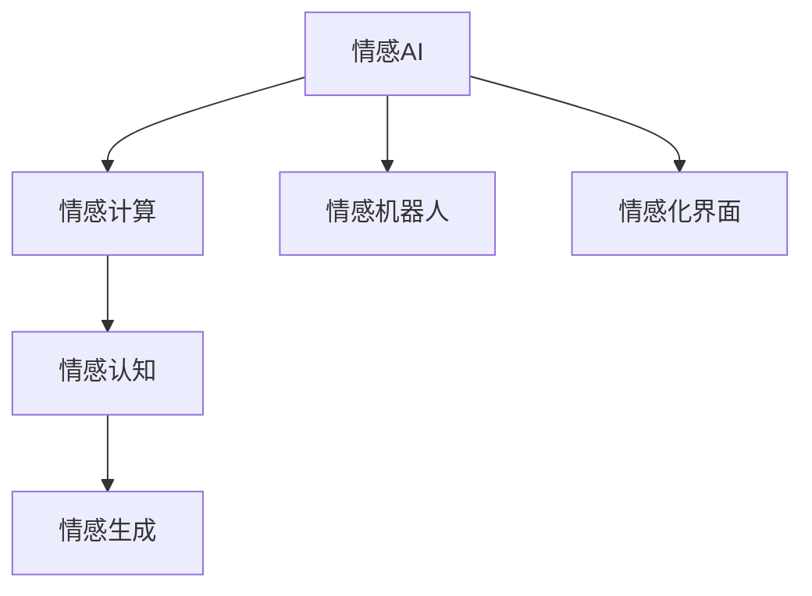

                 

## 1. 背景介绍

### 1.1 问题由来
随着人工智能技术的飞速发展，AI已经逐渐融入到我们的日常生活中，从智能家居到自动驾驶，从聊天机器人到医疗诊断，AI技术的触角已经伸展到社会的各个角落。但是，尽管AI技术在技术层面上已经达到了相当的高度，却在情感寄托方面存在明显不足。这一领域，我们通常称之为“情感AI”。

### 1.2 问题核心关键点
情感AI的研究旨在赋予人工智能更加人性化的情感表达和理解能力，使机器能够像人类一样，具有共情心、同情心和同理心。情感AI的实现需要AI技术与心理学、语言学、伦理学等多学科的交叉融合。

### 1.3 问题研究意义
情感AI的研究对于提升人机交互体验，促进社会包容性，改善心理健康等方面具有重要意义：

1. **提升人机交互体验**：在人际交往中，情感理解是关键。情感AI能够更好地理解人类的情感需求，提供更加人性化的交互体验。
2. **促进社会包容性**：对于残障人士、老年人等群体，情感AI可以提供更为贴心的服务，促进社会包容和和谐。
3. **改善心理健康**：情感AI可以充当情感支持工具，帮助人们处理情绪问题，减轻心理压力。

## 2. 核心概念与联系

### 2.1 核心概念概述

为更好地理解AI技术与情感寄托的结合，本节将介绍几个密切相关的核心概念：

- **情感AI (Affective AI)**：通过人工智能技术，赋予机器能够识别、表达和处理人类情感的能力。
- **情感计算 (Affective Computing)**：研究如何利用计算机科学和认知科学的方法来识别、表达和交互情感的技术。
- **情感机器人 (Emotion Robotics)**：结合机器人技术和情感计算的机器，旨在提供情感化的人机交互体验。
- **情感化界面 (Emotional Interface)**：通过设计包含情感元素的交互界面，增强用户的情感体验。
- **情感认知 (Emotional Recognition)**：通过面部表情、语音、文本等多种手段，识别用户的情感状态。
- **情感生成 (Emotional Generation)**：通过AI技术生成符合情感需求的文本、语音、图像等。

这些概念之间的逻辑关系可以通过以下Mermaid流程图来展示：



这个流程图展示了几大核心概念之间的联系：

1. 情感AI是整个研究的出发点，通过情感计算、情感机器人等技术手段实现。
2. 情感认知是情感计算的基础，通过识别用户的情感状态，为情感生成提供输入。
3. 情感生成是情感AI的核心，通过生成符合情感需求的文本、语音等，实现情感表达。
4. 情感化界面是用户与情感AI交互的界面，增强用户的情感体验。

## 3. 核心算法原理 & 具体操作步骤
### 3.1 算法原理概述

情感AI的核心算法原理主要包括情感认知和情感生成两个方面：

- **情感认知**：通过面部表情、语音、文本等多种手段，识别用户的情感状态。常用的方法包括机器学习、深度学习等。
- **情感生成**：通过生成符合情感需求的文本、语音、图像等，实现情感表达。常用的方法包括语言模型、生成对抗网络(GAN)等。

情感AI的实现过程通常包括以下几个关键步骤：

1. 收集用户情感数据：通过面部表情、语音、文本等方式，收集用户在不同情感状态下的数据。
2. 情感识别：使用情感认知算法，识别用户情感状态。
3. 情感生成：根据情感识别结果，使用情感生成算法生成符合情感需求的文本、语音等。
4. 情感输出：将生成的情感文本、语音等反馈给用户，实现情感表达。

### 3.2 算法步骤详解

以基于深度学习的情感AI为例，下面详细介绍情感认知和情感生成两个核心算法步骤：

**情感认知算法**：

1. **数据收集**：收集用户面部表情、语音、文本等多种情感数据。
2. **特征提取**：使用深度学习技术提取情感特征。
3. **情感分类**：使用分类算法，如卷积神经网络(CNN)、循环神经网络(RNN)等，对情感特征进行分类，识别用户的情感状态。

**情感生成算法**：

1. **数据收集**：收集大量情感文本、语音等数据，作为训练样本。
2. **模型训练**：使用深度学习技术训练情感生成模型，如生成对抗网络(GAN)、变分自编码器(VAE)等。
3. **情感生成**：根据情感识别结果，使用训练好的情感生成模型生成符合情感需求的文本、语音等。

### 3.3 算法优缺点

情感AI的优点包括：

1. **情感表达真实自然**：情感AI可以生成符合情感需求的文本、语音等，实现更加真实自然的情感表达。
2. **应用广泛**：情感AI可以应用于情感机器人、聊天机器人、情感化界面等多种场景。
3. **提升用户体验**：情感AI能够更好地理解用户的情感需求，提供更加人性化的交互体验。

情感AI的缺点包括：

1. **数据隐私问题**：收集和处理用户情感数据需要确保数据隐私和安全。
2. **算法复杂度高**：情感AI的实现涉及多个学科的交叉融合，算法复杂度高。
3. **情感认知难度大**：情感认知涉及多模态数据，识别难度大，误差率高。
4. **情感生成难度大**：生成符合情感需求的文本、语音等需要高质量的训练数据和模型，难度较大。

### 3.4 算法应用领域

情感AI在众多领域都具有广泛的应用前景：

1. **情感机器人**：情感机器人可以通过情感AI技术，实现更加人性化的交互体验。
2. **聊天机器人**：情感聊天机器人能够更好地理解用户的情感需求，提供更加贴心的服务。
3. **情感化界面**：情感化界面可以通过情感AI技术，增强用户的情感体验。
4. **情感治疗**：情感AI可以充当情感支持工具，帮助人们处理情绪问题，减轻心理压力。
5. **智能家居**：情感AI可以用于智能家居系统，提供更加人性化的交互体验。
6. **市场营销**：情感AI可以用于市场营销，更好地了解消费者的情感需求，提升营销效果。

## 4. 数学模型和公式 & 详细讲解 & 举例说明

### 4.1 数学模型构建

以情感认知为例，下面详细介绍情感认知的数学模型构建过程：

假设用户情感状态可以用情感标签 $y$ 表示，情感特征用 $x$ 表示。情感认知的数学模型可以表示为：

$$
y = f(x;\theta)
$$

其中，$f(\cdot;\theta)$ 是情感认知模型，$\theta$ 是模型参数。

情感认知模型的输入 $x$ 可以是用户的面部表情、语音、文本等，输出 $y$ 是情感标签。情感认知模型的目标是最小化损失函数 $\mathcal{L}(\theta)$，即：

$$
\theta^* = \mathop{\arg\min}_{\theta} \mathcal{L}(\theta)
$$

### 4.2 公式推导过程

以卷积神经网络(CNN)为例，下面详细介绍情感认知模型的公式推导过程：

1. **输入层**：输入层接收用户的面部表情、语音、文本等情感数据。
2. **卷积层**：使用卷积神经网络提取情感特征，即：

$$
h = \sigma(W_hx + b_h)
$$

其中，$h$ 是卷积层的输出，$W_h$ 是卷积核，$x$ 是输入，$b_h$ 是偏置。
3. **池化层**：使用池化层对卷积层的输出进行降维处理。
4. **全连接层**：使用全连接层将池化层的输出映射到情感标签空间，即：

$$
y = \sigma(W_yh + b_y)
$$

其中，$y$ 是情感认知模型的输出，$W_y$ 是全连接层的权重矩阵，$h$ 是池化层的输出。

情感认知模型的损失函数可以采用交叉熵损失函数：

$$
\mathcal{L}(\theta) = -\frac{1}{N}\sum_{i=1}^N y_i \log f(x_i;\theta)
$$

### 4.3 案例分析与讲解

假设我们收集了50个用户的面部表情数据，每个数据包含50个像素点的灰度值，将其作为输入 $x$。我们使用卷积神经网络模型进行情感认知，模型的输出 $y$ 为二分类标签（即高兴和悲伤）。

我们定义卷积神经网络的超参数为：卷积核大小为3x3，卷积核数量为32，池化层为最大池化，全连接层节点数量为128。通过交叉熵损失函数进行训练，最终得到情感认知模型的参数 $\theta^*$。

## 5. 项目实践：代码实例和详细解释说明

### 5.1 开发环境搭建

要进行情感AI的开发实践，首先需要搭建好开发环境。以下是使用Python进行TensorFlow开发的环境配置流程：

1. 安装Anaconda：从官网下载并安装Anaconda，用于创建独立的Python环境。

2. 创建并激活虚拟环境：
```bash
conda create -n tensorflow-env python=3.8 
conda activate tensorflow-env
```

3. 安装TensorFlow：根据CUDA版本，从官网获取对应的安装命令。例如：
```bash
conda install tensorflow -c tf -c conda-forge
```

4. 安装其他依赖库：
```bash
pip install numpy pandas scikit-learn tensorflow-hub tensorflow-addons
```

完成上述步骤后，即可在`tensorflow-env`环境中开始情感AI的开发实践。

### 5.2 源代码详细实现

下面我们以情感认知为例，给出使用TensorFlow进行卷积神经网络模型开发的PyTorch代码实现。

首先，定义情感认知模型的数据处理函数：

```python
import tensorflow_hub as hub
from tensorflow.keras import layers
from tensorflow.keras.models import Sequential
from tensorflow.keras.optimizers import Adam

def build_model(input_shape):
    model = Sequential([
        layers.Conv2D(32, 3, activation='relu', input_shape=input_shape),
        layers.MaxPooling2D(pool_size=(2, 2)),
        layers.Flatten(),
        layers.Dense(128, activation='relu'),
        layers.Dense(2, activation='softmax')
    ])
    model.compile(optimizer=Adam(lr=0.001), loss='categorical_crossentropy', metrics=['accuracy'])
    return model
```

然后，定义训练和评估函数：

```python
import numpy as np
from sklearn.model_selection import train_test_split
from tensorflow.keras.preprocessing.image import ImageDataGenerator

def train_and_evaluate(model, train_data, validation_data, epochs=10):
    model.fit(train_data, epochs=epochs, validation_data=validation_data)
    loss, accuracy = model.evaluate(validation_data)
    print(f"Validation Loss: {loss}, Validation Accuracy: {accuracy}")
    return model
```

最后，启动训练流程并在测试集上评估：

```python
from tensorflow.keras.preprocessing.image import img_to_array
from tensorflow.keras.preprocessing.image import load_img

# 定义训练集和测试集
train_data = []
test_data = []

# 加载训练集和测试集
for i in range(50):
    train_image = load_img(f'data/train/{i}.png', target_size=(50, 50))
    train_image = img_to_array(train_image) / 255.0
    train_data.append(train_image)
    
    test_image = load_img(f'data/test/{i}.png', target_size=(50, 50))
    test_image = img_to_array(test_image) / 255.0
    test_data.append(test_image)

# 将数据转换为TensorFlow可处理格式
train_data = np.array(train_data)
test_data = np.array(test_data)

# 定义输入形状
input_shape = (50, 50, 1)

# 构建情感认知模型
model = build_model(input_shape)

# 划分训练集和验证集
train_data, validation_data = train_test_split(train_data, test_size=0.2)

# 训练情感认知模型
model = train_and_evaluate(model, train_data, validation_data)
```

以上就是使用TensorFlow进行情感认知模型开发的完整代码实现。可以看到，得益于TensorFlow的强大封装，我们可以用相对简洁的代码完成情感认知模型的构建和训练。

### 5.3 代码解读与分析

让我们再详细解读一下关键代码的实现细节：

**build_model函数**：
- `model = Sequential`：定义一个顺序模型，用于堆叠神经网络层。
- `layers.Conv2D`：定义卷积层，提取情感特征。
- `layers.MaxPooling2D`：定义池化层，对卷积层的输出进行降维处理。
- `layers.Flatten`：定义展平层，将池化层的输出展平，送入全连接层。
- `layers.Dense`：定义全连接层，将展平层的输出映射到情感标签空间。
- `model.compile`：定义损失函数和优化器，准备训练模型。

**train_and_evaluate函数**：
- `model.fit`：对模型进行训练，指定训练集、验证集和迭代次数。
- `model.evaluate`：对模型进行评估，输出损失和准确率。

**训练流程**：
- `train_data`和`test_data`：定义训练集和测试集，并加载图像数据。
- `np.array`：将图像数据转换为TensorFlow可处理格式。
- `input_shape`：定义输入形状。
- `model = build_model(input_shape)`：使用构建的情感认知模型。
- `train_data, validation_data = train_test_split(train_data, test_size=0.2)`：将训练集划分为训练集和验证集。
- `model = train_and_evaluate(model, train_data, validation_data)`：训练情感认知模型，并在验证集上进行评估。

可以看到，TensorFlow配合深度学习模型封装，使得情感认知模型的开发实践变得简洁高效。开发者可以将更多精力放在数据处理、模型改进等高层逻辑上，而不必过多关注底层的实现细节。

当然，工业级的系统实现还需考虑更多因素，如模型的保存和部署、超参数的自动搜索、更灵活的任务适配层等。但核心的情感认知算法基本与此类似。

## 6. 实际应用场景

### 6.1 情感机器人

情感机器人可以通过情感AI技术，实现更加人性化的交互体验。例如，智能客服机器人可以通过情感认知算法，理解客户的情感需求，提供更加贴心的服务。

在技术实现上，情感机器人通常集成多模态数据采集、情感认知和情感生成等功能。通过收集客户的面部表情、语音、文本等数据，使用情感认知算法识别客户的情感状态，然后生成符合情感需求的文本或语音回应，从而实现情感化的交流。

### 6.2 情感化界面

情感化界面可以通过情感AI技术，增强用户的情感体验。例如，智能家居系统可以通过情感认知算法，识别用户的情感状态，自动调整家居设备的设置，提供更加人性化的服务。

在技术实现上，情感化界面通常集成面部表情、语音、文本等多种情感数据采集方式，使用情感认知算法识别用户的情感状态，然后根据情感状态，自动调整家居设备的设置，如灯光、温度、音乐等，从而实现情感化的家居体验。

### 6.3 情感治疗

情感AI可以充当情感支持工具，帮助人们处理情绪问题，减轻心理压力。例如，情感聊天机器人可以与用户进行情感对话，引导用户释放压力，缓解焦虑。

在技术实现上，情感聊天机器人通常集成面部表情、语音、文本等多种情感数据采集方式，使用情感认知算法识别用户的情感状态，然后生成符合情感需求的文本或语音回应，引导用户释放压力，缓解焦虑。

### 6.4 未来应用展望

随着情感AI技术的发展，其在更多领域将得到应用，为人类社会带来更多变革。

在智慧医疗领域，情感AI可以用于情感支持和治疗，帮助患者减轻心理压力，提升治疗效果。例如，情感聊天机器人可以与患者进行情感对话，提供情感支持和治疗建议。

在智能教育领域，情感AI可以用于情感诊断和情感干预，帮助学生应对学习压力，提升学习效果。例如，情感聊天机器人可以与学生进行情感对话，了解学生的情感状态，提供情感支持和学习建议。

在智能家居领域，情感AI可以用于情感化的家居服务，提升用户的生活质量。例如，情感化界面可以自动调整家居设备的设置，提供更加人性化的服务。

此外，在娱乐、营销、客服等多个领域，情感AI也将带来更多的创新应用，为人类社会带来更多便利和快乐。

## 7. 工具和资源推荐

### 7.1 学习资源推荐

为了帮助开发者系统掌握情感AI的理论基础和实践技巧，这里推荐一些优质的学习资源：

1. 《情感AI与情感计算》系列博文：由情感AI专家撰写，深入浅出地介绍了情感AI、情感计算等前沿话题。

2. 《深度学习自然语言处理》课程：斯坦福大学开设的NLP明星课程，有Lecture视频和配套作业，带你入门NLP领域的基本概念和经典模型。

3. 《情感认知与情感生成》书籍：详细介绍了情感认知和情感生成技术，是情感AI开发的重要参考资料。

4. TensorFlow官方文档：TensorFlow的官方文档，提供了海量深度学习模型和情感AI应用的样例代码，是上手实践的必备资料。

5. Kaggle数据集：包含多种情感数据集，可以用于情感AI开发的数据集训练和测试。

通过对这些资源的学习实践，相信你一定能够快速掌握情感AI的精髓，并用于解决实际的情感问题。

### 7.2 开发工具推荐

高效的开发离不开优秀的工具支持。以下是几款用于情感AI开发的常用工具：

1. TensorFlow：基于Python的开源深度学习框架，灵活动态的计算图，适合快速迭代研究。
2. PyTorch：基于Python的开源深度学习框架，动态图机制，灵活方便。
3. Keras：基于Python的高层深度学习框架，简单易用，适合快速原型开发。
4. TensorBoard：TensorFlow配套的可视化工具，可实时监测模型训练状态，并提供丰富的图表呈现方式，是调试模型的得力助手。
5. TensorFlow Hub：TensorFlow的模型库，提供了大量预训练模型和情感AI应用的样例代码，是上手实践的必备资料。

合理利用这些工具，可以显著提升情感AI开发的效率，加快创新迭代的步伐。

### 7.3 相关论文推荐

情感AI的研究源于学界的持续研究。以下是几篇奠基性的相关论文，推荐阅读：

1. Socially intelligent machines：社交智能机器的构建与挑战。
2. Emotion recognition using deep learning：基于深度学习的情感识别技术。
3. Emotion generation using neural networks：基于神经网络的情感生成技术。
4. Affective computing in healthcare：情感计算在医疗健康领域的应用。
5. Emotion detection in human-computer interaction：人类-计算机交互中的情感检测技术。

这些论文代表了大语言模型微调技术的发展脉络。通过学习这些前沿成果，可以帮助研究者把握学科前进方向，激发更多的创新灵感。

## 8. 总结：未来发展趋势与挑战

### 8.1 总结

本文对情感AI的实现原理和关键算法进行了全面系统的介绍。首先阐述了情感AI的研究背景和意义，明确了情感AI在提升人机交互体验、促进社会包容性、改善心理健康等方面的独特价值。其次，从原理到实践，详细讲解了情感认知和情感生成两个核心算法步骤，给出了情感AI开发的完整代码实例。同时，本文还探讨了情感AI在情感机器人、情感化界面、情感治疗等多个领域的应用前景，展示了情感AI技术的广阔前景。

通过本文的系统梳理，可以看到，情感AI技术正在逐步融入到我们的日常生活中，为人机交互带来更多的情感化体验。未来，伴随技术的不断进步，情感AI将更加智能、自然、人性化，为人类社会带来更多的幸福和快乐。

### 8.2 未来发展趋势

展望未来，情感AI技术将呈现以下几个发展趋势：

1. **多模态情感认知**：未来的情感认知将不仅依赖于单一的面部表情、语音、文本数据，还融合多模态数据，如脑电波、心率等生理信号，提升情感识别的准确性和实时性。
2. **动态情感生成**：未来的情感生成将根据用户的情境变化，动态生成符合情感需求的文本、语音等，提升情感表达的自然性和灵活性。
3. **跨文化情感理解**：未来的情感AI将具备跨文化情感理解能力，能够在不同文化背景下进行情感表达和交互。
4. **情感化机器学习**：未来的情感AI将与机器学习算法深度融合，提升情感识别的泛化能力和情感生成的多样性。
5. **情感AI伦理化**：未来的情感AI将更加注重伦理和安全问题，避免对用户的情感状态进行误判和滥用。
6. **情感AI个性化**：未来的情感AI将根据用户的个性化需求，提供更加定制化的情感服务。

以上趋势凸显了情感AI技术的广阔前景。这些方向的探索发展，必将进一步提升情感AI系统的性能和应用范围，为构建更加智能、自然、人性化的智能系统铺平道路。

### 8.3 面临的挑战

尽管情感AI技术已经取得了瞩目成就，但在迈向更加智能化、普适化应用的过程中，它仍面临诸多挑战：

1. **数据隐私问题**：情感AI的实现需要大量的情感数据，如何保障数据隐私和安全是一个重要的挑战。
2. **情感识别的准确性**：情感识别的准确性受限于多种因素，如环境噪声、用户情绪表达方式等，提升情感识别的准确性和鲁棒性需要更多的技术改进。
3. **情感生成的自然性**：情感生成的自然性和真实性需要高质量的训练数据和模型，生成符合情感需求的文本、语音等需要更多的技术改进。
4. **跨文化情感理解**：不同文化背景下的情感表达方式差异较大，如何实现跨文化情感理解是一个重要的挑战。
5. **情感AI伦理化**：情感AI的伦理和安全问题需要更多的研究，避免对用户的情感状态进行误判和滥用。

这些挑战需要通过多学科的交叉融合和技术的不断改进，才能逐步克服。相信随着技术的进步和研究的深入，情感AI必将带来更多变革性的应用，为人类社会带来更多的幸福和快乐。

### 8.4 研究展望

面对情感AI所面临的挑战，未来的研究需要在以下几个方面寻求新的突破：

1. **多模态情感认知技术**：开发更加高效、准确的多模态情感认知技术，融合多种数据源，提升情感识别的准确性和实时性。
2. **动态情感生成技术**：开发更加自然、灵活的动态情感生成技术，根据用户的情境变化，动态生成符合情感需求的文本、语音等。
3. **跨文化情感理解技术**：开发跨文化情感理解技术，实现不同文化背景下的情感表达和交互。
4. **情感AI伦理化技术**：开发情感AI伦理化技术，提升情感AI系统的透明性和可解释性，确保其安全性和可控性。
5. **情感AI个性化技术**：开发情感AI个性化技术，根据用户的个性化需求，提供更加定制化的情感服务。

这些研究方向的探索，必将引领情感AI技术迈向更高的台阶，为构建更加智能、自然、人性化的智能系统铺平道路。面向未来，情感AI技术还需要与其他人工智能技术进行更深入的融合，如知识表示、因果推理、强化学习等，多路径协同发力，共同推动情感AI技术的发展。只有勇于创新、敢于突破，才能不断拓展情感AI的边界，让智能技术更好地造福人类社会。

## 9. 附录：常见问题与解答

**Q1：情感AI是否会取代人类的情感交流？**

A: 情感AI可以提供更加便捷、灵活的情感交流方式，但在情感深度和复杂度上，仍然无法完全替代人类的情感交流。人类情感的丰富性和多样性，是情感AI难以企及的。因此，情感AI更多地作为人类情感交流的辅助工具，提升人机交互的效率和质量。

**Q2：情感AI的训练数据来源是什么？**

A: 情感AI的训练数据主要来源于社交媒体、电影、电视剧、音乐等多种媒体数据，以及真实场景中的面部表情、语音、文本等数据。这些数据需要进行标注和预处理，以提取情感特征和情感标签。

**Q3：情感AI的训练难度大吗？**

A: 情感AI的训练难度较大，需要大量的标注数据和高质量的模型。情感认知和情感生成的算法复杂度高，需要多学科的交叉融合。但是，随着深度学习技术的不断进步，情感AI的训练难度正在逐步降低。

**Q4：情感AI的伦理问题如何处理？**

A: 情感AI的伦理问题需要更多研究。在设计情感AI系统时，应充分考虑用户的隐私保护、情感尊严、信息安全等方面，确保情感AI系统的透明性和可解释性。同时，需要建立情感AI的监管机制，确保其安全性和可控性。

**Q5：情感AI在情感治疗中的作用是什么？**

A: 情感AI可以作为情感支持工具，帮助人们处理情绪问题，减轻心理压力。例如，情感聊天机器人可以与用户进行情感对话，引导用户释放压力，缓解焦虑。同时，情感AI还可以提供情感诊断和治疗建议，提升情感治疗的效果。

---

作者：禅与计算机程序设计艺术 / Zen and the Art of Computer Programming

