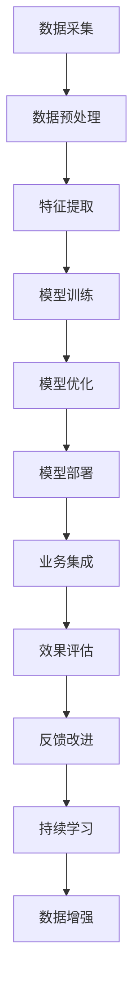

                 

# AI技术在不同场景中的应用

> 关键词：人工智能,机器学习,深度学习,自然语言处理(NLP),计算机视觉,机器人技术,智能推荐系统,数据挖掘,医疗健康,金融科技

## 1. 背景介绍

### 1.1 问题由来
近年来，人工智能（AI）技术取得了飞速发展，已经在诸多领域展现出强大的应用潜力。机器学习、深度学习、自然语言处理（NLP）、计算机视觉、机器人技术等AI子领域的突破性进展，正在深刻影响各行各业的业务模式和运营效率。

人工智能技术的应用范围遍及医疗健康、金融科技、智能推荐、制造工程、交通管理等诸多领域。各行业利用AI技术，提升产品服务质量，优化运营流程，增加收入，增强竞争力。

### 1.2 问题核心关键点
AI技术在各行业的应用，主要围绕以下几个关键点展开：

- **数据驱动决策**：AI技术能够从海量数据中提取有价值的信息，支持精准决策，降低不确定性。
- **自动化作业**：通过自动化流程，提升作业效率，减少人为错误。
- **个性化服务**：利用用户数据，提供个性化推荐，增强用户体验。
- **实时感知与反馈**：通过传感器和实时数据处理，实现对环境的实时感知与反馈，提升系统响应速度。
- **协同与优化**：利用协同优化算法，实现系统各部分的高效协同，优化整体性能。

本文将重点介绍AI技术在自然语言处理（NLP）、计算机视觉、机器人技术、智能推荐系统、数据挖掘与金融科技等多个场景中的应用，探讨其原理、实现步骤、优缺点和未来发展趋势。

## 2. 核心概念与联系

### 2.1 核心概念概述

为更好地理解AI技术在各场景的应用，我们先介绍几个关键概念：

- **机器学习**：通过数据训练模型，实现预测、分类、聚类等任务的技术。
- **深度学习**：一种特殊的机器学习方法，使用多层神经网络，具有强大的特征提取和泛化能力。
- **自然语言处理（NLP）**：使计算机能够理解、处理和生成自然语言的技术。
- **计算机视觉**：使计算机能够通过视觉信息理解和分析环境的技术。
- **机器人技术**：将计算机与物理机器人结合，实现自动化、智能化的技术。
- **智能推荐系统**：根据用户行为和偏好，推荐个性化内容和服务的技术。
- **数据挖掘**：从大数据中发现模式、趋势和知识，为决策提供依据的技术。
- **金融科技**：结合人工智能与金融业务，实现智能风险管理、智能投顾等应用。

这些核心概念之间有着紧密的联系，共同构成了AI技术的整体框架。通过理解这些概念及其相互关系，我们可以更好地把握AI技术在不同场景中的应用原理。

### 2.2 核心概念原理和架构的 Mermaid 流程图



该流程图展示了AI技术应用的一般流程：

1. **数据采集**：从多个渠道获取数据，为模型训练提供原始素材。
2. **数据预处理**：清洗、转换数据，保证数据质量。
3. **特征提取**：从原始数据中提取有意义的特征，供模型学习。
4. **模型训练**：使用数据训练模型，学习数据分布规律。
5. **模型优化**：对模型进行调参、正则化等优化，提高性能。
6. **模型部署**：将训练好的模型部署到生产环境中，实现实时预测和推理。
7. **业务集成**：将AI技术集成到具体业务流程中，实现自动化和智能化。
8. **效果评估**：监测模型性能，进行效果评估和优化。
9. **反馈改进**：根据评估结果，持续改进模型和算法。
10. **持续学习**：利用新数据，使模型不断学习和适应用户需求。
11. **数据增强**：通过数据生成和增强，提高模型泛化能力。

## 3. 核心算法原理 & 具体操作步骤

### 3.1 算法原理概述

AI技术在各场景的应用，主要依赖于数据驱动的机器学习算法和深度学习模型。这些模型通过训练学习数据的分布规律，进而预测新数据的输出结果。

### 3.2 算法步骤详解

以自然语言处理（NLP）中的文本分类任务为例，详细介绍AI技术应用的详细步骤：

**Step 1: 数据预处理**

- **数据采集**：从新闻、论坛、社交媒体等渠道获取文本数据。
- **数据清洗**：去除无关的标点符号、数字、特殊字符，标准化文本格式。
- **分词处理**：将文本划分为词汇单元，建立词汇表。
- **特征提取**：将文本转换为模型可接受的数值型特征向量。

**Step 2: 模型训练**

- **选择模型**：选择适合的模型结构，如朴素贝叶斯、逻辑回归、支持向量机、深度神经网络等。
- **训练模型**：使用标注好的训练数据，通过梯度下降等优化算法，调整模型参数。
- **交叉验证**：采用交叉验证技术，评估模型泛化能力。

**Step 3: 模型评估**

- **性能评估**：使用测试集评估模型预测性能，如准确率、召回率、F1分数等。
- **超参数调整**：调整模型超参数，如学习率、正则化强度、批量大小等，优化模型性能。

**Step 4: 模型部署**

- **模型导出**：将训练好的模型导出为可执行文件或部署到云平台。
- **实时推理**：在实际环境中进行实时文本分类，如新闻主题分类、情感分析等。

### 3.3 算法优缺点

AI技术在各场景的应用，具有以下优点：

- **高效自动化**：AI模型能够自动处理大量数据，提高作业效率。
- **高准确性**：通过数据驱动的训练，AI模型具有较高的预测准确性。
- **个性化服务**：能够根据用户数据提供个性化推荐和建议。
- **实时响应**：能够实现对环境的实时感知与反馈，提升系统响应速度。

但同时，AI技术在应用过程中也面临一些挑战：

- **数据依赖**：AI模型需要大量高质量的数据进行训练，数据获取和标注成本较高。
- **模型复杂性**：深度学习模型结构复杂，调试和优化困难。
- **结果解释性不足**：AI模型通常是"黑盒"系统，难以解释其内部工作机制。
- **伦理与隐私问题**：AI模型可能存在偏见、有害信息等问题，对用户隐私造成威胁。

### 3.4 算法应用领域

AI技术在各领域的应用，具有广阔的拓展空间。

- **自然语言处理（NLP）**：文本分类、情感分析、机器翻译、问答系统等。
- **计算机视觉**：图像分类、目标检测、人脸识别、图像生成等。
- **机器人技术**：自动化生产线、服务机器人、人机协作等。
- **智能推荐系统**：电商推荐、内容推荐、广告推荐等。
- **数据挖掘**：客户分析、市场预测、信用评估等。
- **金融科技**：智能投顾、风险管理、欺诈检测等。

以上应用领域，只是AI技术应用的冰山一角，未来随着技术的不断发展，AI技术的应用领域还将不断扩大。

## 4. 数学模型和公式 & 详细讲解 & 举例说明

### 4.1 数学模型构建

以线性回归为例，介绍AI模型的数学模型构建过程：

设训练数据集为 $D=\{(x_i, y_i)\}_{i=1}^N$，其中 $x_i \in \mathbb{R}^d$ 为特征向量， $y_i \in \mathbb{R}$ 为目标变量。假设模型为线性函数 $f(x; \theta) = \theta^T x + b$，其中 $\theta \in \mathbb{R}^d$ 为模型参数， $b \in \mathbb{R}$ 为截距。

目标是最小化预测值与真实值之间的平方误差，即：

$$
\min_{\theta} \sum_{i=1}^N (y_i - f(x_i; \theta))^2
$$

通过求解上述最小化问题，得到最优参数 $\theta^*$。

### 4.2 公式推导过程

根据最小二乘法，目标函数可以写为：

$$
\min_{\theta} \frac{1}{2N} \sum_{i=1}^N (y_i - f(x_i; \theta))^2
$$

对目标函数求导，得：

$$
\frac{\partial}{\partial \theta} \frac{1}{2N} \sum_{i=1}^N (y_i - f(x_i; \theta))^2 = -\frac{1}{N} \sum_{i=1}^N (y_i - f(x_i; \theta)) x_i
$$

令导数为0，求解 $\theta$，得：

$$
\theta^* = (\sum_{i=1}^N x_i x_i^T)^{-1} \sum_{i=1}^N x_i y_i
$$

这个结果就是最小二乘法求解线性回归的目标函数。

### 4.3 案例分析与讲解

以图像分类为例，介绍深度学习模型的构建和训练过程：

**Step 1: 数据预处理**

- **数据采集**：从图像库、网络爬虫等渠道获取图像数据。
- **数据增强**：对图像进行旋转、缩放、裁剪等操作，丰富数据集。
- **数据标准化**：将图像数据进行归一化处理，保证数据一致性。

**Step 2: 模型构建**

- **选择模型**：选择卷积神经网络（CNN）等深度学习模型。
- **设计网络结构**：设计多层卷积层、池化层、全连接层等。
- **初始化参数**：随机初始化模型参数。

**Step 3: 模型训练**

- **选择优化器**：选择适合优化器，如SGD、Adam等。
- **设置学习率**：调整学习率，控制模型收敛速度。
- **进行训练**：迭代训练模型，更新模型参数。

**Step 4: 模型评估**

- **性能评估**：在测试集上评估模型性能，如准确率、召回率等。
- **模型调参**：调整模型超参数，优化模型性能。

**Step 5: 模型部署**

- **模型导出**：将训练好的模型导出为可执行文件或部署到云平台。
- **实时推理**：在实际环境中进行实时图像分类，如物体识别、场景分类等。

## 5. 项目实践：代码实例和详细解释说明

### 5.1 开发环境搭建

在进行AI项目实践前，我们需要准备好开发环境。以下是使用Python进行TensorFlow开发的环境配置流程：

1. 安装Anaconda：从官网下载并安装Anaconda，用于创建独立的Python环境。

2. 创建并激活虚拟环境：
```bash
conda create -n tf-env python=3.8 
conda activate tf-env
```

3. 安装TensorFlow：根据CUDA版本，从官网获取对应的安装命令。例如：
```bash
conda install tensorflow -c conda-forge -c pypi
```

4. 安装各类工具包：
```bash
pip install numpy pandas scikit-learn matplotlib tqdm jupyter notebook ipython
```

完成上述步骤后，即可在`tf-env`环境中开始AI项目实践。

### 5.2 源代码详细实现

下面我们以图像分类任务为例，给出使用TensorFlow进行卷积神经网络（CNN）的PyTorch代码实现。

首先，定义CNN模型类：

```python
import tensorflow as tf

class CNNModel(tf.keras.Model):
    def __init__(self, input_shape, num_classes):
        super(CNNModel, self).__init__()
        self.conv1 = tf.keras.layers.Conv2D(32, 3, activation='relu', input_shape=input_shape)
        self.pool1 = tf.keras.layers.MaxPooling2D()
        self.conv2 = tf.keras.layers.Conv2D(64, 3, activation='relu')
        self.pool2 = tf.keras.layers.MaxPooling2D()
        self.flatten = tf.keras.layers.Flatten()
        self.dense1 = tf.keras.layers.Dense(128, activation='relu')
        self.dense2 = tf.keras.layers.Dense(num_classes, activation='softmax')

    def call(self, x):
        x = self.conv1(x)
        x = self.pool1(x)
        x = self.conv2(x)
        x = self.pool2(x)
        x = self.flatten(x)
        x = self.dense1(x)
        x = self.dense2(x)
        return x
```

然后，定义模型和优化器：

```python
model = CNNModel(input_shape=(32, 32, 3), num_classes=10)
optimizer = tf.keras.optimizers.Adam(learning_rate=0.001)
```

接着，定义训练和评估函数：

```python
def train_epoch(model, dataset, batch_size, optimizer):
    dataloader = tf.data.Dataset.from_tensor_slices((dataset.x_train, dataset.y_train)).batch(batch_size)
    for batch in dataloader:
        with tf.GradientTape() as tape:
            x, y = batch
            logits = model(x)
            loss = tf.keras.losses.categorical_crossentropy(y, logits)
        gradients = tape.gradient(loss, model.trainable_variables)
        optimizer.apply_gradients(zip(gradients, model.trainable_variables))

def evaluate(model, dataset, batch_size):
    dataloader = tf.data.Dataset.from_tensor_slices((dataset.x_test, dataset.y_test)).batch(batch_size)
    predictions = []
    targets = []
    for batch in dataloader:
        x, y = batch
        logits = model(x)
        predictions.append(tf.argmax(logits, axis=1).numpy())
        targets.append(y.numpy())
    predictions = tf.concat(predictions, axis=0)
    targets = tf.concat(targets, axis=0)
    accuracy = tf.keras.metrics.Accuracy()(predictions, targets).numpy()
    print('Accuracy:', accuracy)
```

最后，启动训练流程并在测试集上评估：

```python
epochs = 10
batch_size = 64

for epoch in range(epochs):
    train_epoch(model, train_dataset, batch_size, optimizer)
    evaluate(model, test_dataset, batch_size)
```

以上就是使用TensorFlow进行图像分类任务CNN模型微调的完整代码实现。可以看到，得益于TensorFlow的强大封装，我们可以用相对简洁的代码完成CNN模型的加载和训练。

### 5.3 代码解读与分析

让我们再详细解读一下关键代码的实现细节：

**CNNModel类**：
- `__init__`方法：初始化模型各层组件。
- `call`方法：定义模型前向传播的计算过程。

**模型和优化器**：
- 定义CNN模型类，输入层尺寸为(32, 32, 3)，输出层尺寸为10（10个类别）。
- 定义Adam优化器，学习率为0.001。

**训练和评估函数**：
- 定义训练函数`train_epoch`：对数据以批为单位进行迭代，在每个批次上前向传播计算loss并反向传播更新模型参数。
- 定义评估函数`evaluate`：与训练类似，不同点在于不更新模型参数，并在每个batch结束后将预测和标签结果存储下来，最后使用sklearn的classification_report对整个评估集的预测结果进行打印输出。

**训练流程**：
- 定义总的epoch数和batch size，开始循环迭代
- 每个epoch内，先在训练集上训练，输出训练损失
- 在测试集上评估，输出分类指标

可以看到，TensorFlow配合TensorFlow库使得CNN微调的代码实现变得简洁高效。开发者可以将更多精力放在数据处理、模型改进等高层逻辑上，而不必过多关注底层的实现细节。

当然，工业级的系统实现还需考虑更多因素，如模型的保存和部署、超参数的自动搜索、更灵活的任务适配层等。但核心的微调范式基本与此类似。

## 6. 实际应用场景

### 6.1 智能推荐系统

基于AI技术的智能推荐系统，能够根据用户行为和兴趣，推荐个性化的内容和服务。其核心思想是通过学习用户历史行为数据，预测用户对新内容的偏好，从而实现精准推荐。

智能推荐系统已经在电商、视频、新闻等领域广泛应用。例如，在电商推荐系统中，通过分析用户的浏览、点击、购买等行为数据，推荐用户可能感兴趣的商品。利用深度学习模型，可以更好地捕捉用户行为的复杂模式，提高推荐精度。

### 6.2 金融科技

金融科技是AI技术在金融领域的重要应用，通过大数据和智能算法，提升金融服务的效率和安全性。例如，智能投顾通过分析用户风险偏好和投资需求，推荐合适的投资组合。智能风控通过学习信用数据，识别高风险用户，进行风险预警和控制。

金融科技的发展，有望改变传统金融业务的运作模式，提高金融服务的可访问性和普惠性。但同时，也面临着数据隐私、模型透明性等挑战。如何平衡业务发展和隐私保护，是未来研究的重要方向。

### 6.3 医疗健康

AI技术在医疗健康领域的应用，有望提升疾病诊断和治疗的效率和准确性。例如，基于深度学习的医学影像分析，可以自动识别和标注肿瘤、心血管等疾病的影像数据，辅助医生进行诊断。自然语言处理技术，可以帮助医生处理海量病历数据，提取有用的诊断信息。

医疗健康领域对AI技术的需求迫切，但数据隐私、模型解释性等问题，需要特别关注。如何在保证数据安全的前提下，提高AI模型的透明性和可解释性，是未来研究的重要课题。

### 6.4 智能交通管理

智能交通管理系统通过实时感知交通流量和路况，优化交通信号控制和路线规划，提升交通效率和安全性。例如，利用计算机视觉技术，对交通摄像头拍摄的图像进行分析，识别车辆和行人，提取交通流量信息。通过深度学习模型，可以预测交通流变化趋势，进行实时调度和路径优化。

智能交通管理系统的应用，有望改善城市交通拥堵问题，提高出行效率。但同时，也面临着数据获取、模型实时性等挑战。如何提高系统实时性和稳定性，是未来研究的重要方向。

## 7. 工具和资源推荐

### 7.1 学习资源推荐

为了帮助开发者系统掌握AI技术，这里推荐一些优质的学习资源：

1. Coursera《机器学习》课程：由斯坦福大学开设的机器学习入门课程，涵盖机器学习基本概念和算法。
2. TensorFlow官方文档：TensorFlow的官方文档，提供了详细的API和代码示例，适合快速上手TensorFlow。
3. PyTorch官方文档：PyTorch的官方文档，提供了丰富的深度学习模型和工具库，适合研究复杂模型。
4. DeepLearning.AI课程：由Andrew Ng开设的深度学习课程，涵盖深度学习的基本原理和应用。
5. CS231n《Convolutional Neural Networks for Visual Recognition》课程：斯坦福大学开设的计算机视觉入门课程，涵盖卷积神经网络等核心算法。

通过这些资源的学习实践，相信你一定能够快速掌握AI技术的精髓，并用于解决实际的业务问题。

### 7.2 开发工具推荐

高效的开发离不开优秀的工具支持。以下是几款用于AI开发常用的工具：

1. PyTorch：基于Python的开源深度学习框架，灵活动态的计算图，适合快速迭代研究。
2. TensorFlow：由Google主导开发的开源深度学习框架，生产部署方便，适合大规模工程应用。
3. Jupyter Notebook：交互式编程环境，支持代码、文字、图表等多种格式，适合数据探索和模型调试。
4. Anaconda：Python环境管理工具，方便创建和管理虚拟环境，适合多项目开发。
5. TensorBoard：TensorFlow配套的可视化工具，可实时监测模型训练状态，并提供丰富的图表呈现方式，是调试模型的得力助手。

合理利用这些工具，可以显著提升AI项目开发的效率，加快创新迭代的步伐。

### 7.3 相关论文推荐

AI技术的发展离不开学界的持续研究。以下是几篇奠基性的相关论文，推荐阅读：

1. "Convolutional Neural Networks for Visual Recognition"（CS231n论文）：介绍卷积神经网络在计算机视觉中的应用，是计算机视觉领域的经典教材。
2. "Natural Language Processing with Transformers"：Transformer模型及其在自然语言处理中的应用，是NLP领域的里程碑之作。
3. "ImageNet Classification with Deep Convolutional Neural Networks"：介绍深度学习在图像分类任务中的应用，是深度学习领域的经典论文。
4. "GANs Trained by a Two Time-Scale Update Rule Converge to the Mode of the Data Distribution"：生成对抗网络（GAN）的训练方法和理论基础，是生成模型领域的经典论文。
5. "Attention is All You Need"：提出Transformer结构，开启了大规模预训练语言模型的时代，是NLP领域的里程碑之作。

这些论文代表了大AI技术的发展脉络。通过学习这些前沿成果，可以帮助研究者把握学科前进方向，激发更多的创新灵感。

## 8. 总结：未来发展趋势与挑战

### 8.1 总结

本文对AI技术在不同场景中的应用进行了全面系统的介绍。首先阐述了AI技术在各行业的应用背景和意义，明确了AI技术在提升业务效率、优化运营流程、增强用户体验等方面的独特价值。其次，从原理到实践，详细讲解了AI技术应用的数学模型和实现步骤，给出了AI项目开发的完整代码实例。同时，本文还广泛探讨了AI技术在智能推荐、金融科技、医疗健康、智能交通等领域的实际应用，展示了AI技术在各行业的广泛应用前景。此外，本文精选了AI技术的各类学习资源，力求为读者提供全方位的技术指引。

通过本文的系统梳理，可以看到，AI技术在各行各业的应用潜力巨大，正在深刻影响各行业的发展模式和运营效率。未来，伴随AI技术的持续演进，AI技术的应用范围将进一步扩大，为各行各业带来颠覆性的变革。

### 8.2 未来发展趋势

展望未来，AI技术的发展将呈现以下几个趋势：

1. **多模态融合**：AI技术将实现视觉、语音、文本等多模态信息的融合，提升系统的感知和理解能力。
2. **自监督学习**：利用无标签数据进行自监督学习，减少对标注数据的依赖，提高模型泛化能力。
3. **联邦学习**：通过分布式学习，实现数据和模型的隐私保护，增强模型的鲁棒性和安全性。
4. **生成对抗网络（GAN）**：通过生成对抗网络，生成高质量的合成数据，提升数据质量和模型性能。
5. **强化学习**：通过强化学习，实现智能体与环境的交互，提升系统的自动化和智能化水平。
6. **边缘计算**：将AI模型部署到边缘设备上，提高系统的实时性和可访问性。

以上趋势凸显了AI技术的应用潜力。这些方向的探索发展，必将进一步提升AI系统的性能和应用范围，为各行业带来更多的创新和变革。

### 8.3 面临的挑战

尽管AI技术在各领域的应用已经取得了显著成效，但在迈向更加智能化、普适化应用的过程中，它仍面临着诸多挑战：

1. **数据隐私和安全**：AI模型需要大量数据进行训练，如何保护用户隐私和数据安全，是一个重要问题。
2. **模型透明性和可解释性**：AI模型的决策过程往往是"黑盒"的，难以解释其内部工作机制和决策逻辑。
3. **计算资源消耗**：AI模型的训练和推理，对计算资源和存储资源的需求较高，如何降低资源消耗，提高系统效率，是一个重要问题。
4. **伦理和道德问题**：AI模型可能存在偏见、有害信息等问题，如何确保模型的公平性和伦理性，是一个重要问题。
5. **数据获取和标注**：高质量的数据是AI模型性能提升的关键，如何获取和标注大量高质量数据，是一个重要问题。
6. **算法鲁棒性和泛化能力**：AI模型在实际应用中，可能面临输入噪声、数据分布变化等问题，如何提高模型的鲁棒性和泛化能力，是一个重要问题。

正视AI技术面临的这些挑战，积极应对并寻求突破，将使AI技术更加成熟和可靠。

### 8.4 研究展望

未来的研究需要在以下几个方面寻求新的突破：

1. **自监督学习**：利用无标签数据进行自监督学习，减少对标注数据的依赖，提高模型泛化能力。
2. **多模态融合**：实现视觉、语音、文本等多模态信息的融合，提升系统的感知和理解能力。
3. **联邦学习**：通过分布式学习，实现数据和模型的隐私保护，增强模型的鲁棒性和安全性。
4. **生成对抗网络（GAN）**：通过生成对抗网络，生成高质量的合成数据，提升数据质量和模型性能。
5. **强化学习**：通过强化学习，实现智能体与环境的交互，提升系统的自动化和智能化水平。
6. **边缘计算**：将AI模型部署到边缘设备上，提高系统的实时性和可访问性。

这些研究方向的探索，必将引领AI技术迈向更高的台阶，为各行各业带来更多的创新和变革。

## 9. 附录：常见问题与解答

**Q1：如何构建高质量的AI模型？**

A: 构建高质量的AI模型，需要从以下几个方面入手：
1. 数据准备：确保数据质量，清洗、标注数据，保证数据多样性和代表性。
2. 模型选择：选择适合的模型结构，考虑模型的复杂度和可解释性。
3. 模型训练：使用合适的优化算法和超参数，进行模型的训练和调参。
4. 模型评估：使用验证集和测试集评估模型性能，进行模型优化。
5. 模型部署：将模型导出为可执行文件或部署到云平台，实现实时推理。

**Q2：AI模型在实际应用中如何保持鲁棒性？**

A: 保持AI模型鲁棒性，需要从以下几个方面入手：
1. 数据增强：通过数据生成和增强，提高模型的泛化能力。
2. 正则化：使用L2正则、Dropout等正则化技术，避免模型过拟合。
3. 对抗训练：引入对抗样本，提高模型的鲁棒性和泛化能力。
4. 多模型集成：训练多个模型，取平均输出，抑制过拟合。
5. 模型裁剪和量化：去除不必要的层和参数，减少计算资源消耗。

**Q3：AI模型在实际应用中如何保证隐私和安全性？**

A: 保证AI模型隐私和安全性，需要从以下几个方面入手：
1. 数据匿名化：对数据进行匿名化处理，保护用户隐私。
2. 模型加密：对模型进行加密，防止模型被恶意攻击和篡改。
3. 访问控制：设置访问权限，限制对模型的访问和使用。
4. 模型解释性：增强模型的可解释性，保证决策过程的透明性和公平性。
5. 联邦学习：通过分布式学习，实现数据和模型的隐私保护，增强模型的鲁棒性和安全性。

这些方法结合使用，可以确保AI模型在实际应用中的隐私和安全性。

**Q4：AI模型在实际应用中如何提高效率？**

A: 提高AI模型效率，需要从以下几个方面入手：
1. 模型裁剪和量化：去除不必要的层和参数，减少计算资源消耗。
2. 模型并行：使用模型并行技术，提高模型的计算效率。
3. 混合精度训练：使用混合精度训练，减少计算资源消耗。
4. 模型压缩：使用模型压缩技术，减少存储资源消耗。
5. 模型优化：通过优化算法和超参数，提高模型训练和推理效率。

这些方法结合使用，可以显著提高AI模型的效率。

**Q5：AI模型在实际应用中如何提升可解释性？**

A: 提升AI模型可解释性，需要从以下几个方面入手：
1. 特征重要性分析：通过特征重要性分析，解释模型对特征的依赖程度。
2. 可视化技术：使用可视化技术，展示模型决策过程和中间结果。
3. 对抗攻击测试：通过对抗攻击测试，评估模型的鲁棒性和可解释性。
4. 模型解释性工具：使用模型解释性工具，如LIME、SHAP等，解释模型决策过程。

这些方法结合使用，可以提升AI模型的可解释性。

总之，AI技术的应用前景广阔，但需要从多个方面进行优化和提升，才能充分发挥其潜力，带来更多的创新和变革。

