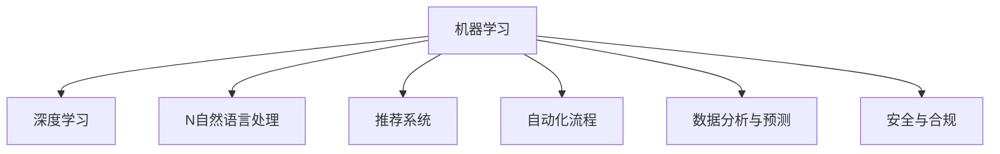

                 

# AI技术在企业中的应用

## 1. 背景介绍

### 1.1 问题由来

近年来，人工智能（AI）技术在企业中的应用逐渐普及，帮助企业在自动化、智能决策、客户服务等多个方面提升了效率和效益。这些应用不仅显著改善了企业的运营效率，还为企业的战略决策提供了有力支持。但AI技术的落地实施仍面临诸多挑战，如数据获取与处理、模型训练与部署、以及跨部门协调等。为了帮助企业更好地理解和应用AI技术，本文将详细介绍AI技术在企业中的应用，涵盖核心概念、算法原理、操作步骤、具体实现和实际应用场景等。

### 1.2 问题核心关键点

AI技术在企业中的应用主要聚焦于以下几个方面：

- **自动化流程**：通过机器学习、深度学习等AI技术，自动完成复杂、重复的任务，如自动化财务审计、智能制造等。
- **数据分析与预测**：利用AI算法对海量数据进行分析和挖掘，预测市场趋势、客户需求等，辅助企业做出更好的决策。
- **智能客服与推荐**：通过自然语言处理（NLP）、推荐系统等AI技术，提升客户服务体验和个性化推荐效果。
- **安全与合规**：使用AI技术监控网络安全威胁，进行风险评估和合规性检查，保障企业信息安全。

这些应用领域的核心问题是如何高效地采集和处理数据，选择合适的AI算法，以及如何在企业环境中进行模型训练和部署。本文将对这些问题进行详细讨论，并给出可行的解决方案。

## 2. 核心概念与联系

### 2.1 核心概念概述

为更好地理解AI技术在企业中的应用，本节将介绍几个关键概念及其联系：

- **机器学习（ML）**：一种通过数据驱动模型，使计算机能够自动改进性能的技术。
- **深度学习（DL）**：一种特殊的机器学习，使用多层神经网络进行数据处理和预测。
- **自然语言处理（NLP）**：使计算机能够理解和生成人类语言的技术。
- **推荐系统**：通过分析用户行为数据，为用户推荐个性化内容的技术。
- **自动化流程**：使用AI技术自动完成复杂、重复的任务，提高效率和质量。
- **数据分析与预测**：使用AI算法对大量数据进行分析和预测，辅助决策。
- **安全与合规**：通过AI技术监控和评估安全威胁，确保企业遵守法规。

这些核心概念之间的逻辑关系可以通过以下Mermaid流程图来展示：



这个流程图展示的核心概念及其之间的关系：

1. 机器学习是AI技术的基础，涵盖多种算法和技术。
2. 深度学习是机器学习的一个分支，适用于大规模数据处理。
3. NLP是机器学习的一个应用领域，用于处理和理解人类语言。
4. 推荐系统利用机器学习算法，实现个性化推荐。
5. 自动化流程使用AI技术提升效率和质量。
6. 数据分析与预测使用机器学习算法，辅助企业决策。
7. 安全与合规利用AI技术保障企业信息安全。

这些概念共同构成了AI技术在企业中的应用框架，为企业的自动化、智能化发展提供了有力的技术支持。

## 3. 核心算法原理 & 具体操作步骤

### 3.1 算法原理概述

AI技术在企业中的应用，通常涉及以下几个步骤：

1. **数据采集与预处理**：收集和整理企业内部和外部的数据，准备进行后续的分析和训练。
2. **模型训练**：选择合适的算法和模型，利用企业数据进行训练。
3. **模型评估与优化**：通过验证集和测试集评估模型效果，并进行必要的调整。
4. **模型部署与应用**：将训练好的模型部署到实际应用场景中，实现业务流程的自动化、决策支持等。

AI技术在企业中的应用，主要基于以下几个核心算法原理：

- **监督学习（Supervised Learning）**：通过标注数据，训练模型学习输入与输出之间的映射关系。
- **无监督学习（Unsupervised Learning）**：在无标注数据的情况下，通过算法发现数据中的结构与模式。
- **强化学习（Reinforcement Learning）**：通过与环境的交互，优化模型的行为策略。

这些算法原理在企业的不同应用场景中，可以灵活组合使用，以解决特定的业务问题。

### 3.2 算法步骤详解

以下详细介绍AI技术在企业中的应用步骤：

**Step 1: 数据采集与预处理**

- **数据源**：确定数据来源，包括企业内部系统、外部API、公开数据集等。
- **数据清洗**：处理缺失值、异常值、重复数据等，确保数据的质量和一致性。
- **数据转换**：进行数据标准化、归一化、编码等处理，以适应后续的模型训练。

**Step 2: 模型训练**

- **选择合适的算法**：根据具体问题，选择合适的机器学习或深度学习算法。
- **模型参数调整**：设定超参数，如学习率、批大小、迭代轮数等，进行模型训练。
- **模型验证**：利用验证集评估模型效果，调整模型参数。

**Step 3: 模型评估与优化**

- **性能指标**：选择合适的性能指标，如准确率、召回率、F1分数等，评估模型效果。
- **模型优化**：通过网格搜索、贝叶斯优化等方法，调整模型参数，提高模型性能。
- **模型集成**：将多个模型进行集成，提升整体效果。

**Step 4: 模型部署与应用**

- **模型存储**：将训练好的模型进行序列化和存储，便于后续调用。
- **部署环境**：选择合适的部署环境，如云端服务器、本地服务器等。
- **模型应用**：将模型集成到企业系统中，实现自动化流程、决策支持等。

### 3.3 算法优缺点

AI技术在企业中的应用，具有以下优点：

- **提升效率**：自动化流程和智能决策系统可以显著提升企业的运营效率。
- **增强决策能力**：数据分析与预测技术为企业的战略决策提供了有力支持。
- **改善客户体验**：智能客服和推荐系统提升了客户满意度和忠诚度。
- **保障安全合规**：安全与合规技术保障了企业信息安全和法规遵守。

同时，AI技术在企业中的应用也存在一些缺点：

- **数据依赖性强**：高质量的数据是AI应用的基础，但数据获取和处理成本较高。
- **模型复杂度高**：复杂模型需要大量的计算资源和时间进行训练和优化。
- **跨部门协调困难**：AI技术的落地实施需要跨部门协作，协调复杂。
- **模型可解释性不足**：许多AI模型缺乏可解释性，难以理解其内部工作机制。

## 4. 数学模型和公式 & 详细讲解

### 4.1 数学模型构建

在本节中，我们将详细介绍AI技术在企业中的应用模型的数学模型构建。

以**推荐系统**为例，推荐系统的数学模型通常包括以下几个部分：

- **用户画像**：表示用户的兴趣、行为等信息，如向量形式。
- **物品特征**：表示物品的属性、特征等信息，如矩阵形式。
- **相似度计算**：计算用户与物品之间的相似度，使用向量余弦相似度、欧氏距离等。
- **预测模型**：使用机器学习算法，预测用户对物品的评分或偏好。

假设用户表示为 $u \in \mathbb{R}^d$，物品表示为 $i \in \mathbb{R}^d$，相似度函数为 $f_{sim}$，预测模型为 $F$。则推荐系统的目标是最小化预测误差，即：

$$
\min_{u,i} \| F(u,i) - y_{u,i} \|
$$

其中 $y_{u,i}$ 为真实评分或偏好，$F(u,i)$ 为预测值。

### 4.2 公式推导过程

以下以**协同过滤算法**为例，详细推导推荐系统的预测模型。

协同过滤算法主要基于用户和物品的相似度进行推荐，其公式推导如下：

- **用户-物品矩阵**：将用户与物品的评分矩阵记为 $R$，其中 $R_{u,i}$ 为用户 $u$ 对物品 $i$ 的评分。
- **用户相似度矩阵**：计算用户之间的相似度，得到用户相似度矩阵 $S_u$。
- **物品相似度矩阵**：计算物品之间的相似度，得到物品相似度矩阵 $S_i$。
- **预测值计算**：使用用户相似度矩阵和物品相似度矩阵，计算用户对物品的预测评分。

推导过程如下：

假设用户 $u$ 对物品 $i$ 的预测评分为 $\hat{y}_{u,i}$，则协同过滤算法的预测模型可以表示为：

$$
\hat{y}_{u,i} = \alpha_u \times S_i \times S_u \times R_i
$$

其中 $\alpha_u$ 为用户的权重向量，$R_i$ 为物品的评分向量。

### 4.3 案例分析与讲解

**案例1：自动化财务审计**

- **数据采集与预处理**：收集企业的财务报表、账目、审计记录等数据，进行数据清洗和转换。
- **模型训练**：使用监督学习算法，训练分类器，识别异常财务数据。
- **模型评估与优化**：使用验证集评估模型效果，调整分类器参数。
- **模型部署与应用**：将训练好的分类器集成到财务审计系统中，实现自动化审计。

**案例2：智能客服**

- **数据采集与预处理**：收集客服对话记录、用户反馈、常见问题等数据，进行数据清洗和转换。
- **模型训练**：使用NLP技术，训练情感分析、意图识别等模型。
- **模型评估与优化**：使用验证集评估模型效果，调整模型参数。
- **模型部署与应用**：将训练好的模型集成到智能客服系统中，提升客户服务体验。

## 5. 项目实践：代码实例和详细解释说明

### 5.1 开发环境搭建

在进行AI技术在企业中的应用实践前，我们需要准备好开发环境。以下是使用Python进行PyTorch开发的环境配置流程：

1. 安装Anaconda：从官网下载并安装Anaconda，用于创建独立的Python环境。

2. 创建并激活虚拟环境：
```bash
conda create -n pytorch-env python=3.8 
conda activate pytorch-env
```

3. 安装PyTorch：根据CUDA版本，从官网获取对应的安装命令。例如：
```bash
conda install pytorch torchvision torchaudio cudatoolkit=11.1 -c pytorch -c conda-forge
```

4. 安装各类工具包：
```bash
pip install numpy pandas scikit-learn matplotlib tqdm jupyter notebook ipython
```

完成上述步骤后，即可在`pytorch-env`环境中开始AI技术在企业中的应用实践。

### 5.2 源代码详细实现

下面我以**智能客服系统**为例，给出使用Transformers库对BERT模型进行微调的PyTorch代码实现。

首先，定义智能客服任务的数据处理函数：

```python
from transformers import BertTokenizer
from torch.utils.data import Dataset
import torch

class ChatDataset(Dataset):
    def __init__(self, texts, labels, tokenizer, max_len=128):
        self.texts = texts
        self.labels = labels
        self.tokenizer = tokenizer
        self.max_len = max_len
        
    def __len__(self):
        return len(self.texts)
    
    def __getitem__(self, item):
        text = self.texts[item]
        label = self.labels[item]
        
        encoding = self.tokenizer(text, return_tensors='pt', max_length=self.max_len, padding='max_length', truncation=True)
        input_ids = encoding['input_ids'][0]
        attention_mask = encoding['attention_mask'][0]
        
        # 对标签进行编码
        label_ids = label2id[label] 
        labels = torch.tensor(label_ids, dtype=torch.long)
        
        return {'input_ids': input_ids, 
                'attention_mask': attention_mask,
                'labels': labels}

# 标签与id的映射
label2id = {'回复正确': 1, '回复错误': 0}
id2label = {v: k for k, v in label2id.items()}

# 创建dataset
tokenizer = BertTokenizer.from_pretrained('bert-base-cased')

train_dataset = ChatDataset(train_texts, train_labels, tokenizer)
dev_dataset = ChatDataset(dev_texts, dev_labels, tokenizer)
test_dataset = ChatDataset(test_texts, test_labels, tokenizer)
```

然后，定义模型和优化器：

```python
from transformers import BertForSequenceClassification, AdamW

model = BertForSequenceClassification.from_pretrained('bert-base-cased', num_labels=len(label2id))

optimizer = AdamW(model.parameters(), lr=2e-5)
```

接着，定义训练和评估函数：

```python
from torch.utils.data import DataLoader
from tqdm import tqdm
from sklearn.metrics import accuracy_score

device = torch.device('cuda') if torch.cuda.is_available() else torch.device('cpu')
model.to(device)

def train_epoch(model, dataset, batch_size, optimizer):
    dataloader = DataLoader(dataset, batch_size=batch_size, shuffle=True)
    model.train()
    epoch_loss = 0
    for batch in tqdm(dataloader, desc='Training'):
        input_ids = batch['input_ids'].to(device)
        attention_mask = batch['attention_mask'].to(device)
        labels = batch['labels'].to(device)
        model.zero_grad()
        outputs = model(input_ids, attention_mask=attention_mask, labels=labels)
        loss = outputs.loss
        epoch_loss += loss.item()
        loss.backward()
        optimizer.step()
    return epoch_loss / len(dataloader)

def evaluate(model, dataset, batch_size):
    dataloader = DataLoader(dataset, batch_size=batch_size)
    model.eval()
    preds, labels = [], []
    with torch.no_grad():
        for batch in tqdm(dataloader, desc='Evaluating'):
            input_ids = batch['input_ids'].to(device)
            attention_mask = batch['attention_mask'].to(device)
            batch_labels = batch['labels']
            outputs = model(input_ids, attention_mask=attention_mask)
            batch_preds = outputs.logits.argmax(dim=2).to('cpu').tolist()
            batch_labels = batch_labels.to('cpu').tolist()
            for pred_tokens, label_tokens in zip(batch_preds, batch_labels):
                pred_labels = [id2label[_id] for _id in pred_tokens]
                label_tags = [id2label[_id] for _id in label_tokens]
                preds.append(pred_labels[:len(label_tags)])
                labels.append(label_tags)
                
    print(accuracy_score(labels, preds))
```

最后，启动训练流程并在测试集上评估：

```python
epochs = 5
batch_size = 16

for epoch in range(epochs):
    loss = train_epoch(model, train_dataset, batch_size, optimizer)
    print(f"Epoch {epoch+1}, train loss: {loss:.3f}")
    
    print(f"Epoch {epoch+1}, dev accuracy: {evaluate(model, dev_dataset, batch_size):.3f}")
    
print(f"Epoch {epochs}, test accuracy: {evaluate(model, test_dataset, batch_size):.3f}")
```

以上就是使用PyTorch对BERT进行智能客服系统微调的完整代码实现。可以看到，得益于Transformers库的强大封装，我们可以用相对简洁的代码完成BERT模型的加载和微调。

### 5.3 代码解读与分析

让我们再详细解读一下关键代码的实现细节：

**ChatDataset类**：
- `__init__`方法：初始化文本、标签、分词器等关键组件。
- `__len__`方法：返回数据集的样本数量。
- `__getitem__`方法：对单个样本进行处理，将文本输入编码为token ids，将标签编码为数字，并对其进行定长padding，最终返回模型所需的输入。

**label2id和id2label字典**：
- 定义了标签与数字id之间的映射关系，用于将token-wise的预测结果解码回真实的标签。

**训练和评估函数**：
- 使用PyTorch的DataLoader对数据集进行批次化加载，供模型训练和推理使用。
- 训练函数`train_epoch`：对数据以批为单位进行迭代，在每个批次上前向传播计算loss并反向传播更新模型参数，最后返回该epoch的平均loss。
- 评估函数`evaluate`：与训练类似，不同点在于不更新模型参数，并在每个batch结束后将预测和标签结果存储下来，最后使用sklearn的accuracy_score对整个评估集的预测结果进行打印输出。

**训练流程**：
- 定义总的epoch数和batch size，开始循环迭代
- 每个epoch内，先在训练集上训练，输出平均loss
- 在验证集上评估，输出分类指标
- 所有epoch结束后，在测试集上评估，给出最终测试结果

可以看到，PyTorch配合Transformers库使得BERT微调的代码实现变得简洁高效。开发者可以将更多精力放在数据处理、模型改进等高层逻辑上，而不必过多关注底层的实现细节。

当然，工业级的系统实现还需考虑更多因素，如模型的保存和部署、超参数的自动搜索、更灵活的任务适配层等。但核心的微调范式基本与此类似。

## 6. 实际应用场景

### 6.1 智能客服系统

基于AI技术在企业中的应用，智能客服系统可以大大提升客户服务效率和体验。传统客服系统往往需要大量人力，响应速度慢，且无法提供24小时服务。智能客服系统通过NLP技术和深度学习模型，可以实现自动化客户服务，快速响应用户咨询，提供个性化回复。

在技术实现上，可以收集企业的客服对话记录，将问题和最佳答复构建成监督数据，在此基础上对预训练模型进行微调。微调后的模型能够自动理解用户意图，匹配最合适的答案模板进行回复。对于客户提出的新问题，还可以接入检索系统实时搜索相关内容，动态组织生成回答。如此构建的智能客服系统，能大幅提升客户咨询体验和问题解决效率。

### 6.2 自动化财务审计

财务审计是企业运营中的重要环节，确保财务数据的准确性和合规性。但传统的手工审计方法耗时耗力，且容易出错。AI技术在企业中的应用，可以帮助企业实现自动化财务审计，提升审计效率和准确性。

具体而言，可以收集企业的财务报表、账目、审计记录等数据，进行数据清洗和转换。利用机器学习或深度学习算法，训练分类器，识别异常财务数据。将训练好的分类器集成到审计系统中，实现自动化审计。这不仅能大幅度减少审计工作量，还能提高审计的准确性和合规性。

### 6.3 数据分析与预测

数据分析与预测是企业决策支持的重要工具，AI技术在此领域有着广泛的应用。通过收集和分析企业内部和外部的数据，企业可以更好地了解市场动态、客户需求、运营状况等，辅助决策。

以销售预测为例，企业可以收集历史销售数据、市场趋势、季节性因素等，进行数据清洗和转换。利用机器学习或深度学习算法，训练预测模型，预测未来的销售趋势。将训练好的模型集成到企业的决策支持系统中，企业可以根据预测结果调整生产计划、库存管理等，提高运营效率和市场响应速度。

### 6.4 未来应用展望

随着AI技术的不断发展，其在企业中的应用将更加广泛和深入。未来，AI技术将更多地应用于以下领域：

- **智能制造**：利用AI技术优化生产流程，提高生产效率和质量。
- **智能供应链**：通过AI技术优化供应链管理，提高供应链的灵活性和响应速度。
- **智能营销**：利用AI技术进行客户行为分析，个性化营销，提高营销效果。
- **智能风险管理**：通过AI技术进行风险评估和管理，保障企业安全和稳定运营。

AI技术在企业中的应用，将为企业带来更高效、更智能、更灵活的运营模式，助力企业实现数字化转型和智能化升级。

## 7. 工具和资源推荐

### 7.1 学习资源推荐

为了帮助开发者系统掌握AI技术在企业中的应用，这里推荐一些优质的学习资源：

1. **《机器学习实战》**：讲解机器学习的基本概念和算法，涵盖监督学习、无监督学习、深度学习等。
2. **《深度学习框架PyTorch官方文档》**：详细介绍PyTorch的使用方法和最佳实践，涵盖模型构建、训练、推理等。
3. **《自然语言处理综论》**：系统介绍NLP技术的基本概念和算法，涵盖词向量、序列标注、情感分析等。
4. **Kaggle数据集**：提供大量数据集和竞赛项目，方便开发者练习和应用AI技术。
5. **Coursera、edX等在线课程**：提供各类AI技术的学习课程，涵盖机器学习、深度学习、NLP等。

通过对这些资源的学习实践，相信你一定能够快速掌握AI技术在企业中的应用，并用于解决实际的业务问题。

### 7.2 开发工具推荐

高效的开发离不开优秀的工具支持。以下是几款用于AI技术在企业中的应用开发的常用工具：

1. **PyTorch**：基于Python的开源深度学习框架，灵活动态的计算图，适合快速迭代研究。
2. **TensorFlow**：由Google主导开发的开源深度学习框架，生产部署方便，适合大规模工程应用。
3. **Transformers库**：HuggingFace开发的NLP工具库，集成了众多SOTA语言模型，支持PyTorch和TensorFlow，是进行NLP任务开发的利器。
4. **Jupyter Notebook**：免费的在线编程环境，支持Python、R等语言，便于开发者共享和交流代码。
5. **Keras**：基于Python的高层深度学习库，易于使用，适合快速原型开发。

合理利用这些工具，可以显著提升AI技术在企业中的应用开发效率，加快创新迭代的步伐。

### 7.3 相关论文推荐

AI技术在企业中的应用源于学界的持续研究。以下是几篇奠基性的相关论文，推荐阅读：

1. **《深度学习》**：Ian Goodfellow、Yoshua Bengio和Aaron Courville合著，全面介绍深度学习的基本概念和算法。
2. **《机器学习》**：Tom Mitchell著，系统介绍机器学习的基本概念和算法。
3. **《自然语言处理综论》**：Daniel Jurafsky和James H. Martin合著，系统介绍NLP技术的基本概念和算法。
4. **《推荐系统》**：Bengio、Cotter等合著，系统介绍推荐系统的主要算法和技术。
5. **《人工智能与大数据》**：李翔著，系统介绍人工智能和大数据的基本概念和应用。

这些论文代表了大数据和AI技术的研究前沿，通过学习这些前沿成果，可以帮助研究者把握学科前进方向，激发更多的创新灵感。

## 8. 总结：未来发展趋势与挑战

### 8.1 总结

本文对AI技术在企业中的应用进行了全面系统的介绍。首先阐述了AI技术在企业中的应用背景和意义，明确了其在自动化流程、数据分析与预测、智能客服、安全与合规等领域的价值。其次，从原理到实践，详细讲解了AI技术在企业中的应用步骤，给出了智能客服系统的完整代码实例。同时，本文还广泛探讨了AI技术在企业中的实际应用场景，展示了其在企业中的应用前景。最后，本文精选了AI技术在企业中的应用的学习资源、开发工具和相关论文，力求为读者提供全方位的技术指引。

通过本文的系统梳理，可以看到，AI技术在企业中的应用具有广阔的发展前景，为企业的自动化、智能化发展提供了有力的技术支持。未来，伴随AI技术的持续演进，其在企业中的应用将更加广泛和深入，为企业的数字化转型和智能化升级提供新的动力。

### 8.2 未来发展趋势

展望未来，AI技术在企业中的应用将呈现以下几个发展趋势：

- **自动化流程的普及**：随着自动化技术的不断成熟，更多的企业将采用AI技术，实现业务流程的自动化，提高效率和质量。
- **智能决策的提升**：数据分析与预测技术将更加普及，企业将通过AI技术进行更准确的决策，提升运营效率和竞争力。
- **客户体验的优化**：智能客服和推荐系统将更加智能，提升客户体验和满意度，增强客户忠诚度。
- **安全与合规的保障**：安全与合规技术将更加完善，保障企业信息安全和合规性。

以上趋势凸显了AI技术在企业中的应用前景。这些方向的探索发展，必将进一步提升企业运营效率和智能化水平，推动企业数字化转型和智能化升级。

### 8.3 面临的挑战

尽管AI技术在企业中的应用已经取得了显著成果，但在迈向更加智能化、普适化应用的过程中，它仍面临诸多挑战：

- **数据依赖性强**：高质量的数据是AI应用的基础，但数据获取和处理成本较高。
- **模型复杂度高**：复杂模型需要大量的计算资源和时间进行训练和优化。
- **跨部门协调困难**：AI技术的落地实施需要跨部门协作，协调复杂。
- **模型可解释性不足**：许多AI模型缺乏可解释性，难以理解其内部工作机制。

这些挑战需要企业在数据采集与处理、模型训练与优化、跨部门协调等方面进行全面优化，才能最大限度地发挥AI技术在企业中的应用价值。

### 8.4 研究展望

面对AI技术在企业中的应用所面临的挑战，未来的研究需要在以下几个方面寻求新的突破：

- **数据驱动技术**：探索更多无监督和半监督学习技术，降低对标注数据的依赖，最大化利用非结构化数据。
- **模型压缩与优化**：开发更加参数高效和计算高效的AI模型，提高模型的推理速度和资源利用率。
- **跨学科融合**：将AI技术与业务、管理、技术等多个学科进行深度融合，推动AI技术在企业中的应用。
- **模型可解释性增强**：研究模型可解释性技术，提高模型的透明度和可理解性，确保模型的可信度。
- **伦理与法规**：在AI技术应用中，注重伦理和法规约束，确保技术应用的公平性和安全性。

这些研究方向将为AI技术在企业中的应用提供新的思路和方法，推动AI技术在企业中的应用更加深入和广泛。面向未来，AI技术将在企业运营、决策支持、客户服务等多个方面发挥更加重要的作用，推动企业实现数字化转型和智能化升级。

## 9. 附录：常见问题与解答

**Q1：AI技术在企业中的应用是否需要大量的数据支持？**

A: AI技术在企业中的应用，通常需要高质量、大容量的数据作为支撑。虽然无监督学习和半监督学习可以在一定程度上缓解数据依赖性，但仍然需要大量的标注数据进行训练和验证。数据获取和处理成本较高，但数据质量对AI应用的效果有重要影响，企业应重视数据采集和处理的环节。

**Q2：AI技术在企业中如何实现跨部门协作？**

A: AI技术在企业中的应用，需要跨部门协作。企业可以通过建立跨部门数据共享平台、项目组、工作坊等方式，促进不同部门之间的沟通和协作。同时，企业可以制定AI项目的管理规范和流程，确保各部门的协同工作。

**Q3：AI技术在企业中的应用是否需要专业知识？**

A: AI技术在企业中的应用，通常需要具备一定专业知识的技术人员或数据科学家。企业应重视对员工的技术培训，提高其AI应用能力和水平。同时，企业可以聘请专业的AI顾问或团队，提供技术支持和咨询。

**Q4：AI技术在企业中的应用是否需要长期投资？**

A: AI技术在企业中的应用，需要长期的投入和支持。企业应制定明确的AI战略和目标，设立专门的AI研发部门或团队，持续投入研发和应用。同时，企业应注重AI技术的持续更新和升级，保持技术的领先性和竞争力。

**Q5：AI技术在企业中的应用是否需要不断优化？**

A: AI技术在企业中的应用，需要不断优化和改进。企业应定期评估AI应用的效果和问题，及时调整和优化模型和流程。同时，企业应重视用户反馈和技术需求，不断改进AI应用，提升用户体验和满意度。

---

作者：禅与计算机程序设计艺术 / Zen and the Art of Computer Programming

