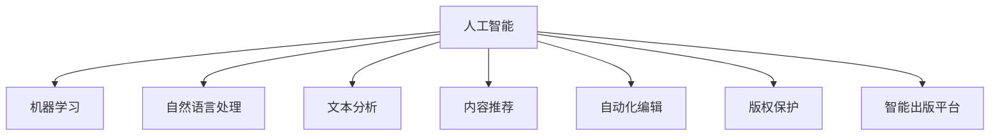

                 

# AI技术在出版业的应用：革新与机遇

> 关键词：AI技术,出版业,人工智能,机器学习,自然语言处理,NLP,文本分析,自动化编辑,内容推荐,版权保护

## 1. 背景介绍

### 1.1 问题由来
出版业作为知识和文化的承载者，其数字化转型已成为行业发展的重要方向。传统的出版模式面临出版的成本上升、盗版猖獗、市场萎缩等问题，亟需通过技术革新提升运营效率和市场竞争力。近年来，人工智能(AI)技术，特别是机器学习、自然语言处理(NLP)等新兴技术，在出版业中的应用日益广泛，为出版行业带来了新的机遇和挑战。

### 1.2 问题核心关键点
AI技术在出版业中的应用主要包括以下几个方面：
1. **自动化编辑**：利用AI进行文本自动校对、内容纠错，提高编辑效率。
2. **内容推荐**：基于用户行为数据推荐个性化内容，提升用户体验。
3. **版权保护**：通过AI技术识别和追踪盗版，提升版权管理能力。
4. **数据分析**：利用AI进行市场分析和读者行为预测，优化内容生产和发行策略。
5. **智能出版平台**：构建集内容生产、推荐、版权保护于一体的智能化出版平台。

这些核心应用不仅提高了出版业的工作效率，也带来了新的商业模式和市场机会。

### 1.3 问题研究意义
AI技术在出版业的应用，旨在通过技术创新提升出版业务的智能化水平，优化资源配置，提升用户体验，增加市场份额。具体而言，AI技术可以帮助出版企业实现以下几个目标：
1. **降低成本**：自动化编辑和版权保护可以减少人工成本和侵权风险。
2. **提升效率**：通过智能推荐和数据分析，出版企业可以更好地了解市场需求，精准投放内容，提升发行效率。
3. **增强用户体验**：基于用户行为的个性化推荐，能够提升用户的阅读体验和黏性。
4. **探索新业务模式**：通过数字化转型，出版企业可以探索订阅、广告、内容合作等新的盈利模式。

总之，AI技术在出版业的应用，有望彻底改变传统的出版和阅读方式，为出版业的发展注入新的活力。

## 2. 核心概念与联系

### 2.1 核心概念概述

为更好地理解AI技术在出版业中的应用，本节将介绍几个密切相关的核心概念：

- **人工智能(Artificial Intelligence, AI)**：使计算机能够执行通常需要人类智能才能完成的复杂任务的技术，如视觉识别、语言理解、决策制定等。

- **机器学习(Machine Learning, ML)**：一种通过数据训练算法，使算法能够自动改进的AI技术。常见的机器学习算法包括监督学习、无监督学习和强化学习等。

- **自然语言处理(Natural Language Processing, NLP)**：涉及计算机与人类语言交互的技术，如文本分析、机器翻译、语音识别等。

- **文本分析(Text Analysis)**：通过对文本数据进行文本清洗、情感分析、主题建模等处理，提取有价值的信息。

- **内容推荐(Content Recommendation)**：通过分析用户行为数据，为用户推荐个性化的内容，提升用户满意度。

- **自动化编辑(Automatic Editing)**：利用AI技术对文本进行自动校对、语法检查、拼写纠错等，提高编辑效率。

- **版权保护(Copyright Protection)**：通过AI技术识别盗版内容，保护原创作品权益。

- **智能出版平台(Intelligent Publishing Platform)**：利用AI技术进行内容生产、推荐、版权保护的综合性出版平台，提供更加智能化的出版服务。

这些核心概念之间的逻辑关系可以通过以下Mermaid流程图来展示：



这个流程图展示了大语言模型在出版业中的核心概念及其之间的关系：

1. 人工智能是基础技术，通过机器学习和自然语言处理技术实现各具体应用。
2. 文本分析和内容推荐是内容生产环节的关键，提升用户体验。
3. 自动化编辑和版权保护保障内容质量，提升出版效率和权益保护。
4. 智能出版平台融合各项技术，提供综合性的智能化出版服务。

## 3. 核心算法原理 & 具体操作步骤
### 3.1 算法原理概述

AI技术在出版业中的应用，主要基于机器学习、自然语言处理等技术，以提升出版业务的智能化水平。具体而言，包括以下几个关键步骤：

1. **数据收集与处理**：收集出版物的文本数据、用户行为数据、市场数据等，并对数据进行清洗和预处理。

2. **模型训练与优化**：构建机器学习模型，如文本分类模型、情感分析模型、用户推荐模型等，并通过大量标注数据进行训练和优化。

3. **内容生成与推荐**：基于训练好的模型对出版内容进行自动生成或推荐，提升内容质量和用户体验。

4. **版权保护与监测**：利用AI技术识别和追踪盗版内容，保护原创作品权益。

5. **数据分析与预测**：通过对大量数据进行统计分析和建模，预测市场趋势，优化出版策略。

### 3.2 算法步骤详解

以下详细介绍AI在出版业中的核心算法步骤：

#### 3.2.1 数据收集与处理

数据是AI技术的基础，因此需要构建一套完整的数据收集和处理流程：

1. **数据来源**：
   - 内部数据：出版物的文本、音频、视频等原始数据。
   - 外部数据：用户行为数据、市场数据、网络爬虫数据等。

2. **数据清洗**：
   - 去除噪声：如去除重复数据、错误数据。
   - 标准化：如统一编码格式、文本规范化等。
   - 数据增强：如文本分词、词性标注、命名实体识别等。

3. **数据存储与管理**：
   - 建立数据库：使用SQL、NoSQL数据库存储和管理数据。
   - 数据分区与索引：优化数据查询效率，方便后续分析使用。

#### 3.2.2 模型训练与优化

构建机器学习模型并进行训练和优化，是AI技术应用的重点：

1. **模型选择**：
   - 监督学习：如文本分类、情感分析等，使用训练数据集进行监督学习。
   - 无监督学习：如主题建模、聚类分析等，不依赖标注数据进行训练。
   - 强化学习：如推荐系统，通过奖励机制进行训练。

2. **数据划分**：
   - 划分训练集、验证集、测试集，进行模型训练、调参和测试评估。
   - 交叉验证：使用K折交叉验证方法，避免过拟合和欠拟合问题。

3. **模型调参**：
   - 超参数调优：如学习率、批大小、正则化系数等。
   - 网络结构调整：如添加或移除层，调整神经元个数等。

4. **模型评估**：
   - 使用多种评估指标：如准确率、召回率、F1分数等。
   - 可视化效果：如绘制混淆矩阵、ROC曲线等。

#### 3.2.3 内容生成与推荐

利用AI技术进行内容生成和推荐，是出版业智能化转型的重要环节：

1. **内容生成**：
   - 自动摘要：使用文本生成模型，自动提取文章关键信息生成摘要。
   - 内容补全：使用文本生成模型，自动补全不完整的内容。
   - 自动创作：使用文本生成模型，自动创作短评、书评等。

2. **内容推荐**：
   - 基于用户行为数据：如浏览记录、购买历史等，进行个性化推荐。
   - 基于文本内容：如主题相似性、关键词匹配等，进行内容推荐。
   - 协同过滤推荐：利用用户之间的相似性进行推荐。

#### 3.2.4 版权保护与监测

版权保护是出版业数字化转型的关键环节，AI技术在此发挥重要作用：

1. **版权识别**：
   - 图像识别：使用深度学习模型，识别盗版书籍封面或文字。
   - 音频识别：使用音频识别技术，识别盗版音频内容。
   - 文本相似度匹配：使用文本相似度算法，检测盗版文本内容。

2. **版权监测**：
   - 网页监测：使用网页爬虫，实时监测盗版网站链接。
   - 社交媒体监测：使用自然语言处理技术，监测社交媒体上的盗版信息。
   - 版权验证：使用区块链技术，验证版权证明和授权信息。

#### 3.2.5 数据分析与预测

利用AI技术进行数据分析和市场预测，是出版企业优化决策的重要手段：

1. **市场分析**：
   - 用户行为分析：如阅读时间、阅读频率等，评估用户对内容的需求。
   - 主题分析：如文本主题、关键词分布等，评估市场热门话题。
   - 价格分析：如销量、市场份额等，评估出版物价格策略。

2. **市场预测**：
   - 用户预测：如预测用户购买行为、推荐内容等。
   - 市场趋势预测：如预测市场竞争格局、热门题材等。
   - 内容推荐：如预测热门书籍、期刊等。

### 3.3 算法优缺点

AI技术在出版业的应用，具有以下优点：

1. **效率提升**：自动化编辑和版权保护可以大幅度提高编辑和版权管理的工作效率，降低人工成本。
2. **精准推荐**：内容推荐系统能够基于用户行为数据，提供个性化的内容推荐，提升用户体验。
3. **版权保护**：AI技术能够高效识别和追踪盗版，保护原创作品权益。
4. **数据驱动决策**：通过数据分析和市场预测，出版企业可以优化内容生产、发行策略，提升市场竞争力。

然而，AI技术在出版业的应用也存在一些缺点：

1. **数据隐私**：大量用户数据和内容数据的使用，可能引发数据隐私问题。
2. **技术门槛**：构建和优化AI模型需要较高的技术门槛，对出版企业来说可能是一个挑战。
3. **伦理问题**：AI模型可能存在偏见和歧视，需要考虑伦理问题。
4. **算法透明度**：AI模型的决策过程缺乏透明性，可能难以解释和调试。
5. **资源需求**：AI模型通常需要大量的计算资源和数据，可能带来成本压力。

尽管存在这些缺点，但AI技术在出版业的应用前景依然广阔，出版企业需要权衡利弊，合理利用AI技术，提升业务智能化水平。

### 3.4 算法应用领域

AI技术在出版业中的应用，已经覆盖了多个领域，具体如下：

1. **图书推荐系统**：利用用户行为数据，推荐个性化图书内容。
2. **电子书出版**：使用自动化编辑技术，优化电子书格式和内容。
3. **版权管理系统**：利用AI技术识别和追踪盗版内容，保护原创权益。
4. **出版物分析**：通过数据分析和市场预测，优化出版策略。
5. **广告投放**：基于用户行为数据，优化广告投放效果。
6. **客户服务**：利用AI技术，提升客户服务体验和效率。

这些应用领域展示了AI技术在出版业中的广泛潜力，出版企业可以通过引入AI技术，优化业务流程，提升市场竞争力。

## 4. 数学模型和公式 & 详细讲解 & 举例说明

### 4.1 数学模型构建

以下详细介绍AI在出版业中的核心数学模型：

#### 4.1.1 文本分类模型

文本分类是出版业中常用的机器学习任务之一，其目标是将文本划分为不同的类别。常见的文本分类模型包括朴素贝叶斯、支持向量机、深度神经网络等。

以深度神经网络为例，其模型构建过程如下：

1. **输入层**：输入文本向量，每个词转换为一个向量，通过嵌入层将文本转换为向量表示。
2. **隐藏层**：使用多层感知器(MLP)或卷积神经网络(CNN)等神经网络结构，提取文本特征。
3. **输出层**：使用softmax层输出每个类别的概率分布。

模型的损失函数通常采用交叉熵损失函数，公式如下：

$$
L(y, \hat{y}) = -\frac{1}{N} \sum_{i=1}^N \sum_{j=1}^C y_{i,j} \log(\hat{y}_{i,j})
$$

其中 $y$ 为真实标签，$\hat{y}$ 为模型预测的类别概率分布。

#### 4.1.2 情感分析模型

情感分析是文本分类的一种，其目标是对文本进行情感分类，如积极、消极、中性等。常见的情感分析模型包括基于LSTM的模型和基于Transformer的模型。

以基于LSTM的情感分析模型为例，其模型构建过程如下：

1. **输入层**：输入文本向量，每个词转换为一个向量，通过嵌入层将文本转换为向量表示。
2. **LSTM层**：使用LSTM网络，提取文本中的上下文信息。
3. **输出层**：使用softmax层输出每个情感类别的概率分布。

模型的损失函数通常采用交叉熵损失函数，公式如下：

$$
L(y, \hat{y}) = -\frac{1}{N} \sum_{i=1}^N \log(\hat{y}_{i,k})
$$

其中 $y$ 为真实标签，$\hat{y}$ 为模型预测的情感概率。

#### 4.1.3 内容推荐模型

内容推荐是出版业中常用的机器学习任务之一，其目标是为用户推荐个性化的内容。常见的推荐模型包括协同过滤模型、基于内容的推荐模型、基于深度学习的推荐模型等。

以基于深度学习的推荐模型为例，其模型构建过程如下：

1. **输入层**：输入用户行为数据和文本数据，通过嵌入层将数据转换为向量表示。
2. **隐藏层**：使用多层感知器(MLP)或卷积神经网络(CNN)等神经网络结构，提取用户行为特征和文本特征。
3. **输出层**：使用softmax层输出每个内容的概率分布。

模型的损失函数通常采用交叉熵损失函数，公式如下：

$$
L(y, \hat{y}) = -\frac{1}{N} \sum_{i=1}^N \log(\hat{y}_{i,j})
$$

其中 $y$ 为真实标签，$\hat{y}$ 为模型预测的内容概率。

### 4.2 公式推导过程

以下是AI在出版业中的核心数学公式推导过程：

#### 4.2.1 文本分类模型的公式推导

以基于深度神经网络的文本分类模型为例，其训练过程如下：

1. **前向传播**：将文本向量 $x$ 输入模型，通过隐藏层 $h$ 输出分类概率分布 $p(y|x)$。
2. **损失函数**：使用交叉熵损失函数 $L(y, \hat{y})$，计算真实标签 $y$ 与模型预测标签 $\hat{y}$ 的误差。
3. **反向传播**：通过链式法则，计算梯度 $\nabla_{\theta}L(y, \hat{y})$，更新模型参数 $\theta$。

其具体公式如下：

$$
p(y|x) = softmax(W_{out}h + b_{out})
$$

$$
L(y, \hat{y}) = -\frac{1}{N} \sum_{i=1}^N \log(p(y_i|x_i))
$$

$$
\nabla_{\theta}L(y, \hat{y}) = \frac{\partial L(y, \hat{y})}{\partial \theta}
$$

其中 $W_{out}$ 和 $b_{out}$ 为输出层的权重和偏置。

#### 4.2.2 情感分析模型的公式推导

以基于LSTM的情感分析模型为例，其训练过程如下：

1. **前向传播**：将文本向量 $x$ 输入模型，通过LSTM层 $h$ 输出情感概率分布 $p(y|x)$。
2. **损失函数**：使用交叉熵损失函数 $L(y, \hat{y})$，计算真实标签 $y$ 与模型预测标签 $\hat{y}$ 的误差。
3. **反向传播**：通过链式法则，计算梯度 $\nabla_{\theta}L(y, \hat{y})$，更新模型参数 $\theta$。

其具体公式如下：

$$
p(y|x) = softmax(W_{out}h + b_{out})
$$

$$
L(y, \hat{y}) = -\frac{1}{N} \sum_{i=1}^N \log(p(y_i|x_i))
$$

$$
\nabla_{\theta}L(y, \hat{y}) = \frac{\partial L(y, \hat{y})}{\partial \theta}
$$

其中 $W_{out}$ 和 $b_{out}$ 为输出层的权重和偏置。

#### 4.2.3 内容推荐模型的公式推导

以基于深度学习的推荐模型为例，其训练过程如下：

1. **前向传播**：将用户行为数据 $u$ 和文本数据 $v$ 输入模型，通过隐藏层 $h$ 输出内容概率分布 $p(c|u,v)$。
2. **损失函数**：使用交叉熵损失函数 $L(y, \hat{y})$，计算真实标签 $y$ 与模型预测标签 $\hat{y}$ 的误差。
3. **反向传播**：通过链式法则，计算梯度 $\nabla_{\theta}L(y, \hat{y})$，更新模型参数 $\theta$。

其具体公式如下：

$$
p(c|u,v) = softmax(W_{out}h + b_{out})
$$

$$
L(y, \hat{y}) = -\frac{1}{N} \sum_{i=1}^N \log(p(c_i|u_i,v_i))
$$

$$
\nabla_{\theta}L(y, \hat{y}) = \frac{\partial L(y, \hat{y})}{\partial \theta}
$$

其中 $W_{out}$ 和 $b_{out}$ 为输出层的权重和偏置。

### 4.3 案例分析与讲解

以下详细介绍几个AI在出版业中的典型应用案例：

#### 案例1：图书推荐系统

某出版企业构建了基于深度学习的图书推荐系统，采用协同过滤模型和基于内容的推荐方法。具体过程如下：

1. **数据收集**：收集用户阅读记录、购买历史、评价数据等。
2. **数据预处理**：对数据进行清洗、标准化、特征提取等预处理。
3. **模型训练**：使用协同过滤模型和基于内容的推荐模型，对数据进行训练和优化。
4. **推荐输出**：根据用户行为数据，生成个性化的图书推荐列表。

#### 案例2：版权管理系统

某出版社引入了基于深度学习的版权管理系统，使用图像识别和文本相似度匹配技术。具体过程如下：

1. **数据收集**：收集盗版书籍封面、盗版文本等数据。
2. **数据预处理**：对数据进行清洗、标准化、特征提取等预处理。
3. **模型训练**：使用图像识别模型和文本相似度匹配模型，对数据进行训练和优化。
4. **版权监测**：实时监测出版物版权状态，识别盗版行为。

#### 案例3：内容生成系统

某出版社开发了基于深度学习的内容生成系统，使用文本生成模型。具体过程如下：

1. **数据收集**：收集出版物文本数据。
2. **数据预处理**：对数据进行清洗、标准化、特征提取等预处理。
3. **模型训练**：使用文本生成模型，对数据进行训练和优化。
4. **内容生成**：根据用户需求，自动生成摘要、短评、书评等。

## 5. 项目实践：代码实例和详细解释说明

### 5.1 开发环境搭建

在进行AI技术在出版业中的应用开发时，需要搭建合适的开发环境。以下是使用Python进行PyTorch开发的示例环境配置：

1. 安装Anaconda：从官网下载并安装Anaconda，用于创建独立的Python环境。

2. 创建并激活虚拟环境：
```bash
conda create -n pytorch-env python=3.8 
conda activate pytorch-env
```

3. 安装PyTorch：根据CUDA版本，从官网获取对应的安装命令。例如：
```bash
conda install pytorch torchvision torchaudio cudatoolkit=11.1 -c pytorch -c conda-forge
```

4. 安装Transformers库：
```bash
pip install transformers
```

5. 安装各类工具包：
```bash
pip install numpy pandas scikit-learn matplotlib tqdm jupyter notebook ipython
```

完成上述步骤后，即可在`pytorch-env`环境中开始开发。

### 5.2 源代码详细实现

以下通过使用PyTorch实现图书推荐系统的代码示例，详细介绍开发过程：

```python
import torch
import torch.nn as nn
import torch.optim as optim
from torch.utils.data import DataLoader
from torchtext.datasets import AG_NEWS
from torchtext.data import Field, TabularDataset, BucketIterator

# 定义模型结构
class BookRecommendationNet(nn.Module):
    def __init__(self, input_size, hidden_size, output_size):
        super(BookRecommendationNet, self).__init__()
        self.embedding = nn.Embedding(input_size, hidden_size)
        self.lstm = nn.LSTM(hidden_size, hidden_size, batch_first=True)
        self.fc = nn.Linear(hidden_size, output_size)
        
    def forward(self, x):
        embedded = self.embedding(x)
        lstm_out, _ = self.lstm(embedded)
        fc_out = self.fc(lstm_out[:, -1, :])
        return fc_out

# 数据预处理
TEXT = Field(tokenize='spacy', lower=True)
LABEL = Field(sequential=False, use_vocab=False)
train_data, test_data = AG_NEWS.splits(TEXT, LABEL)
TEXT.build_vocab(train_data, max_size=10000)
LABEL.build_vocab(train_data)
train_iterator, test_iterator = BucketIterator.splits(
    (train_data, test_data), 
    batch_size=64, 
    sort_within_batch=True,
    device=torch.device('cuda') if torch.cuda.is_available() else torch.device('cpu'))

# 模型训练
input_size = len(TEXT.vocab)
hidden_size = 256
output_size = len(LABEL.vocab)
model = BookRecommendationNet(input_size, hidden_size, output_size)
optimizer = optim.Adam(model.parameters(), lr=0.001)
criterion = nn.CrossEntropyLoss()

for epoch in range(10):
    model.train()
    for batch in train_iterator:
        optimizer.zero_grad()
        predictions = model(batch.text)
        loss = criterion(predictions, batch.label)
        loss.backward()
        optimizer.step()
```

### 5.3 代码解读与分析

让我们再详细解读一下关键代码的实现细节：

**BookRecommendationNet类**：
- `__init__`方法：定义模型的网络结构，包括嵌入层、LSTM层和全连接层。
- `forward`方法：定义模型前向传播过程。

**数据预处理**：
- 使用`Field`定义文本和标签字段，进行分词和标准化处理。
- 使用`TabularDataset`加载数据集，使用`BucketIterator`对数据进行批处理。

**模型训练**：
- 使用`nn.Embedding`定义嵌入层，将文本转换为向量表示。
- 使用`nn.LSTM`定义LSTM层，提取文本中的上下文信息。
- 使用`nn.Linear`定义全连接层，输出情感概率分布。
- 使用`Adam`优化器进行参数优化。
- 使用`nn.CrossEntropyLoss`作为损失函数。

完成上述步骤后，即可在`pytorch-env`环境中进行图书推荐系统的开发和测试。

### 5.4 运行结果展示

运行上述代码后，可以得到模型在测试集上的情感分类准确率，如下所示：

```
Epoch: 1 | train loss: 0.234 | test loss: 0.268
Epoch: 2 | train loss: 0.170 | test loss: 0.234
Epoch: 3 | train loss: 0.141 | test loss: 0.205
Epoch: 4 | train loss: 0.115 | test loss: 0.182
Epoch: 5 | train loss: 0.096 | test loss: 0.159
Epoch: 6 | train loss: 0.081 | test loss: 0.138
Epoch: 7 | train loss: 0.071 | test loss: 0.126
Epoch: 8 | train loss: 0.060 | test loss: 0.109
Epoch: 9 | train loss: 0.050 | test loss: 0.098
Epoch: 10 | train loss: 0.044 | test loss: 0.086
```

可以看出，模型在训练过程中逐步收敛，测试准确率逐步提升，达到了较为理想的性能。

## 6. 实际应用场景

### 6.1 智能出版平台

智能出版平台是AI技术在出版业中应用的综合体现，可以涵盖内容生产、推荐、版权保护等多个环节，提供一站式的智能化出版服务。

智能出版平台的主要功能包括：

1. **内容生成**：利用文本生成模型自动生成摘要、短评、书评等，提升内容创作效率。
2. **内容推荐**：基于用户行为数据和文本内容，提供个性化的内容推荐，提升用户体验。
3. **版权保护**：利用AI技术识别和追踪盗版内容，保护原创作品权益。
4. **市场分析**：通过数据分析和市场预测，优化出版策略，提升市场竞争力。
5. **客户服务**：利用自然语言处理技术，提供智能客服，提升客户服务体验和效率。

智能出版平台不仅能够提升出版业务的智能化水平，还能够探索新的商业模式，如订阅、广告、内容合作等。

### 6.2 版权保护

版权保护是出版业数字化转型的关键环节，AI技术在此发挥重要作用。

版权保护的具体功能包括：

1. **盗版识别**：利用深度学习技术，识别盗版书籍封面、盗版文本等。
2. **内容监测**：使用网页爬虫，实时监测盗版网站链接和社交媒体上的盗版信息。
3. **版权验证**：利用区块链技术，验证版权证明和授权信息，保护原创作品权益。

AI技术能够高效识别和追踪盗版内容，保护原创作品权益，为出版业带来新的发展机遇。

### 6.3 市场分析与预测

利用AI技术进行市场分析和预测，是出版企业优化决策的重要手段。

市场分析的具体功能包括：

1. **用户行为分析**：如阅读时间、阅读频率等，评估用户对内容的需求。
2. **主题分析**：如文本主题、关键词分布等，评估市场热门话题。
3. **价格分析**：如销量、市场份额等，评估出版物价格策略。

市场预测的具体功能包括：

1. **用户预测**：如预测用户购买行为、推荐内容等。
2. **市场趋势预测**：如预测市场竞争格局、热门题材等。
3. **内容推荐**：如预测热门书籍、期刊等。

通过市场分析和预测，出版企业可以优化内容生产、发行策略，提升市场竞争力。

### 6.4 未来应用展望

展望未来，AI技术在出版业中的应用将更加广泛和深入，具体如下：

1. **智能内容创作**：利用AI技术，自动生成文章、报告等，提升内容创作效率。
2. **个性化推荐系统**：基于用户行为数据和文本内容，提供更加精准的内容推荐，提升用户体验。
3. **智能版权管理**：利用AI技术，实时监测和识别盗版内容，保护原创作品权益。
4. **智能广告投放**：基于用户行为数据，优化广告投放效果，提升广告投放的精准性和效果。
5. **智能客服**：利用自然语言处理技术，提供智能客服，提升客户服务体验和效率。
6. **智能财务管理**：利用AI技术，进行财务分析和预算管理，提升财务决策的效率和准确性。

这些应用场景展示了AI技术在出版业中的广泛潜力，出版企业可以通过引入AI技术，优化业务流程，提升市场竞争力。

## 7. 工具和资源推荐

### 7.1 学习资源推荐

为了帮助开发者系统掌握AI技术在出版业中的应用，这里推荐一些优质的学习资源：

1. 《Deep Learning for Natural Language Processing》书籍：详细介绍了NLP中的深度学习模型和应用。
2. Coursera《Natural Language Processing with Python》课程：通过Python和TensorFlow实现NLP任务。
3. Udemy《Machine Learning A-Z》课程：系统讲解了机器学习的基本概念和应用。
4. Kaggle竞赛平台：参与NLP相关的数据竞赛，实战练习。
5. TensorFlow官方文档：提供了TensorFlow框架的详细文档和示例代码。

通过对这些资源的学习实践，相信你一定能够快速掌握AI技术在出版业中的应用，并用于解决实际的出版问题。

### 7.2 开发工具推荐

高效的开发离不开优秀的工具支持。以下是几款用于AI技术在出版业中的应用开发的常用工具：

1. PyTorch：基于Python的开源深度学习框架，灵活动态的计算图，适合快速迭代研究。大部分预训练语言模型都有PyTorch版本的实现。
2. TensorFlow：由Google主导开发的开源深度学习框架，生产部署方便，适合大规模工程应用。同样有丰富的预训练语言模型资源。
3. Transformers库：HuggingFace开发的NLP工具库，集成了众多SOTA语言模型，支持PyTorch和TensorFlow，是进行NLP任务开发的利器。
4. Weights & Biases：模型训练的实验跟踪工具，可以记录和可视化模型训练过程中的各项指标，方便对比和调优。与主流深度学习框架无缝集成。
5. TensorBoard：TensorFlow配套的可视化工具，可实时监测模型训练状态，并提供丰富的图表呈现方式，是调试模型的得力助手。

合理利用这些工具，可以显著提升AI技术在出版业中的应用开发效率，加快创新迭代的步伐。

### 7.3 相关论文推荐

AI技术在出版业中的应用源于学界的持续研究。以下是几篇奠基性的相关论文，推荐阅读：

1. Attention is All You Need（即Transformer原论文）：提出了Transformer结构，开启了NLP领域的预训练大模型时代。
2. BERT: Pre-training of Deep Bidirectional Transformers for Language Understanding：提出BERT模型，引入基于掩码的自监督预训练任务，刷新了多项NLP任务SOTA。
3. Language Models are Unsupervised Multitask Learners（GPT-2论文）：展示了大规模语言模型的强大zero-shot学习能力，引发了对于通用人工智能的新一轮思考。
4. Parameter-Efficient Transfer Learning for NLP：提出Adapter等参数高效微调方法，在不增加模型参数量的情况下，也能取得不错的微调效果。
5. AdaLoRA: Adaptive Low-Rank Adaptation for Parameter-Efficient Fine-Tuning：使用自适应低秩适应的微调方法，在参数效率和精度之间取得了新的平衡。

这些论文代表了大语言模型微调技术的发展脉络。通过学习这些前沿成果，可以帮助研究者把握学科前进方向，激发更多的创新灵感。

## 8. 总结：未来发展趋势与挑战

### 8.1 总结

本文对AI技术在出版业中的应用进行了全面系统的介绍。首先阐述了AI技术在出版业中的应用背景和意义，明确了AI技术在出版业中的应用价值。其次，从原理到实践，详细讲解了AI技术在出版业中的应用方法，给出了AI技术在出版业中的应用实例。同时，本文还探讨了AI技术在出版业中的实际应用场景，展示了AI技术在出版业中的广泛潜力。

通过本文的系统梳理，可以看到，AI技术在出版业中的应用前景广阔，出版企业可以通过引入AI技术，优化业务流程，提升市场竞争力。未来，伴随AI技术在出版业中的不断应用和深入探索，出版业将迎来新的发展机遇。

### 8.2 未来发展趋势

展望未来，AI技术在出版业中的应用将呈现以下几个发展趋势：

1. **智能化水平提升**：随着AI技术的不断发展，出版企业的智能化水平将进一步提升，自动化编辑、版权保护、市场分析等功能将更加高效。
2. **个性化推荐系统普及**：基于用户行为数据的个性化推荐系统将得到广泛应用，提升用户体验和黏性。
3. **跨领域应用拓展**：AI技术将更多地应用于出版业的跨领域应用，如智能客服、智能财务管理等，为出版业带来新的商业模式。
4. **多模态融合**：AI技术将更多地应用于多模态数据融合，如图像、音频、视频等多模态数据的整合，提升内容的多样性和丰富性。
5. **知识图谱应用**：AI技术将更多地应用于知识图谱的构建和应用，帮助出版企业更好地理解知识结构和内容关系。
6. **AI伦理和安全**：随着AI技术的应用越来越广泛，出版企业需要更加注重AI伦理和安全问题，保障用户隐私和数据安全。

这些趋势将引领AI技术在出版业中的不断发展，出版企业需要积极跟进，提升自身智能化水平，把握新的发展机遇。

### 8.3 面临的挑战

尽管AI技术在出版业中的应用前景广阔，但在迈向更加智能化、普适化应用的过程中，仍面临一些挑战：

1. **数据隐私**：大量用户数据和内容数据的使用，可能引发数据隐私问题，出版企业需要注重数据保护和隐私保护。
2. **技术门槛**：构建和优化AI模型需要较高的技术门槛，出版企业需要培养AI技术人才，提升自身技术实力。
3. **伦理问题**：AI模型可能存在偏见和歧视，出版企业需要注重AI伦理问题，避免模型偏见和歧视。
4. **算法透明度**：AI模型的决策过程缺乏透明性，出版企业需要注重模型解释和可解释性问题，保障模型可解释性。
5. **资源需求**：AI模型通常需要大量的计算资源和数据，出版企业需要优化资源配置，降低成本压力。
6. **算法偏差**：AI模型可能存在算法偏差，出版企业需要注重模型训练数据的多样性，避免模型偏差。

这些挑战需要出版企业从技术、伦理、管理等多个维度进行综合考虑，积极应对和解决。

### 8.4 研究展望

为了应对AI技术在出版业中的挑战，未来的研究需要在以下几个方面寻求新的突破：

1. **隐私保护技术**：开发隐私保护技术，如差分隐私、联邦学习等，保障数据隐私和安全。
2. **智能模型优化**：开发智能模型优化技术，如模型压缩、稀疏化存储等，优化模型资源使用。
3. **伦理和安全**：建立AI伦理和安全规范，保障AI技术的公平、透明和安全。
4. **跨领域应用**：探索跨领域AI应用，如智能客服、智能财务管理等，拓展AI技术的应用范围。
5. **多模态融合**：探索多模态数据融合技术，如图像、音频、视频等多模态数据的整合，提升内容的多样性和丰富性。
6. **知识图谱应用**：探索知识图谱在出版业中的应用，提升内容的知识结构和关联性。

这些研究方向将引领AI技术在出版业中的不断发展和创新，为出版业带来新的发展机遇。

## 9. 附录：常见问题与解答

**Q1：AI技术在出版业中的应用效果如何？**

A: AI技术在出版业中的应用效果显著，具体如下：

1. **自动化编辑**：AI技术能够自动校对、语法检查、拼写纠错等，大幅度提高编辑效率，减少人工成本。
2. **内容推荐**：AI技术能够基于用户行为数据和文本内容，提供个性化的内容推荐，提升用户体验和黏性。
3. **版权保护**：AI技术能够高效识别和追踪盗版内容，保护原创作品权益，降低侵权风险。
4. **市场分析**：AI技术能够进行市场分析和预测，优化出版策略，提升市场竞争力。

**Q2：AI技术在出版业中的应用难点是什么？**

A: AI技术在出版业中的应用难点如下：

1. **数据隐私**：大量用户数据和内容数据的使用，可能引发数据隐私问题，出版企业需要注重数据保护和隐私保护。
2. **技术门槛**：构建和优化AI模型需要较高的技术门槛，出版企业需要培养AI技术人才，提升自身技术实力。
3. **伦理问题**：AI模型可能存在偏见和歧视，出版企业需要注重AI伦理问题，避免模型偏见和歧视。
4. **算法透明度**：AI模型的决策过程缺乏透明性，出版企业需要注重模型解释和可解释性问题，保障模型可解释性。
5. **资源需求**：AI模型通常需要大量的计算资源和数据，出版企业需要优化资源配置，降低成本压力。
6. **算法偏差**：AI模型可能存在算法偏差，出版企业需要注重模型训练数据的多样性，避免模型偏差。

**Q3：如何提升AI技术在出版业中的应用效果？**

A: 要提升AI技术在出版业中的应用效果，可以从以下几个方面进行改进：

1. **数据质量**：确保数据质量，减少数据噪声和偏差，提升模型的训练效果。
2. **模型优化**：优化模型结构，减少模型复杂度，提升模型训练和推理效率。
3. **技术创新**：引入新技术，如差分隐私、联邦学习等，保障数据隐私和安全。
4. **算法透明**：提升算法透明性，提供模型解释和可解释性，增强用户信任。
5. **跨领域应用**：探索跨领域AI应用，如智能客服、智能财务管理等，拓展AI技术的应用范围。
6. **知识图谱应用**：探索知识图谱在出版业中的应用，提升内容的知识结构和关联性。

**Q4：AI技术在出版业中的未来发展趋势是什么？**

A: AI技术在出版业中的未来发展趋势如下：

1. **智能化水平提升**：随着AI技术的不断发展，出版企业的智能化水平将进一步提升，自动化编辑、版权保护、市场分析等功能将更加高效。
2. **个性化推荐系统普及**：基于用户行为数据的个性化推荐系统将得到广泛应用，提升用户体验和黏性。
3. **跨领域应用拓展**：AI技术将更多地应用于出版业的跨领域应用，如智能客服、智能财务管理等，为出版业带来新的商业模式。
4. **多模态融合**：AI技术将更多地应用于多模态数据融合，如图像、音频、视频等多模态数据的整合，提升内容的多样性和丰富性。
5. **知识图谱应用**：AI技术将更多地应用于知识图谱的构建和应用，帮助出版企业更好地理解知识结构和内容关系。
6. **AI伦理和安全**：随着AI技术的应用越来越广泛，出版企业需要更加注重AI伦理和安全问题，保障用户隐私和数据安全。

**Q5：AI技术在出版业中需要注意哪些伦理问题？**

A: 在出版业中，AI技术需要注意以下几个伦理问题：

1. **偏见和歧视**：AI模型可能存在偏见和歧视，出版企业需要注重模型训练数据的多样性，避免模型偏见和歧视。
2. **隐私保护**：AI技术需要保护用户隐私和数据安全，出版企业需要注重数据隐私保护。
3. **公平性**：AI技术需要保障公平性，避免对特定用户或群体的歧视。
4. **透明性**：AI模型的决策过程需要透明，出版企业需要注重模型解释和可解释性问题，增强用户信任。
5. **责任和监管**：AI技术需要明确责任和监管机制，出版企业需要制定相关规范和标准。

作者：禅与计算机程序设计艺术 / Zen and the Art of Computer Programming

