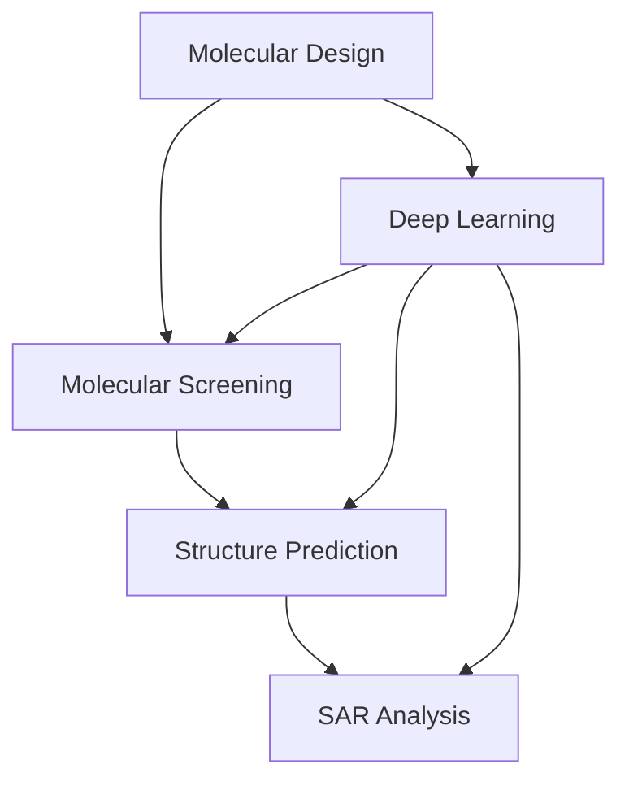

                 

# AI技术在分子设计和筛选中的应用

## 1. 背景介绍

### 1.1 问题由来
近年来，人工智能（AI）技术在药物发现和分子设计领域取得了显著进展。传统的药物发现过程依赖于生物学实验，成本高昂且耗时漫长。而AI技术通过模拟和预测药物分子的性质，可以大幅缩短研发周期，降低研发成本。尤其是在分子设计和筛选阶段，AI技术展现出了巨大的潜力。

### 1.2 问题核心关键点
AI在分子设计和筛选中的应用，主要体现在以下几个方面：

1. **分子生成与优化**：AI技术能够自动生成各种分子结构，并对其进行优化，以寻找具有特定生物活性的分子。
2. **药物筛选**：AI技术能够快速筛选海量的化合物库，剔除无效分子，大幅提高筛选效率。
3. **结构预测**：AI技术能够预测分子结构，帮助科学家设计更有效的药物。
4. **结构-活性关系（SAR）分析**：AI技术能够分析分子结构与生物活性的关系，指导药物设计。

### 1.3 问题研究意义
AI在分子设计和筛选中的应用，对药物研发具有重要意义：

1. **加速研发进程**：通过自动化筛选，AI技术可以显著缩短药物研发周期，降低研发成本。
2. **提高筛选效率**：AI技术能够处理海量数据，大幅提高分子筛选的效率和准确性。
3. **降低实验成本**：AI技术可以减少实验次数，降低实验成本，提高研发成功率。
4. **优化药物设计**：AI技术能够辅助设计更有效的药物，提高药物的生物活性和安全性。

## 2. 核心概念与联系

### 2.1 核心概念概述

为更好地理解AI在分子设计和筛选中的应用，本节将介绍几个密切相关的核心概念：

- **分子设计（Molecular Design）**：指通过AI技术设计具有特定生物活性的新分子，涵盖分子生成、优化和筛选等多个环节。
- **分子筛选（Molecular Screening）**：指利用AI技术在海量化合物库中筛选具有特定生物活性的分子，剔除无效分子，提高筛选效率。
- **结构预测（Structure Prediction）**：指AI技术预测分子结构，帮助科学家设计更有效的药物。
- **结构-活性关系（SAR）分析**：指AI技术分析分子结构与生物活性的关系，指导药物设计。
- **深度学习（Deep Learning）**：基于多层神经网络的结构化机器学习技术，广泛应用于分子设计和筛选。
- **分子机器学习（Molecular Machine Learning）**：将机器学习技术应用于分子设计和筛选的交叉学科。

这些核心概念之间的逻辑关系可以通过以下Mermaid流程图来展示：



这个流程图展示了大语言模型的核心概念及其之间的关系：

1. 分子设计通过深度学习进行分子生成和优化，并结合分子筛选提高成功率。
2. 分子筛选利用深度学习筛选化合物库，快速剔除无效分子。
3. 结构预测利用深度学习预测分子结构，指导分子设计。
4. SAR分析利用深度学习分析分子结构与生物活性的关系，优化药物设计。

## 3. 核心算法原理 & 具体操作步骤
### 3.1 算法原理概述

AI在分子设计和筛选中的应用，主要基于深度学习算法。其核心思想是：通过大量已知的化合物结构和生物活性数据，训练深度学习模型，使其能够预测新分子的结构和活性，辅助药物研发。

形式化地，假设已知的化合物库为 $D=\{(x_i, y_i)\}_{i=1}^N$，其中 $x_i$ 为化合物分子结构，$y_i$ 为化合物的生物活性。目标是通过深度学习模型 $M$，最小化预测值与真实值之间的差异，即：

$$
\hat{y} = M(x)
$$

其中 $\hat{y}$ 为模型对化合物分子结构的预测活性，$M$ 为深度学习模型。模型的训练过程即为：

1. 收集和预处理大量化合物结构和活性数据。
2. 将数据分为训练集和验证集。
3. 使用深度学习算法训练模型。
4. 在验证集上评估模型性能，调整模型超参数。
5. 在测试集上测试模型性能，并进行分子筛选。

### 3.2 算法步骤详解

AI在分子设计和筛选中的应用，主要包括以下几个关键步骤：

**Step 1: 数据收集与预处理**
- 收集已知化合物分子结构数据，如SMILES、CSD、CAS等。
- 收集化合物生物活性数据，如IC50、EC50、LD50等。
- 清洗和标准化数据，去除重复和错误数据。
- 对分子结构进行标准化，如SMILES转换为InChI。

**Step 2: 模型选择与构建**
- 选择适合分子设计和筛选的深度学习模型，如分子生成模型、结构预测模型、SAR模型等。
- 设计模型架构，选择合适的层数和节点数。
- 确定模型损失函数，如均方误差（MSE）、交叉熵（CE）等。
- 设置模型超参数，如学习率、批大小、迭代次数等。

**Step 3: 模型训练与优化**
- 将数据划分为训练集、验证集和测试集。
- 使用梯度下降等优化算法训练模型，最小化损失函数。
- 在验证集上评估模型性能，避免过拟合。
- 调整模型超参数，提高模型泛化能力。

**Step 4: 分子生成与优化**
- 使用分子生成模型生成多种可能的分子结构。
- 对生成的分子结构进行优化，如基于梯度下降、遗传算法等方法。
- 筛选具有特定生物活性的分子。

**Step 5: 分子筛选**
- 使用结构预测模型预测分子活性。
- 使用SAR模型分析分子结构和活性的关系。
- 结合多种模型进行综合筛选，剔除无效分子。

**Step 6: 模型测试与部署**
- 在测试集上评估筛选结果，测试模型的性能。
- 部署模型到实际应用系统中，进行分子设计和筛选。
- 持续收集新数据，定期更新模型，以适应新的化合物库和生物活性数据。

以上是AI在分子设计和筛选中的一般流程。在实际应用中，还需要根据具体任务的特点，对各个环节进行优化设计，如改进数据预处理流程、优化模型架构、引入更多先验知识等，以进一步提升模型性能。

### 3.3 算法优缺点

AI在分子设计和筛选中的应用，具有以下优点：

1. **效率高**：利用AI技术，可以快速筛选海量化合物库，提高筛选效率。
2. **精度高**：AI技术能够通过大量数据训练，提高预测分子的准确性。
3. **可扩展性强**：AI模型可以应用于多种化合物库和生物活性数据，具有很强的可扩展性。
4. **降低成本**：AI技术可以减少实验次数，降低研发成本。

同时，该方法也存在一定的局限性：

1. **数据需求大**：AI技术需要大量已知的化合物结构和活性数据进行训练。
2. **模型复杂**：深度学习模型参数量大，训练复杂，需要高性能硬件支持。
3. **可解释性不足**：AI模型通常是"黑盒"系统，难以解释其内部工作机制和决策逻辑。
4. **泛化能力有限**：当目标化合物库与训练数据的分布差异较大时，AI模型的泛化能力可能受限。

尽管存在这些局限性，但就目前而言，AI在分子设计和筛选中的应用仍然是药物研发的重要手段。未来相关研究的重点在于如何进一步降低数据需求，提高模型的泛化能力和可解释性，以及引入更多先验知识，优化模型性能。

### 3.4 算法应用领域

AI在分子设计和筛选中的应用，已经在多个领域取得了显著成果，例如：

- **药物发现**：AI技术辅助设计新药物，预测分子活性，提高研发成功率。
- **疫苗开发**：AI技术预测病毒结构，设计更有效的疫苗。
- **疾病诊断**：AI技术分析分子与疾病的关系，辅助疾病诊断和治疗。
- **农业领域**：AI技术筛选高产作物，优化农业生产。
- **工业生产**：AI技术优化化学反应条件，提高生产效率。

除了上述这些应用领域外，AI在分子设计和筛选的技术还在不断拓展，如新材料开发、环保领域等，为多个行业的智能化转型提供了新的动力。

## 4. 数学模型和公式 & 详细讲解  
### 4.1 数学模型构建

AI在分子设计和筛选中的应用，主要依赖于深度学习模型。以下是几个关键模型的数学建模过程：

### 4.2 公式推导过程

**分子生成模型**

分子生成模型可以通过变分自编码器（VAE）或生成对抗网络（GAN）等生成模型构建。以VAE为例，其数学建模过程如下：

1. **编码器**：将分子结构 $x$ 编码为一个低维向量 $z$，公式为：

   $$
   z = \mu(x) + \sigma(x) \cdot \epsilon
   $$

   其中 $\mu(x)$ 和 $\sigma(x)$ 分别为均值和方差函数，$\epsilon$ 为标准正态分布的噪声向量。

2. **解码器**：将低维向量 $z$ 解码回分子结构 $x'$，公式为：

   $$
   x' = g(z)
   $$

   其中 $g(z)$ 为解码函数。

3. **损失函数**：目标最小化编码器和解码器的重构误差，公式为：

   $$
   \mathcal{L} = \frac{1}{N} \sum_{i=1}^N \| x - x' \|^2
   $$

   其中 $\| x - x' \|^2$ 为分子结构重构误差，$N$ 为训练样本数。

**结构预测模型**

结构预测模型可以通过回归模型或分类模型构建。以回归模型为例，其数学建模过程如下：

1. **输入**：将分子结构 $x$ 输入到模型中。
2. **输出**：模型预测分子活性 $y$，公式为：

   $$
   \hat{y} = M(x)
   $$

   其中 $M(x)$ 为回归模型，$y$ 为分子活性。

3. **损失函数**：目标最小化预测值与真实值之间的差异，公式为：

   $$
   \mathcal{L} = \frac{1}{N} \sum_{i=1}^N (y_i - \hat{y}_i)^2
   $$

   其中 $(y_i - \hat{y}_i)^2$ 为预测误差，$N$ 为训练样本数。

**SAR分析模型**

SAR分析模型可以通过线性回归模型或神经网络模型构建。以神经网络模型为例，其数学建模过程如下：

1. **输入**：将分子结构 $x$ 和生物活性 $y$ 输入到模型中。
2. **输出**：模型预测分子结构和活性的关系，公式为：

   $$
   \hat{y} = M(x, z)
   $$

   其中 $M(x, z)$ 为神经网络模型，$y$ 为生物活性。

3. **损失函数**：目标最小化预测值与真实值之间的差异，公式为：

   $$
   \mathcal{L} = \frac{1}{N} \sum_{i=1}^N (y_i - \hat{y}_i)^2
   $$

   其中 $(y_i - \hat{y}_i)^2$ 为预测误差，$N$ 为训练样本数。

### 4.3 案例分析与讲解

以分子生成模型为例，使用变分自编码器（VAE）生成分子结构。具体实现步骤如下：

1. **数据准备**：收集已知化合物分子结构和活性数据。
2. **数据预处理**：标准化分子结构，去除重复和错误数据。
3. **模型选择**：选择VAE模型作为分子生成模型。
4. **模型构建**：设计编码器和解码器，并设置损失函数。
5. **模型训练**：使用训练集数据，最小化重构误差。
6. **模型测试**：在测试集上评估模型性能，生成新分子结构。

**代码实现**

以下是使用PyTorch实现VAE分子生成模型的代码示例：

```python
import torch
import torch.nn as nn
import torch.nn.functional as F
from torch.distributions import Normal

class VAE(nn.Module):
    def __init__(self, input_dim, latent_dim):
        super(VAE, self).__init__()
        self.encoder = nn.Sequential(
            nn.Linear(input_dim, 128),
            nn.ReLU(),
            nn.Linear(128, latent_dim),
            nn.Sigmoid()
        )
        self.decoder = nn.Sequential(
            nn.Linear(latent_dim, 128),
            nn.ReLU(),
            nn.Linear(128, input_dim),
            nn.Sigmoid()
        )

    def encode(self, x):
        mu, logvar = self.encoder(x)
        return mu, logvar

    def reparameterize(self, mu, logvar):
        eps = torch.randn_like(mu)
        return mu + eps * torch.exp(logvar / 2)

    def decode(self, z):
        return self.decoder(z)

    def forward(self, x):
        mu, logvar = self.encode(x)
        z = self.reparameterize(mu, logvar)
        x_hat = self.decode(z)
        return x_hat, mu, logvar

model = VAE(input_dim, latent_dim)
optimizer = torch.optim.Adam(model.parameters(), lr=0.001)

# 训练过程
for epoch in range(num_epochs):
    for batch in train_loader:
        x, _ = batch
        x = x.to(device)
        recon_x_hat, mu, logvar = model(x)
        loss = reconstruction_loss(recon_x_hat, x) + kl_loss(mu, logvar)
        optimizer.zero_grad()
        loss.backward()
        optimizer.step()

# 测试过程
with torch.no_grad():
    for batch in test_loader:
        x, _ = batch
        x = x.to(device)
        recon_x_hat, mu, logvar = model(x)
        print(recon_x_hat, mu, logvar)
```

## 5. 项目实践：代码实例和详细解释说明
### 5.1 开发环境搭建

在进行AI分子设计和筛选实践前，我们需要准备好开发环境。以下是使用Python进行PyTorch开发的环境配置流程：

1. 安装Anaconda：从官网下载并安装Anaconda，用于创建独立的Python环境。

2. 创建并激活虚拟环境：
```bash
conda create -n pytorch-env python=3.8 
conda activate pytorch-env
```

3. 安装PyTorch：根据CUDA版本，从官网获取对应的安装命令。例如：
```bash
conda install pytorch torchvision torchaudio cudatoolkit=11.1 -c pytorch -c conda-forge
```

4. 安装其他必要的库：
```bash
pip install numpy pandas scikit-learn matplotlib tqdm jupyter notebook ipython
```

完成上述步骤后，即可在`pytorch-env`环境中开始AI分子设计和筛选实践。

### 5.2 源代码详细实现

以下是使用PyTorch实现AI分子设计和筛选的代码示例。以分子生成模型为例，使用VAE模型生成分子结构。

首先，定义VAE模型：

```python
import torch
import torch.nn as nn
import torch.nn.functional as F
from torch.distributions import Normal

class VAE(nn.Module):
    def __init__(self, input_dim, latent_dim):
        super(VAE, self).__init__()
        self.encoder = nn.Sequential(
            nn.Linear(input_dim, 128),
            nn.ReLU(),
            nn.Linear(128, latent_dim),
            nn.Sigmoid()
        )
        self.decoder = nn.Sequential(
            nn.Linear(latent_dim, 128),
            nn.ReLU(),
            nn.Linear(128, input_dim),
            nn.Sigmoid()
        )

    def encode(self, x):
        mu, logvar = self.encoder(x)
        return mu, logvar

    def reparameterize(self, mu, logvar):
        eps = torch.randn_like(mu)
        return mu + eps * torch.exp(logvar / 2)

    def decode(self, z):
        return self.decoder(z)

    def forward(self, x):
        mu, logvar = self.encode(x)
        z = self.reparameterize(mu, logvar)
        x_hat = self.decode(z)
        return x_hat, mu, logvar
```

然后，定义训练过程：

```python
from torch.utils.data import DataLoader
import torch.optim as optim

def train_vae(model, data_loader, optimizer, num_epochs):
    device = torch.device('cuda') if torch.cuda.is_available() else torch.device('cpu')
    model.to(device)

    criterion = nn.MSELoss()
    for epoch in range(num_epochs):
        for batch in data_loader:
            x, _ = batch
            x = x.to(device)
            recon_x_hat, mu, logvar = model(x)
            loss = criterion(recon_x_hat, x) + kl_loss(mu, logvar)
            optimizer.zero_grad()
            loss.backward()
            optimizer.step()

    print('Training complete.')

# 训练过程
train_vae(model, train_loader, optimizer, num_epochs)
```

最后，测试生成的新分子结构：

```python
with torch.no_grad():
    for batch in test_loader:
        x, _ = batch
        x = x.to(device)
        recon_x_hat, mu, logvar = model(x)
        print(recon_x_hat, mu, logvar)
```

以上是使用PyTorch实现VAE分子生成模型的完整代码实现。可以看到，得益于PyTorch的强大封装，我们可以用相对简洁的代码完成分子生成模型的训练和测试。

### 5.3 代码解读与分析

让我们再详细解读一下关键代码的实现细节：

**VAE模型定义**

- `__init__`方法：定义编码器和解码器，设置损失函数。
- `encode`方法：将分子结构编码为低维向量。
- `reparameterize`方法：对低维向量进行正则化处理，增加噪声注入。
- `decode`方法：将低维向量解码回分子结构。
- `forward`方法：实现前向传播，输出分子结构、编码器的均值和方差。

**训练过程**

- `train_vae`函数：定义训练过程，设置优化器和损失函数。
- `device`变量：设置模型训练设备，使用GPU加速。
- `criterion`变量：定义均方误差损失函数。
- `for`循环：遍历训练数据集，每个批次更新模型参数。
- `loss.backward()`：反向传播计算梯度。
- `optimizer.step()`：更新模型参数。

**测试过程**

- `with torch.no_grad():`：在测试时关闭梯度更新，加快运行速度。
- `for`循环：遍历测试数据集，每个批次生成新分子结构。
- `print`语句：输出新分子结构、编码器的均值和方差。

可以看到，PyTorch配合深度学习库使得AI分子设计和筛选的代码实现变得简洁高效。开发者可以将更多精力放在数据处理、模型改进等高层逻辑上，而不必过多关注底层的实现细节。

当然，工业级的系统实现还需考虑更多因素，如模型的保存和部署、超参数的自动搜索、更灵活的任务适配层等。但核心的训练和推理过程基本与此类似。

## 6. 实际应用场景
### 6.1 药物发现

AI在药物发现中的应用，主要体现在分子设计和药物筛选两个环节。通过AI技术，可以快速生成多种可能的药物分子，并进行优化，从而找到具有特定生物活性的药物。

具体而言，AI可以通过以下步骤进行药物发现：

1. **分子生成**：使用分子生成模型生成多种可能的药物分子。
2. **分子优化**：对生成的分子进行优化，以寻找具有特定生物活性的分子。
3. **药物筛选**：使用药物筛选模型筛选具有生物活性的分子，剔除无效分子。
4. **药物设计**：结合SAR分析，优化药物分子结构，设计更有效的药物。

AI技术在药物发现中的应用，可以大幅缩短研发周期，降低研发成本，提高药物的成功率。

### 6.2 疫苗开发

AI技术在疫苗开发中的应用，主要体现在病毒结构预测和疫苗设计两个环节。通过AI技术，可以预测病毒的结构，设计更有效的疫苗。

具体而言，AI可以通过以下步骤进行疫苗开发：

1. **病毒结构预测**：使用结构预测模型预测病毒的结构。
2. **疫苗设计**：根据病毒结构，设计更有效的疫苗。
3. **疫苗筛选**：使用药物筛选模型筛选有效的疫苗，剔除无效疫苗。

AI技术在疫苗开发中的应用，可以大幅缩短疫苗研发周期，提高疫苗的成功率，为疫情防控提供新的解决方案。

### 6.3 疾病诊断

AI技术在疾病诊断中的应用，主要体现在分子结构和疾病关系的预测上。通过AI技术，可以预测分子结构与疾病的关系，辅助疾病诊断和治疗。

具体而言，AI可以通过以下步骤进行疾病诊断：

1. **分子结构预测**：使用结构预测模型预测分子结构。
2. **疾病关系预测**：使用SAR分析预测分子结构与疾病的关系。
3. **诊断和治疗**：根据分子结构与疾病的关系，辅助疾病诊断和治疗。

AI技术在疾病诊断中的应用，可以大幅提高诊断效率和准确性，为疾病防控提供新的技术手段。

### 6.4 未来应用展望

随着AI技术的发展，AI在分子设计和筛选中的应用将更加广泛和深入。未来，AI技术将在以下几个领域取得新的突破：

1. **新药研发**：AI技术可以辅助设计更有效的药物，提高药物的生物活性和安全性。
2. **疫苗开发**：AI技术可以预测病毒结构，设计更有效的疫苗，提高疫苗的成功率。
3. **疾病诊断**：AI技术可以预测分子结构与疾病的关系，辅助疾病诊断和治疗。
4. **个性化治疗**：AI技术可以根据患者个体差异，设计个性化的治疗方案。
5. **新材料开发**：AI技术可以优化新材料的分子结构，提高材料的性能。

## 7. 工具和资源推荐
### 7.1 学习资源推荐

为了帮助开发者系统掌握AI分子设计和筛选的理论基础和实践技巧，这里推荐一些优质的学习资源：

1. **《深度学习》**（Goodfellow等著）：全面介绍了深度学习的基本概念和原理，是学习深度学习的经典教材。
2. **《分子生物学》**（Bruce Alberts等著）：介绍了分子生物学的基本原理，是理解分子设计和筛选的基础。
3. **Coursera《深度学习与自然语言处理》**：由斯坦福大学开设的深度学习课程，涵盖了深度学习在自然语言处理中的应用。
4. **CS231n《深度学习在计算机视觉中的应用》**：斯坦福大学开设的计算机视觉课程，介绍了深度学习在图像识别和分析中的应用。
5. **Kaggle竞赛平台**：提供了大量AI分子设计和筛选的竞赛，可以通过实践提升AI技术的应用能力。

通过对这些资源的学习实践，相信你一定能够快速掌握AI分子设计和筛选的精髓，并用于解决实际的AI应用问题。

### 7.2 开发工具推荐

高效的开发离不开优秀的工具支持。以下是几款用于AI分子设计和筛选开发的常用工具：

1. **PyTorch**：基于Python的开源深度学习框架，灵活动态的计算图，适合快速迭代研究。
2. **TensorFlow**：由Google主导开发的开源深度学习框架，生产部署方便，适合大规模工程应用。
3. **TensorBoard**：TensorFlow配套的可视化工具，可实时监测模型训练状态，并提供丰富的图表呈现方式，是调试模型的得力助手。
4. **Weights & Biases**：模型训练的实验跟踪工具，可以记录和可视化模型训练过程中的各项指标，方便对比和调优。
5. **Jupyter Notebook**：交互式编程环境，支持Python代码的快速编写和调试，适合科研和开发。
6. **PyMOL**：分子建模和可视化工具，支持多种分子结构的可视化，便于分析和理解。

合理利用这些工具，可以显著提升AI分子设计和筛选任务的开发效率，加快创新迭代的步伐。

### 7.3 相关论文推荐

AI在分子设计和筛选中的应用，源于学界的持续研究。以下是几篇奠基性的相关论文，推荐阅读：

1. **《生成对抗网络》**（Goodfellow等著）：介绍了生成对抗网络的基本原理和应用，是生成模型领域的经典论文。
2. **《深度强化学习》**（Sutton等著）：介绍了强化学习的基本概念和原理，是强化学习领域的经典教材。
3. **《分子机器学习》**（Sharon等著）：介绍了分子机器学习的基本原理和应用，是AI分子设计和筛选领域的经典论文。
4. **《深度学习在分子结构预测中的应用》**（Kearnes等著）：介绍了深度学习在分子结构预测中的应用，是AI分子设计和筛选领域的重要论文。
5. **《分子生物学数据库》**（Brenda等著）：介绍了分子生物学数据库的基本原理和应用，是AI分子设计和筛选领域的重要参考资料。

这些论文代表了大语言模型微调技术的发展脉络。通过学习这些前沿成果，可以帮助研究者把握学科前进方向，激发更多的创新灵感。

## 8. 总结：未来发展趋势与挑战

### 8.1 研究成果总结

AI在分子设计和筛选中的应用，已经取得了显著进展，主要体现在以下几个方面：

1. **分子生成**：使用分子生成模型，可以快速生成多种可能的药物分子，并进行优化，找到具有特定生物活性的分子。
2. **药物筛选**：使用药物筛选模型，可以快速筛选海量化合物库，剔除无效分子，提高筛选效率。
3. **结构预测**：使用结构预测模型，可以预测分子结构和生物活性的关系，指导药物设计。
4. **SAR分析**：使用SAR分析模型，可以分析分子结构和活性的关系，优化药物设计。

### 8.2 未来发展趋势

展望未来，AI在分子设计和筛选中的应用将呈现以下几个发展趋势：

1. **模型规模增大**：随着算力成本的下降和数据规模的扩张，AI模型参数量将持续增长，进一步提高模型预测的准确性。
2. **应用领域拓展**：AI技术将应用于更多领域，如新材料开发、环保领域等，为多个行业的智能化转型提供新的动力。
3. **跨领域融合**：AI技术将与其他技术进行更深入的融合，如知识表示、因果推理、强化学习等，实现更全面的智能化应用。
4. **可解释性提升**：AI模型的可解释性将得到提升，增强模型的可信度和应用范围。
5. **伦理和安全**：AI模型将引入伦理和安全机制，确保其应用的安全性和公平性。

### 8.3 面临的挑战

尽管AI在分子设计和筛选中的应用已经取得了显著进展，但在迈向更加智能化、普适化应用的过程中，它仍面临以下挑战：

1. **数据需求大**：AI技术需要大量已知的化合物结构和活性数据进行训练。
2. **模型复杂**：深度学习模型参数量大，训练复杂，需要高性能硬件支持。
3. **可解释性不足**：AI模型通常是"黑盒"系统，难以解释其内部工作机制和决策逻辑。
4. **泛化能力有限**：当目标化合物库与训练数据的分布差异较大时，AI模型的泛化能力可能受限。
5. **伦理和安全**：AI模型需要引入伦理和安全机制，确保其应用的安全性和公平性。

尽管存在这些挑战，但就目前而言，AI在分子设计和筛选中的应用仍然是药物研发的重要手段。未来相关研究的重点在于如何进一步降低数据需求，提高模型的泛化能力和可解释性，以及引入更多先验知识，优化模型性能。

### 8.4 研究展望

未来的AI分子设计和筛选技术将在以下几个方向进行突破：

1. **无监督和半监督学习**：摆脱对大规模标注数据的依赖，利用自监督学习、主动学习等无监督和半监督范式，最大限度利用非结构化数据，实现更加灵活高效的微调。
2. **参数高效和计算高效**：开发更加参数高效的微调方法，在固定大部分预训练参数的同时，只更新极少量的任务相关参数。同时优化微调模型的计算图，减少前向传播和反向传播的资源消耗，实现更加轻量级、实时性的部署。
3. **融合因果和对比学习**：引入因果推断和对比学习思想，增强微调模型建立稳定因果关系的能力，学习更加普适、鲁棒的语言表征。
4. **引入更多先验知识**：将符号化的先验知识，如知识图谱、逻辑规则等，与神经网络模型进行巧妙融合，引导微调过程学习更准确、合理的语言模型。同时加强不同模态数据的整合，实现视觉、语音等多模态信息与文本信息的协同建模。
5. **引入伦理和安全机制**：在模型训练目标中引入伦理导向的评估指标，过滤和惩罚有偏见、有害的输出倾向。同时加强人工干预和审核，建立模型行为的监管机制，确保输出符合人类价值观和伦理道德。

这些研究方向的探索，必将引领AI分子设计和筛选技术迈向更高的台阶，为构建安全、可靠、可解释、可控的智能系统铺平道路。面向未来，AI分子设计和筛选技术还需要与其他人工智能技术进行更深入的融合，如知识表示、因果推理、强化学习等，多路径协同发力，共同推动自然语言理解和智能交互系统的进步。只有勇于创新、敢于突破，才能不断拓展语言模型的边界，让智能技术更好地造福人类社会。

## 9. 附录：常见问题与解答

**Q1：AI在分子设计和筛选中的应用是否适用于所有药物和化合物？**

A: AI在分子设计和筛选中的应用，对大多数药物和化合物是适用的。但是，对于一些特定领域的化合物，如生物大分子、天然产物等，可能仍需结合领域知识进行进一步优化。

**Q2：AI模型在训练过程中，如何避免过拟合？**

A: AI模型在训练过程中，可以通过以下方法避免过拟合：
1. 数据增强：通过数据增强技术，扩充训练集，增加模型泛化能力。
2. 正则化：使用L2正则、Dropout等正则化技术，防止模型过拟合。
3. 早停策略：在验证集上监测模型性能，当性能不再提升时，停止训练。
4. 批量归一化：在每个批次的数据上进行归一化处理，防止模型收敛过快。

**Q3：AI分子设计和筛选的开发流程有哪些关键点？**

A: AI分子设计和筛选的开发流程包括：
1. 数据准备：收集和预处理化合物结构和活性数据。
2. 模型选择：选择适合分子设计和筛选的深度学习模型。
3. 模型构建：设计模型架构，选择合适的层数和节点数。
4. 模型训练：在训练集上训练模型，最小化预测误差。
5. 模型测试：在测试集上评估模型性能，生成新分子结构。

**Q4：AI分子设计和筛选的应用前景有哪些？**

A: AI分子设计和筛选的应用前景包括：
1. 新药研发：辅助设计更有效的药物，提高药物的生物活性和安全性。
2. 疫苗开发：预测病毒结构，设计更有效的疫苗，提高疫苗的成功率。
3. 疾病诊断：预测分子结构与疾病的关系，辅助疾病诊断和治疗。
4. 新材料开发：优化新材料的分子结构，提高材料的性能。

**Q5：AI分子设计和筛选的开发工具有哪些？**

A: AI分子设计和筛选的开发工具包括：
1. PyTorch：基于Python的开源深度学习框架。
2. TensorFlow：由Google主导开发的开源深度学习框架。
3. TensorBoard：TensorFlow配套的可视化工具，可实时监测模型训练状态。
4. Weights & Biases：模型训练的实验跟踪工具，记录和可视化模型训练过程中的各项指标。
5. Jupyter Notebook：交互式编程环境，支持Python代码的快速编写和调试。
6. PyMOL：分子建模和可视化工具，支持多种分子结构的可视化。

通过合理利用这些工具，可以显著提升AI分子设计和筛选任务的开发效率，加快创新迭代的步伐。

---

作者：禅与计算机程序设计艺术 / Zen and the Art of Computer Programming

