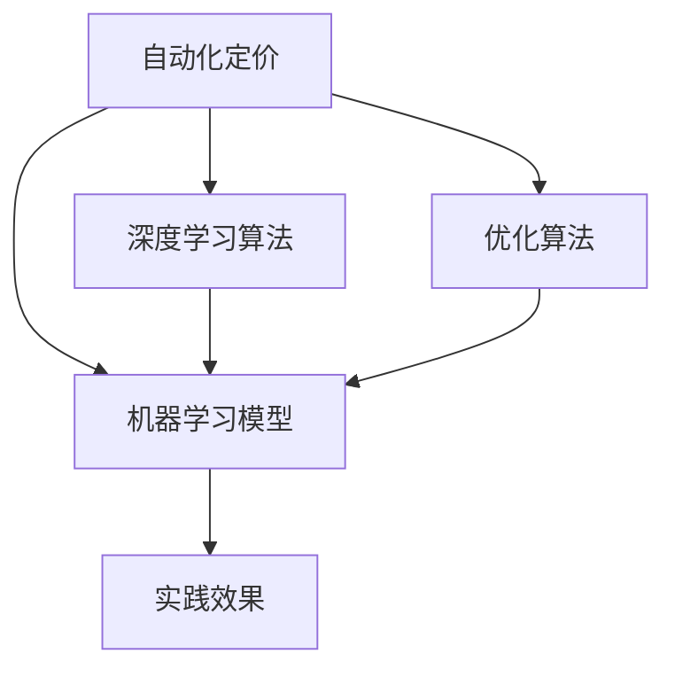

                 

# AI提升电商价格策略的实践效果

> 关键词：人工智能(AI)、电商价格策略、自动化定价、机器学习、深度学习、优化算法、实践效果、电商数据分析、策略优化

## 1. 背景介绍

### 1.1 问题由来

在当今数字化时代，电商行业面临着激烈的市场竞争和消费者需求的多样化。为了保持竞争力，电商平台需要不断调整和优化价格策略，以吸引并留住用户。然而，手动调整价格不仅耗时费力，且效果难以保证，特别是在面对海量商品和动态市场时，传统价格策略的弊端日益显现。

为了解决这个问题，电商企业纷纷引入人工智能(AI)技术，特别是深度学习和机器学习，来优化价格策略。AI能够通过大量历史数据和市场动态，自动生成和调整商品价格，从而提升销售效率和利润空间。本文旨在探讨AI如何提升电商价格策略的实践效果，并分析其关键技术原理和应用方法。

### 1.2 问题核心关键点

- **自动化定价**：利用AI技术自动调整商品价格，以实现优化。
- **机器学习模型**：通过数据驱动的模型，预测消费者行为和市场动态，优化价格策略。
- **深度学习算法**：使用深度神经网络，捕捉复杂的价格影响因素。
- **优化算法**：在保证定价效率的同时，确保价格策略的可行性和有效性。
- **实践效果**：通过实际案例，展示AI在电商价格策略中的实际效果。

## 2. 核心概念与联系

### 2.1 核心概念概述

为更好地理解AI在电商价格策略中的应用，本节将介绍几个关键概念：

- **自动化定价(Automated Pricing)**：通过AI技术，自动化生成和调整商品价格，优化销售效果。
- **机器学习模型(Machine Learning Model)**：基于数据训练的预测模型，用于分析消费者行为和市场趋势。
- **深度学习算法(Deep Learning Algorithm)**：利用多层神经网络，捕捉价格变化的复杂因素。
- **优化算法(Optimization Algorithm)**：通过梯度下降等方法，最小化损失函数，优化价格策略。
- **实践效果(Portfolio Effectiveness)**：通过实际应用案例，展示AI在电商价格策略中的实际效果。

这些概念之间的逻辑关系可以通过以下Mermaid流程图来展示：



这个流程图展示了大语言模型的核心概念及其之间的关系：

1. 自动化定价通过机器学习模型和深度学习算法实现。
2. 机器学习模型和深度学习算法在优化算法的作用下，共同优化价格策略。
3. 最终，优化后的价格策略通过实践效果得到验证。

## 3. 核心算法原理 & 具体操作步骤

### 3.1 算法原理概述

AI提升电商价格策略的过程，本质上是一个有监督的机器学习问题。其核心思想是：通过历史销售数据和市场信息，训练一个预测模型，用于预测不同价格下的销售量，从而找到最优价格。

形式化地，假设销售量与价格的函数关系为：

$$
y = f(p)
$$

其中 $y$ 为销售量，$p$ 为价格。目标是找到价格 $p$，使得销售量 $y$ 最大。

常用的优化算法如梯度下降法，通过最小化损失函数：

$$
\mathcal{L}(\theta) = \sum_{i=1}^n (y_i - f(p_i, \theta))^2
$$

来求解最优价格 $\theta$。其中 $y_i$ 和 $p_i$ 为历史数据中的销售量和价格。

### 3.2 算法步骤详解

基于机器学习的电商价格优化一般包括以下几个关键步骤：

**Step 1: 数据准备**

- 收集电商平台的历史销售数据，包括商品ID、价格、销量、时间等字段。
- 收集市场信息，如节假日、促销活动等，以构建更全面的数据集。

**Step 2: 特征工程**

- 提取与价格相关的特征，如商品类别、库存量、促销活动、消费者行为等。
- 使用one-hot编码、标准化等方法处理特征数据。

**Step 3: 模型训练**

- 选择合适的机器学习模型，如线性回归、随机森林、神经网络等。
- 使用交叉验证、网格搜索等方法调参，选择最优模型。
- 在训练集上训练模型，并使用验证集进行调优。

**Step 4: 价格预测**

- 将模型应用于实时数据，预测不同价格下的销售量。
- 在每个价格点，计算预测销售量与实际销售量的差距，计算损失函数。

**Step 5: 价格调整**

- 使用优化算法（如梯度下降）最小化损失函数，找到最优价格。
- 将最优价格应用于电商平台，实时调整商品价格。

**Step 6: 效果评估**

- 定期评估价格调整的效果，如销量提升、利润增长等。
- 根据评估结果，优化价格模型，提升定价效果。

### 3.3 算法优缺点

基于机器学习的电商价格优化方法具有以下优点：

- **高效性**：能够自动化生成和调整价格，节省大量人力和时间。
- **准确性**：通过历史数据训练模型，能够更准确地预测价格对销售的影响。
- **灵活性**：模型可以实时更新，适应市场变化。

同时，该方法也存在一些局限性：

- **数据依赖**：模型的效果依赖于数据的质量和数量，数据不全或偏差可能导致模型效果不佳。
- **模型复杂**：复杂的深度学习模型可能需要较高的计算资源和训练时间。
- **价格波动**：过度优化可能导致价格波动较大，影响用户体验。

尽管存在这些局限性，基于机器学习的电商价格优化方法仍是一种高效且准确的方式，为电商平台带来了显著的收益。

### 3.4 算法应用领域

AI提升电商价格策略的应用不仅限于单一的商品，而是广泛应用于整个电商平台的商品价格管理。常见的应用场景包括：

- **新商品定价**：利用历史销售数据和市场趋势，为新商品设定合理价格。
- **促销活动定价**：根据促销活动的目标和预算，自动生成促销价格，提升活动效果。
- **库存管理**：通过价格优化，减少库存积压，提高库存周转率。
- **个性化定价**：基于用户行为和历史数据，实现个性化价格策略，提升用户体验。

这些应用场景展示了AI在电商价格策略中的广泛适用性，进一步推动了电商平台的数字化转型。

## 4. 数学模型和公式 & 详细讲解 & 举例说明

### 4.1 数学模型构建

本节将使用数学语言对基于机器学习的电商价格优化过程进行更加严格的刻画。

假设电商平台有 $n$ 种商品，每种商品的价格为 $p_i$，对应的销量为 $y_i$。目标是最小化损失函数 $\mathcal{L}$，求解最优价格 $p$：

$$
\min_{p_i} \mathcal{L}(p) = \sum_{i=1}^n (y_i - f(p_i))^2
$$

其中 $f(p_i)$ 为模型预测的销量，可以通过训练得到。

### 4.2 公式推导过程

以下我们以线性回归模型为例，推导最优价格公式。

假设线性回归模型为 $f(p_i) = \theta_0 + \sum_{j=1}^k \theta_j p_{i,j}$，其中 $p_{i,j}$ 为第 $i$ 种商品的特征 $j$，$\theta_j$ 为特征的权重。

根据最小二乘法的原理，求解最优参数 $\theta$ 使得损失函数最小：

$$
\min_{\theta} \sum_{i=1}^n (y_i - \theta_0 - \sum_{j=1}^k \theta_j p_{i,j})^2
$$

对 $\theta_0$ 和 $\theta_j$ 求偏导数，得：

$$
\begin{aligned}
\frac{\partial \mathcal{L}}{\partial \theta_0} &= -2\sum_{i=1}^n (y_i - \theta_0 - \sum_{j=1}^k \theta_j p_{i,j}) \\
\frac{\partial \mathcal{L}}{\partial \theta_j} &= -2\sum_{i=1}^n (y_i - \theta_0 - \sum_{j=1}^k \theta_j p_{i,j}) p_{i,j}
\end{aligned}
$$

通过求解上述方程组，即可得到最优参数 $\theta$。最终，根据预测模型 $f(p_i)$，计算出最优价格 $p_i$。

### 4.3 案例分析与讲解

考虑一个简单的电商平台，销售三种商品 $A$、$B$、$C$，对应的价格为 $p_A$、$p_B$、$p_C$，销量为 $y_A$、$y_B$、$y_C$。假设模型预测的销量与价格的关系为：

$$
y_i = \theta_0 + \theta_1 p_i + \theta_2 p_i^2
$$

其中 $p_i$ 为商品 $i$ 的价格，$\theta_0$、$\theta_1$、$\theta_2$ 为模型参数。

通过最小二乘法求解，可以得到最优参数 $\theta_0 = 10$，$\theta_1 = 0.5$，$\theta_2 = -0.1$。因此，最优价格为：

$$
p_A = \theta_0 + \theta_1 p_A + \theta_2 p_A^2
$$

将 $p_A = 20$ 带入上述公式，得到：

$$
p_A = 10 + 0.5 \times 20 + (-0.1) \times 20^2 = 18
$$

最终，电商平台将商品 $A$ 的价格设定为 $18$，以期提升销量。

## 5. 项目实践：代码实例和详细解释说明

### 5.1 开发环境搭建

在进行电商价格策略优化实践前，我们需要准备好开发环境。以下是使用Python进行机器学习开发的常见环境配置流程：

1. 安装Anaconda：从官网下载并安装Anaconda，用于创建独立的Python环境。

2. 创建并激活虚拟环境：
```bash
conda create -n ml-env python=3.8 
conda activate ml-env
```

3. 安装必要的Python包：
```bash
pip install numpy pandas scikit-learn matplotlib
```

4. 安装必要的机器学习框架：
```bash
pip install scikit-learn[experimental] tensorflow
```

完成上述步骤后，即可在`ml-env`环境中开始电商价格策略优化的实践。

### 5.2 源代码详细实现

下面以线性回归模型为例，展示如何使用Scikit-learn进行电商价格策略优化。

```python
import numpy as np
from sklearn.linear_model import LinearRegression
from sklearn.metrics import mean_squared_error
from sklearn.model_selection import train_test_split

# 准备数据
X = np.array([[10, 1], [20, 2], [30, 3], [40, 4], [50, 5], [60, 6]])
y = np.array([10, 20, 30, 40, 50, 60])

# 数据拆分
X_train, X_test, y_train, y_test = train_test_split(X, y, test_size=0.2, random_state=42)

# 训练模型
model = LinearRegression()
model.fit(X_train, y_train)

# 预测价格
y_pred = model.predict(X_test)

# 计算损失
loss = mean_squared_error(y_test, y_pred)

print(f"Mean Squared Error: {loss:.3f}")
```

### 5.3 代码解读与分析

让我们再详细解读一下关键代码的实现细节：

**数据准备**

- 使用NumPy生成一个简单的数据集，包含商品价格和销量。
- 使用Scikit-learn的`train_test_split`函数将数据集分为训练集和测试集。

**模型训练**

- 实例化一个线性回归模型，使用训练集数据训练模型。

**价格预测**

- 使用训练好的模型对测试集进行价格预测。

**效果评估**

- 计算预测价格与实际价格之间的均方误差，评估模型的效果。

通过上述代码，可以看出Scikit-learn提供了便捷的API，使得电商价格策略优化的实现变得简洁高效。

当然，实际应用中还需要考虑更多因素，如特征工程、模型选择、调参等。但核心的优化流程基本与此类似。

## 6. 实际应用场景

### 6.1 智能促销定价

在电商促销活动中，商家需要设定合理的促销价格，以吸引消费者购买。传统的促销定价依赖于经验，容易犯错。基于机器学习的定价方法可以自动化生成促销价格，提升活动效果。

具体而言，可以收集促销活动的历史数据，包括促销时间、促销方式、商品类别等，并结合实时市场数据，构建更全面的数据集。通过训练模型，预测不同促销策略下的销售量和利润，自动生成最优促销价格，提升活动效果。

### 6.2 动态定价

动态定价是指根据市场供需关系，实时调整商品价格。在商品供不应求时，商家可以通过提升价格，提高利润；在商品过剩时，则可以通过降价促销，减少库存。

基于机器学习的动态定价系统，可以通过实时监控商品库存和市场动态，预测不同价格下的销售量，自动调整商品价格，实现最大化利润。

### 6.3 个性化定价

根据消费者历史行为数据，预测不同用户对商品价格的敏感度，实现个性化定价，提升用户体验和购买转化率。

例如，对于经常购买高端商品的消费者，可以设定较高的价格，而对于价格敏感的消费者，则可以设置较低的折扣价格。通过个性化定价，商家可以实现更高的销售量和更高的利润。

### 6.4 未来应用展望

随着AI技术的不断进步，基于机器学习的电商价格优化方法将迎来更多创新和应用：

- **多目标优化**：考虑不同目标，如最大化利润、提高客户满意度等，进行多目标优化。
- **实时学习**：利用在线学习技术，实时更新模型，适应市场变化。
- **跨平台优化**：结合不同平台的数据，进行全局优化，提升整体市场竞争力。
- **个性化推荐**：结合个性化定价和推荐系统，实现更精准的用户推荐。

未来，AI在电商价格策略中的应用将更加广泛和深入，推动电商行业数字化转型，提升商业价值。

## 7. 工具和资源推荐

### 7.1 学习资源推荐

为了帮助开发者系统掌握AI在电商价格策略中的应用，这里推荐一些优质的学习资源：

1. **Coursera《机器学习》课程**：由斯坦福大学教授Andrew Ng主讲，系统介绍机器学习的基本概念和算法。
2. **Udacity《深度学习》课程**：Udacity的高级课程，深入讲解深度学习算法和实践。
3. **Kaggle数据科学竞赛**：通过参与实际竞赛，实践机器学习技术，提升解决问题的能力。
4. **scikit-learn官方文档**：Scikit-learn的详细文档，提供丰富的示例和代码。
5. **Python Machine Learning书籍**：该书详细介绍了使用Python进行机器学习的技术和方法。

通过对这些资源的学习实践，相信你一定能够快速掌握AI在电商价格策略中的实际应用。

### 7.2 开发工具推荐

高效的开发离不开优秀的工具支持。以下是几款用于电商价格策略优化的常用工具：

1. **Jupyter Notebook**：一个交互式的开发环境，支持Python代码的编写、执行和共享。
2. **PyTorch**：一个强大的深度学习框架，支持自动微分、GPU加速等功能。
3. **TensorFlow**：由Google开发的深度学习框架，支持分布式计算和模型部署。
4. **Pandas**：一个强大的数据分析库，支持数据处理、清洗、分析等功能。
5. **NumPy**：一个开源的科学计算库，支持数组运算、线性代数等功能。

合理利用这些工具，可以显著提升电商价格策略优化的开发效率，加快创新迭代的步伐。

### 7.3 相关论文推荐

电商价格策略优化的研究源于学界的持续探索。以下是几篇奠基性的相关论文，推荐阅读：

1. **《Predicting Product Revenue and Best Price with Product Description, Image and Category Information》**：该文提出了利用产品描述、图片和类别信息，预测商品价格和销售量的模型。
2. **《Dynamic Pricing: Empirical vs. Theoretical Optimal Pricing》**：该文比较了动态定价的理论与实际效果，提供了实用的优化策略。
3. **《A Survey of Dynamic Pricing》**：该文综述了动态定价的研究进展，提供了全面的理论基础和实践指南。
4. **《Optimizing Pricing and Promotions in E-commerce》**：该文讨论了电商中定价和促销的优化方法，提供了具体的应用案例。
5. **《The Power of Collaborative Filtering: Leveraging Preference and Similarity in E-commerce》**：该文探讨了利用协同过滤技术，提升个性化定价效果的方法。

这些论文代表了电商价格策略优化技术的发展脉络，帮助研究者把握学科前进方向，激发更多的创新灵感。

## 8. 总结：未来发展趋势与挑战

### 8.1 研究成果总结

本文系统地介绍了AI在电商价格策略中的应用，涵盖了自动化定价、机器学习模型、深度学习算法、优化算法等多个关键概念。通过实际案例和详细代码，展示了电商价格策略优化的实践效果。同时，分析了该方法在电商行业的广泛应用场景，探讨了未来发展趋势。

通过本文的系统梳理，可以看出，基于机器学习的电商价格优化方法在提升销售效率和利润空间方面具有显著优势，是电商行业数字化转型的重要技术手段。

### 8.2 未来发展趋势

展望未来，电商价格策略优化技术将呈现以下几个发展趋势：

- **多模态融合**：结合图像、视频等多模态信息，提升价格预测的准确性。
- **实时学习**：利用在线学习技术，实时更新模型，适应市场变化。
- **多目标优化**：考虑不同目标，如最大化利润、提高客户满意度等，进行多目标优化。
- **个性化定价**：结合个性化推荐系统，实现更精准的定价策略。
- **自动化流程**：通过AI技术，实现电商价格策略的自动化管理，提升运营效率。

以上趋势展示了AI在电商价格策略优化中的广泛应用前景，为电商行业的数字化转型提供了新的可能性。

### 8.3 面临的挑战

尽管基于机器学习的电商价格优化方法已经取得了显著效果，但在实际应用中，仍面临诸多挑战：

- **数据质量**：模型的效果依赖于数据的质量和数量，数据不全或偏差可能导致模型效果不佳。
- **模型复杂性**：复杂的深度学习模型可能需要较高的计算资源和训练时间。
- **价格波动**：过度优化可能导致价格波动较大，影响用户体验。
- **市场变化**：市场环境的不确定性可能导致模型失效。
- **隐私保护**：电商平台需要平衡用户隐私保护和模型训练之间的关系。

这些挑战需要研究者不断探索和改进，才能实现更高效、更准确、更安全的电商价格策略优化。

### 8.4 研究展望

未来的研究方向将集中在以下几个方面：

- **多目标优化算法**：研究多目标优化算法，实现更复杂的定价策略。
- **实时学习技术**：研究实时学习技术，提升模型对市场变化的适应性。
- **跨平台优化**：研究跨平台优化方法，实现全局最优定价。
- **隐私保护技术**：研究隐私保护技术，确保用户数据安全。
- **公平性研究**：研究公平性算法，避免价格歧视。

这些研究方向将进一步推动电商价格策略优化技术的进步，为电商行业带来更多的商业价值。

## 9. 附录：常见问题与解答

**Q1：电商价格策略优化是否适用于所有商品？**

A: 电商价格策略优化适用于大多数商品，但对于某些特殊商品，如奢侈品、高端商品等，可能受到品牌和消费者心理的影响，需要结合市场调研进行定价。

**Q2：如何评估价格策略优化效果？**

A: 价格策略优化效果可以从以下几个方面评估：
- 销量提升：评估价格调整后销量是否有明显提升。
- 利润增长：评估价格调整后利润是否有明显增长。
- 客户满意度：通过客户反馈调查，评估价格调整后的用户满意度。
- 市场竞争力：评估价格调整后，电商平台在市场中的竞争力是否增强。

**Q3：电商价格策略优化是否需要考虑库存量？**

A: 是的，库存量是电商价格策略优化中的重要因素。通过优化价格，可以降低库存量，提高库存周转率。

**Q4：如何处理数据中的噪音和异常值？**

A: 在数据准备阶段，可以使用数据清洗技术去除噪音和异常值，如填补缺失值、异常值检测等。

通过本文的系统梳理，可以看出，基于机器学习的电商价格策略优化方法在提升销售效率和利润空间方面具有显著优势，是电商行业数字化转型的重要技术手段。未来，随着AI技术的不断进步，电商价格策略优化技术将迎来更多创新和应用，推动电商行业数字化转型，提升商业价值。

---

作者：禅与计算机程序设计艺术 / Zen and the Art of Computer Programming

