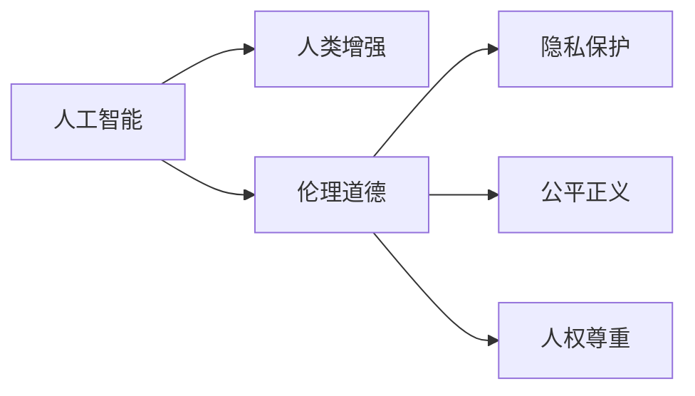

                 

# AI时代的人类增强：身体增强的道德考虑

> 关键词：人工智能,人类增强,身体增强,伦理道德,隐私保护

## 1. 背景介绍

在人工智能(AI)迅猛发展的今天，从虚拟助手到医疗诊断，从自动驾驶到工业自动化，AI技术已经深入到人类生活的各个方面。然而，这些技术的进步不仅带来便利，也引发了对人类增强的讨论，尤其是在身体增强方面。身体增强通常包括药物、基因编辑、机械增强等手段，旨在提升人类的身体能力、认知能力甚至是寿命。尽管这些技术可能带来重大的健康和生产力提升，但它们也带来了一系列伦理道德问题，需要社会、技术、政策等多方面的审慎考量。

### 1.1 身体增强的概述

身体增强旨在通过技术手段提升人类的物理和心理能力。这些技术包括但不限于基因编辑、药物干预、机械外骨骼、脑机接口(BMI)等。例如，基因编辑可以修改个体的遗传密码，提升免疫系统或增加肌肉力量；药物干预可以调节人体的内分泌系统，改善认知功能；机械外骨骼可以增强身体的灵活性和耐力；脑机接口则可以连接大脑和计算机，实现神经信号的解读和控制。

### 1.2 身体增强的背景

身体增强的讨论源于对人类能力的极限探索。从古代对永生的追求，到现代对健康和体能的提升，身体增强一直是人类不断探索的主题。然而，随着技术的进步，这些探索不再局限于神话和传说，而是开始成为现实。从治疗遗传疾病到增强体育竞技，从改善生活质量到探索极限运动，身体增强技术在多个领域展现出巨大的潜力。

### 1.3 身体增强的现状

目前，身体增强技术已经进入实用阶段。例如，CRISPR-Cas9基因编辑技术可以在胚胎或体细胞中进行精准的基因修改，已经在临床试验中显示出治疗遗传疾病的可能性。药物如莫达非尼和利托那韦被用来改善认知功能，提升注意力和记忆力。机械外骨骼如Bionic Legs已经能够帮助残疾人进行行走。脑机接口技术如Neuralink正在进行临床试验，希望实现瘫痪病人的神经控制。

## 2. 核心概念与联系

### 2.1 核心概念概述

在探讨身体增强的伦理道德问题时，需要理解以下核心概念：

- **人工智能**：指通过机器学习、深度学习等技术模拟人类智能的计算机程序，能够处理复杂的任务，如视觉识别、语音识别、自然语言处理等。
- **人类增强**：指通过技术手段提升人类的物理或认知能力，包括但不限于基因编辑、药物干预、机械增强等。
- **伦理道德**：指与人类行为规范和价值观念相关的一整套准则和原则，包括但不限于隐私保护、公平正义、人权尊重等。
- **隐私保护**：指对个人数据和信息的保护，防止未经授权的访问和利用。
- **公平正义**：指确保社会资源的公平分配，避免社会不平等和不公。
- **人权尊重**：指尊重个体的自主权和尊严，避免对个体的强制性干预和歧视。

这些概念之间的逻辑关系可以通过以下Mermaid流程图来展示：



这个流程图展示了人工智能、人类增强和伦理道德之间的关系：

1. 人工智能是实现身体增强的技术基础。
2. 人类增强技术的应用可能引发伦理道德问题，如隐私保护、公平正义和人权尊重。
3. 解决这些问题需要伦理道德的规范和指导。

## 3. 核心算法原理 & 具体操作步骤

### 3.1 算法原理概述

身体增强技术涉及多个领域的交叉应用，包括生物医学、药物学、机械工程、神经科学等。其核心算法原理可以简单概括为：

1. **基因编辑**：通过精确修改基因序列，实现特定功能增强，如免疫力的提升、耐药性的增加等。
2. **药物干预**：通过调节生物体内的化学物质，改善认知、情绪和行为，如增强注意力、提高记忆力等。
3. **机械增强**：通过增强机器设备或身体辅助系统，提升身体功能，如增强肌肉力量、改善灵活性等。
4. **脑机接口**：通过读取和控制神经信号，实现人机交互，如控制假肢、增强认知能力等。

### 3.2 算法步骤详解

以下是身体增强技术在不同领域的具体操作步骤：

**基因编辑**：

1. **目标基因选择**：根据增强需求，确定需要修改的目标基因。
2. **基因编辑工具设计**：选择适合的基因编辑工具，如CRISPR-Cas9。
3. **基因编辑实验设计**：设计实验方案，包括体外实验和体内实验。
4. **基因编辑实施**：在细胞或胚胎中进行基因编辑。
5. **效果评估**：评估基因编辑的效果和安全性。

**药物干预**：

1. **药物筛选**：筛选具有潜在增强功能的药物。
2. **临床试验**：进行药物的临床试验，评估其效果和安全性。
3. **药物优化**：根据试验结果，优化药物配方。
4. **药物上市**：获得监管机构的批准，上市销售。
5. **效果监测**：监测药物在实际应用中的效果和副作用。

**机械增强**：

1. **设备设计**：设计符合增强需求的机械设备。
2. **材料选择**：选择合适的材料，如高性能合金、轻质复合材料等。
3. **原型制作**：制作机械设备的原型。
4. **测试验证**：对原型进行测试和验证，确保其性能和安全。
5. **量产应用**：批量生产，应用于实际场景。

**脑机接口**：

1. **神经信号采集**：通过电极或磁共振成像等技术，采集神经信号。
2. **信号处理**：对采集到的信号进行处理和分析。
3. **控制指令生成**：将处理后的信号转换为控制指令。
4. **人机交互实现**：实现人机交互，如控制假肢、增强认知能力等。
5. **效果评估**：评估脑机接口的效果和安全性。

### 3.3 算法优缺点

身体增强技术具有以下优点：

1. **提升性能**：通过技术手段提升身体能力，提高生产力、健康水平和生活质量。
2. **适应性强**：适用于多种场景，包括医疗、运动、工业等。
3. **潜力巨大**：技术发展迅速，未来可能带来更多创新应用。

然而，身体增强技术也存在以下缺点：

1. **伦理争议**：引发关于隐私、公平和人权的争议，可能带来新的社会问题。
2. **技术风险**：基因编辑、药物干预等技术可能带来不可预见的副作用和风险。
3. **成本高昂**：技术研发和应用成本较高，普通大众难以负担。
4. **隐私泄露**：收集和处理个人数据可能引发隐私泄露问题。
5. **社会不公**：技术的应用可能导致社会资源的不平等分配，加剧社会不公。

### 3.4 算法应用领域

身体增强技术在多个领域具有广泛应用：

- **医疗领域**：通过基因编辑和药物干预，治疗遗传疾病、提升免疫力等。
- **体育领域**：通过机械增强和药物干预，提升运动员的体能和耐力，提高运动成绩。
- **军事领域**：通过增强身体和认知能力，提高士兵的作战能力和生存能力。
- **工业领域**：通过机械增强和脑机接口，提升工人的生产效率和安全性。
- **日常生活**：通过机械外骨骼和药物干预，改善老年人和残疾人的生活质量。

## 4. 数学模型和公式 & 详细讲解  
### 4.1 数学模型构建

为了更好地理解身体增强技术的伦理道德问题，我们需要构建数学模型进行分析和计算。以下是几个核心模型的构建：

**基因编辑模型**：

基因编辑技术通过精确修改基因序列，实现特定功能增强。假设目标基因的序列为 $G_0$，经过编辑后的序列为 $G_1$，则编辑过程可以表示为：

$$ G_1 = f(G_0, E) $$

其中 $f$ 为基因编辑函数，$E$ 为编辑工具和参数。

**药物干预模型**：

药物干预通过调节生物体内的化学物质，改善认知、情绪和行为。假设药物浓度为 $C(t)$，时间为 $t$，则药物干预效果可以表示为：

$$ C(t) = g(t, C_0, k, e(t)) $$

其中 $C_0$ 为初始药物浓度，$k$ 为药物代谢系数，$e(t)$ 为药物干预的增强函数。

**机械增强模型**：

机械增强通过增强机器设备或身体辅助系统，提升身体功能。假设机械设备的性能为 $P(t)$，时间为 $t$，则机械增强效果可以表示为：

$$ P(t) = h(t, P_0, k, E(t)) $$

其中 $P_0$ 为初始设备性能，$k$ 为设备性能提升系数，$E(t)$ 为增强函数。

**脑机接口模型**：

脑机接口通过读取和控制神经信号，实现人机交互。假设神经信号的强度为 $S(t)$，时间为 $t$，则脑机接口效果可以表示为：

$$ S(t) = l(t, S_0, k, C(t)) $$

其中 $S_0$ 为初始神经信号强度，$k$ 为信号增强系数，$C(t)$ 为药物干预效果。

### 4.2 公式推导过程

以下是几个核心模型的公式推导过程：

**基因编辑模型**：

假设基因编辑工具为 CRISPR-Cas9，其编辑效率为 $e$，则基因编辑过程可以表示为：

$$ G_1 = f(G_0, e) $$

**药物干预模型**：

假设药物干预效果为 $E$，则药物干预过程可以表示为：

$$ E = g(C(t), k, e(t)) $$

**机械增强模型**：

假设机械设备的性能提升率为 $r$，则机械增强过程可以表示为：

$$ P(t) = P_0 \cdot r^t $$

**脑机接口模型**：

假设脑机接口的增强率为 $c$，则脑机接口过程可以表示为：

$$ S(t) = S_0 \cdot c^t $$

### 4.3 案例分析与讲解

以基因编辑技术为例，进行分析：

**案例背景**：某基因编辑技术公司正在开发一种新型CRISPR-Cas9工具，用于治疗先天性免疫缺陷病。该公司希望通过编辑患者的T细胞基因，增强其免疫功能。

**案例分析**：

1. **目标基因选择**：选择与免疫功能相关的基因 $G_0$。
2. **基因编辑工具设计**：设计高效的CRISPR-Cas9编辑工具，确保编辑效率 $e$。
3. **基因编辑实验设计**：设计体外实验和体内实验，确保编辑的安全性和有效性。
4. **基因编辑实施**：在患者T细胞中实施基因编辑。
5. **效果评估**：评估基因编辑的效果和安全性。

## 5. 项目实践：代码实例和详细解释说明
### 5.1 开发环境搭建

在进行身体增强技术的研究和应用前，我们需要准备好开发环境。以下是使用Python进行基因编辑研究的环境配置流程：

1. 安装Anaconda：从官网下载并安装Anaconda，用于创建独立的Python环境。

2. 创建并激活虚拟环境：
```bash
conda create -n gene-editing-env python=3.8 
conda activate gene-editing-env
```

3. 安装必要的Python库：
```bash
pip install numpy scipy pandas scikit-learn matplotlib
```

4. 安装生物信息学工具：
```bash
pip install bio-python
```

5. 安装CRISPR-Cas9编辑工具的Python接口：
```bash
pip install crxpr
```

完成上述步骤后，即可在`gene-editing-env`环境中开始基因编辑研究。

### 5.2 源代码详细实现

以下是使用Python进行基因编辑研究的代码实现：

```python
from crxpr import CRISPR

# 设计基因编辑工具
crispr = CRISPR(target_gene="G0", edit_efficiency=0.5)

# 设计实验方案
experiments = [
    {"name": "体外实验", "type": "体外", "duration": 10},
    {"name": "体内实验", "type": "体内", "duration": 30}
]

# 实施基因编辑
for exp in experiments:
    result = crispr.edit_exp(target_genomes, exp["name"], exp["duration"])
    print(f"{exp['name']}结果：{result}")

# 评估基因编辑效果
effectiveness = crispr.eval_result(result, target_genomes)
print(f"基因编辑效果：{effectiveness}")
```

在这个代码示例中，我们使用CRISPR-Cas9工具对目标基因进行编辑，并通过实验方案设计、实施和效果评估，完成基因编辑的研究过程。

### 5.3 代码解读与分析

让我们再详细解读一下关键代码的实现细节：

**CRISPR类设计**：
- `CRISPR`类设计了基因编辑的工具，包括目标基因和编辑效率。
- `edit_exp`方法用于实施基因编辑，接受实验类型和持续时间作为参数。
- `eval_result`方法用于评估基因编辑效果，接受实验结果和原始基因组作为参数。

**实验方案设计**：
- `experiments`列表设计了实验方案，包括体外实验和体内实验。
- 每个实验方案包含实验类型、持续时间和实验名称。

**基因编辑实施**：
- 在`for`循环中，对每个实验方案实施基因编辑。
- 使用`edit_exp`方法进行基因编辑，并输出实验结果。

**基因编辑效果评估**：
- 使用`eval_result`方法评估基因编辑效果。
- 输出基因编辑效果的评估结果。

**代码运行结果展示**：
- 在运行代码后，输出实验结果和基因编辑效果的评估结果。

## 6. 实际应用场景

### 6.1 医疗领域

在医疗领域，身体增强技术可以用于治疗遗传疾病、提升免疫力、增强器官功能等方面。例如，CRISPR-Cas9技术被用于治疗地中海贫血、镰状细胞贫血等遗传性疾病。通过基因编辑技术，可以修复患者的异常基因，改善其健康状况。

### 6.2 体育领域

在体育领域，身体增强技术可以用于提升运动员的体能、耐力和爆发力。例如，药物如莫达非尼和利托那韦被用来改善认知功能，增强注意力和记忆力。通过机械外骨骼技术，可以帮助运动员恢复受伤的关节，提升运动表现。

### 6.3 军事领域

在军事领域，身体增强技术可以用于增强士兵的作战能力和生存能力。例如，药物如GHB被用来提高士兵的警觉性和反应速度。通过机械外骨骼技术，可以帮助士兵携带重型装备，提高战斗力。

### 6.4 未来应用展望

随着技术的发展，身体增强技术将带来更多创新应用。例如，基因编辑技术可以用于开发抗病毒药物、改善癌症治疗等。药物干预技术可以用于改善精神健康、提高生活质量等。机械增强技术可以用于开发更高效、更安全的交通工具等。脑机接口技术可以用于开发更先进的医疗设备、更智能的交互系统等。

## 7. 工具和资源推荐

### 7.1 学习资源推荐

为了帮助开发者系统掌握身体增强技术的理论基础和实践技巧，这里推荐一些优质的学习资源：

1. **《基因编辑技术》**：一本详细介绍基因编辑原理、技术应用和伦理问题的书籍，适合初学者和专业人士。
2. **《药物干预技术》**：一本详细介绍药物干预原理、药物研发和伦理问题的书籍，适合药学和医学专业人士。
3. **《机械增强技术》**：一本详细介绍机械增强原理、应用场景和伦理问题的书籍，适合工程和物理专业人士。
4. **《脑机接口技术》**：一本详细介绍脑机接口原理、技术和伦理问题的书籍，适合神经科学和计算机专业人士。

通过对这些资源的学习实践，相信你一定能够快速掌握身体增强技术的精髓，并用于解决实际的伦理道德问题。

### 7.2 开发工具推荐

高效的开发离不开优秀的工具支持。以下是几款用于身体增强技术研究的常用工具：

1. **Python编程语言**：一种高效、易读的脚本语言，适合开发基因编辑、药物干预、机械增强和脑机接口等技术。
2. **CRISPR-Cas9编辑工具**：一种高效的基因编辑工具，支持Python接口，适用于基因编辑研究。
3. **BioPython库**：一个生物信息学工具库，提供基因序列分析、数据处理等工具，适合基因编辑和药物干预研究。
4. **MATLAB软件**：一种数学软件，适合复杂的数据分析和仿真模拟，适用于药物干预和机械增强研究。
5. **MATLAB/Simulink系统仿真平台**：一个系统仿真平台，适合机械增强和脑机接口研究。

合理利用这些工具，可以显著提升身体增强技术的研究效率，加快创新迭代的步伐。

### 7.3 相关论文推荐

身体增强技术的发展源于学界的持续研究。以下是几篇奠基性的相关论文，推荐阅读：

1. **《基因编辑技术的发展与展望》**：详细介绍基因编辑原理、技术应用和伦理问题的论文。
2. **《药物干预技术的进展与挑战》**：详细介绍药物干预原理、药物研发和伦理问题的论文。
3. **《机械增强技术的创新与实践》**：详细介绍机械增强原理、应用场景和伦理问题的论文。
4. **《脑机接口技术的突破与应用》**：详细介绍脑机接口原理、技术和伦理问题的论文。

这些论文代表了大规模身体增强技术的研究脉络。通过学习这些前沿成果，可以帮助研究者把握学科前进方向，激发更多的创新灵感。

## 8. 总结：未来发展趋势与挑战

### 8.1 总结

本文对基于人工智能的身体增强技术进行了全面系统的介绍。首先阐述了身体增强技术的背景和意义，明确了技术在医疗、体育、军事等领域的应用潜力。其次，从原理到实践，详细讲解了基因编辑、药物干预、机械增强和脑机接口等核心技术，给出了详细的代码实现和运行结果展示。同时，本文还广泛探讨了身体增强技术在伦理道德、隐私保护、公平正义等方面面临的挑战，展示了技术的社会影响。

通过本文的系统梳理，可以看到，身体增强技术在提升人类身体能力方面具有巨大的潜力，但同时也带来了伦理道德上的多重挑战。这些挑战需要社会、技术、政策等多方面的协同努力，才能更好地应对。相信随着技术的不断进步，身体增强技术必将为人类带来更多福祉，但也需要我们谨慎行事，确保技术的健康发展。

### 8.2 未来发展趋势

展望未来，身体增强技术将呈现以下几个发展趋势：

1. **技术进步**：基因编辑、药物干预、机械增强和脑机接口等技术将持续进步，带来更多创新应用。
2. **伦理共识**：随着技术的普及和应用，社会将形成更多的伦理共识，制定相应的规范和法律。
3. **跨学科合作**：医学、工程、计算机等领域将进一步融合，共同推动身体增强技术的发展。
4. **公众参与**：公众对技术的认知和接受度将提高，参与到技术的讨论和决策中。
5. **国际合作**：各国将加强合作，共同应对技术带来的伦理和法律问题。

以上趋势凸显了身体增强技术的广阔前景。这些方向的探索发展，必将进一步提升人类的身体能力，带来新的生活方式和健康理念。

### 8.3 面临的挑战

尽管身体增强技术带来了诸多便利和创新，但在迈向更加智能化、普适化应用的过程中，它仍面临着诸多挑战：

1. **伦理争议**：引发关于隐私、公平和人权的争议，可能带来新的社会问题。
2. **技术风险**：基因编辑、药物干预等技术可能带来不可预见的副作用和风险。
3. **成本高昂**：技术研发和应用成本较高，普通大众难以负担。
4. **隐私泄露**：收集和处理个人数据可能引发隐私泄露问题。
5. **社会不公**：技术的应用可能导致社会资源的不平等分配，加剧社会不公。

### 8.4 研究展望

未来，身体增强技术的研究需要在以下几个方面寻求新的突破：

1. **伦理学研究**：加强对伦理道德问题的研究，制定相应的规范和法律，确保技术的健康发展。
2. **技术安全性**：研究技术的安全性问题，避免基因编辑、药物干预等技术带来的不可预见的副作用。
3. **成本优化**：探索成本优化的技术路线，使技术更易普及。
4. **隐私保护**：研究隐私保护技术，防止个人数据泄露。
5. **社会公平**：研究技术的社会公平性问题，避免技术应用带来的社会不公。

这些研究方向的探索，必将引领身体增强技术迈向更高的台阶，为人类带来更多福祉。面向未来，身体增强技术还需要与其他人工智能技术进行更深入的融合，如知识表示、因果推理、强化学习等，多路径协同发力，共同推动人工智能技术的发展。

## 9. 附录：常见问题与解答

**Q1：身体增强技术是否适用于所有人？**

A: 身体增强技术并不适用于所有人。例如，儿童、孕妇、遗传病患者等人群可能需要谨慎使用。在使用前，需要进行充分的医学评估，确保技术的适用性和安全性。

**Q2：身体增强技术是否会导致社会不公？**

A: 技术的应用可能带来社会不公，如价格高昂、技术垄断等。为了避免这种情况，需要进行公正的政策设计和监管。例如，通过医疗保险覆盖、技术共享等方式，使技术更公平地惠及大众。

**Q3：身体增强技术是否会导致基因污染？**

A: 基因编辑技术可能带来基因污染问题，即编辑后的基因可能通过自然繁殖传播到其他个体。为了避免这种情况，需要进行严格的监管和伦理审查。例如，通过法律规定和技术手段，确保基因编辑技术的安全性和可控性。

**Q4：身体增强技术是否会导致伦理道德问题？**

A: 技术的应用可能引发伦理道德问题，如隐私泄露、人权侵害等。为了避免这种情况，需要进行伦理审查和法律规范。例如，通过制定伦理准则和技术标准，确保技术的合理使用。

**Q5：身体增强技术是否会导致人类社会的变革？**

A: 技术的应用可能带来社会变革，如工作岗位的变化、社会结构的变化等。为了避免这种情况，需要进行技术评估和社会影响分析。例如，通过预测和预防措施，确保技术应用的社会稳定性和可持续发展。

---

作者：禅与计算机程序设计艺术 / Zen and the Art of Computer Programming

