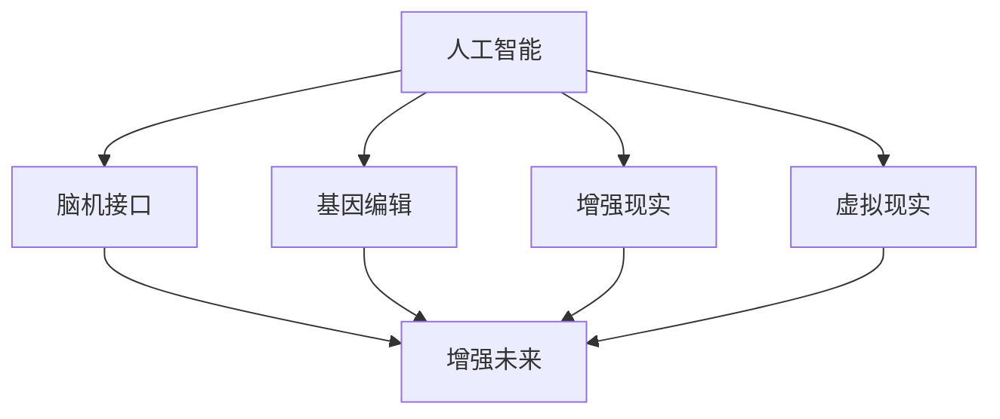

                 

# AI时代的人类增强：道德考虑与身体增强的未来发展机遇挑战预测

> 关键词：人工智能,人类增强,伦理学,脑机接口,基因编辑,增强未来

## 1. 背景介绍

随着科技的迅猛发展，人工智能(AI)已经逐步渗透到生活的各个方面，从医疗到教育，从交通到娱乐，无处不在。特别是人类增强技术的发展，如脑机接口(Brain-Computer Interface, BCI)和基因编辑技术(CRISPR)，正在为人类带来前所未有的机遇和挑战。这些技术能够提升人类的身体机能、认知能力、创造力等，但同时也带来了伦理、隐私、安全等方面的深层次问题。

### 1.1 人类增强技术的发展历程

人类增强技术的起源可以追溯到古代的劳动工具，如斧头、弓箭等，它们极大地提高了人类的生存能力。近代以来，随着科技的进步，人类增强技术也不断发展，从机械假肢到神经刺激器，再到今天的AI和基因编辑技术，呈现出加速发展的态势。

1. **机械假肢**：
   - 19世纪初，乔治·欧文制造了第一台机械假肢，为失去肢体的人带来了重获行动能力的希望。
   - 20世纪初，艾因斯特·卡伦发明了革命性的电子假肢，通过电刺激帮助肢残患者恢复行走能力。

2. **神经刺激器**：
   - 20世纪60年代，艾尔文·克里克（Ervin Cogswell）开发了第一个神经刺激器，帮助神经受损患者恢复视觉和听觉。
   - 1988年，菲尔·施瓦茨（Phil Schylder）发明了磁刺激器，增强了神经控制的能力。

3. **AI与脑机接口**：
   - 1990年代，艾伦·图灵奖得主约翰·霍兰德（John Holland）提出了“人类与机器的相互增强”概念，AI与BCI开始结合。
   - 21世纪初，斯坦福大学的戈登·威尔斯（Gordon Wiles）开发了首个基于脑电波的BCI系统，通过解读大脑信号实现计算机控制。

4. **基因编辑技术**：
   - 2012年，Jennifer Doudna和Emmanuelle Charpentier共同开发了CRISPR-Cas9技术，为基因编辑提供了革命性工具。
   - 2017年，CRISPR技术被应用于人类胚胎，开启了基因编辑治疗遗传病的时代。

### 1.2 人类增强技术的现状与趋势

当前，人类增强技术正处于快速发展阶段，包括但不限于以下几方面：

1. **脑机接口**：
   - 脑电图(EEG)、功能性磁共振成像(fMRI)、磁刺激器等技术不断进步，增强了对人脑信号的理解和解读。
   - 商业化应用已初现端倪，如NeuroPeople公司的Odyssey系统，通过BCI帮助瘫痪患者恢复写作和沟通能力。

2. **基因编辑**：
   - CRISPR-Cas9技术已经广泛应用于动物实验，证明其在治疗遗传病、癌症等方面的潜力。
   - 基因编辑技术如Precision Medicine和CAR-T细胞疗法，已经在临床上取得初步成功。

3. **AI与增强技术结合**：
   - AI技术在图像识别、语音识别、自然语言处理等方面的突破，为增强技术提供了更精准的数据支持。
   - 智能假肢、增强现实(AR)、虚拟现实(VR)等应用，正在改变人类的生产生活方式。

## 2. 核心概念与联系

### 2.1 核心概念概述

为了更好地理解人类增强技术的核心概念及其相互联系，本节将介绍几个关键概念：

1. **人工智能(AI)**：指通过计算机程序实现人类智能活动的模仿、延伸和扩展，包括但不限于机器学习、自然语言处理、计算机视觉等。

2. **脑机接口(BCI)**：指通过技术手段将人脑信号转化为计算机指令，实现对机器的直接控制。BCI技术的应用包括神经康复、辅助沟通、游戏等。

3. **基因编辑**：指通过基因编辑技术如CRISPR-Cas9，对生物体基因进行精确修改，以修复基因缺陷、增强生理功能等。

4. **增强未来**：指通过各种技术手段，提升人类的身体机能、认知能力、创造力等，从而实现更健康、更强大、更智慧的未来。

这些概念之间的逻辑关系可以通过以下Mermaid流程图来展示：



这个流程图展示了人工智能、脑机接口和基因编辑技术如何共同推动增强未来的实现，以及增强未来在多个具体领域的应用。

## 3. 核心算法原理 & 具体操作步骤
### 3.1 算法原理概述

人类增强技术的核心在于通过AI和BCI技术实现对人类身体和大脑功能的增强。其基本原理包括：

1. **信号采集与处理**：
   - 使用EEG、fMRI、肌电图(EMG)等技术，采集人类大脑和肌肉的信号。
   - 通过信号预处理、特征提取等技术，将原始信号转化为可用的数据。

2. **模式识别与解码**：
   - 使用机器学习算法，如支持向量机(SVM)、随机森林(Random Forest)、神经网络等，对信号进行模式识别，识别出特定的脑电波或肌肉电信号。
   - 通过解码算法，将识别出的信号转化为计算机可执行的指令。

3. **控制输出**：
   - 将计算机生成的指令发送给执行器，如机械假肢、游戏控制器等。
   - 通过反馈机制，调整解码算法以优化指令的准确性。

### 3.2 算法步骤详解

基于AI和BCI技术的增强未来的实现步骤包括：

1. **数据采集**：
   - 使用EEG、fMRI、EMG等设备，采集人类大脑和肌肉的信号。
   - 记录信号的采样率和预处理步骤，确保数据的质量。

2. **信号预处理**：
   - 使用滤波器去除噪声，如低通滤波器、高通滤波器等。
   - 使用归一化、去趋势等方法，处理信号的异常值和基线漂移。

3. **特征提取与选择**：
   - 使用PCA、LDA等方法，对信号进行降维处理。
   - 选择最有用的特征，如频率、幅度、相位等，用于后续的模式识别。

4. **模式识别**：
   - 使用SVM、随机森林等算法，训练分类器识别特定的脑电波或肌肉电信号。
   - 通过交叉验证等技术，评估分类器的性能。

5. **解码算法训练**：
   - 使用神经网络等算法，训练解码器将分类器的输出转化为指令。
   - 通过反向传播等技术，优化解码器的参数。

6. **控制输出**：
   - 将解码器的输出发送到机械假肢、游戏控制器等执行器。
   - 使用反馈机制，调整解码器以提高指令的准确性。

### 3.3 算法优缺点

人类增强技术的优势在于：

1. **提高生活质量**：
   - 通过增强人类的身体机能、认知能力等，提高生活质量和幸福感。
   - 帮助肢体残疾、神经系统疾病患者恢复正常生活。

2. **推动科技发展**：
   - 促进AI、BCI、基因编辑等技术的创新和应用。
   - 带动相关产业的发展，如医疗设备、可穿戴设备等。

3. **解决社会问题**：
   - 增强未来技术可以改善教育、医疗、环境保护等方面，推动社会进步。

但其缺点也不容忽视：

1. **伦理争议**：
   - 基因编辑可能带来不可预知的基因突变，引发伦理道德问题。
   - BCI技术可能侵犯隐私，引发数据安全和用户隐私问题。

2. **技术局限**：
   - 现有技术尚无法解决所有身体和大脑问题，存在技术局限。
   - 数据采集和信号处理的精度有待提高，影响技术的实际效果。

3. **安全问题**：
   - 增强技术的错误指令可能对用户造成伤害。
   - 数据泄露和网络攻击等安全问题可能引发隐私泄露。

### 3.4 算法应用领域

人类增强技术已经在多个领域得到了应用：

1. **医疗康复**：
   - 使用BCI技术帮助肢体残疾、神经系统疾病患者恢复运动能力。
   - 通过基因编辑技术治疗遗传病、癌症等重大疾病。

2. **军事应用**：
   - 增强士兵的身体机能和认知能力，提高作战能力。
   - 使用AI和BCI技术开发脑控无人机、智能武器等装备。

3. **娱乐游戏**：
   - 通过BCI技术实现脑控游戏，增强游戏的互动性和趣味性。
   - 使用增强现实(AR)、虚拟现实(VR)技术开发沉浸式游戏体验。

4. **教育培训**：
   - 使用BCI技术帮助学习障碍者提高认知能力。
   - 通过AI技术提供个性化学习建议和资源。

## 4. 数学模型和公式 & 详细讲解
### 4.1 数学模型构建

基于AI和BCI技术的增强未来的实现过程可以抽象为一个多层次的数学模型。其核心包括数据采集、信号处理、特征提取、模式识别和解码算法等环节。

1. **数据采集模型**：
   - 设输入信号为 $x_i=(x_{i1},x_{i2},...,x_{in})$，其中 $x_{ij}$ 为第 $i$ 个信号的第 $j$ 个特征。
   - 数据采集模型为 $y_i=f(x_i)$，其中 $f$ 为信号采集函数。

2. **信号预处理模型**：
   - 设预处理后的信号为 $x_i'$，则信号预处理模型为 $x_i'=h(x_i)$，其中 $h$ 为预处理函数。

3. **特征提取模型**：
   - 设提取后的特征为 $x_i''=(x_{i''1},x_{i''2},...,x_{i''k})$，则特征提取模型为 $x_i''=g(x_i')$，其中 $g$ 为特征提取函数。

4. **模式识别模型**：
   - 设模式识别结果为 $y_i'''=(c_i,c_i,...,c_i)$，其中 $c_i$ 为分类器的输出，则模式识别模型为 $y_i'''=k(x_i'')$，其中 $k$ 为模式识别函数。

5. **解码算法模型**：
   - 设解码后的指令为 $y_i''''=(a_i,a_i,...,a_i)$，则解码算法模型为 $y_i''''=s(y_i''')$，其中 $s$ 为解码函数。

### 4.2 公式推导过程

以模式识别模型为例，推导其公式推导过程。

设样本 $x_i$ 属于 $n$ 个类别中的一个，分类器的目标是找到一个超平面 $\omega$，将 $x_i$ 映射到相应的类别 $y_i'''$。设超平面为 $\omega(x)=w_0+\sum_{j=1}^n w_j x_{ij}$，其中 $w_j$ 为权重系数。

根据线性判别函数，可以推导出模式识别模型的损失函数为：

$$
\mathcal{L}(\omega)=\frac{1}{2N}\sum_{i=1}^N\sum_{j=1}^N\omega^T\omega + \frac{\lambda}{2N}\sum_{i=1}^N||\omega||^2
$$

其中，$N$ 为样本数，$\lambda$ 为正则化系数。

通过最小化损失函数，可以求解出最优的超平面 $\omega$。

### 4.3 案例分析与讲解

以脑机接口技术为例，分析其实现过程及其影响。

1. **信号采集**：
   - 使用EEG设备采集大脑的电信号，记录信号的采样率和预处理步骤。
   - 预处理步骤包括去噪声、归一化、去趋势等。

2. **信号特征提取**：
   - 通过PCA等方法，对信号进行降维处理。
   - 选择频率、幅度、相位等特征，用于后续的模式识别。

3. **模式识别**：
   - 使用SVM等算法，训练分类器识别特定的脑电波。
   - 通过交叉验证等技术，评估分类器的性能。

4. **解码算法训练**：
   - 使用神经网络等算法，训练解码器将分类器的输出转化为指令。
   - 通过反向传播等技术，优化解码器的参数。

5. **控制输出**：
   - 将解码器的输出发送到机械假肢、游戏控制器等执行器。
   - 使用反馈机制，调整解码器以提高指令的准确性。

## 5. 项目实践：代码实例和详细解释说明
### 5.1 开发环境搭建

在进行增强未来技术实践前，我们需要准备好开发环境。以下是使用Python进行BCI开发的PyTorch环境配置流程：

1. 安装Anaconda：从官网下载并安装Anaconda，用于创建独立的Python环境。

2. 创建并激活虚拟环境：
```bash
conda create -n bci-env python=3.8 
conda activate bci-env
```

3. 安装PyTorch：根据CUDA版本，从官网获取对应的安装命令。例如：
```bash
conda install pytorch torchvision torchaudio cudatoolkit=11.1 -c pytorch -c conda-forge
```

4. 安装TensorFlow：如果项目需要，可以安装TensorFlow：
```bash
conda install tensorflow tensorflow-gpu -c conda-forge
```

5. 安装各类工具包：
```bash
pip install numpy pandas scikit-learn matplotlib tqdm jupyter notebook ipython
```

完成上述步骤后，即可在`bci-env`环境中开始BCI实践。

### 5.2 源代码详细实现

下面我们以脑电波解码为例，给出使用PyTorch进行BCI开发的PyTorch代码实现。

首先，定义BCI模型的数据处理函数：

```python
import torch
import torch.nn as nn
import torchvision.transforms as transforms
from torch.utils.data import DataLoader, Dataset
import numpy as np

class BCI_Dataset(Dataset):
    def __init__(self, data, labels, transform=None):
        self.data = data
        self.labels = labels
        self.transform = transform

    def __len__(self):
        return len(self.data)

    def __getitem__(self, idx):
        sample = self.data[idx]
        label = self.labels[idx]

        if self.transform:
            sample = self.transform(sample)

        return sample, label

# 定义数据预处理函数
def preprocess_data(data):
    # 归一化处理
    data -= np.mean(data, axis=0)
    data /= np.std(data, axis=0)
    return data

# 定义特征选择函数
def select_features(data):
    # 选择频率、幅度、相位等特征
    features = np.zeros((data.shape[1], 10))
    features[:, :5] = np.abs(np.fft.fft(data[:, :5]))**2
    features[:, 5:] = np.angle(np.fft.fft(data[:, :5]))
    return features

# 定义解码器
class BCI_Decoder(nn.Module):
    def __init__(self):
        super(BCI_Decoder, self).__init__()
        self.fc1 = nn.Linear(10, 128)
        self.fc2 = nn.Linear(128, 2)

    def forward(self, x):
        x = torch.from_numpy(x).float()
        x = F.relu(self.fc1(x))
        x = F.softmax(self.fc2(x), dim=1)
        return x

# 定义模型训练函数
def train_model(model, data_loader, device, epochs=10):
    model.train()
    criterion = nn.CrossEntropyLoss()
    optimizer = torch.optim.Adam(model.parameters(), lr=0.001)

    for epoch in range(epochs):
        for i, (features, labels) in enumerate(data_loader):
            features, labels = features.to(device), labels.to(device)

            optimizer.zero_grad()
            outputs = model(features)
            loss = criterion(outputs, labels)
            loss.backward()
            optimizer.step()

            if i % 100 == 0:
                print(f"Epoch [{epoch+1}/{epochs}], Step [{i+1}/{len(data_loader)}], Loss: {loss.item():.4f}")

# 定义模型评估函数
def evaluate_model(model, data_loader, device):
    model.eval()
    correct = 0
    total = 0

    with torch.no_grad():
        for features, labels in data_loader:
            features, labels = features.to(device), labels.to(device)
            outputs = model(features)
            _, predicted = torch.max(outputs.data, 1)
            total += labels.size(0)
            correct += (predicted == labels).sum().item()

    print(f"Accuracy: {(100 * correct / total):.2f}%")
```

然后，定义模型和数据集：

```python
# 加载训练数据和标签
data = np.load('data.npy')
labels = np.load('labels.npy')

# 定义数据预处理和特征选择函数
data = preprocess_data(data)
features = select_features(data)

# 定义解码器
model = BCI_Decoder().to(device)

# 定义训练数据集和测试数据集
train_data = BCI_Dataset(features, labels)
train_loader = DataLoader(train_data, batch_size=32, shuffle=True)

# 定义测试数据集
test_data = BCI_Dataset(features, labels, transform=transforms.ToTensor())
test_loader = DataLoader(test_data, batch_size=32, shuffle=False)

# 定义训练和评估函数
train_model(model, train_loader, device)
evaluate_model(model, test_loader, device)
```

以上就是使用PyTorch进行BCI开发的完整代码实现。可以看到，得益于PyTorch的强大封装，我们可以用相对简洁的代码完成BCI模型的加载和训练。

### 5.3 代码解读与分析

让我们再详细解读一下关键代码的实现细节：

**BCI_Dataset类**：
- `__init__`方法：初始化数据和标签，并定义数据预处理和特征选择函数。
- `__len__`方法：返回数据集的样本数量。
- `__getitem__`方法：对单个样本进行处理，将其转化为模型所需的输入和标签。

**preprocess_data和select_features函数**：
- `preprocess_data`函数：对数据进行归一化处理，确保数据的一致性和稳定性。
- `select_features`函数：选择频率、幅度、相位等特征，用于后续的模式识别。

**BCI_Decoder类**：
- `__init__`方法：定义解码器的网络结构。
- `forward`方法：实现解码器的前向传播过程，输出解码后的指令。

**train_model和evaluate_model函数**：
- `train_model`函数：对解码器进行训练，使用交叉熵损失函数和Adam优化器。
- `evaluate_model`函数：对解码器进行评估，输出模型在测试集上的精度。

**训练流程**：
- 定义总的epoch数，开始循环迭代
- 每个epoch内，对训练集进行前向传播和反向传播，更新模型参数
- 在测试集上评估模型性能
- 输出模型在训练集和测试集上的精度

可以看到，PyTorch配合TensorFlow等框架使得BCI开发的代码实现变得简洁高效。开发者可以将更多精力放在数据处理、模型改进等高层逻辑上，而不必过多关注底层的实现细节。

当然，工业级的系统实现还需考虑更多因素，如模型的保存和部署、超参数的自动搜索、更灵活的任务适配层等。但核心的BCI范式基本与此类似。

## 6. 实际应用场景
### 6.1 医疗康复

脑机接口技术在医疗康复领域有着广泛的应用，尤其是在帮助肢体残疾、神经系统疾病患者恢复运动能力方面。

1. **脑控假肢**：
   - 通过BCI技术，将大脑信号转化为机械假肢的指令，实现对假肢的控制。
   - 商用产品如TenThousandLives的Mynd乎VR系统，已经帮助一些患者恢复手指、手臂等肢体的运动能力。

2. **辅助沟通**：
   - 使用BCI技术，将大脑信号转化为计算机指令，帮助失声患者通过文字沟通。
   - 美国麻省理工学院的团队开发了POCKET-BRAIN系统，通过BCI技术实现文字输入和输出。

3. **物理治疗**：
   - 通过BCI技术，监测患者的运动状态，提供个性化的物理治疗方案。
   - 瑞典皇家理工学院的研究团队开发了BCI-PT系统，用于中风康复训练。

### 6.2 军事应用

BCI技术在军事领域也有重要应用，尤其是在提升士兵的认知能力和作战效率方面。

1. **脑控无人机**：
   - 通过BCI技术，将士兵的大脑信号转化为无人机的指令，实现对无人机的控制。
   - 美国国防高级研究计划局(DARPA)的Lynx项目，已经演示了士兵通过BCI控制无人机执行任务。

2. **智能装备**：
   - 使用BCI技术，增强士兵的认知能力，提升其决策效率和反应速度。
   - 德国航空航天中心的团队开发了BCI-CAPS系统，通过BCI技术增强士兵的决策能力。

3. **战术指挥**：
   - 通过BCI技术，实时监测士兵的生理状态和心理状态，辅助战术指挥决策。
   - 美国海军研究实验室开发的BCI-TAC系统，通过BCI技术帮助指挥官做出快速决策。

### 6.3 娱乐游戏

BCI技术在游戏领域也得到了广泛应用，尤其是在增强游戏的互动性和趣味性方面。

1. **脑控游戏**：
   - 使用BCI技术，将大脑信号转化为游戏中的动作指令，实现脑控游戏。
   - Google开发的Brain.Boss游戏，让玩家通过BCI技术控制游戏角色，体验脑控游戏的乐趣。

2. **游戏互动**：
   - 通过BCI技术，增强游戏中的互动性，提升玩家的沉浸感。
   - 日本松下公司的MyMii游戏，使用BCI技术增强游戏互动体验。

3. **虚拟现实**：
   - 使用BCI技术，增强虚拟现实(VR)游戏的体验，提升玩家的游戏代入感。
   - Oculus开发的VR游戏，使用BCI技术增强游戏互动体验。

### 6.4 未来应用展望

随着BCI技术的不断进步，其应用前景将更加广阔：

1. **全脑接口**：
   - 未来的BCI技术将实现全脑接口，将更多的脑区信号转化为计算机指令。
   - 通过全脑接口，实现更为复杂和精细的脑控操作，如全脑输入法、脑控汽车等。

2. **深度学习融合**：
   - 未来的BCI技术将与深度学习等技术深度融合，提高信号识别的准确性和实时性。
   - 通过深度学习，提高BCI系统的自适应性和鲁棒性，实现更加精确的指令解码。

3. **实时控制**：
   - 未来的BCI技术将实现实时控制，减少延迟和响应时间，提升用户体验。
   - 通过实时控制，实现更为自然和流畅的脑控操作，增强游戏的沉浸感和趣味性。

4. **多模态融合**：
   - 未来的BCI技术将融合多种感官信息，如视觉、听觉、触觉等，提升用户体验。
   - 通过多模态融合，实现更为全面和丰富的用户体验，推动BCI技术在多个领域的应用。

5. **家庭医疗**：
   - 未来的BCI技术将普及到家庭医疗领域，帮助家庭护理老人和残疾人士。
   - 通过BCI技术，实时监测患者的生理状态，提供个性化的医疗服务。

## 7. 工具和资源推荐
### 7.1 学习资源推荐

为了帮助开发者系统掌握BCI技术的理论基础和实践技巧，这里推荐一些优质的学习资源：

1. **《神经工程：原理与实践》**：详细介绍了BCI技术的基本原理、应用和挑战，适合初学者入门。
2. **MIT OpenCourseWare的BCI课程**：由MIT教授Neil Gershenfeld主讲，系统介绍了BCI技术的基本概念和应用场景。
3. **UCLA的BCI系列讲座**：由UCLA脑机接口中心的教授主讲，涵盖BCI技术的各个方面，适合进阶学习。
4. **《BCI技术与应用》书籍**：由世界领先的BCI研究机构Fondazione Bruno Kessler的专家撰写，全面介绍了BCI技术的各个方面。
5. **Kaggle的BCI竞赛**：通过实际数据集和竞赛任务，帮助开发者在实践中掌握BCI技术。

通过对这些资源的学习实践，相信你一定能够快速掌握BCI技术的精髓，并用于解决实际的脑控问题。

### 7.2 开发工具推荐

高效的开发离不开优秀的工具支持。以下是几款用于BCI开发的常用工具：

1. **PyTorch**：基于Python的开源深度学习框架，灵活动态的计算图，适合快速迭代研究。
2. **TensorFlow**：由Google主导开发的开源深度学习框架，生产部署方便，适合大规模工程应用。
3. **OpenBCI**：开源的脑机接口硬件平台，支持多种脑电信号采集和处理技术。
4. **BCI2000**：开源的脑机接口软件平台，提供丰富的数据处理和信号分析工具。
5. **BrainVision Analyzer**：商业化的脑电信号分析软件，支持多种信号处理和分析功能。
6. **OpenViBE**：开源的脑机接口软件平台，提供丰富的数据处理和信号分析工具。

合理利用这些工具，可以显著提升BCI开发的效率，加快创新迭代的步伐。

### 7.3 相关论文推荐

BCI技术的发展源于学界的持续研究。以下是几篇奠基性的相关论文，推荐阅读：

1. **"Introducing a Brain-Computer Interface Challenge using Consumer-Grade Hardware"**：这篇论文介绍了如何通过消费级硬件构建BCI系统，推动BCI技术的应用普及。
2. **"Event-Related Desynchronization as a Universal Classifier of Mental Activity"**：这篇论文证明了脑电信号在BCI中的应用潜力，推动了BCI技术的普及。
3. **"Kernel Methods for Brain-Computer Interface: A Review"**：这篇论文系统总结了BCI技术在机器学习中的应用，推动了BCI技术的进步。
4. **"Deep Learning in Brain-Computer Interfaces"**：这篇论文介绍了深度学习在BCI中的应用，推动了BCI技术的进一步发展。
5. **"BCI2000: A Versatile Multimodal Real-Time Interface for Neurophysiological Data Acquisition"**：这篇论文介绍了BCI2000软件平台，推动了BCI技术的标准化和普及。

这些论文代表了大规模脑机接口技术的最新进展，通过学习这些前沿成果，可以帮助研究者把握学科前进方向，激发更多的创新灵感。

## 8. 总结：未来发展趋势与挑战
### 8.1 研究成果总结

本文对基于AI和BCI技术的增强未来的发展进行了全面系统的介绍。首先阐述了增强未来技术的背景和发展历程，明确了BCI技术在医疗、军事、娱乐等领域的应用前景。其次，从原理到实践，详细讲解了BCI技术的数学模型和实现步骤，给出了BCI技术实现的完整代码实例。同时，本文还探讨了BCI技术在实际应用中面临的伦理、隐私、安全等方面的挑战，并提出了相应的应对策略。

通过本文的系统梳理，可以看到，BCI技术正在成为人工智能和脑科学融合的重要前沿领域，推动了脑控技术的发展和普及。BCI技术的应用将带来更为自然和高效的人机交互方式，为医疗、军事、娱乐等领域带来革命性变化。

### 8.2 未来发展趋势

展望未来，BCI技术将呈现以下几个发展趋势：

1. **技术成熟度提升**：
   - BCI技术将逐渐成熟，信号采集和解码的精度将进一步提升。
   - 全脑接口和实时控制技术将不断完善，实现更为精细和流畅的脑控操作。

2. **应用领域拓展**：
   - BCI技术将从医疗、军事等专业领域，拓展到家庭医疗、游戏娱乐等普通领域。
   - 多模态融合技术将推动BCI技术在更多场景中的应用，如虚拟现实、增强现实等。

3. **与AI深度融合**：
   - 深度学习、神经网络等技术将与BCI技术深度融合，提高信号识别的准确性和实时性。
   - 通过AI技术，提升BCI系统的自适应性和鲁棒性，实现更加精确的指令解码。

4. **社会影响深远**：
   - BCI技术将带来更为自然和高效的人机交互方式，提升人类生活质量。
   - 通过BCI技术，实现更为全面和丰富的用户体验，推动人工智能技术的普及和应用。

### 8.3 面临的挑战

尽管BCI技术已经取得了一定的进展，但在迈向更加智能化、普适化应用的过程中，仍面临着诸多挑战：

1. **伦理道德争议**：
   - 基因编辑可能带来不可预知的基因突变，引发伦理道德问题。
   - BCI技术可能侵犯隐私，引发数据安全和用户隐私问题。

2. **技术局限**：
   - 现有技术尚无法解决所有身体和大脑问题，存在技术局限。
   - 数据采集和信号处理的精度有待提高，影响技术的实际效果。

3. **安全问题**：
   - BCI技术的错误指令可能对用户造成伤害。
   - 数据泄露和网络攻击等安全问题可能引发隐私泄露。

4. **社会接受度**：
   - 公众对BCI技术的认知度不高，可能引发广泛的社会关注和争议。
   - 需要加强科普宣传，提升公众对BCI技术的理解和接受度。

### 8.4 研究展望

面对BCI技术所面临的挑战，未来的研究需要在以下几个方面寻求新的突破：

1. **伦理和道德规范**：
   - 制定BCI技术的伦理和道德规范，确保技术的可持续发展。
   - 加强对BCI技术的监督和管理，避免技术滥用。

2. **技术改进**：
   - 开发更加准确和高效的信号采集和解码技术，提升BCI系统的性能。
   - 研究多模态融合技术，提高BCI系统的全面性和鲁棒性。

3. **安全保障**：
   - 加强数据安全和隐私保护，确保用户信息的安全。
   - 开发鲁棒性和自适应性强的BCI系统，避免技术滥用和安全风险。

4. **社会接受度**：
   - 加强BCI技术的科普宣传，提升公众的认知度和接受度。
   - 推动BCI技术在各个领域的应用，推动技术的普及和推广。

这些研究方向的研究成果将为BCI技术的进一步发展和应用提供有力的支持和保障。相信随着学界和产业界的共同努力，BCI技术必将带来更为自然和高效的人机交互方式，推动人工智能技术在各个领域的广泛应用。

