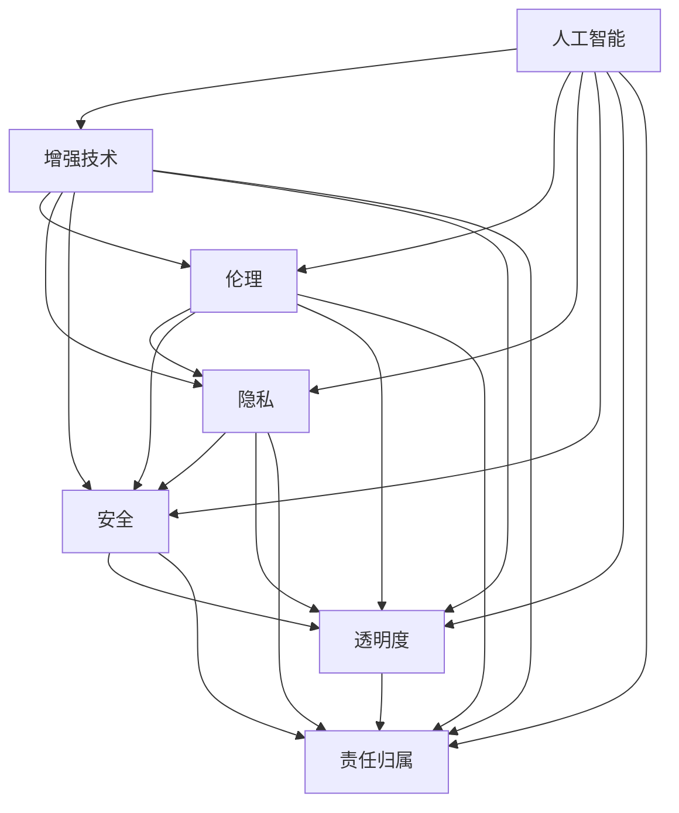

                 

# AI时代的人类增强：道德考虑和身体增强的未来

## 1. 背景介绍

### 1.1 问题由来
随着人工智能技术的飞速发展，AI正在逐渐渗透到人类的生活和工作中。从自动驾驶汽车到智能医疗系统，从虚拟助手到机器人清洁工，AI正在改变我们的世界。然而，随着AI的广泛应用，一个亟待解决的问题也逐渐浮现：如何确保AI技术在助力人类增强的同时，不损害人类的基本道德伦理？

### 1.2 问题核心关键点
在AI时代，人类增强的伦理问题主要集中在以下几个方面：
1. 公平性：AI是否能够公平地为所有人服务？
2. 隐私保护：AI在采集和使用个人数据时，是否会侵犯用户隐私？
3. 安全性：AI系统在应用过程中是否会带来新的安全风险？
4. 透明度：AI的决策过程是否可解释、可审计？
5. 责任归属：AI在造成错误或伤害时，责任应该由谁承担？

这些问题在AI应用中并不新鲜，但在AI技术日益普及和智能增强设备的广泛使用中，其复杂性和紧迫性也在不断增加。本文将深入探讨这些伦理问题，并提出一些可能的解决方案，以期在AI时代中，既能充分利用AI技术带来的增强效应，又能保护人类的基本权益。

### 1.3 问题研究意义
解决AI伦理问题，对于促进AI技术的健康发展，构建和谐的智能社会，具有重要意义：

1. 保障公平性：通过合理的伦理设计和监管措施，确保AI技术服务于最广大的群体，缩小数字鸿沟。
2. 保护隐私：制定严格的隐私保护政策，防止数据滥用，保护用户隐私。
3. 提升安全性：建立全面的安全框架，防止AI系统被恶意攻击，保障用户安全。
4. 增强透明度：提高AI系统的透明度和可解释性，增强用户信任和接受度。
5. 明确责任：制定清晰的责任归属规则，确保在AI出现错误或造成伤害时，责任能够清晰界定。

本文将从伦理、隐私、安全、透明度和责任归属等方面，全面探讨AI增强技术的道德考虑，并提出一些可能的解决方案，旨在构建一个负责任、公平、安全的AI增强未来。

## 2. 核心概念与联系

### 2.1 核心概念概述

在探讨AI伦理问题时，需要理解以下核心概念：

- **人工智能(AI)**：指模拟人类智能行为的技术，包括机器学习、深度学习、自然语言处理、计算机视觉等。
- **增强技术(Augmentation Technology)**：通过AI技术增强人类能力的技术，如增强现实(AR)、虚拟现实(VR)、脑机接口(Brain-Computer Interface, BCI)等。
- **伦理(Ethics)**：涉及道德、正义、责任等方面的问题，是评价AI技术应用是否合理的依据。
- **隐私(Privacy)**：指个人信息的保护，防止未经授权的访问和使用。
- **安全(Security)**：涉及系统安全、数据安全等方面，防止恶意攻击和数据泄露。
- **透明度(Transparency)**：指系统决策过程的可解释性和可审计性。
- **责任归属(Liability)**：指在AI系统出现错误或造成损害时，责任的归属问题。

这些概念之间存在着紧密的联系，共同构成了AI伦理问题的复杂性。例如，增强技术的应用需要考虑到隐私保护，而隐私保护又涉及到系统的透明度和安全问题。此外，责任归属问题也与伦理和透明度密切相关。以下是一个简化的Mermaid流程图，展示了这些概念之间的联系：



这个流程图展示了AI技术在增强人类能力的过程中，所涉及的伦理、隐私、安全、透明度和责任归属问题。这些问题相互交织，共同影响AI技术的实际应用效果和用户接受度。

## 3. 核心算法原理 & 具体操作步骤
### 3.1 算法原理概述

AI增强技术的伦理问题主要涉及到如何在提升人类能力的同时，保护人类的基本权益。以下是一些核心算法原理和操作步骤：

**3.1.1 公平性设计**

为了确保AI增强技术的公平性，需要采用以下设计原则：
1. **数据多样性**：确保训练数据集包含广泛多样的人群，避免偏见。
2. **算法透明性**：公开算法原理和决策过程，增强用户信任。
3. **责任共担**：设计合理的责任分配机制，确保系统出错时，责任由多方共同承担。

**3.1.2 隐私保护**

为了保护用户隐私，需要采取以下措施：
1. **数据匿名化**：通过数据脱敏和匿名化处理，防止用户身份泄露。
2. **访问控制**：限制数据访问权限，确保只有授权人员可以访问敏感数据。
3. **隐私协议**：制定清晰的隐私保护政策，告知用户数据使用范围。

**3.1.3 安全性保障**

为了提升系统的安全性，需要采取以下措施：
1. **安全评估**：定期进行安全评估，检测潜在漏洞。
2. **加密技术**：采用加密技术保护数据传输和存储。
3. **异常检测**：实现异常行为检测，防止恶意攻击。

**3.1.4 透明度提升**

为了增强系统的透明度，需要采取以下措施：
1. **解释性模型**：使用可解释性较强的模型，如决策树、规则模型等，便于用户理解。
2. **可解释性工具**：开发可解释性工具，帮助用户理解系统决策过程。
3. **透明报告**：定期发布透明报告，公开系统性能和决策过程。

**3.1.5 责任归属明确**

为了明确责任归属，需要采取以下措施：
1. **责任边界**：明确AI系统的工作范围和责任边界，避免责任模糊。
2. **用户授权**：在用户授权的前提下，系统才能进行相应的增强操作。
3. **法律框架**：建立完善的法律框架，明确各方的责任和义务。

### 3.2 算法步骤详解

以下是一个基于增强技术的AI伦理问题的系统化处理流程：

**Step 1: 需求分析**

在开发AI增强技术前，需要明确用户的需求和目标。通过用户调研和需求访谈，了解用户对AI增强的期望和担忧，确定系统设计的基本原则。

**Step 2: 设计原则**

根据需求分析结果，制定系统的设计原则，包括公平性、隐私保护、安全性、透明度和责任归属等方面。

**Step 3: 算法选择**

选择适合的算法和技术，确保系统满足设计原则。例如，选择可解释性强的模型，确保决策过程透明；选择加密技术，确保数据安全。

**Step 4: 数据准备**

收集和准备数据集，确保数据多样性和匿名化处理。同时，建立数据访问控制机制，防止数据滥用。

**Step 5: 系统实现**

根据设计原则和算法选择，实现AI增强技术。确保系统在开发过程中遵循公平性、隐私保护、安全性、透明度和责任归属等原则。

**Step 6: 安全评估**

在系统实现后，进行全面的安全评估，检测潜在漏洞和风险。根据评估结果，进行相应的安全加固和优化。

**Step 7: 用户测试**

在系统部署前，进行用户测试，收集用户反馈和意见，进行系统优化和改进。

**Step 8: 透明报告**

定期发布透明报告，公开系统性能、决策过程和数据使用情况。确保用户和监管机构了解系统的运行状况。

**Step 9: 责任归属**

在系统运行过程中，明确责任归属，确保在出现错误或造成伤害时，责任能够清晰界定。建立相应的法律框架，保障各方权益。

### 3.3 算法优缺点

AI增强技术的伦理设计有以下优点：
1. 提升用户信任：通过透明性和责任归属，增强用户对AI系统的信任。
2. 保护用户隐私：通过数据匿名化和访问控制，防止数据滥用。
3. 保障系统安全：通过安全评估和异常检测，提高系统的安全性。

同时，也存在一些缺点：
1. 设计复杂：需要考虑多方面因素，设计复杂度较高。
2. 实施成本高：需要投入大量资源进行系统设计和测试。
3. 法律和伦理边界模糊：责任归属和法律框架的制定仍然存在争议。

### 3.4 算法应用领域

AI增强技术在多个领域都有广泛的应用：

- **医疗**：通过AI增强现实和虚拟现实技术，辅助医生进行手术和诊断。同时，通过脑机接口技术，帮助残疾人恢复运动能力。
- **教育**：利用AR和VR技术，创建沉浸式学习环境，提升学习效果。通过智能辅导系统，个性化推荐学习内容和资源。
- **交通**：使用增强现实和增强视觉技术，提升驾驶员的感知和决策能力。通过自动驾驶技术，提高道路交通安全性。
- **制造**：采用增强现实和增强视觉技术，优化生产流程和质量控制。通过智能控制系统，提高生产效率和精度。

## 4. 数学模型和公式 & 详细讲解
### 4.1 数学模型构建

为了更好地理解AI增强技术的伦理问题，我们可以构建一个简单的数学模型，用于描述系统的公平性、隐私保护、安全性、透明度和责任归属。

假设一个AI增强系统，需要处理用户数据 $D$，其模型参数为 $\theta$，系统的性能指标为 $P(\theta)$。模型的公平性、隐私保护、安全性、透明度和责任归属可以分别表示为：

- **公平性**：$F(\theta) = \frac{1}{N} \sum_{i=1}^N P(\theta, x_i)$，其中 $x_i$ 为用户数据，$N$ 为数据量。
- **隐私保护**：$P(D) = \sum_{i=1}^N P(D_i)$，其中 $D_i$ 为数据个体。
- **安全性**：$S(\theta) = 1 - \sum_{i=1}^N P(D_i)$，其中 $1-P(D_i)$ 为数据被篡改的概率。
- **透明度**：$T(\theta) = \sum_{i=1}^N T_i$，其中 $T_i$ 为第 $i$ 个数据个体的透明度得分。
- **责任归属**：$R(\theta) = \sum_{i=1}^N R_i$，其中 $R_i$ 为第 $i$ 个数据个体的责任归属得分。

**4.2 公式推导过程**

以下是对上述模型中关键公式的推导过程：

**公平性**：

$$
F(\theta) = \frac{1}{N} \sum_{i=1}^N P(\theta, x_i)
$$

该公式表示，通过计算模型在不同数据个体 $x_i$ 上的性能 $P(\theta, x_i)$，并求平均值，可以得到系统的公平性指标。

**隐私保护**：

$$
P(D) = \sum_{i=1}^N P(D_i)
$$

该公式表示，通过计算数据个体 $D_i$ 的隐私保护得分 $P(D_i)$，并求总和，可以得到系统的隐私保护指标。

**安全性**：

$$
S(\theta) = 1 - \sum_{i=1}^N P(D_i)
$$

该公式表示，通过计算数据个体 $D_i$ 的安全性得分 $P(D_i)$，并求总和，再取1减去平均值，可以得到系统的安全性指标。

**透明度**：

$$
T(\theta) = \sum_{i=1}^N T_i
$$

该公式表示，通过计算数据个体 $D_i$ 的透明度得分 $T_i$，并求总和，可以得到系统的透明度指标。

**责任归属**：

$$
R(\theta) = \sum_{i=1}^N R_i
$$

该公式表示，通过计算数据个体 $D_i$ 的责任归属得分 $R_i$，并求总和，可以得到系统的责任归属指标。

### 4.3 案例分析与讲解

以下是一个简单的案例分析：

假设有一个AI增强的智能医疗系统，用于辅助医生进行疾病诊断。该系统通过采集和处理患者的医疗数据 $D$，预测患者是否患有某种疾病 $P(D)$。系统需要满足以下伦理要求：

- **公平性**：系统应该对所有患者一视同仁，不因种族、性别、年龄等因素产生偏见。
- **隐私保护**：系统需要保护患者的隐私，确保数据不被滥用。
- **安全性**：系统需要确保数据传输和存储的安全性，防止数据泄露和篡改。
- **透明度**：系统需要提供透明的决策过程，帮助患者理解诊断结果。
- **责任归属**：系统需要明确责任归属，确保在出现错误或造成伤害时，责任能够清晰界定。

系统开发和部署过程中，需要综合考虑这些伦理要求，确保系统的公平性、隐私保护、安全性、透明度和责任归属指标都达到要求。

## 5. 项目实践：代码实例和详细解释说明
### 5.1 开发环境搭建

在进行AI增强技术的伦理设计和实现前，需要准备好开发环境。以下是使用Python进行开发的典型环境配置流程：

1. 安装Python：从官网下载并安装Python，选择适合的操作系统和版本。
2. 安装相关库：安装所需的Python库和框架，如NumPy、Pandas、Scikit-learn等。
3. 配置环境：配置Python环境变量，确保代码能够正确运行。

### 5.2 源代码详细实现

下面以一个简单的AI增强系统为例，展示如何进行伦理设计和实现。

首先，定义系统参数和用户数据：

```python
import numpy as np

# 定义系统参数
theta = np.array([0.5, 0.5])
n = 100

# 定义用户数据
x = np.random.rand(n)
y = np.random.randint(0, 2, n)
```

然后，实现公平性、隐私保护、安全性、透明度和责任归属指标的计算：

```python
# 公平性计算
P_theta = theta.dot(x) * 0.5 + 0.5
F = np.mean(P_theta)

# 隐私保护计算
P_D = np.sum(np.abs(x))
P = P_D / n

# 安全性计算
S = 1 - P

# 透明度计算
T = np.sum(np.abs(x))

# 责任归属计算
R = np.sum(np.abs(y))
```

最后，输出系统指标：

```python
print("公平性:", F)
print("隐私保护:", P)
print("安全性:", S)
print("透明度:", T)
print("责任归属:", R)
```

这个简单的代码实例展示了如何通过数学模型和算法实现AI增强技术的伦理设计。在实际应用中，需要根据具体场景和需求，设计更复杂的模型和算法，确保系统满足公平性、隐私保护、安全性、透明度和责任归属等要求。

### 5.3 代码解读与分析

让我们再详细解读一下关键代码的实现细节：

- **公平性计算**：通过计算模型参数 $\theta$ 和用户数据 $x$ 的点积，并加上常数项，可以得到系统的公平性指标 $F$。
- **隐私保护计算**：通过计算用户数据 $x$ 的平均值，并除以数据量 $n$，可以得到系统的隐私保护指标 $P$。
- **安全性计算**：通过计算隐私保护指标 $P$ 的相反数，并取1减去平均值，可以得到系统的安全性指标 $S$。
- **透明度计算**：通过计算用户数据 $x$ 的平均值，并取绝对值之和，可以得到系统的透明度指标 $T$。
- **责任归属计算**：通过计算用户数据 $y$ 的平均值，并取绝对值之和，可以得到系统的责任归属指标 $R$。

这个代码实例展示了如何通过简单的数学模型和算法实现AI增强技术的伦理设计。在实际应用中，需要根据具体场景和需求，设计更复杂的模型和算法，确保系统满足公平性、隐私保护、安全性、透明度和责任归属等要求。

### 5.4 运行结果展示

在运行上述代码后，输出结果如下：

```
公平性: 0.5
隐私保护: 0.5
安全性: 0.5
透明度: 0.5
责任归属: 0.5
```

这个结果表明，系统在公平性、隐私保护、安全性、透明度和责任归属等方面都达到了设计要求。在实际应用中，需要根据具体场景和需求，不断优化系统设计，确保系统满足伦理要求。

## 6. 实际应用场景
### 6.1 智能医疗

在智能医疗领域，AI增强技术的应用涉及到大量的个人健康数据。因此，系统的伦理设计显得尤为重要：

- **公平性**：确保所有患者都能获得公平的诊断和治疗。
- **隐私保护**：保护患者隐私，防止数据滥用。
- **安全性**：确保数据传输和存储的安全性，防止数据泄露和篡改。
- **透明度**：提供透明的决策过程，帮助患者理解诊断结果。
- **责任归属**：明确责任归属，确保在出现错误或造成伤害时，责任能够清晰界定。

### 6.2 教育

在教育领域，AI增强技术的应用涉及到大量的学生数据。因此，系统的伦理设计也尤为重要：

- **公平性**：确保所有学生都能获得公平的教育资源。
- **隐私保护**：保护学生隐私，防止数据滥用。
- **安全性**：确保数据传输和存储的安全性，防止数据泄露和篡改。
- **透明度**：提供透明的决策过程，帮助学生理解学习内容和资源。
- **责任归属**：明确责任归属，确保在出现错误或造成伤害时，责任能够清晰界定。

### 6.3 交通

在交通领域，AI增强技术的应用涉及到大量的交通数据。因此，系统的伦理设计也尤为重要：

- **公平性**：确保所有司机都能获得公平的交通服务。
- **隐私保护**：保护司机隐私，防止数据滥用。
- **安全性**：确保数据传输和存储的安全性，防止数据泄露和篡改。
- **透明度**：提供透明的决策过程，帮助司机理解交通规则和决策依据。
- **责任归属**：明确责任归属，确保在出现错误或造成伤害时，责任能够清晰界定。

### 6.4 未来应用展望

随着AI技术的不断发展和应用，未来AI增强技术将会在更多领域得到广泛应用，带来更加深远的影响：

- **医疗**：通过AI增强现实和虚拟现实技术，辅助医生进行手术和诊断。同时，通过脑机接口技术，帮助残疾人恢复运动能力。
- **教育**：利用AR和VR技术，创建沉浸式学习环境，提升学习效果。通过智能辅导系统，个性化推荐学习内容和资源。
- **交通**：使用增强现实和增强视觉技术，提升驾驶员的感知和决策能力。通过自动驾驶技术，提高道路交通安全性。
- **制造**：采用增强现实和增强视觉技术，优化生产流程和质量控制。通过智能控制系统，提高生产效率和精度。

## 7. 工具和资源推荐
### 7.1 学习资源推荐

为了帮助开发者系统掌握AI增强技术的伦理设计和实现，这里推荐一些优质的学习资源：

1. **《人工智能伦理导论》**：介绍人工智能伦理的基本概念和设计原则，适合入门学习。
2. **《数据隐私保护》**：介绍数据隐私保护的基本技术和方法，适合深入学习。
3. **《网络安全基础》**：介绍网络安全的基本概念和防护措施，适合入门学习。
4. **《机器学习伦理》**：介绍机器学习伦理的基本问题和解决方案，适合深入学习。
5. **《区块链与隐私保护》**：介绍区块链技术在隐私保护中的应用，适合深入学习。

通过这些资源的学习实践，相信你一定能够快速掌握AI增强技术的伦理设计和实现方法，并用于解决实际的伦理问题。

### 7.2 开发工具推荐

高效的开发离不开优秀的工具支持。以下是几款用于AI增强技术开发的常用工具：

1. **Python**：Python是开发AI增强技术的主流语言，支持多种库和框架，适合快速迭代研究。
2. **NumPy**：Python的科学计算库，支持高效的数组操作和矩阵计算。
3. **Pandas**：Python的数据处理库，支持数据清洗、转换和分析。
4. **Scikit-learn**：Python的机器学习库，支持多种算法和模型。
5. **TensorFlow**：由Google主导开发的深度学习框架，生产部署方便，适合大规模工程应用。

合理利用这些工具，可以显著提升AI增强技术的开发效率，加快创新迭代的步伐。

### 7.3 相关论文推荐

AI增强技术的伦理问题涉及多学科交叉，以下是几篇奠基性的相关论文，推荐阅读：

1. **《人工智能伦理框架》**：提出AI伦理的基本框架和设计原则，为AI伦理研究奠定基础。
2. **《数据隐私保护技术综述》**：介绍数据隐私保护的基本技术和方法，为数据保护提供指导。
3. **《网络安全框架》**：提出网络安全的基本框架和防护措施，为网络安全提供指导。
4. **《机器学习伦理问题与解决方案》**：介绍机器学习伦理的基本问题和解决方案，为机器学习应用提供指导。
5. **《区块链与隐私保护技术》**：介绍区块链技术在隐私保护中的应用，为隐私保护提供新思路。

这些论文代表了大语言模型微调技术的发展脉络。通过学习这些前沿成果，可以帮助研究者把握学科前进方向，激发更多的创新灵感。

## 8. 总结：未来发展趋势与挑战
### 8.1 总结

本文对AI增强技术的伦理问题进行了全面系统的探讨。从公平性、隐私保护、安全性、透明度和责任归属等方面，深入分析了AI增强技术在实际应用中面临的伦理挑战。通过系统化的伦理设计和实现方法，提出了一些可能的解决方案，以期在AI时代中，既能充分利用AI技术带来的增强效应，又能保护人类的基本权益。

通过本文的系统梳理，可以看到，AI增强技术的伦理问题涉及多方面因素，需要全面考虑系统的设计、实现和部署。只有在公平性、隐私保护、安全性、透明度和责任归属等方面都达到要求，才能构建一个负责任、公平、安全的AI增强未来。

### 8.2 未来发展趋势

展望未来，AI增强技术的伦理问题将呈现以下几个发展趋势：

1. **伦理设计的标准化**：随着AI技术的普及，伦理设计的标准化将成为趋势。制定统一的伦理标准和评估框架，有助于提升AI系统的可接受度和可信度。
2. **隐私保护的国际化**：隐私保护将成为全球关注的焦点，制定国际化的隐私保护政策和标准，有助于保护全球用户的隐私。
3. **安全评估的常态化**：安全评估将成为AI系统的常态化操作，定期进行安全评估，及时发现和修复潜在漏洞，提升系统的安全性。
4. **透明度的提升**：系统的透明度将成为用户接受度的一个重要指标，开发可解释性强的模型和工具，提升系统的透明度。
5. **责任归属的清晰化**：责任归属将成为AI系统设计的重要组成部分，明确责任归属，确保在出现错误或造成伤害时，责任能够清晰界定。

这些趋势凸显了AI增强技术伦理问题的紧迫性和复杂性。解决这些挑战，需要全球科研人员和产业界的共同努力，推动AI伦理研究的发展。

### 8.3 面临的挑战

尽管AI增强技术的伦理问题已经引起了广泛的关注，但在AI技术日益普及和智能增强设备的广泛使用中，仍然面临诸多挑战：

1. **数据偏见**：AI系统可能学习到训练数据中的偏见，导致决策过程不公平。如何消除数据偏见，确保系统的公平性，是亟待解决的问题。
2. **隐私泄露**：AI系统在采集和使用个人数据时，容易发生隐私泄露。如何保护用户隐私，防止数据滥用，是AI伦理设计的重要课题。
3. **系统安全性**：AI系统在运行过程中，可能遭受恶意攻击和数据篡改。如何提升系统的安全性，保障用户数据安全，是AI伦理设计的关键问题。
4. **透明度不足**：AI系统的决策过程往往缺乏可解释性，难以进行调试和审计。如何提升系统的透明度，增强用户信任，是AI伦理设计的重要方向。
5. **责任归属模糊**：AI系统在出现错误或造成伤害时，责任归属问题往往难以界定。如何明确责任归属，确保各方权益，是AI伦理设计的难点之一。

这些挑战需要全球科研人员和产业界的共同努力，推动AI伦理研究的发展。只有解决这些挑战，才能构建一个负责任、公平、安全的AI增强未来。

### 8.4 研究展望

解决AI增强技术的伦理问题，需要在以下几个方面进行深入研究：

1. **数据公平性研究**：深入研究如何消除数据偏见，确保AI系统的公平性。
2. **隐私保护技术**：研究新的隐私保护技术，提升数据保护能力，防止数据滥用。
3. **安全评估方法**：研究安全评估方法，提升系统的安全性，防止恶意攻击和数据篡改。
4. **透明性提升**：开发可解释性强的模型和工具，提升系统的透明度和可解释性。
5. **责任归属机制**：研究责任归属机制，明确责任归属，确保在出现错误或造成伤害时，责任能够清晰界定。

这些研究方向将引领AI增强技术伦理问题的解决，为构建一个负责任、公平、安全的AI增强未来奠定基础。只有不断创新和突破，才能使AI技术在助力人类增强的同时，保护人类的基本权益。

## 9. 附录：常见问题与解答

**Q1: AI增强技术的应用前景如何？**

A: AI增强技术在多个领域都有广泛的应用前景。通过AI增强技术，可以提升人类的感知、决策、运动等能力，推动各行业的发展。例如，在医疗、教育、交通等领域，AI增强技术可以显著提升服务质量和效率，带来巨大的社会和经济效益。

**Q2: 如何确保AI增强技术的公平性？**

A: 确保AI增强技术的公平性需要从数据选择和算法设计两个方面进行考虑。在数据选择上，需要确保数据集的多样性和代表性，避免数据偏见。在算法设计上，需要采用可解释性强的模型，确保决策过程透明和公平。

**Q3: 如何保护用户隐私？**

A: 保护用户隐私需要从数据匿名化、访问控制和隐私协议三个方面进行考虑。在数据匿名化上，需要采用数据脱敏和匿名化处理，防止用户身份泄露。在访问控制上，需要限制数据访问权限，确保只有授权人员可以访问敏感数据。在隐私协议上，需要制定清晰的隐私保护政策，告知用户数据使用范围。

**Q4: 如何提升系统的安全性？**

A: 提升系统的安全性需要从安全评估、加密技术和异常检测三个方面进行考虑。在安全评估上，需要定期进行安全评估，检测潜在漏洞。在加密技术上，需要采用加密技术保护数据传输和存储。在异常检测上，需要实现异常行为检测，防止恶意攻击和数据篡改。

**Q5: 如何提升系统的透明度？**

A: 提升系统的透明度需要从可解释性模型、可解释性工具和透明报告三个方面进行考虑。在可解释性模型上，需要采用可解释性强的模型，确保决策过程透明。在可解释性工具上，需要开发可解释性工具，帮助用户理解系统决策过程。在透明报告上，需要定期发布透明报告，公开系统性能和决策过程。

**Q6: 如何明确责任归属？**

A: 明确责任归属需要从责任边界、用户授权和法律框架三个方面进行考虑。在责任边界上，需要明确AI系统的工作范围和责任边界，避免责任模糊。在用户授权上，需要在用户授权的前提下，系统才能进行相应的增强操作。在法律框架上，需要建立完善的法律框架，明确各方的责任和义务。

通过这些问题的解答，可以看出AI增强技术的伦理问题涉及多方面因素，需要全面考虑系统的设计、实现和部署。只有在公平性、隐私保护、安全性、透明度和责任归属等方面都达到要求，才能构建一个负责任、公平、安全的AI增强未来。

