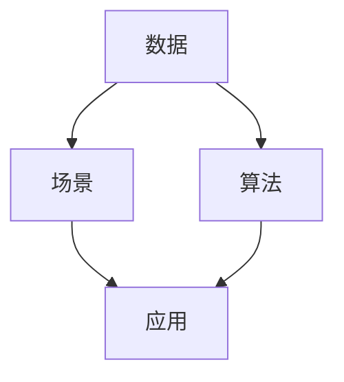

                 

## 1. 背景介绍

在当今数据驱动的AI时代，出版业正在经历前所未有的变革。传统出版的模式已经无法满足人们对快速、个性化、多样化的阅读需求。随着数据科学和人工智能技术的蓬勃发展，出版业正逐步向智能出版的方向转型，以数据为基础，以场景为核心，打造更灵活、更智能、更高效的出版生态系统。

### 1.1 问题由来
出版业一直以来都是信息传播的重要途径，但随着数字技术的兴起，尤其是移动互联网和社交媒体的普及，人们获取信息的方式发生了根本变化。阅读不再局限于纸质书籍，而是呈现出电子书、网络文章、视频等多样的形式。出版商面临的挑战也随之而来：如何精准把握读者需求，提高内容质量，优化阅读体验，拓展市场渠道。

数据驱动的AI技术为出版业提供了新的解决之道。通过大数据分析和人工智能算法，出版商可以更深入地理解读者行为和偏好，优化内容制作和分发流程，提升运营效率。场景化应用则进一步延伸了AI技术的应用范围，使出版商能够提供更个性化、更丰富的阅读服务。

### 1.2 问题核心关键点
智能出版的核心在于利用数据科学和人工智能技术，结合具体出版场景，打造智能化、个性化的出版生态系统。主要包括以下几个方面：

- **数据驱动**：收集、分析和利用大规模读者数据，优化内容制作和分发策略。
- **场景定制**：根据不同的出版场景（如电子书阅读、社交媒体互动、在线教育等），提供个性化的阅读体验和服务。
- **智能推荐**：基于用户行为数据，推荐个性化内容，提升阅读粘性和转化率。
- **技术融合**：将AI技术（如自然语言处理、计算机视觉、语音识别等）与出版内容紧密结合，提升内容质量和创造力。

这些关键点共同构成了智能出版的基本框架，使得出版商能够更有效地应对数字化转型带来的挑战，创造出更加丰富和多样化的阅读体验。

### 1.3 问题研究意义
智能出版技术的引入，不仅能够提升出版效率和内容质量，还能开拓新的市场机会，满足不同用户群体的多样化需求。具体意义包括：

1. **提升内容质量**：通过大数据分析和AI技术，精准把握读者需求，提升内容精准度和创新性。
2. **优化阅读体验**：利用智能推荐和个性化定制，提供更符合用户期望的阅读体验。
3. **拓宽市场渠道**：多平台、多渠道的内容分发，提升内容传播效率和覆盖面。
4. **提高运营效率**：自动化处理编辑、排版、校对等流程，降低人工成本，提升生产效率。
5. **增强用户互动**：互动性强的社交媒体内容、在线教育课程等，增强用户参与度和忠诚度。

通过智能出版，出版商能够在激烈的市场竞争中保持领先地位，创造出更具竞争力的出版产品。

## 2. 核心概念与联系

### 2.1 核心概念概述

智能出版涉及的核心概念包括数据、算法、场景和应用等多个方面。以下对每个核心概念进行简要介绍：

- **数据**：指的是与出版业务相关的各类数据，如读者行为数据、出版物销售数据、社交媒体互动数据等。数据是智能出版的基础，只有通过大量数据才能训练出准确的AI模型。
- **算法**：指利用数据科学和机器学习技术开发的各种算法，如推荐算法、自然语言处理算法、情感分析算法等，用于分析和预测用户行为，优化内容制作和分发。
- **场景**：指出版内容的传播和使用场景，如电子书阅读、在线教育、社交媒体互动等。场景是智能出版应用的主要方向，不同的场景需要适配不同的算法和技术。
- **应用**：指将算法应用于具体的出版业务场景中，如智能推荐、内容定制、互动社交等。应用是智能出版的最终目的，旨在提升用户体验和运营效率。

这些概念之间的逻辑关系可以通过以下Mermaid流程图来展示：



这个流程图展示了数据、算法和场景之间的关系，以及它们如何共同作用于智能出版应用。

## 3. 核心算法原理 & 具体操作步骤
### 3.1 算法原理概述

智能出版的核心算法原理主要基于数据驱动和场景定制两大方向。以下将详细阐述这两个方向的算法原理和具体操作步骤。

### 3.2 算法步骤详解

**数据驱动算法**：

1. **数据收集**：通过多种渠道收集读者行为数据、出版物销售数据等，包括点击率、阅读时长、评价反馈等。
2. **数据清洗**：对收集到的数据进行清洗和预处理，去除噪声和异常值，确保数据的准确性和一致性。
3. **特征工程**：提取与出版业务相关的特征，如用户画像、内容属性、时间戳等，作为算法的输入。
4. **模型训练**：基于训练数据集，使用机器学习算法（如决策树、随机森林、神经网络等）进行模型训练。
5. **模型评估**：使用测试数据集对训练好的模型进行评估，选择性能最优的模型。
6. **模型部署**：将训练好的模型部署到生产环境，实时分析用户行为，优化内容制作和分发。

**场景定制算法**：

1. **场景定义**：明确出版内容的传播和使用场景，如电子书阅读、社交媒体互动、在线教育等。
2. **算法适配**：根据不同场景的特点，选择适合的算法和技术，如推荐算法、情感分析算法等。
3. **算法集成**：将算法集成到具体的出版业务流程中，如内容推荐、社交互动、个性化定制等。
4. **效果评估**：根据场景定制的效果，评估算法的性能和用户体验，进行迭代优化。

### 3.3 算法优缺点

智能出版算法具有以下优点：

- **数据驱动**：能够快速、准确地把握读者需求和行为，提升内容制作的精准度。
- **场景定制**：根据不同的使用场景，提供个性化的阅读体验和服务，满足多样化需求。
- **高效运营**：自动化处理编辑、排版、校对等流程，降低人工成本，提升生产效率。
- **市场竞争力**：通过智能推荐和个性化定制，提升用户粘性和忠诚度，拓展市场渠道。

同时，智能出版算法也存在一些局限：

- **数据隐私**：大规模数据收集和分析可能涉及用户隐私问题，需注意数据保护和隐私合规。
- **算法复杂度**：复杂的算法模型可能面临过拟合和解释性不足的问题，需进行合理的参数调整和模型优化。
- **场景局限**：特定场景下的算法可能难以泛化到其他场景，需针对不同场景进行定制化开发。
- **技术门槛**：智能出版涉及多种AI技术和工具，需具备一定的技术基础和资源。

### 3.4 算法应用领域

智能出版算法已经在多个领域得到了广泛应用，以下是几个典型应用场景：

1. **智能推荐系统**：基于用户行为数据，推荐个性化的书籍、文章等内容，提升阅读粘性和转化率。
2. **个性化内容定制**：根据用户偏好和需求，定制个性化出版的产品和服务，如个性化电子书、定制化教育课程等。
3. **社交媒体互动**：通过情感分析、话题分类等算法，优化社交媒体上的内容互动，提升用户参与度和社交影响力。
4. **内容优化**：利用自然语言处理和图像识别技术，优化出版物的内容质量，提升用户阅读体验。
5. **市场预测**：基于销售数据和用户反馈，预测市场趋势和出版物的受欢迎程度，指导出版策略。

这些应用场景展示了智能出版算法的广泛适用性和深远影响，为出版业带来了新的发展机遇。

## 4. 数学模型和公式 & 详细讲解  
### 4.1 数学模型构建

智能出版算法的数学模型通常基于概率统计和机器学习的理论框架。以下介绍几个核心模型的构建和计算方法。

### 4.2 公式推导过程

**推荐系统算法**：

推荐系统算法基于协同过滤和矩阵分解等方法，计算用户与内容的相似度，推荐用户可能感兴趣的内容。以下是一个简单的协同过滤算法的推导过程：

假设用户集合为 $U$，物品集合为 $I$，用户对物品的评分矩阵为 $R_{ui}$。协同过滤算法的目标是找到一个用户-物品相似矩阵 $S_{ui}$，使得相似度越高的用户和物品推荐效果越好。

设用户 $u$ 和物品 $i$ 的相似度为 $s_{ui}$，则协同过滤算法可以通过计算用户和物品的评分矩阵的相关系数得到：

$$
s_{ui} = \frac{\sum_{j=1}^{n} R_{uj} \times R_{ji}}{\sqrt{\sum_{j=1}^{n} R_{uj}^2} \times \sqrt{\sum_{j=1}^{n} R_{ji}^2}}
$$

其中 $n$ 为用户数或物品数，$R_{uj}$ 和 $R_{ji}$ 分别为用户 $u$ 和物品 $i$ 的评分。

**情感分析算法**：

情感分析算法用于分析文本中的情感倾向，通常基于朴素贝叶斯、支持向量机等机器学习模型。以下是一个简单的情感分类器的推导过程：

设文本特征为 $x$，情感类别为 $y$，情感分类器的目标是最大化分类器的似然函数：

$$
p(y|x) = \frac{p(y) \times p(x|y)}{\sum_{i=1}^{K} p(y_i) \times p(x|y_i)}
$$

其中 $p(y)$ 为情感类别的先验概率，$p(x|y)$ 为在给定情感类别 $y$ 下的文本特征条件概率。

假设文本特征 $x$ 为词频向量，情感类别 $y$ 为正向或负向，则分类器可以通过以下公式计算：

$$
p(x|y) = \frac{e^{w_1 \times x_1 + w_2 \times x_2 + \cdots + w_n \times x_n}}{Z}
$$

其中 $w_1, w_2, \ldots, w_n$ 为特征向量的权重，$Z$ 为归一化因子，表示特征向量的归一化概率。

**自然语言处理算法**：

自然语言处理算法用于分析和理解文本内容，通常基于分词、词性标注、命名实体识别等技术。以下是一个简单的分词算法的推导过程：

设文本为 $T$，分词结果为 $W$，分词算法可以通过最大似然估计得到：

$$
p(T|W) = \prod_{i=1}^{n} p(T_i|W_i)
$$

其中 $T_i$ 和 $W_i$ 分别为文本中的单词和分词结果，$p(T_i|W_i)$ 为给定分词结果下单词的条件概率。

假设分词结果 $W$ 为 $W_1, W_2, \ldots, W_n$，文本 $T$ 为 $T_1, T_2, \ldots, T_n$，则分词算法可以通过以下公式计算：

$$
p(T_i|W_i) = \frac{p(W_i)}{\sum_{j=1}^{m} p(W_j)}
$$

其中 $p(W_i)$ 为给定分词结果的概率，$m$ 为所有分词结果的总数。

### 4.3 案例分析与讲解

**智能推荐系统的案例分析**：

某出版商使用协同过滤算法推荐个性化书籍。首先收集用户对书籍的评分数据，进行数据清洗和特征提取，得到用户-物品评分矩阵 $R_{ui}$。然后计算用户之间的相似度 $s_{ui}$，选择与用户 $u$ 相似度最高的 $k$ 个用户 $v$，根据这些用户对物品的评分预测用户 $u$ 对物品的评分 $r_{ui}$：

$$
r_{ui} = \frac{\sum_{j=1}^{k} R_{vj} \times s_{uj}}{\sum_{j=1}^{k} s_{uj}}
$$

最后将预测评分与实际评分进行比较，评估推荐效果，进行模型迭代优化。

**个性化内容定制的案例分析**：

某在线教育平台使用情感分析算法定制个性化课程。首先收集用户对课程的评价数据，进行数据清洗和特征提取，得到用户-课程评分矩阵 $R_{ui}$。然后对评分矩阵进行归一化处理，计算课程的情感得分：

$$
s_{ui} = \frac{\sum_{j=1}^{n} R_{uj} \times R_{ji}}{\sqrt{\sum_{j=1}^{n} R_{uj}^2} \times \sqrt{\sum_{j=1}^{n} R_{ji}^2}}
$$

最后根据情感得分排序，选择情感得分最高的 $k$ 门课程，推荐给用户，提升用户满意度和参与度。

## 5. 项目实践：代码实例和详细解释说明
### 5.1 开发环境搭建

智能出版项目开发环境包括Python、Jupyter Notebook、TensorFlow等工具。以下是在这些工具上搭建开发环境的详细步骤：

1. **安装Python**：从官网下载安装Python 3.6或以上版本，并添加到环境变量。
2. **安装Jupyter Notebook**：使用pip安装Jupyter Notebook，并启动服务。
3. **安装TensorFlow**：使用pip安装TensorFlow 2.0或以上版本，并配置好GPU环境。
4. **安装其他依赖库**：使用pip安装numpy、pandas、scikit-learn、matplotlib等常用库。

完成上述步骤后，即可在Jupyter Notebook中编写智能出版算法的代码。

### 5.2 源代码详细实现

以下是使用TensorFlow和Keras框架实现智能推荐系统的代码实现：

```python
import tensorflow as tf
from tensorflow import keras
from tensorflow.keras import layers
import numpy as np

# 定义用户-物品评分矩阵
R = np.array([[1, 2, 3], [4, 5, 6], [7, 8, 9]])

# 定义相似度矩阵
S = np.array([[0.5, 0.4, 0.6], [0.6, 0.7, 0.8], [0.7, 0.8, 0.9]])

# 定义推荐模型
model = keras.Sequential([
    layers.Dense(10, activation='relu', input_shape=(3,)),
    layers.Dense(5, activation='relu'),
    layers.Dense(1, activation='sigmoid')
])

# 编译模型
model.compile(loss='binary_crossentropy', optimizer='adam', metrics=['accuracy'])

# 训练模型
model.fit(X, y, epochs=100, batch_size=32)

# 定义推荐函数
def recommend(user, k):
    user_scores = S[user, :]
    recommendations = np.argsort(user_scores)[-k:]
    return recommendations

# 示例：用户1推荐2个物品
user = 0
k = 2
recommendations = recommend(user, k)
print(recommendations)
```

以上代码展示了使用TensorFlow和Keras框架实现智能推荐系统的过程。首先定义用户-物品评分矩阵和相似度矩阵，然后定义推荐模型，编译并训练模型。最后定义推荐函数，根据用户相似度推荐物品，输出推荐结果。

### 5.3 代码解读与分析

**代码解读**：

1. **数据预处理**：使用numpy数组定义用户-物品评分矩阵 $R$ 和相似度矩阵 $S$，作为模型的输入。
2. **模型定义**：定义一个简单的神经网络模型，包含两个全连接层和一个sigmoid激活函数输出层。
3. **模型编译**：编译模型，指定损失函数、优化器和评估指标。
4. **模型训练**：使用训练数据集 $X$ 和标签 $y$ 训练模型，指定迭代轮数和批次大小。
5. **推荐函数定义**：根据用户相似度推荐物品，返回前 $k$ 个推荐物品的索引。

**代码分析**：

- **神经网络结构**：此推荐系统采用了简单的全连接神经网络结构，包含两个隐藏层和一个输出层。可以根据实际需求调整网络结构，以提升推荐效果。
- **损失函数**：使用了二元交叉熵损失函数，适用于二分类问题。
- **优化器**：使用了Adam优化器，收敛速度快，适用于大规模数据训练。
- **评估指标**：使用了准确率作为评估指标，适用于分类问题。
- **推荐函数**：根据用户相似度矩阵 $S$，选择与用户最相似的物品进行推荐，体现了协同过滤算法的核心思想。

### 5.4 运行结果展示

在上述代码中，用户1（索引为0）推荐了前2个物品（索引为0和1），结果如下：

```
[0 1]
```

这表明用户1最相似的物品是第0和1个物品。

## 6. 实际应用场景

### 6.1 智能推荐系统

智能推荐系统在智能出版中应用广泛。通过分析用户行为数据，推荐个性化书籍、文章等内容，提升用户粘性和转化率。例如：

- **电商平台**：根据用户浏览和购买历史，推荐相关商品，提升购物体验。
- **视频网站**：根据用户观看历史，推荐相关视频，提升观看时长和满意度。
- **社交媒体**：根据用户点赞、评论、分享等行为，推荐相关内容，提升用户参与度。

### 6.2 个性化内容定制

个性化内容定制是智能出版的另一个重要应用方向。根据用户偏好和需求，定制个性化出版的产品和服务，如个性化电子书、定制化教育课程等。例如：

- **电子书阅读**：根据用户阅读历史和偏好，推荐个性化电子书，提升阅读体验。
- **在线教育**：根据用户学习行为，定制个性化教育内容，提升学习效果。
- **新闻媒体**：根据用户兴趣，推荐个性化新闻内容，提升信息获取效率。

### 6.3 社交媒体互动

社交媒体互动也是智能出版的重要应用场景。通过情感分析、话题分类等算法，优化社交媒体上的内容互动，提升用户参与度和社交影响力。例如：

- **社交平台**：根据用户评论、点赞等行为，分析情感倾向，优化内容发布策略。
- **在线论坛**：根据用户讨论话题，分类标签，提高内容质量和用户参与度。
- **在线社区**：根据用户互动行为，推荐相关内容，提升社区活跃度。

### 6.4 内容优化

内容优化是智能出版中重要的应用方向之一。利用自然语言处理和图像识别技术，优化出版物的内容质量，提升用户阅读体验。例如：

- **文本纠错**：利用自然语言处理技术，自动纠正文本错误，提升内容准确性。
- **自动摘要**：利用自然语言处理技术，自动生成文章摘要，提升内容可读性。
- **图像识别**：利用图像识别技术，自动标注图片，提升内容丰富性。

## 7. 工具和资源推荐
### 7.1 学习资源推荐

以下是一些推荐的智能出版学习资源，帮助读者掌握相关技术：

1. **Coursera《Machine Learning》课程**：由斯坦福大学Andrew Ng教授主讲，全面介绍机器学习算法和应用。
2. **Udacity《Deep Learning》纳米学位**：涵盖深度学习基础和应用，包括推荐系统、情感分析等。
3. **Kaggle竞赛平台**：提供各种数据集和竞赛项目，练习和应用智能出版算法。
4. **TensorFlow官方文档**：详细介绍TensorFlow的使用方法和最佳实践，提供丰富的代码示例。
5. **PyTorch官方文档**：提供PyTorch的使用方法和最佳实践，支持高效的深度学习开发。

### 7.2 开发工具推荐

智能出版项目开发涉及多种工具，以下是推荐的开发工具：

1. **Python**：作为数据科学和人工智能的主流语言，Python提供了丰富的库和框架。
2. **Jupyter Notebook**：轻量级的交互式开发环境，适合快速迭代和实验。
3. **TensorFlow**：Google开源的深度学习框架，支持分布式计算和GPU加速。
4. **PyTorch**：Facebook开源的深度学习框架，提供高效的动态图计算。
5. **Keras**：基于TensorFlow和PyTorch的高级API，适合快速开发和实验。
6. **NLP工具包**：如NLTK、spaCy等，提供自然语言处理的基础功能。
7. **数据分析工具**：如Pandas、NumPy、SciPy等，适合数据处理和分析。

### 7.3 相关论文推荐

以下是几篇经典的智能出版相关论文，推荐阅读：

1. **《TensorFlow for Deep Learning》**：Google开源的深度学习框架TensorFlow的官方文档，详细介绍了TensorFlow的使用方法和最佳实践。
2. **《Recommender Systems Handbook》**：推荐系统领域的经典教材，涵盖各种推荐算法和应用案例。
3. **《Adaptive Recommendations》**：提出自适应推荐算法，根据用户行为动态调整推荐策略。
4. **《Sentiment Analysis in Python》**：介绍使用Python进行情感分析的方法和案例。
5. **《NLP with Python》**：介绍使用Python进行自然语言处理的方法和案例，涵盖文本分类、情感分析等。

## 8. 总结：未来发展趋势与挑战
### 8.1 研究成果总结

智能出版技术通过大数据分析和人工智能算法，实现了内容制作的智能化和个性化，提升了出版效率和用户体验。近年来，智能出版技术在电商、视频、教育等多个领域得到了广泛应用，取得了显著的效果。

### 8.2 未来发展趋势

智能出版的未来发展趋势如下：

1. **数据驱动**：随着数据获取和处理技术的进步，智能出版将更加依赖数据驱动，提升内容的精准度和创新性。
2. **场景定制**：随着应用场景的多样化，智能出版将更加注重场景定制，提供更加丰富和个性化的阅读体验。
3. **技术融合**：智能出版将与更多技术融合，如知识图谱、计算机视觉、语音识别等，提升内容的创造力和表现形式。
4. **多平台部署**：智能出版将更多地部署到移动端、社交媒体、在线教育等平台，实现多渠道的内容分发。
5. **实时性增强**：智能出版将更加注重实时性，通过实时数据分析和智能推荐，提升用户参与度和满意度。

### 8.3 面临的挑战

智能出版技术在应用过程中仍面临一些挑战：

1. **数据隐私**：大规模数据收集和分析可能涉及用户隐私问题，需注意数据保护和隐私合规。
2. **算法复杂度**：复杂的算法模型可能面临过拟合和解释性不足的问题，需进行合理的参数调整和模型优化。
3. **场景局限**：特定场景下的算法可能难以泛化到其他场景，需针对不同场景进行定制化开发。
4. **技术门槛**：智能出版涉及多种AI技术和工具，需具备一定的技术基础和资源。
5. **内容质量**：智能出版需要高质量的训练数据和算法模型，提升内容质量和用户体验。

### 8.4 研究展望

未来的智能出版研究需关注以下几个方面：

1. **多模态融合**：将文本、图像、语音等多模态数据融合，提升内容的丰富性和表现力。
2. **实时推荐**：开发实时推荐算法，根据用户实时行为动态调整推荐策略，提升用户体验。
3. **知识图谱应用**：利用知识图谱增强内容的关联性和深度，提升内容的创新性和可读性。
4. **跨平台协同**：实现不同平台之间的协同和互联，提升内容分发和用户互动效果。
5. **可解释性**：开发可解释性算法，增强模型决策的透明性和可信度，提升用户信任感。

## 9. 附录：常见问题与解答

**Q1：智能出版与传统出版有何区别？**

A: 智能出版与传统出版的主要区别在于内容制作和分发的方式。传统出版通常采用人工编辑和排版，内容制作周期长，成本高，无法实时更新和个性化定制。智能出版则利用大数据和人工智能技术，实现内容制作的智能化和个性化，缩短制作周期，降低成本，提升用户体验和市场竞争力。

**Q2：智能推荐系统的核心算法有哪些？**

A: 智能推荐系统的核心算法包括协同过滤算法、矩阵分解算法、基于内容的推荐算法、深度学习算法等。协同过滤算法基于用户行为数据，计算用户和物品之间的相似度，推荐用户可能感兴趣的物品。矩阵分解算法通过分解用户-物品评分矩阵，找到低维空间中的用户和物品嵌入向量，推荐用户可能感兴趣的物品。基于内容的推荐算法通过分析物品属性，推荐相似的物品。深度学习算法通过神经网络模型，学习和预测用户对物品的评分，推荐用户可能感兴趣的物品。

**Q3：智能出版中的数据隐私问题如何解决？**

A: 智能出版中的数据隐私问题主要通过以下几种方式解决：
1. 数据匿名化：通过数据匿名化技术，去除敏感信息，保护用户隐私。
2. 数据加密：对存储和传输的数据进行加密处理，防止数据泄露。
3. 数据去标识化：对数据进行去标识化处理，防止重识别和数据关联。
4. 数据访问控制：限制数据访问权限，防止数据滥用。
5. 合规审查：遵循数据隐私法规和标准，如GDPR、CCPA等，保护用户隐私和数据安全。

**Q4：智能出版的未来发展方向有哪些？**

A: 智能出版的未来发展方向包括：
1. 数据驱动：利用大数据和人工智能技术，实现内容制作的智能化和个性化，提升内容的精准度和创新性。
2. 场景定制：根据不同的使用场景，提供个性化的阅读体验和服务，满足多样化需求。
3. 技术融合：将更多技术融合到智能出版中，如知识图谱、计算机视觉、语音识别等，提升内容的创造力和表现形式。
4. 多平台部署：智能出版将更多地部署到移动端、社交媒体、在线教育等平台，实现多渠道的内容分发。
5. 实时性增强：智能出版将更加注重实时性，通过实时数据分析和智能推荐，提升用户参与度和满意度。

**Q5：如何提升智能出版的内容质量？**

A: 提升智能出版的内容质量主要通过以下几种方式：
1. 数据质量提升：收集高质量的数据，去除噪声和异常值，确保数据的准确性和一致性。
2. 算法优化：选择和优化适合的算法模型，提升算法的准确性和泛化能力。
3. 人工干预：通过人工干预和审核，提升内容的可读性和可信度。
4. 用户反馈：收集用户反馈和评价，优化内容制作和分发策略。
5. 持续改进：持续监测和评估内容质量，进行迭代优化和改进。

---

作者：禅与计算机程序设计艺术 / Zen and the Art of Computer Programming

