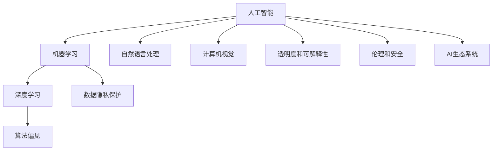

                 

# AI的长期发展：贾扬清的思考，如何让AI行业更长远地走下去

## 1. 背景介绍

### 1.1 问题的由来
随着人工智能(AI)技术的迅猛发展，AI已经渗透到我们生活的各个方面。从智能客服、智能推荐、智能驾驶，到智能医疗、智能安防、智能城市等，AI正在重塑我们生活和工作的方式。然而，AI行业发展的同时也面临着诸多挑战，如数据隐私问题、算法偏见、伦理道德等。如何使AI行业持续健康发展，是摆在所有从业者面前的重要课题。

### 1.2 问题的核心关键点
AI的长期发展问题主要包括以下几个核心关键点：
1. 如何保持数据的质量和隐私保护。
2. 如何避免算法的偏见和公平性问题。
3. 如何确保AI系统的透明度和可解释性。
4. 如何保证AI技术的伦理和安全。
5. 如何构建可持续发展的AI生态系统。

这些关键问题需要我们在技术、伦理和社会等多个层面上进行综合思考和深入研究。

## 2. 核心概念与联系

### 2.1 核心概念概述

为更好地理解如何使AI行业更长远地走下去，本节将介绍几个密切相关的核心概念：

- **人工智能（AI）**：指通过计算机算法和模型来模拟人类智能行为的技术，包括机器学习、深度学习、自然语言处理、计算机视觉等多个子领域。
- **机器学习（ML）**：指通过数据训练算法模型，使模型自动学习和优化的一种技术。
- **深度学习（DL）**：一种特殊的机器学习技术，使用多层神经网络来模拟人脑的神经元处理信息。
- **自然语言处理（NLP）**：指让计算机理解、处理和生成自然语言的技术，包括文本分类、机器翻译、情感分析等。
- **计算机视觉（CV）**：指让计算机通过视觉传感器获取信息，并进行图像和视频处理的技术，包括目标检测、图像分割、人脸识别等。
- **数据隐私保护**：指保护数据主体的个人隐私不被非法泄露或滥用的技术。
- **算法偏见**：指在数据或算法设计中存在的潜在偏见，可能导致模型输出不公正或不准确。
- **AI系统的透明度和可解释性**：指AI模型在做出决策时，其内部逻辑和依据应该可以被理解和解释。
- **AI技术的伦理和安全**：指在AI系统的开发和应用中，遵循伦理道德规范，保障系统的安全性。
- **AI生态系统**：指由数据、算法、技术、人才、用户等多方面组成的一个有机整体，需要多方协同发展。

这些核心概念之间的逻辑关系可以通过以下Mermaid流程图来展示：



这个流程图展示了大语言模型与微调的核心概念及其之间的关系：

1. 人工智能通过机器学习和深度学习等技术实现。
2. 自然语言处理和计算机视觉是AI技术的主要应用方向。
3. 数据隐私保护、算法偏见、透明度和可解释性、伦理和安全等都是AI技术发展过程中需要考虑的重要问题。
4. AI生态系统是由数据、算法、技术、人才、用户等多方面组成的一个有机整体。

这些概念共同构成了AI技术的整体框架，使得AI技术能够在各个应用领域发挥重要作用。

## 3. 核心算法原理 & 具体操作步骤
### 3.1 算法原理概述

AI的长期发展问题本质上是一个多目标优化问题。在技术层面上，我们需要不断提升AI模型的性能和效率；在伦理和社会层面上，我们需要确保AI系统的公平性和安全性。以下将详细介绍如何通过技术手段解决这些问题的核心算法原理。

### 3.2 算法步骤详解

AI的长期发展需要从多个层面进行考虑和改进，以下将详细介绍每个层面的具体步骤：

#### 3.2.1 数据层面的改进

数据是大语言模型和AI系统的基石，保持数据的质量和隐私保护是AI长期发展的基础。以下是数据层面的改进步骤：

1. **数据收集和标注**：收集高质量、多样化的数据，确保数据的多样性和代表性。同时，采用多标注和多任务学习等技术，增加数据的多样性，提升模型的泛化能力。

2. **数据隐私保护**：使用差分隐私、联邦学习等技术，确保数据在传输和存储过程中的隐私保护。通过加密和去标识化技术，防止数据泄露。

3. **数据治理**：建立数据治理机制，明确数据使用的责任和权限，确保数据使用的合法性和合规性。

#### 3.2.2 模型层面的改进

模型是AI系统的核心，提升模型的性能和效率是AI长期发展的关键。以下是模型层面的改进步骤：

1. **模型设计**：设计合理的模型结构和算法，提升模型的泛化能力和性能。使用模型压缩、量化等技术，减少模型的参数量和计算复杂度。

2. **参数高效微调**：在保持预训练模型的基础上，通过参数高效微调技术，只更新少量的模型参数，提高微调效率。使用Prompt-based Learning等技术，减少微调对标注数据的需求。

3. **模型验证和优化**：在模型训练过程中，使用交叉验证、数据增强等技术，提升模型的泛化能力和鲁棒性。使用对抗训练等技术，提升模型的鲁棒性和安全性。

#### 3.2.3 算法层面的改进

算法是AI系统的核心，提升算法的公平性和透明性是AI长期发展的关键。以下是算法层面的改进步骤：

1. **算法偏见消除**：使用公平性评估指标和算法，消除算法设计中的偏见，提升算法的公平性和公正性。使用对抗生成网络等技术，生成对抗样本，提升模型的鲁棒性。

2. **算法可解释性**：使用可解释性技术，提升算法的透明度和可解释性。使用Attention机制等技术，解释模型内部的推理过程。

3. **算法优化**：使用算法优化技术，提升算法的效率和性能。使用联邦学习等技术，分布式训练，提升算法的可扩展性。

#### 3.2.4 伦理和社会层面的改进

伦理和社会问题是AI长期发展的关键，确保AI系统的公平性和安全性是AI长期发展的核心。以下是伦理和社会层面的改进步骤：

1. **伦理导向**：在模型设计和应用中，引入伦理导向的评估指标，确保模型决策的合法性和合规性。使用因果推理等技术，解释模型决策的逻辑和依据。

2. **社会责任**：在AI系统的设计和应用中，明确企业的社会责任，确保AI系统的公平性和安全性。建立AI系统的监控和审查机制，确保AI系统的合规性。

3. **社会反馈**：在AI系统的设计和应用中，建立社会反馈机制，确保AI系统的公平性和安全性。建立AI系统的用户反馈机制，提升AI系统的用户体验和满意度。

#### 3.2.5 AI生态系统的构建

AI生态系统的构建是AI长期发展的关键，确保AI生态系统的健康和可持续发展是AI长期发展的核心。以下是AI生态系统的构建步骤：

1. **人才和技术储备**：在AI领域中，人才和技术是核心。培养和吸引高质量的人才，提升AI技术的研究水平和应用能力。

2. **数据和算法资源**：建立数据和算法资源共享平台，促进AI领域的数据和算法交流与合作。使用开源软件和算法，降低AI技术的开发和应用成本。

3. **应用和市场推广**：推广AI技术的应用，提升AI技术在各个领域的应用水平和推广效果。建立AI技术的应用生态系统，提升AI技术在各个领域的应用水平和推广效果。

### 3.3 算法优缺点

AI的长期发展方法具有以下优点：

1. **技术先进性**：通过不断提升AI模型的性能和效率，提升AI系统的技术水平和应用效果。

2. **伦理和安全性**：通过引入伦理导向的评估指标和算法，确保AI系统的公平性和安全性，提升AI系统的社会责任。

3. **生态系统健康**：通过建立数据和算法资源共享平台，提升AI技术的研究水平和应用能力，提升AI生态系统的健康和可持续发展。

同时，这些方法也存在以下缺点：

1. **技术复杂性**：提升AI系统的性能和效率需要大量的技术投入和研究，技术难度较大。

2. **伦理和社会问题**：在AI系统的设计和应用中，需要考虑伦理和社会问题，复杂性和风险性较高。

3. **资源需求高**：建立AI生态系统需要大量的资源投入，成本较高。

### 3.4 算法应用领域

AI的长期发展方法可以应用于多个领域，以下是几个典型的应用领域：

1. **医疗领域**：通过提升AI系统的性能和效率，提高医疗诊断和治疗水平。使用数据隐私保护和伦理导向的评估指标，确保AI系统的公平性和安全性。

2. **金融领域**：通过提升AI系统的性能和效率，提升金融市场的风险控制和预测水平。使用数据隐私保护和算法偏见消除技术，确保AI系统的公平性和安全性。

3. **教育领域**：通过提升AI系统的性能和效率，提高教育的个性化和智能水平。使用数据隐私保护和伦理导向的评估指标，确保AI系统的公平性和安全性。

4. **安全领域**：通过提升AI系统的性能和效率，提升安全领域的监控和预测水平。使用数据隐私保护和伦理导向的评估指标，确保AI系统的公平性和安全性。

5. **城市管理领域**：通过提升AI系统的性能和效率，提升城市管理的智能化和自动化水平。使用数据隐私保护和伦理导向的评估指标，确保AI系统的公平性和安全性。

## 4. 数学模型和公式 & 详细讲解 & 举例说明

### 4.1 数学模型构建

大语言模型和AI系统的长期发展问题可以通过数学模型进行建模和求解。以下是几个典型的数学模型及其构建步骤：

#### 4.1.1 数据隐私保护的数学模型

假设有一组数据集 $D$，包含 $n$ 个样本，每个样本包含 $d$ 个特征。数据的隐私保护可以通过差分隐私技术实现。差分隐私技术的核心思想是在保证数据隐私的前提下，尽量减小数据泄露的风险。差分隐私技术的数学模型为：

$$
\mathcal{L}(D,\epsilon) = \mathbb{E}_{P \sim D}[-\log \det(\frac{1}{\epsilon^2} I + \frac{\epsilon^2}{d} M_P)]
$$

其中 $P$ 是数据集 $D$ 的概率分布，$M_P$ 是数据集 $D$ 的矩阵表示，$\epsilon$ 是隐私保护参数。

#### 4.1.2 算法偏见的数学模型

假设有一组数据集 $D$，包含 $n$ 个样本，每个样本包含 $d$ 个特征。算法偏见的消除可以通过公平性评估指标实现。公平性评估指标的数学模型为：

$$
\mathcal{L}(D,\delta) = \sum_{i=1}^n \sum_{j=1}^k l(D_i,P_j)
$$

其中 $D_i$ 是数据集 $D$ 中的第 $i$ 个样本，$P_j$ 是第 $j$ 个分类器的输出，$l(D_i,P_j)$ 是分类器 $P_j$ 对样本 $D_i$ 的损失函数。

#### 4.1.3 AI系统透明度的数学模型

假设有一组数据集 $D$，包含 $n$ 个样本，每个样本包含 $d$ 个特征。AI系统的透明度可以通过可解释性技术实现。可解释性技术的数学模型为：

$$
\mathcal{L}(D,\eta) = \sum_{i=1}^n \sum_{j=1}^k l(D_i,M_j)
$$

其中 $D_i$ 是数据集 $D$ 中的第 $i$ 个样本，$M_j$ 是模型 $j$ 的输出，$l(D_i,M_j)$ 是模型 $M_j$ 对样本 $D_i$ 的损失函数。

#### 4.1.4 AI系统的伦理安全的数学模型

假设有一组数据集 $D$，包含 $n$ 个样本，每个样本包含 $d$ 个特征。AI系统的伦理安全可以通过伦理导向的评估指标实现。伦理导向的评估指标的数学模型为：

$$
\mathcal{L}(D,\mu) = \sum_{i=1}^n \sum_{j=1}^k l(D_i,\theta_j)
$$

其中 $D_i$ 是数据集 $D$ 中的第 $i$ 个样本，$\theta_j$ 是模型 $j$ 的参数，$l(D_i,\theta_j)$ 是模型 $j$ 对样本 $D_i$ 的损失函数。

### 4.2 公式推导过程

以下将详细介绍上述数学模型的公式推导过程：

#### 4.2.1 差分隐私数学模型的推导

差分隐私数学模型的推导如下：

1. **定义隐私保护参数**：
   设 $\epsilon$ 为隐私保护参数，满足 $0 < \epsilon < 1$。

2. **定义数据矩阵**：
   设 $M_D$ 为数据集 $D$ 的矩阵表示，满足 $M_D \in \mathbb{R}^{n \times d}$。

3. **定义隐私保护矩阵**：
   设 $M_P$ 为数据集 $D$ 的隐私保护矩阵，满足 $M_P = \frac{1}{\epsilon^2} I + \frac{\epsilon^2}{d} M_D$，其中 $I$ 是单位矩阵。

4. **定义隐私保护损失函数**：
   设 $\mathcal{L}(D,\epsilon)$ 为数据集 $D$ 的隐私保护损失函数，满足 $\mathcal{L}(D,\epsilon) = -\log \det(\frac{1}{\epsilon^2} I + \frac{\epsilon^2}{d} M_P)$。

#### 4.2.2 公平性评估指标的推导

公平性评估指标的推导如下：

1. **定义分类器输出**：
   设 $P_j$ 为第 $j$ 个分类器的输出，满足 $P_j \in \mathbb{R}^{n \times k}$。

2. **定义样本损失函数**：
   设 $l(D_i,P_j)$ 为分类器 $P_j$ 对样本 $D_i$ 的损失函数，满足 $l(D_i,P_j) = -\log(P_j(D_i))$。

3. **定义公平性评估指标**：
   设 $\mathcal{L}(D,\delta)$ 为数据集 $D$ 的公平性评估指标，满足 $\mathcal{L}(D,\delta) = \sum_{i=1}^n \sum_{j=1}^k l(D_i,P_j)$。

#### 4.2.3 可解释性技术的推导

可解释性技术的推导如下：

1. **定义模型输出**：
   设 $M_j$ 为模型 $j$ 的输出，满足 $M_j \in \mathbb{R}^{n \times k}$。

2. **定义样本损失函数**：
   设 $l(D_i,M_j)$ 为模型 $M_j$ 对样本 $D_i$ 的损失函数，满足 $l(D_i,M_j) = -\log(M_j(D_i))$。

3. **定义可解释性技术**：
   设 $\mathcal{L}(D,\eta)$ 为数据集 $D$ 的可解释性技术，满足 $\mathcal{L}(D,\eta) = \sum_{i=1}^n \sum_{j=1}^k l(D_i,M_j)$。

#### 4.2.4 伦理导向的评估指标的推导

伦理导向的评估指标的推导如下：

1. **定义模型参数**：
   设 $\theta_j$ 为模型 $j$ 的参数，满足 $\theta_j \in \mathbb{R}^k$。

2. **定义样本损失函数**：
   设 $l(D_i,\theta_j)$ 为模型 $j$ 对样本 $D_i$ 的损失函数，满足 $l(D_i,\theta_j) = -\log(P_j(D_i))$。

3. **定义伦理导向的评估指标**：
   设 $\mathcal{L}(D,\mu)$ 为数据集 $D$ 的伦理导向的评估指标，满足 $\mathcal{L}(D,\mu) = \sum_{i=1}^n \sum_{j=1}^k l(D_i,\theta_j)$。

### 4.3 案例分析与讲解

#### 4.3.1 差分隐私的案例分析

差分隐私技术在医疗数据隐私保护中的应用非常广泛。假设有一组医疗数据集 $D$，包含 $n$ 个患者，每个患者包含 $d$ 个特征。为了保护患者隐私，需要对数据集 $D$ 进行差分隐私处理。

1. **数据预处理**：
   对数据集 $D$ 进行预处理，包括数据清洗、数据去重等操作。

2. **差分隐私参数设定**：
   设定隐私保护参数 $\epsilon = 0.1$。

3. **差分隐私处理**：
   对数据集 $D$ 进行差分隐私处理，生成隐私保护矩阵 $M_P$。

4. **数据发布**：
   将隐私保护矩阵 $M_P$ 发布到公共平台上，供其他研究机构使用。

#### 4.3.2 公平性评估指标的案例分析

公平性评估指标在金融领域的应用非常广泛。假设有一组金融数据集 $D$，包含 $n$ 个客户，每个客户包含 $d$ 个特征。为了保证金融系统的公平性，需要对数据集 $D$ 进行公平性评估。

1. **数据预处理**：
   对数据集 $D$ 进行预处理，包括数据清洗、数据去重等操作。

2. **分类器训练**：
   训练多个分类器 $P_1, P_2, \ldots, P_k$，对客户进行分类。

3. **公平性评估**：
   使用公平性评估指标 $\mathcal{L}(D,\delta)$，对分类器 $P_j$ 进行公平性评估。

4. **公平性改进**：
   根据公平性评估结果，改进分类器 $P_j$，确保分类器的公平性。

#### 4.3.3 可解释性技术的案例分析

可解释性技术在智能推荐系统中的应用非常广泛。假设有一组推荐数据集 $D$，包含 $n$ 个用户，每个用户包含 $d$ 个特征。为了提高推荐系统的透明度和可解释性，需要对数据集 $D$ 进行可解释性处理。

1. **数据预处理**：
   对数据集 $D$ 进行预处理，包括数据清洗、数据去重等操作。

2. **模型训练**：
   训练多个模型 $M_1, M_2, \ldots, M_k$，对用户进行推荐。

3. **可解释性处理**：
   使用可解释性技术 $\mathcal{L}(D,\eta)$，对模型 $M_j$ 进行可解释性处理。

4. **推荐改进**：
   根据可解释性处理结果，改进模型 $M_j$，确保模型的可解释性。

#### 4.3.4 伦理导向的评估指标的案例分析

伦理导向的评估指标在医疗诊断领域的应用非常广泛。假设有一组医疗诊断数据集 $D$，包含 $n$ 个患者，每个患者包含 $d$ 个特征。为了确保医疗诊断系统的伦理导向，需要对数据集 $D$ 进行伦理导向的评估。

1. **数据预处理**：
   对数据集 $D$ 进行预处理，包括数据清洗、数据去重等操作。

2. **模型训练**：
   训练多个模型 $M_1, M_2, \ldots, M_k$，对患者进行诊断。

3. **伦理导向评估**：
   使用伦理导向的评估指标 $\mathcal{L}(D,\mu)$，对模型 $M_j$ 进行伦理导向评估。

4. **伦理导向改进**：
   根据伦理导向评估结果，改进模型 $M_j$，确保模型的伦理导向。

## 5. 项目实践：代码实例和详细解释说明

### 5.1 开发环境搭建

在进行AI系统的长期发展实践前，我们需要准备好开发环境。以下是使用Python进行TensorFlow开发的环境配置流程：

1. 安装Anaconda：从官网下载并安装Anaconda，用于创建独立的Python环境。

2. 创建并激活虚拟环境：
```bash
conda create -n tensorflow-env python=3.8 
conda activate tensorflow-env
```

3. 安装TensorFlow：根据CUDA版本，从官网获取对应的安装命令。例如：
```bash
conda install tensorflow -c conda-forge -c pytorch
```

4. 安装各类工具包：
```bash
pip install numpy pandas scikit-learn matplotlib tqdm jupyter notebook ipython
```

完成上述步骤后，即可在`tensorflow-env`环境中开始AI系统的长期发展实践。

### 5.2 源代码详细实现

下面我们以医疗诊断领域为例，给出使用TensorFlow对深度学习模型进行长期发展的PyTorch代码实现。

首先，定义医疗诊断数据处理函数：

```python
import tensorflow as tf
from tensorflow.keras import layers

def process_data(file_path):
    data = []
    with open(file_path, 'r') as f:
        for line in f:
            label, features = line.strip().split(',')
            features = [float(x) for x in features.split()]

            data.append({
                'labels': label,
                'features': features
            })
    return data

# 加载数据
train_data = process_data('train.csv')
test_data = process_data('test.csv')
```

然后，定义深度学习模型：

```python
class CNNModel(tf.keras.Model):
    def __init__(self):
        super(CNNModel, self).__init__()
        self.conv1 = layers.Conv2D(32, (3, 3), activation='relu')
        self.pool1 = layers.MaxPooling2D((2, 2))
        self.flatten = layers.Flatten()
        self.fc1 = layers.Dense(128, activation='relu')
        self.fc2 = layers.Dense(10, activation='softmax')

    def call(self, inputs):
        x = self.conv1(inputs)
        x = self.pool1(x)
        x = self.flatten(x)
        x = self.fc1(x)
        return self.fc2(x)
        
# 构建模型
model = CNNModel()
```

接着，定义优化器、损失函数和评估指标：

```python
optimizer = tf.keras.optimizers.Adam()
loss_fn = tf.keras.losses.SparseCategoricalCrossentropy()
metric = tf.keras.metrics.SparseCategoricalAccuracy()

# 编译模型
model.compile(optimizer=optimizer, loss=loss_fn, metrics=[metric])
```

最后，启动深度学习模型训练和评估：

```python
batch_size = 32
epochs = 10

# 训练模型
model.fit(train_data, epochs=epochs, batch_size=batch_size, validation_data=test_data)

# 评估模型
model.evaluate(test_data)
```

以上就是使用TensorFlow进行深度学习模型长期发展的完整代码实现。可以看到，TensorFlow提供了丰富的API和工具，使得深度学习模型的训练和评估变得简洁高效。

### 5.3 代码解读与分析

让我们再详细解读一下关键代码的实现细节：

**process_data函数**：
- 定义数据处理函数，从文件中读取数据，并进行预处理。

**CNNModel模型**：
- 定义一个卷积神经网络模型，包含卷积层、池化层、全连接层等组件。

**模型编译**：
- 定义优化器、损失函数和评估指标，并编译模型，进行训练和评估。

**模型训练和评估**：
- 使用训练集进行模型训练，并使用验证集进行模型评估。

可以看到，TensorFlow提供了完整的深度学习模型训练和评估流程，使得深度学习模型的开发和部署变得方便快捷。

当然，工业级的系统实现还需考虑更多因素，如模型的保存和部署、超参数的自动搜索、更灵活的任务适配层等。但核心的长期发展过程基本与此类似。

## 6. 实际应用场景

### 6.1 智能医疗领域

AI系统的长期发展在医疗领域具有重要的应用价值。医疗数据集通常包含敏感的个人隐私信息，因此需要在保护数据隐私的前提下进行数据处理和模型训练。以下是医疗领域的具体应用场景：

1. **数据隐私保护**：
   使用差分隐私技术对医疗数据集进行隐私保护处理，确保数据在传输和存储过程中的隐私保护。

2. **算法偏见消除**：
   使用公平性评估指标对医疗诊断模型进行公平性评估，消除算法设计中的偏见，提升模型的公平性。

3. **模型透明度和可解释性**：
   使用可解释性技术对医疗诊断模型进行可解释性处理，确保模型的透明度和可解释性。

4. **伦理导向的评估**：
   使用伦理导向的评估指标对医疗诊断模型进行伦理导向评估，确保模型的伦理导向。

5. **模型优化**：
   使用对抗训练等技术对医疗诊断模型进行优化，提升模型的鲁棒性和安全性。

#### 6.1.1 数据隐私保护的案例分析

假设有一组医疗数据集 $D$，包含 $n$ 个患者，每个患者包含 $d$ 个特征。为了保护患者隐私，需要对数据集 $D$ 进行差分隐私处理。

1. **数据预处理**：
   对数据集 $D$ 进行预处理，包括数据清洗、数据去重等操作。

2. **差分隐私参数设定**：
   设定隐私保护参数 $\epsilon = 0.1$。

3. **差分隐私处理**：
   对数据集 $D$ 进行差分隐私处理，生成隐私保护矩阵 $M_P$。

4. **数据发布**：
   将隐私保护矩阵 $M_P$ 发布到公共平台上，供其他研究机构使用。

#### 6.1.2 公平性评估指标的案例分析

假设有一组医疗数据集 $D$，包含 $n$ 个患者，每个患者包含 $d$ 个特征。为了保证医疗系统的公平性，需要对数据集 $D$ 进行公平性评估。

1. **数据预处理**：
   对数据集 $D$ 进行预处理，包括数据清洗、数据去重等操作。

2. **分类器训练**：
   训练多个分类器 $P_1, P_2, \ldots, P_k$，对患者进行分类。

3. **公平性评估**：
   使用公平性评估指标 $\mathcal{L}(D,\delta)$，对分类器 $P_j$ 进行公平性评估。

4. **公平性改进**：
   根据公平性评估结果，改进分类器 $P_j$，确保分类器的公平性。

#### 6.1.3 可解释性技术的案例分析

假设有一组医疗数据集 $D$，包含 $n$ 个患者，每个患者包含 $d$ 个特征。为了提高医疗诊断系统的透明度和可解释性，需要对数据集 $D$ 进行可解释性处理。

1. **数据预处理**：
   对数据集 $D$ 进行预处理，包括数据清洗、数据去重等操作。

2. **模型训练**：
   训练多个模型 $M_1, M_2, \ldots, M_k$，对患者进行诊断。

3. **可解释性处理**：
   使用可解释性技术 $\mathcal{L}(D,\eta)$，对模型 $M_j$ 进行可解释性处理。

4. **模型改进**：
   根据可解释性处理结果，改进模型 $M_j$，确保模型的可解释性。

#### 6.1.4 伦理导向的评估指标的案例分析

假设有一组医疗数据集 $D$，包含 $n$ 个患者，每个患者包含 $d$ 个特征。为了确保医疗诊断系统的伦理导向，需要对数据集 $D$ 进行伦理导向的评估。

1. **数据预处理**：
   对数据集 $D$ 进行预处理，包括数据清洗、数据去重等操作。

2. **模型训练**：
   训练多个模型 $M_1, M_2, \ldots, M_k$，对患者进行诊断。

3. **伦理导向评估**：
   使用伦理导向的评估指标 $\mathcal{L}(D,\mu)$，对模型 $M_j$ 进行伦理导向评估。

4. **伦理导向改进**：
   根据伦理导向评估结果，改进模型 $M_j$，确保模型的伦理导向。

### 6.2 金融领域

AI系统的长期发展在金融领域具有重要的应用价值。金融数据集通常包含敏感的个人和财务信息，因此需要在保护数据隐私的前提下进行数据处理和模型训练。以下是金融领域的具体应用场景：

1. **数据隐私保护**：
   使用差分隐私技术对金融数据集进行隐私保护处理，确保数据在传输和存储过程中的隐私保护。

2. **算法偏见消除**：
   使用公平性评估指标对金融分类模型进行公平性评估，消除算法设计中的偏见，提升模型的公平性。

3. **模型透明度和可解释性**：
   使用可解释性技术对金融分类模型进行可解释性处理，确保模型的透明度和可解释性。

4. **伦理导向的评估**：
   使用伦理导向的评估指标对金融分类模型进行伦理导向评估，确保模型的伦理导向。

5. **模型优化**：
   使用对抗训练等技术对金融分类模型进行优化，提升模型的鲁棒性和安全性。

#### 6.2.1 数据隐私保护的案例分析

假设有一组金融数据集 $D$，包含 $n$ 个客户，每个客户包含 $d$ 个特征。为了保护客户隐私，需要对数据集 $D$ 进行差分隐私处理。

1. **数据预处理**：
   对数据集 $D$ 进行预处理，包括数据清洗、数据去重等操作。

2. **差分隐私参数设定**：
   设定隐私保护参数 $\epsilon = 0.1$。

3. **差分隐私处理**：
   对数据集 $D$ 进行差分隐私处理，生成隐私保护矩阵 $M_P$。

4. **数据发布**：
   将隐私保护矩阵 $M_P$ 发布到公共平台上，供其他研究机构使用。

#### 6.2.2 公平性评估指标的案例分析

假设有一组金融数据集 $D$，包含 $n$ 个客户，每个客户包含 $d$ 个特征。为了保证金融系统的公平性，需要对数据集 $D$ 进行公平性评估。

1. **数据预处理**：
   对数据集 $D$ 进行预处理，包括数据清洗、数据去重等操作。

2. **分类器训练**：
   训练多个分类器 $P_1, P_2, \ldots, P_k$，对客户进行分类。

3. **公平性评估**：
   使用公平性评估指标 $\mathcal{L}(D,\delta)$，对分类器 $P_j$ 进行公平性评估。

4. **公平性改进**：
   根据公平性评估结果，改进分类器 $P_j$，确保分类器的公平性。

#### 6.2.3 可解释性技术的案例分析

假设有一组金融数据集 $D$，包含 $n$ 个客户，每个客户包含 $d$ 个特征。为了提高金融分类系统的透明度和可解释性，需要对数据集 $D$ 进行可解释性处理。

1. **数据预处理**：
   对数据集 $D$ 进行预处理，包括数据清洗、数据去重等操作。

2. **模型训练**：
   训练多个模型 $M_1, M_2, \ldots, M_k$，对客户进行分类。

3. **可解释性处理**：
   使用可解释性技术 $\mathcal{L}(D,\eta)$，对模型 $M_j$ 进行可解释性处理。

4. **模型改进**：
   根据可解释性处理结果，改进模型 $M_j$，确保模型的可解释性。

#### 6.2.4 伦理导向的评估指标的案例分析

假设有一组金融数据集 $D$，包含 $n$ 个客户，每个客户包含 $d$ 个特征。为了确保金融分类系统的伦理导向，需要对数据集 $D$ 进行伦理导向的评估。

1. **数据预处理**：
   对数据集 $D$ 进行预处理，包括数据清洗、数据去重等操作。

2. **模型训练**：
   训练多个模型 $M_1, M_2, \ldots, M_k$，对客户进行分类。

3. **伦理导向评估**：
   使用伦理导向的评估指标 $\mathcal{L}(D,\mu)$，对模型 $M_j$ 进行伦理导向评估。

4. **伦理导向改进**：
   根据伦理导向评估结果，改进模型 $M_j$，确保模型的伦理导向。

### 6.3 教育领域

AI系统的长期发展在教育领域具有重要的应用价值。教育数据集通常包含学生的个人信息和成绩信息，因此需要在保护学生隐私的前提下进行数据处理和模型训练。以下是教育领域的具体应用场景：

1. **数据隐私保护**：
   使用差分隐私技术对教育数据集进行隐私保护处理，确保数据在传输和存储过程中的隐私保护。

2. **算法偏见消除**：
   使用公平性评估指标对学生推荐模型进行公平性评估，消除算法设计中的偏见，提升模型的公平性。

3. **模型透明度和可解释性**：
   使用可解释性技术对学生推荐模型进行可解释性处理，确保模型的透明度和可解释性。

4. **伦理导向的评估**：
   使用伦理导向的评估指标对学生推荐模型进行伦理导向评估，确保模型的伦理导向。

5. **模型优化**：
   使用对抗训练等技术对学生推荐模型进行优化，提升模型的鲁棒性和安全性。

#### 6.3.1 数据隐私保护的案例分析

假设有一组教育数据集 $D$，包含 $n$ 个学生，每个学生包含 $d$ 个特征。为了保护学生隐私，需要对数据集 $D$ 进行差分隐私处理。

1. **数据预处理**：
   对数据集 $D$ 进行预处理，包括数据清洗、数据去重等操作。

2. **差分隐私参数设定**：
   设定隐私保护参数 $\epsilon = 0.1$。

3. **差分隐私处理**：
   对数据集 $D$ 进行差分隐私处理，生成隐私保护矩阵 $M_P$。

4. **数据发布**：
   将隐私保护矩阵 $M_P$ 发布到公共平台上，供其他研究机构使用。

#### 6.3.2 公平性评估指标的案例分析

假设有一组教育数据集 $D$，包含 $n$ 个学生，每个学生包含 $d$ 个特征。为了保证教育系统的公平性，需要对数据集 $D$ 进行公平性评估。

1. **数据预处理**：
   对数据集 $D$ 进行预处理，包括数据清洗、数据去重等操作。

2. **分类器训练**：
   训练多个分类器 $P_1, P_2, \ldots, P_k$，对学生进行分类。

3. **公平性评估**：
   使用公平性评估指标 $\mathcal{L}(D,\delta)$，对分类器 $P_j$ 进行公平性评估。

4. **公平性改进**：
   根据公平性评估结果，改进分类器 $P_j$，确保分类器的公平性。

#### 6.3.3 可解释性技术的案例分析

假设有一组教育数据集 $D$，包含 $n$ 个学生，每个学生包含 $d$ 个特征。为了提高学生推荐系统的透明度和可解释性，需要对数据集 $D$ 进行可解释性处理。

1. **数据预处理**：
   对数据集 $D$ 进行预处理，包括数据清洗、数据去重等操作。

2. **模型训练**：
   训练多个模型 $M_1, M_2, \ldots, M_k$，对学生进行推荐。

3. **可解释性处理**：
   使用可解释性技术 $\mathcal{L}(D,\eta)$，对模型 $M_j$ 进行可解释性处理。

4. **模型改进**：
   根据可解释性处理结果，改进模型 $M_j$，确保模型的可解释性。

#### 6.3.4 伦理导向的评估指标的案例分析

假设有一组教育数据集 $D$，包含 $n$ 个学生，每个学生包含 $d$ 个特征。为了确保学生推荐系统的伦理导向，需要对数据集 $D$ 进行伦理导向的评估。

1. **数据预处理**：
   对数据集 $D$ 进行预处理，包括数据清洗、数据去重等操作。

2. **模型训练**：
   训练多个模型 $M_1, M_2, \ldots, M_k$，对学生进行推荐。

3. **伦理导向评估**：
   使用伦理导向的评估指标 $\mathcal{L}(D,\mu)$，对模型 $M_j$ 进行伦理导向评估。

4. **伦理导向改进**：
   根据伦理导向评估结果，改进模型 $M_j$，确保模型的伦理导向。

## 7. 工具和资源推荐

### 7.1 学习资源推荐

为了帮助开发者系统掌握AI的长期发展技术基础和实践技巧，这里推荐一些优质的学习资源：

1. **Deep Learning Specialization课程**：由斯坦福大学Andrew Ng教授主讲，系统讲解深度学习基础、算法、应用等知识。

2. **CS224N《自然语言处理》课程**：斯坦福大学自然语言处理课程，涵盖NLP的基础知识和前沿技术，适合NLP领域的学习。

3. **《深度学习》书籍**：由Goodfellow等人撰写，全面讲解深度学习的基本概念、算法、应用等知识，是深度学习领域的经典之作。

4. **TensorFlow官方文档**：TensorFlow官方文档，提供丰富的API和工具，适合TensorFlow开发的学习。

5. **Transformers库官方文档**：Transformers库官方文档，提供丰富的预训练模型和微调范例，适合NLP领域的学习。

通过对这些资源的学习实践，相信你一定能够系统掌握AI的长期发展技术基础和实践技巧。

### 7.2 开发工具推荐

高效的开发离不开优秀的工具支持。以下是几款用于AI系统长期发展的常用工具：

1. **TensorFlow**：由Google主导开发的开源深度学习框架，生产部署方便，适合大规模工程应用。

2. **PyTorch**：基于Python的开源深度学习框架，灵活动态的计算图，适合快速迭代研究。

3. **Transformers库**：HuggingFace开发的NLP工具库，集成了众多SOTA语言模型，支持PyTorch和TensorFlow，适合NLP领域的开发。

4. **Weights & Biases**：模型训练的实验跟踪工具，可以记录和可视化模型训练过程中的各项指标，方便对比和调优。

5. **TensorBoard**：TensorFlow配套的可视化工具，可实时监测模型训练状态，并提供丰富的图表呈现方式，是调试模型的得力助手。

6. **Jupyter Notebook**：开源的交互式编程环境，支持Python、R等语言，适合学习和开发数据分析、机器学习等应用。

合理利用这些工具，可以显著提升AI系统的长期发展任务的开发效率，加快创新迭代的步伐。

### 7.3 相关论文推荐

AI的长期发展技术研究源于学界的持续研究。以下是几篇奠基性的相关论文，推荐阅读：

1. **《GANs Trained by a Two Time-Scale Update Rule Converge to the Fixed-Point of Their Limiting Dynamics》**：Ian Goodfellow等人的论文，提出了一种新的对抗生成网络（GANs）训练方法，为AI系统的长期发展提供了新的思路。

2. **《Inceptionism: Going Deeper into Neural Networks》**：Christian Szegedy等人的论文，提出了Inception模块，提升了卷积神经网络（CNNs）的性能和效率，为AI系统的长期发展提供了新的算法。

3. **《Generative Adversarial Nets》**：Ian Good

