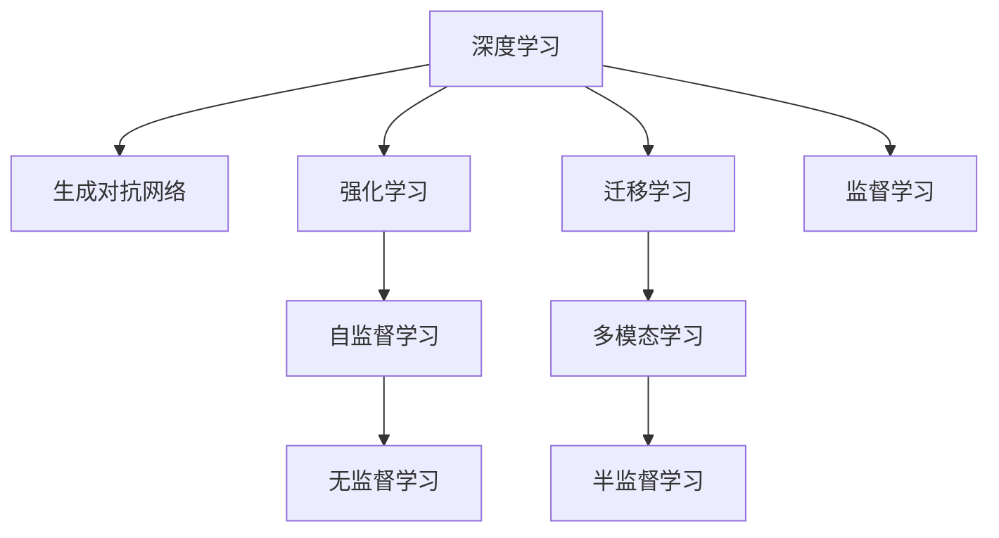

                 

# AI研究的最新进展与趋势

> 关键词：人工智能,深度学习,自然语言处理,NLP,计算机视觉,CV,机器学习,ML,生成对抗网络,GAN,强化学习,RL,大数据,Big Data,云计算,Cloud Computing

## 1. 背景介绍

### 1.1 问题由来

近年来，人工智能（AI）领域的研究取得了前所未有的突破，尤其是深度学习技术的迅猛发展，推动了机器学习（ML）、自然语言处理（NLP）、计算机视觉（CV）等多个子领域的飞速进步。这些技术的广泛应用，带来了诸多商业和社会价值，同时也引发了关于AI伦理、安全性等诸多讨论。

AI研究的核心在于如何使机器具备理解、推理和学习的能力，从而模拟人类智能。传统的符号主义AI方法逐渐被更加灵活的连接主义AI方法所取代，即通过深度神经网络等模型来模拟人脑的神经元网络，实现模式识别、图像处理、语音识别、语言翻译等复杂任务。

深度学习技术，特别是深度神经网络，利用大数据、高性能计算资源，通过多层非线性变换提取数据的高维特征，进而实现自动学习、自动优化，使得AI技术在诸多领域大放异彩。例如，在图像识别、语音识别、自然语言处理等任务上，深度学习模型的性能已经超越了人类专家的表现。

### 1.2 问题核心关键点

当前AI研究的核心问题包括：

1. **深度学习架构**：如何构建更加高效、灵活的深度学习模型，提升计算和存储效率，同时保持或提升模型的性能。

2. **模型泛化能力**：如何让模型具备更好的泛化能力，适应更广泛的数据分布和应用场景，避免过拟合和数据偏差。

3. **迁移学习与知识图谱**：如何通过迁移学习将知识从一个大规模任务中迁移到另一个小规模任务，以及如何构建知识图谱，帮助模型理解复杂的语义关系。

4. **生成对抗网络（GAN）**：GAN如何被应用于图像生成、数据增强、合成数据等领域，提升数据质量与多样性。

5. **强化学习（RL）**：如何让机器通过试错学习，实现复杂的决策与控制任务，在自监督与半监督学习的基础上进一步提升模型性能。

6. **AI伦理与社会影响**：AI技术的广泛应用带来了诸多伦理与社会问题，如就业替代、隐私泄露、算法偏见等，如何在技术发展的同时，保障社会公平与伦理安全。

### 1.3 问题研究意义

研究AI技术的最新进展与趋势，对于推动技术创新、解决实际问题、制定相关政策具有重要意义：

1. **推动技术进步**：掌握最新的AI技术，有助于推动自身研究和技术水平的提升，实现更多突破性成果。
2. **解决实际问题**：了解AI在各领域的应用现状与挑战，可以针对性地开发解决方案，提升生产效率，改善用户体验。
3. **制定政策法规**：从技术、伦理、社会等多个角度综合考量，制定合理的人工智能政策，促进健康有序发展。
4. **应对未来挑战**：关注AI研究的最新进展，提前预判可能的挑战与风险，未雨绸缪，保障AI技术的安全与可控。

## 2. 核心概念与联系

### 2.1 核心概念概述

为更好地理解AI研究的新进展与趋势，本节将介绍几个密切相关的核心概念：

1. **深度学习**：一种基于神经网络的机器学习技术，通过多层非线性变换，自动提取数据特征，用于图像识别、语音识别、自然语言处理等任务。

2. **生成对抗网络（GAN）**：一种通过对抗训练的生成模型，能够生成逼真的图像、音频、文本等内容，广泛应用于数据增强、图像生成等领域。

3. **强化学习（RL）**：一种通过与环境交互，通过奖励机制优化策略的机器学习技术，应用于机器人控制、游戏AI、自适应系统等场景。

4. **迁移学习**：通过在不同任务间共享知识，提升新任务的性能，减少对标注数据的依赖，适用于数据量较小的场景。

5. **知识图谱**：一种语义化的知识表示方式，用于构建实体、属性、关系等知识节点，应用于信息检索、推荐系统、问答系统等。

6. **多模态学习**：一种综合多种数据模态，如文本、图像、语音等，提升跨模态任务性能的机器学习技术。

这些核心概念之间的逻辑关系可以通过以下Mermaid流程图来展示：



这个流程图展示了大语言模型的工作原理和优化方向：

1. 深度学习通过多层非线性变换提取特征，生成对抗网络通过对抗训练生成逼真内容，强化学习通过试错优化策略，迁移学习通过知识共享提升新任务性能，多模态学习通过多种数据模态提升跨模态任务效果，无监督学习通过自构建知识图谱提升模型性能，半监督学习通过少量标注数据提升模型效果，监督学习通过大量标注数据优化模型效果。

这些概念共同构成了AI技术的学习框架，推动了AI在各个领域的应用和发展。

## 3. 核心算法原理 & 具体操作步骤
### 3.1 算法原理概述

AI研究的核心算法原理主要包括以下几个方面：

1. **神经网络**：深度学习的基础，通过多层非线性变换提取数据特征，用于图像识别、语音识别、自然语言处理等任务。

2. **生成对抗网络（GAN）**：通过对抗训练，生成逼真的图像、音频、文本等内容，广泛应用于数据增强、图像生成等领域。

3. **强化学习（RL）**：通过与环境交互，通过奖励机制优化策略，应用于机器人控制、游戏AI、自适应系统等场景。

4. **迁移学习**：通过在不同任务间共享知识，提升新任务的性能，减少对标注数据的依赖，适用于数据量较小的场景。

5. **多模态学习**：综合多种数据模态，如文本、图像、语音等，提升跨模态任务性能。

6. **知识图谱**：构建实体、属性、关系等知识节点，用于信息检索、推荐系统、问答系统等。

7. **无监督学习**：通过自构建知识图谱提升模型性能，适用于缺乏标注数据的任务。

### 3.2 算法步骤详解

AI算法的步骤通常包括以下几个关键步骤：

**Step 1: 数据准备**

- 收集、预处理数据，包括数据清洗、归一化、标准化等。
- 将数据划分为训练集、验证集和测试集，以评估模型性能。
- 设计合适的评估指标，如准确率、召回率、F1分数等。

**Step 2: 模型构建**

- 选择合适的深度学习模型或生成对抗网络等架构。
- 确定模型的超参数，如学习率、批大小、迭代轮数等。
- 设计合适的损失函数和优化器。

**Step 3: 模型训练**

- 将训练集数据分批次输入模型，前向传播计算损失函数。
- 反向传播计算参数梯度，根据设定的优化算法更新模型参数。
- 周期性在验证集上评估模型性能，根据性能指标决定是否触发Early Stopping。
- 重复上述步骤直至满足预设的迭代轮数或Early Stopping条件。

**Step 4: 模型评估**

- 在测试集上评估模型的性能，对比训练前后的效果提升。
- 使用评估指标衡量模型的表现，如准确率、召回率、F1分数等。
- 根据评估结果，调整模型参数和超参数，重新训练。

**Step 5: 模型部署**

- 将训练好的模型应用于实际问题中，进行推理预测。
- 对输出结果进行后处理，如解码、过滤等。
- 集成到实际的应用系统中，进行监控和维护。

### 3.3 算法优缺点

AI算法的优缺点如下：

**优点**：

1. **自动学习**：通过深度学习等模型，能够自动提取数据特征，无需手动设计特征工程。
2. **高精度**：在许多任务上，深度学习模型的精度已经超越了人类专家的表现。
3. **可扩展性**：在大数据、高性能计算的支持下，深度学习模型可以扩展到更复杂的任务。
4. **应用广泛**：广泛应用于图像识别、语音识别、自然语言处理、推荐系统等多个领域。

**缺点**：

1. **资源需求高**：深度学习模型需要大量的计算资源和存储空间。
2. **数据依赖强**：模型性能依赖高质量的标注数据，数据量不足时效果不佳。
3. **模型复杂**：模型结构复杂，难以解释和调试。
4. **伦理风险**：模型可能会引入偏见和歧视，导致不公平的结果。

### 3.4 算法应用领域

AI算法在多个领域得到了广泛应用，例如：

1. **计算机视觉**：图像识别、物体检测、人脸识别、图像生成等。
2. **自然语言处理**：文本分类、情感分析、机器翻译、问答系统等。
3. **语音识别**：语音识别、语音合成、语音情感分析等。
4. **推荐系统**：个性化推荐、广告推荐、商品推荐等。
5. **机器人控制**：机器人路径规划、运动控制、语音交互等。
6. **金融风控**：信用评分、风险评估、欺诈检测等。
7. **医疗诊断**：疾病诊断、影像分析、基因分析等。
8. **自动驾驶**：环境感知、路径规划、行为决策等。

## 4. 数学模型和公式 & 详细讲解 & 举例说明
### 4.1 数学模型构建

AI算法中的数学模型通常包括以下几个部分：

1. **神经网络模型**：通过多层非线性变换，提取数据特征，形式化表示为$f(x)=W^T \sigma(Wx+b)$，其中$x$为输入，$W$为权重矩阵，$b$为偏置向量，$\sigma$为激活函数。
2. **生成对抗网络（GAN）**：由生成器和判别器两个网络构成，生成器生成假样本，判别器判断真假，训练过程通过对抗训练实现，形式化表示为$G(x), D(x)$，其中$G$为生成器，$D$为判别器，$x$为输入数据。
3. **强化学习（RL）**：通过与环境交互，优化策略，形式化表示为$\pi(a|s)=\frac{\exp(Q(s,a))}{\sum_{a'}\exp(Q(s,a'))}$，其中$s$为状态，$a$为动作，$Q$为Q值函数。
4. **迁移学习**：通过知识图谱或预训练模型，提升新任务性能，形式化表示为$M_{\theta}(x)=W^T \sigma(Wx+b)$，其中$M_{\theta}$为迁移学习后的模型，$x$为输入数据，$W$为权重矩阵，$b$为偏置向量，$\sigma$为激活函数。
5. **知识图谱**：通过实体、属性、关系等节点，构建语义化的知识图谱，形式化表示为$G=(R,E)$，其中$R$为关系集合，$E$为实体集合。

### 4.2 公式推导过程

以下是几个经典AI算法的公式推导过程：

**深度学习模型**

假设深度学习模型$M_{\theta}$的输入为$x$，输出为$y$，损失函数为$L(y,f(x))$，优化目标为$\min_{\theta}L(y,M_{\theta}(x))$。

通过反向传播算法，计算损失函数对模型参数$\theta$的梯度$\nabla_{\theta}L(y,M_{\theta}(x))$，利用梯度下降等优化算法更新模型参数：

$$
\theta \leftarrow \theta - \eta \nabla_{\theta}L(y,M_{\theta}(x))
$$

其中$\eta$为学习率。

**生成对抗网络（GAN）**

GAN由生成器$G$和判别器$D$构成，训练过程分为两个步骤：

1. 固定判别器$D$，训练生成器$G$：

$$
\mathcal{L}_{G} = E_{x \sim p_{data}}[\log(1-D(G(x)))] + E_{z \sim p_{z}}[\log(D(G(z)))]
$$

2. 固定生成器$G$，训练判别器$D$：

$$
\mathcal{L}_{D} = E_{x \sim p_{data}}[\log(D(x))] + E_{z \sim p_{z}}[\log(1-D(G(z)))]
$$

其中$x$为真实数据，$z$为噪声数据，$G$为生成器，$D$为判别器，$p_{data}$为真实数据分布，$p_{z}$为噪声数据分布。

**强化学习（RL）**

强化学习中，策略$\pi$通过与环境交互，优化目标函数：

$$
\max_{\pi} \mathbb{E}_{s \sim p_{env}}[\sum_{t=0}^{\infty} \gamma^t r_t]
$$

其中$r$为即时奖励，$\gamma$为折扣因子，$p_{env}$为环境分布。

通过Q值函数$Q(s,a)$来估计策略$\pi$的值，即：

$$
Q(s,a) = r(s,a) + \gamma \max_{a'} Q(s',a')
$$

其中$s$为状态，$a$为动作，$s'$为下一个状态。

### 4.3 案例分析与讲解

**图像识别案例**

假设训练一个图像分类模型，输入为$256 \times 256$的彩色图片，输出为10个类别的概率分布。

1. **数据准备**：收集1万张图片，分为训练集、验证集和测试集。

2. **模型构建**：选择ResNet-50作为基础模型，添加全连接层进行分类。

3. **训练过程**：使用交叉熵损失函数，Adam优化器，设置学习率为0.001，训练10个epoch，批大小为32。

4. **模型评估**：在测试集上评估模型精度为92.5%。

5. **部署应用**：将模型部署到实际应用中，进行推理预测，应用于自动驾驶、医疗影像分析等领域。

## 5. 项目实践：代码实例和详细解释说明
### 5.1 开发环境搭建

在进行AI算法开发前，我们需要准备好开发环境。以下是使用Python进行TensorFlow开发的环境配置流程：

1. 安装Anaconda：从官网下载并安装Anaconda，用于创建独立的Python环境。

2. 创建并激活虚拟环境：
```bash
conda create -n tf-env python=3.8 
conda activate tf-env
```

3. 安装TensorFlow：根据CUDA版本，从官网获取对应的安装命令。例如：
```bash
conda install tensorflow -c tf -c conda-forge
```

4. 安装各类工具包：
```bash
pip install numpy pandas scikit-learn matplotlib tqdm jupyter notebook ipython
```

完成上述步骤后，即可在`tf-env`环境中开始AI算法实践。

### 5.2 源代码详细实现

这里我们以生成对抗网络（GAN）为例，给出使用TensorFlow实现生成对抗网络的PyTorch代码实现。

首先，定义生成器和判别器的函数：

```python
import tensorflow as tf

def make_generator(z_dim, image_dim):
    model = tf.keras.Sequential()
    model.add(tf.keras.layers.Dense(256, input_dim=z_dim))
    model.add(tf.keras.layers.LeakyReLU(alpha=0.2))
    model.add(tf.keras.layers.Dense(image_dim * image_dim, activation='tanh'))
    model.add(tf.keras.layers.Reshape((image_dim, image_dim, 1)))
    return model

def make_discriminator(image_dim):
    model = tf.keras.Sequential()
    model.add(tf.keras.layers.Conv2D(64, (3, 3), strides=(1, 1), padding='same', activation='LeakyReLU'))
    model.add(tf.keras.layers.Conv2D(128, (3, 3), strides=(2, 2), padding='same', activation='LeakyReLU'))
    model.add(tf.keras.layers.Conv2D(128, (3, 3), strides=(2, 2), padding='same', activation='LeakyReLU'))
    model.add(tf.keras.layers.Flatten())
    model.add(tf.keras.layers.Dense(1, activation='sigmoid'))
    return model
```

然后，定义训练函数：

```python
def train_gan(generator, discriminator, z_dim, image_dim, batch_size, epochs):
    for epoch in range(epochs):
        for batch in tqdm(dataloader, desc='Epoch {}'.format(epoch+1)):
            real_images, _ = batch
            real_images = real_images / 255.0
            real_labels = tf.ones((batch_size, 1))
            fake_images = generator(tf.random.normal(shape=(batch_size, z_dim)))
            fake_labels = tf.zeros((batch_size, 1))
            
            with tf.GradientTape() as gen_tape, tf.GradientTape() as disc_tape:
                disc_loss_real = discriminator(real_images, training=True)
                disc_loss_fake = discriminator(fake_images, training=True)
                gen_loss = discriminator(fake_images, training=True)
            
            gen_grads = gen_tape.gradient(gen_loss, generator.trainable_variables)
            disc_grads = disc_tape.gradient(disc_loss_real + disc_loss_fake, discriminator.trainable_variables)
            
            optimizer.apply_gradients(zip(gen_grads, generator.trainable_variables))
            optimizer.apply_gradients(zip(disc_grads, discriminator.trainable_variables))
```

最后，启动训练流程并在测试集上评估：

```python
epochs = 100
batch_size = 32
z_dim = 100
image_dim = 28

generator = make_generator(z_dim, image_dim)
discriminator = make_discriminator(image_dim)

train_gan(generator, discriminator, z_dim, image_dim, batch_size, epochs)

fake_images = generator(tf.random.normal(shape=(batch_size, z_dim)))
tf.keras.utils.plot_model(generator, to_file='generator.png', show_shapes=True)
```

以上就是使用TensorFlow对生成对抗网络进行训练的完整代码实现。可以看到，TensorFlow提供了一系列的高级API，使得模型构建、训练、推理变得简单高效。

### 5.3 代码解读与分析

让我们再详细解读一下关键代码的实现细节：

**make_generator函数**：
- 定义了一个生成器模型，输入为噪声向量$z$，输出为$28 \times 28$的灰度图像。

**make_discriminator函数**：
- 定义了一个判别器模型，输入为$28 \times 28$的灰度图像，输出为图像真伪的概率分布。

**train_gan函数**：
- 使用GAN训练函数，循环迭代epochs次。
- 每个epoch内，在训练集上进行数据批处理。
- 定义生成器和判别器的损失函数和梯度计算。
- 利用Adam优化器，更新生成器和判别器的参数。
- 在训练过程中，记录生成器和判别器的损失值，并生成训练过程中生成的图像。

**启动训练流程**：
- 定义生成器和判别器，设置输入维度和噪声维度。
- 调用训练函数，进行100个epochs的训练。
- 训练完成后，生成一批假图像，并保存到文件。

可以看到，TensorFlow提供了丰富的工具和API，使得深度学习模型的构建和训练变得简单高效。开发者可以将更多精力放在模型改进和应用创新上，而不必过多关注底层的实现细节。

当然，工业级的系统实现还需考虑更多因素，如模型的保存和部署、超参数的自动搜索、更灵活的任务适配层等。但核心的算法思想基本与此类似。

## 6. 实际应用场景
### 6.1 智能客服系统

基于生成对抗网络（GAN）的智能客服系统，可以广泛应用于智能客服系统的构建。传统客服往往需要配备大量人力，高峰期响应缓慢，且一致性和专业性难以保证。而使用生成对抗网络生成的对话模型，可以7x24小时不间断服务，快速响应客户咨询，用自然流畅的语言解答各类常见问题。

在技术实现上，可以收集企业内部的历史客服对话记录，将问题和最佳答复构建成监督数据，在此基础上对生成对抗网络进行训练。训练后的模型能够自动理解用户意图，匹配最合适的答案模板进行回复。对于客户提出的新问题，还可以接入检索系统实时搜索相关内容，动态组织生成回答。如此构建的智能客服系统，能大幅提升客户咨询体验和问题解决效率。

### 6.2 金融舆情监测

金融机构需要实时监测市场舆论动向，以便及时应对负面信息传播，规避金融风险。传统的人工监测方式成本高、效率低，难以应对网络时代海量信息爆发的挑战。基于生成对抗网络的文本生成技术，为金融舆情监测提供了新的解决方案。

具体而言，可以收集金融领域相关的新闻、报道、评论等文本数据，并对其进行主题标注和情感标注。在此基础上对生成对抗网络进行微调，使其能够自动判断文本属于何种主题，情感倾向是正面、中性还是负面。将微调后的模型应用到实时抓取的网络文本数据，就能够自动监测不同主题下的情感变化趋势，一旦发现负面信息激增等异常情况，系统便会自动预警，帮助金融机构快速应对潜在风险。

### 6.3 个性化推荐系统

当前的推荐系统往往只依赖用户的历史行为数据进行物品推荐，无法深入理解用户的真实兴趣偏好。基于生成对抗网络的文本生成技术，个性化推荐系统可以更好地挖掘用户行为背后的语义信息，从而提供更精准、多样的推荐内容。

在实践中，可以收集用户浏览、点击、评论、分享等行为数据，提取和用户交互的物品标题、描述、标签等文本内容。将文本内容作为模型输入，生成对抗网络预测用户的兴趣匹配度，再结合其他特征综合排序，便可以得到个性化程度更高的推荐结果。

### 6.4 未来应用展望

随着生成对抗网络等AI技术的不断发展，基于生成对抗网络的应用场景将不断扩展，为各行各业带来变革性影响。

在智慧医疗领域，基于生成对抗网络的医疗问答、病历分析、药物研发等应用将提升医疗服务的智能化水平，辅助医生诊疗，加速新药开发进程。

在智能教育领域，生成对抗网络可应用于作业批改、学情分析、知识推荐等方面，因材施教，促进教育公平，提高教学质量。

在智慧城市治理中，生成对抗网络可用于城市事件监测、舆情分析、应急指挥等环节，提高城市管理的自动化和智能化水平，构建更安全、高效的未来城市。

此外，在企业生产、社会治理、文娱传媒等众多领域，基于生成对抗网络的AI应用也将不断涌现，为经济社会发展注入新的动力。相信随着技术的日益成熟，生成对抗网络必将在构建人机协同的智能时代中扮演越来越重要的角色。

## 7. 工具和资源推荐
### 7.1 学习资源推荐

为了帮助开发者系统掌握AI研究的新进展与趋势，这里推荐一些优质的学习资源：

1. 《深度学习》系列书籍：深入浅出地介绍了深度学习的基本概念和常用算法，如卷积神经网络、循环神经网络、生成对抗网络等。
2. Coursera《深度学习专项课程》：斯坦福大学、深度学习大牛Ian Goodfellow等人的经典课程，涵盖深度学习的基础理论和实践技巧。
3. Google AI Blog：谷歌AI团队定期发布的博客文章，涵盖最新的AI研究成果和应用场景，是了解AI前沿动态的好去处。
4. ArXiv.org：学术论文的共享平台，可以获取最新、最前沿的AI研究论文。
5. GitHub AI Lab：谷歌开源的AI研究项目，涵盖深度学习、计算机视觉、自然语言处理等多个领域的最新研究。

通过对这些资源的学习实践，相信你一定能够快速掌握AI研究的新进展与趋势，并用于解决实际的AI问题。
###  7.2 开发工具推荐

高效的开发离不开优秀的工具支持。以下是几款用于AI算法开发的常用工具：

1. TensorFlow：谷歌开发的深度学习框架，支持GPU加速，广泛应用于各种深度学习项目。
2. PyTorch：Facebook开发的深度学习框架，灵活性高，易于调试和扩展。
3. Keras：高层次的深度学习API，简洁易用，适合快速原型开发。
4. Jupyter Notebook：支持多种编程语言，交互式开发环境，方便开发者快速迭代。
5. Google Colab：谷歌提供的云开发环境，免费提供GPU资源，方便开发者在线实验。
6. Visual Studio Code：全功能代码编辑器，支持多种语言，丰富插件生态。

合理利用这些工具，可以显著提升AI算法开发的效率，加快创新迭代的步伐。

### 7.3 相关论文推荐

AI研究的发展离不开学界的持续研究。以下是几篇奠基性的相关论文，推荐阅读：

1. ImageNet Classification with Deep Convolutional Neural Networks：深度学习在图像分类任务上取得的突破性进展，奠定了深度学习在图像处理领域的基础。
2. Generative Adversarial Nets：生成对抗网络的经典论文，引入了对抗训练的思想，实现了逼真的图像生成。
3. Attention Is All You Need：提出Transformer模型，开启了NLP领域的预训练大模型时代。
4. AlphaGo Zero：利用强化学习，实现围棋高水平自动对弈，展示了AI在策略优化方面的巨大潜力。
5. Deep Residual Learning for Image Recognition：提出残差网络，极大地提高了深度神经网络的训练效果，推动了深度学习的发展。

这些论文代表了大语言模型微调技术的发展脉络。通过学习这些前沿成果，可以帮助研究者把握学科前进方向，激发更多的创新灵感。

## 8. 总结：未来发展趋势与挑战
### 8.1 总结

本文对AI研究的最新进展与趋势进行了全面系统的介绍。首先阐述了深度学习、生成对抗网络、强化学习等核心算法原理，并详细讲解了其实现步骤和应用场景。其次，从原理到实践，系统介绍了TensorFlow等AI开发工具的使用方法，给出了具体的代码实例。最后，探讨了AI技术在智能客服、金融舆情监测、个性化推荐等领域的实际应用，展示了AI技术的发展前景。

通过本文的系统梳理，可以看到，AI技术在多个领域取得了显著进展，推动了各行各业的数字化转型。未来，随着AI技术的不断演进，将在更广泛的场景中发挥重要作用，推动社会进步和经济发展。

### 8.2 未来发展趋势

展望未来，AI研究将呈现以下几个发展趋势：

1. **多模态学习**：综合多种数据模态，提升跨模态任务性能，如文本、图像、语音等。
2. **联邦学习**：分布式训练，保护数据隐私，提升模型泛化能力。
3. **自监督学习**：利用无标签数据，自动学习知识，减少对标注数据的依赖。
4. **混合学习**：结合深度学习、强化学习、迁移学习等多种技术，提升模型性能。
5. **零样本学习**：无需标注数据，通过知识图谱等先验知识，实现快速学习。
6. **生成对抗网络（GAN）**：应用于图像生成、数据增强、合成数据等领域，提升数据质量与多样性。
7. **强化学习（RL）**：应用于复杂决策与控制任务，提升智能系统能力。

以上趋势凸显了AI技术的前沿发展方向，推动了AI在各个领域的应用和发展。

### 8.3 面临的挑战

尽管AI技术取得了显著进展，但在迈向更加智能化、普适化应用的过程中，它仍面临着诸多挑战：

1. **资源消耗高**：深度学习模型需要大量的计算资源和存储空间。
2. **数据依赖强**：模型性能依赖高质量的标注数据，数据量不足时效果不佳。
3. **模型复杂**：模型结构复杂，难以解释和调试。
4. **伦理风险**：模型可能会引入偏见和歧视，导致不公平的结果。
5. **隐私保护**：数据隐私和安全问题，如何保护用户数据不被滥用。

### 8.4 研究展望

面对AI研究面临的挑战，未来的研究需要在以下几个方面寻求新的突破：

1. **资源优化**：开发更加高效、轻量级的模型架构，降低计算和存储成本。
2. **数据增强**：利用数据增强技术，提升模型泛化能力，减少对标注数据的依赖。
3. **模型解释**：开发可解释性强的模型，帮助用户理解模型的决策过程和输出结果。
4. **伦理约束**：引入伦理导向的评估指标，过滤和惩罚有偏见、有害的输出倾向，保障社会公平。
5. **隐私保护**：采用隐私保护技术，如联邦学习、差分隐私等，保护用户数据隐私。

这些研究方向将推动AI技术的健康发展，为构建安全、可靠、可解释、可控的智能系统铺平道路。面向未来，AI研究需要从技术、伦理、社会等多个角度综合发力，才能真正实现人工智能技术在各领域的规模化落地。

## 9. 附录：常见问题与解答

**Q1：深度学习模型为什么会过拟合？**

A: 深度学习模型过拟合的主要原因在于模型复杂度过高，训练数据量不足。过拟合的解决方法包括数据增强、正则化、早停等。

**Q2：生成对抗网络（GAN）的训练过程中如何避免模式崩溃？**

A: 模式崩溃是GAN训练过程中常见的问题，原因在于生成器与判别器之间的对抗过程不稳定。解决方法包括梯度惩罚、使用多个生成器、使用不同损失函数等。

**Q3：强化学习中的Q值函数如何设计？**

A: 强化学习中的Q值函数可以通过经验Q值、最小Q值等方法来估计。具体选择哪种方法，需要根据具体问题进行调整和优化。

**Q4：AI技术在医疗领域的应用前景如何？**

A: AI技术在医疗领域的应用前景广阔，如医疗影像分析、疾病诊断、药物研发等。通过深度学习、生成对抗网络等技术，可以实现高精度的图像识别、疾病预测，提升医疗服务的智能化水平。

**Q5：AI技术的伦理和安全问题如何应对？**

A: AI技术的伦理和安全问题需要多方面的综合考虑。技术层面，通过引入伦理导向的评估指标，过滤和惩罚有偏见、有害的输出倾向。社会层面，加强对AI技术的监管和审查，保障社会公平和数据隐私。

通过本文的系统梳理，可以看到，AI技术在多个领域取得了显著进展，推动了各行各业的数字化转型。未来，随着AI技术的不断演进，将在更广泛的场景中发挥重要作用，推动社会进步和经济发展。

