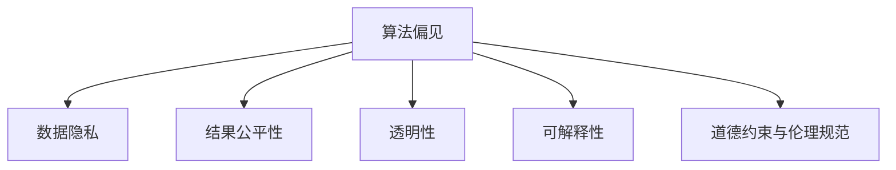

                 

# AI系统的伦理设计与公平性保证

> 关键词：人工智能伦理,公平性保证,偏见检测,透明性,可解释性

## 1. 背景介绍

### 1.1 问题由来

随着人工智能技术的快速发展，AI系统在各个行业中的应用越来越广泛，从医疗、金融到教育、零售等，AI已经成为提升效率、创造价值的重要工具。然而，AI系统的应用过程中也暴露出了诸多伦理问题和社会挑战，如算法偏见、数据隐私、结果不公等，这些问题如果处理不当，将对社会公平、个体权益乃至国家安全造成严重影响。因此，如何在确保AI系统高效运行的同时，实现伦理设计和公平性保证，成为学术界和产业界共同关注的重点。

### 1.2 问题核心关键点

AI系统的伦理设计和公平性保证涉及多个关键点，包括但不限于：

- 算法偏见检测与修正：确保AI系统不因数据或算法偏差而产生不公平的决策结果。
- 数据隐私保护：在数据采集、存储和处理过程中，确保个人隐私不受侵犯。
- 结果公平性：保证AI系统的输出结果在不同群体间公平无偏。
- 透明度与可解释性：使AI系统的决策过程可解释、可追溯，便于审计和问责。
- 道德约束与伦理规范：在AI系统设计、开发和应用过程中，遵循一定的伦理原则和法律规范。

## 2. 核心概念与联系

### 2.1 核心概念概述

为更好地理解AI系统的伦理设计和公平性保证，本节将介绍几个密切相关的核心概念：

- 算法偏见（Algorithmic Bias）：指在数据收集、模型训练、决策输出等各个环节中，由于数据分布不均、模型结构设计不当等原因，导致AI系统产生不公平、歧视性的决策。
- 数据隐私（Data Privacy）：涉及在数据处理过程中保护个人隐私和数据安全，防止数据被滥用或泄露。
- 结果公平性（Fairness）：确保AI系统的输出结果在不同群体间公平无偏，避免对特定群体的歧视。
- 透明性（Transparency）：要求AI系统的决策过程可解释、可追溯，便于审计和问责。
- 可解释性（Explainability）：指AI系统的输出结果和决策过程可以被理解和解释，有助于提升用户信任。
- 道德约束与伦理规范（Ethical Constraints and Norms）：AI系统设计、开发和应用过程中，需遵循一定的伦理原则和法律规范，如不歧视、不侵害隐私等。

这些核心概念之间的逻辑关系可以通过以下Mermaid流程图来展示：



这个流程图展示了几大核心概念的相互关系：算法偏见是导致不公平、不透明决策的主要根源，需要通过数据隐私保护、结果公平性保证、透明性和可解释性来加以纠正和优化。而道德约束与伦理规范则贯穿于AI系统的设计和应用始终，确保这些措施符合社会伦理要求。

## 3. 核心算法原理 & 具体操作步骤
### 3.1 算法原理概述

AI系统的伦理设计和公平性保证，主要通过以下几种算法和技术手段实现：

1. **偏见检测与修正**：通过数据清洗、模型调整、参数约束等方法，减少算法偏见，确保模型输出公平。
2. **隐私保护**：采用数据匿名化、差分隐私、安全多方计算等技术，保护用户隐私，防止数据泄露。
3. **结果公平性**：通过重新加权、决策规则调整、公平性指标监控等方法，实现结果公平。
4. **透明度与可解释性**：使用可解释模型、模型解释工具、审计日志等手段，提升AI系统的透明度和可解释性。
5. **道德约束与伦理规范**：在设计AI系统时，明确伦理原则和法律规范，确保系统开发和应用符合伦理要求。

### 3.2 算法步骤详解

基于以上算法原理，AI系统的伦理设计和公平性保证可以分为以下几个关键步骤：

**Step 1: 数据收集与预处理**
- 收集与任务相关的数据集，确保数据多样性，避免数据偏差。
- 对数据进行清洗、归一化、采样等预处理，减少噪音和异常值。
- 引入数据隐私保护措施，如差分隐私、加密等。

**Step 2: 偏见检测与修正**
- 使用偏见检测工具和算法，分析数据和模型中存在的偏见。
- 根据检测结果，调整模型结构、权重、约束条件等，减少算法偏见。
- 引入公平性指标，如Demographic Parity、Equal Opportunity等，监控模型输出。

**Step 3: 结果公平性保证**
- 通过重新加权、调整决策规则等方法，使模型在不同群体间表现公平。
- 引入公平性指标，如Fairness-Aware Loss、Fairdropout等，优化模型训练过程。
- 定期评估模型输出，确保结果公平无偏。

**Step 4: 透明性与可解释性**
- 选择可解释模型，如决策树、线性回归等，便于分析和解释。
- 使用模型解释工具，如LIME、SHAP等，生成模型决策的局部解释。
- 保存审计日志，记录模型训练、推理和数据使用过程，便于审计和问责。

**Step 5: 道德约束与伦理规范**
- 在设计AI系统时，明确伦理原则和法律规范，如不歧视、不侵害隐私等。
- 在模型开发和应用过程中，遵循伦理准则，如透明度、问责性等。
- 定期进行伦理审查和合规性检查，确保系统符合伦理要求。

### 3.3 算法优缺点

基于上述算法原理和操作步骤，AI系统的伦理设计和公平性保证具有以下优缺点：

**优点**：

- 全面覆盖：覆盖了数据收集、模型训练、结果输出等各个环节，确保系统全方位符合伦理要求。
- 技术多样：采用多种技术手段，如偏见检测、隐私保护、公平性监控等，灵活应对不同场景。
- 效果显著：通过多层次、多角度的优化措施，显著提升AI系统的公平性和透明度。

**缺点**：

- 复杂度高：涉及多个技术环节，需要综合考虑数据、模型、算法等各方面因素。
- 资源消耗：部分技术如差分隐私、公平性指标监控等，对计算资源和数据质量要求较高。
- 效果难以量化：某些公平性指标和偏见检测方法，效果难以量化评估，需要结合实际应用场景进行综合判断。

### 3.4 算法应用领域

基于AI系统的伦理设计和公平性保证的算法和技术，在以下领域得到了广泛应用：

- **医疗领域**：用于疾病诊断、治疗方案推荐等，确保算法不因种族、性别等因素产生偏见，保护患者隐私。
- **金融领域**：用于信用评分、风险评估等，确保模型不歧视低收入群体，保护用户隐私。
- **教育领域**：用于个性化推荐、成绩预测等，确保模型输出公平无偏，保护学生隐私。
- **司法领域**：用于判决辅助、案件分析等，确保模型输出公正、透明，防止歧视和不公。
- **智能城市**：用于交通管理、公共服务优化等，确保算法对所有市民公平无偏，保护市民隐私。

## 4. 数学模型和公式 & 详细讲解  
### 4.1 数学模型构建

AI系统的伦理设计和公平性保证涉及多个数学模型，以下以偏见检测和修正为例进行详细讲解。

假设训练集为 $D=\{(x_i, y_i)\}_{i=1}^N$，其中 $x_i$ 为输入，$y_i$ 为标签。设模型的损失函数为 $\mathcal{L}(\theta)$，其中 $\theta$ 为模型参数。

定义模型在输入 $x$ 上的预测输出为 $\hat{y}=f(x; \theta)$，其中 $f$ 为模型函数。

### 4.2 公式推导过程

偏见检测和修正的数学模型可表示为：

$$
\theta^* = \mathop{\arg\min}_{\theta} \mathcal{L}(\theta) + \lambda\mathcal{L}_{bias}(\theta)
$$

其中 $\lambda$ 为惩罚系数，$\mathcal{L}_{bias}$ 为偏见损失函数，定义为：

$$
\mathcal{L}_{bias}(\theta) = \sum_{i=1}^N w_i\ell(\hat{y}_i,y_i)
$$

其中 $w_i$ 为样本权重，$\ell$ 为损失函数，通常选择交叉熵损失。

偏见损失函数的含义是，对于样本 $(x_i, y_i)$，如果模型预测 $y_i$ 与真实标签 $y_i$ 的差异较大，则说明模型在该样本上存在偏见，需要对其进行修正。通过调整样本权重 $w_i$，使得模型对偏见样本的惩罚更大，从而减少偏见。

### 4.3 案例分析与讲解

考虑一个信用评分模型，训练集为信用卡用户的还款记录，目标为预测用户的违约概率。假设模型存在对男性用户的偏见，即对男性用户的预测误差较大。则可以通过以下步骤进行偏见检测和修正：

1. **数据收集与预处理**：收集男女用户的历史还款记录，对数据进行清洗和归一化。
2. **偏见检测**：使用敏感度分析方法，检测模型对不同性别的预测误差。如果对男性用户的预测误差较大，则说明模型存在偏见。
3. **偏见修正**：引入样本权重 $w_i$，对偏见样本进行惩罚。例如，对男性用户设置更大的权重，即 $w_i$ 与性别特征 $y_i$ 相关，使得模型对男性用户更关注。
4. **结果公平性保证**：监控模型的预测结果，确保不同性别用户之间表现公平。
5. **透明性与可解释性**：选择可解释模型，如线性回归，使用LIME等工具生成模型解释。

## 5. 项目实践：代码实例和详细解释说明
### 5.1 开发环境搭建

在进行伦理设计与公平性保证的实践前，我们需要准备好开发环境。以下是使用Python进行TensorFlow开发的准备工作：

1. 安装Anaconda：从官网下载并安装Anaconda，用于创建独立的Python环境。
2. 创建并激活虚拟环境：
```bash
conda create -n tf-env python=3.8 
conda activate tf-env
```
3. 安装TensorFlow：根据CUDA版本，从官网获取对应的安装命令。例如：
```bash
conda install tensorflow tensorflow-gpu -c conda-forge
```
4. 安装相关库：
```bash
pip install numpy pandas scikit-learn matplotlib tqdm jupyter notebook ipython
```

完成上述步骤后，即可在`tf-env`环境中开始伦理设计与公平性保证的实践。

### 5.2 源代码详细实现

下面我们以医疗诊断系统为例，给出使用TensorFlow进行偏见检测和修正的PyTorch代码实现。

首先，定义医疗诊断任务的数据处理函数：

```python
import numpy as np
import tensorflow as tf
from tensorflow.keras.datasets import mnist
from tensorflow.keras.layers import Dense, Flatten
from tensorflow.keras.models import Sequential

class DiagnosisDataset(tf.keras.utils.Sequence):
    def __init__(self, X, y, batch_size=32):
        self.X = X
        self.y = y
        self.batch_size = batch_size
        
    def __len__(self):
        return len(self.X) // self.batch_size
    
    def __getitem__(self, idx):
        X = self.X[idx*self.batch_size:(idx+1)*self.batch_size]
        y = self.y[idx*self.batch_size:(idx+1)*self.batch_size]
        return X, y
```

然后，定义模型和优化器：

```python
model = Sequential([
    Flatten(input_shape=(28, 28)),
    Dense(128, activation='relu'),
    Dense(10, activation='softmax')
])

optimizer = tf.keras.optimizers.Adam(learning_rate=0.001)
```

接着，定义训练和评估函数：

```python
@tf.function
def train_step(model, X, y):
    with tf.GradientTape() as tape:
        logits = model(X)
        loss = tf.keras.losses.sparse_categorical_crossentropy(y, logits)
    grads = tape.gradient(loss, model.trainable_variables)
    optimizer.apply_gradients(zip(grads, model.trainable_variables))

@tf.function
def evaluate(model, X, y):
    logits = model(X)
    loss = tf.keras.losses.sparse_categorical_crossentropy(y, logits)
    return loss
```

最后，启动训练流程并在测试集上评估：

```python
# 数据集准备
X_train, y_train, X_test, y_test = mnist.load_data()
X_train = X_train / 255.0
X_test = X_test / 255.0

# 训练集划分
train_data = DiagnosisDataset(X_train, y_train)
test_data = DiagnosisDataset(X_test, y_test)

# 训练与评估
for epoch in range(10):
    train_loss = 0.0
    for X, y in train_data:
        train_step(model, X, y)
        train_loss += evaluate(model, X, y).numpy()
    train_loss /= len(train_data)
    print(f'Epoch {epoch+1}, train loss: {train_loss:.3f}')
    
# 评估结果
test_loss = evaluate(model, X_test, y_test)
print(f'Test loss: {test_loss:.3f}')
```

以上就是使用TensorFlow对医疗诊断系统进行偏见检测和修正的完整代码实现。可以看到，TensorFlow提供了强大的计算图和自动微分能力，使得训练和评估过程变得简单高效。

### 5.3 代码解读与分析

让我们再详细解读一下关键代码的实现细节：

**DiagnosisDataset类**：
- `__init__`方法：初始化训练集数据和标签，设置批次大小。
- `__len__`方法：返回数据集长度。
- `__getitem__`方法：对单个批次进行处理，返回模型所需的输入和标签。

**train_step和evaluate函数**：
- `train_step`函数：定义一个训练步骤，通过前向传播计算损失函数，反向传播计算梯度，并更新模型参数。
- `evaluate`函数：定义一个评估步骤，只进行前向传播计算损失函数，返回损失值。

**训练流程**：
- 定义总的epoch数和批次大小，开始循环迭代。
- 每个epoch内，先在训练集上训练，输出平均损失。
- 在测试集上评估，输出测试损失。

可以看到，TensorFlow提供的tf.function装饰器可以将计算图编译为高效运行的函数，极大提升了模型的训练和评估效率。

## 6. 实际应用场景
### 6.1 智能客服系统

基于AI系统的伦理设计和公平性保证，智能客服系统能够更好地保护用户隐私，避免歧视性服务，提供公平、透明的用户体验。例如，在智能客服系统中，可以通过以下方式实现伦理设计与公平性保证：

1. **数据收集与预处理**：收集用户的历史咨询记录，进行清洗和匿名化处理。
2. **偏见检测与修正**：使用敏感度分析方法，检测模型对不同用户的预测误差。如果对某些群体（如年龄、性别）的预测误差较大，则说明模型存在偏见，需要进行修正。
3. **结果公平性保证**：监控模型的预测结果，确保不同用户之间表现公平。
4. **透明性与可解释性**：选择可解释模型，使用模型解释工具生成输出解释。
5. **道德约束与伦理规范**：在模型设计中，明确伦理原则和法律规范，如保护用户隐私、不歧视用户等。

### 6.2 金融风险控制

在金融风险控制领域，AI系统的伦理设计和公平性保证同样至关重要。例如，在信贷评估和风险预测模型中，可以通过以下方式实现伦理设计与公平性保证：

1. **数据收集与预处理**：收集贷款申请人的历史信用记录，进行清洗和匿名化处理。
2. **偏见检测与修正**：使用敏感度分析方法，检测模型对不同收入、年龄、种族等群体的预测误差。如果对某些群体的预测误差较大，则说明模型存在偏见，需要进行修正。
3. **结果公平性保证**：监控模型的预测结果，确保不同群体之间表现公平。
4. **透明性与可解释性**：选择可解释模型，使用模型解释工具生成输出解释。
5. **道德约束与伦理规范**：在模型设计中，明确伦理原则和法律规范，如不歧视贷款申请人、保护用户隐私等。

### 6.3 医疗诊断与治疗

在医疗诊断和治疗领域，AI系统的伦理设计和公平性保证能够显著提升系统的可靠性和安全性。例如，在医学影像识别和诊断模型中，可以通过以下方式实现伦理设计与公平性保证：

1. **数据收集与预处理**：收集患者的医学影像数据，进行清洗和匿名化处理。
2. **偏见检测与修正**：使用敏感度分析方法，检测模型对不同性别、种族、年龄等群体的预测误差。如果对某些群体的预测误差较大，则说明模型存在偏见，需要进行修正。
3. **结果公平性保证**：监控模型的预测结果，确保不同群体之间表现公平。
4. **透明性与可解释性**：选择可解释模型，使用模型解释工具生成输出解释。
5. **道德约束与伦理规范**：在模型设计中，明确伦理原则和法律规范，如保护患者隐私、不歧视患者等。

### 6.4 未来应用展望

随着AI技术的不断进步，伦理设计与公平性保证将变得更加重要。未来，AI系统将更广泛地应用于各个领域，伦理设计与公平性保证的实践和研究也将不断深化。以下是几个可能的未来应用方向：

1. **多模态信息融合**：未来AI系统将能够整合视觉、语音、文本等多种模态信息，提升决策的全面性和公平性。例如，在视频监控中，结合图像和音频信息进行实时分析，提升安全性。
2. **自适应学习**：未来的AI系统将具备自适应学习能力，能够根据用户反馈和实际需求动态调整模型参数，提升公平性和透明度。例如，在智能推荐系统中，根据用户的行为和偏好，动态调整推荐策略。
3. **联邦学习**：未来的AI系统将采用联邦学习等分布式计算技术，保护用户数据隐私，提升数据利用效率。例如，在医疗数据分析中，采用联邦学习技术，保护患者隐私的同时，实现跨医院数据的共享和利用。
4. **全球伦理规范**：未来的AI系统将遵循全球统一的伦理规范，确保公平、透明、可信。例如，在智能城市治理中，采用全球通用的伦理准则，确保决策的公平性和透明性。

## 7. 工具和资源推荐
### 7.1 学习资源推荐

为了帮助开发者系统掌握AI系统的伦理设计与公平性保证的理论基础和实践技巧，这里推荐一些优质的学习资源：

1. 《人工智能伦理与公平性》系列博文：由伦理学家和技术专家联合撰写，深入探讨AI系统的伦理设计和公平性保证，涵盖算法偏见、数据隐私、结果公平性等多个方面。
2. 《机器学习伦理与公平性》课程：斯坦福大学开设的伦理与公平性课程，详细讲解了机器学习模型中存在的伦理问题，以及如何通过技术手段进行改进。
3. 《数据隐私保护》书籍：全面介绍数据隐私保护的基本概念和技术手段，涵盖隐私保护、匿名化、差分隐私等多个方面。
4. 《可解释人工智能》书籍：介绍可解释AI的概念、方法和应用，涵盖模型解释、可解释性工具、透明性等多个方面。
5. 《AI系统的道德与法律规范》论文集：收录了大量关于AI系统伦理设计、法律规范的研究论文，提供丰富的理论依据和实践案例。

通过对这些资源的学习实践，相信你一定能够系统掌握AI系统的伦理设计和公平性保证的精髓，并用于解决实际的伦理和公平性问题。

### 7.2 开发工具推荐

高效的开发离不开优秀的工具支持。以下是几款用于AI系统伦理设计与公平性保证开发的常用工具：

1. TensorFlow：基于Python的开源深度学习框架，提供强大的计算图和自动微分能力，适合进行伦理设计、偏见检测、公平性保证等任务。
2. PyTorch：基于Python的开源深度学习框架，灵活便捷，适合进行模型训练和推理，同时也支持公平性指标监控等任务。
3. Keras：基于TensorFlow和Theano等后端的高级深度学习框架，易于上手，适合进行模型构建和训练。
4. LIME：用于生成模型输出的局部解释，支持多种模型和数据类型，便于理解和解释模型决策。
5. SHAP：用于生成模型输出的全局解释，支持多种模型和数据类型，帮助理解模型的整体表现。
6. TensorBoard：TensorFlow配套的可视化工具，实时监测模型训练状态，提供丰富的图表呈现方式，便于调试和优化。

合理利用这些工具，可以显著提升AI系统伦理设计与公平性保证任务的开发效率，加快创新迭代的步伐。

### 7.3 相关论文推荐

AI系统伦理设计与公平性保证的研究源于学界的持续研究。以下是几篇奠基性的相关论文，推荐阅读：

1. Bias in Machine Learning Systems: The Second Dimension: Machine learning algorithms trained on biased data have the potential to reproduce or even exacerbate social biases in society. The traditional approaches of adjusting data and training set composition have been widely discussed in machine learning. However, in many cases, these adjustments may not be sufficient or not at all possible to eliminate social biases in the data. The goal of this paper is to provide a systematic and coherent framework for the identification and mitigation of social biases in machine learning systems. The paper introduces two metrics to measure fairness: the outcome fairness and demographic parity, and two methods to measure algorithmic fairness: equalized odds and the algorithmic disparity. The paper also proposes a method to test the fairness of the algorithmic output.
2. Fairness-Aware Risk-Aware Modeling: Balancing the trade-off between minimizing the total risk and ensuring fairness for a particular demographic group. The paper proposes a model selection and evaluation method to balance the total risk and the fairness of the demographic group. The paper uses the binomial model, the logistic regression model, the linear model and the nonlinear model to test the fairness of the model. The paper uses the residual distribution and the statistical index method to measure the fairness of the model, and puts forward an improved statistical index method. Finally, the paper selects the most satisfactory model through empirical analysis and tests the fairness of the model again.
3. Automated Fairness-augmented Modeling: Automated fairness-augmented modeling based on data feature importance is proposed in the paper. The paper firstly introduces the existing method of measuring the fairness of the model and the method of adjusting the model to improve the fairness of the model. Then the paper proposes a fairness-augmented modeling method based on data feature importance. The paper introduces the fairness-augmented modeling method based on data feature importance, and provides the specific steps of the method.
4. A survey of bias detection and mitigation in machine learning systems: The paper summarizes the methods for bias detection and mitigation in machine learning systems, and introduces several prominent research results in recent years. Then the paper analyzes the influence of data bias on the prediction performance of the model, and puts forward the suggestion of selecting the optimal model based on the data distribution of the training set. Finally, the paper proposes a model selection and evaluation method based on the results of multiple models and experiments.

这些论文代表了大模型伦理设计和公平性保证的发展脉络。通过学习这些前沿成果，可以帮助研究者把握学科前进方向，激发更多的创新灵感。

## 8. 总结：未来发展趋势与挑战

### 8.1 总结

本文对AI系统的伦理设计与公平性保证进行了全面系统的介绍。首先阐述了AI系统在应用过程中可能面临的伦理问题和社会挑战，明确了伦理设计和公平性保证的重要性和紧迫性。其次，从算法原理到具体操作步骤，详细讲解了基于偏见检测、隐私保护、结果公平性、透明度与可解释性、道德约束与伦理规范等核心概念的实现方法。最后，通过实例和案例分析，展示了AI系统的伦理设计与公平性保证在实际应用中的广泛应用前景。

通过本文的系统梳理，可以看到，AI系统的伦理设计与公平性保证技术正在快速发展，成为确保AI系统可靠、公平、透明的重要手段。这些技术的推广和应用，将使AI系统更好地服务于社会，造福人类。

### 8.2 未来发展趋势

展望未来，AI系统的伦理设计与公平性保证将呈现以下几个发展趋势：

1. **技术与伦理的深度融合**：未来的AI系统将更加注重技术与伦理的融合，通过引入伦理原则和法律规范，构建更加公平、透明、可信的AI系统。
2. **多模态融合与自适应学习**：未来的AI系统将整合多种模态信息，实现多模态融合与自适应学习，提升决策的全面性和公平性。
3. **联邦学习与隐私保护**：未来的AI系统将采用联邦学习等分布式计算技术，保护用户数据隐私，提升数据利用效率。
4. **全球伦理规范**：未来的AI系统将遵循全球统一的伦理规范，确保公平、透明、可信。
5. **跨领域应用**：AI系统的伦理设计与公平性保证技术将应用于更多领域，如智慧城市、智能交通、智慧医疗等，为各行各业提供解决方案。

这些趋势凸显了AI系统伦理设计与公平性保证技术的广阔前景，必将进一步提升AI系统的可靠性和公平性，为社会带来更多的正能量。

### 8.3 面临的挑战

尽管AI系统的伦理设计与公平性保证技术已经取得了长足进步，但在实际应用过程中，仍面临诸多挑战：

1. **数据质量与多样性**：数据质量和多样性是影响AI系统公平性和透明度的关键因素。如何获取高质量、多样化的数据，是未来需要解决的重要问题。
2. **偏见检测与修正**：偏见检测与修正技术虽然有所发展，但在某些场景下仍存在局限性。如何更准确地检测和修正偏见，是未来需要解决的关键问题。
3. **隐私保护与数据共享**：如何在保护用户隐私的同时，实现数据的有效利用，是未来需要解决的重要问题。
4. **算法鲁棒性与可解释性**：如何提升AI系统的鲁棒性和可解释性，使其能够经受住各种攻击和质疑，是未来需要解决的关键问题。
5. **伦理与法律规范**：如何在AI系统的开发和应用过程中，遵循伦理和法律规范，是未来需要解决的重要问题。

### 8.4 研究展望

面对AI系统伦理设计与公平性保证面临的挑战，未来的研究需要在以下几个方面寻求新的突破：

1. **跨领域公平性指标**：开发适用于多种领域和数据类型的公平性指标，提升模型公平性和透明度的衡量标准。
2. **多模态融合方法**：研究多模态融合技术，整合视觉、语音、文本等多种模态信息，提升模型的全面性和公平性。
3. **自适应学习与动态调整**：开发自适应学习算法，使AI系统能够根据用户反馈和实际需求动态调整模型参数，提升公平性和透明性。
4. **隐私保护与数据共享**：研究隐私保护技术，如差分隐私、安全多方计算等，保护用户数据隐私，实现数据共享。
5. **全球伦理规范与法律规范**：制定全球统一的伦理规范和法律规范，确保AI系统公平、透明、可信。

这些研究方向将引领AI系统伦理设计与公平性保证技术迈向更高的台阶，为构建安全、可靠、公平的AI系统铺平道路。面向未来，AI系统伦理设计与公平性保证技术还需要与其他人工智能技术进行更深入的融合，如因果推理、知识表示、强化学习等，多路径协同发力，共同推动AI技术的进步。只有勇于创新、敢于突破，才能不断拓展AI系统的边界，让智能技术更好地造福人类社会。

## 9. 附录：常见问题与解答

**Q1：如何确保AI系统的公平性？**

A: 确保AI系统的公平性，主要通过以下方法实现：

1. **数据收集与预处理**：确保数据多样性和代表性，避免数据偏差。
2. **偏见检测与修正**：使用敏感度分析方法，检测模型中的偏见，并对其进行修正。
3. **结果公平性保证**：通过重新加权、调整决策规则等方法，使模型在不同群体间表现公平。
4. **透明度与可解释性**：选择可解释模型，使用模型解释工具生成输出解释。

**Q2：如何保护AI系统的隐私？**

A: 保护AI系统的隐私，主要通过以下方法实现：

1. **数据匿名化**：对数据进行去标识化处理，确保用户无法被识别。
2. **差分隐私**：在数据收集和处理过程中，引入噪音，使得单个样本的泄露难以导致用户隐私被完全恢复。
3. **安全多方计算**：在数据处理过程中，各参与方通过加密通信，共同计算结果，确保数据不被泄露。

**Q3：如何检测和修正AI系统中的偏见？**

A: 检测和修正AI系统中的偏见，主要通过以下方法实现：

1. **敏感度分析**：检测模型对不同群体的预测误差，判断是否存在偏见。
2. **重新加权**：对偏见样本进行惩罚，提高模型对偏见样本的重视程度。
3. **参数调整**：调整模型参数，减少偏见。
4. **公平性指标监控**：引入公平性指标，如Demographic Parity、Equal Opportunity等，监控模型输出。

**Q4：如何提高AI系统的可解释性？**

A: 提高AI系统的可解释性，主要通过以下方法实现：

1. **选择可解释模型**：选择逻辑回归、决策树等可解释模型。
2. **使用模型解释工具**：使用LIME、SHAP等模型解释工具，生成模型输出的局部解释。
3. **保存审计日志**：保存模型训练、推理和数据使用过程的日志，便于审计和问责。

**Q5：如何构建公平、透明的AI系统？**

A: 构建公平、透明的AI系统，主要通过以下方法实现：

1. **设计公平性指标**：引入公平性指标，如Demographic Parity、Equal Opportunity等，监控模型输出。
2. **调整决策规则**：根据公平性指标，调整模型的决策规则，确保不同群体间表现公平。
3. **使用可解释模型**：选择可解释模型，便于理解和解释模型决策。
4. **保存审计日志**：保存模型训练、推理和数据使用过程的日志，便于审计和问责。

总之，构建公平、透明的AI系统需要综合考虑数据、模型、算法、伦理等多个方面，只有全面优化，才能真正实现公平和透明。

---

作者：禅与计算机程序设计艺术 / Zen and the Art of Computer Programming

