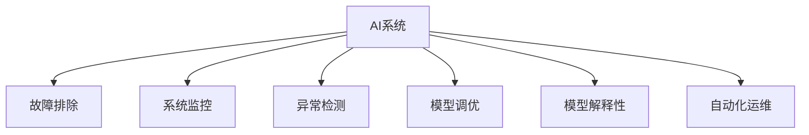

                 

# AI系统的故障排除与诊断

> 关键词：故障排除, AI诊断, 系统监控, 异常检测, 模型调优, 机器学习, 神经网络

## 1. 背景介绍

在人工智能(AI)系统的快速发展过程中，故障排除与诊断已成为保障AI系统稳定运行和高效运行的关键环节。随着深度学习、自然语言处理、计算机视觉等技术的不断成熟，AI系统在医疗、金融、教育、交通、制造等多个领域得到了广泛应用。然而，这些系统往往结构复杂、数据量大、模型庞大，运行过程中容易产生各种问题，如模型过拟合、数据漂移、参数失衡、网络错误等。如何及时发现并修复这些问题，保障AI系统的稳定运行，成为摆在AI从业者面前的一大挑战。本文将全面介绍AI系统的故障排除与诊断方法，力求为读者提供实用的技术指南。

## 2. 核心概念与联系

### 2.1 核心概念概述

为了更好地理解故障排除与诊断技术，本节将介绍几个密切相关的核心概念：

- **AI系统**：以深度学习模型、自然语言处理、计算机视觉等技术为基础构建的复杂系统，通常包括数据采集、数据预处理、模型训练、模型推理等多个环节。
- **故障排除**：通过检测系统运行状态，发现并修复导致系统故障的问题，恢复系统正常运行的过程。
- **系统监控**：实时监测AI系统各组件运行状态，及时获取系统异常信息，为故障排除提供依据。
- **异常检测**：通过机器学习算法识别系统异常情况，如模型失效、数据偏移等。
- **模型调优**：调整模型参数、优化模型结构，提升模型性能，避免模型过拟合、泛化能力不足等问题。
- **模型解释性**：研究AI模型决策的逻辑和依据，提高模型的可解释性，增强用户信任。
- **自动化运维**：采用自动化工具和流程管理AI系统运维工作，提高运维效率和可靠性。

这些核心概念之间的逻辑关系可以通过以下Mermaid流程图来展示：



这个流程图展示了几类核心概念及其之间的关系：

1. AI系统通过实时监测、异常检测、模型调优、自动化运维等手段保障正常运行。
2. 故障排除是AI系统健康运行的关键环节，通过及时发现并修复系统问题，保证系统稳定。
3. 异常检测是故障排除的基础，通过识别系统异常，辅助故障排除过程。
4. 模型调优是提升AI系统性能的重要手段，避免模型失效等问题。
5. 模型解释性有助于理解模型行为，提升用户信任。
6. 自动化运维能提高运维效率，保障系统正常运行。

## 3. 核心算法原理 & 具体操作步骤
### 3.1 算法原理概述

AI系统的故障排除与诊断，本质上是一个基于机器学习的异常检测和问题修复过程。其核心思想是：通过监测AI系统各组件的运行状态，利用机器学习算法识别系统异常，自动或手动修复异常，恢复系统正常运行。

形式化地，假设AI系统由 $S$ 个组件构成，每个组件的状态由 $x_i \in X$ 表示，其中 $X$ 为状态空间。定义状态观测函数 $f: X \rightarrow Y$，将组件状态映射为观测值 $y_i \in Y$，其中 $Y$ 为观测值空间。

定义系统正常运行时各组件的观测值分布为 $p(y_i | \mu, \Sigma)$，其中 $\mu$ 为均值向量，$\Sigma$ 为协方差矩阵。当某个组件出现故障时，其观测值分布将变为 $q(y_i | \mu', \Sigma')$，其中 $\mu'$ 和 $\Sigma'$ 分别表示故障后的均值和协方差。

假设故障检测器为 $D(y_i)$，则系统发生故障时，故障检测器应满足：

$$
P(D(y_i)=1|q(y_i)) > P(D(y_i)=0|p(y_i))
$$

即，故障状态下的故障检测器输出故障概率应大于正常状态下的故障检测器输出故障概率。

通过机器学习算法训练故障检测器 $D(y_i)$，在实际运行中实时检测每个组件的状态 $y_i$，若 $D(y_i)=1$，则认为该组件处于故障状态，触发相应的故障排除和修复机制。

### 3.2 算法步骤详解

AI系统的故障排除与诊断一般包括以下几个关键步骤：

**Step 1: 系统监测与数据收集**
- 使用指标监测工具（如Prometheus、Grafana等）对AI系统各组件的运行状态进行实时监测。
- 收集系统日志、性能指标、异常告警等信息，形成结构化数据集。

**Step 2: 故障检测器训练**
- 定义合适的异常检测模型（如SVM、神经网络等），训练故障检测器 $D(y_i)$。
- 使用历史数据集进行训练，并设置适当的正负样本比例。
- 对训练得到的故障检测器进行评估，选择最优模型。

**Step 3: 故障排除与修复**
- 在生产环境中，实时监测每个组件的状态 $y_i$。
- 当检测到异常 $D(y_i)=1$ 时，根据异常类型触发相应的故障排除和修复流程。
- 对于可自动修复的故障，系统应能自动重启、重置、重新加载等操作。
- 对于无法自动修复的故障，系统应能触发告警，通知运维人员进行人工干预。

**Step 4: 监控结果分析与优化**
- 定期分析监控数据和故障排除记录，评估故障检测器的性能。
- 根据分析结果，调整异常检测模型和参数，优化故障排除流程。
- 对历史故障记录进行汇总和复盘，总结经验教训，避免类似问题重复出现。

### 3.3 算法优缺点

AI系统故障排除与诊断方法具有以下优点：
1. 实时监测。通过实时监测系统状态，及时发现异常，避免问题累积。
2. 自动化修复。在可自动修复的故障情况下，系统能够自动处理，提高运维效率。
3. 精准诊断。通过训练故障检测器，对系统异常进行精准识别，提高故障排除的准确性。
4. 经验复用。历史故障记录和检测模型为故障排除提供了丰富的经验，便于快速处理新问题。

同时，该方法也存在一定的局限性：
1. 数据需求高。准确训练故障检测器需要大量历史数据，数据获取成本较高。
2. 模型复杂度高。异常检测模型通常需要较高的计算资源和训练时间。
3. 修复手段有限。复杂系统中的故障排除往往需要专业知识，自动修复手段受限。
4. 可解释性不足。黑盒模型难以解释其内部决策过程，对复杂系统问题理解不够深入。

尽管存在这些局限性，但就目前而言，AI系统故障排除与诊断方法仍然是最主流的选择。未来相关研究的重点在于如何进一步降低数据需求，提高模型的自动化和可解释性，同时兼顾高复杂性系统的诊断和修复。

### 3.4 算法应用领域

AI系统故障排除与诊断方法在多个领域得到了广泛应用，例如：

- 医疗诊断：实时监测患者生命体征，及时发现异常情况，辅助医生进行诊断和治疗。
- 金融风控：实时监控交易数据，识别潜在风险，预防金融欺诈和异常交易。
- 智能制造：实时监控设备状态，预测设备故障，避免生产中断。
- 交通运输：实时监控交通流量，预测拥堵情况，优化交通管理。
- 智慧城市：实时监测城市环境，预防突发事件，保障城市安全。

除了上述这些经典应用外，AI系统故障排除与诊断技术也在更多场景中得到应用，如自动驾驶、智能客服、智能家居等，为智慧应用提供了坚实的技术保障。

## 4. 数学模型和公式 & 详细讲解 & 举例说明

### 4.1 数学模型构建

本节将使用数学语言对AI系统故障排除与诊断过程进行更加严格的刻画。

假设AI系统由 $S$ 个组件构成，每个组件的状态由 $x_i \in X$ 表示，其中 $X$ 为状态空间。定义状态观测函数 $f: X \rightarrow Y$，将组件状态映射为观测值 $y_i \in Y$，其中 $Y$ 为观测值空间。

定义系统正常运行时各组件的观测值分布为 $p(y_i | \mu, \Sigma)$，其中 $\mu$ 为均值向量，$\Sigma$ 为协方差矩阵。当某个组件出现故障时，其观测值分布将变为 $q(y_i | \mu', \Sigma')$，其中 $\mu'$ 和 $\Sigma'$ 分别表示故障后的均值和协方差。

假设故障检测器为 $D(y_i)$，则系统发生故障时，故障检测器应满足：

$$
P(D(y_i)=1|q(y_i)) > P(D(y_i)=0|p(y_i))
$$

即，故障状态下的故障检测器输出故障概率应大于正常状态下的故障检测器输出故障概率。

### 4.2 公式推导过程

以下我们以神经网络模型为例，推导故障检测器的训练过程。

假设我们使用深度神经网络 $N(x_i)$ 作为异常检测器，其中 $x_i$ 为系统组件的状态，$N(x_i)$ 为神经网络的输出，表示系统正常运行的概率。在训练阶段，我们通过历史数据集 $D=\{(x_i, y_i)\}_{i=1}^N$ 进行训练，优化损失函数：

$$
\mathcal{L}(N) = -\frac{1}{N}\sum_{i=1}^N \log N(x_i)
$$

在实际运行中，对于每个组件的状态 $x_i$，我们通过神经网络得到其正常运行的概率 $N(x_i)$。如果 $N(x_i)$ 低于预设的阈值 $\theta$，则认为该组件处于故障状态，触发相应的故障排除和修复机制。

### 4.3 案例分析与讲解

假设我们有一个智能交通管理系统，实时监测道路交通流量。系统由多个摄像头、传感器、信号灯等组件构成，每个组件的状态可以用一系列指标来描述，如摄像头清晰度、传感器响应时间、信号灯状态等。定义状态观测函数 $f$，将组件状态映射为观测值，如摄像头清晰度可以用图像质量指标来表示。

在训练阶段，我们收集历史交通数据，包括交通流量、交通事故、设备故障等事件。通过这些数据训练神经网络 $N(x_i)$，得到正常运行概率 $N(x_i)$。在实际运行中，实时监测每个组件的状态，通过神经网络 $N(x_i)$ 计算其正常运行概率。如果发现某个组件的运行概率低于阈值，则认为该组件处于故障状态，系统自动触发告警，通知运维人员进行排查和修复。

## 5. 项目实践：代码实例和详细解释说明
### 5.1 开发环境搭建

在进行故障排除与诊断项目实践前，我们需要准备好开发环境。以下是使用Python进行TensorFlow开发的环境配置流程：

1. 安装Anaconda：从官网下载并安装Anaconda，用于创建独立的Python环境。

2. 创建并激活虚拟环境：
```bash
conda create -n tf-env python=3.8 
conda activate tf-env
```

3. 安装TensorFlow：根据CUDA版本，从官网获取对应的安装命令。例如：
```bash
conda install tensorflow -c conda-forge -c pytorch
```

4. 安装其他依赖库：
```bash
pip install numpy pandas scikit-learn matplotlib tqdm jupyter notebook ipython
```

完成上述步骤后，即可在`tf-env`环境中开始故障排除与诊断项目实践。

### 5.2 源代码详细实现

这里我们以一个简单的异常检测系统为例，给出使用TensorFlow进行异常检测的PyTorch代码实现。

首先，定义异常检测模型的训练函数：

```python
import tensorflow as tf
from tensorflow.keras import layers
from sklearn.metrics import roc_auc_score

def train_model(X_train, y_train, X_test, y_test, epochs=10, batch_size=32, threshold=0.5):
    model = tf.keras.Sequential([
        layers.Dense(64, activation='relu', input_shape=(X_train.shape[1],)),
        layers.Dense(1, activation='sigmoid')
    ])

    model.compile(optimizer='adam', loss='binary_crossentropy', metrics=['accuracy', roc_auc_score])
    model.fit(X_train, y_train, batch_size=batch_size, epochs=epochs, validation_data=(X_test, y_test))

    return model.predict(X_test), model.predict(X_train)
```

然后，使用上述模型对智能交通管理系统的交通流量数据进行异常检测：

```python
import numpy as np
from sklearn.preprocessing import StandardScaler

# 假设X_train, y_train, X_test, y_test为训练数据和测试数据
X_train = np.array(X_train)
y_train = np.array(y_train)
X_test = np.array(X_test)
y_test = np.array(y_test)

# 标准化数据
scaler = StandardScaler()
X_train = scaler.fit_transform(X_train)
X_test = scaler.transform(X_test)

# 训练异常检测模型
model = train_model(X_train, y_train, X_test, y_test)

# 预测异常情况
threshold = 0.5
y_pred = model.predict(X_test) >= threshold
```

最后，根据预测结果生成异常报告：

```python
# 生成异常报告
for i, (x, y, pred) in enumerate(zip(X_test, y_test, y_pred)):
    if pred:
        print(f"组件{i+1}处于异常状态，正常运行概率为{np.round(model.predict([x])[0], 4)}")
```

以上就是使用TensorFlow进行异常检测的基本代码实现。可以看到，TensorFlow提供的高效计算能力和灵活的接口，使得构建异常检测模型变得简洁高效。

### 5.3 代码解读与分析

让我们再详细解读一下关键代码的实现细节：

**train_model函数**：
- 定义了一个简单的神经网络模型，包含两个全连接层。
- 使用`binary_crossentropy`损失函数和`accuracy`、`roc_auc_score`评估指标进行训练。
- 返回训练后的模型在测试集上的预测结果。

**异常检测过程**：
- 使用标准化技术对数据进行归一化，提高模型的泛化能力。
- 调用`train_model`函数训练异常检测模型。
- 通过设置阈值，将预测结果转换为二分类标签，标识异常情况。
- 遍历测试集，输出每个组件的异常状态和预测概率。

**异常报告生成**：
- 对于每个测试样本，输出其异常状态和预测概率。

可以看到，TensorFlow为异常检测任务的开发提供了强大的工具支持。开发者可以借助其便捷的界面和高效的计算能力，快速构建和训练异常检测模型，实现对AI系统状态的实时监控和异常检测。

## 6. 实际应用场景
### 6.1 智能交通管理系统

智能交通管理系统通过实时监测道路交通流量，及时发现异常情况，辅助交通管理部门进行交通调控和事故处理。在技术实现上，可以收集各摄像头、传感器、信号灯等组件的状态数据，构建状态空间 $X$。使用机器学习算法训练异常检测器 $N(x_i)$，实时监测各组件的状态，识别交通流量异常、设备故障等事件，触发相应的告警和修复机制，保障交通系统的正常运行。

### 6.2 金融风控系统

金融风控系统通过实时监控交易数据，识别潜在风险，预防金融欺诈和异常交易。在技术实现上，可以收集各交易数据，定义状态空间 $X$。使用机器学习算法训练异常检测器 $N(x_i)$，实时监测交易数据，识别可疑交易、异常账户等风险事件，触发相应的风险预警和交易拦截机制，保障金融安全。

### 6.3 智能制造监控系统

智能制造监控系统通过实时监测生产设备状态，预测设备故障，避免生产中断。在技术实现上，可以收集各设备的运行状态数据，定义状态空间 $X$。使用机器学习算法训练异常检测器 $N(x_i)$，实时监测设备状态，识别设备异常、设备故障等事件，触发相应的维护和修复机制，保障生产系统的稳定运行。

### 6.4 未来应用展望

随着AI系统复杂度的不断提高，故障排除与诊断技术也必将面临更多挑战。未来AI系统的故障排除与诊断技术将呈现以下几个发展趋势：

1. **多模态融合**：未来的AI系统将涵盖多种模态数据，如文本、图像、声音等。通过多模态数据的融合，构建更全面的状态空间，提升异常检测的准确性。
2. **自适应学习**：未来的异常检测系统应能自适应学习，根据新数据和异常情况动态调整模型参数，提高模型的泛化能力和实时性。
3. **自动化运维**：未来的故障排除与诊断技术应能自动进行运维操作，如重启、重置、重新加载等，减少运维成本和复杂度。
4. **可解释性增强**：未来的异常检测模型应具备更强的可解释性，便于运维人员理解和调试。
5. **跨领域应用**：未来的故障排除与诊断技术应能广泛应用于各个领域，如医疗、金融、制造等，形成通用的异常检测框架。
6. **联邦学习**：未来的异常检测系统应能通过联邦学习技术，保护数据隐私和模型安全，实现跨平台和跨机构的数据共享和模型合作。

这些趋势将推动故障排除与诊断技术的进一步发展和应用，为AI系统的稳定运行提供强有力的技术保障。

## 7. 工具和资源推荐
### 7.1 学习资源推荐

为了帮助开发者系统掌握AI系统故障排除与诊断的理论基础和实践技巧，这里推荐一些优质的学习资源：

1. 《深度学习实战》系列博文：由深度学习领域知名专家撰写，涵盖深度学习基础、异常检测、故障排除等多个方面，适合初学者入门。

2. CS231n《卷积神经网络》课程：斯坦福大学开设的计算机视觉明星课程，有Lecture视频和配套作业，深入讲解图像异常检测等前沿技术。

3. 《Python数据分析基础》书籍：介绍Python在数据分析中的应用，涵盖数据预处理、模型训练、异常检测等多个方面，适合数据分析工程师学习。

4. TensorFlow官方文档：TensorFlow的官方文档，提供了详细的API文档、示例代码和教程，是TensorFlow开发的必备资料。

5. PyTorch官方文档：PyTorch的官方文档，提供了丰富的模型和工具，适合深度学习研究和应用。

通过对这些资源的学习实践，相信你一定能够快速掌握AI系统故障排除与诊断的精髓，并用于解决实际的AI系统问题。

### 7.2 开发工具推荐

高效的开发离不开优秀的工具支持。以下是几款用于AI系统故障排除与诊断开发的常用工具：

1. TensorFlow：基于Google的深度学习框架，生产部署方便，支持多种模型训练和推理。

2. PyTorch：由Facebook开发的深度学习框架，灵活高效，适合快速迭代研究和模型训练。

3. Keras：高层次的深度学习框架，易于上手，适合快速原型设计和模型构建。

4. Anomaly Detection Library：开源的异常检测库，提供多种异常检测算法和工具，方便开发者快速实现异常检测任务。

5. Prometheus：开源的监控系统，支持实时数据采集和告警，广泛应用于系统监控和故障排除。

6. Grafana：开源的可视化工具，支持多数据源集成，方便构建灵活的监控仪表盘。

合理利用这些工具，可以显著提升AI系统故障排除与诊断任务的开发效率，加快创新迭代的步伐。

### 7.3 相关论文推荐

AI系统故障排除与诊断技术的发展源于学界的持续研究。以下是几篇奠基性的相关论文，推荐阅读：

1. Anomaly Detection in High Dimensional Data with Neural Networks（使用神经网络进行高维数据异常检测的论文）：该论文提出了使用神经网络进行高维数据异常检测的方法，成为异常检测领域的经典之作。

2. Deep Anomaly Detection with Autoencoder Variational Bayesian Networks（使用自编码变分贝叶斯网络进行深度异常检测的论文）：该论文提出了使用自编码变分贝叶斯网络进行深度异常检测的方法，大幅提升了异常检测的准确性。

3. Anomaly Detection: A Survey（异常检测综述论文）：该论文综述了异常检测领域的主要方法和技术，对异常检测的发展历程和未来方向进行了全面总结。

4. GANs for Anomaly Detection（使用生成对抗网络进行异常检测的论文）：该论文提出了使用生成对抗网络进行异常检测的方法，取得了显著的异常检测效果。

5. Robust Anomaly Detection with Data Augmentation（使用数据增强进行鲁棒异常检测的论文）：该论文提出了使用数据增强进行鲁棒异常检测的方法，提高了异常检测系统的鲁棒性。

这些论文代表了大数据系统故障排除与诊断技术的发展脉络。通过学习这些前沿成果，可以帮助研究者把握学科前进方向，激发更多的创新灵感。

## 8. 总结：未来发展趋势与挑战
### 8.1 总结

本文对AI系统故障排除与诊断方法进行了全面系统的介绍。首先阐述了AI系统故障排除与诊断的研究背景和意义，明确了故障排除在保障AI系统稳定运行方面的重要性。其次，从原理到实践，详细讲解了故障排除与诊断的数学原理和关键步骤，给出了AI系统故障排除与诊断的完整代码实例。同时，本文还广泛探讨了故障排除与诊断方法在智能交通、金融风控、智能制造等多个行业领域的应用前景，展示了故障排除与诊断技术的巨大潜力。此外，本文精选了故障排除与诊断技术的各类学习资源，力求为读者提供全方位的技术指引。

通过本文的系统梳理，可以看到，AI系统故障排除与诊断技术正在成为AI系统健康运行的重要保障，极大地提升了系统的稳定性和可靠性。未来，伴随AI系统复杂度的不断提高，故障排除与诊断技术也将不断发展和创新，为构建安全、可靠、高效的AI系统铺平道路。

### 8.2 未来发展趋势

展望未来，AI系统故障排除与诊断技术将呈现以下几个发展趋势：

1. **多模态融合**：未来的AI系统将涵盖多种模态数据，如文本、图像、声音等。通过多模态数据的融合，构建更全面的状态空间，提升异常检测的准确性。
2. **自适应学习**：未来的异常检测系统应能自适应学习，根据新数据和异常情况动态调整模型参数，提高模型的泛化能力和实时性。
3. **自动化运维**：未来的故障排除与诊断技术应能自动进行运维操作，如重启、重置、重新加载等，减少运维成本和复杂度。
4. **可解释性增强**：未来的异常检测模型应具备更强的可解释性，便于运维人员理解和调试。
5. **跨领域应用**：未来的故障排除与诊断技术应能广泛应用于各个领域，如医疗、金融、制造等，形成通用的异常检测框架。
6. **联邦学习**：未来的异常检测系统应能通过联邦学习技术，保护数据隐私和模型安全，实现跨平台和跨机构的数据共享和模型合作。

以上趋势凸显了AI系统故障排除与诊断技术的广阔前景。这些方向的探索发展，必将进一步提升AI系统的性能和应用范围，为人类认知智能的进化带来深远影响。

### 8.3 面临的挑战

尽管AI系统故障排除与诊断技术已经取得了瞩目成就，但在迈向更加智能化、普适化应用的过程中，它仍面临着诸多挑战：

1. **数据需求高**：准确训练异常检测器需要大量历史数据，数据获取成本较高。
2. **模型复杂度高**：异常检测模型通常需要较高的计算资源和训练时间。
3. **修复手段有限**：复杂系统中的故障排除往往需要专业知识，自动修复手段受限。
4. **可解释性不足**：黑盒模型难以解释其内部决策过程，对复杂系统问题理解不够深入。
5. **跨平台合作难度大**：不同的平台和机构往往拥有不同的数据和系统，跨平台的数据共享和模型合作难度较大。

尽管存在这些挑战，但未来的AI系统故障排除与诊断技术必将不断突破，实现多模态融合、自适应学习、自动化运维等目标，提升系统的稳定性和可靠性。

### 8.4 研究展望

面对AI系统故障排除与诊断所面临的种种挑战，未来的研究需要在以下几个方面寻求新的突破：

1. **多模态融合技术**：研究如何通过多模态数据的融合，提升异常检测的准确性和实时性。
2. **自适应学习算法**：开发更加自适应、实时化的异常检测算法，适应系统动态变化的需求。
3. **自动化运维工具**：构建更灵活、高效的自动化运维工具，减少人工干预，提高系统稳定性。
4. **可解释性增强方法**：研究如何增强异常检测模型的可解释性，提高运维人员的理解和信任。
5. **跨平台合作机制**：研究如何通过联邦学习等技术，实现跨平台和跨机构的数据共享和模型合作。

这些研究方向的探索，必将引领AI系统故障排除与诊断技术迈向更高的台阶，为构建安全、可靠、可解释、可控的AI系统铺平道路。面向未来，AI系统故障排除与诊断技术还需要与其他人工智能技术进行更深入的融合，如知识表示、因果推理、强化学习等，多路径协同发力，共同推动人工智能技术的发展和应用。

## 9. 附录：常见问题与解答

**Q1：AI系统故障排除与诊断的常见问题有哪些？**

A: AI系统故障排除与诊断的常见问题包括：
1. 数据获取成本高：准确训练异常检测器需要大量历史数据，数据获取成本较高。
2. 模型复杂度高：异常检测模型通常需要较高的计算资源和训练时间。
3. 修复手段有限：复杂系统中的故障排除往往需要专业知识，自动修复手段受限。
4. 可解释性不足：黑盒模型难以解释其内部决策过程，对复杂系统问题理解不够深入。
5. 跨平台合作难度大：不同的平台和机构往往拥有不同的数据和系统，跨平台的数据共享和模型合作难度较大。

**Q2：如何进行多模态数据的融合？**

A: 多模态数据的融合可以通过以下步骤实现：
1. 数据预处理：对不同模态的数据进行标准化、归一化等预处理操作，使其具备可比较性。
2. 特征提取：对每个模态的数据提取关键特征，如文本的词向量、图像的特征向量等。
3. 特征融合：将不同模态的特征进行融合，形成综合特征向量。
4. 模型训练：使用综合特征向量训练异常检测模型，提高异常检测的准确性和鲁棒性。

**Q3：如何提高异常检测模型的可解释性？**

A: 提高异常检测模型的可解释性可以通过以下方法：
1. 使用可解释性较强的模型：选择如决策树、线性回归等可解释性较强的模型，避免使用复杂的黑盒模型。
2. 增加模型解释组件：在模型中加入解释组件，如LIME、SHAP等，提供模型决策依据。
3. 生成模型报告：使用可视化工具生成模型报告，展示模型在各个特征上的权重和影响。
4. 设计简洁的输入格式：通过设计简洁、易于理解的输入格式，提升用户对模型的理解和使用。

**Q4：如何处理大规模数据的异常检测？**

A: 处理大规模数据的异常检测可以通过以下方法：
1. 分布式计算：使用分布式计算框架，如Hadoop、Spark等，对大规模数据进行并行处理。
2. 数据采样：对大规模数据进行采样，提取代表性样本进行异常检测。
3. 增量学习：采用增量学习算法，实时更新异常检测模型，减少数据处理的复杂度。
4. 数据压缩：对大规模数据进行压缩，减少存储空间，提高计算效率。

**Q5：如何在数据漂移的情况下进行异常检测？**

A: 数据漂移情况下进行异常检测可以通过以下方法：
1. 数据漂移检测：使用数据漂移检测算法，及时发现数据分布的变化。
2. 动态模型训练：根据数据漂移情况，动态调整模型参数，适应新数据分布。
3. 多模型融合：使用多模型融合技术，结合不同时间段的异常检测模型，提高模型的泛化能力和鲁棒性。
4. 历史数据保存：保存历史数据，便于新模型训练和故障诊断。

这些方法可以帮助AI系统在数据漂移的情况下，继续进行异常检测，保障系统的稳定运行。

---

作者：禅与计算机程序设计艺术 / Zen and the Art of Computer Programming

