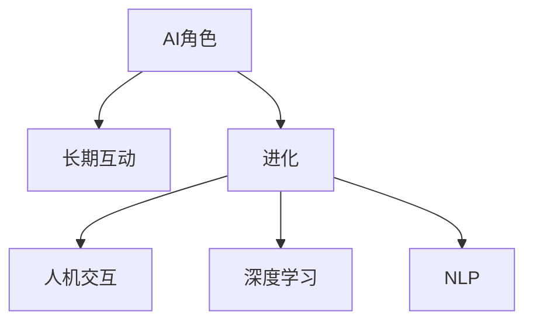

                 

# AI角色演化：长期互动中的人物发展

> 关键词：AI角色,长期互动,进化,人机交互,深度学习,自然语言处理,NLP

## 1. 背景介绍

随着人工智能技术的发展，AI的角色正经历着显著的演化。从简单的决策支持系统到如今的深度学习驱动的智能交互系统，AI在角色定位和功能实现上发生了质的飞跃。本文旨在探讨AI在长期互动中的人物发展，包括其在人机交互、深度学习、自然语言处理等领域的应用及未来趋势。

## 2. 核心概念与联系

### 2.1 核心概念概述

为更好地理解AI角色的演化，本节将介绍几个关键概念：

- **AI角色**：AI在与人类的长期互动中所扮演的角色，包括但不限于助手、教练、决策者、创作者等。
- **长期互动**：指AI与人类的持续交互过程，涵盖了从在线聊天到智能家居的各种应用场景。
- **进化**：AI在技术迭代和应用拓展中的逐步改进和升级。
- **人机交互**：指人类与AI之间的信息交换和行为响应，是AI角色演化的基础。
- **深度学习**：基于神经网络的大规模数据学习技术，使AI具备了更强的模式识别和预测能力。
- **自然语言处理(NLP)**：使AI能够理解和生成自然语言的技术，是实现人机交互的核心。

这些概念之间的逻辑关系可以通过以下Mermaid流程图来展示：



这个流程图展示了这个核心概念之间的逻辑关系：

1. AI角色通过与人类长期互动，实现功能升级和形态进化。
2. 人机交互是AI角色演化的基础，依赖于自然语言处理和深度学习技术。
3. 深度学习技术提高了AI的智能水平，使其能够处理更加复杂的数据和任务。
4. NLP技术使得AI能够理解和生成自然语言，从而实现高效的人机交互。

## 3. 核心算法原理 & 具体操作步骤

### 3.1 算法原理概述

AI角色的进化是基于深度学习和自然语言处理技术的。其核心算法原理包括但不限于：

- **自监督预训练**：通过无标签数据预训练模型，使其具备初始的语义理解和模式识别能力。
- **监督微调**：在有标签数据上微调预训练模型，使其适应特定的任务和应用场景。
- **强化学习**：通过与环境的交互，AI能够不断优化自身的行为策略。

### 3.2 算法步骤详解

基于深度学习和自然语言处理的AI角色进化过程通常包括以下几个关键步骤：

**Step 1: 数据收集与预处理**

1. 收集人类与AI互动的对话数据，包括聊天记录、语音交互、文本消息等。
2. 对数据进行清洗和标注，去除噪声和无关信息。
3. 将文本数据转换为模型可以处理的形式，如Token化、向量化等。

**Step 2: 自监督预训练**

1. 使用大规模无标签数据预训练语言模型，如BERT、GPT等。
2. 在预训练过程中，模型通过各种自监督任务学习语言的表示。
3. 评估预训练模型的性能，选择合适的模型进行下一步微调。

**Step 3: 监督微调**

1. 根据特定的任务需求，准备标注数据集，如分类、匹配、生成等。
2. 选择适当的优化算法和超参数，如AdamW、SGD、学习率等。
3. 使用微调数据集对预训练模型进行优化，使其适应特定任务。
4. 在验证集上评估微调后的模型性能，进行必要的调参和迭代。

**Step 4: 持续学习和优化**

1. 在实际应用中，收集用户反馈和交互数据，持续优化模型。
2. 引入增强学习算法，使AI能够根据用户行为进行动态调整。
3. 定期进行模型复现和微调，保持系统的最新状态。

**Step 5: 评估与部署**

1. 在测试集上评估模型的性能，确保其满足特定应用的需求。
2. 将微调后的模型部署到实际应用系统中，提供服务。
3. 监控系统的运行状态，收集使用数据，进行反馈和改进。

### 3.3 算法优缺点

基于深度学习和自然语言处理的AI角色进化方法具有以下优点：

1. **高效性**：通过大规模数据预训练和微调，AI能够快速适应新任务，实现高效的功能迭代。
2. **通用性**：预训练模型可以应用于多种NLP任务，具有较高的通用性和灵活性。
3. **性能提升**：在特定任务上微调，可以显著提升模型的性能，满足实际应用需求。

同时，该方法也存在一些局限性：

1. **数据依赖**：模型的性能很大程度上取决于标注数据的质量和数量，标注成本较高。
2. **模型复杂性**：大规模深度学习模型的训练和部署需要较高的算力和存储资源。
3. **可解释性**：深度学习模型的决策过程复杂，难以进行解释和调试。
4. **偏差风险**：预训练模型可能存在固有的偏见和有害信息，需要通过微调加以纠正。

尽管存在这些局限性，但就目前而言，基于深度学习和自然语言处理的AI角色进化方法仍然是实现AI功能演进的主流范式。未来相关研究将继续优化模型的性能，提升其在实际应用中的表现。

### 3.4 算法应用领域

基于深度学习和自然语言处理的AI角色进化方法，已经在多个领域得到了广泛应用，包括但不限于：

- **智能客服**：通过微调模型实现智能客服系统的构建，提升客户咨询体验。
- **金融分析**：使用微调后的模型进行金融数据分析，识别风险趋势。
- **医疗诊断**：通过微调模型实现医疗诊断系统的构建，辅助医生进行决策。
- **教育辅助**：构建智能教育系统，提供个性化的学习推荐和辅导。
- **娱乐推荐**：通过微调模型实现个性化内容推荐系统，提高用户体验。
- **智能家居**：通过微调模型实现智能家居控制，提升生活便利性。

除了上述这些领域，AI角色在更多场景中展现出了强大的应用潜力，如自动驾驶、智能制造、智慧城市等，为各行各业带来了新的变革。

## 4. 数学模型和公式 & 详细讲解 & 举例说明

### 4.1 数学模型构建

本节将使用数学语言对AI角色进化的过程进行更严格的刻画。

假设AI角色通过深度学习模型 $M_{\theta}$ 进行进化，其中 $\theta$ 为模型参数。在长期互动过程中，收集到的标注数据集为 $D=\{(x_i,y_i)\}_{i=1}^N$，其中 $x_i$ 为输入数据，$y_i$ 为标签。

定义模型 $M_{\theta}$ 在输入 $x$ 上的损失函数为 $\ell(M_{\theta}(x),y)$，则在数据集 $D$ 上的经验风险为：

$$
\mathcal{L}(\theta) = \frac{1}{N} \sum_{i=1}^N \ell(M_{\theta}(x_i),y_i)
$$

微调的目标是最小化经验风险，即找到最优参数：

$$
\theta^* = \mathop{\arg\min}_{\theta} \mathcal{L}(\theta)
$$

在实践中，我们通常使用基于梯度的优化算法（如AdamW、SGD等）来近似求解上述最优化问题。设 $\eta$ 为学习率，$\lambda$ 为正则化系数，则参数的更新公式为：

$$
\theta \leftarrow \theta - \eta \nabla_{\theta}\mathcal{L}(\theta) - \eta\lambda\theta
$$

其中 $\nabla_{\theta}\mathcal{L}(\theta)$ 为损失函数对参数 $\theta$ 的梯度，可通过反向传播算法高效计算。

### 4.2 公式推导过程

以下我们以分类任务为例，推导交叉熵损失函数及其梯度的计算公式。

假设模型 $M_{\theta}$ 在输入 $x$ 上的输出为 $\hat{y}=M_{\theta}(x) \in [0,1]$，表示样本属于正类的概率。真实标签 $y \in \{0,1\}$。则二分类交叉熵损失函数定义为：

$$
\ell(M_{\theta}(x),y) = -[y\log \hat{y} + (1-y)\log (1-\hat{y})]
$$

将其代入经验风险公式，得：

$$
\mathcal{L}(\theta) = -\frac{1}{N}\sum_{i=1}^N [y_i\log M_{\theta}(x_i)+(1-y_i)\log(1-M_{\theta}(x_i))]
$$

根据链式法则，损失函数对参数 $\theta_k$ 的梯度为：

$$
\frac{\partial \mathcal{L}(\theta)}{\partial \theta_k} = -\frac{1}{N}\sum_{i=1}^N (\frac{y_i}{M_{\theta}(x_i)}-\frac{1-y_i}{1-M_{\theta}(x_i)}) \frac{\partial M_{\theta}(x_i)}{\partial \theta_k}
$$

其中 $\frac{\partial M_{\theta}(x_i)}{\partial \theta_k}$ 可进一步递归展开，利用自动微分技术完成计算。

### 4.3 案例分析与讲解

考虑一个智能客服系统，系统通过微调BERT模型实现对话生成。系统首先对大量客服对话数据进行标注，然后使用这些数据微调预训练的BERT模型，使其能够自动理解和生成客户咨询的回复。具体步骤如下：

1. 收集客服对话数据，进行预处理和标注。
2. 使用BERT模型作为初始化参数，在标注数据上微调。
3. 在验证集上评估模型性能，进行调参和迭代。
4. 将微调后的模型部署到客服系统中，进行实时对话生成。
5. 收集用户反馈和系统交互数据，持续优化模型。

## 5. 项目实践：代码实例和详细解释说明

### 5.1 开发环境搭建

在进行AI角色进化实践前，我们需要准备好开发环境。以下是使用Python进行PyTorch开发的环境配置流程：

1. 安装Anaconda：从官网下载并安装Anaconda，用于创建独立的Python环境。

2. 创建并激活虚拟环境：
```bash
conda create -n pytorch-env python=3.8 
conda activate pytorch-env
```

3. 安装PyTorch：根据CUDA版本，从官网获取对应的安装命令。例如：
```bash
conda install pytorch torchvision torchaudio cudatoolkit=11.1 -c pytorch -c conda-forge
```

4. 安装Transformers库：
```bash
pip install transformers
```

5. 安装各类工具包：
```bash
pip install numpy pandas scikit-learn matplotlib tqdm jupyter notebook ipython
```

完成上述步骤后，即可在`pytorch-env`环境中开始AI角色进化的实践。

### 5.2 源代码详细实现

下面我们以智能客服系统为例，给出使用Transformers库对BERT模型进行微调的PyTorch代码实现。

首先，定义智能客服系统的对话处理函数：

```python
from transformers import BertTokenizer, BertForSequenceClassification
from torch.utils.data import Dataset
import torch

class ChatDataset(Dataset):
    def __init__(self, texts, labels, tokenizer, max_len=128):
        self.texts = texts
        self.labels = labels
        self.tokenizer = tokenizer
        self.max_len = max_len
        
    def __len__(self):
        return len(self.texts)
    
    def __getitem__(self, item):
        text = self.texts[item]
        label = self.labels[item]
        
        encoding = self.tokenizer(text, return_tensors='pt', max_length=self.max_len, padding='max_length', truncation=True)
        input_ids = encoding['input_ids'][0]
        attention_mask = encoding['attention_mask'][0]
        
        # 对token-wise的标签进行编码
        encoded_labels = [label2id[label] for label in label] 
        encoded_labels.extend([label2id['O']] * (self.max_len - len(encoded_labels)))
        labels = torch.tensor(encoded_labels, dtype=torch.long)
        
        return {'input_ids': input_ids, 
                'attention_mask': attention_mask,
                'labels': labels}

# 标签与id的映射
label2id = {'O': 0, 'Answer': 1}
id2label = {v: k for k, v in label2id.items()}

# 创建dataset
tokenizer = BertTokenizer.from_pretrained('bert-base-cased')

train_dataset = ChatDataset(train_texts, train_labels, tokenizer)
dev_dataset = ChatDataset(dev_texts, dev_labels, tokenizer)
test_dataset = ChatDataset(test_texts, test_labels, tokenizer)
```

然后，定义模型和优化器：

```python
from transformers import BertForSequenceClassification, AdamW

model = BertForSequenceClassification.from_pretrained('bert-base-cased', num_labels=len(label2id))

optimizer = AdamW(model.parameters(), lr=2e-5)
```

接着，定义训练和评估函数：

```python
from torch.utils.data import DataLoader
from tqdm import tqdm
from sklearn.metrics import classification_report

device = torch.device('cuda') if torch.cuda.is_available() else torch.device('cpu')
model.to(device)

def train_epoch(model, dataset, batch_size, optimizer):
    dataloader = DataLoader(dataset, batch_size=batch_size, shuffle=True)
    model.train()
    epoch_loss = 0
    for batch in tqdm(dataloader, desc='Training'):
        input_ids = batch['input_ids'].to(device)
        attention_mask = batch['attention_mask'].to(device)
        labels = batch['labels'].to(device)
        model.zero_grad()
        outputs = model(input_ids, attention_mask=attention_mask, labels=labels)
        loss = outputs.loss
        epoch_loss += loss.item()
        loss.backward()
        optimizer.step()
    return epoch_loss / len(dataloader)

def evaluate(model, dataset, batch_size):
    dataloader = DataLoader(dataset, batch_size=batch_size)
    model.eval()
    preds, labels = [], []
    with torch.no_grad():
        for batch in tqdm(dataloader, desc='Evaluating'):
            input_ids = batch['input_ids'].to(device)
            attention_mask = batch['attention_mask'].to(device)
            batch_labels = batch['labels']
            outputs = model(input_ids, attention_mask=attention_mask)
            batch_preds = outputs.logits.argmax(dim=2).to('cpu').tolist()
            batch_labels = batch_labels.to('cpu').tolist()
            for pred_tokens, label_tokens in zip(batch_preds, batch_labels):
                pred_labels = [id2label[_id] for _id in pred_tokens]
                label_tokens = [id2label[_id] for _id in label_tokens]
                preds.append(pred_labels[:len(label_tokens)])
                labels.append(label_tokens)
                
    print(classification_report(labels, preds))
```

最后，启动训练流程并在测试集上评估：

```python
epochs = 5
batch_size = 16

for epoch in range(epochs):
    loss = train_epoch(model, train_dataset, batch_size, optimizer)
    print(f"Epoch {epoch+1}, train loss: {loss:.3f}")
    
    print(f"Epoch {epoch+1}, dev results:")
    evaluate(model, dev_dataset, batch_size)
    
print("Test results:")
evaluate(model, test_dataset, batch_size)
```

以上就是使用PyTorch对BERT进行智能客服系统微调的完整代码实现。可以看到，得益于Transformers库的强大封装，我们可以用相对简洁的代码完成BERT模型的加载和微调。

### 5.3 代码解读与分析

让我们再详细解读一下关键代码的实现细节：

**ChatDataset类**：
- `__init__`方法：初始化文本、标签、分词器等关键组件。
- `__len__`方法：返回数据集的样本数量。
- `__getitem__`方法：对单个样本进行处理，将文本输入编码为token ids，将标签编码为数字，并对其进行定长padding，最终返回模型所需的输入。

**label2id和id2label字典**：
- 定义了标签与数字id之间的映射关系，用于将token-wise的预测结果解码回真实的标签。

**训练和评估函数**：
- 使用PyTorch的DataLoader对数据集进行批次化加载，供模型训练和推理使用。
- 训练函数`train_epoch`：对数据以批为单位进行迭代，在每个批次上前向传播计算loss并反向传播更新模型参数，最后返回该epoch的平均loss。
- 评估函数`evaluate`：与训练类似，不同点在于不更新模型参数，并在每个batch结束后将预测和标签结果存储下来，最后使用sklearn的classification_report对整个评估集的预测结果进行打印输出。

**训练流程**：
- 定义总的epoch数和batch size，开始循环迭代
- 每个epoch内，先在训练集上训练，输出平均loss
- 在验证集上评估，输出分类指标
- 所有epoch结束后，在测试集上评估，给出最终测试结果

可以看到，PyTorch配合Transformers库使得BERT微调的代码实现变得简洁高效。开发者可以将更多精力放在数据处理、模型改进等高层逻辑上，而不必过多关注底层的实现细节。

当然，工业级的系统实现还需考虑更多因素，如模型的保存和部署、超参数的自动搜索、更灵活的任务适配层等。但核心的微调范式基本与此类似。

## 6. 实际应用场景

### 6.1 智能客服系统

基于AI角色进化的对话技术，可以广泛应用于智能客服系统的构建。传统客服往往需要配备大量人力，高峰期响应缓慢，且一致性和专业性难以保证。而使用微调后的对话模型，可以7x24小时不间断服务，快速响应客户咨询，用自然流畅的语言解答各类常见问题。

在技术实现上，可以收集企业内部的历史客服对话记录，将问题和最佳答复构建成监督数据，在此基础上对预训练对话模型进行微调。微调后的对话模型能够自动理解用户意图，匹配最合适的答案模板进行回复。对于客户提出的新问题，还可以接入检索系统实时搜索相关内容，动态组织生成回答。如此构建的智能客服系统，能大幅提升客户咨询体验和问题解决效率。

### 6.2 金融舆情监测

金融机构需要实时监测市场舆论动向，以便及时应对负面信息传播，规避金融风险。传统的人工监测方式成本高、效率低，难以应对网络时代海量信息爆发的挑战。基于AI角色进化的文本分类和情感分析技术，为金融舆情监测提供了新的解决方案。

具体而言，可以收集金融领域相关的新闻、报道、评论等文本数据，并对其进行主题标注和情感标注。在此基础上对预训练语言模型进行微调，使其能够自动判断文本属于何种主题，情感倾向是正面、中性还是负面。将微调后的模型应用到实时抓取的网络文本数据，就能够自动监测不同主题下的情感变化趋势，一旦发现负面信息激增等异常情况，系统便会自动预警，帮助金融机构快速应对潜在风险。

### 6.3 个性化推荐系统

当前的推荐系统往往只依赖用户的历史行为数据进行物品推荐，无法深入理解用户的真实兴趣偏好。基于AI角色进化的个性化推荐系统可以更好地挖掘用户行为背后的语义信息，从而提供更精准、多样的推荐内容。

在实践中，可以收集用户浏览、点击、评论、分享等行为数据，提取和用户交互的物品标题、描述、标签等文本内容。将文本内容作为模型输入，用户的后续行为（如是否点击、购买等）作为监督信号，在此基础上微调预训练语言模型。微调后的模型能够从文本内容中准确把握用户的兴趣点。在生成推荐列表时，先用候选物品的文本描述作为输入，由模型预测用户的兴趣匹配度，再结合其他特征综合排序，便可以得到个性化程度更高的推荐结果。

### 6.4 未来应用展望

随着AI角色进化的不断发展，基于深度学习和自然语言处理的AI角色将呈现以下几个发展趋势：

1. **多模态交互**：除了文本交互外，未来AI角色将更多地引入视觉、语音等多模态信息，实现更全面的人机交互。
2. **情感智能**：通过情感分析，AI角色将具备更强的情绪感知和情感响应能力，提供更自然的人机互动体验。
3. **个性化服务**：基于用户数据和行为分析，AI角色将能够提供高度定制化的服务，满足用户的个性化需求。
4. **主动学习**：AI角色将具备主动学习和自我改进的能力，能够根据用户反馈持续优化自身的行为策略。
5. **跨领域应用**：AI角色将突破现有应用领域，应用于更多行业，如医疗、教育、交通等，提供多领域智能服务。
6. **伦理和隐私保护**：随着AI角色的广泛应用，如何保障用户隐私和数据安全，防止算法偏见和歧视，将成为重要的研究方向。

## 7. 工具和资源推荐

### 7.1 学习资源推荐

为了帮助开发者系统掌握AI角色进化的理论基础和实践技巧，这里推荐一些优质的学习资源：

1. 《深度学习》系列书籍：Ian Goodfellow等作者的作品，详细介绍了深度学习的基本原理和应用场景。
2. 《自然语言处理综论》书籍：Christopher Manning等作者的作品，全面介绍了NLP的理论和实践，涵盖文本处理、情感分析、语义理解等多个方面。
3. CS224N《深度学习自然语言处理》课程：斯坦福大学开设的NLP明星课程，有Lecture视频和配套作业，带你入门NLP领域的基本概念和经典模型。
4. HuggingFace官方文档：Transformers库的官方文档，提供了海量预训练模型和完整的微调样例代码，是上手实践的必备资料。
5. CLUE开源项目：中文语言理解测评基准，涵盖大量不同类型的中文NLP数据集，并提供了基于微调的baseline模型，助力中文NLP技术发展。

通过对这些资源的学习实践，相信你一定能够快速掌握AI角色进化的精髓，并用于解决实际的NLP问题。

### 7.2 开发工具推荐

高效的开发离不开优秀的工具支持。以下是几款用于AI角色进化的开发工具：

1. PyTorch：基于Python的开源深度学习框架，灵活动态的计算图，适合快速迭代研究。大部分预训练语言模型都有PyTorch版本的实现。
2. TensorFlow：由Google主导开发的开源深度学习框架，生产部署方便，适合大规模工程应用。同样有丰富的预训练语言模型资源。
3. Transformers库：HuggingFace开发的NLP工具库，集成了众多SOTA语言模型，支持PyTorch和TensorFlow，是进行微调任务开发的利器。
4. Weights & Biases：模型训练的实验跟踪工具，可以记录和可视化模型训练过程中的各项指标，方便对比和调优。与主流深度学习框架无缝集成。
5. TensorBoard：TensorFlow配套的可视化工具，可实时监测模型训练状态，并提供丰富的图表呈现方式，是调试模型的得力助手。
6. Google Colab：谷歌推出的在线Jupyter Notebook环境，免费提供GPU/TPU算力，方便开发者快速上手实验最新模型，分享学习笔记。

合理利用这些工具，可以显著提升AI角色进化的开发效率，加快创新迭代的步伐。

### 7.3 相关论文推荐

AI角色进化的发展源于学界的持续研究。以下是几篇奠基性的相关论文，推荐阅读：

1. Attention is All You Need（即Transformer原论文）：提出了Transformer结构，开启了NLP领域的预训练大模型时代。
2. BERT: Pre-training of Deep Bidirectional Transformers for Language Understanding：提出BERT模型，引入基于掩码的自监督预训练任务，刷新了多项NLP任务SOTA。
3. Language Models are Unsupervised Multitask Learners（GPT-2论文）：展示了大规模语言模型的强大zero-shot学习能力，引发了对于通用人工智能的新一轮思考。
4. Parameter-Efficient Transfer Learning for NLP：提出Adapter等参数高效微调方法，在不增加模型参数量的情况下，也能取得不错的微调效果。
5. Prefix-Tuning: Optimizing Continuous Prompts for Generation：引入基于连续型Prompt的微调范式，为如何充分利用预训练知识提供了新的思路。
6. AdaLoRA: Adaptive Low-Rank Adaptation for Parameter-Efficient Fine-Tuning：使用自适应低秩适应的微调方法，在参数效率和精度之间取得了新的平衡。

这些论文代表了大语言模型微调技术的发展脉络。通过学习这些前沿成果，可以帮助研究者把握学科前进方向，激发更多的创新灵感。

## 8. 总结：未来发展趋势与挑战

### 8.1 总结

本文对基于深度学习和自然语言处理的AI角色进化过程进行了全面系统的介绍。首先阐述了AI角色在长期互动中的演化过程，明确了其在人机交互、深度学习、自然语言处理等领域的应用及未来趋势。其次，从原理到实践，详细讲解了AI角色进化的数学模型和操作步骤，给出了微调任务开发的完整代码实例。同时，本文还探讨了AI角色在多个行业领域的应用前景，展示了其巨大的应用潜力。

通过本文的系统梳理，可以看到，基于深度学习和自然语言处理的AI角色进化技术正在成为AI系统构建的重要范式，极大地拓展了NLP系统的应用边界，催生了更多的落地场景。受益于大规模数据预训练和微调方法的不断进步，AI角色在构建人机协同的智能时代中扮演越来越重要的角色。未来，伴随预训练语言模型和微调方法的持续演进，相信AI角色将进一步提升其在实际应用中的表现，为各行各业带来更智能、更高效、更人性化的人工智能解决方案。

### 8.2 未来发展趋势

展望未来，AI角色的发展将呈现以下几个趋势：

1. **智能化升级**：随着深度学习技术的进步，AI角色将具备更强的理解和生成能力，能够处理更加复杂的任务。
2. **跨模态融合**：除了文本信息外，AI角色将更多地融合视觉、语音等多模态信息，提供更全面的交互体验。
3. **个性化定制**：基于用户数据和行为分析，AI角色将能够提供高度定制化的服务，满足用户的个性化需求。
4. **伦理和隐私保护**：随着AI角色的广泛应用，如何保障用户隐私和数据安全，防止算法偏见和歧视，将成为重要的研究方向。
5. **跨领域应用**：AI角色将突破现有应用领域，应用于更多行业，如医疗、教育、交通等，提供多领域智能服务。
6. **全球化扩展**：AI角色将逐步实现多语言支持，提供全球化的智能服务，为全球用户提供更便捷、更一致的体验。

### 8.3 面临的挑战

尽管AI角色进化取得了显著进展，但在迈向更加智能化、普适化应用的过程中，它仍面临着诸多挑战：

1. **数据依赖**：AI角色进化依赖于大量高质量标注数据，标注成本较高。如何降低标注成本，提高数据利用效率，仍是一个重要课题。
2. **模型复杂性**：深度学习模型参数量庞大，训练和部署需要高昂的算力支持。如何在保证性能的同时，降低资源消耗，提高计算效率，将是未来的研究方向。
3. **可解释性不足**：深度学习模型的决策过程复杂，难以进行解释和调试。如何提高AI角色的可解释性，使其具备更强的透明度和可信度，将是一个关键问题。
4. **伦理和法律问题**：AI角色的广泛应用可能引发伦理和法律问题，如算法偏见、隐私侵犯等。如何在技术设计中融入伦理和法律约束，确保系统的公平性和安全性，将是一个长期课题。
5. **用户接受度**：尽管AI角色具备诸多优势，但在实际应用中，用户对AI角色的接受度仍需提高。如何设计更自然、更友好的交互界面，提升用户满意度，将是一个重要方向。

尽管存在这些挑战，但通过学界和产业界的共同努力，相信AI角色进化技术将不断取得突破，为人机协同的智能时代带来更广阔的想象空间。

### 8.4 研究展望

面对AI角色进化所面临的挑战，未来的研究需要在以下几个方面寻求新的突破：

1. **无监督和半监督学习**：探索在有限标注数据甚至无标注数据上的学习范式，提高AI角色的泛化能力。
2. **多模态融合技术**：研究如何有效融合视觉、语音、文本等多模态信息，提升AI角色的感知和理解能力。
3. **可解释性增强**：研究如何通过因果推断、知识图谱等方法增强AI角色的可解释性，提升其透明度和可信度。
4. **跨领域知识图谱**：研究如何将跨领域的知识图谱与AI角色结合，增强其跨领域的迁移能力。
5. **伦理和法律框架**：研究如何构建AI角色的伦理和法律框架，确保其在应用中的公平性和安全性。
6. **全球化扩展策略**：研究如何在全球范围内推广AI角色，确保其在多语言、多文化环境下的普适性。

这些研究方向的探索，必将引领AI角色进化技术迈向更高的台阶，为构建安全、可靠、可解释、可控的智能系统铺平道路。面向未来，AI角色进化技术还需要与其他人工智能技术进行更深入的融合，如知识表示、因果推理、强化学习等，多路径协同发力，共同推动自然语言理解和智能交互系统的进步。只有勇于创新、敢于突破，才能不断拓展AI角色的边界，让智能技术更好地造福人类社会。

## 9. 附录：常见问题与解答

**Q1：AI角色进化是否适用于所有NLP任务？**

A: AI角色进化在大多数NLP任务上都能取得不错的效果，特别是对于数据量较小的任务。但对于一些特定领域的任务，如医学、法律等，仅仅依靠通用语料预训练的模型可能难以很好地适应。此时需要在特定领域语料上进一步预训练，再进行微调，才能获得理想效果。此外，对于一些需要时效性、个性化很强的任务，如对话、推荐等，AI角色进化方法也需要针对性的改进优化。

**Q2：如何选择合适的学习率？**

A: AI角色进化的学习率一般要比预训练时小1-2个数量级，如果使用过大的学习率，容易破坏预训练权重，导致过拟合。一般建议从1e-5开始调参，逐步减小学习率，直至收敛。也可以使用warmup策略，在开始阶段使用较小的学习率，再逐渐过渡到预设值。需要注意的是，不同的优化器(如AdamW、Adafactor等)以及不同的学习率调度策略，可能需要设置不同的学习率阈值。

**Q3：采用AI角色进化时会面临哪些资源瓶颈？**

A: 目前主流的预训练大模型动辄以亿计的参数规模，对算力、内存、存储都提出了很高的要求。GPU/TPU等高性能设备是必不可少的，但即便如此，超大批次的训练和推理也可能遇到显存不足的问题。因此需要采用一些资源优化技术，如梯度积累、混合精度训练、模型并行等，来突破硬件瓶颈。同时，模型的存储和读取也可能占用大量时间和空间，需要采用模型压缩、稀疏化存储等方法进行优化。

**Q4：如何缓解AI角色进化的过拟合问题？**

A: 过拟合是AI角色进化的主要挑战之一，尤其是在标注数据不足的情况下。常见的缓解策略包括：
1. 数据增强：通过回译、近义替换等方式扩充训练集
2. 正则化：使用L2正则、Dropout、Early Stopping等避免过拟合
3. 对抗训练：引入对抗样本，提高模型鲁棒性
4. 参数高效微调：只调整少量参数(如Adapter、Prefix等)，减小过拟合风险
5. 多模型集成：训练多个AI角色模型，取平均输出，抑制过拟合

这些策略往往需要根据具体任务和数据特点进行灵活组合。只有在数据、模型、训练、推理等各环节进行全面优化，才能最大限度地发挥AI角色进化的威力。

**Q5：AI角色进化在落地部署时需要注意哪些问题？**

A: 将AI角色进化模型转化为实际应用，还需要考虑以下因素：
1. 模型裁剪：去除不必要的层和参数，减小模型尺寸，加快推理速度
2. 量化加速：将浮点模型转为定点模型，压缩存储空间，提高计算效率
3. 服务化封装：将模型封装为标准化服务接口，便于集成调用
4. 弹性伸缩：根据请求流量动态调整资源配置，平衡服务质量和成本
5. 监控告警：实时采集系统指标，设置异常告警阈值，确保服务稳定性
6. 安全防护：采用访问鉴权、数据脱敏等措施，保障数据和模型安全

AI角色进化为NLP应用开启了广阔的想象空间，但如何将强大的性能转化为稳定、高效、安全的业务价值，还需要工程实践的不断打磨。唯有从数据、算法、工程、业务等多个维度协同发力，才能真正实现人工智能技术在垂直行业的规模化落地。总之，AI角色进化需要开发者根据具体任务，不断迭代和优化模型、数据和算法，方能得到理想的效果。

---

作者：禅与计算机程序设计艺术 / Zen and the Art of Computer Programming

