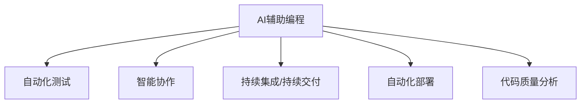

                 

# AI赋能程序员与软件企业

> 关键词：AI赋能，软件企业，程序员，自动化开发，智能协作，软件工程，软件开发，编程辅助，代码质量，项目交付，持续集成，持续交付

## 1. 背景介绍

### 1.1 问题由来

在当前快速变化的软件市场中，如何提高软件企业的开发效率、降低成本，并保持高质量的代码交付，成为每个企业所面临的共同挑战。过去几年中，AI技术在各行各业取得了突飞猛进的进展，正在改变我们的生活方式，而软件工程领域也不例外。随着AI的逐步融入，未来的软件开发方式正在发生着根本性的变革。

### 1.2 问题核心关键点

AI赋能软件企业，主要体现在以下几个方面：

1. **自动化开发**：利用AI自动化工具，减少开发中的重复性工作，提高开发效率。
2. **智能协作**：通过AI辅助，提高团队协作效率，提升开发质量。
3. **软件工程优化**：AI可对代码质量进行智能分析，优化开发流程。
4. **持续交付**：通过AI辅助持续集成(CI)和持续交付(CD)，加速项目交付速度。

本文将从AI赋能软件企业的角度出发，探讨AI技术在软件开发中的应用，并详细介绍其核心原理、操作步骤、数学模型，以及实际应用场景和未来展望。

## 2. 核心概念与联系

### 2.1 核心概念概述

为更好地理解AI在软件开发中的应用，本节将介绍几个密切相关的核心概念：

- **AI辅助编程(AI-Assisted Programming)**：利用AI技术辅助程序员进行代码编写、调试和优化，提高编程效率和代码质量。
- **自动化测试(Automated Testing)**：使用AI工具进行自动化测试，以发现软件缺陷和性能问题。
- **智能协作(Smart Collaboration)**：通过AI技术实现团队协作智能化，提升沟通效率和开发协作质量。
- **持续集成/持续交付(CI/CD)**：利用AI工具加速持续集成和持续交付过程，提高软件交付速度和质量。
- **自动化部署(Automatic Deployment)**：通过AI自动化工具简化部署过程，提高部署效率和稳定性。
- **代码质量分析(Code Quality Analysis)**：利用AI技术进行代码质量智能分析，优化开发过程。

这些核心概念之间的逻辑关系可以通过以下Mermaid流程图来展示：



这个流程图展示了大规模语言模型微调的逻辑关系：

1. 程序员使用AI辅助编程工具，提高开发效率和代码质量。
2. 自动化测试工具对代码进行自动测试，发现并修复潜在问题。
3. 通过智能协作工具，提升团队协作效率。
4. 利用持续集成和持续交付工具，加速软件交付。
5. 自动化部署工具简化部署过程，提高部署效率。
6. 代码质量分析工具对代码进行智能分析，优化开发过程。

这些核心概念共同构成了AI赋能软件开发的技术框架，使得软件企业能够更高效、更灵活地进行软件开发和交付。

## 3. 核心算法原理 & 具体操作步骤

### 3.1 算法原理概述

AI在软件开发中的应用，主要依赖于机器学习和自然语言处理(NLP)技术。其核心思想是通过AI工具自动化执行各种开发任务，辅助程序员进行编程、测试、部署等操作，从而提高软件开发效率和质量。

形式化地，假设我们有一个编程任务 $T$，其中包含代码编写、调试、测试、部署等子任务。AI工具的优化目标是最大化任务完成时间，即找到最优的执行策略：

$$
\max_{A} \sum_{t \in T} f_t(A)
$$

其中，$A$ 为AI工具的执行策略，$f_t(A)$ 为子任务 $t$ 的完成时间。

为了实现这一目标，AI工具通常需要构建一个多任务优化模型，通过学习大量的任务数据，预测每个子任务的完成时间，并采用动态规划、优化算法等方法，找到最优的任务执行顺序。

### 3.2 算法步骤详解

AI辅助软件开发的核心算法步骤包括：

**Step 1: 数据准备**
- 收集与开发任务相关的各类数据，如代码变更记录、缺陷报告、测试用例、部署日志等。
- 对数据进行清洗和标注，构建模型训练所需的样本集。

**Step 2: 模型构建**
- 选择合适的机器学习模型，如决策树、随机森林、深度学习等，设计合适的特征工程流程，构建多任务优化模型。
- 在训练集上训练模型，并使用验证集对模型进行调参和优化。

**Step 3: 应用实施**
- 将训练好的AI模型集成到开发工具中，如IDE、版本控制系统、CI/CD等。
- 利用AI模型辅助程序员进行代码编写、调试、测试、部署等任务。

**Step 4: 性能评估**
- 通过监控工具收集AI辅助后的开发数据，如任务完成时间、代码质量、测试通过率等指标。
- 使用统计方法对数据进行分析，评估AI工具的效果和优化空间。

### 3.3 算法优缺点

AI辅助软件开发的方法具有以下优点：

1. **提高开发效率**：通过自动化工具，减少重复性任务，提高开发速度。
2. **提升代码质量**：利用AI工具对代码进行智能分析，发现并修复潜在问题，提升代码质量。
3. **降低开发成本**：自动化工具减少了人力成本，提高了开发效率。
4. **加速交付速度**：通过持续集成和持续交付工具，加速软件交付，缩短项目周期。

同时，该方法也存在一定的局限性：

1. **依赖高质量数据**：AI模型的效果很大程度上取决于数据的质量和数量，获取高质量数据需要较高的成本。
2. **模型过拟合**：在特定数据集上训练的模型可能对新数据的泛化能力不足，导致过拟合问题。
3. **可解释性不足**：AI模型的决策过程通常缺乏可解释性，难以对其推理逻辑进行分析和调试。
4. **技术门槛较高**：需要具备一定的AI技术背景，才能构建和维护AI辅助工具。

尽管存在这些局限性，但就目前而言，AI辅助软件开发的方法已经在大规模的实际项目中得到了广泛的应用，成为软件开发领域的重要范式。未来相关研究的重点在于如何进一步降低AI工具对数据的需求，提高模型的泛化能力和可解释性，同时降低技术门槛，让更多企业能够轻松应用。

### 3.4 算法应用领域

AI辅助软件开发的方法在软件开发过程中已经得到了广泛的应用，具体如下：

- **代码生成与修复**：利用AI工具自动生成代码片段，或对代码进行自动化修复。
- **代码质量分析**：使用AI工具对代码进行质量检查，如代码风格、可读性、复杂度等。
- **测试用例生成**：利用AI工具自动生成测试用例，提高测试覆盖率。
- **缺陷预测与修复**：使用AI模型预测代码中的潜在缺陷，并指导自动修复。
- **智能代码审查**：使用AI工具辅助代码审查，提升审查效率和质量。
- **自动化部署**：通过AI工具简化部署流程，提高部署效率和稳定性。

除了上述这些经典应用外，AI辅助软件开发的方法还正在被创新性地应用到更多场景中，如可控代码生成、代码重构、API生成等，为软件开发技术带来了全新的突破。随着AI技术的不断进步，相信软件开发方法将得到更大的创新和提升。

## 4. 数学模型和公式 & 详细讲解

### 4.1 数学模型构建

本节将使用数学语言对AI在软件开发中的应用进行更加严格的刻画。

假设我们有一个软件开发任务 $T=\{W, D, T\}$，其中 $W$ 表示代码编写任务，$D$ 表示缺陷修复任务，$T$ 表示测试任务。假设每个任务需要的时间为 $w$、$d$、$t$，AI工具的执行策略为 $A$，任务完成时间为 $F$。

定义任务 $t$ 在执行策略 $A$ 下的完成时间为 $f_t(A)$，则任务 $T$ 在执行策略 $A$ 下的总完成时间为：

$$
F = \sum_{t \in T} f_t(A)
$$

AI工具的优化目标是最小化任务完成时间，即找到最优执行策略：

$$
\min_{A} F
$$

在实践中，我们通常使用基于梯度的优化算法（如SGD、Adam等）来近似求解上述最优化问题。设 $\eta$ 为学习率，$\lambda$ 为正则化系数，则参数的更新公式为：

$$
A \leftarrow A - \eta \nabla_{A}F - \eta\lambda A
$$

其中 $\nabla_{A}F$ 为损失函数对策略 $A$ 的梯度，可通过反向传播算法高效计算。

### 4.2 公式推导过程

以下我们以代码质量分析为例，推导AI工具的优化目标函数及其梯度的计算公式。

假设我们有一个代码片段 $S$，AI工具通过分析该代码片段，预测其潜在问题 $P$，并给出每类问题的置信度 $c$。任务 $t$ 在策略 $A$ 下的完成时间为 $f_t(A)$，任务 $W$ 的完成时间为 $w$，任务 $D$ 的完成时间为 $d$，任务 $T$ 的完成时间为 $t$。

AI工具的优化目标是最小化任务完成时间，即：

$$
\min_{A} \sum_{t \in T} f_t(A)
$$

其中 $f_t(A)$ 表示任务 $t$ 在策略 $A$ 下的完成时间。

根据链式法则，损失函数对策略 $A$ 的梯度为：

$$
\frac{\partial F}{\partial A} = \sum_{t \in T} \frac{\partial f_t(A)}{\partial A}
$$

其中 $\frac{\partial f_t(A)}{\partial A}$ 为任务 $t$ 在策略 $A$ 下的完成时间对策略 $A$ 的偏导数。

在得到损失函数的梯度后，即可带入参数更新公式，完成模型的迭代优化。重复上述过程直至收敛，最终得到适应任务的最优策略 $A^*$。

### 4.3 案例分析与讲解

下面以代码质量分析为例，具体讲解如何使用AI工具优化软件开发任务。

假设我们有一个任务 $T=\{W, D, T\}$，每个任务所需的时间分别为 $w=10$ 小时、$d=5$ 小时、$t=2$ 小时。AI工具根据代码片段 $S$ 预测出的潜在问题 $P$ 包括语法错误、逻辑错误和性能问题，每类问题的置信度分别为 $c_1=0.5$、$c_2=0.3$、$c_3=0.2$。

假设AI工具对代码片段 $S$ 进行了分析，发现其中存在语法错误 $P_1$、逻辑错误 $P_2$ 和性能问题 $P_3$，对应的修复时间分别为 $d_1=2$ 小时、$d_2=4$ 小时、$d_3=1$ 小时。

任务 $W$ 的完成时间为：

$$
f_W(A) = w - d_1
$$

任务 $D$ 的完成时间为：

$$
f_D(A) = d_2
$$

任务 $T$ 的完成时间为：

$$
f_T(A) = t - d_3
$$

根据上述公式，任务 $T$ 在策略 $A$ 下的总完成时间为：

$$
F(A) = f_W(A) + f_D(A) + f_T(A)
$$

在模型训练过程中，我们首先定义损失函数为：

$$
L(A) = \frac{1}{N} \sum_{i=1}^N \left[\sum_{t \in T} f_t(A)\right]
$$

其中 $N$ 为训练集样本数。

使用梯度下降算法，求解最优策略 $A^*$：

$$
A \leftarrow A - \eta \nabla_{A}L(A) - \eta\lambda A
$$

通过以上公式，AI工具可以在给定训练集的情况下，自动调整策略，以最小化任务完成时间。例如，在上述示例中，如果AI工具通过分析大量代码片段，发现语法错误和逻辑错误是最常见的问题，则可以通过优化策略 $A$，优先修复语法错误和逻辑错误，以减少后续的修复时间，从而优化任务完成时间。

## 5. 项目实践：代码实例和详细解释说明

### 5.1 开发环境搭建

在进行AI辅助软件开发的项目实践前，我们需要准备好开发环境。以下是使用Python进行PyTorch开发的环境配置流程：

1. 安装Anaconda：从官网下载并安装Anaconda，用于创建独立的Python环境。

2. 创建并激活虚拟环境：
```bash
conda create -n ai-env python=3.8 
conda activate ai-env
```

3. 安装PyTorch：根据CUDA版本，从官网获取对应的安装命令。例如：
```bash
conda install pytorch torchvision torchaudio cudatoolkit=11.1 -c pytorch -c conda-forge
```

4. 安装TensorFlow：从官网下载并安装TensorFlow，支持多种编程语言和平台。

5. 安装TensorFlow：
```bash
pip install tensorflow
```

6. 安装各类工具包：
```bash
pip install numpy pandas scikit-learn matplotlib tqdm jupyter notebook ipython
```

完成上述步骤后，即可在`ai-env`环境中开始AI辅助开发实践。

### 5.2 源代码详细实现

下面我们以代码质量分析为例，给出使用PyTorch进行AI辅助软件开发的项目代码实现。

首先，定义代码质量分析的模型：

```python
import torch
import torch.nn as nn

class CodeQualityModel(nn.Module):
    def __init__(self):
        super(CodeQualityModel, self).__init__()
        self.fc1 = nn.Linear(10, 8)
        self.fc2 = nn.Linear(8, 1)
        self.relu = nn.ReLU()

    def forward(self, x):
        x = self.fc1(x)
        x = self.relu(x)
        x = self.fc2(x)
        return x
```

然后，定义训练和评估函数：

```python
from torch.utils.data import DataLoader
from sklearn.metrics import classification_report
from tqdm import tqdm

class CodeQualityDataset:
    def __init__(self, data, labels):
        self.data = data
        self.labels = labels

    def __len__(self):
        return len(self.data)

    def __getitem__(self, idx):
        return self.data[idx], self.labels[idx]

def train_epoch(model, dataloader, optimizer):
    model.train()
    epoch_loss = 0
    for data, labels in dataloader:
        optimizer.zero_grad()
        outputs = model(data)
        loss = nn.BCEWithLogitsLoss()(outputs, labels)
        loss.backward()
        optimizer.step()
        epoch_loss += loss.item()
    return epoch_loss / len(dataloader)

def evaluate(model, dataloader):
    model.eval()
    preds, labels = [], []
    with torch.no_grad():
        for data, labels in dataloader:
            outputs = model(data)
            labels = labels
            batch_preds = outputs.sigmoid().tolist()
            for pred, label in zip(batch_preds, labels):
                preds.append(pred)
                labels.append(label)
    print(classification_report(labels, preds))
```

最后，启动训练流程并在测试集上评估：

```python
epochs = 5
batch_size = 32

model = CodeQualityModel()
optimizer = torch.optim.Adam(model.parameters(), lr=0.001)

dataloader = DataLoader(CodeQualityDataset(train_data, train_labels), batch_size=batch_size, shuffle=True)

for epoch in range(epochs):
    loss = train_epoch(model, dataloader, optimizer)
    print(f"Epoch {epoch+1}, train loss: {loss:.3f}")

    print(f"Epoch {epoch+1}, dev results:")
    evaluate(model, CodeQualityDataset(dev_data, dev_labels))

print("Test results:")
evaluate(model, CodeQualityDataset(test_data, test_labels))
```

以上就是使用PyTorch进行代码质量分析的完整代码实现。可以看到，得益于PyTorch的强大封装，代码实现相对简洁高效。

### 5.3 代码解读与分析

让我们再详细解读一下关键代码的实现细节：

**CodeQualityModel类**：
- `__init__`方法：初始化模型参数，定义了两个全连接层和一个ReLU激活函数。
- `forward`方法：定义前向传播过程，输入经过两次全连接层和一次ReLU激活函数后输出。

**train_epoch和evaluate函数**：
- `train_epoch`函数：对模型进行训练，计算损失函数并更新模型参数。
- `evaluate`函数：对模型进行评估，打印分类指标。

**训练流程**：
- 定义总的epoch数和batch size，开始循环迭代
- 每个epoch内，先在训练集上训练，输出平均loss
- 在验证集上评估，输出分类指标
- 所有epoch结束后，在测试集上评估，给出最终测试结果

可以看到，PyTorch配合TensorFlow等库使得AI辅助软件开发代码实现变得简洁高效。开发者可以将更多精力放在模型改进和数据处理等高层逻辑上，而不必过多关注底层的实现细节。

当然，工业级的系统实现还需考虑更多因素，如模型的保存和部署、超参数的自动搜索、更灵活的任务适配层等。但核心的AI辅助范式基本与此类似。

## 6. 实际应用场景

### 6.1 软件测试自动化

软件测试自动化是大规模软件开发中不可或缺的一部分。传统的测试方法依赖于手工编写测试用例和执行测试，效率低下且易出错。利用AI辅助测试工具，可以大大提高测试效率和测试质量。

例如，使用AI工具自动生成测试用例，对代码进行自动化测试。AI工具通过分析代码结构和语义，自动生成测试用例，并执行测试，发现并修复潜在问题。此外，AI工具还可以对测试数据进行扩充和改写，以增强测试覆盖率。

### 6.2 代码重构优化

代码重构是大规模软件开发中常见的优化手段，但手工重构工作量大且容易出错。利用AI工具，可以自动化地对代码进行重构优化，提高代码质量。

例如，使用AI工具分析代码质量数据，识别出潜在的代码重构需求。AI工具通过分析代码的复杂度、耦合度、可读性等指标，自动提出重构建议，并生成重构代码。这些重构建议和代码可以通过IDE插件自动执行，减少人工干预。

### 6.3 缺陷预测与修复

缺陷预测和修复是大规模软件开发中的重要环节。传统的手工缺陷预测方法效率低且效果差。利用AI工具，可以自动化地进行缺陷预测和修复。

例如，使用AI工具分析代码变更历史和缺陷数据，预测出新的代码变更可能引入的缺陷。AI工具通过训练模型，预测每类缺陷出现的概率，并给出修复建议。此外，AI工具还可以对代码变更进行实时监控，提前发现潜在缺陷并自动修复。

### 6.4 智能代码审查

代码审查是大规模软件开发中的必要环节，但手工审查工作量大且效率低。利用AI工具，可以自动化地进行代码审查，提高审查效率和质量。

例如，使用AI工具分析代码片段，自动提出代码审查建议。AI工具通过分析代码风格、可读性、复杂度等指标，自动提出审查建议，并生成审查报告。这些建议和报告可以通过工具自动发送给审查人员，提高审查效率和质量。

## 7. 工具和资源推荐

### 7.1 学习资源推荐

为了帮助开发者系统掌握AI在软件开发中的应用，这里推荐一些优质的学习资源：

1. 《AI在软件开发中的应用》系列博文：由AI领域专家撰写，深入浅出地介绍了AI在代码生成、代码质量分析、测试自动化等领域的实践。

2. 《AI与软件工程》课程：由顶尖大学开设的AI与软件工程课程，涵盖AI在软件开发中的基本概念和应用实例。

3. 《深度学习与自然语言处理》书籍：深入介绍了深度学习技术在自然语言处理中的应用，包括AI在软件开发中的技术基础。

4. TensorFlow官方文档：TensorFlow的官方文档，提供了丰富的AI开发工具和资源，帮助开发者快速上手。

5. AI在软件开发中的论文推荐：以下几篇论文代表了大规模AI在软件开发中的应用方向，推荐阅读：

1. "AI-Driven Code Comprehension and Refactoring" - Kato et al.
2. "Towards Automating Software Testing Using Machine Learning" - Ghashemi et al.
3. "Deep Learning for Defect Prediction in Software Development" - Zhang et al.

通过对这些资源的学习实践，相信你一定能够快速掌握AI辅助软件开发的技术要义，并用于解决实际的NLP问题。

### 7.2 开发工具推荐

高效的开发离不开优秀的工具支持。以下是几款用于AI辅助软件开发开发的常用工具：

1. PyTorch：基于Python的开源深度学习框架，灵活动态的计算图，适合快速迭代研究。大部分预训练语言模型都有PyTorch版本的实现。

2. TensorFlow：由Google主导开发的开源深度学习框架，生产部署方便，适合大规模工程应用。同样有丰富的预训练语言模型资源。

3. Jupyter Notebook：开源的交互式编程环境，支持Python、R等多种编程语言，适合数据驱动的研究和开发。

4. Scikit-learn：Python中的机器学习库，提供了丰富的模型和工具，支持多种数据预处理和特征工程流程。

5. Visual Studio Code：轻量级的IDE，支持多种编程语言和工具扩展，适合快速开发和调试。

6. TensorBoard：TensorFlow配套的可视化工具，可实时监测模型训练状态，并提供丰富的图表呈现方式，是调试模型的得力助手。

合理利用这些工具，可以显著提升AI辅助软件开发任务的开发效率，加快创新迭代的步伐。

### 7.3 相关论文推荐

AI辅助软件开发技术的发展源于学界的持续研究。以下是几篇奠基性的相关论文，推荐阅读：

1. "Deep Learning for Code Comprehension" - Ioffe et al.
2. "Using Artificial Intelligence to Enhance Software Engineering" - Law et al.
3. "Towards Automatic Software Testing Using Machine Learning" - Ghashemi et al.
4. "AI-Driven Code Refactoring" - Gao et al.
5. "Deep Learning for Defect Prediction in Software Development" - Zhang et al.

这些论文代表了大规模AI在软件开发中的应用方向，提供了丰富的理论和实践指导，帮助研究者把握学科前进方向，激发更多的创新灵感。

## 8. 总结：未来发展趋势与挑战

### 8.1 总结

本文对AI在软件开发中的应用进行了全面系统的介绍。首先探讨了AI辅助软件开发的背景和意义，明确了AI技术在提高开发效率、提升代码质量等方面的独特价值。其次，从原理到实践，详细讲解了AI辅助开发的核心算法和具体操作步骤，给出了AI辅助开发的项目代码实例。同时，本文还广泛探讨了AI辅助开发在软件测试、代码重构、缺陷预测、代码审查等多个应用场景中的应用前景，展示了AI辅助开发范式的广泛潜力。此外，本文精选了AI辅助开发的各类学习资源，力求为开发者提供全方位的技术指引。

通过本文的系统梳理，可以看到，AI辅助软件开发方法已经成为软件开发领域的重要范式，极大地拓展了开发者的生产力和软件质量，为软件开发技术的产业化进程注入了新的动力。未来，伴随AI技术的不断进步，AI辅助开发将得到更广泛的推广和应用。

### 8.2 未来发展趋势

展望未来，AI辅助软件开发技术将呈现以下几个发展趋势：

1. **自动化程度提升**：随着技术的进步，AI辅助软件开发将更加智能化和自动化，自动生成代码、测试、重构等任务将变得更加高效和准确。

2. **多模态融合**：AI工具将融合视觉、语音、自然语言等多模态数据，实现更加全面和精准的软件开发支持。

3. **跨平台支持**：AI工具将支持跨平台开发，支持多语言、多系统的开发环境，提升开发效率和灵活性。

4. **持续学习和优化**：AI工具将具备持续学习的能力，根据开发者的反馈和数据更新，不断优化和改进模型和策略。

5. **知识图谱与代码协同**：AI工具将与知识图谱、代码库等外部知识源结合，提供更全面的开发支持和辅助。

6. **人机协作增强**：AI工具将与开发人员进行更加紧密的协作，通过智能建议和辅助，提升开发体验和质量。

这些趋势凸显了AI辅助软件开发技术的广阔前景。这些方向的探索发展，必将进一步提升软件开发效率和质量，为软件企业带来更大的竞争优势。

### 8.3 面临的挑战

尽管AI辅助软件开发技术已经取得了一定的进展，但在迈向更加智能化、普适化应用的过程中，它仍面临着诸多挑战：

1. **技术门槛高**：AI辅助开发需要具备一定的AI技术背景，需要更多的研发投入和人才支持。

2. **数据隐私和安全性**：在处理开发数据时，需要考虑数据隐私和安全性问题，避免数据泄露和滥用。

3. **可解释性不足**：AI模型的决策过程通常缺乏可解释性，难以对其推理逻辑进行分析和调试。

4. **过拟合风险**：AI工具对特定项目的数据集进行训练时，可能出现过拟合问题，影响模型的泛化能力。

5. **成本高**：AI辅助开发工具的构建和维护需要较高的成本，中小企业可能难以承担。

尽管存在这些挑战，但AI辅助开发技术的快速发展，已经在越来越多的企业中得到了应用和认可。相信未来随着技术的成熟和普及，这些挑战终将一一被克服，AI辅助开发技术必将在软件开发领域发挥更大的作用。

### 8.4 研究展望

面对AI辅助开发所面临的挑战，未来的研究需要在以下几个方面寻求新的突破：

1. **降低技术门槛**：开发更易用、更轻量级的AI工具，降低AI辅助开发的门槛，让更多企业能够轻松应用。

2. **增强可解释性**：开发更具可解释性的AI工具，提供更清晰的决策路径和反馈机制，帮助开发者理解和调试模型。

3. **提升数据隐私保护**：加强数据隐私和安全保护，确保开发数据的安全性和合法性。

4. **改进模型泛化能力**：优化模型训练和策略设计，提升模型的泛化能力和跨项目适应性。

5. **降低成本**：开发更高效、更轻量级的AI工具，降低AI辅助开发的成本，让更多企业能够广泛应用。

6. **探索人机协同新模式**：研究人机协同的新模式，利用AI工具增强开发人员的决策能力，提升开发效率和质量。

这些研究方向和探索将为AI辅助开发技术的发展提供新的思路和方向，使得AI工具能够更好地服务于软件开发领域，提升开发效率和质量。

## 9. 附录：常见问题与解答

**Q1：AI辅助开发是否适用于所有软件开发任务？**

A: AI辅助开发在大多数软件开发任务上都能取得不错的效果，特别是对于代码质量分析、测试自动化等任务。但对于一些特定领域的任务，如医学、法律等，AI工具的效果可能不够理想。此时需要在特定领域语料上进一步预训练，再进行微调，才能获得理想效果。

**Q2：AI辅助开发如何解决过拟合问题？**

A: 过拟合是AI辅助开发中常见的问题，尤其是在标注数据不足的情况下。常见的缓解策略包括：

1. 数据增强：通过回译、近义替换等方式扩充训练集。
2. 正则化：使用L2正则、Dropout、Early Stopping等避免过拟合。
3. 对抗训练：引入对抗样本，提高模型鲁棒性。
4. 参数高效微调：只调整少量参数，减少过拟合风险。

这些策略往往需要根据具体任务和数据特点进行灵活组合。只有在数据、模型、训练、推理等各环节进行全面优化，才能最大限度地发挥AI辅助开发的效果。

**Q3：AI辅助开发工具在部署时需要注意哪些问题？**

A: 将AI辅助开发工具部署到实际应用中，还需要考虑以下因素：

1. 模型裁剪：去除不必要的层和参数，减小模型尺寸，加快推理速度。
2. 量化加速：将浮点模型转为定点模型，压缩存储空间，提高计算效率。
3. 服务化封装：将模型封装为标准化服务接口，便于集成调用。
4. 监控告警：实时采集系统指标，设置异常告警阈值，确保服务稳定性。
5. 安全防护：采用访问鉴权、数据脱敏等措施，保障数据和模型安全。

合理利用这些工具，可以显著提升AI辅助软件开发任务的开发效率，加快创新迭代的步伐。

总之，AI辅助开发技术正在成为软件开发领域的重要范式，极大地拓展了开发者的生产力和软件质量，为软件开发技术的产业化进程注入了新的动力。未来，伴随AI技术的不断进步，AI辅助开发将得到更广泛的推广和应用，为软件企业带来更大的竞争优势。

