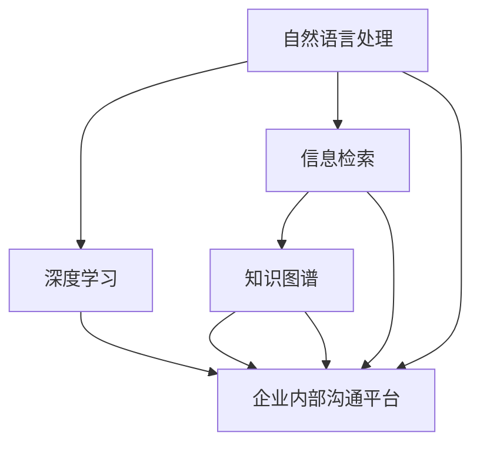

                 

# AI驱动的企业内部沟通平台优化

> 关键词：企业内部沟通,AI优化,自然语言处理(NLP),机器学习,深度学习,信息检索,知识图谱

## 1. 背景介绍

### 1.1 问题由来
随着企业规模的扩大，员工数量增加，内部沟通和协作的需求也随之增长。然而，传统的沟通方式如邮件、即时通讯软件、公告板等已无法满足高效、实时、精准的信息交换要求。企业内部沟通平台逐渐成为解决这一问题的重要手段。

然而，现有的沟通平台往往功能单一，缺乏智能化的信息检索、内容推荐、知识管理等高级功能。如何利用AI技术优化内部沟通平台，提高沟通效率，成为了企业管理者关注的核心问题。

### 1.2 问题核心关键点
本文旨在探讨如何利用AI技术，特别是自然语言处理(NLP)、深度学习、信息检索等技术，对企业内部沟通平台进行智能化优化。

核心关键点包括：
1. 如何利用NLP技术进行智能对话和信息检索。
2. 如何利用深度学习模型进行个性化内容和知识推荐。
3. 如何通过知识图谱技术实现知识管理和检索。
4. 如何设计高效、可扩展的AI驱动沟通平台架构。

## 2. 核心概念与联系

### 2.1 核心概念概述

为更好地理解AI驱动的企业内部沟通平台的优化方法，本节将介绍几个密切相关的核心概念：

- **自然语言处理(NLP)**：利用计算机处理、理解、生成人类语言的技术。核心技术包括分词、词性标注、命名实体识别、语义分析、情感分析等。

- **深度学习**：一种基于神经网络模型的机器学习技术。深度学习通过多层神经网络提取数据特征，用于分类、回归、生成等任务。

- **信息检索(IR)**：从大量数据中快速检索出相关信息的技术。信息检索系统通常包括索引构建、查询匹配、相关性排序等环节。

- **知识图谱(KG)**：一种结构化的知识表示方式，将实体、属性和关系三元组组成图谱，用于知识发现、推理和检索。

- **企业内部沟通平台**：企业内部信息交流、协作的平台，如Slack、Microsoft Teams、企业微信等。

- **AI驱动优化**：利用AI技术对现有平台的功能进行改进和增强，如智能对话、个性化推荐、智能检索等。

这些核心概念之间的逻辑关系可以通过以下Mermaid流程图来展示：



这个流程图展示了大语言模型的核心概念及其之间的关系：

1. 自然语言处理技术用于处理和理解文本数据，深度学习模型进一步提取语义特征，从而实现智能对话和信息检索。
2. 信息检索技术用于从大量数据中快速匹配用户查询，并返回相关结果。
3. 知识图谱技术用于构建和管理知识库，增强信息检索的准确性和深度。
4. 企业内部沟通平台作为信息交流、协作的承载平台，通过引入AI技术进行优化。

## 3. 核心算法原理 & 具体操作步骤
### 3.1 算法原理概述

AI驱动的企业内部沟通平台的优化，本质上是将AI技术应用于平台的多个功能模块，提升其智能化水平。主要包括智能对话、个性化内容推荐、智能信息检索和知识管理等。

具体而言，其核心算法原理如下：

- **智能对话**：利用对话生成模型(如Seq2Seq、GPT等)，通过理解用户输入，生成智能回复。
- **个性化内容推荐**：使用协同过滤、内容推荐算法(如基于深度学习的推荐模型)，结合用户行为数据，生成个性化的内容推荐。
- **智能信息检索**：构建倒排索引和向量空间模型，通过TF-IDF、BM25等算法，实现快速、准确的信息检索。
- **知识管理**：通过知识图谱技术，构建和管理企业内部的知识库，便于信息检索和知识推理。

### 3.2 算法步骤详解

#### 智能对话

1. **数据准备**：收集并标注对话数据，构建训练集和验证集。对话数据可以是历史上员工之间的聊天记录，或通过对话生成模型生成的虚拟对话数据。
2. **模型选择**：选择合适的对话生成模型，如Seq2Seq、GPT等。
3. **模型训练**：在训练集上训练模型，优化参数。可以使用自监督学习、对抗训练等方法提高模型的鲁棒性。
4. **模型评估**：在验证集上评估模型性能，选择性能最好的模型。
5. **模型部署**：将训练好的模型部署到沟通平台中，实现智能对话功能。

#### 个性化内容推荐

1. **数据收集**：收集用户的行为数据，如阅读、分享、评论等。
2. **用户画像构建**：利用用户画像模型(如基于协同过滤的用户画像)，生成用户画像。
3. **内容分析**：对内容进行标签和特征提取，如关键词、情感分析等。
4. **推荐模型训练**：选择合适的推荐模型，如基于深度学习的推荐模型，使用用户画像和内容特征进行训练。
5. **推荐结果生成**：根据用户画像和内容特征，生成个性化推荐结果。

#### 智能信息检索

1. **索引构建**：对企业内部文档、邮件、公告等文本数据进行索引构建，生成倒排索引。
2. **向量空间模型构建**：使用TF-IDF、BM25等算法，构建向量空间模型。
3. **检索模型训练**：在构建好的索引和向量空间模型基础上，训练检索模型。
4. **检索结果排序**：根据用户查询，利用检索模型返回相关文档，并根据相关性排序。

#### 知识管理

1. **知识图谱构建**：从企业内部文档、邮件、公告等文本数据中提取实体、属性和关系，构建知识图谱。
2. **知识图谱训练**：使用图神经网络等模型对知识图谱进行训练，提取知识图谱的语义信息。
3. **知识检索**：在知识图谱上构建查询处理系统，根据用户查询，检索相关知识。
4. **知识推理**：利用知识图谱进行逻辑推理，生成新的知识或回答问题。

### 3.3 算法优缺点

#### 智能对话

- **优点**：
  - 提高用户沟通体验，提升沟通效率。
  - 降低人工客服成本，提高客服响应速度。
  - 支持多语言对话，拓展企业国际化战略。

- **缺点**：
  - 初始模型构建成本较高，需要大量标注数据。
  - 对话生成模型的生成质量依赖于训练数据，需要不断迭代优化。
  - 对话生成模型可能产生误导性或不相关回复，需要人工干预。

#### 个性化内容推荐

- **优点**：
  - 提升用户满意度，增强用户黏性。
  - 根据用户行为和兴趣，提供更相关的信息。
  - 减少用户寻找信息的成本，提高信息获取效率。

- **缺点**：
  - 数据隐私问题，需要处理用户行为数据。
  - 推荐模型需要持续更新，维护成本较高。
  - 可能存在推荐偏差，需要用户反馈和调整。

#### 智能信息检索

- **优点**：
  - 快速定位相关信息，提高信息检索效率。
  - 支持多关键字搜索，满足用户复杂查询需求。
  - 结合知识图谱，实现更深层次的信息检索。

- **缺点**：
  - 索引构建和更新需要较多时间和计算资源。
  - 查询处理系统需要持续优化，以提高检索速度和准确性。
  - 检索结果可能存在误匹配，需要人工审核和纠错。

#### 知识管理

- **优点**：
  - 构建知识图谱，促进知识共享和积累。
  - 支持知识的推理和扩展，生成新的知识。
  - 提供结构化知识管理，便于信息检索和决策支持。

- **缺点**：
  - 知识图谱构建复杂，需要大量专家参与。
  - 知识图谱更新和维护成本较高。
  - 知识图谱的准确性依赖于数据质量，需要持续优化。

## 4. 数学模型和公式 & 详细讲解 & 举例说明

### 4.1 数学模型构建

**智能对话模型**：
- **Seq2Seq模型**：包含编码器-解码器结构，将输入序列转换为输出序列。
  - 编码器：使用LSTM、GRU等模型，将输入序列转换为隐藏状态 $h_t$。
  - 解码器：使用LSTM、GRU等模型，根据隐藏状态 $h_t$ 生成输出序列 $y_t$。
  - 目标函数：交叉熵损失函数 $L = \sum_{t=1}^T -y_t\log p(y_t|h_t)$，其中 $y_t$ 为真实输出，$p(y_t|h_t)$ 为模型预测的概率分布。

**个性化推荐模型**：
- **协同过滤模型**：基于用户-物品矩阵 $R_{ui}$，推荐与用户 $u$ 相似的用户 $v$ 喜欢的物品 $i$。
  - 相似度计算：使用余弦相似度 $s_{uv}=\cos(\theta_u,\theta_v)$，其中 $\theta_u$ 和 $\theta_v$ 为用户的兴趣向量。
  - 推荐结果：选择与用户 $u$ 相似度最高的 $K$ 个用户 $v_1,...,v_K$，计算他们喜欢的物品并推荐。
- **基于深度学习的推荐模型**：使用神经网络模型对用户画像和内容特征进行编码，生成推荐结果。
  - 用户画像：使用自编码器、PCA等方法，将用户行为数据编码为用户特征向量 $u$。
  - 内容特征：使用词袋模型、TF-IDF等方法，将内容编码为向量 $c$。
  - 推荐结果：使用多层感知机(MLP)或神经网络模型，对 $u$ 和 $c$ 进行编码，生成推荐结果 $y$。

**智能信息检索模型**：
- **TF-IDF模型**：将文本转化为向量，计算查询与文档的相关性。
  - 文档向量：$V_d = \sum_{i=1}^n w_id_i$
  - 查询向量：$V_q = \sum_{i=1}^m w_iqu_i$
  - 相关性计算：$R_d = V_q \cdot V_d$，其中 $w_i$ 为词权重。
- **BM25模型**：结合词频、逆文档频率和文档长度，提高信息检索准确性。
  - 词频权重：$f_t=\log(k+1)+\log(f_t+1)$
  - 逆文档频率：$i_d=\log(N/N_d+1)+\log(k+1)+\log(df+2)$
  - 文档长度权重：$l_d=\log(1+\frac{k_1}{\max(l_d,2^8)})$
  - 相关性计算：$R_d = k_1 \cdot f_t + k_2 \cdot i_d \cdot l_d^{-1} \cdot (l_d+1)^{1-\beta} \cdot (N-N_d)^{\beta} \cdot f_t^{\beta}$

**知识图谱模型**：
- **知识图谱构建**：使用NLP技术从文本数据中提取实体、属性和关系，构建知识图谱 $G=(V,E)$。
  - 实体识别：使用命名实体识别(NER)技术，提取文本中的实体。
  - 关系提取：使用关系抽取技术，从文本中提取实体之间的关系。
  - 属性抽取：使用词义消歧和属性预测技术，提取实体的属性。
- **知识图谱训练**：使用图神经网络(GNN)模型对知识图谱进行训练。
  - 图神经网络：使用GCN、GAT等模型，在知识图谱上学习节点和边的表示。
  - 训练目标：最小化损失函数 $L = \sum_{(u,v) \in E} \|r_{uv} - h_u \cdot h_v^T\|^2$，其中 $r_{uv}$ 为边的标签，$h_u$ 和 $h_v$ 为节点嵌入表示。
  - 推理过程：使用逻辑推理规则，生成新的知识或回答问题。

### 4.2 公式推导过程

**智能对话模型**：
- **Seq2Seq模型**：
  - 编码器：
    $$
    h_t = f_{enc}(h_{t-1},x_t)
    $$
  - 解码器：
    $$
    y_t = f_{dec}(h_{t-1},y_{t-1})
    $$
  - 目标函数：
    $$
    L = -\sum_{t=1}^T \log p(y_t|h_t)
    $$

**个性化推荐模型**：
- **协同过滤模型**：
  - 相似度计算：
    $$
    s_{uv}=\cos(\theta_u,\theta_v)
    $$
  - 推荐结果：
    $$
    y_{uv} = \text{argmax}_i \sum_{v} s_{uv} \cdot r_{vi}
    $$

**智能信息检索模型**：
- **TF-IDF模型**：
  - 文档向量：
    $$
    V_d = \sum_{i=1}^n w_id_i
    $$
  - 查询向量：
    $$
    V_q = \sum_{i=1}^m w_iqu_i
    $$
  - 相关性计算：
    $$
    R_d = V_q \cdot V_d
    $$

**知识图谱模型**：
- **知识图谱构建**：
  - 实体识别：
    $$
    E = \{e_i\}_{i=1}^n
    $$
  - 关系提取：
    $$
    R = \{r_{ij}\}_{i=1}^n
    $$
  - 属性抽取：
    $$
    A = \{a_{ik}\}_{i=1}^n
    $$
  - 知识图谱训练：
    $$
    L = \sum_{(u,v) \in E} \|r_{uv} - h_u \cdot h_v^T\|^2
    $$

### 4.3 案例分析与讲解

#### 智能对话案例：微软小冰

- **问题背景**：微软小冰是一个智能对话机器人，用于提升用户互动体验。
- **解决方案**：使用Seq2Seq模型进行智能对话，通过大量标注数据训练模型。在对话中引入情感分析和上下文理解，提高对话的流畅性和相关性。
- **效果**：微软小冰能够理解用户情感，提供个性化的对话回复，大大提升了用户互动的体验和满意度。

#### 个性化推荐案例：亚马逊推荐系统

- **问题背景**：亚马逊推荐系统需要根据用户行为，生成个性化的商品推荐。
- **解决方案**：使用协同过滤和基于深度学习的推荐模型，结合用户画像和商品特征，生成个性化推荐。
- **效果**：亚马逊推荐系统能够实时更新推荐结果，提升用户满意度，增加销售转化率。

#### 智能信息检索案例：谷歌搜索

- **问题背景**：谷歌搜索需要从大量网页中快速定位相关信息。
- **解决方案**：使用TF-IDF和BM25模型构建索引和向量空间模型，结合布尔查询和关键词匹配，提高信息检索的准确性和速度。
- **效果**：谷歌搜索能够快速定位用户查询的相关网页，提高用户搜索体验。

#### 知识图谱案例：IBM Watson

- **问题背景**：IBM Watson是一个知识图谱系统，用于医疗、金融等领域的信息检索和知识推理。
- **解决方案**：使用NLP技术从医疗文献、金融报告等文本数据中构建知识图谱，使用图神经网络模型训练知识表示，生成新的知识或回答问题。
- **效果**：IBM Watson能够提供结构化的知识管理，帮助医生诊断疾病，金融机构做出投资决策，提升工作效率和决策质量。

## 5. 项目实践：代码实例和详细解释说明

### 5.1 开发环境搭建

在进行AI驱动的企业内部沟通平台优化实践前，我们需要准备好开发环境。以下是使用Python进行PyTorch开发的环境配置流程：

1. 安装Anaconda：从官网下载并安装Anaconda，用于创建独立的Python环境。

2. 创建并激活虚拟环境：
```bash
conda create -n pytorch-env python=3.8 
conda activate pytorch-env
```

3. 安装PyTorch：根据CUDA版本，从官网获取对应的安装命令。例如：
```bash
conda install pytorch torchvision torchaudio cudatoolkit=11.1 -c pytorch -c conda-forge
```

4. 安装TensorFlow：
```bash
pip install tensorflow
```

5. 安装Flask：用于搭建Web应用：
```bash
pip install flask
```

6. 安装Elasticsearch：用于信息检索：
```bash
pip install elasticsearch
```

7. 安装NLTK和spaCy：用于自然语言处理：
```bash
pip install nltk
pip install spacy
```

完成上述步骤后，即可在`pytorch-env`环境中开始优化实践。

### 5.2 源代码详细实现

**智能对话模块**：

```python
from transformers import Seq2SeqModel
import torch.nn as nn
import torch.optim as optim

class Seq2SeqDialogue(nn.Module):
    def __init__(self, encoder, decoder, seq_length):
        super(Seq2SeqDialogue, self).__init__()
        self.encoder = encoder
        self.decoder = decoder
        self.seq_length = seq_length

    def forward(self, input, target):
        loss = 0
        for t in range(self.seq_length):
            encoder_output, encoder_hidden = self.encoder(input[t])
            decoder_input, decoder_output, decoder_hidden = self.decoder(encoder_output, encoder_hidden, target[t])
            loss += self.criterion(decoder_output, target[t+1])
        return loss

    def optimize(self, input, target, learning_rate=0.01, epochs=10):
        criterion = nn.CrossEntropyLoss()
        optimizer = optim.Adam(self.parameters(), lr=learning_rate)
        for epoch in range(epochs):
            loss = self(input, target)
            optimizer.zero_grad()
            loss.backward()
            optimizer.step()
        return loss

    def save(self, path):
        torch.save(self.state_dict(), path)

    def load(self, path):
        self.load_state_dict(torch.load(path))
```

**个性化推荐模块**：

```python
from sklearn.metrics.pairwise import cosine_similarity
from sklearn.neighbors import NearestNeighbors

class CollaborativeFiltering:
    def __init__(self, user_matrix, item_matrix):
        self.user_matrix = user_matrix
        self.item_matrix = item_matrix
        self.neighbors = NearestNeighbors(metric='cosine', algorithm='brute')
        self.neighbors.fit(user_matrix)

    def recommend(self, user_index, k=5):
        user_vector = self.user_matrix[user_index]
        similarities = cosine_similarity(user_vector, self.user_matrix).flatten()
        similarities_idx = np.argsort(-similarities)[1:k]
        neighbors = self.neighbors.kneighbors(similarities_idx, k)
        recommended_items = neighbors[0].flatten().tolist()
        return recommended_items
```

**智能信息检索模块**：

```python
from sklearn.feature_extraction.text import TfidfVectorizer
from sklearn.metrics.pairwise import cosine_similarity
from sklearn.neighbors import NearestNeighbors

class TFIDFModel:
    def __init__(self, documents, query):
        self.documents = documents
        self.query = query
        self.vectors = self._build_tfidf_matrix()
        self.similarity_matrix = self._build_similarity_matrix()

    def _build_tfidf_matrix(self):
        vectorizer = TfidfVectorizer()
        vectors = vectorizer.fit_transform(self.documents)
        return vectors

    def _build_similarity_matrix(self):
        similarity_matrix = cosine_similarity(self.vectors, self.vectors)
        return similarity_matrix

    def search(self, query):
        query_vector = self._build_query_vector(query)
        similarity_scores = cosine_similarity(query_vector, self.vectors)
        relevant_documents = np.argsort(-similarity_scores)[0:5]
        return relevant_documents
```

**知识图谱模块**：

```python
from py2vec import WordEmbedding, SentenceEmbedding
from py2vec.structures import graph, model

class KnowledgeGraph:
    def __init__(self, entities, relations, attributes):
        self.entities = entities
        self.relations = relations
        self.attributes = attributes
        self.graph = graph.Graph()
        self.model = model.Model()

    def build(self):
        for entity, relation, attribute in zip(self.entities, self.relations, self.attributes):
            self.graph.add_node(entity, embeddings=self._build_entity_embedding(entity))
            self.graph.add_edge(entity, relation, attribute, embeddings=self._build_relation_embedding(relation))
        self.model.fit(self.graph)

    def _build_entity_embedding(self, entity):
        embedding = WordEmbedding(entity)
        embedding.build()
        return embedding.get_embeddings()

    def _build_relation_embedding(self, relation):
        embedding = WordEmbedding(relation)
        embedding.build()
        return embedding.get_embeddings()

    def query(self, query):
        embeddings = self._build_query_embedding(query)
        results = self.model.predict(embeddings)
        return results
```

### 5.3 代码解读与分析

**智能对话模块**：
- `Seq2SeqDialogue`类：定义Seq2Seq模型的架构，包含编码器和解码器。
- `forward`方法：实现前向传播，计算损失。
- `optimize`方法：实现模型优化，通过梯度下降更新参数。
- `save`和`load`方法：实现模型保存和加载。

**个性化推荐模块**：
- `CollaborativeFiltering`类：使用余弦相似度计算用户相似度，使用NearestNeighbors算法找到相似用户，生成个性化推荐。

**智能信息检索模块**：
- `TFIDFModel`类：使用TF-IDF模型构建文档向量，计算查询与文档的相似度，实现智能信息检索。

**知识图谱模块**：
- `KnowledgeGraph`类：定义知识图谱的架构，使用WordEmbedding模型构建节点和边的嵌入表示，使用Graph和Model类进行知识图谱的训练和推理。

## 6. 实际应用场景
### 6.1 智能客服系统

**应用场景**：
- 问题：企业客服响应速度慢，员工压力大，客户满意度低。
- 优化方案：引入智能客服系统，使用自然语言处理和机器学习技术，实现智能对话和问题解答。
- 效果：智能客服系统能够24小时不间断服务，快速响应客户咨询，提供标准化的回答，提升客户满意度，降低人工客服成本。

### 6.2 销售管理系统

**应用场景**：
- 问题：销售人员需要处理大量客户数据，工作效率低，数据处理质量差。
- 优化方案：引入基于AI的销售管理系统，使用推荐系统对客户进行分组，生成个性化的销售建议。
- 效果：系统能够根据客户行为和历史记录，生成个性化推荐，提升销售人员的工作效率，提高客户满意度。

### 6.3 知识管理平台

**应用场景**：
- 问题：企业内部知识零散分布，难以高效共享和检索。
- 优化方案：引入知识管理平台，使用知识图谱技术构建企业内部的知识库，提供结构化的知识检索和推理功能。
- 效果：知识管理平台能够将企业内部知识进行整合，便于员工检索和分享，提升企业知识管理的效率和质量。

### 6.4 未来应用展望

随着AI技术的不断发展，未来的企业内部沟通平台将更加智能化和人性化。以下是一些未来应用展望：

- **多模态交互**：结合语音识别、面部识别等技术，实现多模态的沟通和交互，提升用户体验。
- **情感分析**：通过分析用户情感，提供更加个性化的回复和建议，提升客户满意度。
- **智能决策支持**：结合知识图谱和机器学习技术，提供决策支持系统，帮助管理层做出更好的决策。
- **自动化流程**：引入自动化流程管理，使用智能对话机器人进行自动化任务处理，提高企业运营效率。

## 7. 工具和资源推荐
### 7.1 学习资源推荐

为了帮助开发者系统掌握AI驱动的企业内部沟通平台的优化方法，这里推荐一些优质的学习资源：

1. 《自然语言处理综述》书籍：全面介绍自然语言处理的基本概念、算法和技术，是NLP领域的重要参考书。

2. 《深度学习入门》课程：由吴恩达教授主讲，涵盖深度学习的基本原理和常用算法，适合初学者学习。

3. 《Python机器学习实战》书籍：介绍机器学习在Python中的实现方法，结合实例讲解，适合实践学习。

4. 《TensorFlow实战》书籍：由Google官方推荐，详细讲解TensorFlow的使用方法和应用案例。

5. 《Flask Web开发》书籍：介绍Flask框架的用法，结合Web应用实例，适合Web开发者学习。

6. 《Elasticsearch官方文档》：详细讲解Elasticsearch的使用方法和API接口，是信息检索领域的重要参考。

### 7.2 开发工具推荐

1. PyTorch：基于Python的开源深度学习框架，灵活动态的计算图，适合快速迭代研究。

2. TensorFlow：由Google主导开发的开源深度学习框架，生产部署方便，适合大规模工程应用。

3. Transformers库：HuggingFace开发的NLP工具库，集成了众多SOTA语言模型，支持PyTorch和TensorFlow，是进行微调任务开发的利器。

4. Scikit-learn：基于Python的机器学习库，提供各种常用的算法和工具，方便快速实现机器学习模型。

5. Jupyter Notebook：交互式编程环境，方便进行数据分析和模型调试，适合研究和开发。

6. Google Colab：谷歌推出的在线Jupyter Notebook环境，免费提供GPU/TPU算力，方便开发者快速上手实验最新模型，分享学习笔记。

### 7.3 相关论文推荐

1. Attention is All You Need：提出Transformer结构，开启了NLP领域的预训练大模型时代。

2. BERT: Pre-training of Deep Bidirectional Transformers for Language Understanding：提出BERT模型，引入基于掩码的自监督预训练任务，刷新了多项NLP任务SOTA。

3. Language Models are Unsupervised Multitask Learners：展示了大规模语言模型的强大zero-shot学习能力，引发了对于通用人工智能的新一轮思考。

4. Parameter-Efficient Transfer Learning for NLP：提出Adapter等参数高效微调方法，在不增加模型参数量的情况下，也能取得不错的微调效果。

5. Knowledge Graph Embeddings and Their Application to Recommender Systems：介绍知识图谱嵌入技术，应用于推荐系统，提升推荐效果。

这些论文代表了大语言模型微调技术的发展脉络。通过学习这些前沿成果，可以帮助研究者把握学科前进方向，激发更多的创新灵感。

## 8. 总结：未来发展趋势与挑战

### 8.1 总结

本文对AI驱动的企业内部沟通平台的优化方法进行了全面系统的介绍。首先阐述了AI技术在内部沟通平台中的应用背景和优化需求，明确了智能对话、个性化推荐、智能信息检索和知识管理等关键技术。

其次，从原理到实践，详细讲解了这些技术的数学模型和核心算法，并提供了完整的代码实现，方便读者进行学习和实践。同时，本文还广泛探讨了AI技术在企业内部沟通平台中的实际应用场景，展示了AI优化的强大潜力。

最后，本文精选了相关的学习资源、开发工具和研究论文，力求为读者提供全方位的技术指引。通过本文的系统梳理，可以看到，AI技术在提升企业内部沟通平台智能化水平方面具有巨大的潜力，能够有效解决企业内部沟通中的痛点问题，提升企业运营效率和员工满意度。

### 8.2 未来发展趋势

展望未来，AI驱动的企业内部沟通平台将呈现以下几个发展趋势：

1. **智能化和人性化**：随着NLP和机器学习技术的不断发展，未来的企业内部沟通平台将更加智能化和人性化，提供更加丰富的功能和服务。

2. **多模态交互**：结合语音识别、面部识别等技术，实现多模态的沟通和交互，提升用户体验。

3. **情感分析**：通过分析用户情感，提供更加个性化的回复和建议，提升客户满意度。

4. **智能决策支持**：结合知识图谱和机器学习技术，提供决策支持系统，帮助管理层做出更好的决策。

5. **自动化流程**：引入自动化流程管理，使用智能对话机器人进行自动化任务处理，提高企业运营效率。

这些趋势凸显了AI技术在提升企业内部沟通平台智能化水平方面的广阔前景。这些方向的探索发展，必将进一步提升企业运营效率和员工满意度，为企业的数字化转型提供新的技术路径。

### 8.3 面临的挑战

尽管AI技术在企业内部沟通平台的优化中已经取得了显著成效，但在迈向更加智能化、普适化应用的过程中，仍面临以下挑战：

1. **数据隐私和安全**：企业内部沟通平台需要处理大量的员工数据，如何确保数据隐私和安全，是一个重要的挑战。

2. **模型鲁棒性和泛化能力**：当前AI模型在面对复杂和未知的数据时，鲁棒性和泛化能力仍有待提升。

3. **模型训练成本**：大规模语言模型和知识图谱的构建和训练成本较高，如何降低成本，提高模型的训练效率，是未来需要解决的问题。

4. **用户体验**：虽然AI技术能够提供智能化的服务，但如何设计出更加人性化和自然的交互体验，是未来需要不断探索的方向。

5. **模型解释性**：AI模型的决策过程缺乏可解释性，难以对其推理逻辑进行分析和调试，如何提高模型的可解释性，也是未来需要解决的问题。

6. **知识图谱构建**：知识图谱的构建和维护成本较高，如何构建高质量的知识图谱，并保持其更新和维护，是一个重要的挑战。

### 8.4 研究展望

面对AI驱动的企业内部沟通平台优化所面临的挑战，未来的研究需要在以下几个方面寻求新的突破：

1. **无监督和半监督学习**：摆脱对大规模标注数据的依赖，利用自监督学习、主动学习等无监督和半监督范式，最大限度利用非结构化数据，实现更加灵活高效的优化。

2. **参数高效和计算高效**：开发更加参数高效的优化方法，在固定大部分预训练参数的情况下，只更新极少量的任务相关参数。同时优化模型的计算图，减少前向传播和反向传播的资源消耗，实现更加轻量级、实时性的部署。

3. **多模态融合**：结合视觉、语音、文本等多种模态信息，实现更加全面、准确的信息检索和推荐。

4. **知识图谱的自动化构建**：利用自动化方法构建高质量的知识图谱，降低人工成本，提高知识图谱的更新和维护效率。

5. **模型解释性和可解释性**：引入可解释性技术，增强模型的决策过程的透明性和可解释性，帮助管理层理解和优化模型。

6. **隐私保护和安全性**：研究隐私保护和安全性技术，确保企业内部沟通平台的数据隐私和安全。

这些研究方向的探索，必将引领AI驱动的企业内部沟通平台优化技术迈向更高的台阶，为构建安全、可靠、可解释、可控的智能系统铺平道路。面向未来，AI技术在企业内部沟通平台的优化过程中需要与其他人工智能技术进行更深入的融合，如知识表示、因果推理、强化学习等，多路径协同发力，共同推动自然语言理解和智能交互系统的进步。只有勇于创新、敢于突破，才能不断拓展语言模型的边界，让智能技术更好地造福人类社会。

## 9. 附录：常见问题与解答

**Q1：企业内部沟通平台需要哪些核心技术？**

A: 企业内部沟通平台的核心技术包括自然语言处理(NLP)、深度学习、信息检索和知识图谱等。

- **自然语言处理(NLP)**：用于处理和理解文本数据，实现智能对话和信息检索。
- **深度学习**：用于提取文本数据的语义特征，实现个性化推荐和知识图谱训练。
- **信息检索(IR)**：用于从大量数据中快速匹配用户查询，实现智能信息检索。
- **知识图谱(KG)**：用于构建和管理知识库，实现知识管理和检索。

**Q2：如何构建高质量的知识图谱？**

A: 构建高质量的知识图谱需要以下几个步骤：

1. **实体识别**：使用命名实体识别(NER)技术，从文本中提取实体。
2. **关系抽取**：使用关系抽取技术，从文本中提取实体之间的关系。
3. **属性抽取**：使用词义消歧和属性预测技术，提取实体的属性。
4. **图神经网络训练**：使用图神经网络模型对知识图谱进行训练，提取知识图谱的语义信息。

**Q3：如何优化智能对话系统？**

A: 优化智能对话系统需要以下几个步骤：

1. **数据准备**：收集并标注对话数据，构建训练集和验证集。
2. **模型选择**：选择合适的对话生成模型，如Seq2Seq、GPT等。
3. **模型训练**：在训练集上训练模型，优化参数。
4. **模型评估**：在验证集上评估模型性能，选择性能最好的模型。
5. **模型部署**：将训练好的模型部署到沟通平台中，实现智能对话功能。

**Q4：个性化推荐系统需要哪些关键技术？**

A: 个性化推荐系统需要以下几个关键技术：

1. **协同过滤**：基于用户-物品矩阵，计算用户相似度，生成个性化推荐。
2. **基于深度学习的推荐**：使用神经网络模型对用户画像和内容特征进行编码，生成推荐结果。
3. **多模态信息融合**：结合语音、面部识别等技术，实现多模态信息融合，提升推荐效果。

**Q5：智能信息检索系统需要哪些关键技术？**

A: 智能信息检索系统需要以下几个关键技术：

1. **TF-IDF模型**：使用TF-IDF模型构建文档向量，计算查询与文档的相似度。
2. **BM25模型**：结合词频、逆文档频率和文档长度，提高信息检索准确性。
3. **倒排索引**：构建倒排索引，加速文档检索过程。

**Q6：企业内部沟通平台如何保护用户数据隐私？**

A: 企业内部沟通平台保护用户数据隐私需要以下几个措施：

1. **数据匿名化**：对用户数据进行匿名化处理，防止数据泄露。
2. **访问控制**：使用访问控制技术，限制数据访问权限。
3. **数据加密**：对数据进行加密处理，防止数据泄露。
4. **数据审计**：对数据访问和使用进行审计，确保数据使用合法。

这些措施可以确保企业内部沟通平台的数据隐私和安全，保障用户数据的安全。

---

作者：禅与计算机程序设计艺术 / Zen and the Art of Computer Programming

