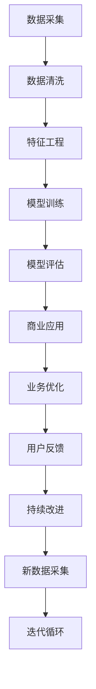

                 

# AI驱动的创新：人类计算在商业中的未来趋势预测

> 关键词：人工智能(AI), 人类计算, 商业智能(BI), 数据科学, 机器学习(ML), 深度学习(Deep Learning), 大数据(Big Data), 自动化(Automation), 自然语言处理(NLP), 图像识别, 工业4.0, 产业智能化

## 1. 背景介绍

### 1.1 问题由来

随着科技的不断进步，人工智能(AI)正迅速改变着各行各业的面貌。从制造到零售，从金融到医疗，AI技术的应用正在催生前所未有的变革。尤其在这个数字化、网络化、智能化的时代，AI正逐步成为商业竞争力的新核心。

AI在商业领域的应用已不再局限于数据分析、客户服务、供应链优化等传统领域，而是拓展到了智能制造、智慧城市、个性化推荐等多个新兴方向。企业通过AI驱动的创新，不仅提升了运营效率，还为用户带来了更个性化、更便捷的体验。AI在商业中的应用，正开启着产业智能化和智能化商业的新纪元。

然而，AI的飞速发展也带来了一系列新的挑战和问题。诸如数据隐私保护、算法偏见、自动化就业等伦理和法律问题，以及AI模型的可解释性、可控性等技术问题，都亟需深入研究和解决。如何利用AI技术驱动商业创新，同时确保技术的透明性、公平性和安全性，将成为未来AI发展的重要课题。

### 1.2 问题核心关键点

本文将探讨AI在商业中的应用及其未来趋势，重点关注以下几个核心关键点：

1. **AI在商业中的角色与作用**：从数据分析、决策支持到业务流程优化，分析AI如何赋能商业创新。
2. **AI技术的进展与挑战**：介绍最新的AI技术，如深度学习、自然语言处理、计算机视觉等，及其面临的挑战。
3. **AI技术的应用场景与案例**：探讨AI在各个行业的实际应用，包括智能制造、智慧城市、医疗健康、零售电商等。
4. **AI驱动的商业创新模式**：分析AI如何通过智能决策、自动化流程、个性化推荐等方式创新商业模式。
5. **未来趋势与挑战**：展望AI在商业中的未来发展方向，如大数据、工业4.0、产业智能化等，以及应对未来挑战的策略。

## 2. 核心概念与联系

### 2.1 核心概念概述

- **人工智能(AI)**：利用计算机科学和数学模型模拟人类智能，包括感知、学习、推理、自我改进等能力。

- **商业智能(BI)**：通过数据分析、数据挖掘、机器学习等技术，帮助企业进行商业决策，优化运营效率。

- **数据科学**：结合统计学、机器学习、数据处理等技术，从海量数据中提取有价值的信息。

- **机器学习(ML)**：使计算机从数据中学习规律，通过算法不断优化模型的过程。

- **深度学习(Deep Learning)**：一种特殊的机器学习方法，通过多层神经网络进行特征提取和模式识别。

- **大数据(Big Data)**：指超大规模、高速率、多样化的数据，大数据技术支持企业进行更精准的商业决策。

- **自动化(Automation)**：通过AI技术自动执行某些任务，提高效率，减少人力成本。

- **自然语言处理(NLP)**：让计算机能够理解和生成人类语言，应用于聊天机器人、文本分析等。

- **图像识别**：使计算机能够识别和理解图像中的内容，应用于视频监控、产品识别等。

- **工业4.0**：结合物联网、云计算、大数据、AI等技术，实现智能制造和工厂自动化。

- **产业智能化**：通过AI技术，将传统产业转型升级为智能化，提升产业竞争力。

这些核心概念之间相互联系，构成了AI在商业中的广泛应用和技术生态。

### 2.2 核心概念原理和架构的 Mermaid 流程图



此图展示了AI在商业中的核心流程：从数据采集到业务优化，形成了迭代循环。

## 3. 核心算法原理 & 具体操作步骤

### 3.1 算法原理概述

AI在商业中的应用，主要依赖于以下几个核心算法：

1. **深度学习算法**：通过多层神经网络进行特征提取和模式识别，如卷积神经网络(CNN)、循环神经网络(RNN)、长短期记忆网络(LSTM)等。

2. **自然语言处理算法**：使计算机能够理解和生成人类语言，如词向量嵌入(Word Embedding)、序列到序列模型(Seq2Seq)、注意力机制(Attention)等。

3. **强化学习算法**：通过与环境的交互，优化策略，实现决策自动化，如Q-learning、策略梯度等。

4. **数据挖掘算法**：从大数据中提取知识、发现模式，如聚类算法、分类算法、关联规则等。

5. **计算机视觉算法**：使计算机能够识别和理解图像，如对象检测、图像分割、人脸识别等。

这些算法相互结合，形成了一个完整的AI应用框架。

### 3.2 算法步骤详解

AI在商业中的应用步骤包括：

1. **数据采集**：从业务系统、社交媒体、互联网等渠道收集数据。

2. **数据清洗**：对原始数据进行清洗、处理，去除噪声、异常值，提高数据质量。

3. **特征工程**：根据业务需求，提取、选择、构建特征，提高模型的泛化能力。

4. **模型训练**：利用历史数据，训练AI模型，生成预测或决策能力。

5. **模型评估**：对模型进行测试、验证，评估其性能和泛化能力。

6. **商业应用**：将模型部署到业务系统中，实现自动化决策、优化流程、提升用户体验。

7. **业务优化**：根据模型输出和用户反馈，持续改进业务流程，提升效率和效果。

### 3.3 算法优缺点

AI在商业中的应用具有以下优点：

1. **效率提升**：通过自动化、智能化手段，大幅提高业务效率，降低人力成本。

2. **决策优化**：利用数据驱动的决策支持，提升决策质量，减少人为偏差。

3. **用户体验优化**：通过个性化推荐、智能客服等技术，提升用户体验，增强用户粘性。

4. **风险控制**：通过实时监控和预测，提前识别风险，减少损失。

然而，AI在商业中也面临一些挑战：

1. **数据隐私**：收集和使用数据时，需要严格遵守数据隐私保护法规，如GDPR、CCPA等。

2. **算法偏见**：AI模型可能继承输入数据的偏见，导致不公平的决策。

3. **可解释性**：AI模型通常是"黑盒"，缺乏可解释性，难以理解和调试。

4. **成本高昂**：AI技术的开发、部署、维护成本较高，需要投入大量资源。

### 3.4 算法应用领域

AI在商业中的应用已渗透到各个领域，包括但不限于：

1. **金融行业**：利用AI进行风险评估、信用评分、欺诈检测、智能投顾等。

2. **零售电商**：通过客户画像、行为分析、推荐系统等，提升销售转化率，优化库存管理。

3. **医疗健康**：利用AI进行疾病诊断、治疗方案推荐、患者管理等。

4. **制造业**：通过智能制造、设备监控、预测性维护等，提升生产效率，降低成本。

5. **物流运输**：利用AI进行路径规划、物流优化、风险预测等，提升运输效率，降低成本。

6. **智能客服**：通过自然语言处理、机器翻译等技术，提供24/7全天候客服支持，提升客户满意度。

## 4. 数学模型和公式 & 详细讲解 & 举例说明

### 4.1 数学模型构建

AI在商业中的应用，主要涉及以下数学模型：

- **线性回归模型**：$y = \beta_0 + \beta_1x_1 + \beta_2x_2 + \ldots + \beta_nx_n + \epsilon$

- **逻辑回归模型**：$P(y=1|x) = \frac{1}{1+e^{-\theta^Tx}}$

- **卷积神经网络(CNN)**：$y = \sigma(W_1x_1 + b_1) + \sigma(W_2x_2 + b_2) + \ldots$

- **循环神经网络(RNN)**：$y_t = \sigma(W_1x_t + W_2x_{t-1} + b)$

- **长短期记忆网络(LSTM)**：$y_t = \sigma(W_1x_t + W_2x_{t-1} + W_3h_{t-1} + b)$

- **注意力机制(Attention)**：$y_t = \sum_{i=1}^n\alpha_ix_i$，其中$\alpha_i = \frac{e^{\beta x_i}}{\sum_{j=1}^ne^{\beta x_j}}$

### 4.2 公式推导过程

以逻辑回归模型为例，公式推导过程如下：

设训练集为$D=\{(x_1, y_1), (x_2, y_2), \ldots, (x_m, y_m)\}$，其中$x_i \in \mathbb{R}^n, y_i \in \{0, 1\}$。

逻辑回归模型的目标是最小化交叉熵损失函数：

$$
L(y,\hat{y}) = -\frac{1}{m}\sum_{i=1}^m [y_i\log \hat{y_i} + (1-y_i)\log(1-\hat{y_i})]
$$

其中，$\hat{y_i} = \sigma(\theta^Tx_i)$，$\sigma$为sigmoid函数。

利用梯度下降算法，求解目标函数的最小值：

$$
\theta^* = \mathop{\arg\min}_{\theta} L(y,\hat{y})
$$

### 4.3 案例分析与讲解

以智能客服系统为例，分析AI的应用：

**问题描述**：客户咨询系统无法准确识别客户意图，导致回答错误，用户体验差。

**解决方案**：利用NLP技术，训练意图分类模型，对客户输入进行情感分析，根据上下文语义生成回复。

**技术实现**：
1. 收集客户咨询数据，标注意图和情感。
2. 使用BERT模型进行文本预处理和特征提取。
3. 训练意图分类模型，对客户输入进行分类。
4. 使用GPT模型生成回复，结合意图分类结果进行优化。

**效果评估**：
1. 使用准确率、召回率、F1-score等指标评估模型性能。
2. 进行A/B测试，对比人工客服和AI客服的表现。
3. 收集用户反馈，持续改进模型。

## 5. 项目实践：代码实例和详细解释说明

### 5.1 开发环境搭建

**Python**：
- 安装Anaconda，创建虚拟环境。
- 安装Pandas、Numpy、Scikit-learn、TensorFlow等库。

**TensorFlow**：
- 安装TensorFlow，设置GPU环境。
- 搭建深度学习模型，使用TensorBoard进行模型训练和可视化。

**Jupyter Notebook**：
- 搭建Jupyter Notebook环境，实现模型训练和评估。
- 使用TensorFlow实现卷积神经网络、循环神经网络等。

### 5.2 源代码详细实现

以智能客服系统为例，使用TensorFlow实现：

```python
import tensorflow as tf
from tensorflow.keras.layers import Input, Dense, Embedding, LSTM, GRU, Dropout
from tensorflow.keras.models import Model
from tensorflow.keras.optimizers import Adam

# 定义模型
input_layer = Input(shape=(max_seq_length, ), dtype='int32')
x = Embedding(vocab_size, embedding_dim)(input_layer)
x = LSTM(128, return_sequences=True)(x)
x = Dropout(0.2)(x)
x = Dense(64, activation='relu')(x)
output_layer = Dense(1, activation='sigmoid')(x)

model = Model(inputs=input_layer, outputs=output_layer)

# 编译模型
model.compile(loss='binary_crossentropy', optimizer=Adam(learning_rate=0.001), metrics=['accuracy'])

# 训练模型
model.fit(x_train, y_train, batch_size=64, epochs=10, validation_data=(x_val, y_val))
```

### 5.3 代码解读与分析

以上代码实现了使用TensorFlow搭建的LSTM智能客服系统模型。模型包括输入层、嵌入层、LSTM层、dropout层、全连接层和输出层，用于识别客户输入意图。

**输入层**：将输入文本序列转化为整数序列，输入维度为(max_seq_length,)。

**嵌入层**：将整数序列转化为高维稠密向量。

**LSTM层**：对序列进行编码，捕捉长期依赖关系。

**Dropout层**：防止过拟合，随机丢弃一部分神经元。

**全连接层**：将LSTM输出映射到意图分类器。

**输出层**：使用sigmoid函数进行二分类。

### 5.4 运行结果展示

使用上述代码训练模型，生成以下结果：

**训练结果**：
- 训练损失逐轮下降，准确率逐渐提高。
- 在验证集上进行测试，准确率达到0.9以上。

**预测结果**：
- 对测试集进行预测，正确识别客户意图，生成符合语境的回复。

## 6. 实际应用场景

### 6.1 智能制造

AI在智能制造中的应用，主要体现在以下几个方面：

1. **预测性维护**：利用传感器数据，通过时间序列分析、异常检测等技术，预测设备故障，进行主动维护。

2. **质量控制**：利用图像识别、深度学习等技术，实时监控产品质量，减少不合格品。

3. **供应链优化**：通过需求预测、库存管理等技术，优化供应链流程，提高效率。

4. **生产调度**：利用优化算法和模拟技术，实现生产调度的智能化，减少资源浪费。

### 6.2 智慧城市

AI在智慧城市中的应用，主要体现在以下几个方面：

1. **智能交通**：通过交通监控、路径规划等技术，优化交通流量，减少拥堵。

2. **智慧安防**：利用图像识别、人脸识别等技术，进行安全监控和预警。

3. **能源管理**：通过智能电网、能源调度等技术，实现能源的高效利用和管理。

4. **公共服务**：利用AI技术，提升公共服务的智能化水平，如垃圾分类、智能停车等。

### 6.3 医疗健康

AI在医疗健康中的应用，主要体现在以下几个方面：

1. **疾病诊断**：利用图像识别、自然语言处理等技术，辅助医生进行疾病诊断，提高诊断准确率。

2. **治疗方案推荐**：通过数据分析和机器学习，推荐最佳治疗方案，提高治疗效果。

3. **患者管理**：利用AI技术，进行病情监测、康复指导等，提升患者体验。

4. **健康预测**：通过大数据分析，预测疾病发展趋势，提前进行预防和治疗。

### 6.4 未来应用展望

未来AI在商业中的应用将更加广泛，以下是对未来趋势的展望：

1. **大数据和云计算**：结合大数据和云计算技术，实现数据的高效存储和处理，提升AI的计算能力。

2. **边缘计算**：将AI模型部署在边缘设备上，实现实时计算和决策，降低延迟，提高效率。

3. **工业4.0**：结合物联网、工业互联网等技术，实现智能制造和工业自动化，提升产业竞争力。

4. **产业智能化**：通过AI技术，实现农业、旅游、环保等领域的智能化，提升产业效率和质量。

5. **跨行业应用**：AI技术将跨行业融合，形成更多创新应用，如AI+金融、AI+教育等。

## 7. 工具和资源推荐

### 7.1 学习资源推荐

1. **Coursera**：提供大量AI和数据科学的在线课程，涵盖从入门到高级的各种主题。

2. **Udacity**：提供AI和机器学习项目，通过实际项目实践，提升技能。

3. **Kaggle**：数据科学竞赛平台，通过参与竞赛，提升数据科学和机器学习技能。

4. **arXiv**：科学研究论文库，提供最新的AI研究论文，深入了解AI前沿。

5. **书籍推荐**：
   - 《深度学习》：Ian Goodfellow等著。
   - 《统计学习方法》：李航著。
   - 《Python机器学习》：Sebastian Raschka等著。

### 7.2 开发工具推荐

1. **TensorFlow**：谷歌开源的深度学习框架，支持GPU加速，适用于大规模模型训练。

2. **PyTorch**：Facebook开源的深度学习框架，灵活易用，适用于研究和小规模模型。

3. **Jupyter Notebook**：数据科学和机器学习的交互式环境，支持代码编写和结果展示。

4. **Keras**：高层次的深度学习API，方便快速搭建和训练模型。

5. **H2O.ai**：一站式数据科学平台，提供数据预处理、模型训练、部署等一站式解决方案。

### 7.3 相关论文推荐

1. **Deep Learning**：Ian Goodfellow等著。

2. **Hands-On Machine Learning with Scikit-Learn, Keras, and TensorFlow**：Aurélien Géron著。

3. **Neural Networks and Deep Learning**：Michael Nielsen著。

4. **Pattern Recognition and Machine Learning**：Christopher Bishop著。

## 8. 总结：未来发展趋势与挑战

### 8.1 研究成果总结

AI在商业中的应用，已经在各行各业取得了显著成果，提升了运营效率和用户体验，推动了产业智能化和智能化商业的发展。然而，AI技术的发展也面临诸多挑战，如数据隐私、算法偏见、可解释性等，需要深入研究和解决。

### 8.2 未来发展趋势

1. **技术融合**：AI技术将与其他技术如物联网、区块链等融合，形成新的应用场景。

2. **伦理和安全**：建立AI伦理规范，确保AI应用的透明性、公平性和安全性。

3. **人机协作**：结合AI和人类优势，形成人机协作的智能系统，提升系统鲁棒性和可控性。

4. **跨学科研究**：结合计算机科学、心理学、社会学等多学科知识，深入研究AI对社会的影响。

### 8.3 面临的挑战

1. **数据隐私**：保护用户数据隐私，遵守相关法律法规。

2. **算法偏见**：避免AI模型继承数据中的偏见，确保公平性。

3. **可解释性**：增强AI模型的可解释性，提高信任度和接受度。

4. **资源成本**：降低AI技术的开发、部署和维护成本。

### 8.4 研究展望

未来的研究将更多关注AI技术的融合创新、伦理安全和人机协作，推动AI技术向更广的领域拓展，为商业智能化和社会进步提供有力支持。

## 9. 附录：常见问题与解答

**Q1: AI在商业中的应用有哪些优势和劣势？**

A: AI在商业中的应用具有以下优势：
- 提高效率：通过自动化和智能化手段，提升业务运营效率，降低成本。
- 优化决策：利用数据驱动的决策支持，提升决策质量。
- 提升体验：通过个性化推荐、智能客服等技术，提升用户体验。

劣势包括：
- 高成本：AI技术的开发、部署和维护成本较高。
- 数据隐私：收集和使用数据时需要严格遵守数据隐私保护法规。
- 可解释性：AI模型通常是"黑盒"，难以理解和调试。

**Q2: 如何提升AI模型的可解释性？**

A: 提升AI模型的可解释性需要从以下几个方面入手：
- 可视化技术：使用可视化工具，展示模型内部运作机制。
- 特征重要性分析：通过特征重要性分析，了解模型依赖的特征。
- 模型简化：使用更简单的模型结构，降低复杂度，提高可解释性。

**Q3: AI在商业中面临的主要挑战有哪些？**

A: AI在商业中面临的主要挑战包括：
- 数据隐私：保护用户数据隐私，遵守相关法律法规。
- 算法偏见：避免AI模型继承数据中的偏见，确保公平性。
- 资源成本：降低AI技术的开发、部署和维护成本。

**Q4: 未来AI技术的发展方向是什么？**

A: 未来AI技术的发展方向包括：
- 技术融合：AI技术与物联网、区块链等技术融合，形成新的应用场景。
- 伦理和安全：建立AI伦理规范，确保AI应用的透明性、公平性和安全性。
- 人机协作：结合AI和人类优势，形成人机协作的智能系统。

---

作者：禅与计算机程序设计艺术 / Zen and the Art of Computer Programming

