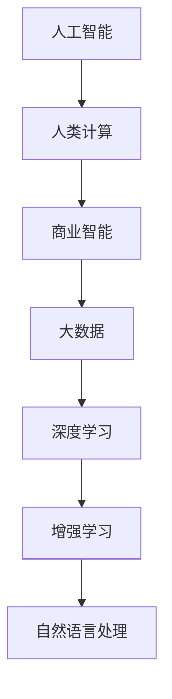

                 

# AI驱动的创新：人类计算在商业中的潜力

> 关键词：AI,人类计算,商业创新,机器学习,深度学习,商业智能,大数据

## 1. 背景介绍

### 1.1 问题由来
随着人工智能（AI）技术的不断成熟，越来越多的企业开始将其应用到商业场景中，以期通过智能化手段提升运营效率、优化决策支持、增强客户体验。然而，由于AI技术的复杂性和专业性，许多企业往往难以独立构建和运营AI系统，迫切需要借助专业机构的力量来实现AI驱动的商业创新。

### 1.2 问题核心关键点
在当前AI技术发展的背景下，人类计算与AI计算的融合已成为推动商业创新的关键。人类计算指的是通过人类智慧和专业知识，与AI计算技术相结合，实现更高效、更精准的商业决策和运营管理。具体而言，包括以下几个核心关键点：

- 人机协同：将人类的经验和直觉与AI的计算能力相结合，形成互补，提升决策质量。
- 知识驱动：利用人类的知识积累和经验，指导AI模型的训练和应用，增强模型的可解释性和可信度。
- 智能增强：AI技术的应用不是为了取代人类，而是通过增强人类的能力，使人类能够更好地完成任务和决策。
- 商业智能：AI技术在数据处理、模式识别、预测分析等方面的优势，可以帮助企业更好地理解市场动态，制定合理的商业策略。

### 1.3 问题研究意义
探索人类计算与AI技术的结合方式，对于推动商业创新具有重要意义：

1. **提升运营效率**：通过智能化手段优化业务流程，减少人为错误，提高工作效率。
2. **增强决策质量**：利用AI技术的数据处理能力和模式识别能力，提升决策的科学性和准确性。
3. **改善客户体验**：通过AI技术提供个性化的服务，增强客户满意度和忠诚度。
4. **推动产业升级**：AI技术的应用可以提升传统行业的数字化转型，推动产业结构优化升级。
5. **促进跨界融合**：人类计算与AI技术的融合，可以促进不同行业和领域的跨界合作，催生新的商业模式和业务形态。

## 2. 核心概念与联系

### 2.1 核心概念概述

为了更好地理解人类计算与AI技术在商业中的融合应用，本节将介绍几个关键概念及其相互联系：

- **人工智能（AI）**：利用算法和数据，模拟人类智能行为的技术，包括机器学习、深度学习、自然语言处理等。
- **人类计算**：指通过人类的专业知识、经验和直觉，辅助AI系统进行决策和任务执行，形成人机协同的模式。
- **商业智能（BI）**：利用数据仓库、OLAP（Online Analytical Processing）等技术，将数据转化为支持商业决策的信息。
- **大数据（Big Data）**：指规模巨大、类型多样的数据集，通过数据分析和处理，可以发现隐藏在其中的价值和规律。
- **深度学习（DL）**：一种基于神经网络的机器学习技术，能够处理复杂的非线性关系，适用于图像识别、语音识别等高维数据处理任务。
- **增强学习（RL）**：通过与环境的交互，让AI系统从经验中学习并优化决策策略，适用于游戏、机器人控制等需要智能行为的任务。

这些概念之间的联系可以通过以下Mermaid流程图来展示：



这个流程图展示了人工智能与人类计算之间的互补关系，以及AI技术与商业智能、大数据、深度学习、增强学习、自然语言处理等技术之间的相互促进作用。

## 3. 核心算法原理 & 具体操作步骤

### 3.1 算法原理概述

人类计算与AI计算的结合，可以通过多种方式实现。其中，基于监督学习的大规模数据训练是一种常见且有效的方法。具体来说，可以通过以下步骤实现：

1. **数据准备**：收集和整理业务相关的数据，包括客户数据、销售数据、市场数据等。
2. **模型训练**：利用AI算法（如深度学习模型）对数据进行训练，提取特征并进行模式识别。
3. **知识融合**：将人类专家的知识和经验融入AI模型中，优化模型的性能和可解释性。
4. **智能决策**：结合人类计算和AI计算，进行智能化的商业决策和运营管理。
5. **结果反馈**：通过实际业务结果，对模型进行评估和优化，持续提升决策质量。

### 3.2 算法步骤详解

以下是基于监督学习的大规模数据训练和人类计算融合的具体操作步骤：

**Step 1: 数据准备**
- 收集业务相关的数据，包括客户数据、销售数据、市场数据等。
- 清洗和预处理数据，确保数据质量和一致性。
- 将数据分为训练集、验证集和测试集。

**Step 2: 模型训练**
- 选择适合的AI算法，如深度学习模型。
- 构建神经网络模型，选择合适的损失函数和优化器。
- 在训练集上对模型进行训练，逐步优化模型参数。
- 在验证集上评估模型性能，避免过拟合。

**Step 3: 知识融合**
- 确定人类专家的知识领域，提取专家的经验、规则和洞察。
- 将人类知识以特征或标签的形式，融入AI模型中。
- 使用专家知识对模型进行微调，提高模型的解释性和可信度。

**Step 4: 智能决策**
- 将训练好的模型应用于业务场景，进行智能化的决策和任务执行。
- 利用AI计算处理大规模数据，提取有价值的信息和模式。
- 结合人类计算，进行决策和执行，确保决策的科学性和合理性。

**Step 5: 结果反馈**
- 收集业务执行结果，评估模型的性能和效果。
- 根据实际结果，调整模型参数和算法，优化决策过程。
- 持续迭代，不断提升模型的性能和业务价值。

### 3.3 算法优缺点

基于监督学习的大规模数据训练和人类计算融合的方法，具有以下优点：

- **高效性**：利用AI技术的强大计算能力，可以快速处理和分析大规模数据，提高决策效率。
- **准确性**：结合人类专家的知识和经验，能够更准确地理解和解决问题。
- **可解释性**：通过人类计算与AI计算的结合，模型的决策过程更加透明和可解释，增强了用户和企业的信任。

同时，该方法也存在一些缺点：

- **依赖数据**：模型训练和优化依赖于高质量的数据，数据获取和处理成本较高。
- **模型复杂**：融合人类计算和AI计算，模型结构可能较为复杂，维护难度较大。
- **技术门槛**：需要具备较强的数据分析和AI技术能力，对企业技术团队的要求较高。
- **数据隐私**：处理和分析业务数据时，需要注意数据隐私和安全性问题。

### 3.4 算法应用领域

基于人类计算与AI计算融合的方法，已经在多个商业领域得到了广泛应用，包括但不限于：

- **金融行业**：利用AI技术进行风险评估、欺诈检测、投资决策等。
- **零售行业**：通过AI技术进行客户细分、库存管理、推荐系统等。
- **医疗行业**：使用AI技术进行疾病预测、药物研发、患者诊断等。
- **制造行业**：利用AI技术进行质量检测、生产优化、供应链管理等。
- **物流行业**：通过AI技术进行路线规划、仓储管理、配送优化等。
- **能源行业**：使用AI技术进行需求预测、智能调度、故障诊断等。

## 4. 数学模型和公式 & 详细讲解 & 举例说明

### 4.1 数学模型构建

基于监督学习的大规模数据训练和人类计算融合方法，可以通过以下数学模型来描述：

设业务数据集为 $D = \{(x_i, y_i)\}_{i=1}^N$，其中 $x_i$ 为输入数据，$y_i$ 为对应的标签。

定义模型 $M_\theta$ 为神经网络，其中 $\theta$ 为模型参数。模型的损失函数为 $L(\theta) = \frac{1}{N} \sum_{i=1}^N \ell(M_\theta(x_i), y_i)$，其中 $\ell$ 为损失函数，如交叉熵损失。

模型的训练目标为最小化损失函数 $L(\theta)$。

### 4.2 公式推导过程

以深度学习中的多层感知器（MLP）为例，推导其损失函数和优化过程。

设 $M_\theta$ 为多层感知器，输入数据 $x$，输出 $y$，目标输出 $\hat{y}$，交叉熵损失函数为：

$$
\ell(M_\theta(x), y) = -\sum_{i=1}^{C} y_i \log M_\theta(x)_i
$$

其中 $C$ 为类别数。

则总损失函数 $L(\theta)$ 为：

$$
L(\theta) = \frac{1}{N} \sum_{i=1}^N \ell(M_\theta(x_i), y_i)
$$

模型的优化目标为：

$$
\min_{\theta} L(\theta)
$$

常用的优化算法如SGD、Adam等，可以求解上述优化问题。例如，使用Adam算法时，更新规则为：

$$
\theta \leftarrow \theta - \eta \frac{dL(\theta)}{d\theta}
$$

其中 $\eta$ 为学习率。

### 4.3 案例分析与讲解

以金融行业中的信用评分为例，介绍如何利用基于监督学习的大规模数据训练和人类计算融合方法进行信用评估。

首先，收集客户的历史交易数据、信用记录、社交网络数据等，作为输入数据 $x$。然后，构建一个多层感知器模型 $M_\theta$，选择交叉熵损失函数，在训练集上进行训练，优化模型参数 $\theta$。

接着，将人类专家的经验知识，如信用评分规则、风险评估标准等，融入模型中。例如，将专家规则作为特征，加入到输入数据 $x$ 中，或者在模型输出层添加规则约束，指导模型的决策。

最后，利用训练好的模型对新的客户进行信用评估，结合人类专家的知识，进行综合决策和风险控制。

## 5. 项目实践：代码实例和详细解释说明

### 5.1 开发环境搭建

在进行人类计算与AI计算融合的实践前，我们需要准备好开发环境。以下是使用Python进行TensorFlow开发的环境配置流程：

1. 安装Anaconda：从官网下载并安装Anaconda，用于创建独立的Python环境。

2. 创建并激活虚拟环境：
```bash
conda create -n tf-env python=3.8 
conda activate tf-env
```

3. 安装TensorFlow：根据CUDA版本，从官网获取对应的安装命令。例如：
```bash
conda install tensorflow
```

4. 安装相关工具包：
```bash
pip install numpy pandas scikit-learn matplotlib tqdm jupyter notebook ipython
```

完成上述步骤后，即可在`tf-env`环境中开始实践。

### 5.2 源代码详细实现

这里我们以零售行业的客户细分为例，给出使用TensorFlow进行人类计算与AI计算融合的PyTorch代码实现。

首先，定义客户分群的特征和标签：

```python
import tensorflow as tf

# 特征定义
features = tf.keras.layers.Input(shape=(features_shape, ), name='input_features')

# 标签定义
labels = tf.keras.layers.Input(shape=(), name='input_labels')

# 构建模型
model = tf.keras.Model(inputs=[features, labels], outputs=[predictions])

# 定义损失函数
loss = tf.keras.losses.mean_squared_error(labels, predictions)
```

然后，定义模型训练的优化器：

```python
optimizer = tf.keras.optimizers.Adam(learning_rate=learning_rate)
```

接着，定义模型的训练过程：

```python
@tf.function
def train_step(features, labels):
    with tf.GradientTape() as tape:
        predictions = model(features, labels)
        loss_value = loss(labels, predictions)
    gradients = tape.gradient(loss_value, model.trainable_variables)
    optimizer.apply_gradients(zip(gradients, model.trainable_variables))
    return loss_value

# 训练过程
for epoch in range(num_epochs):
    total_loss = 0
    for batch_features, batch_labels in train_dataset:
        loss = train_step(batch_features, batch_labels)
        total_loss += loss
```

最后，进行模型评估：

```python
test_loss = model.evaluate(test_features, test_labels)
print('Test loss:', test_loss)
```

以上就是使用TensorFlow进行人类计算与AI计算融合的客户分群训练代码实现。可以看到，借助TensorFlow的高级API和自动微分功能，模型的构建、训练和评估过程变得非常简单和高效。

### 5.3 代码解读与分析

让我们再详细解读一下关键代码的实现细节：

**定义特征和标签**

```python
features = tf.keras.layers.Input(shape=(features_shape, ), name='input_features')

labels = tf.keras.layers.Input(shape=(), name='input_labels')
```

这里使用TensorFlow的`Input`层定义输入数据的形状和名称，`features_shape`表示特征的维度，`labels`表示标签。

**构建模型**

```python
model = tf.keras.Model(inputs=[features, labels], outputs=[predictions])
```

这里使用`Model`层构建模型，将特征和标签作为输入，`predictions`作为输出。

**定义损失函数**

```python
loss = tf.keras.losses.mean_squared_error(labels, predictions)
```

这里使用`mean_squared_error`定义损失函数，计算预测值与真实标签之间的均方误差。

**定义优化器**

```python
optimizer = tf.keras.optimizers.Adam(learning_rate=learning_rate)
```

这里使用`Adam`优化器，设置学习率`learning_rate`。

**训练过程**

```python
@tf.function
def train_step(features, labels):
    with tf.GradientTape() as tape:
        predictions = model(features, labels)
        loss_value = loss(labels, predictions)
    gradients = tape.gradient(loss_value, model.trainable_variables)
    optimizer.apply_gradients(zip(gradients, model.trainable_variables))
    return loss_value

# 训练过程
for epoch in range(num_epochs):
    total_loss = 0
    for batch_features, batch_labels in train_dataset:
        loss = train_step(batch_features, batch_labels)
        total_loss += loss
```

这里使用`GradientTape`进行梯度计算，通过`apply_gradients`更新模型参数。

**模型评估**

```python
test_loss = model.evaluate(test_features, test_labels)
print('Test loss:', test_loss)
```

这里使用`evaluate`方法评估模型在测试集上的表现，输出测试损失。

## 6. 实际应用场景

### 6.1 智能客服系统

基于人类计算与AI计算融合的智能客服系统，可以显著提升客户服务质量。传统客服系统依赖人工坐席，需要大量人力，且服务质量受人员状态和专业知识的影响较大。而智能客服系统通过结合AI计算和人类计算，可以24小时不间断服务，自动解答常见问题，同时利用人类计算对AI模型的输出进行验证和优化。

例如，在智能客服系统中，可以使用AI技术对客户输入进行自然语言处理，提取出问题关键词，然后结合人类计算对关键词进行理解，生成相应的回答。对于复杂的客户问题，可以将问题转化为更简单的形式，交由人类客服处理，从而实现人机协同的智能客服服务。

### 6.2 金融风险管理

在金融行业中，风险管理是核心业务之一。通过人类计算与AI计算融合，可以实现更科学、更精准的风险评估和预测。

具体而言，可以收集历史交易数据、客户信用记录、市场波动等信息，使用AI技术构建风险评估模型。然后，结合人类计算，对模型的输出结果进行解释和验证，指导模型的优化和调整。例如，利用专家的风险评估规则，对模型的输出进行约束和调整，增强模型的可靠性和可信度。

### 6.3 智能推荐系统

智能推荐系统已经在电商、视频、音乐等领域得到了广泛应用。通过人类计算与AI计算融合，可以进一步提升推荐系统的个性化和精准度。

具体而言，可以收集用户的历史行为数据，如浏览记录、购买记录、评分记录等，使用AI技术进行用户画像和行为预测。然后，结合人类计算，对AI模型的输出进行解释和优化。例如，利用专家的推荐规则，对模型的输出进行约束和调整，增强模型的解释性和可信度。同时，利用人类计算对AI模型的推荐结果进行人工审核和调整，确保推荐内容的准确性和符合用户需求。

### 6.4 未来应用展望

随着AI技术的不断进步，人类计算与AI计算融合的应用前景将更加广阔。未来，可以在更多领域实现人机协同，提升决策质量和运营效率。

- **智慧医疗**：利用AI技术进行疾病诊断和治疗方案推荐，结合人类计算对AI模型的输出进行解释和优化，提升诊疗水平。
- **智能交通**：利用AI技术进行交通流量预测和优化，结合人类计算对AI模型的输出进行验证和调整，提升交通管理效率。
- **智能制造**：利用AI技术进行生产过程优化和设备维护，结合人类计算对AI模型的输出进行解释和优化，提升生产效率和质量。
- **智能城市**：利用AI技术进行城市环境监测和应急管理，结合人类计算对AI模型的输出进行解释和调整，提升城市治理水平。

总之，未来在更多领域中，人类计算与AI计算的融合将带来新的突破和变革，推动智能技术的深入应用。

## 7. 工具和资源推荐

### 7.1 学习资源推荐

为了帮助开发者系统掌握人类计算与AI计算融合的理论基础和实践技巧，这里推荐一些优质的学习资源：

1. 《深度学习》系列课程：由斯坦福大学开设，讲解深度学习的理论基础和实践技巧，适合初学者和进阶者。
2. 《TensorFlow实战》书籍：介绍TensorFlow的高级API和应用场景，适合TensorFlow开发者。
3. 《人类计算与人工智能融合》论文：介绍人类计算与AI计算融合的研究进展和应用案例，适合研究者参考。
4. Coursera《机器学习》课程：由斯坦福大学教授Andrew Ng讲授，讲解机器学习的理论和实践，适合深度学习开发者。
5. Kaggle竞赛平台：提供丰富的数据集和比赛任务，适合数据科学家和机器学习爱好者。

通过对这些资源的学习实践，相信你一定能够快速掌握人类计算与AI计算融合的精髓，并用于解决实际的商业问题。

### 7.2 开发工具推荐

高效的开发离不开优秀的工具支持。以下是几款用于人类计算与AI计算融合开发的常用工具：

1. TensorFlow：由Google主导开发的开源深度学习框架，生产部署方便，适合大规模工程应用。
2. PyTorch：基于Python的开源深度学习框架，灵活高效，适合快速迭代研究。
3. Weights & Biases：模型训练的实验跟踪工具，可以记录和可视化模型训练过程中的各项指标，方便对比和调优。
4. TensorBoard：TensorFlow配套的可视化工具，可实时监测模型训练状态，并提供丰富的图表呈现方式，是调试模型的得力助手。
5. Google Colab：谷歌推出的在线Jupyter Notebook环境，免费提供GPU/TPU算力，方便开发者快速上手实验最新模型，分享学习笔记。

合理利用这些工具，可以显著提升人类计算与AI计算融合任务的开发效率，加快创新迭代的步伐。

### 7.3 相关论文推荐

人类计算与AI计算融合的研究源于学界的持续研究。以下是几篇奠基性的相关论文，推荐阅读：

1. "Human-in-the-loop Machine Learning: Challenges and Opportunities" - Dhariwal et al., 2020
2. "Augmented Intelligence: The Next Generation of Human-Centered Machine Learning" - Dimidrescu et al., 2018
3. "Human-Computer Collaboration in Artificial Intelligence: A Survey of Knowledge, Results, and Future Directions" - Ming et al., 2018
4. "Human-Computer Interaction and Artificial Intelligence: A Survey of Current Approaches" - Collier et al., 2019
5. "Human-Centered Machine Learning: Bridging the Gap Between Data and Insights" - Aureli et al., 2019

这些论文代表了大规模数据训练和人类计算融合技术的发展脉络。通过学习这些前沿成果，可以帮助研究者把握学科前进方向，激发更多的创新灵感。

## 8. 总结：未来发展趋势与挑战

### 8.1 总结

本文对人类计算与AI计算融合在商业创新中的应用进行了全面系统的介绍。首先阐述了人类计算与AI计算融合的研究背景和意义，明确了其在提升运营效率、增强决策质量、改善客户体验等方面的重要价值。其次，从原理到实践，详细讲解了基于监督学习的大规模数据训练和优化方法，给出了人类计算与AI计算融合的完整代码实例。同时，本文还广泛探讨了该技术在智能客服、金融风险管理、智能推荐系统等多个商业场景中的应用前景，展示了其在商业创新中的巨大潜力。此外，本文精选了人类计算与AI计算融合技术的各类学习资源，力求为读者提供全方位的技术指引。

通过本文的系统梳理，可以看到，人类计算与AI计算融合技术正在成为商业创新中的重要范式，极大地拓展了AI技术的商业应用边界，催生了更多的落地场景。未来，伴随AI技术的不断进步，该技术必将推动更多行业实现智能化转型，带来更深远的影响。

### 8.2 未来发展趋势

展望未来，人类计算与AI计算融合技术将呈现以下几个发展趋势：

1. **融合深度增强**：随着AI技术的不断进步，人类计算与AI计算的融合将更加紧密，实现更高效、更精准的商业决策和运营管理。
2. **跨领域应用**：人类计算与AI计算的融合技术将应用于更多领域，推动各行各业的智能化转型和升级。
3. **知识驱动**：利用人类计算，将更多专家知识和经验融入AI模型中，增强模型的可解释性和可信度。
4. **智能增强**：通过AI计算和人类计算的协同作用，实现更智能、更高效、更可靠的人机交互。
5. **多模态融合**：结合语音、图像、文本等多模态数据，增强AI模型对复杂环境的理解和处理能力。

以上趋势凸显了人类计算与AI计算融合技术的广阔前景。这些方向的探索发展，必将进一步提升AI技术在商业中的应用价值，推动商业智能技术的不断创新和进步。

### 8.3 面临的挑战

尽管人类计算与AI计算融合技术已经取得了一定的进展，但在迈向更加智能化、普适化应用的过程中，仍面临诸多挑战：

1. **技术复杂性**：人类计算与AI计算的融合技术需要具备较强的技术能力和专业背景，对技术团队的要求较高。
2. **数据隐私**：处理和分析业务数据时，需要注意数据隐私和安全性问题，确保数据的合法合规使用。
3. **模型鲁棒性**：在实际应用中，模型可能面临数据分布变化、噪声干扰等问题，需要增强模型的鲁棒性和稳定性。
4. **模型可解释性**：在商业应用中，模型的决策过程需要具备可解释性，以便用户和企业管理者理解和信任。
5. **跨领域协作**：人类计算与AI计算的融合需要跨领域协作，需要不同领域专家的共同参与和贡献。

这些挑战需要研究者和开发者不断探索和解决，才能实现人类计算与AI计算的深度融合，推动商业智能技术的广泛应用。

### 8.4 研究展望

面对人类计算与AI计算融合技术所面临的挑战，未来的研究需要在以下几个方面寻求新的突破：

1. **多领域融合**：将人类计算与AI计算的融合技术应用于更多领域，实现跨领域的数据融合和知识共享。
2. **智能增强**：结合AI计算和人类计算，实现更智能、更高效、更可靠的人机交互。
3. **知识驱动**：利用人类计算，将更多专家知识和经验融入AI模型中，增强模型的可解释性和可信度。
4. **跨领域协作**：建立跨领域协作机制，促进不同领域专家之间的交流和合作，推动技术创新。
5. **智能决策**：利用人类计算与AI计算融合技术，实现更科学、更精准的商业决策和运营管理。

这些研究方向的探索，必将引领人类计算与AI计算融合技术迈向更高的台阶，为构建安全、可靠、可解释、可控的智能系统铺平道路。面向未来，人类计算与AI计算融合技术还需要与其他人工智能技术进行更深入的融合，如知识表示、因果推理、强化学习等，多路径协同发力，共同推动商业智能技术的进步。只有勇于创新、敢于突破，才能不断拓展AI技术在商业中的应用边界，让智能技术更好地造福人类社会。

## 9. 附录：常见问题与解答

**Q1：人类计算与AI计算融合是否适用于所有商业场景？**

A: 人类计算与AI计算融合技术在大多数商业场景中都能取得不错的效果，特别是对于数据量较小的任务。但对于一些特定领域的任务，如医疗、法律等，仅仅依靠通用语料预训练的模型可能难以很好地适应。此时需要在特定领域语料上进一步预训练，再进行微调，才能获得理想效果。此外，对于一些需要时效性、个性化很强的任务，如对话、推荐等，微调方法也需要针对性的改进优化。

**Q2：如何选择合适的学习率？**

A: 学习率的选择需要根据具体任务和数据情况进行调参，一般建议从较小的值开始，逐步增加。可以参考以下方法：
1. **网格搜索**：设定一个学习率范围，如0.001到0.01之间，通过网格搜索找到最优值。
2. **学习率衰减**：在学习过程中，逐步降低学习率，如每轮训练后乘以0.9。
3. **动态调整**：根据验证集上的性能表现，动态调整学习率。例如，当验证集性能停止提升时，降低学习率。

**Q3：在实际部署中，如何确保数据隐私？**

A: 在数据处理和分析过程中，需要注意数据隐私和安全性问题，确保数据的合法合规使用。具体措施包括：
1. **数据脱敏**：对敏感数据进行脱敏处理，防止数据泄露。
2. **访问控制**：对数据访问进行严格控制，确保只有授权人员可以访问敏感数据。
3. **加密传输**：对数据传输进行加密，防止数据在传输过程中被截获和篡改。
4. **审计日志**：记录数据访问和操作日志，进行监控和审计。

**Q4：如何提升模型的鲁棒性？**

A: 提升模型的鲁棒性需要从多个方面进行优化：
1. **数据增强**：通过数据增强技术，如回译、扰动、对抗样本等，扩充训练数据，增强模型对噪声和异常数据的容忍度。
2. **正则化**：使用L2正则、Dropout等正则化技术，防止模型过拟合，增强模型的泛化能力。
3. **对抗训练**：引入对抗样本，训练模型对对抗攻击具有鲁棒性。
4. **多模型集成**：训练多个模型，取平均输出，抑制过拟合，提高模型鲁棒性。

**Q5：在商业应用中，如何增强模型的可解释性？**

A: 增强模型的可解释性需要结合业务需求和数据特点进行优化：
1. **特征可视化**：通过可视化工具，展示模型的特征权重和重要性，帮助理解和解释模型。
2. **规则约束**：在模型训练和优化过程中，引入业务规则和专家知识，指导模型的决策过程。
3. **模型解释**：使用可解释性工具，如LIME、SHAP等，对模型的输出进行解释，帮助用户理解模型的决策逻辑。

这些方法可以帮助增强模型的可解释性，提升用户和企业的信任和接受度。

总之，人类计算与AI计算融合技术在商业创新中具有广阔的应用前景和潜力。通过合理利用技术手段，不断优化和改进，相信该技术将在更多领域实现智能化转型，推动商业智能技术不断进步。

