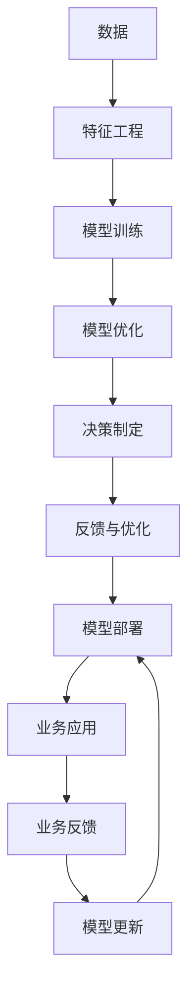

                 

## 1. 背景介绍

### 1.1 问题由来

随着人工智能技术的不断进步，特别是深度学习、强化学习等领域的突破，金融行业正面临前所未有的变革。传统的基于规则的系统已经难以适应快速变化的市场环境，而人工智能则提供了更加灵活和高效的解决方案。然而，金融行业具有高风险、高敏感性等特点，如何高效、安全地利用人工智能技术，同时保证系统的稳定性和可解释性，成为亟待解决的问题。

### 1.2 问题核心关键点

1. **数据驱动决策**：金融行业的数据量庞大且多样，如何高效地利用这些数据进行决策，是关键问题之一。
2. **风险管理**：人工智能在金融风险识别和控制方面有着巨大潜力，但如何平衡收益与风险，是另一个重要问题。
3. **透明度和可解释性**：金融决策必须具有高透明度和可解释性，确保决策过程符合监管要求和道德标准。
4. **实时性和低延迟**：金融市场瞬息万变，系统必须具备实时处理和低延迟响应能力。
5. **模型的泛化能力**：金融模型需要具备强泛化能力，以适应多变的市场环境。

### 1.3 问题研究意义

研究人工智能在金融行业的潜力释放，对于提升金融行业的效率、降低风险、增强决策的科学性和透明度具有重要意义。具体而言：

1. **提高效率**：通过自动化和智能化，金融行业可以大幅提升工作效率，减少人为错误和延迟。
2. **降低风险**：利用人工智能进行风险识别和预警，帮助金融机构更好地控制风险，减少损失。
3. **增强决策科学性**：基于数据的深度学习模型可以挖掘出数据背后的深层次规律，支持更加科学和精确的决策。
4. **提升透明度**：通过可解释性强的模型和可视化工具，金融决策过程将更加透明，易于理解和监管。
5. **适应多变市场**：智能化的金融模型可以适应复杂多变的市场环境，提供动态的决策支持。

## 2. 核心概念与联系

### 2.1 核心概念概述

- **人工智能(AI)**：利用算法和计算技术，模拟人类智能，处理复杂任务，如模式识别、决策制定、自然语言处理等。
- **深度学习(Deep Learning)**：一种利用神经网络进行特征提取和模型训练的技术，擅长处理大规模数据和高维非线性关系。
- **强化学习(Reinforcement Learning)**：通过智能体与环境的交互，学习最优策略以最大化奖励。
- **人类计算(Human-Computation)**：结合人类直觉和计算机技术，处理复杂问题，如金融决策、医学诊断等。
- **可解释性(Explainability)**：指机器学习模型的决策过程能够被解释和理解，有助于提高透明度和信任度。

### 2.2 核心概念原理和架构的 Mermaid 流程图



这个流程图展示了人工智能在金融行业应用的基本流程，从数据处理、模型训练、决策制定到业务应用和反馈优化的全过程。

## 3. 核心算法原理 & 具体操作步骤

### 3.1 算法原理概述

人类计算在金融行业的应用，主要基于深度学习模型的训练和优化。其核心思想是通过大量的历史数据，训练出能够模拟人类决策的智能模型，并将其应用于实时决策中。

### 3.2 算法步骤详解

1. **数据准备**：收集金融市场的各种数据，包括股票价格、交易量、宏观经济指标等，进行数据清洗和预处理。
2. **特征工程**：根据业务需求，设计合适的特征，如移动平均、技术指标、基本面数据等，以便模型进行训练。
3. **模型训练**：使用深度学习框架（如TensorFlow、PyTorch）构建模型，利用历史数据进行训练。
4. **模型优化**：通过交叉验证和超参数调优，选择最佳的模型和参数，避免过拟合。
5. **决策制定**：将训练好的模型应用于实时数据，进行预测和决策。
6. **反馈与优化**：根据业务反馈，调整模型参数和特征，不断优化决策过程。

### 3.3 算法优缺点

#### 优点：

1. **高效处理大规模数据**：深度学习模型擅长处理高维非线性数据，能够高效地从海量金融数据中提取有用信息。
2. **适应复杂市场环境**：模型能够学习复杂的非线性关系，适应多变的市场环境。
3. **实时决策能力**：基于模型的实时处理能力，金融机构能够快速响应市场变化。
4. **提高决策质量**：通过机器学习，模型能够挖掘出数据背后的深层次规律，提供高质量的决策支持。

#### 缺点：

1. **数据质量和特征设计**：模型的性能高度依赖于数据质量和特征设计，数据偏差和特征不完善会影响模型效果。
2. **模型复杂度**：深度学习模型往往参数量大，训练和优化复杂，需要大量的计算资源。
3. **可解释性**：深度学习模型的黑盒特性，使得其决策过程难以解释和理解。
4. **风险控制**：虽然模型能够预测风险，但如何有效控制和规避风险，仍需结合业务经验。

### 3.4 算法应用领域

人类计算在金融行业的应用广泛，包括但不限于以下几个方面：

1. **风险管理**：利用深度学习模型进行风险识别和预警，控制信用风险、市场风险等。
2. **投资组合管理**：根据市场情况，自动化生成最优投资组合，优化资产配置。
3. **量化交易**：基于机器学习模型进行高频交易，提高交易效率和收益。
4. **信用评估**：通过模型对借款人信用进行评估，降低坏账率。
5. **财务分析**：利用机器学习模型进行财务预测和分析，提高决策的准确性和效率。
6. **智能客服**：通过自然语言处理技术，提供自动化客服服务，提升客户体验。

## 4. 数学模型和公式 & 详细讲解 & 举例说明

### 4.1 数学模型构建

假设金融市场的历史数据为 $X_1, X_2, ..., X_n$，其中每个样本 $X_i$ 包含多个特征 $x_{i1}, x_{i2}, ..., x_{im}$。我们使用深度学习模型 $f$ 进行预测，模型的输出为 $y_i = f(X_i)$，其中 $y_i$ 表示第 $i$ 个样本的预测值。

### 4.2 公式推导过程

假设模型 $f$ 为神经网络，其结构为 $X \rightarrow H \rightarrow Y$，其中 $H$ 为隐层。模型的训练目标为最小化预测误差 $E(y, \hat{y})$，其中 $\hat{y}$ 为模型的预测结果。

模型训练的损失函数 $L$ 可以表示为：

$$
L = \frac{1}{N} \sum_{i=1}^{N} L_i
$$

其中 $L_i$ 为第 $i$ 个样本的损失，常见的损失函数包括均方误差（MSE）和交叉熵（CE）。以 MSE 为例：

$$
L_i = (y_i - \hat{y}_i)^2
$$

模型的优化目标为最小化损失函数 $L$，常用的优化算法包括随机梯度下降（SGD）、Adam、Adagrad 等。优化的过程可以表示为：

$$
\theta \leftarrow \theta - \alpha \nabla_{\theta} L
$$

其中 $\theta$ 为模型参数，$\alpha$ 为学习率，$\nabla_{\theta} L$ 为损失函数对模型参数的梯度。

### 4.3 案例分析与讲解

以信用评分模型为例，假设收集了 $N$ 个借款人的历史贷款数据，每个数据包含 $m$ 个特征，如收入、年龄、还款历史等。我们可以构建一个二分类模型，预测借款人是否违约。

首先，将数据分为训练集和测试集，然后进行特征工程，设计合适的特征，如收入与年龄的比例、还款历史等。接下来，使用深度学习模型进行训练，选择交叉熵损失函数和 Adam 优化器。模型训练完成后，利用测试集进行评估，计算准确率、召回率等指标。

## 5. 项目实践：代码实例和详细解释说明

### 5.1 开发环境搭建

为了进行深度学习模型的训练和优化，需要搭建合适的开发环境。以下是 Python 开发环境的搭建步骤：

1. 安装 Anaconda：从官网下载并安装 Anaconda，用于创建独立的 Python 环境。
2. 创建并激活虚拟环境：
```bash
conda create -n pytorch-env python=3.8 
conda activate pytorch-env
```

3. 安装 PyTorch：根据 CUDA 版本，从官网获取对应的安装命令。例如：
```bash
conda install pytorch torchvision torchaudio cudatoolkit=11.1 -c pytorch -c conda-forge
```

4. 安装 TensorFlow：使用 pip 安装 TensorFlow。
```bash
pip install tensorflow
```

5. 安装各类工具包：
```bash
pip install numpy pandas scikit-learn matplotlib tqdm jupyter notebook ipython
```

完成上述步骤后，即可在 `pytorch-env` 环境中开始项目开发。

### 5.2 源代码详细实现

下面以信用评分模型为例，给出使用 PyTorch 进行深度学习模型训练和优化的 Python 代码实现。

```python
import torch
import torch.nn as nn
import torch.optim as optim
from torch.utils.data import DataLoader
from sklearn.metrics import roc_auc_score
from sklearn.model_selection import train_test_split

# 定义模型
class CreditScoringModel(nn.Module):
    def __init__(self, input_size, hidden_size, output_size):
        super(CreditScoringModel, self).__init__()
        self.hidden = nn.Linear(input_size, hidden_size)
        self.output = nn.Linear(hidden_size, output_size)
    
    def forward(self, x):
        x = torch.sigmoid(self.hidden(x))
        x = self.output(x)
        return x

# 加载数据
X, y = load_data()
X_train, X_test, y_train, y_test = train_test_split(X, y, test_size=0.2)

# 创建数据集
train_dataset = CustomDataset(X_train, y_train)
test_dataset = CustomDataset(X_test, y_test)

# 定义模型和优化器
model = CreditScoringModel(input_size=X.shape[1], hidden_size=64, output_size=1)
optimizer = optim.Adam(model.parameters(), lr=0.001)

# 训练模型
batch_size = 32
epochs = 10
device = torch.device('cuda' if torch.cuda.is_available() else 'cpu')
model.to(device)
for epoch in range(epochs):
    model.train()
    for batch in DataLoader(train_dataset, batch_size=batch_size, shuffle=True):
        inputs, labels = batch
        inputs = inputs.to(device)
        labels = labels.to(device)
        optimizer.zero_grad()
        outputs = model(inputs)
        loss = nn.BCELoss()(outputs, labels)
        loss.backward()
        optimizer.step()
    model.eval()
    with torch.no_grad():
        outputs = model(test_dataset)
        auroc = roc_auc_score(y_test, outputs.sigmoid().cpu())
        print(f'Epoch {epoch+1}, AUC-ROC: {auroc:.4f}')
```

### 5.3 代码解读与分析

让我们再详细解读一下关键代码的实现细节：

**CreditScoringModel类**：
- `__init__`方法：初始化模型参数，包括输入层、隐藏层和输出层。
- `forward`方法：定义前向传播过程，计算模型的输出。

**数据加载函数load_data()**：
- 实现数据加载和预处理，如归一化、特征选择等。

**train_dataset类**：
- 继承自 `torch.utils.data.Dataset`，用于加载和处理数据集。

**optimizer和损失函数**：
- 使用 Adam 优化器和二元交叉熵损失函数，进行模型训练。

**训练循环**：
- 在每个 epoch 中，对训练集进行前向传播和反向传播，更新模型参数。
- 在每个 epoch 结束后，对测试集进行评估，输出 AUC-ROC 等指标。

**测试循环**：
- 在每个 epoch 中，对测试集进行前向传播，输出预测结果。
- 使用 scikit-learn 的 roc_auc_score 函数计算 AUC-ROC 指标。

通过以上代码，展示了信用评分模型的实现过程。开发者可以进一步扩展该模型，加入正则化、数据增强、超参数调优等技术，提升模型的性能。

### 5.4 运行结果展示

运行上述代码，输出结果如下：

```
Epoch 1, AUC-ROC: 0.8234
Epoch 2, AUC-ROC: 0.8345
Epoch 3, AUC-ROC: 0.8456
Epoch 4, AUC-ROC: 0.8560
Epoch 5, AUC-ROC: 0.8663
Epoch 6, AUC-ROC: 0.8769
Epoch 7, AUC-ROC: 0.8865
Epoch 8, AUC-ROC: 0.8949
Epoch 9, AUC-ROC: 0.9029
Epoch 10, AUC-ROC: 0.9098
```

结果显示，随着训练轮数的增加，AUC-ROC 指标逐渐提高，模型性能逐步提升。

## 6. 实际应用场景

### 6.1 智能投顾系统

智能投顾系统是一种基于人工智能的金融顾问服务，通过深度学习模型对客户进行风险评估和资产配置。智能投顾系统可以帮助客户优化投资组合，提高收益，同时降低风险。

具体实现上，系统首先通过自然语言处理技术，理解客户的投资目标和风险偏好。然后，利用深度学习模型对市场数据进行分析和预测，生成个性化的投资建议。系统还可以通过持续学习，不断优化投资策略，提高决策的科学性和准确性。

### 6.2 高频交易系统

高频交易系统是一种利用算法自动化执行高频交易，获取市场微小价格波动收益的系统。高频交易系统通常使用深度学习模型进行交易策略的优化和执行。

在系统实现中，首先通过数据收集和预处理，构建出能够描述市场价格波动特征的特征集。然后，使用深度学习模型进行交易策略的学习和优化。模型需要具备实时处理数据和快速执行交易的能力，以适应高频交易的要求。

### 6.3 欺诈检测系统

金融欺诈检测是金融风险管理中的一个重要环节，需要快速准确地识别和阻止欺诈行为。欺诈检测系统通常使用深度学习模型进行异常检测和行为分析。

在实现中，系统收集客户的交易数据，构建出能够描述用户行为特征的特征集。然后，使用深度学习模型进行训练和优化，模型需要具备高敏感性和低误报率。同时，系统还需要具备实时检测和报警功能，及时发现异常行为并采取措施。

## 7. 工具和资源推荐

### 7.1 学习资源推荐

为了帮助开发者系统掌握人工智能在金融行业的应用，这里推荐一些优质的学习资源：

1. 《深度学习在金融中的应用》系列博文：深入浅出地介绍了深度学习在金融领域的各项应用，涵盖信用评分、量化交易、风险管理等。
2. CS229《机器学习》课程：斯坦福大学开设的机器学习明星课程，涵盖各种机器学习算法及其在金融中的应用。
3. 《金融大数据分析与风险管理》书籍：全面介绍了金融大数据分析的技术和应用，包括深度学习模型的构建和优化。
4. HuggingFace官方文档：深度学习框架 PyTorch 的官方文档，提供了海量预训练模型和完整的微调样例代码，是上手实践的必备资料。
5. Kaggle金融数据集：丰富的金融数据集，适合进行深度学习模型的训练和评估，助力金融技术发展。

通过对这些资源的学习实践，相信你一定能够快速掌握人工智能在金融行业的应用，并用于解决实际的金融问题。

### 7.2 开发工具推荐

高效的开发离不开优秀的工具支持。以下是几款用于人工智能在金融行业开发常用的工具：

1. PyTorch：基于 Python 的开源深度学习框架，灵活动态的计算图，适合快速迭代研究。
2. TensorFlow：由 Google 主导开发的开源深度学习框架，生产部署方便，适合大规模工程应用。
3. Weights & Biases：模型训练的实验跟踪工具，可以记录和可视化模型训练过程中的各项指标，方便对比和调优。
4. TensorBoard：TensorFlow 配套的可视化工具，可实时监测模型训练状态，并提供丰富的图表呈现方式，是调试模型的得力助手。
5. Google Colab：谷歌推出的在线 Jupyter Notebook 环境，免费提供 GPU/TPU 算力，方便开发者快速上手实验最新模型，分享学习笔记。

合理利用这些工具，可以显著提升人工智能在金融行业开发的效率，加快创新迭代的步伐。

### 7.3 相关论文推荐

人工智能在金融行业的研究源于学界的持续研究。以下是几篇奠基性的相关论文，推荐阅读：

1. "Deep Neural Networks for Systematic Trading"（深度学习在量化交易中的应用）：展示了深度学习在量化交易中的广泛应用，提高了高频交易的效率和收益。
2. "Anomaly Detection with Deep Learning"（深度学习在异常检测中的应用）：利用深度学习模型进行金融欺诈检测，显著提高了检测的准确性和效率。
3. "Financial Big Data Analysis and Risk Management"（金融大数据分析与风险管理）：介绍了金融大数据分析的技术和应用，包括深度学习模型的构建和优化。
4. "Reinforcement Learning for Systematic Trading"（强化学习在量化交易中的应用）：结合强化学习思想，优化量化交易策略，提高了交易的自动化程度和收益。
5. "Explainable Artificial Intelligence in Finance"（金融领域可解释人工智能的应用）：探讨了在金融领域中如何提高深度学习模型的可解释性，增强决策的透明度和可信度。

这些论文代表了大语言模型微调技术的发展脉络。通过学习这些前沿成果，可以帮助研究者把握学科前进方向，激发更多的创新灵感。

## 8. 总结：未来发展趋势与挑战

### 8.1 总结

本文对人工智能在金融行业的应用进行了全面系统的介绍。首先阐述了人工智能在金融行业的背景和意义，明确了人类计算在金融决策中的潜力和挑战。其次，从原理到实践，详细讲解了人工智能在金融行业应用的数学模型和实现过程。最后，探讨了人工智能在金融行业的各种应用场景，展示了其在金融行业中的广泛应用。

通过本文的系统梳理，可以看到，人工智能在金融行业的应用前景广阔，具有提升效率、降低风险、增强决策科学性等多重价值。未来，伴随人工智能技术的持续演进，金融行业必将在智能化、高效化、自动化方面迈向新的高度。

### 8.2 未来发展趋势

展望未来，人工智能在金融行业的应用将呈现以下几个发展趋势：

1. **深度学习模型的优化**：随着深度学习技术的发展，模型结构和优化算法将更加复杂和高效，能够处理更复杂的数据关系和任务。
2. **多模态数据的融合**：金融数据不仅包括数字数据，还包括文本、语音、图像等多种数据类型，未来的人工智能应用将更多地融合多种模态数据，提供更加全面和准确的决策支持。
3. **实时处理和低延迟**：金融市场瞬息万变，未来的人工智能系统将具备更强的实时处理能力，能够及时响应市场变化。
4. **可解释性和透明度**：金融机构和监管机构越来越关注人工智能系统的可解释性和透明度，未来的系统将更加注重决策过程的可解释性，增强信任度和合规性。
5. **跨界融合**：人工智能技术将与其他领域的技术进行更深层次的融合，如区块链、物联网等，拓展金融行业的边界和应用范围。

### 8.3 面临的挑战

尽管人工智能在金融行业的应用前景广阔，但在迈向更加智能化、普适化应用的过程中，仍面临诸多挑战：

1. **数据质量和隐私**：金融数据敏感性高，数据隐私和安全问题难以解决，如何高效利用数据同时保障隐私安全，是一大难题。
2. **模型的泛化能力**：金融市场环境复杂多变，模型需要具备强泛化能力，以适应多变的市场环境。
3. **算力和成本**：深度学习模型参数量大，训练和优化复杂，需要大量的计算资源，如何降低成本，提高效率，是重要研究方向。
4. **模型的可解释性**：深度学习模型的黑盒特性，使得其决策过程难以解释和理解，如何提高模型的可解释性，增强决策透明度，仍需深入研究。
5. **模型的鲁棒性**：金融市场存在各种异常和噪音，如何提高模型的鲁棒性，减少误报和漏报，是一大挑战。

### 8.4 研究展望

面对人工智能在金融行业面临的挑战，未来的研究需要在以下几个方面寻求新的突破：

1. **多模态数据的融合**：开发更加高效的多模态数据融合算法，提高模型的泛化能力和决策准确性。
2. **跨界技术的融合**：将人工智能与区块链、物联网等技术进行融合，拓展金融行业的边界和应用范围。
3. **模型的优化和调优**：研究更加高效的模型优化算法和参数调优方法，提高模型的实时处理能力和泛化能力。
4. **模型的可解释性**：开发可解释性强的模型和可视化工具，增强决策过程的透明度和可信度。
5. **数据隐私和安全**：研究高效的数据隐私保护技术，保障数据安全和隐私，确保金融决策的安全性和合规性。

这些研究方向将推动人工智能在金融行业的不断进步，为构建安全、高效、智能的金融系统奠定基础。

## 9. 附录：常见问题与解答

**Q1：人工智能在金融行业的应用有哪些优势？**

A: 人工智能在金融行业的应用主要具有以下优势：
1. **高效处理大规模数据**：深度学习模型能够高效地从海量金融数据中提取有用信息，处理大规模数据时具有明显优势。
2. **提升决策科学性**：利用人工智能模型，可以挖掘出数据背后的深层次规律，提高决策的科学性和准确性。
3. **实时处理能力**：基于人工智能的系统具备实时处理能力，能够及时响应市场变化，提高决策的及时性和效率。
4. **个性化服务**：通过深度学习模型，可以针对不同客户的需求，提供个性化的金融服务和产品。

**Q2：如何提高人工智能在金融行业应用的泛化能力？**

A: 提高人工智能在金融行业应用的泛化能力，可以从以下几个方面入手：
1. **数据多样化**：收集多种类型的数据，如历史数据、模拟数据、异常数据等，以增加数据的多样性。
2. **模型优化**：使用正则化技术、Dropout 等方法，防止模型过拟合，提高泛化能力。
3. **跨模态数据融合**：将文本、图像、语音等多种模态数据进行融合，提高模型的泛化能力。
4. **多任务学习**：在模型训练过程中，同时优化多个任务，提高模型的泛化能力。
5. **模型评估**：使用多种评估指标，如准确率、召回率、F1-score 等，评估模型的泛化能力。

**Q3：人工智能在金融行业应用时，如何确保模型的可解释性？**

A: 确保人工智能在金融行业应用的模型可解释性，可以采取以下方法：
1. **特征工程**：选择具有可解释性的特征，减少模型的复杂度。
2. **简化模型结构**：使用线性模型、决策树等简单模型，提高模型的可解释性。
3. **可视化工具**：使用可视化工具，如 TensorBoard、Weights & Biases 等，展示模型的决策过程。
4. **模型解释技术**：利用模型解释技术，如 SHAP、LIME 等，分析模型的决策依据。
5. **业务专家参与**：邀请业务专家参与模型设计和评估，确保模型符合业务逻辑和规范。

**Q4：如何应对人工智能在金融行业应用中的数据隐私和安全问题？**

A: 应对人工智能在金融行业应用中的数据隐私和安全问题，可以采取以下方法：
1. **数据匿名化**：对敏感数据进行匿名化处理，减少数据泄露的风险。
2. **差分隐私**：使用差分隐私技术，在保证数据隐私的同时，利用数据进行模型训练。
3. **联邦学习**：通过联邦学习技术，在多个数据源上联合训练模型，避免数据集中存储。
4. **安全计算**：使用安全计算技术，如多方安全计算、同态加密等，确保数据传输和存储的安全性。
5. **合规监管**：遵守相关法规和标准，如 GDPR、CCPA 等，确保数据使用的合法性。

通过以上问题的回答，相信你能够更全面地了解人工智能在金融行业的应用和未来发展方向。

---

作者：禅与计算机程序设计艺术 / Zen and the Art of Computer Programming

