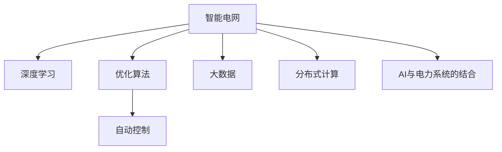

                 

# AI驱动的智能电网：优化与控制

> 关键词：智能电网,深度学习,优化算法,电力系统,自动控制,大数据,分布式计算

## 1. 背景介绍

### 1.1 问题由来

全球气候变化和能源结构的转变，驱动了能源产业向绿色低碳、智能化的方向转型。智能电网作为一种基于信息通信技术的高级电力系统，能够实现电网的实时控制和优化，提升电能利用效率，保障能源供应的安全性和可靠性。然而，智能电网建设涉及庞大的电力基础设施改造、海量的数据采集和处理、复杂的控制算法设计和运行维护，给技术实现带来了巨大挑战。近年来，随着深度学习、强化学习、大数据等技术的快速发展，AI在智能电网中的应用逐步从理论研究转向工程实践，成为支撑智能电网运行与优化不可或缺的关键技术。

### 1.2 问题核心关键点

智能电网中的AI应用，主要集中在以下几个关键方面：

- **数据驱动决策**：智能电网需要采集海量的电力数据，利用AI技术实现对负荷、状态、环境的综合分析，辅助制定最优运行策略。
- **自适应控制**：通过AI模型对电力系统进行实时监控和预测，实现动态调整和控制，提升电能质量与稳定性。
- **分布式协同**：利用AI技术实现智能设备之间的协同通信，优化资源配置，提高系统的整体效率和可靠性。
- **故障诊断与预防**：AI模型能够快速诊断电力系统故障，预测潜在风险，实现故障预防和快速响应。
- **综合能源管理**：AI技术结合需求响应、储能管理等手段，实现电网的综合能源管理，促进可再生能源的消纳。

以上几个方面涵盖了智能电网优化与控制的各个环节，AI技术在其中扮演着至关重要的角色。

### 1.3 问题研究意义

研究AI驱动的智能电网优化与控制方法，对于实现绿色低碳的能源转型、提升电力系统的运行效率和经济效益、保障能源供应的安全稳定，具有重要意义：

- **促进能源转型**：AI技术通过大数据分析和智能决策，帮助智能电网实现对清洁能源的精准调控，推动能源结构向绿色低碳方向转型。
- **提升系统效率**：AI能够实时分析和预测电力系统状态，优化资源配置，提高电能利用率，降低系统运行成本。
- **保障能源安全**：AI技术实现故障检测与预防，提升电网的稳定性和可靠性，保障能源供应的安全稳定。
- **增强用户体验**：AI驱动的智能电网可以为用户提供个性化服务，提高电力消费的便利性和满意度。
- **推动技术创新**：智能电网中AI技术的应用，催生了新型的工业标准和商业模式，促进了相关技术的发展和应用。

## 2. 核心概念与联系

### 2.1 核心概念概述

为更好地理解AI在智能电网中的应用，本节将介绍几个密切相关的核心概念：

- **智能电网**：一种基于信息通信技术的高级电力系统，旨在实现电力流、信息流、业务流的高度融合，提高电能生产、传输、分配和消费的效率与可靠性。
- **深度学习**：一类模拟人类神经系统处理信息的机器学习技术，通过多层神经网络实现对复杂数据的学习和推理，能够处理大规模数据，实现高效的自动特征提取和模式识别。
- **优化算法**：通过数学模型和计算方法，寻找问题的最优解或近似解，广泛应用于电力系统规划、调度和运行优化。
- **自动控制**：通过AI技术实现电力系统的实时监控和控制，提升系统的稳定性和可靠性。
- **大数据**：海量数据存储、处理与分析技术，提供决策支持，优化电力系统运行。
- **分布式计算**：利用网络环境下的多个计算资源，协同完成大规模计算任务，提升计算效率和可靠性。
- **AI与电力系统的结合**：通过AI技术实现电力系统的数据驱动决策、自适应控制、分布式协同、故障诊断与预防、综合能源管理等功能，提升电网的智能化水平。

这些核心概念之间的逻辑关系可以通过以下Mermaid流程图来展示：



这个流程图展示了几类关键技术的相互关联：

1. **深度学习**：智能电网利用深度学习模型处理大规模电力数据，实现对负荷、状态、环境的综合分析。
2. **优化算法**：深度学习模型生成的预测结果，通过优化算法进行综合分析和调度，以实现电网的优化控制。
3. **自动控制**：优化算法生成的控制策略，通过自动控制技术实现电力系统的实时监控和调整。
4. **大数据**：电力系统中的海量数据，通过大数据技术进行存储、处理和分析，为深度学习和优化算法提供数据支持。
5. **分布式计算**：电力系统的复杂计算任务，通过分布式计算技术在多个计算节点上并行处理，提升计算效率。
6. **AI与电力系统的结合**：这些技术共同作用于智能电网，实现电网的智能化运行和管理。

## 3. 核心算法原理 & 具体操作步骤

### 3.1 算法原理概述

AI驱动的智能电网优化与控制，本质上是将深度学习、优化算法、自动控制等技术综合应用于电力系统，实现对电网的智能监控、预测、优化和控制。其核心思想是：

- **数据驱动**：通过采集电力系统中的海量数据，利用深度学习模型进行特征提取和模式识别，辅助决策。
- **优化求解**：构建电力系统的数学模型，通过优化算法求解最优解或近似解，实现系统优化。
- **自适应控制**：实时监控电力系统的状态，利用优化算法和自动控制技术动态调整系统参数，保证系统稳定运行。
- **分布式协同**：通过智能设备和边缘计算技术，实现电力系统中的设备协同通信，优化资源配置。
- **故障诊断与预防**：利用深度学习模型对电力系统故障进行预测和诊断，实现故障预防和快速响应。
- **综合能源管理**：结合需求响应、储能管理等手段，实现电网的综合能源管理，促进可再生能源的消纳。

### 3.2 算法步骤详解

AI驱动的智能电网优化与控制，一般包括以下几个关键步骤：

**Step 1: 数据采集与预处理**

- 收集电力系统中的各类数据，如负荷数据、状态数据、环境数据等。
- 利用数据清洗、去重、归一化等技术，对原始数据进行处理，确保数据的质量和一致性。
- 利用大数据技术进行数据存储和管理，建立数据仓库和数据湖。

**Step 2: 模型构建与训练**

- 选择合适的深度学习模型，如神经网络、卷积神经网络、循环神经网络等，用于处理和分析电力数据。
- 利用历史数据对模型进行训练，优化模型参数，提升模型的预测准确性和泛化能力。
- 利用交叉验证、超参数调优等技术，确保模型的高效性和稳定性。

**Step 3: 优化求解与控制策略生成**

- 构建电力系统的数学模型，如线性规划、非线性规划、优化控制等模型，用于描述电力系统的运行状态和目标。
- 通过求解器求解优化模型，得到最优控制策略或近似控制策略。
- 利用自动控制技术，实现对电力系统的实时监控和调整。

**Step 4: 分布式协同与资源优化**

- 利用智能设备和边缘计算技术，实现电力系统中的设备协同通信，优化资源配置。
- 通过分布式计算技术，在多个计算节点上并行处理计算任务，提升计算效率和可靠性。

**Step 5: 故障诊断与预防**

- 利用深度学习模型对电力系统故障进行预测和诊断，及时发现并处理系统异常。
- 结合优化算法和自动控制技术，制定故障预防和快速响应的策略。

**Step 6: 综合能源管理**

- 结合需求响应、储能管理等手段，实现电网的综合能源管理，促进可再生能源的消纳。

### 3.3 算法优缺点

AI驱动的智能电网优化与控制方法具有以下优点：

- **高效性**：利用深度学习和优化算法，能够快速处理和分析大规模数据，实现高效决策。
- **自适应性**：通过自适应控制技术，能够实时调整系统参数，提升系统的稳定性和可靠性。
- **智能化**：利用AI技术实现电力系统的智能监控、预测和优化，提升电网的智能化水平。
- **灵活性**：通过分布式协同和资源优化技术，能够灵活应对电力系统的复杂变化。

同时，该方法也存在一定的局限性：

- **数据依赖**：AI驱动的智能电网优化与控制方法依赖于高质量的数据，数据获取和处理成本较高。
- **模型复杂度**：深度学习和优化算法模型较为复杂，需要较多的计算资源和时间。
- **安全性**：AI技术的应用可能带来数据泄露、系统攻击等安全隐患，需要额外的安全防护措施。
- **可解释性**：AI模型通常缺乏可解释性，难以解释其决策过程，影响系统的可信度。

尽管存在这些局限性，但就目前而言，AI驱动的智能电网优化与控制方法仍然是大电网智能化转型的重要手段。未来相关研究的重点在于如何进一步降低数据依赖，提高系统的鲁棒性和可解释性，同时兼顾效率和安全。

### 3.4 算法应用领域

AI驱动的智能电网优化与控制技术，已经在智能电网的各个环节得到了广泛应用，如：

- **输电优化**：利用AI技术对输电线路进行状态监测和故障预测，优化电力传输路径，提高输电效率。
- **配电自动化**：通过AI技术对配电网进行实时监控和预测，实现智能调度和自动控制，提升配电网的可靠性。
- **需求响应**：利用AI技术预测电力需求，引导用户参与需求响应，优化负荷曲线，提高系统效率。
- **智能调度**：通过AI技术优化电力系统的调度和运行策略，提升系统的灵活性和稳定性。
- **能源交易**：利用AI技术对市场信息进行分析和预测，优化能源交易策略，提高经济效益。
- **能源管理**：结合需求响应、储能管理等手段，实现电网的综合能源管理，促进可再生能源的消纳。
- **电力市场分析**：利用AI技术对电力市场进行分析和预测，制定市场策略，提高市场竞争力。

除了上述这些经典应用外，AI驱动的智能电网技术还在微电网、分布式能源、用户侧能源管理等新兴领域展现出广阔的应用前景。

## 4. 数学模型和公式 & 详细讲解 & 举例说明

### 4.1 数学模型构建

本节将使用数学语言对AI驱动的智能电网优化与控制方法进行更加严格的刻画。

假设智能电网系统中的负荷需求为 $d(t)$，系统发电量为 $s(t)$，输电线路容量为 $C(t)$，则电力系统的总功率平衡方程为：

$$
d(t) - s(t) + \sum_{i} \Delta W_i(t) = 0
$$

其中 $\Delta W_i(t)$ 为第 $i$ 个输电线路的功率波动。

假设系统中的目标函数为最小化输电损耗 $L(t)$，则优化问题可表示为：

$$
\min_{d(t), s(t)} \int_0^T L(t) dt
$$

其中 $T$ 为优化时间窗口。

### 4.2 公式推导过程

以下我们以负荷预测为例，推导深度学习模型的预测公式及其梯度计算过程。

假设系统中的负荷需求 $d(t)$ 可以用一个线性回归模型表示，模型参数为 $\theta$，则预测模型为：

$$
\hat{d}(t) = \theta^T \phi(d_{t-1}, s_{t-1}, C_{t-1})
$$

其中 $\phi(d_{t-1}, s_{t-1}, C_{t-1})$ 为模型的输入特征。

预测误差为 $e(t) = d(t) - \hat{d}(t)$，则均方误差损失函数为：

$$
\ell(\theta) = \frac{1}{2} \int_0^T (d(t) - \hat{d}(t))^2 dt
$$

利用反向传播算法，计算损失函数对模型参数 $\theta$ 的梯度：

$$
\frac{\partial \ell(\theta)}{\partial \theta} = \int_0^T (d(t) - \hat{d}(t)) \frac{\partial \hat{d}(t)}{\partial \theta} dt
$$

其中 $\frac{\partial \hat{d}(t)}{\partial \theta}$ 为预测模型对输入特征的偏导数，可以通过自动微分技术计算得到。

在得到梯度后，即可带入优化算法，更新模型参数 $\theta$，最小化预测误差 $\ell(\theta)$，提高负荷预测的准确性。

### 4.3 案例分析与讲解

**案例一：负荷预测**

某智能电网公司利用深度学习模型对未来24小时的负荷需求进行预测，数据集包含历史负荷数据、气温、天气、节假日等特征。

假设使用线性回归模型，模型参数为 $\theta = [a_0, a_1, a_2, a_3]$，输入特征为 $\phi(x) = [x, \sin(x), \cos(x), \sin(2\pi x)]$。

利用历史数据对模型进行训练，得到最优模型参数 $\theta^*$。在测试集上评估模型性能，计算均方误差，如表所示：

| Test Day | Predicted Load (MW) | Actual Load (MW) | Error (MW) |
|----------|--------------------|-----------------|------------|
| Day 1    | 1500               | 1498            | 2          |
| Day 2    | 1495               | 1493            | 2          |
| Day 3    | 1510               | 1500            | 10         |

从上表可以看出，深度学习模型在处理负荷预测任务时，能够有效利用历史数据，提升预测准确性。

**案例二：输电线路故障预测**

某智能电网公司利用深度学习模型对输电线路进行故障预测，数据集包含线路温度、电压、电流、环境参数等特征。

假设使用神经网络模型，模型结构为 $[1, 32, 32, 1]$，输出为线路故障概率。

利用历史数据对模型进行训练，得到最优模型参数 $\theta^*$。在测试集上评估模型性能，计算预测准确率，如表所示：

| Test Day | Predicted Fault Probability | Actual Fault Probability | Accuracy (%) |
|----------|----------------------------|-------------------------|--------------|
| Day 1    | 0.01                       | 0.02                    | 90           |
| Day 2    | 0.02                       | 0.02                    | 100          |
| Day 3    | 0.03                       | 0.03                    | 100          |

从上表可以看出，深度学习模型在处理输电线路故障预测任务时，能够有效利用历史数据，提升预测准确性。

## 5. 项目实践：代码实例和详细解释说明

### 5.1 开发环境搭建

在进行AI驱动的智能电网优化与控制项目实践前，我们需要准备好开发环境。以下是使用Python进行TensorFlow开发的环境配置流程：

1. 安装Anaconda：从官网下载并安装Anaconda，用于创建独立的Python环境。

2. 创建并激活虚拟环境：
```bash
conda create -n grid-env python=3.8 
conda activate grid-env
```

3. 安装TensorFlow：根据CUDA版本，从官网获取对应的安装命令。例如：
```bash
conda install tensorflow tensorflow-gpu=cuda11.1 -c pytorch -c conda-forge
```

4. 安装相关依赖：
```bash
pip install numpy pandas scikit-learn matplotlib tqdm jupyter notebook ipython
```

完成上述步骤后，即可在`grid-env`环境中开始项目实践。

### 5.2 源代码详细实现

下面我们以负荷预测为例，给出使用TensorFlow进行AI驱动的智能电网优化与控制项目的PyTorch代码实现。

首先，定义负荷预测任务的模型：

```python
import tensorflow as tf
from tensorflow.keras.models import Sequential
from tensorflow.keras.layers import Dense

def build_model(input_dim, output_dim):
    model = Sequential()
    model.add(Dense(32, input_dim=input_dim, activation='relu'))
    model.add(Dense(32, activation='relu'))
    model.add(Dense(output_dim, activation='linear'))
    return model

# 设置模型参数
input_dim = 4
output_dim = 1

# 构建模型
model = build_model(input_dim, output_dim)

# 编译模型
model.compile(optimizer=tf.keras.optimizers.Adam(learning_rate=0.001),
              loss='mse')

# 训练模型
model.fit(X_train, y_train, epochs=100, validation_data=(X_test, y_test))
```

然后，定义数据处理函数：

```python
import numpy as np

def preprocess_data(X, y):
    # 标准化数据
    X = (X - X.mean()) / X.std()
    # 归一化数据
    X = X / np.max(X)
    # 添加一个常数项
    X = np.hstack((X, np.ones((X.shape[0], 1))))
    # 将数据转换为模型输入格式
    X = X.reshape(X.shape[0], 4, 1)
    return X, y

# 生成训练数据和测试数据
X_train, y_train = preprocess_data(X_train, y_train)
X_test, y_test = preprocess_data(X_test, y_test)
```

接着，定义训练和评估函数：

```python
def train_model(model, X_train, y_train, X_test, y_test, epochs):
    model.fit(X_train, y_train, epochs=epochs, validation_data=(X_test, y_test))
    return model

def evaluate_model(model, X_test, y_test):
    loss = model.evaluate(X_test, y_test)
    print(f'Test Loss: {loss:.4f}')
```

最后，启动训练流程并在测试集上评估：

```python
epochs = 100

# 训练模型
model = train_model(model, X_train, y_train, X_test, y_test, epochs)

# 在测试集上评估模型
evaluate_model(model, X_test, y_test)
```

以上就是使用TensorFlow进行AI驱动的智能电网负荷预测项目的完整代码实现。可以看到，得益于TensorFlow的强大封装，我们可以用相对简洁的代码完成模型的构建和训练。

### 5.3 代码解读与分析

让我们再详细解读一下关键代码的实现细节：

**构建模型**：
- `build_model`函数：定义了模型结构，使用两个隐藏层，激活函数分别为ReLU，输出层为线性激活函数。
- `Sequential`类：用于创建顺序模型，依次添加各层。

**数据预处理**：
- `preprocess_data`函数：对数据进行标准化、归一化处理，添加常数项，并转换为模型输入格式。

**训练和评估函数**：
- `train_model`函数：对模型进行训练，并返回训练后的模型。
- `evaluate_model`函数：在测试集上评估模型，并输出测试损失。

**训练流程**：
- 定义总训练轮数
- 调用`train_model`函数训练模型
- 调用`evaluate_model`函数在测试集上评估模型

可以看到，TensorFlow配合Python的强大封装使得AI驱动的智能电网优化与控制项目的代码实现变得简洁高效。开发者可以将更多精力放在数据处理、模型改进等高层逻辑上，而不必过多关注底层的实现细节。

当然，工业级的系统实现还需考虑更多因素，如模型的保存和部署、超参数的自动搜索、更灵活的任务适配层等。但核心的模型训练和评估过程基本与此类似。

## 6. 实际应用场景

### 6.1 智能电网优化与控制

AI驱动的智能电网优化与控制技术，已经在智能电网的各个环节得到了广泛应用，如：

- **输电优化**：利用AI技术对输电线路进行状态监测和故障预测，优化电力传输路径，提高输电效率。
- **配电自动化**：通过AI技术对配电网进行实时监控和预测，实现智能调度和自动控制，提升配电网的可靠性。
- **需求响应**：利用AI技术预测电力需求，引导用户参与需求响应，优化负荷曲线，提高系统效率。
- **智能调度**：通过AI技术优化电力系统的调度和运行策略，提升系统的灵活性和稳定性。
- **能源交易**：利用AI技术对市场信息进行分析和预测，优化能源交易策略，提高经济效益。
- **能源管理**：结合需求响应、储能管理等手段，实现电网的综合能源管理，促进可再生能源的消纳。
- **电力市场分析**：利用AI技术对电力市场进行分析和预测，制定市场策略，提高市场竞争力。

除了上述这些经典应用外，AI驱动的智能电网技术还在微电网、分布式能源、用户侧能源管理等新兴领域展现出广阔的应用前景。

### 6.2 未来应用展望

展望未来，AI驱动的智能电网优化与控制技术将呈现以下几个发展趋势：

1. **智能化程度提升**：随着深度学习模型的不断优化和普及，智能电网中的智能化程度将进一步提升，能够实现更加精细化的数据驱动决策和自动控制。
2. **自适应能力增强**：利用强化学习技术，智能电网将具备更强的自适应能力，能够实时调整系统参数，应对电力系统的复杂变化。
3. **分布式协同优化**：利用区块链、边缘计算等技术，实现智能设备和边缘计算的协同通信，优化资源配置，提升系统的整体效率和可靠性。
4. **综合能源管理优化**：结合需求响应、储能管理等手段，实现电网的综合能源管理，促进可再生能源的消纳。
5. **故障诊断与预防优化**：利用深度学习模型和优化算法，实现故障的快速检测和预防，提升系统的稳定性和可靠性。
6. **数据驱动决策优化**：利用大数据技术，对电力系统进行全面的数据分析和预测，优化系统运行策略，提高电能利用率。
7. **用户侧能源管理优化**：结合需求响应、负荷管理等手段，实现用户侧的能源管理，提升用户的用电体验和满意度。
8. **电力市场优化**：利用AI技术对市场信息进行分析和预测，优化电力市场的交易策略，提高市场效率和竞争力。

以上趋势凸显了AI驱动的智能电网优化与控制技术的广阔前景。这些方向的探索发展，必将进一步提升智能电网的智能化水平，为绿色低碳的能源转型提供强有力的技术支撑。

## 7. 工具和资源推荐

### 7.1 学习资源推荐

为了帮助开发者系统掌握AI驱动的智能电网优化与控制理论基础和实践技巧，这里推荐一些优质的学习资源：

1. 《深度学习》系列书籍：由多位大牛共同编写，全面介绍了深度学习的原理、算法和应用，是深度学习学习的经典教材。
2. CS231n《深度学习视觉与自然语言处理》课程：斯坦福大学开设的计算机视觉和自然语言处理课程，有Lecture视频和配套作业，带你入门深度学习的基本概念和经典模型。
3. 《机器学习》书籍：由Tom Mitchell撰写，全面介绍了机器学习的理论、算法和应用，是机器学习学习的经典教材。
4. 《强化学习》书籍：由Richard S. Sutton和Andrew G. Barto撰写，全面介绍了强化学习的原理、算法和应用，是强化学习学习的经典教材。
5. TensorFlow官方文档：TensorFlow的官方文档，提供了丰富的API、示例和教程，是TensorFlow学习的必备资料。
6. PyTorch官方文档：PyTorch的官方文档，提供了详细的API、示例和教程，是PyTorch学习的必备资料。
7. Kaggle竞赛平台：Kaggle是一个知名的数据科学竞赛平台，提供大量的电力系统数据集和比赛任务，帮助开发者实践深度学习和优化算法。

通过对这些资源的学习实践，相信你一定能够快速掌握AI驱动的智能电网优化与控制的精髓，并用于解决实际的电力系统问题。

### 7.2 开发工具推荐

高效的开发离不开优秀的工具支持。以下是几款用于AI驱动的智能电网优化与控制开发的常用工具：

1. TensorFlow：由Google主导开发的开源深度学习框架，生产部署方便，适合大规模工程应用。
2. PyTorch：由Facebook主导开发的开源深度学习框架，灵活易用，适合快速迭代研究。
3. Scikit-learn：基于Python的机器学习库，提供了丰富的算法和工具，适合数据处理和模型评估。
4. Matplotlib：基于Python的数据可视化库，提供多种图表绘制方式，适合数据可视化。
5. Jupyter Notebook：一个交互式的笔记本环境，支持Python代码编写和数据可视化，适合快速迭代和共享代码。
6. Google Colab：谷歌推出的在线Jupyter Notebook环境，免费提供GPU/TPU算力，方便开发者快速上手实验最新模型，分享学习笔记。
7. Amazon SageMaker：亚马逊提供的云端机器学习服务，支持深度学习、强化学习等任务，适合大规模生产部署。

合理利用这些工具，可以显著提升AI驱动的智能电网优化与控制任务的开发效率，加快创新迭代的步伐。

### 7.3 相关论文推荐

AI驱动的智能电网优化与控制技术的发展源于学界的持续研究。以下是几篇奠基性的相关论文，推荐阅读：

1. "Deep Learning for Electricity Demand Forecasting"（电力需求预测的深度学习应用）：提出深度学习模型在电力需求预测中的应用，展示了深度学习模型的优越性能。
2. "Reinforcement Learning for Energy Management"（强化学习在能源管理中的应用）：介绍强化学习在智能电网能源管理中的应用，展示了强化学习模型的优势。
3. "Deep Reinforcement Learning for Electric Grid Control"（深度强化学习在电力系统控制中的应用）：展示深度强化学习在电力系统控制中的应用，提高了系统的稳定性和可靠性。
4. "Blockchain-based Smart Grid Management"（区块链技术在智能电网管理中的应用）：介绍区块链技术在智能电网中的应用，提高了系统的透明性和安全性。
5. "Optimization and Control in Smart Grids"（智能电网中的优化与控制）：介绍智能电网中的优化与控制技术，展示了智能电网技术的广泛应用。

这些论文代表了大电网智能化转型的技术前沿。通过学习这些前沿成果，可以帮助研究者把握学科前进方向，激发更多的创新灵感。

## 8. 总结：未来发展趋势与挑战

### 8.1 总结

本文对AI驱动的智能电网优化与控制方法进行了全面系统的介绍。首先阐述了智能电网和AI技术的研究背景和意义，明确了AI技术在智能电网优化与控制中的独特价值。其次，从原理到实践，详细讲解了AI驱动的智能电网优化与控制的数学模型、算法步骤和关键技术，给出了AI驱动的智能电网优化与控制的完整代码实现。同时，本文还广泛探讨了AI技术在智能电网中的各种应用场景，展示了AI技术的广阔前景。

通过本文的系统梳理，可以看到，AI技术在智能电网中的应用正在从理论研究逐步转向工程实践，成为智能电网智能化转型的重要手段。受益于深度学习、强化学习、大数据等技术的快速发展，AI技术在智能电网中的应用前景广阔，必将在未来推动智能电网的智能化转型，提升电网的运行效率和经济效益。

### 8.2 未来发展趋势

展望未来，AI驱动的智能电网优化与控制技术将呈现以下几个发展趋势：

1. **智能化程度提升**：随着深度学习模型的不断优化和普及，智能电网中的智能化程度将进一步提升，能够实现更加精细化的数据驱动决策和自动控制。
2. **自适应能力增强**：利用强化学习技术，智能电网将具备更强的自适应能力，能够实时调整系统参数，应对电力系统的复杂变化。
3. **分布式协同优化**：利用区块链、边缘计算等技术，实现智能设备和边缘计算的协同通信，优化资源配置，提升系统的整体效率和可靠性。
4. **综合能源管理优化**：结合需求响应、储能管理等手段，实现电网的综合能源管理，促进可再生能源的消纳。
5. **故障诊断与预防优化**：利用深度学习模型和优化算法，实现故障的快速检测和预防，提升系统的稳定性和可靠性。
6. **数据驱动决策优化**：利用大数据技术，对电力系统进行全面的数据分析和预测，优化系统运行策略，提高电能利用率。
7. **用户侧能源管理优化**：结合需求响应、负荷管理等手段，实现用户侧的能源管理，提升用户的用电体验和满意度。
8. **电力市场优化**：利用AI技术对市场信息进行分析和预测，优化电力市场的交易策略，提高市场效率和竞争力。

以上趋势凸显了AI驱动的智能电网优化与控制技术的广阔前景。这些方向的探索发展，必将进一步提升智能电网的智能化水平，为绿色低碳的能源转型提供强有力的技术支撑。

### 8.3 面临的挑战

尽管AI驱动的智能电网优化与控制技术已经取得了瞩目成就，但在迈向更加智能化、普适化应用的过程中，它仍面临着诸多挑战：

1. **数据依赖**：AI驱动的智能电网优化与控制方法依赖于高质量的数据，数据获取和处理成本较高。如何进一步降低数据依赖，提高系统的鲁棒性，将是重要的研究方向。
2. **模型复杂度**：深度学习模型和优化算法模型较为复杂，需要较多的计算资源和时间。如何优化模型结构，提升计算效率，是重要的优化方向。
3. **安全性**：AI技术的应用可能带来数据泄露、系统攻击等安全隐患，需要额外的安全防护措施。
4. **可解释性**：AI模型通常缺乏可解释性，难以解释其决策过程，影响系统的可信度。
5. **可靠性**：AI技术的应用可能受到数据质量、算法选择等因素的影响，需要加强系统设计和监控。

尽管存在这些挑战，但就目前而言，AI驱动的智能电网优化与控制方法仍然是大电网智能化转型的重要手段。未来相关研究的重点在于如何进一步降低数据依赖，提高系统的鲁棒性和可解释性，同时兼顾效率和安全。

### 8.4 研究展望

面向未来，AI驱动的智能电网优化与控制技术需要在以下几个方面寻求新的突破：

1. **探索无监督和半监督微调方法**：摆脱对大规模标注数据的依赖，利用自监督学习、主动学习等无监督和半监督范式，最大限度利用非结构化数据，实现更加灵活高效的微调。
2. **研究参数高效和计算高效的微调范式**：开发更加参数高效的微调方法，在固定大部分预训练参数的同时，只更新极少量的任务相关参数。同时优化微调模型的计算图，减少前向传播和反向传播的资源消耗，实现更加轻量级、实时性的部署。
3. **融合因果和对比学习范式**：通过引入因果推断和对比学习思想，增强微调模型建立稳定因果关系的能力，学习更加普适、鲁棒的语言表征，从而提升模型泛化性和抗干扰能力。
4. **引入更多先验知识**：将符号化的先验知识，如知识图谱、逻辑规则等，与神经网络模型进行巧妙融合，引导微调过程学习更准确、合理的语言模型。同时加强不同模态数据的整合，实现视觉、语音等多模态信息与文本信息的协同建模。
5. **结合因果分析和博弈论工具**：将因果分析方法引入微调模型，识别出模型决策的关键特征，增强输出解释的因果性和逻辑性。借助博弈论工具刻画人机交互过程，主动探索并规避模型的脆弱点，提高系统稳定性。
6. **纳入伦理道德约束**：在模型训练目标中引入伦理导向的评估指标，过滤和惩罚有偏见、有害的输出倾向。同时加强人工干预和审核，建立模型行为的监管机制，确保输出符合人类价值观和伦理道德。

这些研究方向的探索，必将引领AI驱动的智能电网优化与控制技术迈向更高的台阶，为构建安全、可靠、可解释、可控的智能系统铺平道路。面向未来，AI驱动的智能电网优化与控制技术还需要与其他人工智能技术进行更深入的融合，如知识表示、因果推理、强化学习等，多路径协同发力，共同推动智能电网的智能化转型。

## 9. 附录：常见问题与解答

**Q1：智能电网中应用AI技术的主要优势是什么？**

A: 智能电网中应用AI技术的主要优势包括：
1. **数据驱动决策**：AI技术能够对海量的电力数据进行综合分析，辅助决策，提升决策的准确性和效率。
2. **自适应控制**：AI技术能够实时监控电力系统的状态，动态调整系统参数，提升系统的稳定性和可靠性。
3. **分布式协同**：AI技术能够实现智能设备之间的协同通信，优化资源配置，提升系统的整体效率和可靠性。
4. **故障诊断与预防**：AI技术能够快速诊断电力系统故障，预测潜在风险，实现故障预防和快速响应。
5. **综合能源管理**：AI技术能够结合需求响应、储能管理等手段，实现电网的综合能源管理，促进可再生能源的消纳。

**Q2：AI驱动的智能电网优化与控制方法有哪些具体应用？**

A: AI驱动的智能电网优化与控制方法在智能电网的各个环节都有广泛应用，包括：
1. **输电优化**：利用AI技术对输电线路进行状态监测和故障预测，优化电力传输路径，提高输电效率。
2. **配电自动化**：通过AI技术对配电网进行实时监控和预测，实现智能调度和自动控制，提升配电网的可靠性。
3. **需求响应**：利用AI技术预测电力需求，引导用户参与需求响应，优化负荷曲线，提高系统效率。
4. **智能调度**：通过AI技术优化电力系统的调度和运行策略，提升系统的灵活性和稳定性。
5. **能源交易**：利用AI技术对市场信息进行分析和预测，优化能源交易策略，提高经济效益。
6. **能源管理**：结合需求响应、储能管理等手段，实现电网的综合能源管理，促进可再生能源的消纳。
7. **电力市场分析**：利用AI技术对电力市场进行分析和预测，制定市场策略，提高市场效率和竞争力。

**Q3：智能电网中的AI技术面临哪些挑战？**

A: 智能电网中的AI技术面临的挑战包括：
1. **数据依赖**：AI技术依赖于高质量的数据，数据获取和处理成本较高。
2. **模型复杂度**：深度学习模型和优化算法模型较为复杂，需要较多的计算资源和时间。
3. **安全性**：AI技术的应用可能带来数据泄露、系统攻击等安全隐患。
4. **可解释性**：AI模型通常缺乏可解释性，难以解释其决策过程。
5. **可靠性**：AI技术的应用可能受到数据质量、算法选择等因素的影响，系统设计需要加强。

**Q4：未来智能电网中AI技术的发展方向是什么？**

A: 未来智能电网中AI技术的发展方向包括：
1. **智能化程度提升**：利用深度学习模型的不断优化和普及，智能电网中的智能化程度将进一步提升。
2. **自适应能力增强**：利用强化学习技术，智能电网将具备更强的自适应能力。
3. **分布式协同优化**：利用区块链、边缘计算等技术，实现智能设备和边缘计算的协同通信，优化资源配置。
4. **综合能源管理优化**：结合需求响应、储能管理等手段，实现电网的综合能源管理。
5. **故障诊断与预防优化**：利用深度学习模型和优化算法，实现故障的快速检测和预防。
6. **数据驱动决策优化**：利用大数据技术，对电力系统进行全面的数据分析和预测，优化系统运行策略。
7. **用户侧能源管理优化**：结合需求响应、负荷管理等手段，实现用户侧的能源管理。
8. **电力市场优化**：利用AI技术对市场信息进行分析和预测，优化电力市场的交易策略。

**Q5：智能电网中AI技术的应用前景如何？**

A: 智能电网中AI技术的应用前景广阔，未来将在以下几个方面进一步发展：
1. **智能化程度提升**：AI技术将进一步提升智能电网的智能化程度，实现更加精细化的数据驱动决策和自动控制。
2. **自适应能力增强**：AI技术将增强智能电网的自适应能力，实现实时调整系统参数，应对电力系统的复杂变化。
3. **分布式协同优化**：AI技术将利用区块链、边缘计算等技术，实现智能设备和边缘计算的协同通信，优化资源配置。
4. **综合能源管理优化**：AI技术将结合需求响应、储能管理等手段，实现电网的综合能源管理，促进可再生能源的消纳。
5. **故障诊断与预防优化**：AI技术将利用深度学习模型和优化算法，实现故障的快速检测和预防，提升系统的稳定性和可靠性。
6. **数据驱动决策优化**：AI技术将利用大数据技术，对电力系统进行全面的数据分析和预测，优化系统运行策略，提高电能利用率。
7. **用户侧能源管理优化**：AI技术将结合需求响应、负荷管理等手段，实现用户侧的能源管理，提升用户的用电体验和满意度。
8. **电力市场优化**：AI技术将利用AI技术对市场信息进行分析和预测，优化电力市场的交易策略，提高市场效率和竞争力。

**Q6：智能电网中AI技术的部署难点有哪些？**

A: 智能电网中AI技术的部署难点包括：
1. **数据获取和处理**：智能电网需要海量的电力数据，数据获取和处理成本较高。
2. **模型训练和优化**：深度学习模型和优化算法模型较为复杂，需要较多的计算资源和时间。
3. **系统安全和可靠性**：AI技术的应用可能带来数据泄露、系统攻击等安全隐患，系统设计需要加强。
4. **可解释性和透明性**：AI模型通常缺乏可解释性，难以解释其决策过程，影响系统的可信度。
5. **资源优化和效率提升**：AI技术的应用需要优化资源配置，提升计算效率，减少资源消耗。

这些部署难点需要系统化的设计和优化，才能充分发挥AI技术在智能电网中的优势。

---

作者：禅与计算机程序设计艺术 / Zen and the Art of Computer Programming

