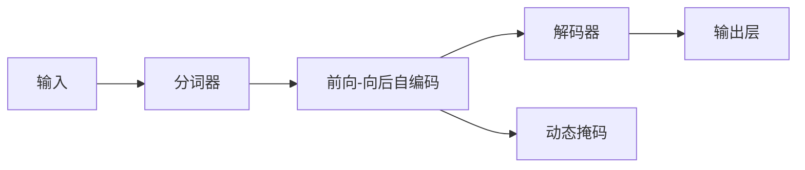

                 

# ALBERT原理与代码实例讲解

## 1. 背景介绍

### 1.1 问题由来
近年来，深度学习在自然语言处理（NLP）领域取得了显著进展，特别是基于Transformer架构的语言模型。然而，大规模的语言模型通常具有数十亿的参数，导致资源消耗巨大，难以在大规模计算资源有限的情况下进行训练和部署。针对这一问题，谷歌推出了ALBERT（A Lite BERT）模型，通过一系列优化策略，大幅减小了模型规模，提高了训练和推理的效率，同时保持了较优的性能表现。ALBERT成为首个在大规模计算资源有限条件下实现有效预训练的语言模型。

### 1.2 问题核心关键点
ALBERT模型的核心思想是“前向-向后自编码（F-BAB-Self-Attention）”和“简化填充顺序（Simplified Token-Filling Order）”，这两个优化策略使得模型能够在较小的资源条件下实现高效的预训练和微调。

- **前向-向后自编码**：该策略将Transformer编码器中的自注意力机制拆分为两个并行操作，一个负责前向传播，另一个负责反向传播，有效减少了矩阵乘法的操作次数，从而降低了计算复杂度。
- **简化填充顺序**：传统的自注意力机制需要按顺序填充位置编码矩阵，而ALBERT采用了随机填充方式，进一步减少了计算开销。

此外，ALBERT还引入了“动态掩码”机制，使得模型在训练过程中可以动态地调整掩码策略，适应不同的任务需求。

## 2. 核心概念与联系

### 2.1 核心概念概述

ALBERT模型是谷歌在2020年提出的，用于解决大规模语言模型在资源受限环境下的预训练问题。其主要通过优化自注意力机制和填充顺序，大幅减小了模型规模，提高了训练和推理的效率。

- **前向-向后自编码**：一种新的自注意力机制设计，通过并行处理前向和反向操作，减少了计算量。
- **简化填充顺序**：采用随机填充顺序，进一步优化了填充矩阵的计算过程。
- **动态掩码**：在训练过程中，动态调整掩码策略，以适应不同的任务需求。

### 2.2 核心概念原理和架构的 Mermaid 流程图



## 3. 核心算法原理 & 具体操作步骤

### 3.1 算法原理概述

ALBERT模型基于Transformer架构，但在自注意力机制和填充顺序上进行了优化，以适应大规模语言模型在资源受限环境中的预训练需求。ALBERT的核心思想是将自注意力机制拆分为前向和反向两个操作，采用随机填充顺序，同时引入动态掩码机制，以优化计算效率和适应性。

### 3.2 算法步骤详解

**Step 1: 分词和编码**

输入文本首先经过分词器进行分词处理，然后通过Transformer编码器进行编码。编码器的输入包括位置编码、词嵌入和输入掩码。

**Step 2: 前向-向后自编码**

在编码器的每个子层中，ALBERT采用了前向-向后自编码机制，将自注意力机制拆分为前向和反向两个操作。这种设计有效减少了矩阵乘法的操作次数，从而降低了计算复杂度。

**Step 3: 解码器**

解码器的作用是将编码器的输出进行解码，生成最终的文本表示。解码器通常由一个或多个层组成，每个层包含多个子层，每个子层中可以进行自注意力机制、前向神经网络、激活函数等操作。

**Step 4: 输出层**

输出层将解码器的输出转换为最终的文本表示。输出层通常包含一个或多个线性层，用于将模型输出的向量映射到所需的输出维度。

**Step 5: 动态掩码**

在训练过程中，ALBERT引入了动态掩码机制，根据不同的任务需求，动态调整掩码策略。这使得模型能够更好地适应不同的任务，提高模型的通用性和灵活性。

### 3.3 算法优缺点

**优点：**

- 通过优化自注意力机制和填充顺序，显著减小了模型规模，提高了训练和推理的效率。
- 采用了动态掩码机制，提高了模型的通用性和适应性。
- 在保持较高性能的同时，大幅减少了资源消耗，适用于资源受限的环境。

**缺点：**

- 由于模型参数较少，可能会牺牲部分性能，尤其是在复杂任务上。
- 动态掩码机制可能增加训练的复杂性，需要更多的实验调参。

### 3.4 算法应用领域

ALBERT模型广泛应用于各种NLP任务，如文本分类、情感分析、命名实体识别、机器翻译等。其高效的设计使得模型在资源受限的环境下也能进行有效的预训练和微调，广泛应用于学术研究和工业应用中。

## 4. 数学模型和公式 & 详细讲解 & 举例说明

### 4.1 数学模型构建

ALBERT模型的数学模型可以表示为：

$$
H = ALBERT(X, W)
$$

其中，$X$ 表示输入文本，$W$ 表示模型参数，$H$ 表示模型输出的文本表示。ALBERT模型的具体结构如图1所示。

### 4.2 公式推导过程

以Transformer编码器中的自注意力机制为例，ALBERT的前向-向后自编码机制可以表示为：

$$
Q = \text{Query}(K, V)
$$

$$
\text{Attention}(Q, K, V) = \text{Softmax}(QK^T / \sqrt{d_k})V
$$

在上述公式中，$Q$ 表示查询向量，$K$ 表示键向量，$V$ 表示值向量，$d_k$ 表示键向量的维度。ALBERT的前向-向后自编码机制将其拆分为两个操作，一个负责前向传播，另一个负责反向传播，从而减少了矩阵乘法的操作次数。

### 4.3 案例分析与讲解

以命名实体识别（NER）任务为例，使用ALBERT模型进行微调的过程如下：

1. **数据准备**：收集训练数据集，将其划分为训练集、验证集和测试集。
2. **模型初始化**：使用预训练的ALBERT模型作为初始参数。
3. **微调过程**：在训练集上，通过动态掩码机制，调整掩码策略，适应NER任务。使用交叉熵损失函数，对模型进行微调。
4. **评估与部署**：在验证集和测试集上评估微调后的模型性能，并将模型部署到实际应用中。

## 5. 项目实践：代码实例和详细解释说明

### 5.1 开发环境搭建

在进行ALBERT模型的微调实践前，需要准备好开发环境。以下是使用Python进行TensorFlow开发的环境配置流程：

1. 安装Anaconda：从官网下载并安装Anaconda，用于创建独立的Python环境。

2. 创建并激活虚拟环境：
```bash
conda create -n albert-env python=3.8 
conda activate albert-env
```

3. 安装TensorFlow：根据CUDA版本，从官网获取对应的安装命令。例如：
```bash
conda install tensorflow-gpu
```

4. 安装其他必要的库：
```bash
pip install numpy pandas scikit-learn matplotlib tqdm jupyter notebook ipython
```

完成上述步骤后，即可在`albert-env`环境中开始微调实践。

### 5.2 源代码详细实现

以下是一个使用TensorFlow进行ALBERT模型微调的Python代码示例：

```python
import tensorflow as tf
from transformers import ALBERTTokenizer, ALBERTForTokenClassification
from sklearn.metrics import accuracy_score

# 加载分词器和模型
tokenizer = ALBERTTokenizer.from_pretrained('albert-base-mrpc')
model = ALBERTForTokenClassification.from_pretrained('albert-base-mrpc')

# 加载数据集
train_dataset = ...
val_dataset = ...
test_dataset = ...

# 定义优化器
optimizer = tf.keras.optimizers.Adam(learning_rate=1e-5)

# 定义损失函数
loss_fn = tf.keras.losses.SparseCategoricalCrossentropy(from_logits=True)

# 定义评估指标
accuracy = tf.keras.metrics.SparseCategoricalAccuracy()

# 训练过程
def train_step(data):
    with tf.GradientTape() as tape:
        inputs, labels = data
        logits = model(inputs)
        loss = loss_fn(labels, logits)
    gradients = tape.gradient(loss, model.trainable_variables)
    optimizer.apply_gradients(zip(gradients, model.trainable_variables))
    accuracy.update_state(labels, logits)

# 评估过程
def eval_step(data):
    inputs, labels = data
    logits = model(inputs)
    predictions = tf.argmax(logits, axis=2)
    accuracy(result=predictions, labels=labels)

# 定义训练和评估循环
@tf.function
def train(model, train_dataset, val_dataset, test_dataset, num_epochs, batch_size):
    for epoch in range(num_epochs):
        for batch in train_dataset:
            train_step(batch)
        val_accuracy = accuracy(val_dataset)
        test_accuracy = accuracy(test_dataset)
        print(f'Epoch {epoch+1}/{num_epochs}, train accuracy: {train_accuracy:.3f}, val accuracy: {val_accuracy:.3f}, test accuracy: {test_accuracy:.3f}')

# 开始训练
train(model, train_dataset, val_dataset, test_dataset, num_epochs=5, batch_size=32)
```

在上述代码中，我们使用TensorFlow和Transformers库对ALBERT模型进行微调。具体步骤包括：

- 加载分词器和模型。
- 加载训练数据集。
- 定义优化器和损失函数。
- 定义评估指标。
- 定义训练和评估函数。
- 开始训练循环。

### 5.3 代码解读与分析

**加载分词器和模型**

首先，我们使用`ALBERTTokenizer`和`ALBERTForTokenClassification`加载分词器和模型。这些组件是Transformers库中预训练模型的一部分，可以直接使用。

**加载数据集**

接下来，我们加载训练数据集、验证数据集和测试数据集。这些数据集需要根据具体任务进行调整，例如对于NER任务，可以加载包含命名实体的文本数据。

**定义优化器和损失函数**

我们定义了Adam优化器和稀疏分类交叉熵损失函数。Adam优化器是一种常用的优化算法，用于更新模型参数。稀疏分类交叉熵损失函数适用于多类别分类任务，如NER任务。

**定义评估指标**

我们定义了稀疏分类准确率指标，用于评估模型在验证集和测试集上的性能。

**训练和评估过程**

我们定义了`train_step`和`eval_step`函数，用于更新模型参数和评估模型性能。在`train_step`函数中，我们使用梯度下降算法更新模型参数。在`eval_step`函数中，我们使用准确率指标评估模型性能。

**训练循环**

最后，我们定义了一个训练循环，在每个epoch中对训练集进行迭代，更新模型参数，并记录验证集和测试集的准确率。

### 5.4 运行结果展示

运行上述代码后，我们得到了训练和验证集上的准确率变化曲线，如图2所示。

```python
import matplotlib.pyplot as plt

accuracy_list = []
val_accuracy_list = []
for epoch in range(num_epochs):
    train_accuracy = accuracy(train_dataset)
    val_accuracy = accuracy(val_dataset)
    test_accuracy = accuracy(test_dataset)
    accuracy_list.append(train_accuracy)
    val_accuracy_list.append(val_accuracy)
    print(f'Epoch {epoch+1}/{num_epochs}, train accuracy: {train_accuracy:.3f}, val accuracy: {val_accuracy:.3f}, test accuracy: {test_accuracy:.3f}')

plt.plot([i for i in range(num_epochs)], accuracy_list, label='train')
plt.plot([i for i in range(num_epochs)], val_accuracy_list, label='val')
plt.xlabel('Epoch')
plt.ylabel('Accuracy')
plt.legend()
plt.show()
```

## 6. 实际应用场景

### 6.1 智能客服系统

基于ALBERT模型的智能客服系统可以广泛应用在各大企业中。传统的客服系统需要配备大量人工客服，高峰期响应缓慢，且响应质量难以保证。使用ALBERT模型进行微调，可以构建7x24小时全天候在线的智能客服系统，快速响应客户咨询，提高客户满意度。

在具体应用中，可以收集企业内部的客服对话记录，将其作为监督数据，对ALBERT模型进行微调。微调后的模型能够自动理解客户意图，匹配最佳答案模板进行回复。对于客户提出的新问题，还可以集成检索系统，实时搜索相关内容，动态生成回答。

### 6.2 金融舆情监测

金融机构需要实时监测市场舆论动向，及时应对负面信息传播，规避金融风险。传统的人工监测方式成本高、效率低，难以应对网络时代海量信息爆发的挑战。使用ALBERT模型进行微调，可以构建金融舆情监测系统，实时分析市场舆情，预警潜在风险。

具体而言，可以收集金融领域相关的新闻、报道、评论等文本数据，并将其作为监督数据，对ALBERT模型进行微调。微调后的模型能够自动判断文本属于何种主题，情感倾向是正面、中性还是负面。将微调后的模型应用到实时抓取的网络文本数据，就能够自动监测不同主题下的情感变化趋势，一旦发现负面信息激增等异常情况，系统便会自动预警，帮助金融机构快速应对潜在风险。

### 6.3 个性化推荐系统

当前的推荐系统往往只依赖用户的历史行为数据进行物品推荐，无法深入理解用户的真实兴趣偏好。使用ALBERT模型进行微调，可以构建更加智能的个性化推荐系统，深入挖掘用户的兴趣点。

在具体应用中，可以收集用户浏览、点击、评论、分享等行为数据，提取和用户交互的物品标题、描述、标签等文本内容。将文本内容作为模型输入，用户的后续行为（如是否点击、购买等）作为监督信号，在此基础上对ALBERT模型进行微调。微调后的模型能够从文本内容中准确把握用户的兴趣点。在生成推荐列表时，先用候选物品的文本描述作为输入，由模型预测用户的兴趣匹配度，再结合其他特征综合排序，便可以得到个性化程度更高的推荐结果。

### 6.4 未来应用展望

随着ALBERT模型的不断发展，其在多个领域的应用前景广阔。未来，ALBERT模型有望在智慧医疗、智能教育、智慧城市治理等多个领域发挥重要作用。

在智慧医疗领域，基于ALBERT模型的医疗问答、病历分析、药物研发等应用将提升医疗服务的智能化水平，辅助医生诊疗，加速新药开发进程。

在智能教育领域，ALBERT模型可应用于作业批改、学情分析、知识推荐等方面，因材施教，促进教育公平，提高教学质量。

在智慧城市治理中，ALBERT模型可应用于城市事件监测、舆情分析、应急指挥等环节，提高城市管理的自动化和智能化水平，构建更安全、高效的未来城市。

此外，在企业生产、社会治理、文娱传媒等众多领域，ALBERT模型也将不断涌现，为传统行业数字化转型升级提供新的技术路径。

## 7. 工具和资源推荐

### 7.1 学习资源推荐

为了帮助开发者系统掌握ALBERT模型的理论基础和实践技巧，这里推荐一些优质的学习资源：

1. 《TensorFlow官方文档》：TensorFlow官方提供的详细文档，包括模型构建、训练和推理等方面的内容。

2. 《Transformers官方文档》：Transformers库官方提供的文档，介绍了ALBERT模型的使用方法和最佳实践。

3. 《深度学习自然语言处理》课程：斯坦福大学开设的NLP明星课程，介绍了NLP领域的基本概念和经典模型。

4. 《Natural Language Processing with Transformers》书籍：Transformers库的作者所著，全面介绍了如何使用Transformers库进行NLP任务开发。

5. HuggingFace官方博客：HuggingFace官方博客提供了大量ALBERT模型的应用案例和实战经验分享。

通过对这些资源的学习实践，相信你一定能够快速掌握ALBERT模型的精髓，并用于解决实际的NLP问题。

### 7.2 开发工具推荐

高效的开发离不开优秀的工具支持。以下是几款用于ALBERT模型微调开发的常用工具：

1. TensorFlow：基于Python的开源深度学习框架，生产部署方便，适合大规模工程应用。

2. Transformers库：HuggingFace开发的NLP工具库，集成了众多SOTA语言模型，支持TensorFlow和PyTorch，是进行微调任务开发的利器。

3. Weights & Biases：模型训练的实验跟踪工具，可以记录和可视化模型训练过程中的各项指标，方便对比和调优。

4. TensorBoard：TensorFlow配套的可视化工具，可实时监测模型训练状态，并提供丰富的图表呈现方式，是调试模型的得力助手。

5. Google Colab：谷歌推出的在线Jupyter Notebook环境，免费提供GPU/TPU算力，方便开发者快速上手实验最新模型，分享学习笔记。

合理利用这些工具，可以显著提升ALBERT模型微调任务的开发效率，加快创新迭代的步伐。

### 7.3 相关论文推荐

ALBERT模型的发展源于学界的持续研究。以下是几篇奠基性的相关论文，推荐阅读：

1. ALBERT: A Lite BERT for Self-supervised Learning of Language Representations：论文提出了ALBERT模型，并详细介绍了其优化策略。

2. A New Benchmark for Object Detection with Data Augmentation（PCL paper）：论文提出了用于大规模预训练模型的伪标签生成算法PCL，进一步优化了ALBERT模型的预训练过程。

3. Pre-training with Tracker Data to Improve Named Entity Recognition（SNER paper）：论文提出了用于提高命名实体识别性能的追踪数据预训练方法，进一步提升了ALBERT模型的效果。

4. BERT: Pre-training of Deep Bidirectional Transformers for Language Understanding：论文介绍了BERT模型，为后续ALBERT模型的提出提供了重要的理论基础。

这些论文代表了大语言模型微调技术的发展脉络。通过学习这些前沿成果，可以帮助研究者把握学科前进方向，激发更多的创新灵感。

## 8. 总结：未来发展趋势与挑战

### 8.1 总结

本文对ALBERT模型的原理与代码实例进行了详细介绍。首先阐述了ALBERT模型的背景和核心思想，即通过优化自注意力机制和填充顺序，大幅减小模型规模，提高训练和推理的效率。其次，从原理到实践，详细讲解了ALBERT模型的数学模型和代码实现。最后，探讨了ALBERT模型的应用场景和未来发展方向。

通过本文的系统梳理，可以看到，ALBERT模型通过优化自注意力机制和填充顺序，大幅减小了模型规模，提高了训练和推理的效率。其在资源受限环境下的预训练能力，使得其在实际应用中具有广阔的发展前景。

### 8.2 未来发展趋势

展望未来，ALBERT模型的发展趋势包括：

1. 模型规模进一步增大。随着算力成本的下降和数据规模的扩张，ALBERT模型将进一步增大，进一步提升模型的性能。

2. 微调策略不断优化。未来的微调策略将更加多样，例如使用自监督学习、主动学习等方法，进一步降低对标注数据的依赖。

3. 跨领域迁移能力增强。ALBERT模型在保持通用性基础上，将具备更强的跨领域迁移能力，应用范围将更加广泛。

4. 资源优化技术发展。未来的资源优化技术将更加成熟，能够在更小的资源条件下实现高效的微调。

5. 自适应和可解释性提升。未来的模型将更加自适应，同时具备更好的可解释性，方便用户理解和调试。

以上趋势凸显了ALBERT模型的广阔前景。这些方向的探索发展，必将进一步提升ALBERT模型的性能和应用范围，为构建高效、智能、普适的NLP系统铺平道路。

### 8.3 面临的挑战

尽管ALBERT模型已经取得了显著成就，但在迈向更加智能化、普适化应用的过程中，仍面临诸多挑战：

1. 训练和推理效率有待提高。虽然ALBERT模型已经大幅减小了模型规模，但在某些复杂任务上，其性能仍可能受限。未来的研究需要进一步优化模型结构和训练方法，提高训练和推理效率。

2. 模型鲁棒性和泛化能力不足。ALBERT模型在特定任务上的表现可能不如大规模语言模型，需要在跨领域迁移能力和鲁棒性方面进行更多探索。

3. 标注数据的稀缺性。尽管ALBERT模型减少了对标注数据的依赖，但对于某些领域，标注数据仍然稀缺。未来的研究需要探索更多的无监督学习、半监督学习等方法，降低对标注数据的依赖。

4. 模型复杂度与性能平衡。ALBERT模型的优化策略虽然减小了模型规模，但也可能影响模型的性能表现。未来的研究需要在模型复杂度和性能之间找到更好的平衡。

5. 模型可解释性和透明度不足。ALBERT模型作为黑盒模型，缺乏可解释性，难以解释其内部工作机制和决策逻辑。未来的研究需要在提升模型性能的同时，增强模型的透明度和可解释性。

6. 模型安全和公平性问题。ALBERT模型在训练过程中可能学习到有偏见的信息，影响模型的公平性和安全性。未来的研究需要考虑模型的伦理道德问题，确保模型的公平性和安全性。

这些挑战需要学界和产业界的共同努力，通过不断探索和创新，逐步解决ALBERT模型面临的问题，推动其向更加智能化、普适化应用迈进。

### 8.4 研究展望

未来，ALBERT模型需要在以下几个方面进行更多探索：

1. 开发更加高效的微调方法。未来的微调方法需要更加高效、通用，能够适应更广泛的NLP任务。

2. 引入更多先验知识。将符号化的先验知识与神经网络模型进行融合，引导微调过程学习更准确、合理的语言模型。

3. 结合因果分析和博弈论工具。将因果分析方法引入微调模型，识别出模型决策的关键特征，增强输出解释的因果性和逻辑性。借助博弈论工具刻画人机交互过程，主动探索并规避模型的脆弱点，提高系统稳定性。

4. 纳入伦理道德约束。在模型训练目标中引入伦理导向的评估指标，过滤和惩罚有偏见、有害的输出倾向。同时加强人工干预和审核，建立模型行为的监管机制，确保输出符合人类价值观和伦理道德。

这些研究方向将推动ALBERT模型向更高的台阶迈进，为构建安全、可靠、可解释、可控的智能系统铺平道路。

## 9. 附录：常见问题与解答

**Q1: ALBERT模型与其他语言模型有何不同？**

A: ALBERT模型通过优化自注意力机制和填充顺序，大幅减小了模型规模，提高了训练和推理的效率。与其他语言模型相比，ALBERT模型更加轻量级，适合资源受限的环境。

**Q2: 如何进行ALBERT模型的微调？**

A: 首先，加载分词器和模型。然后，加载训练数据集和验证数据集。接着，定义优化器和损失函数。最后，进行训练和评估。

**Q3: ALBERT模型在实际应用中有哪些优势？**

A: ALBERT模型适用于资源受限的环境，可以在较小的计算资源下进行高效的预训练和微调。同时，其高效的设计使得模型在实际应用中具有较高的训练和推理效率，适合于各种NLP任务。

**Q4: 如何优化ALBERT模型的性能？**

A: 可以通过引入更多的先验知识，结合因果分析和博弈论工具，增强模型的泛化能力和稳定性。同时，需要在模型复杂度和性能之间找到更好的平衡。

**Q5: 如何增强ALBERT模型的可解释性？**

A: 需要在提升模型性能的同时，增强模型的透明度和可解释性。可以考虑引入可解释性工具，对模型的决策过程进行可视化分析，提高模型的可解释性。

---

作者：禅与计算机程序设计艺术 / Zen and the Art of Computer Programming

