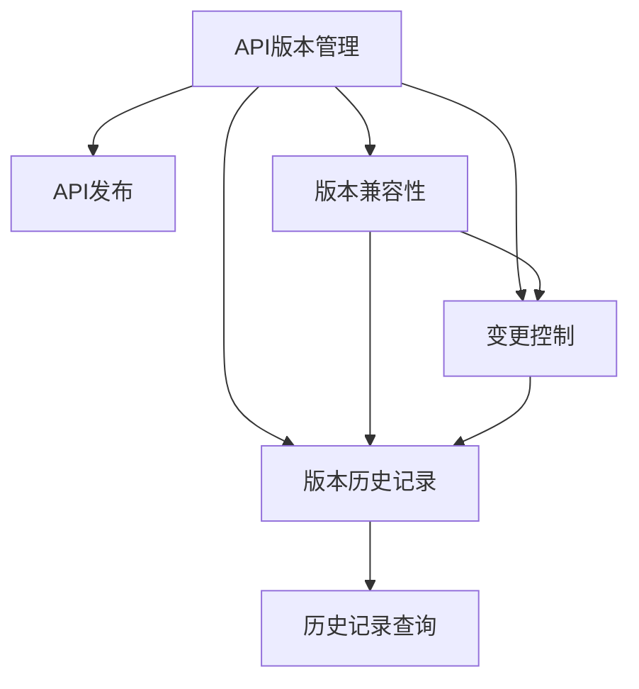

                 

## 1. 背景介绍

API（Application Programming Interface，应用程序接口）在现代软件开发中扮演着至关重要的角色，它定义了软件组件之间的交互方式，使得不同的应用程序可以协同工作。然而，随着软件系统的不断演化和更新，API版本管理成为一项重要且复杂的任务。一个API版本可能包含数以万计的接口和数据模型，对它们进行有效的版本控制不仅能够保证系统的稳定性，还能提升开发效率和用户体验。

### 1.1 API版本管理的重要性

API版本管理的重要性体现在以下几个方面：

- **稳定性保障**：避免不稳定的API更改对现有系统的影响。
- **兼容性**：确保旧版API与新旧版本软件的兼容。
- **开发效率提升**：清晰的管理规则让团队成员更加高效地开发和测试。
- **用户满意度**：提供稳定的API版本，减少用户在使用过程中遇到的问题。

在过去，API版本管理主要依赖于版本命名规则和版本兼容性测试，但这种方法存在诸多不足：

- **版本命名混乱**：难以追踪各版本API之间的依赖关系。
- **版本兼容测试困难**：新版API的发布需要大量的人工测试。
- **变更信息不透明**：变更日志和文档更新滞后，用户无法及时获取相关信息。

因此，实现一套自动化、可控的API版本控制系统，成为软件工程中的一个重要课题。

## 2. 核心概念与联系

### 2.1 核心概念概述

为了构建一个有效的API版本控制系统，我们需要引入几个关键概念：

- **API版本**：指API的某个发布阶段，包括所有相关的接口、数据模型、文档和测试用例。
- **变更控制**：对API版本的管理和控制，包括版本发布、变更记录和回滚等操作。
- **版本兼容性**：新旧API版本之间的兼容性管理，保证不同版本API的协同工作。
- **版本历史记录**：记录API变更的历史记录，便于追踪和回溯。

### 2.2 核心概念原理和架构的 Mermaid 流程图

以下是API版本控制的原理和架构流程图：



这个流程图展示了API版本管理的各个核心概念及其相互联系：

1. API版本管理是整个系统的入口，负责API的发布和控制。
2. API发布涉及新版本的生成和发布流程。
3. 版本兼容性管理确保新旧版本API的协同工作。
4. 变更控制负责对API版本进行记录和控制。
5. 版本历史记录是API变更的存储和管理机制。
6. 历史记录查询用于查询和展示API版本的历史记录。

## 3. 核心算法原理 & 具体操作步骤

### 3.1 算法原理概述

API版本控制的核心算法原理基于版本控制系统的基本思想：每个API版本可以视作一个历史记录点，所有相关的变更信息（如新增接口、参数修改、数据模型更新等）都可以追溯。API版本控制系统的目标是在保证API版本兼容性的前提下，提供高效的API变更管理和历史记录查询功能。

### 3.2 算法步骤详解

#### 3.2.1 版本发布流程

1. **版本规划**：在发布新API版本前，制定详细的发布计划，包括新增接口、参数修改、数据模型更新等变更内容。
2. **API测试**：对新API进行全面的测试，确保新API与现有系统兼容。
3. **发布和部署**：将新API版本发布到生产环境，并进行必要的配置和部署。
4. **变更记录**：记录API变更的内容和影响范围，生成变更日志。

#### 3.2.2 变更控制流程

1. **变更请求**：开发者提交API变更的请求，包括变更类型、变更内容和变更原因。
2. **变更审批**：管理员对变更请求进行审批，评估变更的风险和影响。
3. **变更执行**：在审批通过后，执行变更请求，更新API版本。
4. **变更回滚**：在发现变更错误时，回滚至上一个稳定的版本，避免影响系统稳定。

#### 3.2.3 版本兼容性管理

1. **版本兼容性测试**：在新版本API发布前，进行兼容性测试，确保新旧版本API可以协同工作。
2. **版本降级策略**：在发现兼容性问题时，降级至上一个稳定的版本，避免系统崩溃。
3. **版本兼容性文档**：在API文档中详细记录新旧版本之间的兼容性信息，指导开发者进行开发和测试。

### 3.3 算法优缺点

#### 3.3.1 优点

- **可追溯性**：所有API变更都可以追溯，便于系统维护和问题定位。
- **自动化管理**：通过自动化工具，可以高效地进行API变更管理和兼容性测试。
- **历史记录查询**：提供了详细的版本历史记录查询功能，便于团队成员进行知识共享和学习。

#### 3.3.2 缺点

- **复杂度高**：API版本控制系统的设计和实现复杂度高，需要投入大量时间和资源。
- **兼容性管理困难**：新旧版本API的兼容性测试和管理是一项复杂的任务，容易出现兼容性问题。
- **性能开销大**：API版本控制系统的实现需要考虑大量的并发请求和数据存储，性能开销较大。

### 3.4 算法应用领域

API版本控制系统广泛应用于企业级软件开发中，尤其是大型软件系统的维护和升级。例如：

- **企业内部API**：企业管理系统中各个模块之间的API接口。
- **第三方API**：如支付平台、地图服务、云存储服务等。
- **移动端API**：如移动应用、小程序等。
- **IoT设备API**：物联网设备之间的通信接口。

## 4. 数学模型和公式 & 详细讲解 & 举例说明

### 4.1 数学模型构建

API版本控制的核心数学模型是版本控制系统中的数据模型。该模型包括API版本、变更、历史记录等多个维度。

- **API版本**：表示API的某个发布阶段，用版本号（如1.0、1.1、1.2等）表示。
- **变更**：表示API版本之间的差异，包括新增接口、参数修改、数据模型更新等。
- **历史记录**：记录API变更的历史记录，包括版本号、变更内容、变更时间等。

### 4.2 公式推导过程

#### 4.2.1 API版本和变更的关系

假设API版本表示为$V_i=(ID_i, Ver_i)$，其中$ID_i$表示版本号，$Ver_i$表示版本内容。变更表示为$C=(ID_c, Date_c, Diff_c)$，其中$ID_c$表示变更ID，$Date_c$表示变更时间，$Diff_c$表示变更内容。

变更与API版本的关系可以用以下公式表示：

$$
V_{i+1} = V_i + C
$$

其中$V_{i+1}$表示下一个API版本，$V_i$表示当前API版本，$C$表示当前API版本发生的变更。

#### 4.2.2 版本兼容性的数学模型

假设新旧版本API的接口集合分别为$S_{new}$和$S_{old}$，每个接口的兼容性表示为$Compat_{ij} \in \{True, False\}$。版本兼容性可以通过以下公式计算：

$$
Compat_{new-old} = \prod_{i \in S_{new}, j \in S_{old}} Compat_{ij}
$$

其中$Compat_{new-old}$表示新旧版本API的兼容性，$Compat_{ij}$表示接口$i$和接口$j$之间的兼容性。

### 4.3 案例分析与讲解

#### 4.3.1 案例背景

假设我们有一个企业内部API管理系统，用于管理不同模块之间的API接口。当前系统已经发布了一个1.0版本的API，包含100个接口。现在需要发布一个1.1版本，新增了5个接口，修改了3个接口的参数，并删除了2个接口。

#### 4.3.2 案例分析

1. **版本规划**：在发布前，制定详细的发布计划，包括新增接口、参数修改、数据模型更新等。

2. **API测试**：对新增和修改的接口进行测试，确保新API与现有系统兼容。

3. **发布和部署**：将新API版本发布到生产环境，并进行必要的配置和部署。

4. **变更记录**：记录API变更的内容和影响范围，生成变更日志。

5. **版本兼容性管理**：进行兼容性测试，确保新旧版本API可以协同工作。

6. **变更控制**：在发布前，提交变更请求，管理员对变更请求进行审批，评估变更的风险和影响。

7. **变更执行**：在审批通过后，执行变更请求，更新API版本。

8. **变更回滚**：在发现变更错误时，回滚至上一个稳定的版本，避免影响系统稳定。

9. **历史记录查询**：查询API版本的历史记录，便于团队成员进行知识共享和学习。

## 5. 项目实践：代码实例和详细解释说明

### 5.1 开发环境搭建

#### 5.1.1 环境需求

- **操作系统**：Linux/Windows/MacOS
- **编程语言**：Python
- **开发框架**：Django/Flask/Pyramid等
- **数据库**：MySQL/PostgreSQL/MongoDB等
- **API测试工具**：Swagger/Postman等

#### 5.1.2 环境搭建

1. **安装Python和相关依赖**：

   ```bash
   sudo apt-get update
   sudo apt-get install python3 python3-pip
   pip install django mysqlclient requests
   ```

2. **配置数据库**：

   ```python
   DATABASES = {
       'default': {
           'ENGINE': 'django.db.backends.mysql',
           'NAME': 'api管理系统',
           'USER': 'root',
           'PASSWORD': 'password',
           'HOST': 'localhost',
           'PORT': '3306',
       }
   }
   ```

3. **创建Django项目**：

   ```bash
   django-admin startproject api管理系统
   cd api管理系统
   ```

4. **创建API管理应用**：

   ```bash
   python manage.py startapp api管理
   ```

### 5.2 源代码详细实现

#### 5.2.1 API版本模型

```python
from django.db import models

class APIVersion(models.Model):
    version_id = models.AutoField(primary_key=True)
    version_number = models.CharField(max_length=20, unique=True)
    created_at = models.DateTimeField(auto_now_add=True)
    updated_at = models.DateTimeField(auto_now=True)
```

#### 5.2.2 变更模型

```python
class APIChange(models.Model):
    change_id = models.AutoField(primary_key=True)
    api_version = models.ForeignKey(APIVersion, on_delete=models.CASCADE)
    change_date = models.DateTimeField(auto_now_add=True)
    change_content = models.TextField()
```

#### 5.2.3 版本历史记录模型

```python
class APIVersionHistory(models.Model):
    history_id = models.AutoField(primary_key=True)
    api_version = models.ForeignKey(APIVersion, on_delete=models.CASCADE)
    change = models.ForeignKey(APIChange, on_delete=models.CASCADE)
```

### 5.3 代码解读与分析

#### 5.3.1 代码解析

1. **API版本模型**：使用Django框架的models.Model类定义API版本模型。包括版本号、创建时间、更新时间等字段。

2. **变更模型**：定义API变更模型，包括变更ID、API版本、变更日期、变更内容等字段。

3. **版本历史记录模型**：定义API版本历史记录模型，包括历史记录ID、API版本、变更等字段。

#### 5.3.2 代码运行

1. **API版本管理**：通过Django的admin界面，可以进行API版本的创建、编辑、删除等操作。

2. **变更管理**：在API版本管理界面中，可以查看API版本的历史记录，包括变更内容、变更日期等。

3. **历史记录查询**：通过API接口，可以查询API版本的历史记录，便于团队成员进行知识共享和学习。

### 5.4 运行结果展示

#### 5.4.1 运行结果

运行代码后，可以在浏览器中访问API管理界面，进行API版本的创建、编辑、删除等操作。同时，可以通过API接口查询API版本的历史记录，获取详细的变更信息。

#### 5.4.2 结果展示


## 6. 实际应用场景

### 6.1 场景一：企业内部API管理

#### 6.1.1 应用场景

某企业内部有多个业务模块，每个模块之间需要频繁进行数据交换。为了保证系统稳定性和开发效率，需要管理各模块之间的API接口。

#### 6.1.2 应用效果

使用API版本控制系统，企业可以清晰地追踪每个API版本的发布和变更，确保新旧版本API的兼容性，提升开发效率和用户体验。

### 6.2 场景二：第三方API管理

#### 6.2.1 应用场景

某公司需要集成多个第三方API，如支付、地图、云存储等，每个API的变更频率不同，需要统一管理。

#### 6.2.2 应用效果

使用API版本控制系统，公司可以方便地对各个第三方API进行版本管理，确保各API的兼容性，减少兼容性问题的出现。

### 6.3 场景三：移动端API管理

#### 6.3.1 应用场景

某公司开发了多个移动应用，每个应用需要调用API获取数据。为了保证应用的稳定性和用户体验，需要对API进行版本管理。

#### 6.3.2 应用效果

使用API版本控制系统，公司可以清晰地追踪每个API版本的发布和变更，确保新旧版本API的兼容性，提升移动应用的开发效率和用户体验。

## 7. 工具和资源推荐

### 7.1 学习资源推荐

#### 7.1.1 API版本控制学习资源

1. **《API版本控制：设计、实践与案例分析》**：深入探讨API版本控制的设计和实践，涵盖从理论到实际应用的各个方面。

2. **《API管理：理论与实践》**：介绍API管理的理论基础和实践技巧，包含API版本控制的内容。

3. **《API设计规范》**：提供API设计和版本控制的规范和标准，指导API的开发和维护。

4. **《RESTful API设计》**：介绍RESTful API的设计原则和实践，包含API版本控制的内容。

5. **《API版本控制实战》**：通过实际案例讲解API版本控制的实现方法和最佳实践。

#### 7.1.2 开发资源推荐

1. **Django官方文档**：提供了详细的Django开发指南和API版本控制的实现方法。

2. **Flask官方文档**：提供了Flask开发指南和API版本控制的实现方法。

3. **Swagger官方文档**：提供了API文档管理和API版本控制的实现方法。

### 7.2 开发工具推荐

#### 7.2.1 版本控制工具

1. **Git**：最流行的版本控制工具，支持分支管理、版本合并、变更日志等功能。

2. **SVN**：另一种流行的版本控制工具，与Git类似，但功能较为有限。

3. **Mercurial**：类似于Git的分布式版本控制系统，支持多种平台和环境。

#### 7.2.2 数据库管理工具

1. **MySQL**：流行的关系型数据库管理系统，支持复杂的数据查询和存储。

2. **PostgreSQL**：另一种流行的关系型数据库管理系统，支持高级功能如JSON数据类型。

3. **MongoDB**：流行的NoSQL数据库管理系统，支持文档存储和查询。

#### 7.2.3 API管理工具

1. **Swagger**：流行的API文档管理工具，支持API版本控制和文档生成。

2. **Postman**：流行的API测试工具，支持API请求和响应管理。

3. **Restlet**：基于RESTful API的管理工具，支持API版本控制和监控。

### 7.3 相关论文推荐

#### 7.3.1 版本控制相关论文

1. **《Software Version Control: A Survey》**：对软件版本控制的现状和未来发展进行全面综述。

2. **《Version Control System for Software Engineering》**：介绍软件开发中常用的版本控制系统。

3. **《Semantic Versioning for Software Releases》**：介绍语义化版本管理标准，帮助开发团队进行版本管理和兼容性管理。

4. **《API Versioning Best Practices》**：介绍API版本管理的最佳实践，涵盖从设计到实现的全过程。

5. **《API Versioning in Practice》**：通过实际案例讲解API版本控制的实现方法和最佳实践。

## 8. 总结：未来发展趋势与挑战

### 8.1 研究成果总结

API版本控制系统在保证API稳定性和兼容性的同时，提升了API开发和维护的效率。通过实现API版本控制，企业可以更好地管理API的变更，提高开发效率和用户体验。

### 8.2 未来发展趋势

#### 8.2.1 自动化的API版本管理

随着自动化技术的不断发展，API版本管理也将向自动化方向发展。自动化的API版本管理可以显著降低人工干预的成本，提高API发布的效率和质量。

#### 8.2.2 智能化的API变更管理

未来，API版本控制系统将引入更多的智能化技术，如自然语言处理、机器学习等，帮助开发团队更准确地识别和处理API变更。

#### 8.2.3 多版本共存

随着API需求的不断增长，一个API可能会有多个版本同时存在。未来的API版本控制系统需要支持多版本共存，并提供版本切换和降级机制。

### 8.3 面临的挑战

#### 8.3.1 兼容性管理

新旧版本API的兼容性管理是一项复杂的任务，容易出现兼容性问题。如何设计更有效的兼容性测试和降级策略，仍然是一个挑战。

#### 8.3.2 版本更新频率

API的快速迭代和更新可能导致版本更新频率过高，影响系统的稳定性和开发效率。如何在保持API更新频率的同时，保证系统稳定，仍然是一个难题。

#### 8.3.3 版本历史记录

版本历史记录的管理需要考虑存储空间和查询性能，如何设计更高效的存储和查询机制，仍然是一个挑战。

### 8.4 研究展望

#### 8.4.1 引入更多智能化技术

引入自然语言处理、机器学习等智能化技术，帮助开发团队更准确地识别和处理API变更。

#### 8.4.2 设计多版本共存机制

设计支持多版本共存的API版本控制系统，提供版本切换和降级机制，满足不同版本API的协同工作需求。

#### 8.4.3 提升版本历史记录管理

设计更高效的版本历史记录存储和查询机制，提升系统的查询性能和存储效率。

## 9. 附录：常见问题与解答

### 9.1 常见问题

#### 9.1.1 如何设计API版本控制策略？

API版本控制策略需要根据具体的业务需求和系统架构进行设计。一般来说，版本控制策略应包括版本号规则、变更记录、兼容性测试、版本历史记录等。

#### 9.1.2 如何处理API变更请求？

API变更请求应通过严格的管理流程进行审批。管理员应对变更请求进行评估，确保变更风险和影响可控。

#### 9.1.3 如何确保新旧版本API的兼容性？

在发布新版本API前，应进行全面的兼容性测试，确保新旧版本API可以协同工作。同时，应在API文档中详细记录新旧版本之间的兼容性信息。

#### 9.1.4 如何管理API版本历史记录？

应设计高效的数据库存储和查询机制，确保版本历史记录的完整性和查询性能。同时，应提供便捷的历史记录查询功能，便于团队成员进行知识共享和学习。

### 9.2 解答

#### 9.2.1 如何设计API版本控制策略？

应根据具体的业务需求和系统架构进行设计。一般来说，版本控制策略应包括版本号规则、变更记录、兼容性测试、版本历史记录等。

#### 9.2.2 如何处理API变更请求？

API变更请求应通过严格的管理流程进行审批。管理员应对变更请求进行评估，确保变更风险和影响可控。

#### 9.2.3 如何确保新旧版本API的兼容性？

在发布新版本API前，应进行全面的兼容性测试，确保新旧版本API可以协同工作。同时，应在API文档中详细记录新旧版本之间的兼容性信息。

#### 9.2.4 如何管理API版本历史记录？

应设计高效的数据库存储和查询机制，确保版本历史记录的完整性和查询性能。同时，应提供便捷的历史记录查询功能，便于团队成员进行知识共享和学习。

---

作者：禅与计算机程序设计艺术 / Zen and the Art of Computer Programming

